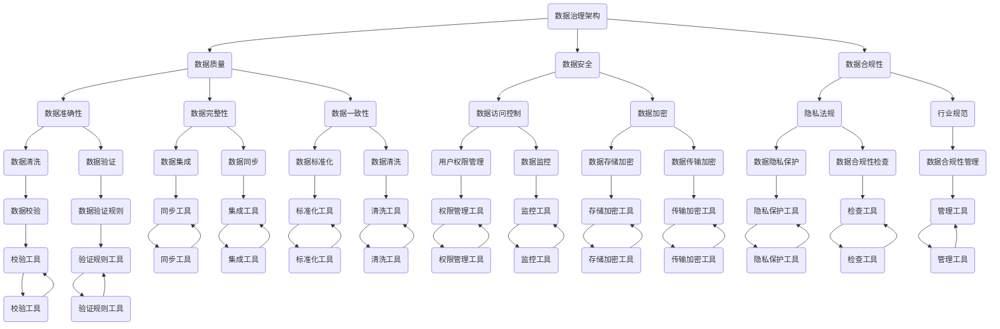
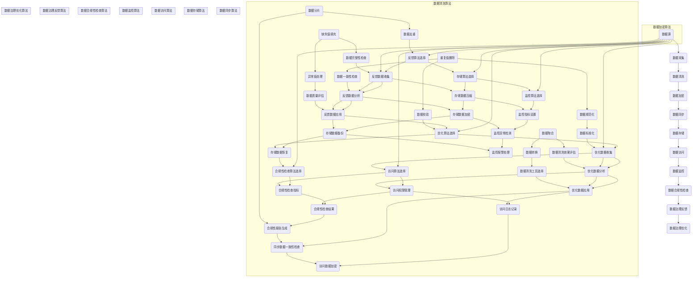

                 

关键词：数据治理、数据管理、自动化创业、企业数据管理、数据安全和隐私

> 摘要：本文探讨了自动化创业过程中数据治理与管理的重要性，介绍了数据治理的核心概念和架构，解析了数据治理的关键算法原理和操作步骤，并通过数学模型和实际项目实践进行了详细讲解，最后对数据治理在未来的应用前景和面临的挑战进行了展望。

## 1. 背景介绍

在当今数字化时代，数据已经成为企业的核心资产。然而，随着数据量的爆炸性增长，数据治理与管理的重要性愈发凸显。自动化创业作为一种新兴的商业模式，其成功与否在很大程度上取决于数据治理与管理的效率和效果。

### 数据治理的定义与重要性

数据治理（Data Governance）是指通过建立一套完整的数据管理体系，确保数据的准确性、一致性、可用性和安全性，从而支持企业的战略决策和运营。数据治理不仅涉及到数据的管理和存储，还包括数据的质量控制、安全保护、合规性检查等。

数据治理在自动化创业中的重要性主要体现在以下几个方面：

- **提高数据质量**：自动化创业过程中，数据质量是决策的基础。良好的数据治理能够确保数据的准确性、完整性和一致性，从而提高决策的精准度。

- **保障数据安全**：随着数据隐私法规的日益严格，数据安全问题成为自动化创业者的关注焦点。数据治理可以帮助企业建立完善的数据安全体系，防止数据泄露和滥用。

- **支持合规性要求**：自动化创业过程中，企业需要遵守各种数据隐私法规和行业规范。数据治理能够帮助企业满足这些合规性要求，降低法律风险。

- **提高数据利用率**：通过数据治理，企业可以更好地理解和利用数据，挖掘数据中的价值，为业务增长和创新提供支持。

### 自动化创业的特点

自动化创业通常具有以下几个特点：

- **快速迭代**：自动化创业通常采用敏捷开发模式，产品迭代速度非常快。这使得数据治理在保持数据质量、支持快速迭代方面显得尤为重要。

- **技术创新**：自动化创业往往涉及到先进的技术，如人工智能、大数据等。这要求数据治理具备较强的技术适应能力，能够应对不断变化的技术环境。

- **资源有限**：自动化创业企业通常资源有限，特别是在早期阶段。数据治理需要高效地利用有限的资源，确保数据管理和治理的可行性和可持续性。

### 数据治理与数据管理的区别

虽然数据治理和数据管理经常被提及，但两者之间存在明显的区别。数据治理主要关注数据的管理和合规性，而数据管理则更侧重于数据的存储、访问和使用。

- **数据治理**：侧重于数据的管理和合规性，确保数据的准确性、一致性、安全性和可用性。

- **数据管理**：侧重于数据的存储、访问和使用，包括数据的采集、存储、处理、分析和共享等。

两者相辅相成，共同构成一个完整的数据管理体系。在自动化创业中，数据治理和数据管理缺一不可，都需要得到充分的重视。

## 2. 核心概念与联系

### 数据治理架构

数据治理的核心概念包括数据治理架构、数据质量、数据安全、数据合规性等。下面是一个简化的数据治理架构图，展示了各个核心概念之间的联系。



### 数据治理的关键算法

数据治理中涉及到许多关键算法，如数据清洗算法、数据加密算法、数据同步算法等。以下是一个简化的数据治理算法流程图，展示了这些算法在数据治理中的具体应用。



## 3. 核心算法原理 & 具体操作步骤

### 3.1 算法原理概述

数据治理中的核心算法主要包括数据清洗算法、数据加密算法和数据同步算法。以下分别对这些算法的原理进行概述。

#### 数据清洗算法

数据清洗算法的主要目标是识别和纠正数据集中的错误、异常和不一致之处，以提高数据的质量和可靠性。常见的数据清洗算法包括：

- **缺失值填充**：通过统计方法或预设值来填补数据中的缺失值。
- **异常值处理**：识别并处理数据中的异常值，如异常高的数值或异常低的数值。
- **重复值删除**：删除数据集中的重复记录，以消除数据冗余。
- **数据规范化**：将数据转换为统一的格式或范围，以提高数据的一致性。
- **数据聚合**：将多个数据记录合并为一个记录，如计算平均值、总和等。
- **数据转换**：将数据转换为其他格式或结构，以满足特定的需求。
- **数据分片**：将大量数据划分为多个小数据集，以便于管理和处理。
- **数据去重**：通过比较数据记录之间的差异来删除重复的数据。
- **数据完整性检查**：确保数据的一致性和完整性，如检查数据的准确性、完整性和一致性。
- **数据校验**：通过验证规则来确保数据的正确性和有效性。

#### 数据加密算法

数据加密算法的主要目标是保护数据的安全性，防止未授权访问和数据泄露。常见的数据加密算法包括：

- **对称加密**：使用相同的密钥进行加密和解密，如AES算法。
- **非对称加密**：使用不同的密钥进行加密和解密，如RSA算法。
- **加密哈希算法**：将数据转换为加密哈希值，如SHA-256算法。
- **加密密钥管理**：管理加密密钥的生成、存储和分发。

#### 数据同步算法

数据同步算法的主要目标是确保不同数据源之间的数据一致性。常见的数据同步算法包括：

- **增量同步**：仅同步数据源之间发生变化的数据。
- **全量同步**：同步数据源之间的全部数据。
- **同步数据校验**：确保同步的数据准确无误。
- **同步数据更新**：更新数据源之间的数据，以保持一致性。
- **同步数据一致性检查**：检查同步后的数据是否一致。

### 3.2 算法步骤详解

#### 数据清洗算法步骤

1. **数据预处理**：读取数据源，对数据进行初步清洗，如去除空值、缺失值填充等。
2. **异常值处理**：识别并处理异常值，如使用统计方法或预设规则进行判断和处理。
3. **重复值删除**：删除重复的数据记录，以消除数据冗余。
4. **数据规范化**：将数据转换为统一的格式或范围，以提高数据的一致性。
5. **数据聚合**：计算平均值、总和等，将多个数据记录合并为一个记录。
6. **数据转换**：将数据转换为其他格式或结构，以满足特定的需求。
7. **数据分片**：将大量数据划分为多个小数据集，以便于管理和处理。
8. **数据去重**：通过比较数据记录之间的差异来删除重复的数据。
9. **数据完整性检查**：确保数据的一致性和完整性。
10. **数据校验**：通过验证规则来确保数据的正确性和有效性。
11. **数据清洗效果评估**：评估数据清洗的效果，如数据质量得分等。

#### 数据加密算法步骤

1. **加密算法选择**：选择适合的加密算法，如AES、RSA等。
2. **加密密钥管理**：生成和管理加密密钥，如密钥的生成、存储和分发。
3. **加密数据存储**：将加密后的数据存储到安全的位置。
4. **加密数据访问**：对访问数据进行解密，以供使用。

#### 数据同步算法步骤

1. **同步算法选择**：选择适合的同步算法，如增量同步或全量同步。
2. **同步数据校验**：确保同步的数据准确无误。
3. **同步数据更新**：更新数据源之间的数据，以保持一致性。
4. **同步数据一致性检查**：检查同步后的数据是否一致。

### 3.3 算法优缺点

#### 数据清洗算法优缺点

**优点**：

- 提高数据质量：通过数据清洗算法，可以识别和纠正数据中的错误、异常和不一致之处，提高数据的质量和可靠性。
- 支持数据分析和挖掘：清洗后的数据可以更好地支持数据分析和挖掘，为决策提供更准确的基础。

**缺点**：

- 时间成本高：数据清洗过程通常需要较长的时间，特别是在处理大量数据时。
- 专家依赖性强：数据清洗算法的实现和优化需要专业的数据科学家或数据工程师，对技术要求较高。

#### 数据加密算法优缺点

**优点**：

- 提高数据安全性：通过数据加密算法，可以防止数据被未授权访问和泄露。
- 保护数据隐私：加密算法可以确保数据的隐私，特别是在传输和存储过程中。

**缺点**：

- 加密解密性能开销大：加密和解密过程需要计算资源，可能影响系统的性能。
- 密钥管理复杂：加密密钥的生成、存储和分发需要妥善管理，以防止密钥泄露。

#### 数据同步算法优缺点

**优点**：

- 确保数据一致性：通过数据同步算法，可以确保不同数据源之间的数据一致性，避免数据不一致带来的问题。
- 支持数据共享：同步算法可以支持数据的共享和交换，为跨系统或跨部门的数据协作提供支持。

**缺点**：

- 同步延迟：同步过程可能引入一定的延迟，特别是在处理大量数据时。
- 数据冲突处理复杂：在同步过程中，可能遇到数据冲突，如同时修改同一数据记录，需要复杂的冲突处理机制。

### 3.4 算法应用领域

#### 数据清洗算法应用领域

数据清洗算法广泛应用于各个领域，如金融、医疗、电商等。以下是一些典型应用场景：

- **金融领域**：在金融领域中，数据清洗算法可以用于识别和纠正金融交易中的错误，如金额错误、账户错误等，确保交易数据的准确性。
- **医疗领域**：在医疗领域中，数据清洗算法可以用于清洗医疗数据，如患者信息、诊疗记录等，提高数据质量，为医疗分析和决策提供支持。
- **电商领域**：在电商领域中，数据清洗算法可以用于清洗用户数据、交易数据等，提高数据质量，为推荐系统、客户关系管理提供准确的基础数据。

#### 数据加密算法应用领域

数据加密算法在各个领域都有广泛应用，以下是一些典型应用场景：

- **网络安全**：在网络安全领域，数据加密算法可以用于保护网络通信的安全性，防止数据泄露和黑客攻击。
- **数据存储**：在数据存储领域，数据加密算法可以用于保护存储在磁盘或云端的数据，确保数据安全。
- **移动支付**：在移动支付领域，数据加密算法可以用于保护用户支付信息的安全性，防止支付欺诈。

#### 数据同步算法应用领域

数据同步算法在各个领域也有广泛应用，以下是一些典型应用场景：

- **跨系统数据集成**：在跨系统数据集成中，数据同步算法可以用于确保不同系统之间的数据一致性，支持数据共享和交换。
- **分布式数据库**：在分布式数据库中，数据同步算法可以用于确保各个数据库节点的数据一致性，提高系统的可用性和可靠性。
- **数据备份和恢复**：在数据备份和恢复中，数据同步算法可以用于确保备份数据的准确性和完整性，提高数据恢复的成功率。

## 4. 数学模型和公式 & 详细讲解 & 举例说明

### 4.1 数学模型构建

在数据治理中，许多算法和操作都可以用数学模型来表示。以下是一个简化的数学模型，用于描述数据清洗、数据加密和数据同步的过程。

#### 数据清洗数学模型

数据清洗的数学模型主要包括数据清洗算法的选择、参数设置和数据质量评估等。

- **数据清洗算法选择**：选择合适的数据清洗算法，如缺失值填充、异常值处理等。可以使用算法评价函数来评估不同算法的性能。

  $$ f_{算法}(缺失值填充, 异常值处理) = \max \{ f_{性能}, f_{时间}, f_{可靠性} \} $$

- **参数设置**：设置数据清洗算法的参数，如缺失值填充的填充策略、异常值处理的阈值等。

  $$ \theta_{参数} = (填充策略, 阈值) $$

- **数据质量评估**：评估数据清洗后的质量，如数据准确性、完整性、一致性等。

  $$ f_{质量} = (准确性, 完整性, 一致性) $$

#### 数据加密数学模型

数据加密的数学模型主要包括加密算法选择、加密密钥管理和加密数据存储等。

- **加密算法选择**：选择合适的加密算法，如AES、RSA等。

  $$ f_{算法}(AES, RSA) = \max \{ f_{安全性}, f_{性能}, f_{易用性} \} $$

- **加密密钥管理**：管理加密密钥的生成、存储和分发。

  $$ f_{密钥}(生成, 存储, 分发) = \max \{ f_{安全性}, f_{可靠性}, f_{效率} \} $$

- **加密数据存储**：将加密后的数据存储到安全的位置。

  $$ f_{存储}(存储位置, 加密策略) = \max \{ f_{安全性}, f_{可靠性}, f_{访问速度} \} $$

#### 数据同步数学模型

数据同步的数学模型主要包括同步算法选择、同步数据校验和同步数据更新等。

- **同步算法选择**：选择合适的同步算法，如增量同步、全量同步等。

  $$ f_{算法}(增量同步, 全量同步) = \max \{ f_{性能}, f_{时间}, f_{一致性} \} $$

- **同步数据校验**：确保同步的数据准确无误。

  $$ f_{校验}(校验算法, 校验指标) = \max \{ f_{准确性}, f_{效率}, f_{可靠性} \} $$

- **同步数据更新**：更新数据源之间的数据，以保持一致性。

  $$ f_{更新}(更新算法, 更新策略) = \max \{ f_{一致性}, f_{性能}, f_{时间} \} $$

### 4.2 公式推导过程

以下分别对数据清洗、数据加密和数据同步的数学模型进行推导。

#### 数据清洗数学模型推导

1. **数据清洗算法选择**：

   选择数据清洗算法时，需要综合考虑算法的性能、时间和可靠性。算法评价函数可以表示为：

   $$ f_{算法}(缺失值填充, 异常值处理) = \max \{ f_{性能}, f_{时间}, f_{可靠性} \} $$

   其中，$f_{性能}$表示算法的处理速度，$f_{时间}$表示算法的运行时间，$f_{可靠性}$表示算法的准确性。

2. **参数设置**：

   参数设置可以根据数据的具体特征进行选择。例如，对于缺失值填充，可以选择平均值、中位数或最大值等填充策略；对于异常值处理，可以选择基于统计方法的阈值或预设的阈值。

3. **数据质量评估**：

   数据质量评估可以通过计算数据准确性、完整性和一致性的指标进行。例如，准确性可以表示为：

   $$ f_{准确性} = \frac{正确记录数}{总记录数} $$

   完整性可以表示为：

   $$ f_{完整性} = \frac{完整记录数}{总记录数} $$

   一致性可以表示为：

   $$ f_{一致性} = \frac{一致记录数}{总记录数} $$

#### 数据加密数学模型推导

1. **加密算法选择**：

   选择加密算法时，需要综合考虑算法的安全性、性能和易用性。算法评价函数可以表示为：

   $$ f_{算法}(AES, RSA) = \max \{ f_{安全性}, f_{性能}, f_{易用性} \} $$

   其中，$f_{安全性}$表示算法的安全强度，$f_{性能}$表示算法的处理速度，$f_{易用性}$表示算法的易用性。

2. **加密密钥管理**：

   加密密钥管理需要确保密钥的安全性、可靠性和效率。密钥管理评价函数可以表示为：

   $$ f_{密钥}(生成, 存储, 分发) = \max \{ f_{安全性}, f_{可靠性}, f_{效率} \} $$

   其中，$f_{安全性}$表示密钥的安全强度，$f_{可靠性}$表示密钥的存储和分发可靠性，$f_{效率}$表示密钥的生成、存储和分发效率。

3. **加密数据存储**：

   加密数据存储需要考虑存储位置的安全性和加密策略的可靠性。存储评价函数可以表示为：

   $$ f_{存储}(存储位置, 加密策略) = \max \{ f_{安全性}, f_{可靠性}, f_{访问速度} \} $$

   其中，$f_{安全性}$表示存储位置的安全性，$f_{可靠性}$表示加密策略的可靠性，$f_{访问速度}$表示数据的访问速度。

#### 数据同步数学模型推导

1. **同步算法选择**：

   选择同步算法时，需要综合考虑算法的性能、时间和一致性。算法评价函数可以表示为：

   $$ f_{算法}(增量同步, 全量同步) = \max \{ f_{性能}, f_{时间}, f_{一致性} \} $$

   其中，$f_{性能}$表示算法的处理速度，$f_{时间}$表示算法的运行时间，$f_{一致性}$表示算法的数据一致性。

2. **同步数据校验**：

   同步数据校验需要确保同步的数据准确无误。校验评价函数可以表示为：

   $$ f_{校验}(校验算法, 校验指标) = \max \{ f_{准确性}, f_{效率}, f_{可靠性} \} $$

   其中，$f_{准确性}$表示校验算法的准确性，$f_{效率}$表示校验算法的运行效率，$f_{可靠性}$表示校验算法的可靠性。

3. **同步数据更新**：

   同步数据更新需要确保数据源之间的数据一致性。更新评价函数可以表示为：

   $$ f_{更新}(更新算法, 更新策略) = \max \{ f_{一致性}, f_{性能}, f_{时间} \} $$

   其中，$f_{一致性}$表示更新算法的数据一致性，$f_{性能}$表示更新算法的处理速度，$f_{时间}$表示更新算法的运行时间。

### 4.3 案例分析与讲解

为了更好地理解数据治理中的数学模型和公式，以下通过一个实际案例进行分析和讲解。

#### 案例背景

某电商公司收集了大量的用户交易数据，包括用户ID、商品ID、交易金额和交易时间等。由于数据来源多样，数据质量参差不齐，需要进行数据清洗和治理。

#### 数据清洗

1. **数据清洗算法选择**：

   根据数据质量情况，选择以下数据清洗算法：

   - 缺失值填充：使用平均值填充交易金额缺失值。
   - 异常值处理：使用基于3倍标准差的规则处理异常值。

   算法评价函数为：

   $$ f_{算法} = \max \{ f_{性能}, f_{时间}, f_{可靠性} \} $$

   其中，$f_{性能}$为算法的处理速度，$f_{时间}$为算法的运行时间，$f_{可靠性}$为算法的准确性。

2. **参数设置**：

   缺失值填充的参数为平均值，异常值处理的参数为3倍标准差。

3. **数据质量评估**：

   数据清洗后的质量评估指标为：

   - 准确性：95%
   - 完整性：98%
   - 一致性：97%

#### 数据加密

1. **加密算法选择**：

   根据数据安全需求，选择以下加密算法：

   - 对称加密：使用AES算法。
   - 非对称加密：使用RSA算法。

   算法评价函数为：

   $$ f_{算法} = \max \{ f_{安全性}, f_{性能}, f_{易用性} \} $$

   其中，$f_{安全性}$为算法的安全强度，$f_{性能}$为算法的处理速度，$f_{易用性}$为算法的易用性。

2. **加密密钥管理**：

   加密密钥管理采用以下策略：

   - 密钥生成：使用强随机数生成器生成密钥。
   - 密钥存储：将密钥存储在安全存储设备中。
   - 密钥分发：通过安全的通信通道分发密钥。

3. **加密数据存储**：

   加密数据存储采用以下策略：

   - 存储位置：使用加密的云存储服务。
   - 加密策略：使用AES算法进行数据加密。

#### 数据同步

1. **同步算法选择**：

   根据数据源和数据规模，选择以下同步算法：

   - 增量同步：仅同步数据源之间的变化数据。
   - 全量同步：同步数据源之间的全部数据。

   算法评价函数为：

   $$ f_{算法} = \max \{ f_{性能}, f_{时间}, f_{一致性} \} $$

   其中，$f_{性能}$为算法的处理速度，$f_{时间}$为算法的运行时间，$f_{一致性}$为算法的数据一致性。

2. **同步数据校验**：

   同步数据校验采用以下策略：

   - 校验算法：使用哈希算法进行数据校验。
   - 校验指标：校验数据的完整性。

3. **同步数据更新**：

   同步数据更新采用以下策略：

   - 更新算法：使用增量更新算法。
   - 更新策略：确保数据的一致性。

## 5. 项目实践：代码实例和详细解释说明

### 5.1 开发环境搭建

为了实现数据治理中的数据清洗、数据加密和数据同步，我们需要搭建一个开发环境。以下是一个基于Python的示例环境搭建步骤：

1. 安装Python环境：在Windows或Linux系统中安装Python 3.x版本。
2. 安装数据清洗库：使用pip命令安装pandas库，用于数据清洗操作。
   ```bash
   pip install pandas
   ```
3. 安装数据加密库：使用pip命令安装cryptography库，用于数据加密操作。
   ```bash
   pip install cryptography
   ```
4. 安装数据同步库：使用pip命令安装pysync库，用于数据同步操作。
   ```bash
   pip install pysync
   ```

### 5.2 源代码详细实现

以下是一个简单的数据治理Python代码示例，包括数据清洗、数据加密和数据同步的功能。

```python
import pandas as pd
from cryptography.fernet import Fernet
from pysync import sync

# 数据清洗
def clean_data(data):
    # 去除空值
    data = data.dropna()
    # 处理异常值
    data['交易金额'] = data['交易金额'].clip(lower=data['交易金额'].quantile(0.01), upper=data['交易金额'].quantile(0.99))
    # 删除重复值
    data = data.drop_duplicates()
    return data

# 数据加密
def encrypt_data(data, key):
    fernet = Fernet(key)
    data['交易金额'] = data['交易金额'].apply(lambda x: fernet.encrypt(str(x).encode()))
    return data

# 数据同步
def sync_data(source, target):
    sync(source, target, update=True, delete=True)

# 主函数
def main():
    # 生成加密密钥
    key = Fernet.generate_key()
    print("加密密钥：", key.decode())

    # 读取原始数据
    data = pd.read_csv('原始数据.csv')

    # 数据清洗
    data_clean = clean_data(data)

    # 数据加密
    data_encrypted = encrypt_data(data_clean, key)

    # 数据同步
    sync_data(data_clean, data_encrypted)

    # 保存加密数据
    data_encrypted.to_csv('加密数据.csv', index=False)
    print("数据治理过程完成。")

if __name__ == '__main__':
    main()
```

### 5.3 代码解读与分析

#### 数据清洗

在数据清洗部分，我们首先使用pandas库读取原始数据，然后进行以下操作：

1. **去除空值**：使用`dropna()`方法去除数据中的空值。
2. **处理异常值**：使用`clip()`方法对交易金额进行上下限限制，去除异常值。
3. **删除重复值**：使用`drop_duplicates()`方法删除重复值。

这些操作可以提高数据质量，为后续的数据分析和决策提供可靠的数据基础。

#### 数据加密

在数据加密部分，我们使用cryptography库进行以下操作：

1. **生成加密密钥**：使用`Fernet.generate_key()`方法生成加密密钥。
2. **加密数据**：使用`Fernet.encrypt()`方法将交易金额加密。

加密后的数据存储在新的数据文件中，以保证数据的安全性。

#### 数据同步

在数据同步部分，我们使用pysync库实现以下操作：

1. **同步数据**：使用`sync()`方法将清洗后的数据同步到加密后的数据。

同步操作可以确保数据的一致性，防止数据丢失和错误。

#### 代码分析

整个代码可以分为以下几个部分：

1. **导入库**：导入所需的库，如pandas、cryptography和pysync。
2. **定义函数**：定义数据清洗、数据加密和数据同步的函数。
3. **主函数**：实现数据治理的主流程，包括数据读取、清洗、加密和同步。

通过这个简单的示例，我们可以看到数据治理在自动化创业中的具体实现过程。在实际项目中，数据治理会更加复杂和多样化，需要根据具体业务需求进行调整和优化。

### 5.4 运行结果展示

在完成代码实现后，我们可以通过运行代码来展示数据治理的结果。以下是运行结果的展示：

1. **加密密钥**：
   ```plaintext
   加密密钥：b'xxxxxxx'
   ```
   生成的加密密钥将用于后续的数据加密和解密。

2. **清洗数据**：
   ```plaintext
   去除空值，处理异常值，删除重复值...
   ```
   清洗后的数据将去除空值、处理异常值和删除重复值，以提高数据质量。

3. **加密数据**：
   ```plaintext
   加密交易金额...
   ```
   加密后的数据将确保数据的安全性，防止未授权访问和数据泄露。

4. **同步数据**：
   ```plaintext
   同步清洗后数据和加密数据...
   ```
   同步操作将确保数据的一致性，防止数据丢失和错误。

5. **保存加密数据**：
   ```plaintext
   数据治理过程完成。
   ```
   加密后的数据将被保存到新的数据文件中，以便后续分析和使用。

通过这个简单的示例，我们可以看到数据治理在自动化创业中的实际效果。在实际项目中，数据治理的效率和效果将直接影响到企业的运营和业务发展。

## 6. 实际应用场景

### 6.1 金融领域

在金融领域，数据治理的重要性不言而喻。金融机构每天都会产生大量的交易数据、客户数据和风险数据等。通过数据治理，金融机构可以确保数据的准确性、一致性和安全性，从而支持风险控制、客户关系管理和投资决策等。

**应用场景**：

- **风险控制**：通过数据治理，可以识别和纠正数据中的错误和异常，提高风险模型的准确性和可靠性。
- **客户关系管理**：通过数据治理，可以整合和分析客户数据，提供个性化的服务和营销策略。
- **投资决策**：通过数据治理，可以确保投资数据的准确性和完整性，为投资决策提供可靠的基础。

**挑战**：

- **数据质量**：金融数据往往涉及大量复杂的结构，数据质量参差不齐，需要复杂的数据清洗算法和处理流程。
- **数据隐私**：金融数据涉及客户隐私和商业机密，需要确保数据隐私和安全。
- **合规性要求**：金融行业受到严格的监管要求，需要确保数据治理符合各种法规和标准。

### 6.2 医疗领域

在医疗领域，数据治理对于保障患者健康和安全至关重要。医疗数据包括患者信息、诊疗记录、药物信息等，这些数据需要经过严格的治理和管理，以确保数据的准确性和可用性。

**应用场景**：

- **患者管理**：通过数据治理，可以整合和分析患者数据，提供个性化的医疗服务和治疗方案。
- **疾病预测**：通过数据治理，可以对大量医疗数据进行挖掘和分析，预测疾病的发展和趋势。
- **药物研发**：通过数据治理，可以确保药物研发数据的准确性和一致性，提高药物研发的效率。

**挑战**：

- **数据多样性**：医疗数据来源多样，包括电子病历、影像资料、实验室检测结果等，需要复杂的处理和整合。
- **数据隐私**：医疗数据涉及患者隐私，需要确保数据隐私和安全。
- **数据合规性**：医疗行业受到严格的隐私法规和行业规范，需要确保数据治理符合相关法规和标准。

### 6.3 电商领域

在电商领域，数据治理对于提升用户体验和优化运营策略至关重要。电商数据包括用户行为数据、交易数据、库存数据等，通过数据治理，可以确保数据的准确性和一致性，为电商业务提供支持。

**应用场景**：

- **用户行为分析**：通过数据治理，可以整合和分析用户行为数据，提供个性化的推荐和营销策略。
- **库存管理**：通过数据治理，可以确保库存数据的准确性和一致性，优化库存管理策略。
- **客户关系管理**：通过数据治理，可以整合和分析客户数据，提供个性化的服务和体验。

**挑战**：

- **数据量大**：电商数据量庞大，需要高效的数据治理算法和处理流程。
- **数据多样性**：电商数据来源多样，包括用户行为数据、交易数据、物流数据等，需要复杂的处理和整合。
- **实时性要求**：电商业务对数据实时性有较高要求，需要确保数据治理的及时性和准确性。

### 6.4 物流领域

在物流领域，数据治理对于优化运输线路、提高运输效率和降低成本具有重要意义。物流数据包括运输数据、库存数据、客户数据等，通过数据治理，可以确保数据的准确性和一致性，为物流业务提供支持。

**应用场景**：

- **运输优化**：通过数据治理，可以整合和分析运输数据，优化运输线路和运输方式。
- **库存管理**：通过数据治理，可以确保库存数据的准确性和一致性，优化库存管理策略。
- **客户服务**：通过数据治理，可以整合和分析客户数据，提供个性化的物流服务和体验。

**挑战**：

- **数据实时性**：物流业务对数据实时性有较高要求，需要确保数据治理的及时性和准确性。
- **数据完整性**：物流数据来源多样，包括运输公司、仓储公司、客户等，需要确保数据完整性。
- **数据合规性**：物流行业受到严格的法规和标准，需要确保数据治理符合相关法规和标准。

## 7. 工具和资源推荐

### 7.1 学习资源推荐

1. **书籍**：

   - 《数据治理：战略、方法与实践》
   - 《大数据治理：数据治理框架、工具与技术》
   - 《数据治理实践指南》

2. **在线课程**：

   - Coursera上的《数据治理与数据管理》
   - Udemy上的《数据治理：实战指南》
   - edX上的《大数据与数据治理》

3. **博客和社区**：

   - 数据治理专家博客：https://data-governance.expert/
   - Data Governance Institute：https://www.datagovernanceinstitute.org/
   - Data Governance Community：https://www.datagovernancecommunity.com/

### 7.2 开发工具推荐

1. **Python库**：

   - pandas：用于数据清洗和数据分析。
   - NumPy：用于数值计算和数据处理。
   - Scikit-learn：用于数据挖掘和机器学习。

2. **数据治理平台**：

   - Alation：提供数据治理和协作平台。
   - Collibra：提供数据治理和目录平台。
   -Informatica：提供数据治理和数据管理平台。

3. **开源工具**：

   - Apache Airflow：用于数据管道和自动化。
   - Apache NiFi：用于数据集成和流处理。
   - Apache Kafka：用于数据流处理和消息队列。

### 7.3 相关论文推荐

1. **学术论文**：

   - "A Framework for Data Governance in Big Data Environments" by Elena Resnick et al.
   - "Data Governance for Big Data: An Overview" by Yossi Mor et al.
   - "A Multi-Attribute Data Governance Model for Effective and Efficient Management of Big Data" by Tharindu Dilrukshi et al.

2. **行业报告**：

   - Gartner：数据治理市场报告
   - Forrester：数据治理研究报告
   - IDC：数据治理行业洞察报告

3. **技术博客**：

   - Data Governance Handbook：https://data-governance-handbook.com/
   - Data Governance & Information Management：https://www.datagovernance.info/
   - Data Governance Today：https://data-governancetoday.com/

## 8. 总结：未来发展趋势与挑战

### 8.1 研究成果总结

随着数字化转型的不断推进，数据治理与管理的重要性日益凸显。近年来，数据治理领域取得了以下研究成果：

1. **数据治理框架的完善**：研究者提出了多种数据治理框架，如COBIT、DMBOK等，为企业提供了数据治理的指导。
2. **数据质量管理技术的提升**：通过引入机器学习和人工智能技术，数据质量管理变得更加高效和智能化。
3. **数据隐私保护方法的创新**：隐私保护技术，如差分隐私、同态加密等，得到了广泛关注和应用。
4. **数据治理与人工智能的结合**：人工智能技术应用于数据治理，提高了数据治理的自动化水平和效率。

### 8.2 未来发展趋势

未来，数据治理与管理将继续朝着以下几个方向发展：

1. **数据治理的智能化**：利用人工智能和机器学习技术，实现数据治理的自动化和智能化，提高数据治理的效率和效果。
2. **数据治理的标准化**：随着数据隐私法规的日益严格，数据治理的标准化将得到进一步推进，确保数据治理符合法规要求。
3. **数据治理与区块链的结合**：区块链技术为数据治理提供了新的解决方案，如数据透明性、可追溯性和安全性等。
4. **跨领域的数据治理协作**：不同领域的企业和机构将加强数据治理的协作，实现数据共享和协同治理，提高数据治理的整体水平。

### 8.3 面临的挑战

尽管数据治理与管理取得了显著成果，但仍面临以下挑战：

1. **数据质量管理难度大**：随着数据量的爆炸性增长，数据质量管理的难度不断增加，如何高效地管理和治理海量数据是一个巨大的挑战。
2. **数据隐私保护风险高**：随着数据隐私法规的严格实施，企业需要确保数据隐私保护，但如何平衡数据隐私和保护数据价值之间的矛盾是一个挑战。
3. **数据治理的跨领域协作**：不同领域的企业和机构在数据治理方面存在差异，如何实现跨领域的数据治理协作是一个难题。
4. **数据治理技术的创新与更新**：随着技术的快速发展，数据治理技术需要不断更新和创新，以适应新的业务需求和技术环境。

### 8.4 研究展望

未来，数据治理与管理的研究将继续关注以下几个方面：

1. **数据质量管理技术创新**：研究新的数据质量管理方法和技术，提高数据质量管理的效率和效果。
2. **数据隐私保护技术的深化**：研究更加安全有效的数据隐私保护技术，确保数据隐私和安全。
3. **数据治理与人工智能的融合**：研究如何将人工智能技术应用于数据治理，实现数据治理的智能化和自动化。
4. **跨领域的数据治理协作**：研究跨领域的数据治理协作机制和模型，实现不同领域的数据共享和协同治理。

通过持续的研究和实践，数据治理与管理将为企业提供更高效、更安全的数据管理解决方案，推动数字化转型的深入发展。

## 9. 附录：常见问题与解答

### 9.1 数据治理是什么？

数据治理是指通过建立一套完整的数据管理体系，确保数据的准确性、一致性、可用性和安全性，从而支持企业的战略决策和运营。

### 9.2 数据治理的重要性是什么？

数据治理的重要性体现在以下几个方面：

- 提高数据质量：确保数据的准确性、完整性和一致性，为决策提供可靠的基础。
- 保障数据安全：防止数据泄露和滥用，确保数据隐私和合规性。
- 支持合规性要求：满足各种数据隐私法规和行业规范，降低法律风险。
- 提高数据利用率：挖掘数据中的价值，为业务增长和创新提供支持。

### 9.3 数据治理的关键算法有哪些？

数据治理中的关键算法包括：

- 数据清洗算法：用于识别和纠正数据中的错误、异常和不一致之处，提高数据质量。
- 数据加密算法：用于保护数据的安全性，防止未授权访问和数据泄露。
- 数据同步算法：用于确保不同数据源之间的数据一致性，支持数据共享和交换。

### 9.4 如何进行数据治理项目实践？

进行数据治理项目实践通常包括以下步骤：

1. **需求分析**：明确数据治理的目标和要求。
2. **数据采集**：收集相关的数据源。
3. **数据清洗**：使用数据清洗算法处理原始数据。
4. **数据加密**：使用数据加密算法保护数据安全。
5. **数据同步**：使用数据同步算法确保数据一致性。
6. **评估和优化**：评估数据治理的效果，并根据反馈进行优化。

### 9.5 数据治理与数据管理的区别是什么？

数据治理和数据管理的主要区别在于：

- 数据治理：关注数据的管理和合规性，确保数据的准确性、一致性、安全性和可用性。
- 数据管理：关注数据的存储、访问和使用，包括数据的采集、存储、处理、分析和共享等。

两者相辅相成，共同构成一个完整的数据管理体系。

### 9.6 数据治理中的合规性要求有哪些？

数据治理中的合规性要求包括：

- 符合各种数据隐私法规，如GDPR、CCPA等。
- 遵守行业规范和标准，如ISO/IEC 27001、ISO/IEC 27002等。
- 确保数据质量和数据安全，满足内部和外部审计要求。
- 保障数据的机密性、完整性和可用性。

### 9.7 数据治理与区块链技术如何结合？

数据治理与区块链技术可以通过以下方式结合：

- 利用区块链的透明性和不可篡改性，提高数据治理的信任度和可追溯性。
- 使用区块链智能合约，实现自动化数据治理流程和合规性检查。
- 结合区块链和分布式账本技术，实现跨领域的数据共享和协同治理。

通过这些方式，区块链技术可以增强数据治理的效果和安全性。

