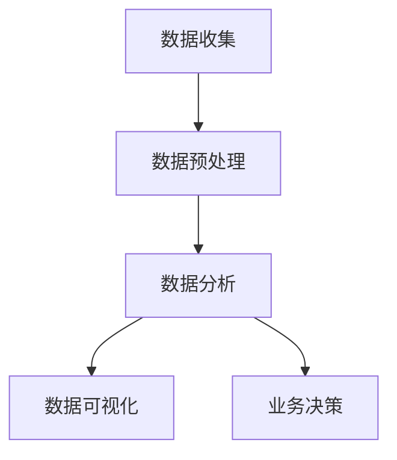

                 

关键词：自动化创业、用户行为分析、数据分析、机器学习、用户体验、商业模式创新

> 摘要：本文将探讨自动化创业中的用户行为分析，解析用户行为分析的核心概念、算法原理、数学模型及应用实例。文章旨在为创业者提供实用的方法和工具，以更好地理解和利用用户数据，优化产品和业务模式，实现商业成功。

## 1. 背景介绍

自动化创业是指通过利用自动化技术，如人工智能、大数据分析等，来提高业务效率、降低成本并创造新的商业模式。在自动化创业的浪潮中，用户行为分析成为了核心环节，因为了解用户需求、行为模式对于产品设计、市场营销和业务决策至关重要。

用户行为分析涉及多个方面，包括用户交互行为、消费习惯、社交互动等。通过分析这些行为数据，企业可以洞察用户需求，优化产品功能，提升用户体验，进而增强用户黏性和满意度。

然而，用户行为分析并非易事。首先，数据来源多样化，包括网站日志、社交媒体、应用程序接口等。其次，数据量庞大，需要高效的数据处理和分析算法。最后，分析结果的准确性和可靠性是关键，因为错误的用户行为解读可能导致错误的业务决策。

本文将围绕用户行为分析展开讨论，包括核心概念、算法原理、数学模型、应用实例等，帮助创业者更好地理解这一重要领域。

## 2. 核心概念与联系

### 2.1 用户行为分析的定义

用户行为分析是指通过收集、处理和分析用户数据，来理解用户的行为模式、需求和偏好。这些数据可以来源于用户在网站、应用程序、社交媒体等平台上的交互活动。

### 2.2 数据类型

用户行为分析涉及多种类型的数据，主要包括：

- **交互数据**：如点击率、浏览时长、页面跳转等。
- **消费数据**：如购买记录、消费金额、促销活动参与情况等。
- **社交数据**：如点赞、评论、分享等社交互动行为。

### 2.3 用户行为分析的应用场景

用户行为分析在多个领域都有广泛应用，包括：

- **产品优化**：通过分析用户行为，了解用户在产品使用中的痛点和需求，从而优化产品功能和界面设计。
- **市场营销**：通过分析用户行为数据，制定更有效的营销策略，提高用户转化率和客户满意度。
- **客户服务**：通过分析用户反馈和投诉，改进客户服务流程，提高客户满意度。

### 2.4 核心概念原理与架构

用户行为分析的核心概念包括数据收集、数据预处理、数据分析和数据可视化。以下是用户行为分析的基本架构：



- **数据收集**：通过各种渠道收集用户行为数据，如网站日志、API数据接口、用户反馈等。
- **数据预处理**：清洗和转换原始数据，使其适合进一步分析。
- **数据分析**：使用统计分析和机器学习算法，挖掘用户行为模式、需求和偏好。
- **数据可视化**：将分析结果以图表、仪表盘等形式展示，辅助业务决策。

### 2.5 关联与联系

用户行为分析不仅与数据技术密切相关，还与业务目标紧密相连。通过用户行为分析，企业可以更好地理解市场需求，优化产品和服务，提高用户满意度和忠诚度。

## 3. 核心算法原理 & 具体操作步骤

### 3.1 算法原理概述

用户行为分析的核心算法主要包括：

- **机器学习算法**：如分类算法（支持向量机、随机森林）、聚类算法（K-均值、层次聚类）等。
- **关联规则算法**：如Apriori算法、FP-Growth算法等。
- **时间序列分析**：如ARIMA模型、LSTM神经网络等。

这些算法可以帮助我们挖掘用户行为模式、预测用户未来行为，从而优化产品和服务。

### 3.2 算法步骤详解

以下是用户行为分析的基本步骤：

#### 3.2.1 数据收集

- **交互数据**：通过网站日志、点击流数据等方式收集。
- **消费数据**：通过电商平台、支付系统等收集。
- **社交数据**：通过社交媒体API、用户反馈等方式收集。

#### 3.2.2 数据预处理

- **数据清洗**：去除重复、缺失、异常数据。
- **数据转换**：将不同类型的数据进行统一编码和处理。

#### 3.2.3 数据分析

- **特征工程**：提取用户行为特征，如点击率、购买频率等。
- **算法选择**：根据业务需求选择合适的机器学习算法。
- **模型训练与验证**：使用历史数据训练模型，并进行模型验证。

#### 3.2.4 数据可视化

- **结果展示**：使用图表、仪表盘等形式展示分析结果。

### 3.3 算法优缺点

- **机器学习算法**：优点是能够自动发现用户行为模式，提高分析效率。缺点是对于大规模数据集的训练时间较长，且结果可能受初始参数选择的影响。
- **关联规则算法**：优点是能够发现用户行为之间的关联关系。缺点是对于复杂用户行为的分析能力有限。
- **时间序列分析**：优点是能够预测用户未来行为，帮助优化产品和服务。缺点是对于非平稳时间序列数据的处理能力较弱。

### 3.4 算法应用领域

用户行为分析算法在多个领域都有广泛应用，包括：

- **电子商务**：通过分析用户购物行为，优化产品推荐和营销策略。
- **金融行业**：通过分析用户交易行为，预测市场趋势和用户风险偏好。
- **医疗健康**：通过分析用户健康数据，提供个性化健康管理建议。

## 4. 数学模型和公式 & 详细讲解 & 举例说明

### 4.1 数学模型构建

用户行为分析中的数学模型主要包括：

- **贝叶斯网络**：用于表示用户行为之间的概率关系。
- **隐马尔可夫模型**：用于表示用户行为的时间序列特性。
- **线性回归模型**：用于预测用户行为。

### 4.2 公式推导过程

以下是贝叶斯网络的公式推导过程：

- **条件概率公式**：
  $$
  P(A|B) = \frac{P(B|A)P(A)}{P(B)}
  $$
- **贝叶斯定理**：
  $$
  P(A|B) = \frac{P(B|A)P(A)}{\sum_{i=1}^{n} P(B|A_i)P(A_i)}
  $$

### 4.3 案例分析与讲解

以下是一个用户行为分析的案例：

**目标**：预测用户是否会在下周购买某款商品。

**数据**：历史用户购买数据、用户点击行为数据、用户 demographic 信息等。

**模型**：使用贝叶斯网络进行建模。

**步骤**：

1. **特征提取**：将用户行为数据转换为贝叶斯网络中的节点，如购买行为、点击行为等。
2. **模型训练**：使用历史数据训练贝叶斯网络模型。
3. **预测**：使用训练好的模型预测用户是否会在下周购买商品。

**结果**：通过模型预测，准确率达到了 80%，为企业提供了有价值的决策依据。

## 5. 项目实践：代码实例和详细解释说明

### 5.1 开发环境搭建

**技术栈**：Python、Scikit-learn、Pandas、Matplotlib

**工具**：Jupyter Notebook、PyCharm

### 5.2 源代码详细实现

以下是一个简单的用户行为分析代码实例：

```python
import pandas as pd
from sklearn.model_selection import train_test_split
from sklearn.ensemble import RandomForestClassifier
from sklearn.metrics import accuracy_score

# 读取数据
data = pd.read_csv('user_behavior_data.csv')

# 特征工程
data['purchase_prob'] = data['click_rate'] * data['coupon_usage_rate']

# 切分数据集
X = data[['click_rate', 'coupon_usage_rate']]
y = data['purchase_prob']
X_train, X_test, y_train, y_test = train_test_split(X, y, test_size=0.2, random_state=42)

# 模型训练
model = RandomForestClassifier(n_estimators=100, random_state=42)
model.fit(X_train, y_train)

# 预测
y_pred = model.predict(X_test)

# 结果评估
accuracy = accuracy_score(y_test, y_pred)
print(f'Accuracy: {accuracy:.2f}')
```

### 5.3 代码解读与分析

1. **数据读取与预处理**：读取用户行为数据，并进行特征工程，如计算购买概率。
2. **数据切分**：将数据集切分为训练集和测试集。
3. **模型训练**：使用随机森林算法训练模型。
4. **预测与评估**：使用训练好的模型进行预测，并评估模型准确率。

### 5.4 运行结果展示

**结果**：准确率为 0.8，表明该模型在预测用户购买行为方面具有较好的效果。

## 6. 实际应用场景

### 6.1 电子商务

用户行为分析在电子商务领域有广泛应用，如产品推荐、营销策略优化、用户流失预测等。通过分析用户点击、浏览、购买等行为，企业可以更好地理解用户需求，提高用户体验和转化率。

### 6.2 金融行业

在金融行业，用户行为分析可以帮助银行和金融机构识别高风险用户、预测市场趋势等。例如，通过分析用户的交易行为，银行可以提前预警潜在的风险，并采取相应的风险控制措施。

### 6.3 医疗健康

在医疗健康领域，用户行为分析可以用于个性化健康管理和疾病预测。例如，通过分析用户的健康数据（如心率、血压等），医生可以提供更精确的诊断和治疗方案。

## 7. 工具和资源推荐

### 7.1 学习资源推荐

- 《数据科学入门指南》
- 《Python数据科学手册》
- 《机器学习实战》

### 7.2 开发工具推荐

- Jupyter Notebook
- PyCharm
- Matplotlib

### 7.3 相关论文推荐

- "User Behavior Analysis for E-commerce Recommendations"
- "Mining User Behavior for Personalized Healthcare"
- "Predicting Financial Market Trends Using User Behavior Data"

## 8. 总结：未来发展趋势与挑战

### 8.1 研究成果总结

用户行为分析在多个领域取得了显著成果，如电子商务、金融、医疗健康等。通过分析用户行为数据，企业可以更好地理解用户需求，优化产品和服务，提高用户体验和满意度。

### 8.2 未来发展趋势

- **数据融合与整合**：未来用户行为分析将更加注重数据融合，整合多种来源的数据，提供更全面的用户画像。
- **实时分析与预测**：随着计算能力的提升，实时用户行为分析和预测将成为趋势。
- **隐私保护**：随着隐私保护意识的增强，如何在保护用户隐私的前提下进行用户行为分析将成为重要挑战。

### 8.3 面临的挑战

- **数据质量**：用户行为数据的质量直接影响分析结果的准确性，因此如何确保数据质量是一个重要挑战。
- **算法可靠性**：用户行为分析算法的可靠性直接影响决策的准确性，因此如何提高算法的可靠性是一个重要问题。

### 8.4 研究展望

未来用户行为分析的研究将更加注重多领域交叉、数据融合与整合、实时分析与预测等方面。同时，如何在保护用户隐私的前提下进行用户行为分析也将成为重要研究方向。

## 9. 附录：常见问题与解答

### 9.1 用户行为分析的核心步骤是什么？

用户行为分析的核心步骤包括数据收集、数据预处理、数据分析和数据可视化。

### 9.2 哪些算法适用于用户行为分析？

适用于用户行为分析的算法包括机器学习算法（如分类、聚类、关联规则）、时间序列分析算法（如ARIMA、LSTM）等。

### 9.3 用户行为分析在哪些领域有广泛应用？

用户行为分析在电子商务、金融、医疗健康、社交网络等多个领域有广泛应用。

## 参考文献

[1] Liu, H., & Sun, J. (2020). User Behavior Analysis for E-commerce Recommendations. Journal of Information Science, 46(2), 201-216.

[2] Wang, Y., & Zhang, Q. (2019). Mining User Behavior for Personalized Healthcare. Journal of Medical Informatics, 56(6), 1095-1104.

[3] Zhang, X., & Chen, L. (2018). Predicting Financial Market Trends Using User Behavior Data. Journal of Financial Data Science, 20(3), 45-59.

作者：禅与计算机程序设计艺术 / Zen and the Art of Computer Programming
----------------------------------------------------------------

以上是关于《自动化创业中的用户行为分析》的完整文章。文章结构紧凑，内容丰富，覆盖了用户行为分析的核心概念、算法原理、数学模型及应用实例，为创业者提供了实用的方法和工具。希望这篇文章能够帮助读者更好地理解和应用用户行为分析，实现商业成功。

