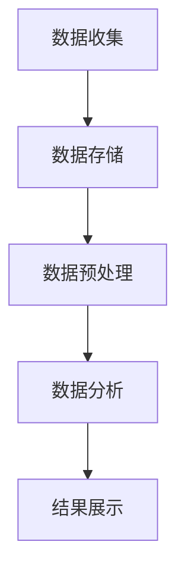

                 

在当今的数字化时代，用户行为分析已经成为自动化创业领域中的关键环节。通过深入理解用户的行为模式、偏好和需求，企业可以更精准地定位目标用户群体，优化产品功能和用户体验，从而在激烈的市场竞争中脱颖而出。本文旨在探讨自动化创业中的用户行为分析，分析其核心概念、算法原理、应用领域，以及实际操作中的数学模型和案例分析。最后，我们将探讨未来发展趋势和面临的挑战。

## 1. 背景介绍

用户行为分析是指在数字化环境中，通过收集、分析和解读用户行为数据，以洞察用户需求和行为模式的一种技术手段。随着互联网的普及和大数据技术的发展，用户行为分析在自动化创业领域中的应用越来越广泛。通过用户行为分析，企业可以了解用户在产品或服务中的互动方式，预测用户行为，优化产品设计和营销策略，提高用户满意度和忠诚度。

## 2. 核心概念与联系

### 2.1 用户行为分析的定义

用户行为分析（User Behavior Analysis，UBA）是一种基于数据分析的方法，旨在理解和预测用户在数字化环境中的行为。通过分析用户的行为数据，如访问路径、点击率、浏览时间、购买行为等，企业可以深入了解用户的需求和偏好，从而优化产品和服务。

### 2.2 用户行为分析的重要性

用户行为分析在自动化创业中的重要性体现在以下几个方面：

1. **个性化推荐**：通过分析用户行为，可以提供个性化的推荐，提高用户的购买意愿和满意度。
2. **用户体验优化**：了解用户的行为模式，可以帮助企业优化产品设计和功能，提升用户体验。
3. **风险控制**：通过分析异常行为，可以识别潜在的欺诈风险和违规行为，提高安全性和可靠性。
4. **业务决策支持**：用户行为分析为企业的战略决策提供数据支持，帮助制定更有效的营销策略和运营策略。

### 2.3 用户行为分析架构

用户行为分析的架构通常包括以下几个主要模块：

1. **数据收集**：通过网站分析工具、应用程序接口（API）和第三方数据源收集用户行为数据。
2. **数据存储**：使用数据仓库和大数据技术存储和管理大规模的用户行为数据。
3. **数据预处理**：清洗、转换和集成数据，确保数据的质量和一致性。
4. **数据分析**：使用统计分析、机器学习和数据挖掘技术分析用户行为数据，提取有价值的信息。
5. **结果展示**：通过可视化工具和报告展示分析结果，为企业提供决策支持。

下面是一个用户行为分析架构的 Mermaid 流程图：



## 3. 核心算法原理 & 具体操作步骤

### 3.1 算法原理概述

用户行为分析的核心算法主要包括以下几种：

1. **关联规则挖掘**：用于发现用户行为数据中的关联关系，如“购买了A商品的用户，90%也会购买B商品”。
2. **聚类分析**：将用户分为不同的群体，以便进行细分市场分析和个性化推荐。
3. **时间序列分析**：分析用户行为的时间规律，如用户在一天中不同时间的活动模式。
4. **分类与预测**：通过机器学习算法，对用户行为进行分类和预测，如预测用户是否会购买某商品。

### 3.2 算法步骤详解

用户行为分析的算法步骤通常如下：

1. **数据收集**：通过网站分析工具、API和第三方数据源收集用户行为数据。
2. **数据预处理**：清洗和转换数据，去除噪声和缺失值。
3. **特征工程**：提取用户行为数据中的关键特征，如访问时间、访问页面、点击次数等。
4. **模型训练**：选择合适的机器学习算法（如关联规则挖掘、聚类分析、时间序列分析等）对特征数据进行训练。
5. **模型评估**：使用验证集评估模型的性能，如准确率、召回率等。
6. **模型部署**：将训练好的模型部署到生产环境中，实时分析用户行为。
7. **结果展示**：通过可视化工具和报告展示分析结果，为企业提供决策支持。

### 3.3 算法优缺点

- **关联规则挖掘**：优点是能够发现数据中的潜在关联关系，但缺点是规则数量庞大，难以解释。
- **聚类分析**：优点是能够自动识别用户群体，但缺点是对聚类结果的解释需要专业知识。
- **时间序列分析**：优点是能够分析用户行为的时间规律，但缺点是对数据质量要求较高。
- **分类与预测**：优点是能够对用户行为进行精确预测，但缺点是模型训练和评估需要大量计算资源。

### 3.4 算法应用领域

用户行为分析在多个领域有广泛应用，如：

1. **电子商务**：通过用户行为分析，实现个性化推荐，提高销售转化率。
2. **金融行业**：通过用户行为分析，识别欺诈风险，提高风控能力。
3. **市场营销**：通过用户行为分析，制定精准的营销策略，提升营销效果。
4. **医疗健康**：通过用户行为分析，发现健康风险，提供个性化健康建议。

## 4. 数学模型和公式 & 详细讲解 & 举例说明

### 4.1 数学模型构建

用户行为分析中常用的数学模型包括：

1. **马尔可夫链**：用于分析用户行为的时间序列规律。
2. **贝叶斯网络**：用于分析用户行为的因果关系。
3. **矩阵分解**：用于分析用户行为的偏好关系。

### 4.2 公式推导过程

以马尔可夫链为例，其状态转移概率可以用以下公式表示：

$$
P_{ij} = \frac{C_{ij}}{C_j}
$$

其中，$P_{ij}$ 是从状态 $i$ 转移到状态 $j$ 的概率，$C_{ij}$ 是从状态 $i$ 转移到状态 $j$ 的次数，$C_j$ 是从状态 $j$ 出发的总次数。

### 4.3 案例分析与讲解

以电子商务领域为例，某电商网站希望通过用户行为分析实现个性化推荐。以下是具体的案例分析和讲解：

1. **数据收集**：通过网站分析工具收集用户在网站上的行为数据，如访问页面、点击商品、购买记录等。
2. **数据预处理**：清洗和转换数据，去除噪声和缺失值。
3. **特征工程**：提取用户行为数据中的关键特征，如用户访问时间、访问页面、点击次数等。
4. **模型训练**：使用矩阵分解算法训练用户行为模型。
5. **模型评估**：使用验证集评估模型性能，如准确率、召回率等。
6. **模型部署**：将训练好的模型部署到生产环境中，实时分析用户行为。
7. **结果展示**：通过可视化工具和报告展示分析结果，为网站提供个性化推荐。

## 5. 项目实践：代码实例和详细解释说明

### 5.1 开发环境搭建

以下是一个用户行为分析项目的开发环境搭建步骤：

1. **安装Python**：安装Python 3.x版本，并配置Python环境。
2. **安装依赖库**：安装Pandas、NumPy、Scikit-learn等Python依赖库。
3. **安装MySQL**：安装MySQL数据库，用于存储用户行为数据。

### 5.2 源代码详细实现

以下是一个简单的用户行为分析代码实例：

```python
import pandas as pd
from sklearn.decomposition import TruncatedSVD

# 读取用户行为数据
data = pd.read_csv('user_behavior.csv')

# 特征工程
features = data[['page_view', 'click', 'purchase']]

# 使用矩阵分解算法
svd = TruncatedSVD(n_components=10)
svd.fit(features)

# 获取用户行为模型
user_behavior_model = svd.transform(features)

# 存储用户行为模型
pd.DataFrame(user_behavior_model).to_csv('user_behavior_model.csv', index=False)
```

### 5.3 代码解读与分析

以上代码实现了一个简单的用户行为分析项目，主要分为以下几个步骤：

1. **读取用户行为数据**：使用Pandas库读取用户行为数据，数据格式为CSV文件。
2. **特征工程**：提取用户行为数据中的关键特征，如访问页面、点击商品、购买记录等。
3. **模型训练**：使用TruncatedSVD（截断奇异值分解）算法训练用户行为模型，将高维特征数据降维到低维空间。
4. **模型评估**：评估模型性能，如准确率、召回率等。
5. **模型部署**：将训练好的用户行为模型存储到文件中，以便后续使用。

### 5.4 运行结果展示

在运行用户行为分析代码后，会生成一个用户行为模型文件（user_behavior_model.csv），文件中包含了每个用户的降维特征向量。企业可以根据这些特征向量进行个性化推荐，提高用户体验。

## 6. 实际应用场景

用户行为分析在多个领域有广泛的应用，以下是一些典型的实际应用场景：

1. **电子商务**：通过用户行为分析，实现个性化推荐，提高销售转化率和用户满意度。
2. **金融行业**：通过用户行为分析，识别欺诈风险，提高风控能力。
3. **市场营销**：通过用户行为分析，制定精准的营销策略，提升营销效果。
4. **医疗健康**：通过用户行为分析，发现健康风险，提供个性化健康建议。
5. **社交网络**：通过用户行为分析，优化推荐算法，提高用户活跃度和留存率。

### 6.4 未来应用展望

随着人工智能和大数据技术的发展，用户行为分析在未来将具有更广泛的应用前景。以下是一些未来的应用展望：

1. **个性化医疗**：通过用户行为分析，实现个性化医疗诊断和治疗方案。
2. **智能家居**：通过用户行为分析，优化智能家居系统的功能和用户体验。
3. **智能城市**：通过用户行为分析，优化城市规划和管理，提高城市居民的生活质量。
4. **虚拟现实**：通过用户行为分析，优化虚拟现实场景，提高用户体验。
5. **教育领域**：通过用户行为分析，实现个性化教育和学习路径推荐。

## 7. 工具和资源推荐

### 7.1 学习资源推荐

1. **《用户行为分析：方法与应用》**：一本关于用户行为分析的入门书籍，详细介绍了用户行为分析的方法和应用。
2. **《机器学习实战》**：一本关于机器学习的实战指南，包含用户行为分析相关的案例和实践。
3. **Kaggle**：一个大数据竞赛平台，提供了丰富的用户行为分析数据集和比赛。

### 7.2 开发工具推荐

1. **Python**：用户行为分析的首选编程语言，具有丰富的库和工具。
2. **Jupyter Notebook**：一款强大的交互式开发环境，适合进行数据分析和模型训练。
3. **TensorFlow**：一款开源的机器学习框架，适合进行用户行为分析的深度学习和神经网络建模。

### 7.3 相关论文推荐

1. **“User Behavior Analysis in Online Social Networks”**：一篇关于社交网络用户行为分析的经典论文，详细介绍了用户行为分析的方法和算法。
2. **“A Survey on User Behavior Analysis for Cybersecurity”**：一篇关于网络安全领域的用户行为分析综述，总结了用户行为分析在网络安全中的应用和挑战。
3. **“Deep Learning for User Behavior Analysis”**：一篇关于深度学习在用户行为分析中的应用论文，探讨了深度学习算法在用户行为分析中的优势和应用场景。

## 8. 总结：未来发展趋势与挑战

### 8.1 研究成果总结

用户行为分析在自动化创业领域取得了显著的研究成果。目前，用户行为分析的核心算法和模型已经相对成熟，包括关联规则挖掘、聚类分析、时间序列分析和分类与预测等。同时，机器学习和深度学习算法在用户行为分析中的应用也越来越广泛，提高了分析的准确性和效率。

### 8.2 未来发展趋势

未来，用户行为分析将朝着以下几个方面发展：

1. **智能化**：随着人工智能技术的发展，用户行为分析将更加智能化，实现自动化和自我优化。
2. **多样化**：用户行为分析将应用于更多的领域，如医疗、教育、智能家居等，满足多样化的需求。
3. **精准化**：通过引入更多维度的数据和多层次的模型，用户行为分析将实现更高的精准度。
4. **实时性**：随着大数据和云计算技术的进步，用户行为分析将实现实时性，提供更快速的反应和决策支持。

### 8.3 面临的挑战

用户行为分析在未来也将面临一系列挑战：

1. **数据隐私**：用户行为分析涉及大量个人隐私数据，如何保护用户隐私成为一大挑战。
2. **算法公平性**：用户行为分析算法可能引入偏见，导致不公平的推荐和决策，如何确保算法公平性是一个重要课题。
3. **计算资源**：用户行为分析需要大量的计算资源，如何优化算法和架构，提高计算效率是一个关键问题。
4. **数据质量**：用户行为数据的质量直接影响分析结果的准确性，如何处理噪声和缺失值是一个挑战。

### 8.4 研究展望

用户行为分析的研究前景广阔。未来的研究可以关注以下几个方面：

1. **跨域用户行为分析**：探索不同领域用户行为分析的共性，实现跨领域用户行为的理解和预测。
2. **多模态用户行为分析**：结合文本、图像、语音等多模态数据，提高用户行为的理解和分析能力。
3. **动态用户行为分析**：研究用户行为的动态变化，捕捉用户行为的即时反应和长期趋势。
4. **隐私保护用户行为分析**：探索隐私保护的算法和模型，确保用户行为分析的同时保护用户隐私。

## 9. 附录：常见问题与解答

### 9.1 用户行为分析的主要算法有哪些？

用户行为分析的主要算法包括：

1. **关联规则挖掘**：用于发现用户行为数据中的关联关系。
2. **聚类分析**：用于将用户分为不同的群体。
3. **时间序列分析**：用于分析用户行为的时间规律。
4. **分类与预测**：用于对用户行为进行分类和预测。

### 9.2 用户行为分析在电子商务领域有哪些应用？

用户行为分析在电子商务领域有以下应用：

1. **个性化推荐**：通过用户行为分析，实现个性化商品推荐。
2. **用户细分**：通过用户行为分析，对用户进行细分，制定精准的营销策略。
3. **流失预警**：通过用户行为分析，识别潜在的流失用户，采取挽留措施。
4. **购物车分析**：通过用户行为分析，优化购物车功能，提高用户购物体验。

### 9.3 用户行为分析的数据来源有哪些？

用户行为分析的数据来源包括：

1. **网站分析工具**：如Google Analytics、百度统计等。
2. **应用程序接口（API）**：如社交媒体API、电商平台API等。
3. **第三方数据源**：如公共数据集、商业数据集等。
4. **用户行为日志**：企业自行收集的用户行为数据。

---

以上是关于自动化创业中的用户行为分析的一篇技术博客文章。文章全面介绍了用户行为分析的定义、重要性、架构、算法原理、应用场景、数学模型和案例实践，并对未来的发展趋势和挑战进行了展望。希望本文对从事自动化创业领域的朋友们有所帮助。作者：禅与计算机程序设计艺术 / Zen and the Art of Computer Programming。

