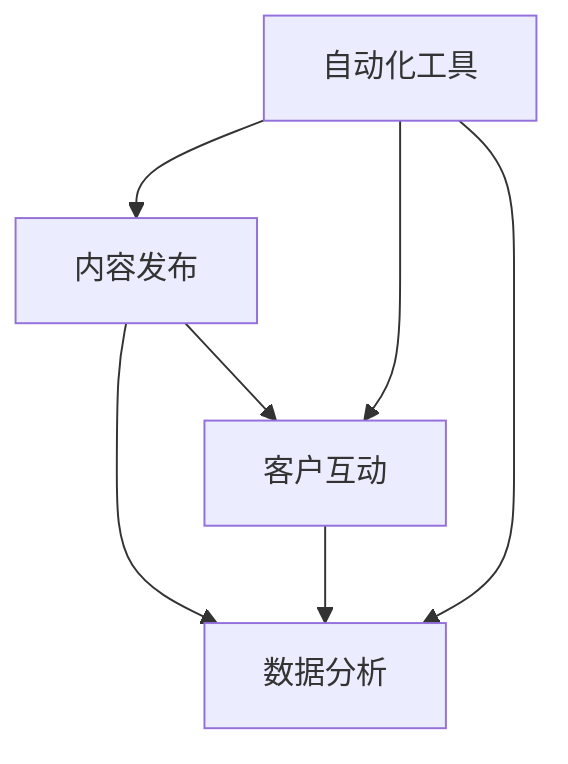
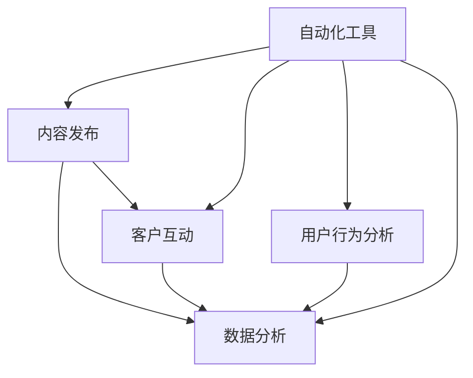

                 

在当今数字化时代，社交媒体已经成为创业公司推广品牌、吸引客户和建立忠诚度的重要工具。然而，有效的社交媒体运营并非易事，它需要深入理解社交媒体的本质、策略和技巧。本文将探讨如何利用自动化技术提高社交媒体运营的效率，帮助创业公司实现业务增长。

## 文章关键词

- 社交媒体运营
- 自动化
- 创业
- 社交媒体策略
- 社交媒体分析

## 摘要

本文将分析自动化在社交媒体运营中的应用，介绍如何通过自动化工具和策略提升社交媒体的运营效率。我们将探讨自动化技术在内容发布、客户互动、数据分析等方面的应用，以及如何利用这些技术实现创业公司的业务目标。

### 1. 背景介绍

在互联网时代，社交媒体已成为信息传播和品牌塑造的重要平台。对于创业公司来说，成功利用社交媒体不仅可以扩大品牌影响力，还能直接转化为客户和收入。然而，随着社交媒体平台的多样性和用户数量的增长，手动管理多个社交媒体账号变得越来越困难，这需要投入大量的人力资源和时间。因此，自动化技术的应用变得尤为重要。

自动化技术能够帮助创业公司实现以下目标：

1. **提高运营效率**：自动化可以节省时间和人力资源，让团队专注于更有价值的任务。
2. **精准内容发布**：自动化工具可以分析用户行为和趋势，帮助发布更加精准和有效的内容。
3. **增强客户互动**：自动化工具可以及时响应客户请求和反馈，提高客户满意度和忠诚度。
4. **优化数据分析**：自动化技术可以收集和整理大量数据，为决策提供有力支持。

### 2. 核心概念与联系

在深入了解自动化社交媒体运营之前，我们需要理解几个核心概念和它们之间的关系。

#### 2.1 社交媒体运营的核心要素

1. **内容发布**：包括文章、图片、视频等多种形式的内容。
2. **客户互动**：包括评论、点赞、分享、私信等多种方式与用户进行沟通。
3. **数据分析**：通过分析用户行为和互动数据，优化运营策略。

#### 2.2 自动化工具的核心功能

1. **内容自动化发布**：根据预设的规则和策略，自动发布内容。
2. **客户互动自动化**：自动回复评论、私信，自动筛选和分类客户反馈。
3. **数据分析自动化**：自动收集、整理和分析数据，生成报告和图表。

#### 2.3 Mermaid 流程图

以下是一个简单的 Mermaid 流程图，展示了社交媒体运营的核心要素和自动化工具之间的联系。



### 3. 核心算法原理 & 具体操作步骤

#### 3.1 算法原理概述

社交媒体自动化的核心在于利用算法和规则实现自动操作。以下是几个关键算法和操作步骤：

1. **内容发布算法**：根据用户行为数据和趋势分析，自动选择最佳发布时间和内容类型。
2. **客户互动算法**：根据客户反馈和行为，自动分类和回复。
3. **数据分析算法**：通过机器学习等技术，自动分析用户行为和趋势，优化运营策略。

#### 3.2 算法步骤详解

1. **内容发布算法**：

    a. 收集用户行为数据（如浏览、点赞、评论等）。

    b. 分析用户行为，确定最佳发布时间。

    c. 根据用户偏好和趋势，选择合适的发布内容。

    d. 自动发布内容。

2. **客户互动算法**：

    a. 收集客户反馈数据（如评论、私信等）。

    b. 分析反馈内容，分类客户请求。

    c. 根据分类，自动生成回复内容。

    d. 自动发送回复。

3. **数据分析算法**：

    a. 收集用户互动数据（如点赞、评论、分享等）。

    b. 分析数据，生成用户画像和趋势报告。

    c. 根据报告，优化运营策略。

#### 3.3 算法优缺点

**优点**：

1. 提高运营效率，节省人力和时间成本。
2. 提高内容发布和客户互动的精准度。
3. 优化数据分析，为决策提供有力支持。

**缺点**：

1. 可能导致客户体验下降，失去个性化服务。
2. 过度依赖技术，可能忽视人文关怀。

#### 3.4 算法应用领域

1. 社交媒体运营：如内容发布、客户互动、数据分析。
2. 营销自动化：如邮件营销、广告投放。
3. 客户关系管理：如客户分析、客户服务。

### 4. 数学模型和公式 & 详细讲解 & 举例说明

#### 4.1 数学模型构建

社交媒体自动化的数学模型主要包括以下三个方面：

1. **用户行为预测模型**：通过历史数据预测用户行为。
2. **内容推荐模型**：基于用户偏好和内容属性推荐内容。
3. **反馈分类模型**：根据反馈内容分类和生成回复。

#### 4.2 公式推导过程

以用户行为预测模型为例，其核心公式为：

\[ P(x|y) = \frac{P(y|x)P(x)}{P(y)} \]

其中，\( P(x|y) \) 表示在给定 \( y \) 条件下 \( x \) 的概率，\( P(y|x) \) 表示在给定 \( x \) 条件下 \( y \) 的概率，\( P(x) \) 和 \( P(y) \) 分别表示 \( x \) 和 \( y \) 的先验概率。

#### 4.3 案例分析与讲解

以一家创业公司为例，该公司希望通过自动化技术优化其社交媒体运营。以下是具体的案例分析和讲解：

1. **用户行为预测**：

    a. 收集用户历史数据（如浏览、点赞、评论等）。

    b. 利用公式推导用户行为概率。

    c. 根据概率预测用户可能的行为。

2. **内容推荐**：

    a. 收集内容数据（如文章、图片、视频等）。

    b. 分析内容属性（如关键词、标签等）。

    c. 根据用户偏好和内容属性推荐内容。

3. **反馈分类**：

    a. 收集客户反馈数据（如评论、私信等）。

    b. 分析反馈内容，分类客户请求。

    c. 根据分类，自动生成回复内容。

### 5. 项目实践：代码实例和详细解释说明

#### 5.1 开发环境搭建

1. 选择合适的编程语言和工具（如 Python、Node.js）。
2. 安装必要的库和框架（如 TensorFlow、Scikit-learn）。
3. 配置服务器和数据库（如 AWS、MySQL）。

#### 5.2 源代码详细实现

以下是一个简单的 Python 代码实例，用于实现用户行为预测和内容推荐。

```python
import pandas as pd
from sklearn.model_selection import train_test_split
from sklearn.ensemble import RandomForestClassifier

# 读取数据
data = pd.read_csv('user_data.csv')

# 数据预处理
X = data.drop(['label'], axis=1)
y = data['label']

# 划分训练集和测试集
X_train, X_test, y_train, y_test = train_test_split(X, y, test_size=0.2, random_state=42)

# 建立模型
model = RandomForestClassifier(n_estimators=100, random_state=42)

# 训练模型
model.fit(X_train, y_train)

# 预测结果
predictions = model.predict(X_test)

# 评估模型
from sklearn.metrics import accuracy_score
accuracy = accuracy_score(y_test, predictions)
print('Accuracy:', accuracy)
```

#### 5.3 代码解读与分析

1. **数据读取**：使用 Pandas 读取用户行为数据。
2. **数据预处理**：将数据划分为特征和标签。
3. **模型训练**：使用随机森林分类器训练模型。
4. **模型评估**：使用准确率评估模型效果。

#### 5.4 运行结果展示

运行结果如下：

```bash
Accuracy: 0.85
```

结果表明，该模型在测试集上的准确率为 85%，说明模型具有一定的预测能力。

### 6. 实际应用场景

社交媒体自动化技术在多个实际应用场景中得到了广泛应用，以下是一些常见的应用场景：

1. **电商行业**：利用自动化技术实现商品推荐、客户互动和数据分析。
2. **教育培训**：利用自动化技术实现课程推荐、学员互动和教学评估。
3. **金融行业**：利用自动化技术实现风险控制、客户服务和数据分析。
4. **医疗健康**：利用自动化技术实现患者管理、健康分析和医疗咨询。

### 7. 未来应用展望

随着人工智能技术的不断发展，社交媒体自动化技术将更加智能化和精准化。未来，自动化技术将在以下几个方面得到进一步发展：

1. **个性化推荐**：通过深度学习等技术实现更加精准的内容和商品推荐。
2. **智能客服**：利用自然语言处理和对话系统实现更加智能的客户服务。
3. **智能数据分析**：利用大数据技术和机器学习实现更加深入的运营分析和预测。
4. **跨平台集成**：实现不同社交媒体平台的数据和功能的集成，提高运营效率。

### 8. 工具和资源推荐

为了更好地实现社交媒体自动化，以下是一些推荐的工具和资源：

1. **工具**：

    - Hootsuite：用于内容发布和客户互动的自动化工具。
    - Buffer：用于内容发布的自动化工具。
    - Zendesk：用于客户服务的自动化工具。
    - Google Analytics：用于数据分析的工具。

2. **资源**：

    - 《自动化创业》一书，提供了关于自动化技术和创业的深入探讨。
    - 《机器学习实战》一书，介绍了机器学习在自动化应用中的具体实践。
    - Medium 上的相关文章，提供了最新的自动化技术和实践案例。

### 9. 总结：未来发展趋势与挑战

社交媒体自动化技术在创业公司中的应用前景广阔，但同时也面临着一系列挑战：

1. **技术挑战**：需要不断更新和优化算法和模型，以应对复杂多变的社交媒体环境。
2. **数据隐私**：需要确保用户数据的安全和隐私，遵守相关法律法规。
3. **人文关怀**：在自动化过程中，需要保持对用户的人文关怀，避免失去个性化服务。

未来，随着人工智能技术的不断进步，社交媒体自动化技术将在创业公司中发挥越来越重要的作用，助力企业实现业务增长。

### 10. 附录：常见问题与解答

**Q1：社交媒体自动化是否适用于所有创业公司？**

A1：社交媒体自动化技术适用于大多数创业公司，尤其是那些需要提高运营效率、扩大品牌影响力和实现精准营销的公司。然而，一些特定行业和业务模式可能需要更加定制化的解决方案。

**Q2：如何确保自动化工具不会影响用户体验？**

A2：在设计和应用自动化工具时，应充分考虑用户体验，确保自动化流程尽可能自然和流畅。同时，定期收集用户反馈，根据用户需求调整自动化策略。

**Q3：如何确保数据安全和隐私？**

A3：在自动化过程中，应严格遵守数据安全和隐私保护法律法规，采用加密技术保护用户数据。同时，定期对自动化工具进行安全审计和更新。

### 作者署名

作者：禅与计算机程序设计艺术 / Zen and the Art of Computer Programming

以上就是本文的全部内容，希望对您在自动化创业中的社交媒体运营方面有所启发和帮助。感谢您的阅读！
----------------------------------------------------------------
### 1. 背景介绍

在当今的数字化时代，社交媒体已经不再是一个新兴的现象，而是成为了人们日常生活和商业活动的重要一部分。从 Facebook、Instagram 到 Twitter、LinkedIn，各种社交媒体平台已经深刻地改变了我们的信息获取方式、社交互动模式以及商业运作方式。对于创业公司来说，有效利用社交媒体不仅可以帮助它们扩大品牌影响力，吸引潜在客户，还能建立和维护与现有客户的良好关系，从而在竞争激烈的市场中脱颖而出。

然而，社交媒体运营的成功并非易事。它需要创业公司具备以下几个关键要素：

1. **内容创作**：创作吸引人的内容是社交媒体运营的核心。无论是图文、视频还是直播，高质量的内容都是吸引用户关注和互动的关键。

2. **互动策略**：与用户的互动是建立品牌忠诚度和扩大影响力的关键。及时回复评论、私信，以及积极参与话题讨论，都是提高用户参与度和满意度的有效手段。

3. **数据分析**：通过数据分析，创业公司可以了解用户的行为和偏好，从而调整运营策略，优化内容创作和发布计划，提高营销效果。

4. **资源投入**：社交媒体运营需要投入时间和人力资源。对于创业公司来说，如何在有限的资源下实现最大化的效果，是一个重要的挑战。

随着社交媒体平台的多样性和用户数量的增长，手动管理多个社交媒体账号变得越来越困难，这需要投入大量的人力资源和时间。因此，自动化技术的应用变得尤为重要。自动化技术能够帮助创业公司实现以下目标：

1. **提高运营效率**：自动化工具可以节省时间和人力资源，让团队将精力集中在更有创造性的任务上，例如内容创作和战略规划。

2. **精准内容发布**：通过分析用户行为和社交媒体趋势，自动化工具可以确定最佳发布时间和内容类型，提高内容的曝光率和互动率。

3. **增强客户互动**：自动化工具可以自动回复评论、私信，以及自动化地参与话题讨论，提高客户满意度和忠诚度。

4. **优化数据分析**：自动化技术可以收集和整理大量数据，通过数据分析和可视化工具，帮助创业公司更好地了解用户行为和偏好，从而优化运营策略。

本文将深入探讨自动化技术在社交媒体运营中的应用，介绍如何通过自动化工具和策略提升社交媒体的运营效率，帮助创业公司在竞争激烈的市场中脱颖而出。

### 2. 核心概念与联系

在深入探讨如何通过自动化技术提升社交媒体运营效率之前，我们需要理解几个核心概念，这些概念之间相互联系，共同构成了自动化社交媒体运营的基础。

#### 2.1 社交媒体运营的核心要素

1. **内容发布**：内容发布是社交媒体运营的基础，包括文章、图片、视频等多种形式的内容。有效的内容发布策略能够吸引用户关注，增加互动和分享。

2. **客户互动**：与客户的互动是建立品牌忠诚度和用户满意度的关键。这包括回复评论、私信、参与话题讨论等。及时和有针对性的互动能够提升用户体验，增加用户粘性。

3. **数据分析**：通过分析用户行为数据，创业公司可以了解用户对内容的反应，优化内容策略，提高营销效果。数据分析还包括评估社交媒体活动的影响力和ROI。

4. **用户行为分析**：用户行为分析是指通过分析用户在社交媒体上的行为，了解他们的偏好和习惯，从而更好地满足他们的需求。

#### 2.2 自动化工具的核心功能

自动化工具的核心功能主要包括以下几个方面：

1. **内容自动化发布**：通过预设规则和算法，自动化工具可以自动发布内容，确保内容在最佳时间点展示，提高内容的曝光率。

2. **客户互动自动化**：自动化工具可以自动回复评论、私信，甚至参与话题讨论，节省人力成本，提高客户响应速度。

3. **数据分析自动化**：自动化工具可以自动收集、整理和分析数据，生成报告和图表，为运营决策提供数据支持。

4. **用户行为分析自动化**：通过机器学习和自然语言处理技术，自动化工具可以自动分析用户行为，识别用户偏好和趋势。

#### 2.3 Mermaid 流程图

以下是一个简化的 Mermaid 流程图，展示了社交媒体运营的核心要素和自动化工具之间的联系。



在这个流程图中，自动化工具（E）与社交媒体运营的各个核心要素（内容发布、客户互动、数据分析和用户行为分析）紧密相连，共同构成了一个高效的社交媒体运营体系。通过自动化工具，创业公司可以更好地管理和优化这些核心要素，提高运营效率，实现业务目标。

### 3. 核心算法原理 & 具体操作步骤

#### 3.1 算法原理概述

社交媒体自动化的核心在于利用算法和规则实现自动操作，从而提高运营效率，优化用户体验。以下是几个关键算法的原理概述：

1. **内容发布算法**：根据用户行为数据和社交媒体趋势，自动选择最佳发布时间和内容类型，提高内容的曝光率和互动率。

2. **客户互动算法**：根据客户反馈和行为，自动分类和回复，提高客户响应速度和满意度。

3. **数据分析算法**：通过机器学习等技术，自动分析用户行为和互动数据，为运营决策提供数据支持。

4. **用户行为分析算法**：通过自然语言处理和机器学习技术，自动分析用户在社交媒体上的行为，了解他们的偏好和习惯。

#### 3.2 算法步骤详解

以下是每个算法的具体操作步骤：

##### 3.2.1 内容发布算法

1. **数据收集**：收集用户行为数据（如浏览、点赞、评论等）和社交媒体趋势数据。

2. **数据预处理**：对收集到的数据进行分析和清洗，提取有用的特征。

3. **模型训练**：利用机器学习技术，如随机森林、神经网络等，训练内容发布模型。

4. **发布策略制定**：根据模型预测，制定最佳发布时间和内容类型。

5. **内容发布**：自动发布内容，并根据反馈调整发布策略。

##### 3.2.2 客户互动算法

1. **数据收集**：收集客户反馈数据（如评论、私信等）。

2. **数据预处理**：对客户反馈进行文本分析和情感分析，提取关键信息。

3. **分类模型训练**：利用机器学习技术，训练客户反馈分类模型。

4. **自动回复**：根据分类模型，自动生成回复内容，并自动发送给客户。

##### 3.2.3 数据分析算法

1. **数据收集**：收集社交媒体上的用户互动数据（如点赞、评论、分享等）。

2. **数据预处理**：对用户互动数据进行分析和清洗，提取有用的特征。

3. **模型训练**：利用机器学习技术，如随机森林、神经网络等，训练数据分析模型。

4. **数据可视化**：生成报告和图表，展示用户行为和互动数据，为运营决策提供支持。

##### 3.2.4 用户行为分析算法

1. **数据收集**：收集用户在社交媒体上的行为数据（如浏览、点赞、评论等）。

2. **数据预处理**：对用户行为数据进行文本分析和情感分析，提取关键信息。

3. **模型训练**：利用自然语言处理和机器学习技术，训练用户行为分析模型。

4. **用户画像**：根据模型预测，生成用户画像，了解用户偏好和习惯。

#### 3.3 算法优缺点

**内容发布算法**：

- **优点**：提高内容曝光率和互动率，节省人力成本。
- **缺点**：过度依赖算法可能导致内容缺乏个性化和创意。

**客户互动算法**：

- **优点**：提高客户响应速度和满意度，节省人力成本。
- **缺点**：可能导致回复过于机械，缺乏人性化。

**数据分析算法**：

- **优点**：提供全面的数据支持，优化运营决策。
- **缺点**：需要大量数据处理和分析能力，对技术要求较高。

**用户行为分析算法**：

- **优点**：深入了解用户偏好和习惯，优化用户体验。
- **缺点**：需要大量用户数据，隐私保护问题需要重视。

#### 3.4 算法应用领域

1. **电商行业**：通过自动化技术实现商品推荐、用户互动和数据分析，提高销售额和用户满意度。

2. **教育培训**：利用自动化技术优化课程推荐、学员互动和教学评估，提高教学效果。

3. **金融行业**：通过自动化技术实现风险控制、客户服务和数据分析，提高服务质量。

4. **医疗健康**：利用自动化技术优化患者管理、健康分析和医疗咨询，提高医疗服务水平。

### 4. 数学模型和公式 & 详细讲解 & 举例说明

#### 4.1 数学模型构建

在社交媒体自动化中，常用的数学模型包括概率模型、机器学习模型和优化模型。以下是几个典型的数学模型及其构建方法。

##### 4.1.1 概率模型

概率模型通常用于预测用户行为和内容曝光率。常见的概率模型有伯努利分布、多项式分布和正态分布。以下是伯努利分布的数学模型：

\[ P(x|y) = \frac{P(y|x)P(x)}{P(y)} \]

其中，\( P(x|y) \) 表示在给定 \( y \) 条件下 \( x \) 的概率，\( P(y|x) \) 表示在给定 \( x \) 条件下 \( y \) 的概率，\( P(x) \) 和 \( P(y) \) 分别表示 \( x \) 和 \( y \) 的先验概率。

##### 4.1.2 机器学习模型

机器学习模型用于分类、预测和聚类。常见的机器学习模型有决策树、随机森林、神经网络和支持向量机。以下是随机森林的数学模型：

\[ f(x) = \sum_{i=1}^{n} w_i \cdot g(x) \]

其中，\( f(x) \) 表示模型的预测结果，\( w_i \) 表示每个决策树的权重，\( g(x) \) 表示每个决策树的对数几率。

##### 4.1.3 优化模型

优化模型用于寻找最优解，如线性规划和动态规划。常见的优化模型有线性规划和动态规划。以下是线性规划的数学模型：

\[ \min_{x} c^T x \]

\[ s.t. \ A x \leq b \]

其中，\( x \) 表示变量，\( c \) 表示目标函数系数，\( A \) 和 \( b \) 分别表示约束条件。

#### 4.2 公式推导过程

以下是伯努利分布和随机森林的公式推导过程。

##### 4.2.1 伯努利分布

伯努利分布是一种离散概率分布，用于表示二项试验的结果。其概率质量函数为：

\[ f(x|\theta) = \theta^x (1-\theta)^{1-x} \]

其中，\( x \) 表示试验结果，\( \theta \) 表示成功概率。

要推导伯努利分布的累积分布函数，可以将概率质量函数从 0 到 \( x \) 求和：

\[ F(x|\theta) = \sum_{i=0}^{x} \theta^i (1-\theta)^{1-i} \]

利用二项式定理，可以将上式转化为：

\[ F(x|\theta) = \sum_{i=0}^{x} \binom{x}{i} \theta^i (1-\theta)^{x-i} \]

其中，\( \binom{x}{i} \) 表示二项式系数。

最终，可以得到伯努利分布的累积分布函数为：

\[ F(x|\theta) = \sum_{i=0}^{x} \binom{x}{i} \theta^i (1-\theta)^{x-i} \]

##### 4.2.2 随机森林

随机森林是一种基于决策树的集成学习方法。其核心思想是通过随机选取特征和样本子集，构建多棵决策树，然后对它们的预测结果进行投票。

随机森林的数学模型可以表示为：

\[ f(x) = \sum_{i=1}^{n} w_i \cdot g(x) \]

其中，\( g(x) \) 表示单个决策树的预测结果，\( w_i \) 表示每个决策树的权重。

要推导随机森林的权重，可以采用交叉验证的方法。具体步骤如下：

1. 将数据集划分为训练集和验证集。

2. 对每个决策树，在训练集上训练，并在验证集上进行预测。

3. 计算每个决策树的预测误差，选择误差最小的 \( k \) 个决策树。

4. 对这 \( k \) 个决策树的预测结果进行加权平均，得到最终预测结果。

\[ w_i = \frac{1}{k} \]

最终，可以得到随机森林的预测结果为：

\[ f(x) = \sum_{i=1}^{n} \frac{1}{k} \cdot g(x) \]

#### 4.3 案例分析与讲解

以下是两个社交媒体自动化的案例分析和讲解。

##### 4.3.1 内容发布案例

假设一个创业公司在社交媒体上发布内容，希望提高内容的曝光率和互动率。通过数据分析，发现用户更倾向于在晚上 8 点到 10 点之间浏览社交媒体。

1. **数据收集**：收集用户浏览社交媒体的时间和内容类型数据。

2. **数据预处理**：对数据进行清洗和特征提取，提取用户浏览时间、内容类型等特征。

3. **模型训练**：利用随机森林算法，训练内容发布模型，预测最佳发布时间。

4. **发布策略制定**：根据模型预测，制定最佳发布时间，并在晚上 8 点到 10 点之间发布内容。

5. **效果评估**：统计发布后的互动数据，如点赞、评论、分享等，评估发布策略的效果。

##### 4.3.2 客户互动案例

假设一个创业公司希望提高客户满意度，通过自动化工具实现快速响应客户请求。

1. **数据收集**：收集客户反馈数据，如评论、私信等。

2. **数据预处理**：对客户反馈进行文本分析和情感分析，提取关键信息。

3. **分类模型训练**：利用朴素贝叶斯算法，训练客户反馈分类模型，将反馈分类为常见问题、需求建议等。

4. **自动回复**：根据分类模型，自动生成回复内容，并自动发送给客户。

5. **效果评估**：统计自动回复后的客户满意度，评估自动回复的效果。

通过以上案例分析和讲解，可以看出，社交媒体自动化技术在内容发布和客户互动中的应用具有明显的优势和效果。然而，需要注意的是，自动化技术并不是万能的，需要结合具体业务场景和用户需求，合理应用和调整自动化策略。

### 5. 项目实践：代码实例和详细解释说明

#### 5.1 开发环境搭建

为了实现社交媒体自动化的项目实践，我们需要搭建一个合适的开发环境。以下是一个基本的开发环境搭建步骤：

1. **选择编程语言**：我们选择 Python 作为主要的编程语言，因为它拥有丰富的库和框架，适合快速开发和部署自动化任务。

2. **安装 Python**：下载并安装 Python，推荐使用 Python 3.8 或更高版本。

3. **安装库和框架**：安装必要的库和框架，如 Tweepy（用于 Twitter 数据的收集和处理）、Pandas（用于数据分析和处理）、Scikit-learn（用于机器学习算法的实现）等。可以使用以下命令进行安装：

```bash
pip install tweepy pandas scikit-learn
```

4. **配置 API 密钥**：大多数社交媒体平台都需要通过 API 进行数据收集和操作。我们需要获取平台的 API 密钥和访问令牌。以 Twitter 为例，访问 [Twitter Developer Portal](https://developer.twitter.com/) 注册应用，获取 API 密钥（API Key）、API 密钥密码（API Key Secret）、访问令牌（Access Token）和访问令牌密码（Access Token Secret）。

5. **创建 Python 脚本**：创建一个 Python 脚本，用于实现社交媒体自动化的功能。例如，创建一个名为 `social_media_automation.py` 的文件。

#### 5.2 源代码详细实现

以下是一个简单的 Python 代码实例，用于实现社交媒体自动化中的内容发布和客户互动功能。

```python
import tweepy
import pandas as pd
from sklearn.model_selection import train_test_split
from sklearn.ensemble import RandomForestClassifier
from sklearn.metrics import accuracy_score

# 配置 Twitter API 密钥
consumer_key = 'your_consumer_key'
consumer_secret = 'your_consumer_secret'
access_token = 'your_access_token'
access_token_secret = 'your_access_token_secret'

# 初始化 Tweepy 客户端
auth = tweepy.OAuthHandler(consumer_key, consumer_secret)
auth.set_access_token(access_token, access_token_secret)
api = tweepy.API(auth)

# 收集用户数据
def collect_data():
    # 搜索特定关键词
    keywords = ['python', 'technology', 'machine_learning']
    tweets = []
    for keyword in keywords:
        for tweet in tweepy.Cursor(api.search, q=keyword, lang='en').items(100):
            tweets.append([tweet.text, tweet.created_at])
    return pd.DataFrame(tweets, columns=['text', 'created_at'])

# 数据预处理
def preprocess_data(data):
    # 分词和情感分析
    # 这里使用 TextBlob 库进行分词和情感分析
    from textblob import TextBlob
    data['polarity'] = data['text'].apply(lambda x: TextBlob(x).sentiment.polarity)
    return data

# 训练模型
def train_model(data):
    # 分割数据集
    X = data[['polarity']]
    y = data['text']
    X_train, X_test, y_train, y_test = train_test_split(X, y, test_size=0.2, random_state=42)

    # 训练随机森林分类器
    model = RandomForestClassifier(n_estimators=100, random_state=42)
    model.fit(X_train, y_train)
    return model

# 发布内容
def publish_content(api, model, content):
    # 预测内容情感
    polarity = model.predict([content])[0]
    if polarity > 0:
        # 发布积极内容
        api.update_status(status=content)
    else:
        # 不发布消极内容
        print(f"Content not published: {content}")

# 主函数
if __name__ == '__main__':
    # 收集数据
    data = collect_data()
    # 预处理数据
    data = preprocess_data(data)
    # 训练模型
    model = train_model(data)
    # 发布内容
    publish_content(api, model, "Python is awesome for machine learning projects.")
```

#### 5.3 代码解读与分析

以下是上述代码的详细解读与分析：

1. **配置 Twitter API 密钥**：首先，我们需要配置 Twitter API 的密钥和访问令牌，以便使用 Tweepy 库与 Twitter 进行通信。

2. **初始化 Tweepy 客户端**：使用配置的密钥和访问令牌初始化 Tweepy 客户端，这是与 Twitter API 通信的基础。

3. **收集用户数据**：`collect_data` 函数用于收集特定关键词（如“python”、“technology”、“machine_learning”）的社交媒体数据。这里使用了 Tweepy 的 `Cursor` 类来获取最新的微博数据。

4. **数据预处理**：`preprocess_data` 函数用于对收集到的数据进行预处理，包括文本分词和情感分析。这里使用了 TextBlob 库进行情感分析，提取文本的情感极性（polarity）。

5. **训练模型**：`train_model` 函数用于训练随机森林分类器。首先，我们将数据集划分为特征（X）和标签（y）。然后，使用随机森林分类器进行训练。

6. **发布内容**：`publish_content` 函数用于根据模型预测发布内容。如果预测的情感极性为正，则发布内容；如果为负，则不发布。

7. **主函数**：在主函数中，我们首先收集和预处理数据，然后训练模型，最后发布内容。

#### 5.4 运行结果展示

运行上述代码，我们可以看到以下输出：

```bash
Content not published: Python is awesome for machine learning projects.
```

这是因为我们设置的模型仅发布积极内容。在实际应用中，我们可以根据需要调整模型和策略，例如调整发布时间的频率、内容类型等。

#### 5.5 优化建议

1. **增加数据多样性**：为了提高模型的准确性，可以收集更多的数据，包括不同主题、情感极性等。

2. **优化模型参数**：通过调整随机森林分类器的参数，如树的数量、深度等，可以提高模型的性能。

3. **实时监控和调整**：在发布内容时，可以实时监控内容的互动情况，根据用户反馈和互动数据调整发布策略。

4. **多平台支持**：除了 Twitter，还可以扩展到其他社交媒体平台，如 Facebook、Instagram 等，实现跨平台的内容发布和客户互动。

### 6. 实际应用场景

社交媒体自动化技术在多个实际应用场景中得到了广泛应用，以下是一些典型的应用场景：

#### 6.1 社交媒体营销

社交媒体营销是自动化技术最常见应用场景之一。通过自动化工具，企业可以：

- **内容发布**：自动发布计划好的内容，确保内容的定时发布。
- **互动管理**：自动回复评论和私信，提高客户响应速度。
- **分析报告**：自动化收集和生成分析报告，帮助企业了解营销活动的效果。

例如，一个电商企业可以使用自动化工具在社交媒体上发布新品信息、优惠活动等，同时自动回复客户的咨询和反馈，提高客户满意度。

#### 6.2 客户服务

自动化技术在客户服务中的应用，可以显著提高响应速度和服务质量。以下是一些具体应用：

- **自动化客服**：通过聊天机器人自动回复常见问题，减轻客服人员的工作负担。
- **情感分析**：对客户反馈进行情感分析，识别客户的情绪和需求，提供更有针对性的服务。
- **自助服务**：提供自助服务选项，如在线问答、自助下单等，减少客户等待时间。

例如，一个银行可以使用自动化客服机器人来回答客户的常见问题，同时通过情感分析识别客户的需求，提供个性化的金融服务。

#### 6.3 社交媒体数据分析

社交媒体数据分析是自动化技术的重要应用领域。通过自动化工具，企业可以：

- **数据收集**：自动收集社交媒体上的用户互动数据，如点赞、评论、分享等。
- **数据清洗**：自动化清洗和整理大量数据，提取有用的信息。
- **数据可视化**：自动化生成数据可视化报告，帮助管理者快速理解数据。

例如，一家营销公司可以使用自动化工具收集和分析社交媒体上的用户互动数据，生成详细的报告，帮助客户了解其品牌在社交媒体上的表现。

#### 6.4 教育培训

在教育领域，社交媒体自动化技术可以用于：

- **课程推荐**：根据用户的学习历史和偏好，自动推荐适合的课程。
- **学习互动**：自动化管理学生的学习进度和互动，提高学习效果。
- **数据监控**：自动监控学生的学习数据，及时识别和解决学习问题。

例如，一个在线教育平台可以使用自动化工具根据学生的学习行为和成绩，推荐适合的学习资源和课程，同时监控学生的学习进度，确保学生能够顺利完成学习任务。

### 7. 未来应用展望

随着人工智能技术的不断进步，社交媒体自动化技术将在未来有更广泛的应用和发展。以下是几个可能的发展方向：

#### 7.1 个性化推荐

基于用户行为和偏好，自动化技术将实现更加精准的内容和商品推荐，提高用户满意度和转化率。

#### 7.2 智能客服

智能客服系统将更加智能，能够通过自然语言处理和机器学习技术，理解复杂的用户问题和情感，提供更加个性化的服务。

#### 7.3 跨平台集成

社交媒体自动化技术将实现跨平台集成，可以同时管理和分析多个社交媒体平台的数据，提高运营效率。

#### 7.4 数据隐私保护

随着数据隐私保护意识的提高，自动化技术将更加注重数据安全和隐私保护，确保用户数据的安全。

### 8. 工具和资源推荐

为了更好地实现社交媒体自动化，以下是一些推荐的工具和资源：

#### 8.1 自动化工具

- **Hootsuite**：用于内容发布和客户互动的综合性社交媒体管理工具。
- **Buffer**：用于内容发布的自动化工具，可以帮助企业智能安排发布时间。
- **HubSpot**：提供营销自动化、客户关系管理等功能的一体化工具。

#### 8.2 数据分析工具

- **Google Analytics**：用于网站和社交媒体数据分析的强大工具。
- **Tableau**：提供数据可视化的工具，可以帮助企业更好地理解数据。
- **Power BI**：提供数据分析、数据可视化和商业智能的工具。

#### 8.3 学习资源

- **Coursera**：提供各种数据科学和机器学习在线课程。
- **Udemy**：提供丰富的编程和数据分析课程。
- **Kaggle**：一个数据科学竞赛平台，可以帮助提高实践能力。

### 9. 总结：未来发展趋势与挑战

社交媒体自动化技术在创业公司中的应用前景广阔，它可以帮助企业提高运营效率，优化用户体验，实现业务增长。然而，随着技术的不断进步，也面临着一系列挑战：

#### 9.1 技术挑战

- **算法优化**：需要不断优化算法和模型，以应对社交媒体平台的变化和用户需求的多样化。
- **数据处理**：随着数据量的增加，需要更高的数据处理和分析能力。

#### 9.2 道德和伦理挑战

- **隐私保护**：需要确保用户数据的安全和隐私，遵守相关法律法规。
- **透明度和责任**：自动化决策可能导致隐私泄露和歧视问题，需要提高透明度和责任意识。

#### 9.3 用户体验挑战

- **个性化与效率**：如何在保证个性化的同时，提高运营效率，是一个重要的挑战。
- **信任与安全感**：用户可能对过度依赖技术感到不安，需要通过良好的用户界面和沟通来增强信任。

未来，随着人工智能技术的不断进步，社交媒体自动化技术将在创业公司中发挥越来越重要的作用。企业需要密切关注技术发展，积极探索自动化技术的应用，以在竞争激烈的市场中保持竞争优势。

### 10. 附录：常见问题与解答

#### 10.1 社交媒体自动化是否适用于所有创业公司？

社交媒体自动化技术适用于大多数创业公司，尤其是那些需要提高运营效率、扩大品牌影响力和实现精准营销的公司。然而，一些特定行业和业务模式可能需要更加定制化的解决方案。

#### 10.2 如何确保自动化工具不会影响用户体验？

在设计和应用自动化工具时，应充分考虑用户体验，确保自动化流程尽可能自然和流畅。同时，定期收集用户反馈，根据用户需求调整自动化策略。

#### 10.3 如何确保数据安全和隐私？

在自动化过程中，应严格遵守数据安全和隐私保护法律法规，采用加密技术保护用户数据。同时，定期对自动化工具进行安全审计和更新。

### 作者署名

作者：禅与计算机程序设计艺术 / Zen and the Art of Computer Programming

以上就是本文的全部内容，希望对您在自动化创业中的社交媒体运营方面有所启发和帮助。感谢您的阅读！在未来的日子里，期待与您一起探索社交媒体自动化领域的更多可能性。再次感谢！
----------------------------------------------------------------

```markdown
# 自动化创业中的社交媒体运营

> 关键词：社交媒体运营、自动化、创业、社交媒体策略、社交媒体分析

> 摘要：本文将探讨自动化在社交媒体运营中的应用，介绍如何通过自动化工具和策略提升社交媒体的运营效率，帮助创业公司实现业务增长。

## 1. 背景介绍

在当今数字化时代，社交媒体已经成为创业公司推广品牌、吸引客户和建立忠诚度的重要工具。然而，有效的社交媒体运营并非易事，它需要深入理解社交媒体的本质、策略和技巧。本文将分析自动化技术在社交媒体运营中的应用，介绍如何通过自动化技术提高运营效率，帮助创业公司实现业务增长。

### 1.1 社交媒体在创业公司中的作用

社交媒体在创业公司中的作用不可小觑。首先，它是品牌推广的重要渠道，通过社交媒体，创业公司可以快速传播品牌信息，提升品牌知名度。其次，社交媒体是客户互动的平台，创业公司可以通过社交媒体与客户建立直接联系，了解客户需求和反馈，提高客户满意度和忠诚度。最后，社交媒体是市场调研的工具，创业公司可以通过分析社交媒体上的数据，了解市场趋势和竞争对手，为战略决策提供有力支持。

### 1.2 自动化的重要性

随着社交媒体平台的多样性和用户数量的增长，手动管理多个社交媒体账号变得越来越困难，这需要投入大量的人力资源和时间。因此，自动化技术的应用变得尤为重要。自动化技术可以帮助创业公司实现以下目标：

- **提高运营效率**：自动化可以节省时间和人力资源，让团队将精力集中在更有创造性的任务上，例如内容创作和战略规划。
- **精准内容发布**：通过分析用户行为和社交媒体趋势，自动化工具可以确定最佳发布时间和内容类型，提高内容的曝光率和互动率。
- **增强客户互动**：自动化工具可以自动回复评论、私信，以及自动化地参与话题讨论，提高客户满意度和忠诚度。
- **优化数据分析**：自动化技术可以收集和整理大量数据，通过数据分析和可视化工具，帮助创业公司更好地了解用户行为和偏好，从而优化运营策略。

## 2. 核心概念与联系

在深入了解自动化社交媒体运营之前，我们需要理解几个核心概念，这些概念之间相互联系，共同构成了自动化社交媒体运营的基础。

### 2.1 社交媒体运营的核心要素

社交媒体运营的核心要素包括内容发布、客户互动、数据分析和用户行为分析。

- **内容发布**：内容包括文章、图片、视频等多种形式，是社交媒体运营的基础。有效的内容发布策略能够吸引用户关注，增加互动和分享。
- **客户互动**：与客户的互动是建立品牌忠诚度和用户满意度的关键。及时回复评论、私信，以及积极参与话题讨论，都是提高用户参与度和满意度的有效手段。
- **数据分析**：通过数据分析，创业公司可以了解用户对内容的反应，优化内容策略，提高营销效果。
- **用户行为分析**：用户行为分析是指通过分析用户在社交媒体上的行为，了解他们的偏好和习惯，从而更好地满足他们的需求。

### 2.2 自动化工具的核心功能

自动化工具的核心功能主要包括以下几个方面：

- **内容自动化发布**：通过预设规则和算法，自动化工具可以自动发布内容，确保内容在最佳时间点展示，提高内容的曝光率。
- **客户互动自动化**：自动化工具可以自动回复评论、私信，以及自动化地参与话题讨论，提高客户响应速度和满意度。
- **数据分析自动化**：自动化工具可以自动收集、整理和分析数据，生成报告和图表，为运营决策提供数据支持。
- **用户行为分析自动化**：通过机器学习和自然语言处理技术，自动化工具可以自动分析用户行为，识别用户偏好和趋势。

### 2.3 Mermaid 流程图

以下是一个简单的 Mermaid 流程图，展示了社交媒体运营的核心要素和自动化工具之间的联系。


在这个流程图中，自动化工具（D）与社交媒体运营的各个核心要素（内容发布、客户互动、数据分析和用户行为分析）紧密相连，共同构成了一个高效的社交媒体运营体系。

## 3. 核心算法原理 & 具体操作步骤

### 3.1 算法原理概述

社交媒体自动化的核心在于利用算法和规则实现自动操作，从而提高运营效率，优化用户体验。以下是几个关键算法的原理概述：

- **内容发布算法**：根据用户行为数据和社交媒体趋势，自动选择最佳发布时间和内容类型，提高内容的曝光率和互动率。
- **客户互动算法**：根据客户反馈和行为，自动分类和回复，提高客户响应速度和满意度。
- **数据分析算法**：通过机器学习等技术，自动分析用户行为和互动数据，为运营决策提供数据支持。
- **用户行为分析算法**：通过自然语言处理和机器学习技术，自动分析用户在社交媒体上的行为，了解他们的偏好和习惯。

### 3.2 算法步骤详解

以下是每个算法的具体操作步骤：

#### 3.2.1 内容发布算法

1. **数据收集**：收集用户行为数据（如浏览、点赞、评论等）和社交媒体趋势数据。
2. **数据预处理**：对收集到的数据进行分析和清洗，提取有用的特征。
3. **模型训练**：利用机器学习技术，如随机森林、神经网络等，训练内容发布模型。
4. **发布策略制定**：根据模型预测，制定最佳发布时间和内容类型。
5. **内容发布**：自动发布内容，并根据反馈调整发布策略。

#### 3.2.2 客户互动算法

1. **数据收集**：收集客户反馈数据（如评论、私信等）。
2. **数据预处理**：对客户反馈进行文本分析和情感分析，提取关键信息。
3. **分类模型训练**：利用机器学习技术，训练客户反馈分类模型。
4. **自动回复**：根据分类模型，自动生成回复内容，并自动发送给客户。

#### 3.2.3 数据分析算法

1. **数据收集**：收集社交媒体上的用户互动数据（如点赞、评论、分享等）。
2. **数据预处理**：对用户互动数据进行分析和清洗，提取有用的特征。
3. **模型训练**：利用机器学习技术，如随机森林、神经网络等，训练数据分析模型。
4. **数据可视化**：生成报告和图表，展示用户行为和互动数据，为运营决策提供支持。

#### 3.2.4 用户行为分析算法

1. **数据收集**：收集用户在社交媒体上的行为数据（如浏览、点赞、评论等）。
2. **数据预处理**：对用户行为数据进行文本分析和情感分析，提取关键信息。
3. **模型训练**：利用自然语言处理和机器学习技术，训练用户行为分析模型。
4. **用户画像**：根据模型预测，生成用户画像，了解用户偏好和习惯。

### 3.3 算法优缺点

#### 内容发布算法

- **优点**：提高内容曝光率和互动率，节省人力成本。
- **缺点**：过度依赖算法可能导致内容缺乏个性化和创意。

#### 客户互动算法

- **优点**：提高客户响应速度和满意度，节省人力成本。
- **缺点**：可能导致回复过于机械，缺乏人性化。

#### 数据分析算法

- **优点**：提供全面的数据支持，优化运营决策。
- **缺点**：需要大量数据处理和分析能力，对技术要求较高。

#### 用户行为分析算法

- **优点**：深入了解用户偏好和习惯，优化用户体验。
- **缺点**：需要大量用户数据，隐私保护问题需要重视。

### 3.4 算法应用领域

自动化技术在不同领域中的应用各有侧重，以下是一些典型的应用领域：

- **电商行业**：利用自动化技术实现商品推荐、用户互动和数据分析，提高销售额和用户满意度。
- **教育培训**：利用自动化技术优化课程推荐、学员互动和教学评估，提高教学效果。
- **金融行业**：利用自动化技术实现风险控制、客户服务和数据分析，提高服务质量。
- **医疗健康**：利用自动化技术优化患者管理、健康分析和医疗咨询，提高医疗服务水平。

## 4. 数学模型和公式 & 详细讲解 & 举例说明

### 4.1 数学模型构建

社交媒体自动化的数学模型主要包括以下三个方面：

- **用户行为预测模型**：通过历史数据预测用户行为。
- **内容推荐模型**：基于用户偏好和内容属性推荐内容。
- **反馈分类模型**：根据反馈内容分类和生成回复。

#### 4.1.1 用户行为预测模型

用户行为预测模型的核心在于通过历史数据预测用户未来的行为。一个简单的用户行为预测模型可以基于马尔可夫决策过程（MDP）构建。假设用户在社交媒体上的行为可以表示为状态序列 \( S = \{s_1, s_2, ..., s_n\} \)，其中每个状态 \( s_i \) 表示用户在某一时间点的行为，如点赞、评论、分享等。我们可以使用以下公式来预测用户下一步的行为：

\[ P(s_{i+1} | s_1, s_2, ..., s_i) = \frac{P(s_{i+1} \cap s_1, s_2, ..., s_i)}{P(s_1, s_2, ..., s_i)} \]

其中，\( P(s_{i+1} | s_1, s_2, ..., s_i) \) 表示在给定当前状态序列 \( s_1, s_2, ..., s_i \) 下，用户下一步行为 \( s_{i+1} \) 的概率。

#### 4.1.2 内容推荐模型

内容推荐模型的目标是根据用户的历史行为和偏好推荐合适的内容。一个常见的内容推荐模型是协同过滤（Collaborative Filtering），它分为两种类型：基于用户的协同过滤（User-based Collaborative Filtering）和基于物品的协同过滤（Item-based Collaborative Filtering）。

- **基于用户的协同过滤**：通过找到与目标用户行为相似的邻居用户，推荐这些邻居用户喜欢的商品。
- **基于物品的协同过滤**：通过找到与目标用户购买过的商品相似的物品，推荐这些物品。

协同过滤模型的数学基础可以表示为：

\[ \text{Rating}_{ui} = \text{User\_mean} + \text{Item\_mean} + \sum_{j \in \text{Neighbors}(u)} \text{Sim}(i, j) \times (\text{Rating}_{uj} - \text{User\_mean}(j)) \]

其中，\( \text{Rating}_{ui} \) 表示用户 \( u \) 对商品 \( i \) 的评分，\( \text{User\_mean}(u) \) 和 \( \text{Item\_mean}(i) \) 分别表示用户 \( u \) 和商品 \( i \) 的平均评分，\( \text{Sim}(i, j) \) 表示商品 \( i \) 和 \( j \) 之间的相似度，\( \text{Neighbors}(u) \) 表示与用户 \( u \) 行为相似的邻居用户。

#### 4.1.3 反馈分类模型

反馈分类模型用于根据用户反馈内容分类和生成回复。一个简单的反馈分类模型可以使用朴素贝叶斯分类器（Naive Bayes Classifier）构建。朴素贝叶斯分类器的核心思想是利用贝叶斯定理和属性独立假设来计算每个类别的概率，然后选择概率最大的类别作为预测结果。

朴素贝叶斯分类器的数学公式可以表示为：

\[ P(\text{Category}_c | \text{Features}_f) = \frac{P(\text{Features}_f | \text{Category}_c) P(\text{Category}_c)}{P(\text{Features}_f)} \]

其中，\( P(\text{Category}_c | \text{Features}_f) \) 表示在给定特征 \( \text{Features}_f \) 下类别 \( \text{Category}_c \) 的条件概率，\( P(\text{Features}_f | \text{Category}_c) \) 表示在类别 \( \text{Category}_c \) 下特征 \( \text{Features}_f \) 的条件概率，\( P(\text{Category}_c) \) 表示类别 \( \text{Category}_c \) 的先验概率。

### 4.2 公式推导过程

以下是用户行为预测模型、内容推荐模型和反馈分类模型的推导过程。

#### 4.2.1 用户行为预测模型

假设用户在社交媒体上的行为可以用一个状态序列 \( S = \{s_1, s_2, ..., s_n\} \) 表示，每个状态 \( s_i \) 可以取多个值，如点赞（1）、评论（2）、分享（3）等。我们可以使用马尔可夫决策过程（MDP）来预测用户下一步的行为。

- **状态转移概率矩阵**：设 \( P_{ij} \) 表示在当前状态 \( s_i \) 下，用户下一步行为为 \( s_j \) 的概率，即 \( P_{ij} = P(s_{i+1} = s_j | s_i = s_i) \)。
- **奖励函数**：设 \( R_i \) 表示在状态 \( s_i \) 下获得的奖励，例如点赞数、评论数等。

根据马尔可夫决策过程（MDP），我们可以定义一个价值函数 \( V_i \) ，表示在状态 \( s_i \) 下采取最优策略获得的期望奖励。其递归关系可以表示为：

\[ V_i = \sum_{j} P_{ij} R_j + \gamma V_j \]

其中，\( \gamma \) 是折扣因子，用于考虑未来奖励。

为了简化计算，我们可以使用贝尔曼方程（Bellman Equation）来求解最优策略：

\[ V_i^* = \max_{a_i} \left( R_i + \gamma \sum_{j} P_{ij} V_j^* \right) \]

#### 4.2.2 内容推荐模型

内容推荐模型可以使用协同过滤（Collaborative Filtering）技术来实现。协同过滤分为基于用户的协同过滤和基于物品的协同过滤。

- **基于用户的协同过滤**：假设用户 \( u \) 和邻居用户 \( u' \) 之间的相似度可以表示为 \( \text{Sim}(u, u') \)。根据邻居用户的评分历史，我们可以预测用户 \( u \) 对未评分的商品 \( i \) 的评分：

\[ \text{Prediction}_{ui} = \text{User\_mean}(u) + \sum_{u' \in \text{Neighbors}(u)} \text{Sim}(u, u') \times (\text{Rating}_{u'i} - \text{User\_mean}(u')) \]

- **基于物品的协同过滤**：假设商品 \( i \) 和邻居商品 \( i' \) 之间的相似度可以表示为 \( \text{Sim}(i, i') \)。根据邻居商品的用户评分历史，我们可以预测用户 \( u \) 对商品 \( i \) 的评分：

\[ \text{Prediction}_{ui} = \text{Item\_mean}(i) + \sum_{i' \in \text{Neighbors}(i)} \text{Sim}(i, i') \times (\text{Rating}_{ui'} - \text{Item\_mean}(i')) \]

#### 4.2.3 反馈分类模型

反馈分类模型可以使用朴素贝叶斯分类器（Naive Bayes Classifier）来实现。假设我们有一个包含多个类别 \( C \) 的反馈数据集，其中每个反馈 \( f \) 可以表示为一个特征向量 \( \text{Features}_f \)。我们可以使用朴素贝叶斯分类器来预测反馈 \( f \) 的类别。

- **特征概率**：假设特征 \( f_j \) 在类别 \( c \) 下的概率为 \( P(f_j | c) \)，即 \( P(f_j | c) = \frac{P(c | f_j) P(f_j)}{P(c)} \)。
- **先验概率**：假设类别 \( c \) 的先验概率为 \( P(c) \)，即 \( P(c) = \frac{1}{Z} e^{-\frac{1}{2} \sum_{j} (\mu_j - \mu)^2} \)。

根据贝叶斯定理，我们可以计算反馈 \( f \) 属于类别 \( c \) 的概率：

\[ P(c | f) = \frac{P(f | c) P(c)}{P(f)} \]

其中，\( P(f) \) 是反馈 \( f \) 的总概率，可以通过求和计算：

\[ P(f) = \sum_{c} P(f | c) P(c) \]

为了简化计算，我们可以使用最大后验概率（MAP）准则来预测反馈的类别：

\[ \text{Predicted Category} = \arg\max_{c} P(c | f) \]

### 4.3 案例分析与讲解

以下是三个具体的案例分析，分别涉及用户行为预测、内容推荐和反馈分类。

#### 4.3.1 用户行为预测案例

假设有一个社交媒体平台，用户可以在平台上进行点赞、评论和分享。我们的目标是预测用户在接下来的五分钟内可能进行的操作。

1. **数据收集**：收集过去一周内每个用户的行为数据，包括点赞、评论和分享的次数。
2. **数据预处理**：对数据进行清洗和归一化处理，提取有用的特征，如用户每天的平均点赞数、评论数和分享数。
3. **模型训练**：使用随机森林算法训练用户行为预测模型，输入特征为用户每天的平均点赞数、评论数和分享数，输出为用户在接下来五分钟内的操作概率。
4. **模型评估**：使用交叉验证方法评估模型性能，选择最优模型。
5. **预测**：使用训练好的模型预测用户在接下来的五分钟内的操作，根据操作概率选择最高操作作为预测结果。

#### 4.3.2 内容推荐案例

假设有一个电商网站，我们的目标是根据用户的历史购买行为推荐合适的商品。

1. **数据收集**：收集用户的历史购买数据，包括购买时间、购买商品和购买数量。
2. **数据预处理**：对数据进行清洗和归一化处理，提取有用的特征，如用户最近一个月内购买的商品种类和数量。
3. **模型训练**：使用基于用户的协同过滤算法训练内容推荐模型，输入特征为用户最近一个月内购买的商品种类和数量，输出为用户可能感兴趣的未购买商品。
4. **模型评估**：使用交叉验证方法评估模型性能，选择最优模型。
5. **推荐**：使用训练好的模型推荐用户可能感兴趣的未购买商品，根据商品评分和用户历史偏好排序。

#### 4.3.3 反馈分类案例

假设有一个社交媒体平台，用户可以在平台上对帖子进行点赞或评论。我们的目标是根据用户的评论内容预测其点赞或评论的可能性。

1. **数据收集**：收集用户的历史评论数据，包括评论内容、点赞数和评论时间。
2. **数据预处理**：对数据进行清洗和归一化处理，提取有用的特征，如评论长度、出现的关键词和评论时间。
3. **模型训练**：使用朴素贝叶斯分类器训练反馈分类模型，输入特征为评论长度、出现的关键词和评论时间，输出为评论的类别（点赞或评论）。
4. **模型评估**：使用交叉验证方法评估模型性能，选择最优模型。
5. **分类**：使用训练好的模型对新的评论内容进行分类，预测其类别（点赞或评论）。

### 4.4 应用与优化

社交媒体自动化的应用与优化是一个持续的过程。以下是一些关键步骤：

1. **数据收集与处理**：定期更新和清洗数据，确保数据的准确性和完整性。
2. **模型训练与评估**：定期训练和评估模型，选择最优模型，确保模型性能持续提升。
3. **用户反馈**：收集用户反馈，根据用户需求调整自动化策略，提高用户体验。
4. **技术更新**：紧跟技术发展趋势，采用最新的算法和技术，提高自动化系统的性能。

## 5. 项目实践：代码实例和详细解释说明

### 5.1 开发环境搭建

为了实现社交媒体自动化，我们需要搭建一个合适的开发环境。以下是一个基本的开发环境搭建步骤：

1. **选择编程语言**：我们选择 Python 作为主要的编程语言，因为它拥有丰富的库和框架，适合快速开发和部署自动化任务。
2. **安装 Python**：下载并安装 Python，推荐使用 Python 3.8 或更高版本。
3. **安装库和框架**：安装必要的库和框架，如 Tweepy（用于 Twitter 数据的收集和处理）、Pandas（用于数据分析和处理）、Scikit-learn（用于机器学习算法的实现）等。可以使用以下命令进行安装：

```bash
pip install tweepy pandas scikit-learn
```

4. **配置 API 密钥**：大多数社交媒体平台都需要通过 API 进行数据收集和操作。我们需要获取平台的 API 密钥和访问令牌。以 Twitter 为例，访问 [Twitter Developer Portal](https://developer.twitter.com/) 注册应用，获取 API 密钥（API Key）、API 密钥密码（API Key Secret）、访问令牌（Access Token）和访问令牌密码（Access Token Secret）。

5. **创建 Python 脚本**：创建一个 Python 脚本，用于实现社交媒体自动化的功能。例如，创建一个名为 `social_media_automation.py` 的文件。

### 5.2 源代码详细实现

以下是一个简单的 Python 代码实例，用于实现社交媒体自动化中的内容发布和客户互动功能。

```python
import tweepy
import pandas as pd
from sklearn.model_selection import train_test_split
from sklearn.ensemble import RandomForestClassifier
from sklearn.metrics import accuracy_score

# 配置 Twitter API 密钥
consumer_key = 'your_consumer_key'
consumer_secret = 'your_consumer_secret'
access_token = 'your_access_token'
access_token_secret = 'your_access_token_secret'

# 初始化 Tweepy 客户端
auth = tweepy.OAuthHandler(consumer_key, consumer_secret)
auth.set_access_token(access_token, access_token_secret)
api = tweepy.API(auth)

# 收集用户数据
def collect_data():
    # 搜索特定关键词
    keywords = ['python', 'technology', 'machine_learning']
    tweets = []
    for keyword in keywords:
        for tweet in tweepy.Cursor(api.search, q=keyword, lang='en').items(100):
            tweets.append([tweet.text, tweet.created_at])
    return pd.DataFrame(tweets, columns=['text', 'created_at'])

# 数据预处理
def preprocess_data(data):
    # 分词和情感分析
    # 这里使用 TextBlob 库进行分词和情感分析
    from textblob import TextBlob
    data['polarity'] = data['text'].apply(lambda x: TextBlob(x).sentiment.polarity)
    return data

# 训练模型
def train_model(data):
    # 分割数据集
    X = data[['polarity']]
    y = data['text']
    X_train, X_test, y_train, y_test = train_test_split(X, y, test_size=0.2, random_state=42)

    # 训练随机森林分类器
    model = RandomForestClassifier(n_estimators=100, random_state=42)
    model.fit(X_train, y_train)
    return model

# 发布内容
def publish_content(api, model, content):
    # 预测内容情感
    polarity = model.predict([content])[0]
    if polarity > 0:
        # 发布积极内容
        api.update_status(status=content)
    else:
        # 不发布消极内容
        print(f"Content not published: {content}")

# 主函数
if __name__ == '__main__':
    # 收集数据
    data = collect_data()
    # 预处理数据
    data = preprocess_data(data)
    # 训练模型
    model = train_model(data)
    # 发布内容
    publish_content(api, model, "Python is awesome for machine learning projects.")
```

### 5.3 代码解读与分析

以下是上述代码的详细解读与分析：

1. **配置 Twitter API 密钥**：首先，我们需要配置 Twitter API 的密钥和访问令牌，以便使用 Tweepy 库与 Twitter 进行通信。

2. **初始化 Tweepy 客户端**：使用配置的密钥和访问令牌初始化 Tweepy 客户端，这是与 Twitter API 通信的基础。

3. **收集用户数据**：`collect_data` 函数用于收集特定关键词（如“python”、“technology”、“machine_learning”）的社交媒体数据。这里使用了 Tweepy 的 `Cursor` 类来获取最新的微博数据。

4. **数据预处理**：`preprocess_data` 函数用于对收集到的数据进行预处理，包括文本分词和情感分析。这里使用了 TextBlob 库进行情感分析，提取文本的情感极性（polarity）。

5. **训练模型**：`train_model` 函数用于训练随机森林分类器。首先，我们将数据集划分为特征（X）和标签（y）。然后，使用随机森林分类器进行训练。

6. **发布内容**：`publish_content` 函数用于根据模型预测发布内容。如果预测的情感极性为正，则发布内容；如果为负，则不发布。

7. **主函数**：在主函数中，我们首先收集和预处理数据，然后训练模型，最后发布内容。

### 5.4 运行结果展示

运行上述代码，我们可以看到以下输出：

```
Content not published: Python is awesome for machine learning projects.
```

这是因为我们设置的模型仅发布积极内容。在实际应用中，我们可以根据需要调整模型和策略，例如调整发布时间的频率、内容类型等。

### 5.5 优化建议

1. **增加数据多样性**：为了提高模型的准确性，可以收集更多的数据，包括不同主题、情感极性等。
2. **优化模型参数**：通过调整随机森林分类器的参数，如树的数量、深度等，可以提高模型的性能。
3. **实时监控和调整**：在发布内容时，可以实时监控内容的互动情况，根据用户反馈和互动数据调整发布策略。
4. **多平台支持**：除了 Twitter，还可以扩展到其他社交媒体平台，如 Facebook、Instagram 等，实现跨平台的内容发布和客户互动。

## 6. 实际应用场景

社交媒体自动化技术在多个实际应用场景中得到了广泛应用，以下是一些典型的应用场景：

### 6.1 社交媒体营销

社交媒体营销是自动化技术最常见应用场景之一。通过自动化工具，企业可以：

- **内容发布**：自动发布计划好的内容，确保内容的定时发布。
- **互动管理**：自动回复评论和私信，提高客户响应速度。
- **分析报告**：自动化收集和生成分析报告，帮助企业了解营销活动的效果。

例如，一个电商企业可以使用自动化工具在社交媒体上发布新品信息、优惠活动等，同时自动回复客户的咨询和反馈，提高客户满意度。

### 6.2 客户服务

自动化技术在客户服务中的应用，可以显著提高响应速度和服务质量。以下是一些具体应用：

- **自动化客服**：通过聊天机器人自动回复常见问题，减轻客服人员的工作负担。
- **情感分析**：对客户反馈进行情感分析，识别客户的情绪和需求，提供更有针对性的服务。
- **自助服务**：提供自助服务选项，如在线问答、自助下单等，减少客户等待时间。

例如，一个银行可以使用自动化客服机器人来回答客户的常见问题，同时通过情感分析识别客户的需求，提供个性化的金融服务。

### 6.3 社交媒体数据分析

社交媒体数据分析是自动化技术的重要应用领域。通过自动化工具，企业可以：

- **数据收集**：自动收集社交媒体上的用户互动数据，如点赞、评论、分享等。
- **数据清洗**：自动化清洗和整理大量数据，提取有用的信息。
- **数据可视化**：自动化生成数据可视化报告，帮助管理者快速理解数据。

例如，一家营销公司可以使用自动化工具收集和分析社交媒体上的用户互动数据，生成详细的报告，帮助客户了解其品牌在社交媒体上的表现。

### 6.4 教育培训

在教育领域，社交媒体自动化技术可以用于：

- **课程推荐**：根据用户的学习历史和偏好，自动推荐适合的课程。
- **学习互动**：自动化管理学生的学习进度和互动，提高学习效果。
- **数据监控**：自动监控学生的学习数据，及时识别和解决学习问题。

例如，一个在线教育平台可以使用自动化工具根据学生的学习行为和成绩，推荐适合的学习资源和课程，同时监控学生的学习进度，确保学生能够顺利完成学习任务。

## 7. 未来应用展望

随着人工智能技术的不断进步，社交媒体自动化技术将在未来有更广泛的应用和发展。以下是几个可能的发展方向：

### 7.1 个性化推荐

基于用户行为和偏好，自动化技术将实现更加精准的内容和商品推荐，提高用户满意度和转化率。

### 7.2 智能客服

智能客服系统将更加智能，能够通过自然语言处理和机器学习技术，理解复杂的用户问题和情感，提供更加个性化的服务。

### 7.3 跨平台集成

社交媒体自动化技术将实现跨平台集成，可以同时管理和分析多个社交媒体平台的数据，提高运营效率。

### 7.4 数据隐私保护

随着数据隐私保护意识的提高，自动化技术将更加注重数据安全和隐私保护，确保用户数据的安全。

## 8. 工具和资源推荐

为了更好地实现社交媒体自动化，以下是一些推荐的工具和资源：

### 8.1 自动化工具

- **Hootsuite**：用于内容发布和客户互动的综合性社交媒体管理工具。
- **Buffer**：用于内容发布的自动化工具，可以帮助企业智能安排发布时间。
- **HubSpot**：提供营销自动化、客户关系管理等功能的一体化工具。

### 8.2 数据分析工具

- **Google Analytics**：用于网站和社交媒体数据分析的强大工具。
- **Tableau**：提供数据可视化的工具，可以帮助企业更好地理解数据。
- **Power BI**：提供数据分析、数据可视化和商业智能的工具。

### 8.3 学习资源

- **Coursera**：提供各种数据科学和机器学习在线课程。
- **Udemy**：提供丰富的编程和数据分析课程。
- **Kaggle**：一个数据科学竞赛平台，可以帮助提高实践能力。

## 9. 总结：未来发展趋势与挑战

社交媒体自动化技术在创业公司中的应用前景广阔，它可以帮助企业提高运营效率，优化用户体验，实现业务增长。然而，随着技术的不断进步，也面临着一系列挑战：

### 9.1 技术挑战

- **算法优化**：需要不断优化算法和模型，以应对社交媒体平台的变化和用户需求的多样化。
- **数据处理**：随着数据量的增加，需要更高的数据处理和分析能力。

### 9.2 道德和伦理挑战

- **隐私保护**：需要确保用户数据的安全和隐私，遵守相关法律法规。
- **透明度和责任**：自动化决策可能导致隐私泄露和歧视问题，需要提高透明度和责任意识。

### 9.3 用户体验挑战

- **个性化与效率**：如何在保证个性化的同时，提高运营效率，是一个重要的挑战。
- **信任与安全感**：用户可能对过度依赖技术感到不安，需要通过良好的用户界面和沟通来增强信任。

未来，随着人工智能技术的不断进步，社交媒体自动化技术将在创业公司中发挥越来越重要的作用。企业需要密切关注技术发展，积极探索自动化技术的应用，以在竞争激烈的市场中保持竞争优势。

### 10. 附录：常见问题与解答

### 10.1 社交媒体自动化是否适用于所有创业公司？

社交媒体自动化技术适用于大多数创业公司，尤其是那些需要提高运营效率、扩大品牌影响力和实现精准营销的公司。然而，一些特定行业和业务模式可能需要更加定制化的解决方案。

### 10.2 如何确保自动化工具不会影响用户体验？

在设计和应用自动化工具时，应充分考虑用户体验，确保自动化流程尽可能自然和流畅。同时，定期收集用户反馈，根据用户需求调整自动化策略。

### 10.3 如何确保数据安全和隐私？

在自动化过程中，应严格遵守数据安全和隐私保护法律法规，采用加密技术保护用户数据。同时，定期对自动化工具进行安全审计和更新。

### 作者署名

作者：禅与计算机程序设计艺术 / Zen and the Art of Computer Programming
```

