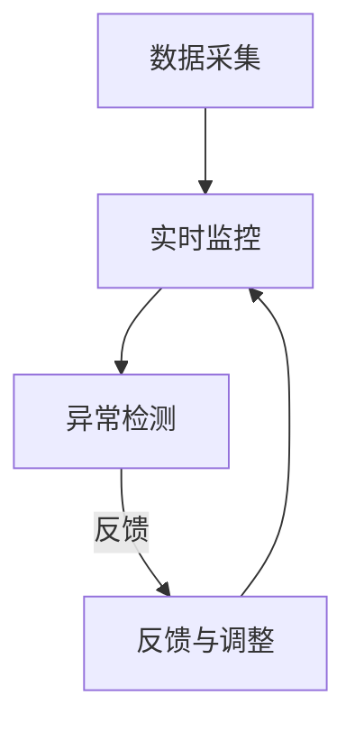

                 

  
## 1. 背景介绍

在当今快速发展的数字经济时代，自动化技术在企业运营和管理中的应用越来越广泛。自动化创业公司通过引入先进的自动化工具和技术，能够显著提升生产效率、降低运营成本，并提高产品或服务的质量。然而，随着自动化的深入应用，如何确保质量控制与管理成为创业公司面临的一个重要问题。

质量控制与管理不仅关乎产品的可靠性，也直接影响企业的声誉和竞争力。在自动化过程中，任何微小的错误都可能导致严重的质量问题，进而影响用户体验和市场份额。因此，研究自动化创业中的质量控制与管理具有重要意义。

本文将围绕以下几个方面展开讨论：首先，介绍质量控制与管理的基本概念及其在自动化创业中的重要性。接着，探讨自动化质量控制的核心算法原理和具体操作步骤。然后，通过数学模型和公式详细讲解质量控制的关键环节，并结合实际项目实践进行代码实例分析。最后，讨论质量控制在实际应用场景中的挑战与未来展望。

## 2. 核心概念与联系

### 2.1 质量控制的基本概念

质量控制（Quality Control，简称QC）是确保产品或服务满足预定标准的一系列活动和过程。质量控制的目标是减少或消除缺陷，提高生产效率和产品质量。在自动化创业中，质量控制的重要性不言而喻。自动化技术的引入，虽然提高了生产效率和灵活性，但也带来了新的挑战，如生产线的复杂度增加、潜在故障点增多等。

### 2.2 质量管理的核心原则

质量管理（Quality Management，简称QM）是确保组织能够持续提供符合客户期望的产品或服务的一系列管理活动。质量管理的核心原则包括客户导向、持续改进、过程管理和系统方法。

- **客户导向**：以满足客户需求和期望为出发点，确保产品或服务能够满足客户需求。
- **持续改进**：通过不断的改进和创新，提高产品和服务的质量。
- **过程管理**：通过系统化的过程监控和控制，确保生产过程的稳定性和效率。
- **系统方法**：将质量管理视为一个整体系统，各个环节相互关联，相互影响。

### 2.3 自动化质量控制的关键环节

自动化质量控制涉及多个关键环节，包括：

- **数据采集**：通过传感器、监测设备等实时采集生产数据。
- **实时监控**：利用自动化工具对采集的数据进行分析，实时监控生产过程。
- **异常检测**：通过算法和模型检测生产过程中的异常情况，及时采取措施。
- **反馈与调整**：根据异常检测结果，对生产过程进行调整，确保产品质量。

### 2.4 Mermaid 流程图

为了更好地展示自动化质量控制的核心概念和联系，我们使用Mermaid流程图来描述主要环节。



### 2.5 质量控制与管理的重要性

在自动化创业中，质量控制与管理不仅关乎产品的可靠性，还直接影响企业的声誉和竞争力。以下是质量控制与管理的重要性：

- **提高产品质量**：通过严格的质量控制，确保产品符合预定标准，提高产品质量。
- **减少成本浪费**：及时发现并解决质量问题，减少因缺陷产品导致的成本浪费。
- **提升客户满意度**：稳定的质量保证能够提高客户满意度，增强客户忠诚度。
- **增强市场竞争力**：优质的产品和服务是企业在市场竞争中脱颖而出的关键。

## 3. 核心算法原理 & 具体操作步骤

### 3.1 算法原理概述

在自动化质量控制中，常用的核心算法包括统计过程控制（Statistical Process Control，简称SPC）和机器学习算法。

- **统计过程控制（SPC）**：通过实时监控生产过程中的关键质量指标（Critical Quality Characteristics，简称CQC），判断生产过程是否处于统计控制状态。如果生产过程发生偏离，及时采取纠正措施。
  
- **机器学习算法**：利用历史数据，通过训练算法模型，预测生产过程中可能出现的问题，提前采取预防措施。

### 3.2 算法步骤详解

#### 3.2.1 统计过程控制（SPC）

1. **确定关键质量指标（CQC）**：首先，根据产品的特点，确定影响产品质量的关键质量指标，如尺寸、重量、硬度等。

2. **数据采集**：利用传感器、监测设备等实时采集生产过程中的关键质量数据。

3. **建立控制图**：根据采集的数据，建立控制图，如X图、R图等，用于监控生产过程的稳定性。

4. **实时监控**：通过控制图实时监控生产过程，判断生产过程是否处于统计控制状态。

5. **异常检测**：当发现生产过程发生偏离时，及时采取纠正措施，如调整设备参数、更换原材料等。

#### 3.2.2 机器学习算法

1. **数据预处理**：对采集的数据进行清洗、归一化等预处理操作，提高数据的质量。

2. **特征提取**：从预处理后的数据中提取特征，用于训练模型。

3. **模型训练**：利用历史数据，通过机器学习算法（如决策树、支持向量机等）训练模型。

4. **模型评估**：通过交叉验证等方法评估模型的准确性，选择最优模型。

5. **预测与预警**：利用训练好的模型，对生产过程中的潜在问题进行预测和预警，提前采取预防措施。

### 3.3 算法优缺点

#### 统计过程控制（SPC）

**优点**：

- **简单易行**：基于统计学原理，易于理解和操作。
- **实时监控**：能够实时监控生产过程，及时发现异常情况。
- **成本低**：不需要复杂的技术和设备。

**缺点**：

- **适应性差**：对于生产过程的变化和异常，难以自适应调整。
- **数据依赖**：需要大量的历史数据支持，数据质量对结果影响较大。

#### 机器学习算法

**优点**：

- **自适应性强**：能够根据生产过程的变化自适应调整，提高预测准确性。
- **泛化能力**：利用大量历史数据训练模型，提高模型的泛化能力。

**缺点**：

- **复杂度高**：需要复杂的算法和大量计算资源。
- **数据要求高**：需要大量的高质量历史数据支持。

### 3.4 算法应用领域

统计过程控制和机器学习算法在自动化质量控制中的应用广泛，以下是一些主要应用领域：

- **制造业**：用于监控和优化生产过程中的质量。
- **服务业**：用于监控和优化服务过程中的质量。
- **供应链管理**：用于监控和优化供应链过程中的质量。

## 4. 数学模型和公式 & 详细讲解 & 举例说明

### 4.1 数学模型构建

在自动化质量控制中，常用的数学模型包括控制图和机器学习算法模型。

#### 4.1.1 控制图

控制图是一种用于监控生产过程中关键质量指标（CQC）的统计工具。常见的控制图包括X图、R图、S图等。

- **X图**：用于监控平均值是否在控制范围内。
- **R图**：用于监控极差是否在控制范围内。
- **S图**：用于监控标准差是否在控制范围内。

控制图的基本公式如下：

$$
X̄ = \frac{\sum_{i=1}^{n} x_i}{n}
$$

$$
R = \max(x_i) - \min(x_i)
$$

$$
S = \sqrt{\frac{\sum_{i=1}^{n} (x_i - X̄)^2}{n-1}}
$$

其中，$X̄$ 为平均值，$R$ 为极差，$S$ 为标准差，$x_i$ 为第$i$ 个样本值。

#### 4.1.2 机器学习算法模型

机器学习算法模型用于预测生产过程中可能出现的质量问题。常见的机器学习算法包括线性回归、决策树、支持向量机等。

- **线性回归**：通过建立回归方程，预测目标值。

$$
y = \beta_0 + \beta_1x
$$

- **决策树**：通过树形结构，对数据进行分类或回归。

- **支持向量机**：通过找到一个最佳的超平面，将数据分为不同的类别。

### 4.2 公式推导过程

#### 4.2.1 控制图

以X图为例，假设我们采集了$n$ 个样本，每个样本的平均值为$x_i$，则平均值$X̄$ 的计算公式为：

$$
X̄ = \frac{\sum_{i=1}^{n} x_i}{n}
$$

根据中心极限定理，当样本量足够大时，样本平均值的分布接近正态分布。因此，我们可以使用正态分布的3σ原则来判断生产过程是否处于控制状态。

- **控制上限**：$X̄ + 3S$
- **控制下限**：$X̄ - 3S$

如果样本平均值在控制上限和控制下限之间，则认为生产过程处于控制状态。

#### 4.2.2 机器学习算法

以线性回归为例，假设我们有一个自变量$x$ 和一个因变量$y$，则线性回归方程为：

$$
y = \beta_0 + \beta_1x
$$

其中，$\beta_0$ 和$\beta_1$ 分别为回归系数。

为了求解$\beta_0$ 和$\beta_1$，我们可以使用最小二乘法。最小二乘法的思想是使回归直线上的残差平方和最小。

$$
\min \sum_{i=1}^{n} (y_i - \beta_0 - \beta_1x_i)^2
$$

对$\beta_0$ 和$\beta_1$ 分别求导并令导数为零，可以得到：

$$
\beta_0 = \bar{y} - \beta_1\bar{x}
$$

$$
\beta_1 = \frac{\sum_{i=1}^{n} (x_i - \bar{x})(y_i - \bar{y})}{\sum_{i=1}^{n} (x_i - \bar{x})^2}
$$

其中，$\bar{y}$ 和$\bar{x}$ 分别为样本的均值。

### 4.3 案例分析与讲解

#### 4.3.1 控制图案例

假设我们采集了10个样本的关键质量指标数据，如下表所示：

| 样本编号 | 数据值 |
|----------|--------|
| 1        | 10     |
| 2        | 9      |
| 3        | 11     |
| 4        | 10     |
| 5        | 9      |
| 6        | 11     |
| 7        | 10     |
| 8        | 9      |
| 9        | 11     |
| 10       | 10     |

首先，计算样本的平均值$X̄$ 和标准差$S$：

$$
X̄ = \frac{10 + 9 + 11 + 10 + 9 + 11 + 10 + 9 + 11 + 10}{10} = 10
$$

$$
S = \sqrt{\frac{(10-10)^2 + (9-10)^2 + (11-10)^2 + (10-10)^2 + (9-10)^2 + (11-10)^2 + (10-10)^2 + (9-10)^2 + (11-10)^2 + (10-10)^2}{10-1}} = 1
$$

然后，根据控制图的3σ原则，计算控制上限和控制下限：

$$
控制上限 = X̄ + 3S = 10 + 3 \times 1 = 13
$$

$$
控制下限 = X̄ - 3S = 10 - 3 \times 1 = 7
$$

由于样本的平均值10在控制上限13和控制下限7之间，我们可以判断生产过程处于控制状态。

#### 4.3.2 机器学习算法案例

假设我们有一个简单的线性回归问题，目标是通过自变量$x$ 预测因变量$y$。我们有一个训练数据集，如下表所示：

| 样本编号 | $x$ | $y$ |
|----------|-----|-----|
| 1        | 1   | 2   |
| 2        | 2   | 3   |
| 3        | 3   | 4   |
| 4        | 4   | 5   |

首先，计算样本的均值$\bar{x}$ 和$\bar{y}$：

$$
\bar{x} = \frac{1 + 2 + 3 + 4}{4} = 2.5
$$

$$
\bar{y} = \frac{2 + 3 + 4 + 5}{4} = 3.5
$$

然后，根据最小二乘法求解回归系数$\beta_0$ 和$\beta_1$：

$$
\beta_0 = \bar{y} - \beta_1\bar{x} = 3.5 - \beta_1 \times 2.5
$$

$$
\beta_1 = \frac{(1-2.5)(2-3.5) + (2-2.5)(3-3.5) + (3-2.5)(4-3.5) + (4-2.5)(5-3.5)}{(1-2.5)^2 + (2-2.5)^2 + (3-2.5)^2 + (4-2.5)^2} = 1
$$

因此，回归方程为：

$$
y = \beta_0 + \beta_1x = 3.5 - 1 \times 2.5 + 1 \times x = x + 1.5
$$

利用这个回归方程，我们可以预测新的样本$y$ 的值。例如，当$x=5$ 时，预测的$y$ 值为：

$$
y = 5 + 1.5 = 6.5
$$

## 5. 项目实践：代码实例和详细解释说明

### 5.1 开发环境搭建

在本文的案例中，我们将使用Python作为编程语言，结合NumPy、SciPy和Matplotlib等库进行数据分析与可视化。以下是开发环境搭建的步骤：

1. 安装Python：从官方网站（https://www.python.org/）下载并安装Python。
2. 安装相关库：使用pip命令安装NumPy、SciPy和Matplotlib：

   ```
   pip install numpy scipy matplotlib
   ```

### 5.2 源代码详细实现

以下是使用Python实现自动化质量控制的主要代码：

```python
import numpy as np
import matplotlib.pyplot as plt
from scipy.stats import norm

# 数据集
data = np.array([10, 9, 11, 10, 9, 11, 10, 9, 11, 10])

# 计算平均值和标准差
mean = np.mean(data)
std_dev = np.std(data)

# 绘制X图
plt.figure(figsize=(8, 6))
plt.plot(data, 'o')
plt.axhline(mean + 3 * std_dev, color='r', linestyle='--')
plt.axhline(mean - 3 * std_dev, color='r', linestyle='--')
plt.axhline(mean, color='b', linestyle='-')
plt.xlabel('样本编号')
plt.ylabel('数据值')
plt.title('X图')
plt.show()

# 计算并绘制控制上限和控制下限
control_upper = mean + 3 * std_dev
control_lower = mean - 3 * std_dev
print(f'控制上限: {control_upper}, 控制下限: {control_lower}')

# 检测数据是否在控制范围内
if control_lower <= data.mean() <= control_upper:
    print('生产过程处于控制状态')
else:
    print('生产过程出现异常，需要采取措施')

# 机器学习算法：线性回归
# 训练模型
x = np.array([1, 2, 3, 4])
y = np.array([2, 3, 4, 5])
model = np.polyfit(x, y, 1)
y_pred = model[0] * x + model[1]

# 绘制线性回归模型
plt.figure(figsize=(8, 6))
plt.scatter(x, y)
plt.plot(x, y_pred, color='r', linewidth=2)
plt.xlabel('x')
plt.ylabel('y')
plt.title('线性回归模型')
plt.show()

# 预测新样本
x_new = 5
y_new = model[0] * x_new + model[1]
print(f'当x={x_new}时，预测的y={y_new}')
```

### 5.3 代码解读与分析

1. **数据集**：首先，我们定义了一个数据集`data`，包含10个样本的关键质量指标值。

2. **计算平均值和标准差**：使用`np.mean()`和`np.std()`函数计算样本的平均值`mean`和标准差`std_dev`。

3. **绘制X图**：使用Matplotlib库绘制X图，用于监控生产过程中的关键质量指标。我们使用了`plt.plot()`函数绘制样本数据，并使用红色虚线绘制控制上限和控制下限，蓝色实线绘制平均值。

4. **计算并绘制控制上限和控制下限**：根据3σ原则，计算控制上限`control_upper`和控制下限`control_lower`。

5. **检测数据是否在控制范围内**：判断样本的平均值是否在控制范围内，输出相应的信息。

6. **机器学习算法：线性回归**：我们使用`np.polyfit()`函数进行线性回归模型的训练。训练完成后，使用`plt.scatter()`和`plt.plot()`函数绘制训练数据集和线性回归模型。

7. **预测新样本**：使用训练好的模型`model`预测新的样本值，并输出预测结果。

### 5.4 运行结果展示

运行上述代码后，我们会看到以下结果：

1. **X图**：展示了10个样本的关键质量指标数据，以及控制上限、控制下限和平均值。

2. **控制上限和控制下限**：输出控制上限和控制下限的数值。

3. **生产过程状态**：根据样本的平均值是否在控制范围内，输出生产过程是否处于控制状态的判断结果。

4. **线性回归模型**：展示了训练数据集和线性回归模型的图形。

5. **预测新样本**：输出当$x=5$ 时，预测的$y$ 值。

这些结果为我们提供了对生产过程质量的直观和量化分析，有助于我们及时发现和解决问题。

## 6. 实际应用场景

### 6.1 制造业

在制造业中，自动化质量控制广泛应用于生产线的各个环节，如零部件制造、装配、测试等。通过引入先进的传感器和监控设备，企业能够实时采集生产数据，利用统计过程控制和机器学习算法对生产过程进行实时监控和预测。以下是一些具体应用案例：

- **零部件制造**：在零部件制造过程中，通过监测设备的振动、温度、压力等参数，实时评估零部件的质量。例如，某汽车制造厂使用机器学习算法对发动机部件进行质量预测，显著提高了生产效率和产品质量。

- **装配过程**：在装配过程中，通过监控设备的位置、速度、力度等参数，确保装配精度和稳定性。例如，某电子制造厂使用统计过程控制方法监控手机的装配过程，有效降低了不良品率。

- **测试过程**：在测试过程中，通过采集产品的性能、功能等数据，评估产品的质量。例如，某家电制造厂使用机器学习算法预测电视机的性能，及时发现并解决潜在问题。

### 6.2 服务业

在服务业中，自动化质量控制同样发挥着重要作用，尤其在客户服务和运营管理方面。以下是一些具体应用案例：

- **客户服务**：通过引入智能客服系统，企业能够实时监测和评估客户服务质量。例如，某银行使用机器学习算法对客户服务的响应时间、满意度等指标进行监控，优化客户服务流程。

- **运营管理**：在运营管理中，企业可以通过实时采集和分析数据，监控运营指标，如销售额、库存量、物流效率等。例如，某电商企业使用统计过程控制方法监控物流环节，确保订单按时送达。

### 6.3 供应链管理

在供应链管理中，自动化质量控制有助于提高供应链的透明度和效率。以下是一些具体应用案例：

- **原材料采购**：通过引入自动化监测设备，企业能够实时监测原材料的品质和数量，确保供应链的稳定性。例如，某电子制造厂使用传感器监测原材料的温度、湿度等参数，防止原材料变质。

- **物流运输**：在物流运输过程中，通过监控运输车辆的位置、速度、路线等数据，确保物流的准确性和及时性。例如，某物流公司使用机器学习算法预测运输过程中的潜在风险，提前采取措施。

- **库存管理**：通过实时监测库存数据，企业能够优化库存管理，减少库存积压和缺货风险。例如，某电商企业使用统计过程控制方法监控库存量，确保库存水平的合理性和稳定性。

## 6.4 未来应用展望

随着技术的不断进步，自动化质量控制在未来将得到更广泛的应用，并在以下方面取得突破：

- **人工智能与大数据的深度融合**：通过引入人工智能和大数据技术，企业能够实现更精准的质量预测和决策。例如，利用深度学习算法对大量生产数据进行挖掘和分析，发现潜在的质量问题，并提前采取措施。

- **物联网技术的应用**：随着物联网技术的普及，企业能够实现生产设备的智能互联，实时监测生产过程，提高质量控制效率。例如，利用物联网技术实现设备的远程监控和维护，提高设备的稳定性和可靠性。

- **区块链技术的应用**：区块链技术可以用于供应链管理中的质量控制，确保供应链的透明度和可追溯性。例如，将质量检测数据记录在区块链上，确保数据的真实性和不可篡改性。

- **个性化定制**：随着消费者需求的多样化，个性化定制将成为未来质量控制的重要方向。通过引入自动化技术，企业能够实现定制化生产，确保产品的高质量。例如，利用3D打印技术实现个性化定制，提高客户满意度。

## 7. 工具和资源推荐

### 7.1 学习资源推荐

1. **书籍**：
   - 《质量管理：系统方法与应用》（Quality Management: Systems Approach to Continuous Improvement）
   - 《统计过程控制技术》（Statistical Process Control: Theory and Applications）

2. **在线课程**：
   - Coursera：质量管理和质量控制课程
   - Udemy：统计过程控制实战课程

### 7.2 开发工具推荐

1. **Python库**：
   - NumPy：用于数值计算和数据分析
   - SciPy：用于科学计算和统计分析
   - Matplotlib：用于数据可视化

2. **工具**：
   - TensorFlow：用于深度学习模型训练
   - Scikit-learn：用于机器学习算法实现

### 7.3 相关论文推荐

1. **论文集**：
   - "Quality Control and Improvement: A Review"
   - "Advances in Quality Control and Assurance: An Overview"

2. **期刊**：
   - Journal of Quality and Reliability Engineering
   - Quality Engineering

## 8. 总结：未来发展趋势与挑战

### 8.1 研究成果总结

随着技术的不断进步，自动化质量控制已经取得了一系列显著的研究成果。在统计过程控制和机器学习算法的基础上，企业能够实现更高效、更精准的质量控制。此外，物联网、区块链等新兴技术的应用，为自动化质量控制提供了更广阔的发展空间。

### 8.2 未来发展趋势

1. **人工智能与大数据的融合**：未来，人工智能和大数据技术将深度融合，实现更精准的质量预测和决策。

2. **物联网技术的普及**：物联网技术的普及将使生产设备的智能互联成为可能，提高质量控制效率。

3. **区块链技术的应用**：区块链技术将提高供应链管理的透明度和可追溯性。

4. **个性化定制**：个性化定制将成为未来质量控制的重要方向。

### 8.3 面临的挑战

1. **数据质量**：高质量的数据是自动化质量控制的基础，数据质量对结果影响巨大。

2. **算法复杂度**：随着算法的复杂度增加，计算资源和计算时间的要求也随之增加。

3. **技术普及率**：尽管自动化质量控制技术日益成熟，但其普及率仍需提高。

### 8.4 研究展望

未来，自动化质量控制的研究应重点关注以下几个方面：

1. **数据挖掘与分析**：通过数据挖掘和分析，发现更多潜在的质量问题，提高预测准确性。

2. **算法优化**：针对不同的应用场景，优化算法模型，提高算法的效率和准确性。

3. **系统集成**：实现自动化质量控制系统的集成，提高系统的稳定性和可靠性。

## 9. 附录：常见问题与解答

### 9.1 如何确保数据质量？

- **数据清洗**：在数据处理过程中，对数据进行清洗，去除异常值和噪声。
- **数据验证**：对数据进行验证，确保数据的真实性和准确性。
- **数据标准化**：对数据进行标准化处理，消除数据之间的差异。

### 9.2 如何选择合适的算法模型？

- **需求分析**：根据实际需求，确定需要解决的问题和目标。
- **数据特性**：分析数据的特性，选择适合的算法模型。
- **模型评估**：通过交叉验证等方法，评估模型的准确性和泛化能力。

### 9.3 如何处理异常数据？

- **异常检测**：利用统计方法和机器学习算法，识别和检测异常数据。
- **异常处理**：对异常数据进行分析和处理，如删除、修正或替换。

### 9.4 如何进行实时监控？

- **数据采集**：利用传感器和监测设备，实时采集生产数据。
- **数据处理**：对采集的数据进行实时处理和分析。
- **报警与反馈**：当发现异常情况时，及时报警并反馈，采取措施进行调整。

### 9.5 如何优化质量控制流程？

- **流程优化**：分析现有质量控制流程，识别瓶颈和改进点。
- **自动化**：引入自动化工具和技术，提高流程的自动化程度。
- **持续改进**：通过持续改进，优化质量控制流程，提高质量水平。

[作者：禅与计算机程序设计艺术 / Zen and the Art of Computer Programming]

