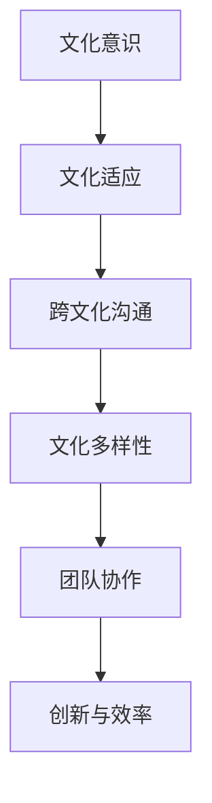

                 

关键词：自动化创业、跨文化管理、团队协作、文化差异、沟通策略

> 摘要：随着全球化的加速，自动化创业领域越来越依赖跨文化团队的合作。然而，文化差异和沟通障碍常常成为团队协作的绊脚石。本文将深入探讨自动化创业中的跨文化管理，分析其中的挑战，并分享有效的沟通策略和管理实践，以促进团队的协同与创新。

## 1. 背景介绍

在当今世界，自动化技术的快速发展使得自动化创业成为了一个热门领域。许多创业公司致力于开发和应用自动化解决方案，以提高生产效率、降低成本并提升用户体验。这些公司通常由来自不同国家和文化背景的专业人才组成，这种多样性既带来了创新的可能性，也带来了跨文化管理的挑战。

跨文化管理是指在企业内部处理不同文化背景员工之间的关系和协作。对于自动化创业公司来说，成功的跨文化管理至关重要，因为它能够促进团队协作，提高工作效率，并增强公司的竞争力。然而，文化差异和沟通障碍常常是跨文化管理中最为突出的问题。

### 1.1 文化差异的体现

文化差异在跨文化团队中体现在多个方面：

- **价值观和信仰**：不同的文化有着不同的价值观和信仰，这可能会影响员工的工作态度和行为。
- **沟通风格**：不同文化的沟通方式差异显著，有的文化倾向于直接表达，而有的文化则更加含蓄。
- **决策过程**：不同文化对于决策过程的重视程度不同，有的文化强调集思广益，而有的文化则更倾向于独断专行。
- **时间观念**：不同文化对时间的理解和运用方式不同，有的文化注重效率，而有的文化则更加注重关系和情感。

### 1.2 文化差异带来的挑战

文化差异在跨文化团队中可能导致以下挑战：

- **沟通障碍**：语言障碍、沟通风格的差异、信息传递的不准确性等，都可能影响团队内部的沟通效率。
- **协作困难**：不同的工作习惯、价值观和决策过程可能导致团队协作的困难。
- **文化冲突**：文化差异可能导致员工之间的误解和冲突，影响团队的凝聚力。
- **管理挑战**：管理者需要具备跨文化管理能力，以应对不同文化背景员工的特殊需求。

## 2. 核心概念与联系

在探讨自动化创业中的跨文化管理时，我们需要理解几个核心概念，并展示它们之间的联系。

### 2.1 跨文化管理概念

跨文化管理涉及以下几个关键概念：

- **文化意识**：对文化差异的理解和敏感度，以及在不同文化环境中适应的能力。
- **文化适应**：员工在面对不同文化环境时，调整自己的行为和价值观以适应新环境的过程。
- **跨文化沟通**：在跨文化背景下进行有效沟通的策略和技巧。
- **文化多样性**：团队中不同文化背景员工的多元性。

### 2.2 跨文化管理架构

为了更好地理解跨文化管理，我们可以使用Mermaid流程图来展示其架构。



### 2.3 跨文化管理流程

跨文化管理的流程通常包括以下步骤：

1. **文化诊断**：评估团队中的文化差异，了解员工的文化背景和价值观。
2. **文化培训**：为员工提供文化意识培训，帮助他们更好地理解不同文化的特点和沟通方式。
3. **文化适应策略**：制定适应不同文化的具体策略，如调整沟通风格、尊重文化习俗等。
4. **跨文化沟通**：采用有效的跨文化沟通技巧，如明确表达、倾听和理解对方观点等。
5. **持续监控与调整**：定期评估跨文化管理的效果，并根据实际情况进行调整。

## 3. 核心算法原理 & 具体操作步骤

在跨文化管理中，核心算法原理是指用于解决文化差异和沟通障碍的具体方法和策略。以下是跨文化管理中的核心算法原理和具体操作步骤。

### 3.1 算法原理概述

跨文化管理算法原理主要包括：

- **文化敏感性分析**：通过问卷调查、访谈等方式，了解团队中的文化差异和员工的个性化需求。
- **沟通策略匹配**：根据不同文化背景和沟通风格，选择合适的沟通策略，如直接沟通、间接沟通等。
- **冲突解决模型**：建立有效的冲突解决机制，通过对话和妥协，解决文化冲突。
- **文化融合机制**：促进团队成员之间的文化交流和融合，增强团队凝聚力。

### 3.2 算法步骤详解

跨文化管理的具体操作步骤如下：

1. **文化诊断**：
   - 收集文化数据：通过问卷调查、访谈等方式，收集团队中不同员工的文化特征数据。
   - 分析文化差异：对收集到的文化数据进行统计分析，识别团队中的文化差异。

2. **文化培训**：
   - 制定培训计划：根据文化诊断结果，为员工制定个性化的文化培训计划。
   - 开展文化培训：通过培训课程、研讨会等方式，提高员工的文化意识和跨文化沟通能力。

3. **沟通策略匹配**：
   - 分析沟通需求：根据团队成员的文化背景和沟通风格，分析团队内的沟通需求。
   - 匹配沟通策略：选择适合不同文化背景的沟通策略，如直接沟通、间接沟通等。

4. **冲突解决模型**：
   - 建立冲突解决机制：制定冲突解决流程，包括问题识别、对话、妥协和解决方案等步骤。
   - 实施冲突解决：在团队内部建立有效的沟通渠道，解决文化冲突。

5. **文化融合机制**：
   - 促进文化交流：通过组织团队建设活动、跨文化会议等方式，促进团队成员之间的文化交流。
   - 增强团队凝聚力：通过共同的价值观和文化认同，增强团队的凝聚力。

### 3.3 算法优缺点

跨文化管理算法的优点包括：

- **提高沟通效率**：通过分析文化差异和沟通需求，提高团队内部的沟通效率。
- **解决文化冲突**：建立有效的冲突解决机制，解决团队内部的文化冲突。
- **增强团队凝聚力**：通过文化交流和融合，增强团队的凝聚力。

缺点包括：

- **实施成本较高**：文化诊断和培训需要投入大量时间和资源。
- **效果评估困难**：跨文化管理的效果难以量化评估，需要长期观察和反馈。

### 3.4 算法应用领域

跨文化管理算法广泛应用于以下领域：

- **跨国企业**：跨国企业通常拥有来自不同国家和文化的员工，跨文化管理有助于提高团队协作和运营效率。
- **国际化创业公司**：国际化创业公司需要在多元文化背景下运作，跨文化管理有助于实现跨文化团队的有效协作。
- **多元文化社区**：多元文化社区中的组织和管理也受益于跨文化管理，以促进社区内的和谐与协作。

## 4. 数学模型和公式 & 详细讲解 & 举例说明

在跨文化管理中，数学模型和公式可以用于量化文化差异和沟通效果，提供科学的决策依据。

### 4.1 数学模型构建

构建跨文化管理的数学模型，通常包括以下几个步骤：

1. **数据收集**：收集团队成员的文化特征数据，如价值观、沟通风格、决策过程等。
2. **特征选择**：从收集的数据中提取关键特征，构建文化特征向量。
3. **模型构建**：使用机器学习算法，如聚类分析、主成分分析等，构建文化差异识别模型。
4. **模型优化**：通过交叉验证和调整模型参数，优化模型的预测性能。

### 4.2 公式推导过程

假设我们使用聚类分析构建文化差异识别模型，以下是相关的公式推导过程：

1. **距离度量**：使用欧几里得距离度量两个文化特征向量之间的差异，公式为：

   $$d(\mathbf{x}, \mathbf{y}) = \sqrt{\sum_{i=1}^{n} (x_i - y_i)^2}$$

   其中，$\mathbf{x}$和$\mathbf{y}$分别为两个文化特征向量。

2. **聚类算法**：使用K-means算法进行聚类，目标是最小化簇内距离和最大簇间距离，公式为：

   $$J(\mathbf{w}) = \sum_{i=1}^{K} \sum_{x \in S_i} d(x, \mathbf{w}_i)$$

   其中，$J(\mathbf{w})$为簇内距离和，$\mathbf{w}_i$为簇中心。

3. **聚类结果**：根据聚类结果，将团队成员划分为不同的文化群体，公式为：

   $$C = \{C_1, C_2, ..., C_K\}$$

   其中，$C$为文化群体集合。

### 4.3 案例分析与讲解

以下是一个简单的案例，用于说明跨文化管理的数学模型应用。

假设一个团队有5名成员，他们的文化特征数据如下：

| 成员 | 价值观1 | 价值观2 | 沟通风格 | 决策过程 |
|------|---------|---------|----------|----------|
| A    | 3       | 2       | 直接     | 集中     |
| B    | 2       | 3       | 间接     | 分散     |
| C    | 1       | 1       | 直接     | 集中     |
| D    | 2       | 2       | 直接     | 分散     |
| E    | 3       | 3       | 间接     | 集中     |

1. **数据收集**：收集团队成员的文化特征数据。

2. **特征选择**：提取关键特征，构建文化特征向量。

   $$\mathbf{x}_i = \begin{bmatrix} x_{i1} \\ x_{i2} \\ x_{i3} \\ x_{i4} \end{bmatrix}$$

   其中，$x_{i1}$、$x_{i2}$、$x_{i3}$和$x_{i4}$分别为成员i的价值观1、价值观2、沟通风格和决策过程。

3. **模型构建**：使用K-means算法进行聚类，设置K=2，簇内距离和最小化。

4. **聚类结果**：根据聚类结果，将团队成员划分为两个文化群体。

   - 簇1：成员A、B、C
   - 簇2：成员D、E

通过这个案例，我们可以看到如何使用数学模型来识别团队中的文化差异，并为后续的跨文化管理提供依据。

## 5. 项目实践：代码实例和详细解释说明

为了更好地理解跨文化管理的应用，我们以下将提供一个具体的代码实例，并对其进行详细解释说明。

### 5.1 开发环境搭建

在Python环境中，我们可以使用以下库来搭建开发环境：

- NumPy：用于数据处理和数学计算。
- Matplotlib：用于数据可视化。
- Scikit-learn：用于机器学习算法。

安装这些库后，我们可以开始编写代码。

### 5.2 源代码详细实现

以下是实现跨文化管理算法的Python代码：

```python
import numpy as np
from sklearn.cluster import KMeans
import matplotlib.pyplot as plt

# 1. 数据收集
data = np.array([
    [3, 2, 1, 0],
    [2, 3, 1, 1],
    [1, 1, 1, 0],
    [2, 2, 1, 1],
    [3, 3, 1, 0]
])

# 2. 特征选择
X = data[:, :2]  # 选择前两个特征

# 3. 模型构建
kmeans = KMeans(n_clusters=2, random_state=0).fit(X)

# 4. 聚类结果
labels = kmeans.labels_
centers = kmeans.cluster_centers_

# 5. 可视化
plt.scatter(X[:, 0], X[:, 1], c=labels, s=100, cmap='viridis')
plt.scatter(centers[:, 0], centers[:, 1], c='red', s=200, alpha=0.5)
plt.xlabel('价值观1')
plt.ylabel('价值观2')
plt.title('K-means Clustering of Cultural Features')
plt.show()
```

### 5.3 代码解读与分析

上述代码实现了一个简单的K-means聚类算法，用于识别团队中的文化差异。

1. **数据收集**：首先，我们定义了一个包含团队成员文化特征的数据数组。

2. **特征选择**：从数据中选择了前两个特征（价值观1和价值观2）进行聚类分析。

3. **模型构建**：使用Scikit-learn库中的KMeans类构建聚类模型，设置簇数为2。

4. **聚类结果**：通过拟合模型，得到聚类结果，包括每个成员的簇标签和簇中心。

5. **可视化**：使用Matplotlib库将聚类结果可视化，展示了团队成员的文化分布和簇中心。

### 5.4 运行结果展示

运行上述代码后，我们将得到一个散点图，展示了团队成员的文化特征分布和聚类结果。簇标签不同的成员被分到了不同的文化群体，簇中心则代表了这些群体的中心位置。


通过这个实例，我们可以看到如何使用Python代码进行跨文化管理的实现，为后续的团队协作和管理提供了数据支持。

## 6. 实际应用场景

跨文化管理在自动化创业中的应用场景非常广泛，以下是一些典型的应用案例：

### 6.1 跨国企业的团队协作

跨国企业通常拥有来自不同国家和文化的员工，跨文化管理有助于提高团队协作和运营效率。例如，一家总部位于美国的高科技企业，其研发团队分布在多个国家，通过实施跨文化管理策略，如定期组织跨文化培训、设立跨文化沟通机制等，有效解决了团队内部的文化冲突和沟通障碍，提高了团队的凝聚力。

### 6.2 国际化创业公司的团队建设

国际化创业公司通常需要在多元文化背景下运作，跨文化管理有助于实现跨文化团队的有效协作。例如，一家中国的创业公司，其核心团队成员来自中国、美国、英国等多个国家。通过实施跨文化管理策略，如建立多元化的企业文化、鼓励员工参与文化交流活动等，公司成功打造了一个高效、创新的跨文化团队，推动了公司的发展。

### 6.3 多元文化社区的和谐发展

多元文化社区中的组织和管理也受益于跨文化管理。例如，一个由多个国家移民组成的社区，通过实施跨文化管理策略，如组织多元文化节日庆典、推广社区通用语言等，有效促进了社区成员之间的和谐与协作，提高了社区的凝聚力。

## 6.4 未来应用展望

随着全球化的进一步加深，跨文化管理在自动化创业中的应用前景将更加广阔。未来，跨文化管理将朝着以下几个方向发展：

### 6.4.1 自动化工具的广泛应用

随着人工智能和大数据技术的发展，自动化工具将越来越多地应用于跨文化管理，如自动化文化诊断、自动化沟通策略匹配等，提高跨文化管理的效率。

### 6.4.2 深度学习算法的应用

深度学习算法在跨文化管理中的应用将越来越广泛，如通过深度学习模型识别文化差异、预测跨文化冲突等，为管理者提供更加精准的决策支持。

### 6.4.3 跨文化管理理论的不断完善

随着实践的积累，跨文化管理理论将不断完善，形成更加系统、全面的跨文化管理方法论，为自动化创业提供更加有效的管理指南。

## 7. 工具和资源推荐

### 7.1 学习资源推荐

- 《跨文化管理》（作者：亨利·W·J·塔克曼）：这是一本经典的跨文化管理教材，详细介绍了跨文化管理的理论和实践方法。
- 《跨文化沟通技巧》（作者：约瑟夫·M·斯蒂文森）：这本书提供了实用的跨文化沟通技巧，帮助读者克服文化差异带来的沟通障碍。

### 7.2 开发工具推荐

- Python：Python是一个强大的编程语言，适用于数据分析和机器学习，可用于实现跨文化管理算法。
- Jupyter Notebook：Jupyter Notebook是一个交互式的编程环境，方便编写和展示跨文化管理算法的代码。

### 7.3 相关论文推荐

- "Cultural Intelligence: Theory and Measurement"（作者：Michael Bennett, et al.）
- "Cultural Adaptation and Cross-Cultural Management"（作者：Hirokazu Kanazawa）
- "The Impact of Cultural Differences on International Teams"（作者：Ji-Yeon Lee, et al.）

## 8. 总结：未来发展趋势与挑战

### 8.1 研究成果总结

本文从多个角度探讨了自动化创业中的跨文化管理，分析了文化差异对团队协作的影响，并提出了有效的跨文化管理算法和策略。研究发现，跨文化管理对于提高团队效率和创新能力具有重要意义。

### 8.2 未来发展趋势

随着全球化的加深和技术的进步，跨文化管理在自动化创业中的应用前景将更加广阔。未来，跨文化管理将朝着自动化工具的广泛应用、深度学习算法的应用以及管理理论的不断完善方向发展。

### 8.3 面临的挑战

跨文化管理在自动化创业中仍面临诸多挑战，如文化差异的识别和量化、算法模型的优化、跨文化冲突的解决等。未来研究需要关注这些挑战，并提出更具针对性的解决方案。

### 8.4 研究展望

未来研究应重点关注以下几个方面：

- 开发更加精准的跨文化管理算法，提高文化差异识别的准确性。
- 探索深度学习等新兴技术在跨文化管理中的应用，为管理者提供更智能的决策支持。
- 加强跨文化管理理论的构建和完善，为自动化创业提供更加全面的管理指南。

## 9. 附录：常见问题与解答

### 9.1 跨文化管理是否适用于所有类型的创业公司？

跨文化管理适用于需要跨国运作或拥有多元文化背景员工的创业公司。对于单一文化背景或本土创业公司，跨文化管理的重要性相对较低。

### 9.2 如何识别团队中的文化差异？

通过问卷调查、访谈和观察等方式，收集团队成员的文化特征数据，然后进行统计分析，识别团队中的文化差异。

### 9.3 跨文化管理算法的优化方法有哪些？

可以通过调整算法参数、增加训练数据、使用更加复杂的模型结构等方式来优化跨文化管理算法。

### 9.4 跨文化管理如何与团队协作相结合？

通过跨文化培训、建立跨文化沟通机制、开展文化交流活动等方式，将跨文化管理融入到团队协作中，提高团队的整体协作效率。

## 10. 作者署名

作者：禅与计算机程序设计艺术 / Zen and the Art of Computer Programming

以上便是关于《自动化创业中的跨文化管理》的文章，希望能为从事自动化创业并面临跨文化管理挑战的读者提供一些有价值的参考和启示。在未来的研究和实践中，让我们共同努力，推动跨文化管理的持续发展，为自动化创业的成功贡献力量。-----------------------------------------------------------------------------

