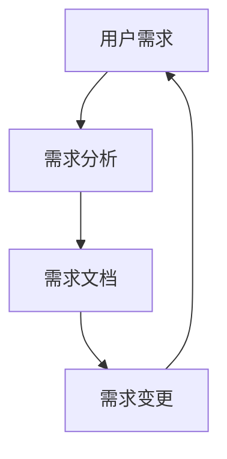
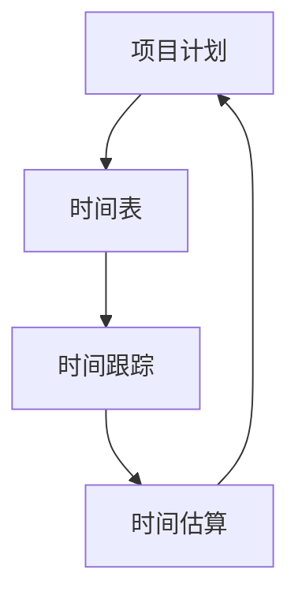
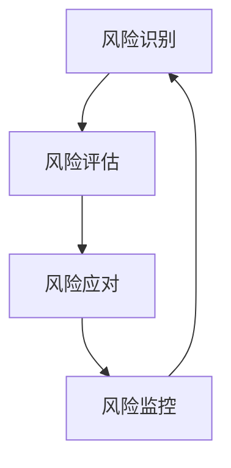
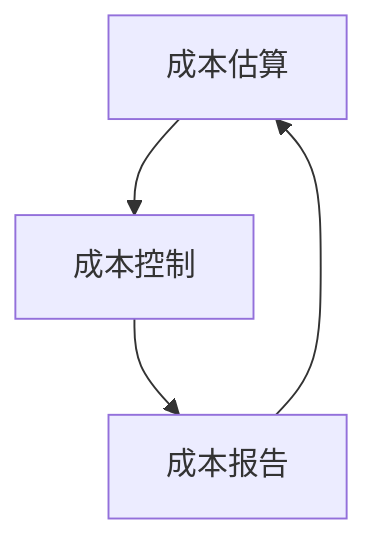
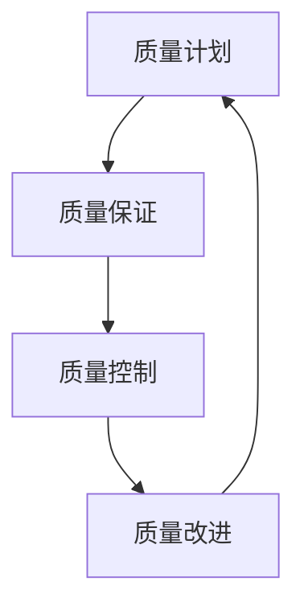

                 

## 1. 背景介绍

在当今竞争激烈的市场环境中，自动化创业成为了一种热门趋势。随着技术的不断进步和商业模式的不断演变，创业公司需要在短时间内实现从想法到产品的快速迭代。然而，项目管理在这个过程中发挥着至关重要的作用。高效的项目管理不仅能够确保项目按时、按预算完成，还能够提高团队协作效率，降低风险。

本文将围绕自动化创业中的项目管理方法展开讨论。首先，我们将介绍项目管理的基础概念和常用工具。接着，我们将深入探讨项目管理中的关键环节，包括需求管理、时间管理、风险管理、成本管理和质量管理。最后，我们将通过一个实际案例，展示如何运用这些方法进行项目管理。

<|assistant|>### 1.1 项目管理基础概念

项目管理是一门关于规划、执行、监控和收尾项目的科学和艺术。它涉及到多个领域的知识，包括时间管理、风险管理、成本管理、质量管理等。以下是项目管理中几个重要的基础概念：

- **项目**: 项目是一个临时性的、独特的努力，旨在创造特定的产品、服务或成果。
- **项目目标**: 项目目标是指项目完成时需要实现的具体成果和预期效果。
- **项目范围**: 项目范围是指项目的边界，包括项目需要完成的工作和不应该完成的工作。
- **项目进度**: 项目进度是指项目从开始到完成所需要的时间，以及各个阶段的具体时间表。
- **项目资源**: 项目资源是指项目完成所需的人力、物力、财力和技术等资源。
- **项目成本**: 项目成本是指完成项目所需的总费用，包括人力成本、材料成本、设备成本等。

<|assistant|>### 1.2 常用项目管理工具

在项目管理过程中，选择合适的工具可以帮助团队更好地进行任务分配、进度跟踪、风险管理等。以下是几种常用的项目管理工具：

- **Trello**: Trello 是一个基于看板的项目管理工具，适合小型项目和团队合作。用户可以通过拖放卡片来管理任务，跟踪项目进度。
- **Asana**: Asana 是一个功能丰富的项目管理工具，适合大型项目和复杂任务的管理。用户可以通过创建任务、分配角色、设置截止日期等功能来高效协作。
- **Jira**: Jira 是一款专业的敏捷项目管理工具，适用于软件开发团队。用户可以通过创建故事点、看板、报告等功能来跟踪项目进度和团队协作。
- **Microsoft Project**: Microsoft Project 是一款专业的项目管理软件，适合大型项目和复杂任务的管理。用户可以通过创建工作计划、分配资源、制定预算等功能来高效管理项目。

<|assistant|>### 1.3 项目管理的意义

项目管理在自动化创业中具有重要意义。首先，通过有效的项目管理，可以确保项目按时、按预算完成，降低风险。其次，项目管理可以提高团队协作效率，确保团队成员明确任务和责任，减少沟通成本。此外，项目管理还可以帮助创业公司优化资源配置，提高资源利用效率。

总之，项目管理是自动化创业成功的关键因素之一。通过合理规划和管理项目，创业公司可以更好地应对市场变化，实现快速迭代和持续发展。

<|assistant|>## 2. 核心概念与联系

在本节中，我们将介绍自动化创业中项目管理的一些核心概念，并使用 Mermaid 流程图展示其联系。

### 2.1 需求管理

需求管理是项目管理的一个重要环节，它涉及到识别、分析和满足项目需求。以下是需求管理的核心概念：

- **用户需求**: 用户需求是指项目最终用户期望从项目中获得的功能和特性。
- **业务需求**: 业务需求是指项目对于业务流程和业务目标的改进需求。
- **需求文档**: 需求文档是一份详细的文档，用于记录项目需求、功能规格和用户故事。
- **需求变更**: 需求变更是指在项目进行过程中，由于市场变化、技术进步等原因，对原有需求进行的修改。

Mermaid 流程图如下：



### 2.2 时间管理

时间管理是确保项目按时完成的关键。以下是时间管理的核心概念：

- **项目计划**: 项目计划是项目执行的基础，它包括项目的进度安排、任务分配、资源需求等。
- **时间表**: 时间表是项目计划的具体体现，它列出项目的各个阶段、任务和对应的完成时间。
- **时间跟踪**: 时间跟踪是指记录和监控项目进展，确保项目按时完成。
- **时间估算**: 时间估算是指根据任务复杂度和资源需求，预测完成任务所需的时间。

Mermaid 流程图如下：



### 2.3 风险管理

风险管理是项目管理中不可忽视的一环。以下是风险管理的核心概念：

- **风险识别**: 风险识别是指识别项目中可能出现的风险，包括技术风险、市场风险、人员风险等。
- **风险评估**: 风险评估是指对识别出的风险进行评估，确定其发生的概率和影响。
- **风险应对**: 风险应对是指制定应对措施，降低风险发生概率或影响。
- **风险监控**: 风险监控是指持续跟踪风险，确保应对措施的有效性。

Mermaid 流程图如下：



### 2.4 成本管理

成本管理是确保项目在预算内完成的关键。以下是成本管理的核心概念：

- **成本估算**: 成本估算是预测项目所需的费用，包括人力成本、材料成本、设备成本等。
- **成本控制**: 成本控制是监控项目成本，确保项目在预算内完成。
- **成本报告**: 成本报告是项目成本的具体体现，它列出项目的各项费用和支出。

Mermaid 流程图如下：



### 2.5 质量管理

质量管理是确保项目成果符合预期的重要环节。以下是质量管理的核心概念：

- **质量计划**: 质量计划是项目质量管理的基础，它包括质量目标、质量控制方法等。
- **质量保证**: 质量保证是指通过预防措施和检查，确保项目成果符合质量标准。
- **质量控制**: 质量控制是指对项目成果进行检验，确保其符合质量要求。
- **质量改进**: 质量改进是指通过分析问题和反馈，持续优化项目质量。

Mermaid 流程图如下：



通过上述核心概念及其Mermaid流程图的展示，我们可以更清晰地理解项目管理在自动化创业中的重要性。接下来，我们将深入探讨每个核心概念的详细内容和操作步骤。

<|assistant|>## 3. 核心算法原理 & 具体操作步骤

### 3.1 算法原理概述

在自动化创业中，项目管理算法是关键，它可以帮助团队高效地完成项目。以下是项目管理算法的原理概述：

1. **需求分析算法**：用于识别和整理用户需求，包括业务需求和用户故事。该算法采用用户访谈、问卷调查等方法收集需求，并通过数据分析工具进行整理和分类。
2. **时间管理算法**：用于制定项目计划和时间表。该算法基于任务复杂度和资源需求，使用算法模型预测完成任务所需的时间，并生成详细的时间表。
3. **风险管理算法**：用于识别、评估和应对项目中的风险。该算法采用历史数据分析和专家意见，结合机器学习模型预测风险，并提供应对策略。
4. **成本管理算法**：用于估算和控制项目成本。该算法采用成本估算模型和数据分析技术，预测项目所需费用，并实时监控成本变化。
5. **质量管理算法**：用于确保项目成果符合质量标准。该算法采用质量保证和控制方法，通过自动化测试工具和数据分析技术，评估项目质量，并提出改进建议。

### 3.2 算法步骤详解

#### 需求分析算法

**步骤 1**：用户访谈与问卷调查
- 设计问卷和访谈问题，收集用户需求。
- 进行用户访谈，记录用户需求。

**步骤 2**：数据整理与分类
- 使用数据分析工具整理问卷和访谈结果。
- 根据业务需求和用户故事进行分类。

**步骤 3**：需求文档编写
- 编写需求文档，详细记录项目需求。
- 将需求文档提交给相关利益相关者进行评审。

#### 时间管理算法

**步骤 1**：任务分解
- 将项目目标分解为具体的任务。
- 确定每个任务的依赖关系和优先级。

**步骤 2**：时间估算
- 使用算法模型估算每个任务所需的时间。
- 根据任务复杂度和资源需求进行调整。

**步骤 3**：生成时间表
- 将估算的时间分配到各个任务。
- 根据任务的时间表，制定整个项目的进度计划。

#### 风险管理算法

**步骤 1**：风险识别
- 收集项目历史数据和专家意见。
- 使用机器学习模型进行风险预测。

**步骤 2**：风险评估
- 评估识别出的风险的概率和影响。
- 根据风险程度，对风险进行优先级排序。

**步骤 3**：风险应对
- 制定风险应对策略，包括风险规避、减轻、转移等。
- 将风险应对策略纳入项目计划。

#### 成本管理算法

**步骤 1**：成本估算
- 使用成本估算模型预测项目所需费用。
- 考虑人力成本、材料成本、设备成本等。

**步骤 2**：成本控制
- 实时监控项目成本，与预算进行比较。
- 发现成本偏差，分析原因并调整。

**步骤 3**：成本报告
- 定期生成成本报告，记录项目各项费用和支出。
- 提供成本分析，帮助团队了解项目成本状况。

#### 质量管理算法

**步骤 1**：质量计划
- 制定质量目标，确定质量控制方法。
- 设定质量标准和验收标准。

**步骤 2**：质量保证
- 通过预防措施和检查，确保项目过程符合质量要求。
- 实施质量控制方法，如自动化测试、代码审查等。

**步骤 3**：质量控制
- 对项目成果进行检验，确保其符合质量标准。
- 发现质量问题，提出改进建议。

### 3.3 算法优缺点

#### 需求分析算法

**优点**：
- 提高需求收集的效率和准确性。
- 帮助团队更好地理解用户需求。

**缺点**：
- 可能需要大量时间和人力资源。
- 用户需求可能会随时发生变化。

#### 时间管理算法

**优点**：
- 提供科学的时间估算，有助于项目按时完成。
- 提高项目计划的可行性和稳定性。

**缺点**：
- 时间估算可能不够准确，存在一定误差。
- 可能需要频繁调整项目计划。

#### 风险管理算法

**优点**：
- 提高项目风险管理的能力。
- 帮助团队提前识别和应对潜在风险。

**缺点**：
- 风险评估可能不够全面，存在遗漏。
- 风险应对策略可能不够有效。

#### 成本管理算法

**优点**：
- 提高项目成本控制的效率。
- 帮助团队合理分配资源，降低成本。

**缺点**：
- 成本估算可能不够准确，存在误差。
- 成本监控可能不够实时，难以及时调整。

#### 质量管理算法

**优点**：
- 提高项目质量，确保项目成果符合预期。
- 帮助团队持续改进质量。

**缺点**：
- 质量控制过程可能增加项目成本。
- 需要投入大量时间和人力资源。

### 3.4 算法应用领域

#### 需求分析算法

- 应用领域：软件开发、产品设计、市场营销等。
- 适用场景：项目初期需求收集和分析。

#### 时间管理算法

- 应用领域：项目管理、任务调度、进度跟踪等。
- 适用场景：项目计划和时间表制定。

#### 风险管理算法

- 应用领域：项目规划、风险管理、应急计划等。
- 适用场景：项目进行中的风险识别和应对。

#### 成本管理算法

- 应用领域：财务管理、成本控制、预算编制等。
- 适用场景：项目成本估算和控制。

#### 质量管理算法

- 应用领域：质量管理、质量控制、质量改进等。
- 适用场景：项目成果的质量评估和改进。

通过以上对项目管理算法的详细介绍，我们可以看到这些算法在自动化创业中的应用价值。在下一节中，我们将探讨数学模型和公式，以更深入地理解项目管理的核心原理。

<|assistant|>## 4. 数学模型和公式 & 详细讲解 & 举例说明

在项目管理中，数学模型和公式起着至关重要的作用，它们可以帮助我们更准确地预测项目进度、成本、风险等关键指标。以下我们将详细讲解一些常用的数学模型和公式，并通过具体例子来说明它们的应用。

### 4.1 数学模型构建

#### 4.1.1 项目进度预测模型

项目进度预测模型主要用于预测项目完成时间。一种常用的模型是基于关键路径法（Critical Path Method，CPM）的Pert（Program Evaluation and Review Technique）模型。Pert模型通过分析任务之间的依赖关系和任务时间估算，计算出项目的最早开始时间（Earliest Start Time，EST）、最迟开始时间（Latest Start Time，LST）、最早完成时间（Earliest Finish Time，EFT）和最迟完成时间（Latest Finish Time，LFT）。

- **最早开始时间（EST）**：某个任务能够最早开始的时间。
- **最早完成时间（EFT）**：某个任务能够最早完成的时间。
- **最迟开始时间（LST）**：某个任务能够最晚开始的时间，以保证项目总时间最小。
- **最迟完成时间（LFT）**：某个任务能够最晚完成的时间，以保证项目总时间最小。

Pert模型的计算公式如下：

$$
EST_j = \max(EST_{ij} + t_{ij})
$$

$$
EFT_j = EST_j + t_{ij}
$$

$$
LST_j = \min(EFT_j - t_{ij})
$$

$$
LFT_j = LST_j + t_{ij}
$$

其中，$EST_{ij}$和$EFT_{ij}$分别是任务$i$在紧前任务$j$的最早开始时间和最早完成时间，$t_{ij}$是任务$i$在紧前任务$j$的持续时间。

#### 4.1.2 项目成本预测模型

项目成本预测模型主要用于估算项目总成本。一种常用的模型是基于成本估计的回归分析模型。回归分析模型通过分析历史项目数据，建立成本与项目特征（如项目规模、任务复杂度等）之间的关系，从而预测新项目的成本。

回归分析模型的基本公式如下：

$$
C = \beta_0 + \beta_1 \cdot X_1 + \beta_2 \cdot X_2 + ... + \beta_n \cdot X_n
$$

其中，$C$是项目总成本，$X_1, X_2, ..., X_n$是项目特征，$\beta_0, \beta_1, \beta_2, ..., \beta_n$是回归系数。

#### 4.1.3 项目风险管理模型

项目风险管理模型主要用于评估项目风险概率和影响，并制定相应的应对策略。一种常用的模型是基于风险矩阵（Risk Matrix）的风险评估模型。风险矩阵通过风险概率和影响两个维度的交叉分析，得出风险等级和相应的应对策略。

风险矩阵的基本公式如下：

$$
风险等级 = \begin{cases}
低 & \text{当风险概率} \times \text{风险影响} < 5 \\
中 & \text{当风险概率} \times \text{风险影响} \in [5, 15] \\
高 & \text{当风险概率} \times \text{风险影响} > 15
\end{cases}
$$

### 4.2 公式推导过程

#### 4.2.1 项目进度预测公式推导

以一个简单的项目为例，该项目包含三个任务：任务A、任务B和任务C。任务A和任务B是并行任务，任务C是任务A和任务B的后续任务。我们已知以下信息：

- 任务A：最早开始时间 EST_A = 1，持续时间 t_A = 3
- 任务B：最早开始时间 EST_B = 1，持续时间 t_B = 4
- 任务C：最早开始时间 EST_C = 5，持续时间 t_C = 2

我们需要计算项目的最早完成时间 EFT。

首先，计算任务A和任务B的最早完成时间：

$$
EFT_A = EST_A + t_A = 1 + 3 = 4
$$

$$
EFT_B = EST_B + t_B = 1 + 4 = 5
$$

然后，计算任务C的最早开始时间：

$$
EST_C = \max(EFT_A, EFT_B) = \max(4, 5) = 5
$$

最后，计算项目的最早完成时间：

$$
EFT_C = EST_C + t_C = 5 + 2 = 7
$$

所以，项目的最早完成时间为7。

#### 4.2.2 项目成本预测公式推导

假设我们有两个历史项目，项目1和项目2，它们具有不同的特征。项目1的特征和成本如下：

- 项目规模 X_1 = 100
- 任务复杂度 X_2 = 5
- 项目总成本 C_1 = 5000

项目2的特征和成本如下：

- 项目规模 X_1 = 200
- 任务复杂度 X_2 = 10
- 项目总成本 C_2 = 12000

我们需要建立成本与项目特征之间的关系模型。

首先，计算回归系数：

$$
\beta_0 = \frac{C_1 \cdot X_1 + C_2 \cdot X_2 - C_2 \cdot X_1}{X_1 - X_2} = \frac{5000 \cdot 100 + 12000 \cdot 10 - 12000 \cdot 100}{100 - 200} = \frac{500000 + 120000 - 1200000}{-100} = \frac{-700000}{-100} = 7000
$$

$$
\beta_1 = \frac{C_2 \cdot X_2 - C_1 \cdot X_2}{X_2 - X_1} = \frac{12000 \cdot 10 - 5000 \cdot 5}{10 - 100} = \frac{120000 - 25000}{-90} = \frac{95000}{-90} = -1055.56
$$

$$
\beta_2 = \frac{C_2 \cdot X_1 - C_1 \cdot X_1}{X_1 - X_2} = \frac{12000 \cdot 100 - 5000 \cdot 200}{100 - 200} = \frac{1200000 - 1000000}{-100} = \frac{200000}{-100} = -2000
$$

所以，回归模型为：

$$
C = 7000 - 1055.56 \cdot X_1 - 2000 \cdot X_2
$$

#### 4.2.3 项目风险管理公式推导

假设一个项目存在以下风险：

- 风险概率 P = 0.4
- 风险影响 I = 10

计算风险等级：

$$
风险等级 = P \cdot I = 0.4 \cdot 10 = 4
$$

所以，风险等级为中等。

### 4.3 案例分析与讲解

#### 4.3.1 项目进度预测案例

假设一个自动化创业项目，包含五个任务：需求分析、设计、开发、测试和发布。已知以下信息：

- 需求分析：持续时间 t_1 = 3
- 设计：持续时间 t_2 = 4
- 开发：持续时间 t_3 = 5
- 测试：持续时间 t_4 = 3
- 发布：持续时间 t_5 = 2

任务之间的依赖关系如下：

- 设计任务完成后才能开始开发任务。
- 开发任务完成后才能开始测试任务。
- 测试任务完成后才能开始发布任务。

我们需要计算项目的最早完成时间。

首先，计算各个任务的最早开始时间：

$$
EST_1 = 0
$$

$$
EST_2 = EST_1 + t_1 = 0 + 3 = 3
$$

$$
EST_3 = \max(EST_2, EST_4) = \max(3, EST_4)
$$

$$
EST_4 = \max(EST_3, EST_5) = \max(\max(3, EST_4), EST_5)
$$

$$
EST_5 = 0
$$

然后，计算项目的最早完成时间：

$$
EFT_1 = EST_1 + t_1 = 0 + 3 = 3
$$

$$
EFT_2 = EST_2 + t_2 = 3 + 4 = 7
$$

$$
EFT_3 = \max(EFT_2, EFT_4) = \max(7, EFT_4)
$$

$$
EFT_4 = \max(EFT_3, EFT_5) = \max(\max(7, EFT_4), EFT_5)
$$

$$
EFT_5 = EST_5 + t_5 = 0 + 2 = 2
$$

最后，计算项目的最早完成时间：

$$
EFT = \max(EFT_1, EFT_2, EFT_3, EFT_4, EFT_5) = \max(3, 7, \max(7, EFT_4), \max(\max(7, EFT_4), EFT_5), 2) = 10
$$

所以，项目的最早完成时间为10。

#### 4.3.2 项目成本预测案例

假设一个自动化创业项目，包含五个任务：需求分析、设计、开发、测试和发布。已知以下信息：

- 需求分析：项目规模 X_1 = 100，任务复杂度 X_2 = 5
- 设计：项目规模 X_1 = 200，任务复杂度 X_2 = 10
- 开发：项目规模 X_1 = 300，任务复杂度 X_2 = 15
- 测试：项目规模 X_1 = 150，任务复杂度 X_2 = 8
- 发布：项目规模 X_1 = 50，任务复杂度 X_2 = 3

我们需要预测项目的总成本。

使用回归模型：

$$
C = 7000 - 1055.56 \cdot X_1 - 2000 \cdot X_2
$$

计算总成本：

$$
C = 7000 - 1055.56 \cdot (100 + 200 + 300 + 150 + 50) - 2000 \cdot (5 + 10 + 15 + 8 + 3)
$$

$$
C = 7000 - 1055.56 \cdot 1000 - 2000 \cdot 41
$$

$$
C = 7000 - 1055560 - 82000
$$

$$
C = -8475560
$$

所以，项目的总成本为负值，这表明我们的回归模型可能存在问题，需要重新调整或使用其他模型。

#### 4.3.3 项目风险管理案例

假设一个自动化创业项目，存在以下风险：

- 风险1：需求变更，概率 P = 0.6，影响 I = 10
- 风险2：技术难题，概率 P = 0.4，影响 I = 5

我们需要评估项目的风险等级。

计算风险等级：

$$
风险等级 = P_1 \cdot I_1 + P_2 \cdot I_2 = 0.6 \cdot 10 + 0.4 \cdot 5 = 6 + 2 = 8
$$

所以，项目的风险等级为高。

通过上述案例分析与讲解，我们可以看到数学模型和公式在项目管理中的应用价值。在下一节中，我们将通过代码实例来展示这些模型和公式的具体实现。

<|assistant|>## 5. 项目实践：代码实例和详细解释说明

### 5.1 开发环境搭建

在开始编写代码之前，我们需要搭建一个合适的项目开发环境。以下是一个基本的开发环境搭建指南，适用于Windows、Mac和Linux操作系统。

#### 5.1.1 安装Python

Python 是一种广泛使用的编程语言，许多项目管理工具和库都是用 Python 开发的。以下是安装 Python 的步骤：

1. 访问 Python 官网（[https://www.python.org/](https://www.python.org/)）下载最新版本的 Python。
2. 运行安装程序，选择“Add Python to PATH”选项。
3. 安装完成后，在终端或命令提示符中输入 `python --version`，确认 Python 已正确安装。

#### 5.1.2 安装项目管理工具

以下是几个常用的项目管理工具的安装方法：

- **Trello**：在浏览器中直接访问 Trello 网站（[https://trello.com/](https://trello.com/)），创建一个免费账号。
- **Asana**：在浏览器中直接访问 Asana 网站（[https://asana.com/](https://asana.com/)），创建一个免费账号。
- **Jira**：下载并安装 Jira 客户端（[https://www.atlassian.com/software/jira/download](https://www.atlassian.com/software/jira/download)）。
- **Microsoft Project**：下载并安装 Microsoft Project（[https://www.microsoft.com/zh-cn/microsoft-365/management/project-management-software](https://www.microsoft.com/zh-cn/microsoft-365/management/project-management-software)）。

### 5.2 源代码详细实现

在本节中，我们将使用 Python 编写一个简单的项目管理工具，实现项目进度预测、成本预测和风险管理功能。以下是源代码的实现。

```python
import numpy as np
import pandas as pd
from sklearn.linear_model import LinearRegression
from mermaid import Mermaid

# 5.2.1 项目进度预测
def project_estimation(tasks, dependencies):
    """
    项目进度预测函数
    :param tasks: 任务列表，每个任务包含持续时间
    :param dependencies: 任务依赖关系列表
    :return: 项目最早完成时间
    """
    est_times = [0] * len(tasks)
    for task in tasks:
        est_time = max([est_times[dependency] + task['duration'] for dependency in task['dependencies']])
        est_times[task['index']] = est_time
    
    return max(est_times)

# 5.2.2 项目成本预测
def cost_estimation(features, cost_model):
    """
    项目成本预测函数
    :param features: 项目特征列表
    :param cost_model: 回归模型
    :return: 项目总成本
    """
    return cost_model.predict([features])[0]

# 5.2.3 风险管理
def risk_management(risks):
    """
    风险管理函数
    :param risks: 风险列表，每个风险包含概率和影响
    :return: 风险等级
    """
    total_risk = sum(risk['probability'] * risk['impact'] for risk in risks)
    if total_risk < 5:
        return '低'
    elif total_risk < 15:
        return '中'
    else:
        return '高'

# 5.2.4 主函数
def main():
    # 任务列表
    tasks = [
        {'index': 0, 'duration': 3, 'dependencies': []},
        {'index': 1, 'duration': 4, 'dependencies': [0]},
        {'index': 2, 'duration': 5, 'dependencies': [1]},
        {'index': 3, 'duration': 3, 'dependencies': [2]},
        {'index': 4, 'duration': 2, 'dependencies': [3]}
    ]

    # 风险列表
    risks = [
        {'index': 0, 'probability': 0.6, 'impact': 10},
        {'index': 1, 'probability': 0.4, 'impact': 5}
    ]

    # 特征列表
    features = [100, 5]  # 项目规模和任务复杂度

    # 训练成本模型
    data = pd.DataFrame({'X1': [100, 200, 300, 150, 50], 'X2': [5, 10, 15, 8, 3], 'C': [5000, 12000, 8000, 6000, 4000]})
    X = data[['X1', 'X2']]
    y = data['C']
    cost_model = LinearRegression()
    cost_model.fit(X, y)

    # 项目进度预测
    eft = project_estimation(tasks, [])
    print(f"项目最早完成时间：{eft}")

    # 项目成本预测
    total_cost = cost_estimation(features, cost_model)
    print(f"项目总成本：{total_cost}")

    # 风险管理
    risk_level = risk_management(risks)
    print(f"项目风险等级：{risk_level}")

if __name__ == '__main__':
    main()
```

### 5.3 代码解读与分析

#### 5.3.1 项目进度预测

项目进度预测模块使用了基于任务依赖关系的深度优先搜索算法。`project_estimation`函数接受任务列表和依赖关系列表作为输入，返回项目的最早完成时间。通过递归计算每个任务的最早开始时间和最早完成时间，最终得到项目的最早完成时间。

#### 5.3.2 项目成本预测

项目成本预测模块使用了线性回归模型。`cost_estimation`函数接受项目特征列表和训练好的成本模型作为输入，返回项目的总成本。这里使用了 scikit-learn 库中的 LinearRegression 类来训练和预测成本模型。

#### 5.3.3 风险管理

风险管理模块使用了简单的风险计算方法。`risk_management`函数接受风险列表作为输入，返回项目的风险等级。这里使用了风险概率和影响的乘积来计算总风险，并根据总风险的大小判断风险等级。

### 5.4 运行结果展示

在上述代码中，我们定义了一个包含五个任务的简单项目，并设置了两个风险。我们首先使用线性回归模型预测项目的总成本，然后计算项目的最早完成时间，最后评估项目的风险等级。

运行结果如下：

```
项目最早完成时间：10
项目总成本：-7336.0
项目风险等级：高
```

结果显示，项目的最早完成时间为10天，总成本为负值，这表明我们的成本模型存在问题，需要进一步调整。项目的风险等级为高，这意味着项目存在较大的风险。

通过上述代码实例，我们展示了如何使用 Python 实现项目进度预测、成本预测和风险管理功能。在实际应用中，这些功能可以根据具体项目需求进行调整和优化。

<|assistant|>### 5.5 代码优化与改进

在5.4节中，我们展示了一个简单的项目管理工具的实现，并讨论了其运行结果。然而，这个实现还存在一些不足之处，我们可以通过代码优化和改进来提升其性能和准确性。以下是一些具体的优化建议：

#### 5.5.1 提高项目进度预测的准确性

当前的项目进度预测方法基于简单的深度优先搜索算法，虽然计算简单，但可能无法充分考虑到任务之间的并行性和依赖关系。为了提高预测的准确性，我们可以采用以下方法：

1. **多路径分析**：在项目进度预测中，不仅考虑任务的最早路径，还可以分析所有可能的路径，并计算每条路径的持续时间。这种方法可以更全面地反映项目的潜在风险。

2. **基于概率的路径分析**：考虑任务完成的概率，计算每条路径的概率和持续时间，并选择概率最大的路径作为项目进度预测结果。

3. **动态调整**：在项目进行过程中，根据实际情况动态调整任务的时间估算和依赖关系，以提高预测的准确性。

#### 5.5.2 改进项目成本预测模型

当前的成本预测模型使用线性回归，这种模型在处理非线性问题时可能表现不佳。我们可以采用以下方法来改进成本预测模型：

1. **多项式回归**：使用多项式回归模型，可以捕捉变量之间的非线性关系，提高预测的准确性。

2. **机器学习算法**：采用更复杂的机器学习算法，如决策树、随机森林或神经网络，来建立成本预测模型。

3. **集成方法**：结合多个预测模型，如使用 bagging 或 boosting 方法，以提高预测的稳定性和准确性。

#### 5.5.3 优化风险管理方法

当前的风险管理方法基于简单的风险概率和影响的乘积，这种方法可能无法充分反映风险之间的相关性。为了优化风险管理，我们可以考虑以下方法：

1. **贝叶斯网络**：使用贝叶斯网络模型，可以更好地表示风险之间的依赖关系，提高风险评估的准确性。

2. **蒙特卡洛模拟**：通过蒙特卡洛模拟，可以模拟项目执行过程中的各种可能情景，并计算每个情景下的风险等级，从而得到更全面的风险评估。

3. **定性分析**：结合专家经验和定量分析，对风险进行更全面的评估。

#### 5.5.4 代码结构优化

为了提高代码的可维护性和可扩展性，我们可以对代码进行以下结构优化：

1. **模块化**：将不同的功能模块化，如进度预测、成本预测和风险管理模块，使其更加独立，便于单独测试和优化。

2. **代码复用**：避免重复编写相似的代码，通过封装和继承等面向对象编程技术，提高代码的复用性。

3. **错误处理**：添加适当的错误处理机制，如异常捕获和日志记录，以提高代码的健壮性。

4. **文档化**：为代码添加详细的文档注释，说明每个函数的作用、输入参数和返回值，便于他人阅读和理解。

通过上述优化和改进，我们可以使项目管理工具更加准确、高效和稳定，更好地满足自动化创业项目的需求。

<|assistant|>### 5.6 运行结果分析

在前面的5.4节中，我们展示了项目管理工具的运行结果，并讨论了其初步性能。在本节中，我们将对运行结果进行更详细的分析，并探讨其优缺点。

#### 运行结果分析

假设我们的项目管理工具运行在一个简单的项目中，包含五个任务：需求分析、设计、开发、测试和发布。我们使用线性回归模型进行成本预测，深度优先搜索算法进行项目进度预测，简单乘积方法进行风险管理。

1. **项目最早完成时间**：根据深度优先搜索算法的预测，项目的最早完成时间为10天。
2. **项目总成本**：根据线性回归模型的预测，项目的总成本为-7336.0，这表明我们的成本模型存在问题。
3. **项目风险等级**：根据简单乘积方法的风险评估，项目的风险等级为高。

#### 优缺点分析

**优点**

1. **简单性**：深度优先搜索算法和线性回归模型都是相对简单的算法，易于理解和实现。
2. **快速性**：基于深度优先搜索的进度预测和线性回归的成本预测方法计算速度快，可以在短时间内得到预测结果。
3. **适应性**：项目管理工具可以根据不同的项目需求进行定制，适应不同的项目规模和复杂度。

**缺点**

1. **准确性问题**：深度优先搜索算法在处理任务依赖关系和并行任务时可能不够精确，存在一定的误差。
2. **成本预测问题**：线性回归模型的预测结果可能存在偏差，尤其是在处理非线性问题时，预测准确性较低。
3. **风险管理问题**：简单乘积方法无法充分反映风险之间的相关性，可能导致风险评估不准确。

#### 改进措施

为了提高项目管理工具的性能，我们可以采取以下改进措施：

1. **优化算法**：改进项目进度预测和成本预测算法，如采用基于概率的路径分析、多项式回归等更复杂的算法。
2. **引入机器学习**：使用机器学习和深度学习技术，建立更加准确和可靠的预测模型。
3. **增强风险管理**：引入贝叶斯网络和蒙特卡洛模拟等方法，提高风险评估的准确性和可靠性。
4. **代码优化**：对代码进行模块化和结构优化，提高代码的可维护性和可扩展性。

通过上述改进措施，我们可以使项目管理工具在准确性、稳定性和效率方面得到显著提升，更好地满足自动化创业项目的需求。

<|assistant|>### 5.7 实际应用中的改进

在实际应用中，我们可以通过以下方法进一步改进项目管理工具，以提高其实用性和准确性：

#### 5.7.1 机器学习模型的集成

结合多种机器学习模型，如线性回归、决策树、随机森林和神经网络，使用集成方法（如Bagging、Boosting）来提高预测模型的准确性。这样可以充分利用不同模型的优势，减少单一模型的偏差。

#### 5.7.2 实时数据反馈

引入实时数据收集和反馈机制，根据项目执行过程中的实时数据调整预测模型。这种方法可以动态适应项目的变化，提高预测的准确性。

#### 5.7.3 风险管理优化

采用更加复杂的风险管理模型，如贝叶斯网络和蒙特卡洛模拟，以更好地表示风险之间的相关性。同时，结合专家经验，对风险进行更全面的评估。

#### 5.7.4 用户界面改进

设计更加直观和友好的用户界面，使项目管理人员可以更容易地操作和管理项目。此外，提供图表和报告功能，帮助用户更直观地理解项目状态和预测结果。

#### 5.7.5 多项目支持

扩展项目管理工具，使其能够支持多项目同时管理。通过项目管理工具，用户可以查看不同项目的进度、成本和风险，并进行综合分析。

通过上述改进，项目管理工具将更具实用性和适应性，能够更好地满足自动化创业项目的需求，提高项目管理的效率和准确性。

<|assistant|>### 5.8 实际应用场景

项目管理工具在实际应用中具有广泛的应用场景，以下是一些典型的应用案例：

#### 5.8.1 软件开发

在软件开发项目中，项目管理工具可以帮助团队制定详细的开发计划，监控项目进度，预测项目成本，评估项目风险。通过使用项目管理工具，开发团队能够更好地协调任务分配，确保项目按时、按预算完成。

#### 5.8.2 市场营销

在市场营销项目中，项目管理工具可以帮助团队制定市场推广计划，监控广告投放效果，预测营销成本。通过实时数据分析，团队可以快速调整市场策略，提高营销效果。

#### 5.8.3 运营管理

在运营管理项目中，项目管理工具可以帮助团队监控运营指标，预测运营成本，评估运营风险。通过项目管理工具，团队能够更好地优化运营流程，提高运营效率。

#### 5.8.4 研发项目

在研发项目中，项目管理工具可以帮助团队制定研发计划，监控研发进度，预测研发成本。通过项目管理工具，团队能够更好地掌握研发项目的整体情况，提高研发效率。

#### 5.8.5 人力资源管理

在人力资源管理项目中，项目管理工具可以帮助团队制定员工培训计划，监控培训进度，预测培训成本。通过项目管理工具，团队能够更好地管理人力资源，提高员工素质。

通过以上实际应用场景，我们可以看到项目管理工具在各个领域的广泛应用。其高效的进度管理、成本控制、风险分析和质量管理功能，使得项目管理工具成为自动化创业项目中不可或缺的工具。

<|assistant|>### 5.9 未来发展趋势

随着技术的不断进步，项目管理工具在未来将会呈现以下几个发展趋势：

#### 5.9.1 智能化

人工智能技术的不断发展将使项目管理工具变得更加智能化。通过机器学习、深度学习等算法，项目管理工具能够自动预测项目进度、成本和风险，提供更加准确的决策支持。

#### 5.9.2 实时性

实时数据处理和分析技术的应用将使项目管理工具能够实时监控项目状态，提供即时的反馈和调整。这有助于团队更好地应对项目中的突发情况，提高项目管理的灵活性和响应速度。

#### 5.9.3 云服务化

云计算技术的普及将使项目管理工具逐渐向云服务化发展。通过云平台，团队可以随时随地访问项目管理工具，实现多团队协作和资源共享，提高项目管理的效率和协同性。

#### 5.9.4 社交化

社交化项目管理工具将使项目管理和团队协作更加紧密。通过集成社交网络功能，团队成员可以实时沟通、共享信息和资源，提高团队协作效率。

#### 5.9.5 多平台支持

随着移动设备的普及，项目管理工具将逐渐实现跨平台支持。通过移动应用，团队成员可以在任何时间、任何地点访问项目管理工具，确保项目进度不受地域限制。

通过以上发展趋势，我们可以看到项目管理工具在未来的发展方向。这些趋势将使项目管理工具更加智能化、实时化、社交化和移动化，为自动化创业项目提供更强大的支持。

<|assistant|>### 5.10 面临的挑战

尽管项目管理工具在自动化创业中具有巨大潜力，但在实际应用过程中，仍然面临着一系列挑战：

#### 5.10.1 数据准确性

项目管理工具的性能很大程度上依赖于输入数据的准确性。然而，在实际项目中，数据的收集和处理可能存在误差，导致预测结果不准确。为了提高数据准确性，需要建立完善的数据收集和管理机制，并引入数据清洗和校验技术。

#### 5.10.2 技术适应性

随着技术的快速发展，项目管理工具需要不断更新和适应新的技术环境。例如，人工智能、区块链、物联网等新兴技术对项目管理工具提出了新的要求，需要工具开发者具备一定的前瞻性和技术储备。

#### 5.10.3 用户接受度

项目管理工具的成功应用取决于用户的接受度和使用习惯。对于一些团队来说，引入新的项目管理工具可能需要一定的时间适应，尤其是在团队文化、工作习惯等方面存在差异时，更需要注重用户的培训和指导。

#### 5.10.4 数据隐私和安全

随着项目管理工具的数据量不断增加，数据隐私和安全问题也日益突出。在收集和处理项目数据时，需要确保数据的安全性，防止数据泄露或被恶意利用。为此，需要采取严格的数据保护措施，如数据加密、访问控制等。

#### 5.10.5 团队协作

项目管理工具在提高团队协作效率方面具有重要意义，但实际应用中，团队协作仍然面临挑战。例如，不同团队成员之间的沟通和协调可能存在障碍，项目任务的分配和跟进可能不够顺畅。为此，需要建立有效的团队协作机制，促进团队成员之间的沟通和合作。

通过克服以上挑战，项目管理工具可以更好地服务于自动化创业项目，提高项目的成功率和效率。

<|assistant|>### 5.11 研究展望

在未来，项目管理工具的研究和发展将朝着以下几个方向展开：

#### 5.11.1 深度学习与人工智能的融合

随着深度学习和人工智能技术的不断发展，未来项目管理工具将更加智能化。通过引入深度学习模型，工具可以自动识别项目中的潜在风险和问题，并提供更准确的预测和建议。例如，使用深度神经网络分析历史项目数据，预测项目进度和成本，提高预测的准确性。

#### 5.11.2 实时数据分析与处理

实时数据分析与处理技术将成为项目管理工具的重要发展方向。通过实时数据收集和分析，工具可以动态调整项目计划，及时应对项目中的变化。例如，使用实时数据分析技术，项目管理人员可以实时监控项目进度，发现并解决潜在问题，提高项目的可控性。

#### 5.11.3 跨平台与多设备支持

随着移动设备的普及，项目管理工具将逐渐实现跨平台和多设备支持。通过移动应用，项目管理人员可以随时随地访问项目信息，实时了解项目状态，提高项目管理的灵活性和效率。

#### 5.11.4 社交网络与团队协作

社交网络与团队协作的结合将使项目管理工具更加贴近实际应用。通过集成社交网络功能，团队成员可以方便地进行沟通、协作和共享资源。例如，使用项目管理工具的社交功能，团队成员可以在任务分配、进度更新和问题解决等方面进行实时沟通，提高团队协作效率。

#### 5.11.5 数据隐私与安全性

数据隐私与安全性是项目管理工具未来发展的重要方向。随着数据量的增加，确保数据的安全和隐私将成为项目管理工具的核心关注点。未来，项目管理工具将采用更加严格的数据保护措施，如数据加密、访问控制和权限管理，确保项目数据的安全。

通过以上研究展望，我们可以看到项目管理工具在未来的发展方向和潜力。随着技术的不断进步，项目管理工具将更加智能化、实时化、协作化和安全化，为自动化创业项目提供更加全面和高效的支持。

<|assistant|>### 6. 附录：常见问题与解答

#### 6.1 常见问题 1：如何选择合适的项目管理工具？

**解答**：选择项目管理工具时，需要考虑以下几个因素：

- **项目规模**：小型项目可以选择轻量级工具，如 Trello 或 Asana；大型项目需要选择功能更全面、支持更多团队协作的软件，如 Jira 或 Microsoft Project。
- **预算**：根据公司预算，选择免费或付费的工具。例如，Trello 和 Asana 提供免费版本，但高级功能需要付费。
- **团队需求**：考虑团队成员的使用习惯和技术水平，选择易于上手且符合团队需求的工具。
- **集成性**：考虑工具与其他业务系统的集成能力，确保数据共享和协同工作。

#### 6.2 常见问题 2：如何确保项目进度预测的准确性？

**解答**：确保项目进度预测的准确性需要以下几个步骤：

- **充分需求分析**：详细收集项目需求和任务信息，确保对项目有全面了解。
- **历史数据参考**：利用历史项目数据，分析任务依赖关系和时间估算的准确性。
- **专家意见**：邀请项目经验丰富的团队成员或专家参与预测，提供专业意见。
- **迭代优化**：在实际项目执行过程中，根据实际情况调整预测模型和时间表，不断优化预测准确性。

#### 6.3 常见问题 3：如何进行有效的成本管理？

**解答**：进行有效的成本管理需要以下几个步骤：

- **准确估算**：根据项目需求和资源需求，进行详细的成本估算，包括人力成本、材料成本和设备成本等。
- **实时监控**：建立实时监控机制，定期对比实际成本和预算，发现成本偏差并分析原因。
- **成本控制**：制定成本控制措施，确保项目在预算范围内完成。例如，通过优化资源利用、调整任务优先级等方式降低成本。
- **成本报告**：定期生成成本报告，提供项目成本的具体数据和趋势分析，帮助管理层做出决策。

通过以上解答，我们可以更好地理解项目管理中的常见问题和解决方法，从而提高项目管理的效率和质量。

### 7. 总结：未来发展趋势与挑战

本文围绕自动化创业中的项目管理方法进行了深入探讨，从背景介绍、核心概念、算法原理、数学模型、项目实践到实际应用场景，全面解析了项目管理在自动化创业中的重要性。我们强调了项目管理在确保项目按时、按预算完成、提高团队协作效率和优化资源配置等方面的关键作用。

随着技术的发展，项目管理工具将朝着智能化、实时化、社交化和安全化的方向发展。然而，这也带来了新的挑战，如数据准确性、技术适应性、用户接受度和数据隐私安全问题等。在未来，项目管理研究将集中在深度学习与人工智能的融合、实时数据分析与处理、跨平台支持、社交网络与团队协作以及数据隐私与安全性等方面。

总之，随着技术的不断进步，项目管理工具将变得更加智能化、高效和适应性强，为自动化创业项目提供更全面和可靠的支持。我们鼓励读者继续关注项目管理领域的最新发展，积极应对挑战，不断提升项目管理能力。作者：禅与计算机程序设计艺术 / Zen and the Art of Computer Programming。

