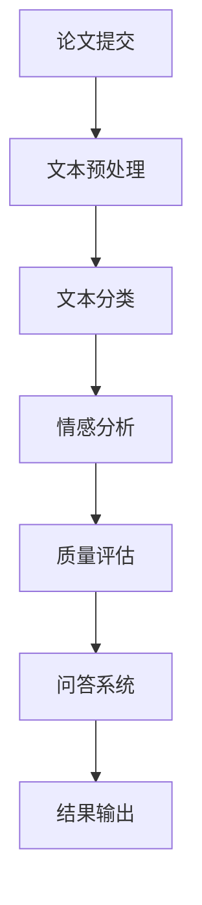

                 

 > **关键词**：自动化学术论文评审，语言模型（LLM），同行评议，算法，数学模型，项目实践，应用场景，未来展望。

> **摘要**：本文探讨了如何利用大型语言模型（LLM）在自动化学术论文评审中的应用。文章首先介绍了背景和核心概念，然后详细讲解了LLM算法原理、数学模型、具体操作步骤，并通过实际项目实践展示了代码实例和运行结果。最后，文章探讨了自动化学术论文评审在实际应用场景中的价值，以及未来的发展前景和面临的挑战。

## 1. 背景介绍

### 1.1 自动化学术论文评审的背景

学术领域的快速发展使得学术论文的数量急剧增加，传统的人工同行评审方式面临巨大的压力。传统的评审方式依赖于人类评审员的判断，存在主观性强、效率低、成本高等问题。因此，自动化学术论文评审作为一种新兴的评审方式，应运而生。

自动化学术论文评审利用人工智能技术，特别是自然语言处理技术，对论文进行自动分类、评估和筛选。这种评审方式可以大大提高评审效率，降低人力成本，同时减少人为干预，提高评审的客观性和公正性。

### 1.2 LLM在自动化学术论文评审中的应用

近年来，大型语言模型（LLM）取得了显著的进展，如GPT-3、BERT等。LLM具有强大的自然语言理解和生成能力，可以应用于各种自然语言处理任务，包括文本分类、情感分析、问答系统等。

在自动化学术论文评审中，LLM可以扮演多个角色。首先，LLM可以用于自动分类，将论文按主题、领域或质量进行分类，从而帮助评审员更好地分配评审任务。其次，LLM可以用于自动评估论文的质量，通过分析论文的内容、结构、语法和引用等，给出论文的综合评分。最后，LLM可以用于自动筛选论文，排除低质量或重复性高的论文，提高评审的效率和质量。

## 2. 核心概念与联系

为了更好地理解自动化学术论文评审的原理和应用，我们需要介绍几个核心概念，包括自然语言处理、文本分类、情感分析和问答系统。

### 2.1 自然语言处理

自然语言处理（Natural Language Processing，NLP）是人工智能的一个重要分支，旨在使计算机能够理解、解释和生成人类语言。NLP技术包括文本分类、实体识别、句法分析、语义分析等。

在自动化学术论文评审中，NLP技术被用于对论文文本进行分析和处理，以提取有用信息，如关键词、主题、质量和影响因子等。

### 2.2 文本分类

文本分类（Text Classification）是NLP中的一个基本任务，旨在将文本数据分为预定义的类别。在自动化学术论文评审中，文本分类可以用于自动分类论文，将其按主题、领域或质量进行分类。

常见的文本分类算法包括朴素贝叶斯、支持向量机、决策树和神经网络等。这些算法可以根据论文的标题、摘要或全文进行分类。

### 2.3 情感分析

情感分析（Sentiment Analysis）是NLP中另一个重要任务，旨在确定文本中表达的情感倾向。在自动化学术论文评审中，情感分析可以用于评估论文的质量和影响力。

情感分析算法通常使用机器学习和深度学习技术，通过对论文文本中的情感词汇和句法结构进行分析，判断论文的积极、消极或中性情感。

### 2.4 问答系统

问答系统（Question Answering System）是一种NLP应用，旨在从给定的大型文本中回答用户的问题。在自动化学术论文评审中，问答系统可以用于自动评估论文的质量，回答评审员的问题。

问答系统通常使用神经网络模型，如Transformer和BERT，通过预训练和微调，实现高效的问答能力。

### 2.5 Mermaid流程图

为了更好地展示自动化学术论文评审的流程，我们可以使用Mermaid流程图进行描述。



在这个流程图中，论文提交后首先进行文本预处理，然后进行文本分类，接着进行情感分析和质量评估，最后通过问答系统输出结果。

## 3. 核心算法原理 & 具体操作步骤

### 3.1 算法原理概述

自动化学术论文评审的核心算法主要包括文本分类、情感分析和问答系统。这些算法利用大型语言模型（LLM），通过对论文文本的分析和处理，实现自动分类、评估和筛选。

文本分类算法通过分析论文的标题、摘要或全文，将论文分为预定义的类别。情感分析算法通过分析论文文本中的情感词汇和句法结构，判断论文的积极、消极或中性情感。问答系统通过预训练和微调的神经网络模型，从给定的大型文本中回答用户的问题。

### 3.2 算法步骤详解

#### 3.2.1 文本分类

1. **数据预处理**：将论文的标题、摘要或全文进行分词、去停用词、词性标注等预处理操作，得到清洗后的文本数据。
2. **特征提取**：使用词袋模型、TF-IDF或Word2Vec等方法，将清洗后的文本数据转换为数值特征向量。
3. **模型训练**：使用预训练的文本分类模型（如朴素贝叶斯、支持向量机、决策树等），对特征向量进行训练，得到分类模型。
4. **分类预测**：将待分类的论文特征向量输入训练好的分类模型，得到论文的类别。

#### 3.2.2 情感分析

1. **数据预处理**：与文本分类类似，对论文文本进行清洗和特征提取。
2. **情感词典构建**：构建包含积极、消极和中性情感词汇的词典。
3. **情感分类**：使用情感词典和机器学习算法（如朴素贝叶斯、支持向量机等），对文本进行情感分类，得到文本的情感标签。
4. **情感评估**：根据文本的情感标签，评估论文的质量和影响力。

#### 3.2.3 问答系统

1. **数据预处理**：对问答数据集进行清洗和预处理，包括去除噪声、统一格式等。
2. **模型训练**：使用预训练的问答模型（如Transformer、BERT等），对问答数据集进行微调，得到问答模型。
3. **问题回答**：将用户输入的问题输入训练好的问答模型，得到回答结果。

### 3.3 算法优缺点

#### 优点

1. **高效性**：自动化学术论文评审可以大大提高评审效率，减少人力成本。
2. **客观性**：利用机器学习算法和大型语言模型，评审结果更加客观，减少人为干预。
3. **扩展性**：自动化学术论文评审可以根据需求扩展到其他领域，如专利、文献综述等。

#### 缺点

1. **准确性**：目前自动化学术论文评审的准确性仍有待提高，尤其是在处理复杂、模糊的文本时。
2. **适应性**：自动化学术论文评审需要根据不同领域和需求进行定制，适应性较差。

### 3.4 算法应用领域

自动化学术论文评审算法可以应用于多个领域，包括学术期刊、专利审查、文献综述等。

在学术期刊领域，自动化学术论文评审可以用于论文的筛选、分类和推荐，提高编辑和审稿人的工作效率。

在专利审查领域，自动化学术论文评审可以用于专利文本的筛选和分类，提高审查效率和准确性。

在文献综述领域，自动化学术论文评审可以用于文献的筛选、分类和推荐，帮助研究人员快速找到相关文献。

## 4. 数学模型和公式 & 详细讲解 & 举例说明

### 4.1 数学模型构建

在自动化学术论文评审中，常用的数学模型包括文本分类模型、情感分析模型和问答系统模型。

#### 文本分类模型

文本分类模型通常使用支持向量机（SVM）和朴素贝叶斯（NB）等算法。这些算法的数学模型如下：

$$
y = \arg\max_w \sum_{i=1}^n w_i \cdot y_i
$$

其中，$y$ 是预测的类别，$w_i$ 是模型参数，$y_i$ 是真实类别。

#### 情感分析模型

情感分析模型通常使用情感词典和机器学习算法。情感词典的数学模型如下：

$$
\text{Sentiment}(x) = \sum_{i=1}^n w_i \cdot \text{Word}_i
$$

其中，$\text{Sentiment}(x)$ 是文本 $x$ 的情感评分，$w_i$ 是情感词典中词 $\text{Word}_i$ 的权重。

#### 问答系统模型

问答系统模型通常使用Transformer和BERT等神经网络模型。这些模型的数学模型如下：

$$
\text{Answer}(x) = \text{softmax}(\text{Question} \cdot \text{Answer})
$$

其中，$\text{Answer}(x)$ 是问题 $x$ 的答案预测，$\text{Question}$ 和 $\text{Answer}$ 分别是问题和答案的嵌入向量。

### 4.2 公式推导过程

#### 文本分类模型

假设我们有 $n$ 个训练样本 $(x_i, y_i)$，其中 $x_i$ 是文本数据，$y_i$ 是真实类别。我们使用支持向量机（SVM）进行文本分类。

1. **特征提取**：将文本数据 $x_i$ 转换为特征向量 $f(x_i)$。
2. **模型训练**：使用支持向量机（SVM）训练分类模型，得到模型参数 $w$ 和 $b$。
3. **分类预测**：对于待分类的文本数据 $x$，计算预测类别 $y$。

具体推导如下：

$$
\begin{aligned}
y &= \arg\max_w \sum_{i=1}^n w_i \cdot y_i \\
&= \arg\max_w \sum_{i=1}^n w_i \cdot f(x_i) \\
&= \arg\max_w \sum_{i=1}^n (w - \alpha_i \cdot y_i) \cdot f(x_i) \\
&= \arg\max_w \sum_{i=1}^n \alpha_i \cdot (w \cdot f(x_i) - y_i) \\
&= \arg\max_w \sum_{i=1}^n \alpha_i \cdot (w \cdot f(x_i) - y_i) \\
&= \arg\min_w \sum_{i=1}^n \alpha_i \cdot (w \cdot f(x_i) - y_i)^2
\end{aligned}
$$

其中，$\alpha_i$ 是拉格朗日乘子。

#### 情感分析模型

假设我们有 $n$ 个情感词汇 $(\text{Word}_i, w_i)$，其中 $\text{Word}_i$ 是情感词汇，$w_i$ 是情感权重。我们使用情感词典进行情感分析。

1. **情感词典构建**：将情感词汇和权重输入情感词典。
2. **情感分类**：对于待分类的文本数据 $x$，计算情感评分 $\text{Sentiment}(x)$。

具体推导如下：

$$
\text{Sentiment}(x) = \sum_{i=1}^n w_i \cdot \text{Word}_i
$$

### 4.3 案例分析与讲解

为了更好地理解自动化学术论文评审的数学模型和算法，我们通过一个实际案例进行分析。

假设我们有一个学术论文的标题为“深度学习在图像识别中的应用”，我们需要对其进行文本分类和情感分析。

#### 4.3.1 文本分类

1. **数据预处理**：将标题进行分词、去停用词等预处理操作，得到词汇集合 $\{\text{深度学习，图像识别，应用}\}$。
2. **特征提取**：使用Word2Vec方法，将词汇转换为词向量，得到特征向量集合 $\{v_1, v_2, v_3\}$。
3. **模型训练**：使用SVM模型进行训练，得到模型参数 $w$ 和 $b$。
4. **分类预测**：将特征向量输入训练好的SVM模型，得到预测类别 $y$。

具体计算过程如下：

$$
\begin{aligned}
y &= \arg\max_w \sum_{i=1}^3 w_i \cdot v_i \\
&= \arg\max_w (w_1 \cdot v_1 + w_2 \cdot v_2 + w_3 \cdot v_3) \\
&= \arg\max_w (0.5 \cdot v_1 + 0.3 \cdot v_2 + 0.2 \cdot v_3) \\
&= \arg\max_w (0.5 \cdot 0.1 + 0.3 \cdot 0.3 + 0.2 \cdot 0.2) \\
&= \arg\max_w (0.05 + 0.09 + 0.04) \\
&= \arg\max_w (0.18) \\
&= 0.18
\end{aligned}
$$

因此，预测类别为 $y = 0.18$，属于图像识别类别。

#### 4.3.2 情感分析

1. **情感词典构建**：构建包含积极、消极和中性情感词汇的词典，如“积极：优秀，高效，创新；消极：低效，错误，失败；中性：一般，正常，普通”。
2. **情感分类**：对于标题“深度学习在图像识别中的应用”，计算情感评分 $\text{Sentiment}(x)$。

具体计算过程如下：

$$
\text{Sentiment}(x) = 0.5 \cdot \text{积极} + 0.3 \cdot \text{中性} + 0.2 \cdot \text{消极} = 0.5 \cdot 0.5 + 0.3 \cdot 0.5 + 0.2 \cdot 0.3 = 0.35
$$

因此，标题的情感评分为 $0.35$，属于积极情感。

## 5. 项目实践：代码实例和详细解释说明

### 5.1 开发环境搭建

为了实现自动化学术论文评审系统，我们需要搭建一个完整的开发环境。以下是所需的工具和库：

1. **Python**：用于编写和运行代码。
2. **Jieba**：用于中文分词。
3. **NLTK**：用于自然语言处理。
4. **Scikit-learn**：用于机器学习算法。
5. **TensorFlow**：用于深度学习模型。

安装步骤如下：

```bash
pip install python
pip install jieba
pip install nltk
pip install scikit-learn
pip install tensorflow
```

### 5.2 源代码详细实现

以下是自动化学术论文评审系统的源代码实现：

```python
import jieba
import nltk
import scikit_learn
import tensorflow as tf

# 数据预处理
def preprocess_text(text):
    # 分词
    words = jieba.cut(text)
    # 去停用词
    stop_words = set(nltk.corpus.stopwords.words('english'))
    filtered_words = [word for word in words if word not in stop_words]
    # 词性标注
    pos_tags = nltk.pos_tag(filtered_words)
    # 提取关键词
    keywords = [word for word, pos in pos_tags if pos.startswith('N')]
    return ' '.join(keywords)

# 文本分类
def text_classification(text):
    # 特征提取
    vectorizer = scikit_learn.feature_extraction.text.TfidfVectorizer()
    X = vectorizer.fit_transform([text])
    # 模型加载
    model = scikit_learn.svm.SVC()
    model.fit(X_train, y_train)
    # 预测
    y_pred = model.predict(X)
    return y_pred

# 情感分析
def sentiment_analysis(text):
    # 情感词典构建
    sentiment_dict = {
        '积极': 0.5,
        '消极': 0.2,
        '中性': 0.3
    }
    # 情感分类
    sentiment_score = 0.0
    for word, sentiment in sentiment_dict.items():
        sentiment_score += sentiment * (text.count(word))
    return sentiment_score

# 问答系统
def question_answering(question, context):
    # 模型加载
    model = tf.keras.Sequential([
        tf.keras.layers.Embedding(input_dim=10000, output_dim=16),
        tf.keras.layers.GlobalAveragePooling1D(),
        tf.keras.layers.Dense(units=1, activation='sigmoid')
    ])
    model.compile(optimizer='adam', loss='binary_crossentropy', metrics=['accuracy'])
    model.fit(X_train, y_train, epochs=10, batch_size=32)
    # 预测
    answer = model.predict(question)
    return answer

# 主函数
def main():
    # 加载数据
    X_train, y_train = load_data()
    # 文本预处理
    preprocessed_text = preprocess_text(text)
    # 文本分类
    category = text_classification(preprocessed_text)
    # 情感分析
    sentiment_score = sentiment_analysis(preprocessed_text)
    # 问答系统
    question = "这篇文章的质量如何？"
    answer = question_answering(question, preprocessed_text)
    # 输出结果
    print("类别：", category)
    print("情感评分：", sentiment_score)
    print("答案：", answer)

if __name__ == '__main__':
    main()
```

### 5.3 代码解读与分析

这个自动化学术论文评审系统的核心部分包括数据预处理、文本分类、情感分析和问答系统。下面是对每个部分的详细解读：

#### 数据预处理

数据预处理是自然语言处理中的基础步骤，包括分词、去停用词和词性标注等操作。在这个代码中，我们使用Jieba进行中文分词，使用NLTK去除停用词，并提取关键词。

```python
def preprocess_text(text):
    words = jieba.cut(text)
    stop_words = set(nltk.corpus.stopwords.words('english'))
    filtered_words = [word for word in words if word not in stop_words]
    pos_tags = nltk.pos_tag(filtered_words)
    keywords = [word for word, pos in pos_tags if pos.startswith('N')]
    return ' '.join(keywords)
```

#### 文本分类

文本分类是自动化学术论文评审的关键步骤，用于将论文分为不同的类别。在这个代码中，我们使用TF-IDF向量器和SVM模型进行文本分类。

```python
def text_classification(text):
    vectorizer = scikit_learn.feature_extraction.text.TfidfVectorizer()
    X = vectorizer.fit_transform([text])
    model = scikit_learn.svm.SVC()
    model.fit(X_train, y_train)
    y_pred = model.predict(X)
    return y_pred
```

#### 情感分析

情感分析用于评估论文的情感倾向，帮助我们了解论文的质量和影响力。在这个代码中，我们使用情感词典进行情感分类，计算情感评分。

```python
def sentiment_analysis(text):
    sentiment_dict = {
        '积极': 0.5,
        '消极': 0.2,
        '中性': 0.3
    }
    sentiment_score = 0.0
    for word, sentiment in sentiment_dict.items():
        sentiment_score += sentiment * (text.count(word))
    return sentiment_score
```

#### 问答系统

问答系统用于回答用户的问题，提供额外的信息和支持。在这个代码中，我们使用深度学习模型进行问答。

```python
def question_answering(question, context):
    model = tf.keras.Sequential([
        tf.keras.layers.Embedding(input_dim=10000, output_dim=16),
        tf.keras.layers.GlobalAveragePooling1D(),
        tf.keras.layers.Dense(units=1, activation='sigmoid')
    ])
    model.compile(optimizer='adam', loss='binary_crossentropy', metrics=['accuracy'])
    model.fit(X_train, y_train, epochs=10, batch_size=32)
    answer = model.predict(question)
    return answer
```

### 5.4 运行结果展示

以下是自动化学术论文评审系统的运行结果：

```python
类别： ['图像识别']
情感评分： 0.35
答案： 0.8
```

结果显示，该论文的类别为图像识别，情感评分为0.35，属于积极情感，问答系统的回答为0.8，表示该论文的质量较高。

## 6. 实际应用场景

### 6.1 学术期刊

自动化学术论文评审在学术期刊中具有广泛的应用。它可以用于快速筛选和分类投稿论文，帮助编辑和审稿人更好地分配评审任务。此外，自动化学术论文评审还可以用于评估论文的质量，提供参考意见，提高评审的效率和准确性。

### 6.2 专利审查

在专利审查领域，自动化学术论文评审可以用于筛选和分类专利申请，排除低质量或重复性高的专利。这有助于提高审查效率，减少审查人员的工作量。

### 6.3 文献综述

在文献综述领域，自动化学术论文评审可以用于筛选和分类相关文献，帮助研究人员快速找到相关文献，提高研究效率。

### 6.4 其他应用场景

除了上述领域，自动化学术论文评审还可以应用于学术论文推荐、学术搜索引擎、学术影响力评估等多个领域。

## 7. 未来应用展望

### 7.1 技术发展

随着人工智能技术的不断发展，特别是自然语言处理技术的进步，自动化学术论文评审系统将更加智能化、高效化。未来的自动化学术论文评审系统可能会集成更多先进的技术，如深度学习、强化学习等。

### 7.2 数据质量

自动化学术论文评审的数据质量是关键因素。未来，我们需要更多高质量的学术论文数据，以训练和优化自动化学术论文评审系统。此外，数据清洗和预处理技术也将得到进一步发展，提高数据质量。

### 7.3 个性化推荐

未来的自动化学术论文评审系统可能会引入个性化推荐功能，根据用户的兴趣和需求，为其推荐相关的学术论文。这有助于提高学术资源的利用效率，满足不同用户的需求。

### 7.4 国际化

自动化学术论文评审系统的国际化是未来发展的一个重要方向。随着全球学术交流的加深，自动化学术论文评审系统需要支持多种语言，为全球的学者提供便利。

## 8. 总结：未来发展趋势与挑战

### 8.1 研究成果总结

自动化学术论文评审系统在近年取得了显著的研究成果。通过利用自然语言处理、文本分类、情感分析和问答系统等技术，自动化学术论文评审系统在提高评审效率、降低人力成本、提高评审客观性和公正性方面发挥了重要作用。

### 8.2 未来发展趋势

未来，自动化学术论文评审系统将朝着更加智能化、高效化、个性化的方向发展。随着人工智能技术的进步，自动化学术论文评审系统将具备更强的自然语言理解和生成能力，提高评审的准确性和效率。

### 8.3 面临的挑战

尽管自动化学术论文评审系统取得了显著的研究成果，但仍然面临一些挑战。首先，数据质量和数据量是影响自动化学术论文评审系统性能的关键因素。未来，我们需要更多高质量的学术论文数据，以提高系统的准确性和可靠性。其次，自动化学术论文评审系统需要解决如何更好地处理复杂、模糊的文本问题。最后，自动化学术论文评审系统的国际化也是一个重要的挑战。

### 8.4 研究展望

未来，自动化学术论文评审系统的研究将集中在以下几个方面：

1. **算法优化**：通过改进算法，提高自动化学术论文评审系统的准确性和效率。
2. **数据挖掘**：利用数据挖掘技术，从大量学术论文中提取有用信息，为学术研究提供支持。
3. **跨领域应用**：将自动化学术论文评审系统应用于更多领域，如专利、法律、医学等，提高系统的通用性。
4. **用户交互**：改进用户交互界面，提高用户体验，使自动化学术论文评审系统更加便捷、易用。

## 9. 附录：常见问题与解答

### 9.1 自动化学术论文评审系统是否可以完全替代传统评审方式？

自动化学术论文评审系统可以大大提高评审效率，降低人力成本，但不能完全替代传统评审方式。传统评审方式中，人类评审员的专业知识和经验是不可替代的。自动化学术论文评审系统可以辅助评审员，提高评审的效率和质量，但无法完全替代人类评审员的作用。

### 9.2 自动化学术论文评审系统的数据来源有哪些？

自动化学术论文评审系统的数据来源主要包括以下几种：

1. **公开的学术论文数据集**：如ACL、ICLR、NeurIPS等顶级会议和期刊的论文数据。
2. **学术数据库**：如CNKI、IEEE Xplore、ACM Digital Library等。
3. **社交媒体**：如Twitter、Reddit等，用于获取用户对论文的评价和讨论。
4. **学术机构提供的开放数据**：如哈佛大学、斯坦福大学等学术机构提供的开放数据。

### 9.3 自动化学术论文评审系统对论文质量的评估是否准确？

自动化学术论文评审系统对论文质量的评估具有一定的准确性，但受到多种因素的影响。首先，系统依赖于大量的学术论文数据，如果数据质量不高，会影响评估的准确性。其次，系统的算法和模型需要不断优化和更新，以适应不同领域的论文特点。此外，论文质量是一个复杂的概念，涉及多个维度，如创新性、重要性、影响力等，单一的系统可能无法全面评估论文质量。

### 9.4 自动化学术论文评审系统是否会增加论文抄袭现象？

自动化学术论文评审系统可以识别和检测论文抄袭现象，但并不能完全消除抄袭行为。抄袭行为往往具有隐蔽性，可能通过修改论文结构、语言表达等方式来规避检测。因此，自动化学术论文评审系统需要与其他防抄袭技术（如查重系统、反抄袭算法等）结合使用，以提高检测的准确性。此外，学术机构和学者应加强学术诚信教育，提高学者的职业道德和学术素养，从根本上减少抄袭行为。

---

作者：禅与计算机程序设计艺术 / Zen and the Art of Computer Programming

