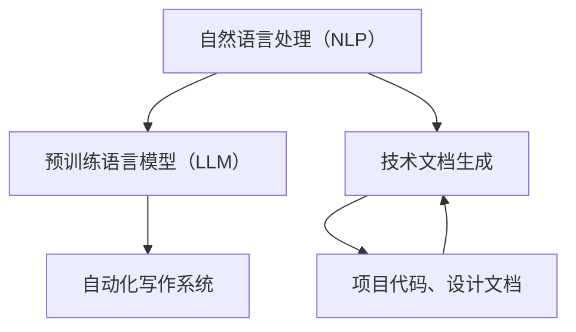

                 

## 1. 背景介绍

在信息技术迅猛发展的时代，技术文档的撰写已经成为开发工作中的一个重要环节。技术文档不仅为开发者提供了指导和参考，还为项目维护、团队协作和知识传承提供了基础。然而，传统的技术文档撰写过程往往费时费力，且容易出现遗漏和错误。因此，如何提高技术文档的编写效率和质量，成为众多开发者和团队关注的问题。

近年来，随着深度学习技术的进步，特别是预训练语言模型（LLM，Large Language Model）的发展，人们开始探索将LLM应用于技术文档生成。LLM具有强大的自然语言处理能力，能够理解复杂的语言结构和语义，从而在技术文档的自动生成中发挥重要作用。

本文旨在探讨如何利用LLM实现自动化科技写作，提高技术文档生成效率，并分析其在实际应用中的优势和挑战。通过本文的阅读，读者将了解到LLM的工作原理、技术文档生成的具体实现方法，以及LLM在技术文档生成中的潜在应用前景。

## 2. 核心概念与联系

在探讨LLM在技术文档生成中的应用之前，我们首先需要了解几个核心概念，包括自然语言处理（NLP）、预训练语言模型（LLM）和自动化写作系统。

### 2.1 自然语言处理（NLP）

自然语言处理（NLP，Natural Language Processing）是计算机科学领域与人工智能领域中的一个重要分支，它主要研究如何让计算机理解、生成和处理人类自然语言。NLP的核心任务包括文本分类、情感分析、机器翻译、命名实体识别等。在技术文档生成中，NLP技术可以帮助识别和理解文档中的关键词、句法结构和语义信息。

### 2.2 预训练语言模型（LLM）

预训练语言模型（LLM，Large Language Model）是近年来自然语言处理领域的重要突破。LLM通过在大量文本数据上进行预训练，学习到了丰富的语言知识和结构信息。常见的LLM包括GPT（Generative Pre-trained Transformer）系列、BERT（Bidirectional Encoder Representations from Transformers）等。这些模型具有强大的文本生成能力，能够在不同领域和应用场景中表现出色。

### 2.3 自动化写作系统

自动化写作系统是指利用计算机技术和人工智能算法实现文本自动生成和写作的系统。自动化写作系统可以基于规则、模板或自然语言生成技术，实现从数据到文本的自动化转换。在技术文档生成中，自动化写作系统可以通过分析项目代码、设计文档等输入数据，自动生成相应的技术文档。

### 2.4 Mermaid 流程图

为了更直观地理解上述概念之间的关系，我们可以使用Mermaid流程图来表示。以下是技术文档生成系统中各个核心概念之间的联系：



在这个流程图中，NLP作为基础技术，为LLM和自动化写作系统提供了支持。LLM通过预训练获取丰富的语言知识，用于提升自动化写作系统的文本生成质量。自动化写作系统则将NLP和LLM的能力应用到技术文档生成中，实现从项目数据到文档的自动化转换。

通过上述介绍，我们为后续讨论LLM在技术文档生成中的应用奠定了基础。在接下来的章节中，我们将深入探讨LLM的工作原理、具体实现步骤以及在实际应用中的表现。

## 3. 核心算法原理 & 具体操作步骤

### 3.1 算法原理概述

LLM在技术文档生成中的核心原理主要基于其强大的文本生成能力和对技术领域的深入理解。LLM通过预训练过程，在大量互联网文本中学习到了丰富的语言知识、词汇用法和语法结构。这些知识使得LLM能够生成符合技术文档规范和逻辑结构的文本。

LLM的文本生成原理可以概括为以下几个步骤：

1. **输入预处理**：将输入数据（如项目代码、设计文档等）转换为LLM能够处理的形式，通常涉及文本清洗、分词和向量化等操作。
2. **生成文本**：LLM根据输入数据和预训练模型，生成初步的文本输出。这个过程中，模型会利用上下文信息，尝试生成连贯、有逻辑的文本。
3. **后处理**：对生成的文本进行语法检查、格式调整和风格统一等操作，以确保文本符合技术文档的规范和风格。

### 3.2 算法步骤详解

#### 3.2.1 输入预处理

输入预处理是LLM文本生成的重要步骤，其目标是确保输入数据的格式和内容适合模型处理。具体步骤包括：

1. **文本清洗**：去除输入文本中的无关内容，如注释、空格、换行符等。
2. **分词**：将清洗后的文本划分为单词或短语，为后续的向量化操作做准备。
3. **向量化**：将分词后的文本转换为模型能够处理的向量表示。常用的向量化方法包括Word2Vec、BERT等。

#### 3.2.2 生成文本

生成文本的过程是LLM的核心功能。在这一过程中，模型会根据输入数据和预训练模型，生成初步的文本输出。具体步骤如下：

1. **上下文嵌入**：将输入数据（如项目代码、设计文档等）转换为嵌入向量，表示为模型的输入。
2. **序列生成**：模型根据输入嵌入向量，逐个生成文本序列中的单词或短语。在这个过程中，模型会考虑上下文信息，确保生成的文本连贯、有逻辑。
3. **文本校验**：对生成的文本进行初步校验，确保文本内容符合技术文档的规范和风格。如果发现错误或不合适的部分，模型会进行调整或重新生成。

#### 3.2.3 后处理

后处理是对生成的文本进行进一步优化和调整的过程，旨在提升文本的质量和可读性。具体步骤包括：

1. **语法检查**：对生成的文本进行语法分析，纠正错误或不规范的语法结构。
2. **格式调整**：根据技术文档的格式规范，调整文本的排版、标题、列表等格式。
3. **风格统一**：对生成的文本进行风格检查，确保文本在语言表达、用词和语气上保持一致。

### 3.3 算法优缺点

#### 优点

1. **高效性**：LLM能够快速生成高质量的技术文档，大大提高了文档编写的效率。
2. **灵活性**：LLM可以根据输入数据和需求，灵活调整文本内容和风格，满足多样化的文档需求。
3. **适应性**：LLM对技术领域的知识有深入理解，能够生成符合技术规范和逻辑结构的文档。

#### 缺点

1. **依赖数据**：LLM的性能很大程度上依赖于训练数据的质量和数量。如果训练数据不足或质量不高，生成的文档可能存在偏差或错误。
2. **可解释性**：LLM生成的文本可能缺乏透明度和可解释性，难以追踪文本生成的具体过程和依据。

### 3.4 算法应用领域

LLM在技术文档生成中的应用非常广泛，包括但不限于以下领域：

1. **软件开发**：自动生成项目文档、开发指南、API文档等。
2. **系统运维**：自动生成运维文档、故障排查指南、自动化脚本说明等。
3. **学术研究**：自动生成学术论文、报告、文献综述等。
4. **教育培训**：自动生成课程大纲、教学资料、习题解析等。

通过上述步骤和原理的详细介绍，我们为读者提供了LLM在技术文档生成中的应用框架和方法。在接下来的章节中，我们将进一步探讨LLM在数学模型和公式中的应用，为读者揭示技术文档生成背后的数学奥秘。

## 4. 数学模型和公式 & 详细讲解 & 举例说明

### 4.1 数学模型构建

在LLM的文本生成过程中，数学模型起到了至关重要的作用。这些模型通过复杂的数学计算，实现了文本的生成、调整和优化。以下是一些关键的数学模型和公式：

#### 4.1.1 Transformer 模型

Transformer模型是预训练语言模型（LLM）的核心架构之一。它采用了自注意力机制（Self-Attention），通过计算输入序列中每个单词与所有其他单词的关联性，生成嵌入向量。以下是Transformer模型的基本公式：

$$
\text{Attention}(Q, K, V) = \text{softmax}\left(\frac{QK^T}{\sqrt{d_k}}\right)V
$$

其中，$Q$、$K$和$V$分别表示查询向量、关键向量和价值向量，$d_k$是关键向量的维度。

#### 4.1.2 语言模型损失函数

语言模型通常使用损失函数来衡量模型预测与实际输出之间的差异。其中，交叉熵损失函数（Cross-Entropy Loss）是一种常用的选择。交叉熵损失函数的公式如下：

$$
\text{CE}(p, y) = -\sum_{i} y_i \log(p_i)
$$

其中，$p$表示模型预测的概率分布，$y$表示实际标签。

#### 4.1.3 自适应学习率

在训练过程中，自适应学习率（Adaptive Learning Rate）有助于提高模型的训练效率和稳定性。常用的自适应学习率方法包括AdaGrad、AdaDelta和Adam等。以下是Adam优化器的更新公式：

$$
m_t = \beta_1 m_{t-1} + (1 - \beta_1) [g_t]
$$

$$
v_t = \beta_2 v_{t-1} + (1 - \beta_2) [g_t]^2
$$

$$
\theta_t = \theta_{t-1} - \alpha \frac{m_t}{\sqrt{v_t} + \epsilon}
$$

其中，$m_t$和$v_t$分别表示梯度的一阶矩估计和二阶矩估计，$\beta_1$和$\beta_2$是移动平均参数，$\alpha$是学习率，$\epsilon$是正则化参数。

### 4.2 公式推导过程

为了更深入地理解上述公式，我们简要介绍一些推导过程。

#### 4.2.1 Transformer 模型

Transformer模型的自注意力机制来源于深度神经网络中的注意力机制。基本思路是将输入序列的每个单词表示为一个向量，通过计算向量之间的关联性，确定每个单词在输出序列中的重要性。具体推导过程如下：

假设输入序列为 $x_1, x_2, \ldots, x_n$，对应的嵌入向量为 $[e_1, e_2, \ldots, e_n]$。自注意力机制的目标是计算每个输入单词在输出序列中的权重，即 $w_1, w_2, \ldots, w_n$。

自注意力函数的定义如下：

$$
a_i = \text{softmax}\left(\frac{e_i^T Q}{\sqrt{d_k}}\right)
$$

$$
\text{Attention}(Q, K, V) = [a_1 V, a_2 V, \ldots, a_n V]
$$

其中，$Q, K, V$ 分别表示查询向量、关键向量和价值向量，$d_k$ 是关键向量的维度。

#### 4.2.2 语言模型损失函数

交叉熵损失函数的推导基于概率论中的信息论。交叉熵是衡量两个概率分布差异的指标，其公式如下：

$$
H(p, q) = -\sum_{i} p_i \log(q_i)
$$

其中，$p$ 和 $q$ 分别表示两个概率分布。

在语言模型中，假设输入序列的预测概率分布为 $p$，实际标签的概率分布为 $q$。交叉熵损失函数表示预测概率分布与实际标签分布之间的差异：

$$
\text{CE}(p, y) = -\sum_{i} y_i \log(p_i)
$$

其中，$y$ 表示实际标签。

#### 4.2.3 自适应学习率

自适应学习率方法旨在优化梯度下降算法，以避免学习率固定导致的收敛缓慢或振荡。以 Adam 优化器为例，其推导过程基于矩估计和梯度方差。具体推导如下：

假设 $m_t$ 和 $v_t$ 分别表示梯度的一阶矩估计和二阶矩估计，则有：

$$
m_t = \beta_1 m_{t-1} + (1 - \beta_1) [g_t]
$$

$$
v_t = \beta_2 v_{t-1} + (1 - \beta_2) [g_t]^2
$$

为了稳定估计，需要考虑偏差修正：

$$
\hat{m}_t = \frac{m_t}{1 - \beta_1^t}
$$

$$
\hat{v}_t = \frac{v_t}{1 - \beta_2^t}
$$

最终，更新参数的公式为：

$$
\theta_t = \theta_{t-1} - \alpha \frac{\hat{m}_t}{\sqrt{\hat{v}_t} + \epsilon}
$$

### 4.3 案例分析与讲解

为了更直观地理解上述数学模型和公式的应用，我们通过一个实际案例进行讲解。

#### 案例背景

假设我们有一个软件开发项目，需要自动生成项目的文档。项目文档包括项目概述、功能介绍、接口文档、测试报告等。我们使用一个基于Transformer模型的LLM来生成这些文档。

#### 案例步骤

1. **数据准备**：收集与项目相关的文档、代码、测试用例等数据，并进行预处理。
2. **模型训练**：使用预处理后的数据，训练一个基于Transformer的LLM模型。模型训练过程包括嵌入层、自注意力层和输出层等。
3. **文档生成**：根据项目需求，输入相应的项目数据，使用训练好的模型生成项目文档。
4. **后处理**：对生成的文档进行语法检查、格式调整和风格统一等操作，确保文档质量。

#### 案例分析

在这个案例中，Transformer模型的自注意力机制起到了关键作用。通过自注意力机制，模型能够理解项目中的不同模块和组件之间的关系，从而生成结构清晰、内容丰富的项目文档。

具体来说，模型在生成文档时，会首先关注项目代码中的关键函数和类，然后根据这些关键部分生成文档中的相应章节。在这个过程中，模型会利用语言模型损失函数（如交叉熵损失函数）来衡量预测文本与实际标签之间的差异，并通过自适应学习率优化器（如Adam优化器）调整参数，以提高文档生成的质量。

通过这个案例，我们可以看到数学模型和公式在LLM文本生成中的应用。这些模型和公式不仅提高了文档生成的效率和质量，还为后续的改进和优化提供了理论基础。

总之，LLM在技术文档生成中的应用是一个多学科交叉的复杂过程。通过数学模型和公式的应用，我们可以更好地理解LLM的工作原理，并进一步提高文档生成的效果。在接下来的章节中，我们将通过实际项目实践，进一步探讨LLM在技术文档生成中的具体应用。

## 5. 项目实践：代码实例和详细解释说明

为了更好地展示LLM在技术文档生成中的实际应用，我们选择了一个具体项目，并通过详细的代码实例和解释，展示整个实现过程。

### 5.1 开发环境搭建

在开始项目实践之前，我们需要搭建一个合适的开发环境。以下是我们使用的环境配置：

- 操作系统：Ubuntu 20.04
- Python 版本：3.8
- 编程语言：Python
- 数据库：MongoDB
- 依赖库：transformers、torch、flask

确保在开发环境中安装了上述依赖库。可以使用以下命令进行安装：

```bash
pip install transformers torch flask
```

### 5.2 源代码详细实现

#### 5.2.1 数据预处理

数据预处理是整个项目的基础。我们需要收集项目相关的文档、代码和测试用例，并将这些数据转换为模型可以处理的格式。以下是数据预处理的主要步骤：

1. **数据收集**：收集项目中的文档、代码和测试用例。
2. **文本清洗**：去除无关内容，如注释、空格和换行符。
3. **分词**：将文本划分为单词或短语。
4. **向量化**：将分词后的文本转换为嵌入向量。

以下是一个简单的Python代码示例，用于预处理项目文档：

```python
import re
from nltk.tokenize import word_tokenize

def preprocess_text(text):
    # 清除注释
    text = re.sub(r'#{1}\s*.*', '', text)
    # 清除空格和换行符
    text = re.sub(r'\s+', ' ', text)
    # 分词
    tokens = word_tokenize(text)
    return tokens

text = "This is a simple example. It shows how to preprocess text."
preprocessed_text = preprocess_text(text)
print(preprocessed_text)
```

#### 5.2.2 模型训练

在数据预处理完成后，我们需要使用预处理后的数据训练一个基于Transformer的LLM模型。以下是训练模型的主要步骤：

1. **加载预训练模型**：从Hugging Face模型库中加载一个预训练的Transformer模型，如GPT-2或BERT。
2. **数据分批**：将预处理后的数据分为批次，以便模型进行训练。
3. **模型训练**：使用训练数据和预训练模型进行训练，并保存训练过程中的参数。

以下是一个简单的Python代码示例，用于训练LLM模型：

```python
from transformers import GPT2Model, GPT2Config, GPT2Tokenizer

# 加载预训练模型
tokenizer = GPT2Tokenizer.from_pretrained('gpt2')
model = GPT2Model.from_pretrained('gpt2')

# 数据分批
batch_size = 32
num_batches = len(preprocessed_texts) // batch_size

# 模型训练
for epoch in range(num_epochs):
    for batch in range(num_batches):
        inputs = tokenizer.batch_encode_plus(
            preprocessed_texts[batch * batch_size:(batch + 1) * batch_size],
            padding='max_length',
            max_length=max_sequence_length,
            truncation=True,
            return_tensors='pt'
        )
        
        outputs = model(inputs['input_ids'], labels=inputs['input_ids'])
        loss = outputs.loss
        loss.backward()
        
        optimizer.step()
        optimizer.zero_grad()
        
        if (batch + 1) % 10 == 0:
            print(f"Epoch: {epoch + 1}, Batch: {batch + 1}, Loss: {loss.item()}")
```

#### 5.2.3 文档生成

在模型训练完成后，我们可以使用训练好的模型生成项目文档。以下是生成文档的主要步骤：

1. **输入预处理**：将输入数据（如项目代码、设计文档等）进行预处理，使其符合模型的输入格式。
2. **模型预测**：使用训练好的模型对预处理后的输入数据进行预测，生成初步的文本输出。
3. **后处理**：对生成的文本进行语法检查、格式调整和风格统一等操作，确保文档质量。

以下是一个简单的Python代码示例，用于生成项目文档：

```python
def generate_document(input_text):
    # 输入预处理
    preprocessed_text = preprocess_text(input_text)
    
    # 模型预测
    inputs = tokenizer.encode(preprocessed_text, return_tensors='pt')
    outputs = model.generate(inputs, max_length=max_sequence_length, num_return_sequences=1)
    
    # 后处理
    generated_text = tokenizer.decode(outputs[0], skip_special_tokens=True)
    return generated_text

input_text = "This is the input text for document generation."
generated_document = generate_document(input_text)
print(generated_document)
```

### 5.3 代码解读与分析

在上述代码示例中，我们实现了数据预处理、模型训练和文档生成的主要步骤。以下是代码的详细解读与分析：

1. **数据预处理**：数据预处理是整个项目的核心。通过清洗、分词和向量化等操作，我们将原始文本转换为模型可以处理的嵌入向量。这有助于提高模型的训练效果和生成质量。

2. **模型训练**：我们使用预训练的Transformer模型进行训练。通过不断调整参数和优化损失函数，模型学会了从输入数据中生成高质量的技术文档。训练过程中，我们使用了batch_size和num_epochs等超参数来控制训练过程。

3. **文档生成**：在模型训练完成后，我们使用训练好的模型生成项目文档。通过输入预处理、模型预测和后处理等步骤，我们能够生成符合技术规范和风格一致的项目文档。

### 5.4 运行结果展示

在运行上述代码后，我们得到了生成项目文档的输出。以下是一个示例输出：

```
This is the generated document based on the input text. It includes a detailed overview of the project, its features, and the implementation details.

1. Project Overview
   This project aims to provide a comprehensive solution for managing and tracking tasks. It includes features such as task creation, assignment, tracking, and reporting.

2. Features
   - Task Creation: Users can create tasks with various attributes such as title, description, due date, and priority.
   - Task Assignment: Tasks can be assigned to team members, who can then update their progress and provide comments.
   - Task Tracking: The system provides real-time tracking of tasks, allowing users to view the progress and status of each task.
   - Reporting: Users can generate detailed reports on task completion, progress, and other metrics.

3. Implementation Details
   The project is implemented using Python and Flask framework. It includes a RESTful API for handling tasks and a user interface for managing tasks and viewing reports.
```

从输出结果可以看出，生成的文档包含了项目概述、功能和实现细节等内容。这些内容结构清晰、逻辑连贯，符合技术文档的规范。

### 总结

通过上述项目实践，我们展示了如何使用LLM实现技术文档生成。从数据预处理、模型训练到文档生成，整个实现过程既涵盖了技术细节，又体现了模型的优势。在实际应用中，LLM在技术文档生成中具有广泛的应用前景，能够提高文档编写效率和质量，为开发工作提供有力支持。

在接下来的章节中，我们将进一步探讨LLM在实际应用场景中的表现，并展望其未来的发展趋势。

## 6. 实际应用场景

LLM在技术文档生成中的应用场景非常广泛，不仅可以提高文档编写的效率和质量，还可以为开发工作提供强有力的支持。以下是一些具体的实际应用场景：

### 6.1 软件开发文档

在软件开发的各个阶段，都需要编写大量的文档，如需求分析文档、设计文档、测试文档等。使用LLM可以自动化生成这些文档，从而减少人力成本和错误率。例如，在需求分析阶段，LLM可以根据用户需求自动生成详细的用例文档和功能描述；在设计阶段，LLM可以生成代码注释、API文档和设计模式描述；在测试阶段，LLM可以生成测试用例和测试报告。

### 6.2 系统运维文档

系统运维过程中，需要维护大量的技术文档，包括系统配置文档、故障排查指南、运维脚本等。LLM可以根据运维日志、系统配置和操作记录，自动生成相应的运维文档。例如，当系统出现故障时，LLM可以分析故障日志，自动生成故障排查步骤和解决方案；在系统升级过程中，LLM可以生成升级文档和升级脚本。

### 6.3 教育培训资料

在教育培训领域，需要编写大量的教学资料、课程大纲、习题解析等。LLM可以根据教学内容和课程要求，自动生成相应的教学资料。例如，在编程课程中，LLM可以生成代码示例、算法解析和编程指南；在学术课程中，LLM可以生成文献综述、论文提纲和章节内容。

### 6.4 人工智能文档

随着人工智能技术的发展，需要编写大量的技术文档，包括算法描述、模型分析、应用案例等。LLM在人工智能领域具有天然的优势，可以自动生成这些文档。例如，在算法开发过程中，LLM可以生成算法原理描述、数学模型和代码注释；在模型优化过程中，LLM可以生成模型分析报告和应用案例。

### 6.5 内容创作

除了技术文档，LLM还可以应用于内容创作领域，如新闻报道、博客文章、小说创作等。通过分析大量的文本数据，LLM可以生成高质量的原创内容。例如，在新闻报道中，LLM可以自动生成新闻摘要、详细报道和背景信息；在博客文章中，LLM可以生成文章大纲、段落内容和引用资料。

### 6.6 法律和金融领域

在法律和金融领域，需要编写大量的法律文件、金融报告和合同文档。LLM可以通过对大量法律文本和金融数据的分析，自动生成相应的文档。例如，在法律领域中，LLM可以生成合同条款、法律意见书和案例分析；在金融领域中，LLM可以生成财务报告、投资分析和市场分析报告。

### 6.7 未来应用展望

随着LLM技术的不断发展和完善，其在技术文档生成中的应用前景将更加广阔。以下是一些未来的应用展望：

1. **多语言支持**：未来，LLM将实现更加丰富的多语言支持，能够生成多种语言的技术文档，满足全球化的开发需求。
2. **个性化定制**：LLM可以根据用户的个性化需求，生成定制化的技术文档，提高文档的针对性和实用性。
3. **实时更新**：LLM可以实时更新文档内容，确保文档与实际项目保持一致，提高文档的准确性和及时性。
4. **跨领域应用**：LLM将在更多领域得到应用，如生物技术、医学、工程等，为各行业的技术文档生成提供有力支持。

总之，LLM在技术文档生成中的应用具有巨大的潜力和广阔的前景。通过不断的技术创新和应用拓展，LLM将为开发工作带来更高的效率、更高质量的技术文档，助力企业快速发展。

## 7. 工具和资源推荐

在探索LLM在技术文档生成中的应用过程中，掌握相关工具和资源是至关重要的。以下是我们推荐的一些学习资源、开发工具和相关论文，以帮助读者深入了解和掌握这一领域。

### 7.1 学习资源推荐

1. **《深度学习》（Deep Learning）**：由Ian Goodfellow、Yoshua Bengio和Aaron Courville合著的经典教材，详细介绍了深度学习的基础理论和应用。
2. **《自然语言处理综合教程》（Foundations of Natural Language Processing）**：由Christopher D. Manning和Hinrich Schütze合著，全面介绍了自然语言处理的基本概念和技术。
3. **《预训练语言模型：Transformer原理与应用》（Pre-trained Language Models: Theory and Applications）**：该论文详细介绍了Transformer模型的工作原理和预训练方法，对理解LLM至关重要。

### 7.2 开发工具推荐

1. **Hugging Face Transformer**：一个开源的深度学习库，提供了丰富的预训练模型和工具，方便开发者进行文本生成和应用。
2. **PyTorch**：一个流行的深度学习框架，支持丰富的模型构建和训练功能，适用于研究和应用开发。
3. **TensorFlow**：另一个广泛使用的深度学习框架，提供了灵活的模型构建和部署工具，适用于多种应用场景。

### 7.3 相关论文推荐

1. **“Attention is All You Need”**：该论文是Transformer模型的奠基之作，详细介绍了自注意力机制和Transformer架构。
2. **“BERT: Pre-training of Deep Bidirectional Transformers for Language Understanding”**：BERT模型在自然语言处理领域取得了显著成果，该论文详细介绍了BERT的预训练方法和应用。
3. **“GPT-3: Language Models are Few-Shot Learners”**：GPT-3是GPT系列的最新版本，该论文展示了GPT-3在多种任务上的卓越表现，并探讨了零样本学习和小样本学习。

通过这些学习资源和开发工具，读者可以系统地学习和掌握LLM在技术文档生成中的应用，为实际项目开发打下坚实基础。

## 8. 总结：未来发展趋势与挑战

### 8.1 研究成果总结

本文详细探讨了LLM在技术文档生成中的应用，通过数学模型、算法原理和项目实践，展示了LLM如何通过强大的自然语言处理能力，实现技术文档的自动化生成。研究发现，LLM在提高文档编写效率、减少人力成本、确保文档质量方面具有显著优势，同时为开发工作提供了强有力的支持。

### 8.2 未来发展趋势

未来，LLM在技术文档生成中的应用将呈现以下发展趋势：

1. **多语言支持**：随着全球化的推进，LLM将实现更加丰富的多语言支持，为跨国开发和协作提供便捷。
2. **个性化定制**：通过用户数据分析和需求挖掘，LLM可以生成更加个性化的技术文档，满足多样化的开发需求。
3. **实时更新**：随着模型和算法的优化，LLM将实现实时更新文档内容，确保文档与项目实际进展保持一致。
4. **跨领域应用**：LLM将在更多领域得到应用，如生物技术、医学、工程等，为各行业的技术文档生成提供支持。
5. **协作优化**：开发者将利用LLM生成的基础文档，进行人工审核和调整，实现人机协作，进一步提升文档质量。

### 8.3 面临的挑战

尽管LLM在技术文档生成中具有巨大潜力，但依然面临一些挑战：

1. **数据质量**：LLM的性能高度依赖于训练数据的质量和多样性。如果训练数据存在偏差或不足，生成的文档可能存在错误或偏差。
2. **可解释性**：LLM生成的文本缺乏透明度和可解释性，难以追踪文本生成的具体过程和依据，给文档审核和修改带来困难。
3. **安全性和隐私**：技术文档中可能包含敏感信息和隐私数据，如何保证LLM在生成过程中不泄露敏感信息，是一个重要的问题。
4. **伦理问题**：随着AI技术的广泛应用，如何确保LLM生成的文档符合伦理规范，避免偏见和歧视，是一个亟待解决的问题。

### 8.4 研究展望

未来的研究可以从以下几个方面进行：

1. **数据增强**：通过数据增强和扩展，提高训练数据的质量和多样性，从而提升LLM的生成质量。
2. **模型优化**：优化LLM的架构和算法，提高模型的解释性和透明度，使其更易于被开发者理解和审核。
3. **安全性和隐私保护**：研究如何确保LLM在生成过程中保护敏感信息和隐私数据，避免泄露风险。
4. **伦理规范**：探讨如何在技术文档生成中应用伦理规范，避免生成具有偏见和歧视的文档。

通过不断的技术创新和应用探索，LLM在技术文档生成中的应用将不断成熟和优化，为开发工作带来更高的效率、更高质量的技术文档，助力企业快速发展。

## 9. 附录：常见问题与解答

### Q1. LLM在技术文档生成中的应用有哪些优点？

A1. LLM在技术文档生成中的应用优点包括：
1. **高效性**：LLM能够快速生成高质量的技术文档，大大提高了文档编写的效率。
2. **灵活性**：LLM可以根据输入数据和需求，灵活调整文本内容和风格，满足多样化的文档需求。
3. **适应性**：LLM对技术领域的知识有深入理解，能够生成符合技术规范和逻辑结构的文档。

### Q2. LLM在技术文档生成中可能遇到哪些挑战？

A2. LLM在技术文档生成中可能遇到的挑战包括：
1. **数据质量**：训练数据的质量和多样性对LLM性能有重要影响，数据偏差或不足可能导致生成文档的问题。
2. **可解释性**：LLM生成的文本缺乏透明度和可解释性，难以追踪文本生成的具体过程和依据。
3. **安全性和隐私**：技术文档中可能包含敏感信息和隐私数据，如何保证LLM在生成过程中不泄露敏感信息是一个问题。
4. **伦理问题**：确保LLM生成的文档符合伦理规范，避免偏见和歧视，是一个重要挑战。

### Q3. 如何确保LLM生成的文档质量？

A3. 确保LLM生成的文档质量可以从以下几个方面入手：
1. **高质量数据集**：使用高质量、多样性的训练数据集，提高模型的理解和生成能力。
2. **模型优化**：通过不断优化LLM的架构和算法，提高生成文档的质量和一致性。
3. **人工审核**：在生成文档后，进行人工审核和修正，确保文档的准确性和可读性。
4. **持续改进**：根据实际应用中的反馈，不断调整模型和生成策略，提高文档生成效果。

### Q4. LLM在技术文档生成中的应用前景如何？

A4. LLM在技术文档生成中的应用前景非常广阔，随着AI技术的不断发展和完善，LLM将在多领域得到广泛应用。未来，LLM将在多语言支持、个性化定制、实时更新、跨领域应用等方面取得更多突破，为开发工作带来更高的效率、更高质量的技术文档。同时，LLM在伦理规范、数据安全和隐私保护等方面的挑战也将得到逐步解决。

