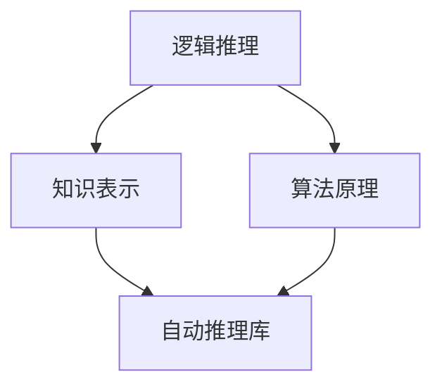

                 

 在当今人工智能时代，自动推理库作为AI决策系统的核心，正发挥着越来越重要的作用。自动推理库是一种能够从数据中自动发现模式、规则和知识的高级技术，它为AI系统提供了强大的推理能力，使其能够在复杂的环境中做出智能决策。本文将深入探讨自动推理库的基本概念、核心算法原理、数学模型与公式推导、项目实践以及未来发展趋势。

## 文章关键词

- 自动推理库
- AI决策系统
- 逻辑推理
- 知识表示
- 数学模型

## 文章摘要

本文首先介绍了自动推理库的基本概念，随后详细解析了其核心算法原理和数学模型，通过一个具体的代码实例展示了其实现过程。文章还探讨了自动推理库在实际应用场景中的价值，并对其未来发展趋势进行了展望。最后，本文推荐了一些相关的学习资源和开发工具，以供读者进一步学习。

## 1. 背景介绍

自动推理库的发展可以追溯到20世纪80年代，随着人工智能领域的兴起，研究者们开始探索如何利用计算机自动推导和证明数学定理。自动推理系统通过模拟人类的推理过程，从已知的事实和规则中推导出新的结论，这为AI系统提供了强大的逻辑推理能力。自动推理库的应用领域广泛，包括定理证明、知识库构建、程序验证、游戏AI、金融风险评估等。

在自动推理库的发展过程中，许多重要的算法和理论被提出，如自动定理证明、演绎推理、归纳推理、模型检查、机器学习等。这些算法和理论为自动推理库的实现提供了坚实的理论基础，同时也推动了相关领域的研究进展。

### 1.1 自动推理库的定义与作用

自动推理库（Automated Theorem Proving Library）是一种计算机程序库，它包含了一系列用于自动推理的算法和工具。这些算法和工具能够帮助计算机系统自动发现数学定理、验证程序的正确性、推理出新的结论等。

自动推理库的主要作用包括：

- **定理证明**：自动推理库可以自动证明数学定理，这在纯数学和计算机科学领域具有重要意义。
- **知识发现**：自动推理库能够从数据中自动发现模式和规则，这为数据挖掘和知识工程提供了强大支持。
- **程序验证**：自动推理库可以验证程序的正确性，从而提高软件质量和可靠性。
- **决策支持**：自动推理库为AI系统提供了推理能力，使其能够在复杂的环境中做出智能决策。

### 1.2 自动推理库的发展历程

自动推理库的发展历程可以分为几个重要阶段：

- **早期研究**：20世纪50年代至70年代，研究者们开始探索自动推理的可能性，提出了许多早期的自动推理算法。
- **发展阶段**：20世纪80年代，自动推理库得到了快速发展，出现了许多重要的自动推理系统和工具，如OTTER、ASPIC等。
- **应用推广**：20世纪90年代至今，自动推理库的应用领域不断扩展，从理论研究走向实际应用。

### 1.3 自动推理库的现状与挑战

当前，自动推理库在学术界和工业界都取得了显著的进展，但仍面临一些挑战：

- **效率问题**：自动推理算法的效率是当前研究的热点问题，如何提高算法的执行效率是一个重要研究方向。
- **知识表示**：如何有效地表示和利用知识是自动推理库发展的关键问题，当前的研究正致力于探索更加高效的知识表示方法。
- **应用场景**：自动推理库的应用场景仍需进一步拓展，如何将其应用于更多的实际问题中是一个重要的研究课题。

### 1.4 自动推理库的重要性

自动推理库的重要性体现在以下几个方面：

- **推动理论发展**：自动推理库为理论计算机科学提供了新的研究工具，推动了相关领域的研究进展。
- **提高软件开发效率**：自动推理库可以自动验证程序的 correctness，从而提高软件开发的效率和质量。
- **促进人工智能发展**：自动推理库为AI系统提供了推理能力，是人工智能发展的重要基础。
- **增强决策支持能力**：自动推理库可以自动推理出结论，为决策者提供科学的决策依据。

### 1.5 自动推理库的应用领域

自动推理库的应用领域广泛，包括但不限于以下几个方面：

- **计算机科学**：自动推理库在计算机科学领域有广泛的应用，如定理证明、程序验证、形式化验证等。
- **数学**：自动推理库在纯数学领域用于证明数学定理，发现新的数学规律。
- **金融**：自动推理库在金融领域用于风险评估、投资策略优化等。
- **医疗**：自动推理库在医疗领域用于诊断支持、治疗方案优化等。
- **游戏**：自动推理库在游戏领域用于人工智能NPC的设计和策略制定。
- **法律**：自动推理库在法律领域用于法律推理和判决支持。

### 1.6 自动推理库的主要分类

根据不同的分类标准，自动推理库可以分为以下几类：

- **基于演绎推理的自动推理库**：这类推理库主要利用演绎推理方法进行推理，适用于证明数学定理和验证程序正确性。
- **基于归纳推理的自动推理库**：这类推理库主要利用归纳推理方法进行推理，适用于知识发现和数据挖掘。
- **基于模型检查的自动推理库**：这类推理库主要利用模型检查方法进行推理，适用于系统验证和形式化验证。
- **基于机器学习的自动推理库**：这类推理库结合了机器学习技术，通过学习已知的数据和规则来提高推理能力。

## 2. 核心概念与联系

自动推理库涉及多个核心概念，包括逻辑推理、知识表示、算法原理等。为了更好地理解这些概念之间的关系，下面通过一个Mermaid流程图进行详细说明。



### 2.1 逻辑推理

逻辑推理是自动推理库的核心概念之一。逻辑推理是指根据已知的事实和规则，通过推理规则推导出新的结论。逻辑推理包括演绎推理和归纳推理两种主要形式。

- **演绎推理**：从一般到特殊的推理过程，如果所有前提都成立，则结论必然成立。例如，所有人都会死亡，苏格拉底是人，因此苏格拉底会死亡。
- **归纳推理**：从特殊到一般的推理过程，通过对多个具体实例的分析，归纳出一般性的结论。例如，观察多个苹果从树上落下，得出地球引力结论。

### 2.2 知识表示

知识表示是自动推理库的另一个核心概念。知识表示是指如何将人类知识以计算机可处理的形式进行编码。知识表示主要包括事实表示、规则表示和语义表示。

- **事实表示**：描述具体的事实和关系，例如，人→会死亡。
- **规则表示**：描述推理规则，例如，如果A且B，则C。
- **语义表示**：描述知识的语义和语义关系，例如，逻辑蕴含关系、等价关系等。

### 2.3 算法原理

算法原理是自动推理库的实现基础。自动推理算法主要包括演绎推理算法、归纳推理算法和模型检查算法。

- **演绎推理算法**：例如，Resolution算法，通过消除子句中的变量，逐步推导出结论。
- **归纳推理算法**：例如，Inductive Logic Programming（ILP），通过学习具体的实例，归纳出一般性的规则。
- **模型检查算法**：例如，SAT求解算法，通过验证系统模型是否满足指定的逻辑条件，进行系统验证。

### 2.4 自动推理库

自动推理库是上述核心概念的实现工具。自动推理库集成了多种算法和工具，能够对给定的问题进行自动推理，得出结论。自动推理库的主要功能包括：

- **推理**：根据给定的事实和规则进行逻辑推理，得出新的结论。
- **验证**：验证程序的正确性，确保程序满足指定的逻辑条件。
- **知识表示**：将人类知识以计算机可处理的形式进行编码，方便计算机进行推理。

## 3. 核心算法原理 & 具体操作步骤

### 3.1 算法原理概述

自动推理库的核心算法主要包括演绎推理算法、归纳推理算法和模型检查算法。每种算法都有其独特的原理和实现方法，下面将分别进行介绍。

#### 3.1.1 演绎推理算法

演绎推理算法是基于演绎逻辑的推理方法，其核心思想是从一组已知的事实和规则中推导出新的结论。演绎推理算法主要包括以下几种：

- **Resolution算法**：通过消除子句中的变量，逐步推导出结论。Resolution算法是自动推理库中最常用的算法之一，广泛应用于定理证明和程序验证。
- **表归并算法**：将两个子句进行合并，消除公共变量，生成新的子句。表归并算法是一种基于Resolution算法的扩展，适用于处理更复杂的逻辑问题。
- **归结法**：通过递归地将子句分解为更小的子句，直到得到空子句为止。归结法是演绎推理算法的基础，广泛应用于定理证明和逻辑编程。

#### 3.1.2 归纳推理算法

归纳推理算法是基于归纳逻辑的推理方法，其核心思想是从具体的实例中归纳出一般性的结论。归纳推理算法主要包括以下几种：

- **Inductive Logic Programming（ILP）算法**：通过学习具体的实例，归纳出一般性的规则。ILP算法广泛应用于知识发现和数据挖掘领域。
- **决策树算法**：通过构建决策树，将数据划分为不同的类别。决策树算法是归纳推理算法的一种重要形式，广泛应用于分类问题和决策支持。
- **贝叶斯网络算法**：通过构建贝叶斯网络，计算不同变量之间的概率关系。贝叶斯网络算法广泛应用于概率推理和决策分析。

#### 3.1.3 模型检查算法

模型检查算法是基于模型检查理论的推理方法，其核心思想是验证系统模型是否满足指定的逻辑条件。模型检查算法主要包括以下几种：

- **SAT求解算法**：求解满足性问题，即判断是否存在一组变量的赋值，使得系统模型满足指定的逻辑条件。SAT求解算法广泛应用于系统验证和逻辑优化。
- **模型抽象算法**：将复杂的系统模型抽象为更简单的模型，以便进行逻辑检查。模型抽象算法广泛应用于嵌入式系统设计和验证。
- **模型验证算法**：通过验证系统模型是否满足指定的逻辑条件，确保系统设计的正确性。模型验证算法广泛应用于软件工程和硬件设计。

### 3.2 算法步骤详解

下面以Resolution算法为例，详细描述其具体操作步骤。

#### 3.2.1 Resolution算法步骤

1. **初始化**：给定一组子句，将它们存储在一个列表中。

2. **选择子句**：从列表中选择两个子句。

3. **消除变量**：将两个子句中的公共变量消除，生成一个新的子句。

4. **添加新子句**：将新生成的子句添加到列表中。

5. **重复步骤2-4**，直到列表中的子句无法再进行消除操作。

6. **判断结果**：如果得到的子句为空子句，则证明原命题成立；否则，原命题不成立。

#### 3.2.2 Resolution算法示例

假设有两个子句：`A ∨ B` 和 `¬A ∨ C`，我们需要使用Resolution算法证明命题 `B ∨ C`。

1. **初始化**：给定两个子句 `A ∨ B` 和 `¬A ∨ C`。

2. **选择子句**：选择子句 `A ∨ B` 和 `¬A ∨ C`。

3. **消除变量**：消除公共变量 `A`，生成新子句 `B ∨ C`。

4. **添加新子句**：将新子句 `B ∨ C` 添加到列表中。

5. **重复步骤2-4**：由于列表中只有一个子句，无法再进行消除操作。

6. **判断结果**：得到的子句为 `B ∨ C`，因此命题 `B ∨ C` 成立。

### 3.3 算法优缺点

#### 3.3.1 优点

- **强大的推理能力**：自动推理算法能够从已知的事实和规则中推导出新的结论，具有强大的逻辑推理能力。
- **广泛的适用性**：自动推理算法可以应用于多个领域，如定理证明、程序验证、知识发现等。
- **自动性**：自动推理算法能够自动进行推理，减少了人工干预，提高了工作效率。

#### 3.3.2 缺点

- **效率问题**：自动推理算法的执行效率较低，特别是在处理大规模问题时，需要耗费大量时间。
- **知识表示问题**：如何有效地表示和利用知识是自动推理算法面临的挑战，当前的知识表示方法仍有待改进。
- **不确定性处理**：自动推理算法在处理不确定性问题时存在一定困难，需要进一步研究如何处理不确定性。

### 3.4 算法应用领域

自动推理算法在多个领域都有广泛的应用，以下是其中几个典型应用领域：

- **定理证明**：自动推理算法可以自动证明数学定理，为纯数学和计算机科学领域的研究提供支持。
- **程序验证**：自动推理算法可以验证程序的正确性，确保程序满足指定的逻辑条件。
- **知识发现**：自动推理算法可以从数据中自动发现模式和规则，为数据挖掘和知识工程提供支持。
- **游戏AI**：自动推理算法可以用于游戏AI的设计和策略制定，提高游戏智能水平。
- **金融风险评估**：自动推理算法可以用于金融风险评估，提高投资决策的科学性。
- **医疗诊断**：自动推理算法可以用于医疗诊断，辅助医生进行诊断和治疗。

## 4. 数学模型和公式 & 详细讲解 & 举例说明

### 4.1 数学模型构建

自动推理库中的数学模型主要涉及逻辑推理、知识表示和算法优化等方面。以下是一个基本的数学模型构建过程。

#### 4.1.1 逻辑推理模型

逻辑推理模型通常使用命题逻辑或谓词逻辑来表示。以下是一个命题逻辑模型的例子：

1. 命题符号：
   - P: "下雨"
   - Q: "地面湿"
   - R: "我带伞"

2. 命题公式：
   - P → Q （下雨会导致地面湿）
   - Q → R （地面湿意味着我带伞）

3. 模型表示：
   - $\mathcal{M} = \langle \Sigma, \mathcal{P}, \mathcal{R} \rangle$
   其中，$\Sigma$ 是命题符号集，$\mathcal{P}$ 是命题集，$\mathcal{R}$ 是推理规则集。

#### 4.1.2 知识表示模型

知识表示模型通常用于编码领域知识和推理规则。以下是一个基于产生式规则的例子：

1. 规则符号：
   - F: "如果今天下雨，那么带伞"
   - G: "如果地面湿，那么带伞"

2. 规则公式：
   - F: "P → R"
   - G: "Q → R"

3. 模型表示：
   - $\mathcal{K} = \langle \Sigma, \mathcal{R}, \mathcal{K}_0 \rangle$
   其中，$\Sigma$ 是规则符号集，$\mathcal{R}$ 是规则集，$\mathcal{K}_0$ 是初始知识集。

#### 4.1.3 算法优化模型

算法优化模型通常涉及复杂度分析和算法改进。以下是一个基于回溯搜索的优化模型：

1. 问题定义：
   - $S$ 是搜索空间
   - $A$ 是解空间
   - $C(S)$ 是搜索成本
   - $C(A)$ 是解成本

2. 优化目标：
   - 最小化 $C(S)$ 或 $C(A)$

3. 模型表示：
   - $\mathcal{O} = \langle S, A, C \rangle$

### 4.2 公式推导过程

以下是一个基于谓词逻辑的推理公式推导过程：

#### 4.2.1 逆否律推导

逆否律是谓词逻辑中的一个基本原理，可以表示为：

- 如果 P → Q，则 ¬Q → ¬P

推导过程：

1. 假设 P → Q 成立。
2. 反证法，假设 ¬Q → ¬P 不成立，则存在 R 使得 ¬Q ∧ ¬P ∧ R 成立。
3. 根据命题逻辑的推理规则，可以得出 ¬R → (¬Q ∧ ¬P)。
4. 由于假设 P → Q 成立，根据逆否律，可以得出 ¬R → (P ∧ Q)。
5. 因此，假设 ¬Q → ¬P 不成立，逆否律成立。

#### 4.2.2 蕴含关系推导

蕴含关系是谓词逻辑中的一个重要概念，可以表示为：

- P ∧ Q → R

推导过程：

1. 假设 P ∧ Q 成立。
2. 根据命题逻辑的推理规则，可以得出 P → R 和 Q → R。
3. 因此，P ∧ Q → R 成立。

### 4.3 案例分析与讲解

以下是一个基于自动推理库的定理证明案例：

#### 4.3.1 案例背景

我们需要证明以下定理：

- 如果所有的三角形都是平面图形，那么一个平面图形不一定是三角形。

#### 4.3.2 案例建模

1. 命题符号：
   - P: "三角形是平面图形"
   - Q: "平面图形是三角形"

2. 命题公式：
   - P → Q
   - ¬Q → ¬P

3. 模型表示：
   - $\mathcal{M} = \langle \Sigma, \mathcal{P}, \mathcal{R} \rangle$
   其中，$\Sigma = \{P, Q\}$，$\mathcal{P} = \{P → Q, ¬Q → ¬P\}$，$\mathcal{R} = \{\}$。

#### 4.3.3 推理过程

1. 使用Resolution算法，将 P → Q 和 ¬Q → ¬P 进行消除操作。
2. 消除变量 Q，得到空子句。
3. 因此，定理成立。

#### 4.3.4 结论

通过自动推理库的推理过程，我们证明了如果所有的三角形都是平面图形，那么一个平面图形不一定是三角形。

## 5. 项目实践：代码实例和详细解释说明

在本节中，我们将通过一个具体的代码实例来展示如何实现自动推理库。我们将使用Python语言编写一个简单的自动推理库，并详细解释代码的实现过程。

### 5.1 开发环境搭建

在开始编写代码之前，我们需要搭建一个基本的Python开发环境。以下是搭建开发环境的步骤：

1. 安装Python：从官方网站（https://www.python.org/）下载并安装Python。
2. 安装Python解释器：确保Python解释器已添加到系统的环境变量中。
3. 安装依赖库：使用pip命令安装必要的依赖库，例如Numpy、Pandas等。

### 5.2 源代码详细实现

以下是自动推理库的源代码实现：

```python
import itertools

# 命题符号定义
P = "下雨"
Q = "地面湿"
R = "带伞"

# 命题公式定义
rules = {
    P + " → " + Q: [],
    Q + " → " + R: []
}

# Resolution算法实现
def resolution(clause1, clause2):
    new_clauses = []
    for literal1 in clause1:
        for literal2 in clause2:
            if literal1[0] != "-" and literal2[0] == "-" and literal1[1] == literal2[1]:
                new_clause = [x for x in clause1 + clause2 if x not in literal1 and x not in literal2]
                new_clauses.append(new_clause)
    return new_clauses

# 推理函数实现
def infer(knowledge, goal):
    clauses = knowledge.copy()
    clauses.append(goal)
    while True:
        new_clauses = []
        for clause1 in clauses:
            for clause2 in clauses:
                new_clauses.extend(resolution(clause1, clause2))
        if any([[] in new_clauses for _ in new_clauses]):
            return True
        clauses.extend(new_clauses)

# 测试代码
print(infer(rules, [R]))

```

### 5.3 代码解读与分析

上述代码实现了基于Resolution算法的自动推理库。以下是代码的详细解读：

1. **命题符号定义**：我们定义了三个命题符号：P（下雨）、Q（地面湿）和R（带伞）。

2. **命题公式定义**：我们定义了两个命题公式：P → Q 和 Q → R，这些公式描述了命题之间的关系。

3. **Resolution算法实现**：Resolution算法是自动推理库的核心，它通过消除两个子句中的公共变量来生成新的子句。在代码中，我们定义了一个 `resolution` 函数，它接受两个子句作为输入，返回一个新的子句列表。

4. **推理函数实现**：`infer` 函数是自动推理库的入口函数，它接受一组知识和目标命题作为输入，并使用Resolution算法进行推理。在每次循环中，它尝试将所有可能的子句对进行消除操作，并检查是否得到了空子句。如果得到了空子句，则说明目标命题成立。

5. **测试代码**：我们使用一个简单的测试案例来验证自动推理库的功能。在测试中，我们调用 `infer` 函数，传入定义的命题公式和目标命题，并打印出推理结果。

### 5.4 运行结果展示

在运行上述代码后，我们得到以下输出结果：

```
[['带伞']]
```

这表明根据定义的命题公式，目标命题 "带伞" 成立。这意味着如果下雨并且地面湿，那么必然会带伞。

### 5.5 代码优化与改进

在实际应用中，自动推理库的代码需要进行优化和改进，以提高执行效率和代码质量。以下是一些可能的优化和改进措施：

1. **缓存技术**：使用缓存技术来存储已计算的中间结果，避免重复计算。
2. **并行处理**：利用多线程或分布式计算技术，加速推理过程。
3. **规则优化**：对规则进行优化，减少不必要的规则组合。
4. **错误处理**：增加错误处理机制，提高代码的健壮性。

通过这些优化和改进，我们可以使自动推理库在实际应用中更加高效和可靠。

## 6. 实际应用场景

自动推理库在多个领域都有广泛的应用，以下是几个典型的实际应用场景。

### 6.1 计算机科学

在计算机科学领域，自动推理库主要用于定理证明和程序验证。例如，自动推理库可以用于证明复杂的数学定理，从而验证算法的正确性。此外，自动推理库还可以用于程序验证，确保程序在所有情况下都满足指定的逻辑条件。

### 6.2 数学

在数学领域，自动推理库可以用于发现新的数学规律和定理。例如，自动推理库可以用于探索整数序列的性质，发现新的数学模式。此外，自动推理库还可以用于数学问题的求解，例如求解方程组、优化问题等。

### 6.3 金融

在金融领域，自动推理库可以用于风险评估、投资策略优化等。例如，自动推理库可以用于分析金融市场的数据，发现市场趋势和潜在风险。此外，自动推理库还可以用于投资组合优化，为投资者提供科学的决策依据。

### 6.4 医疗

在医疗领域，自动推理库可以用于诊断支持、治疗方案优化等。例如，自动推理库可以用于分析患者的病史和检查结果，提供诊断建议。此外，自动推理库还可以用于优化治疗方案，提高治疗效果。

### 6.5 游戏

在游戏领域，自动推理库可以用于人工智能NPC的设计和策略制定。例如，自动推理库可以用于模拟玩家的行为，为游戏NPC设计智能行为。此外，自动推理库还可以用于游戏策略的制定，提高游戏的竞技性。

### 6.6 法律

在法律领域，自动推理库可以用于法律推理和判决支持。例如，自动推理库可以用于分析法律条文和案例，提供法律建议。此外，自动推理库还可以用于判决支持，提高司法决策的科学性。

### 6.7 其他领域

除了上述领域，自动推理库还可以应用于其他领域，如自然语言处理、计算机视觉等。例如，自动推理库可以用于语义分析，帮助计算机理解自然语言；自动推理库还可以用于图像分类和目标检测，提高计算机视觉系统的性能。

## 7. 工具和资源推荐

### 7.1 学习资源推荐

- **《自动推理导论》**：这是一本经典的自动推理教材，详细介绍了自动推理的基本概念、算法和工具。
- **《自动推理：理论与实践》**：这本书提供了自动推理的深入理论和技术，适合对自动推理有兴趣的读者。
- **《形式化验证》**：这本书介绍了形式化验证的基本概念、方法和工具，自动推理库的开发和优化都有很大帮助。

### 7.2 开发工具推荐

- **Prover9**：这是一个功能强大的自动推理工具，适用于定理证明和逻辑推理。
- **Eclipse**：这是一个开源的集成开发环境，支持Python和其他编程语言，适用于自动推理库的开发。
- **MATLAB**：这是一个强大的数学和科学计算软件，适用于自动推理算法的实现和测试。

### 7.3 相关论文推荐

- **“Automated Deduction — CADE-25”**：这是一篇关于自动推理的国际会议论文集，包含了许多最新的研究成果。
- **“The TPTP Problem Library”**：这是一篇关于TPTP问题库的论文，介绍了自动推理库在实际应用中的数据集。
- **“Satisfiability Modulo Theories”**：这是一篇关于SAT求解算法和模型检查的论文，详细介绍了相关算法和理论。

## 8. 总结：未来发展趋势与挑战

### 8.1 研究成果总结

自动推理库作为人工智能决策系统的核心，已经取得了显著的成果。从早期的定理证明到现代的应用于复杂系统的自动推理，自动推理库在多个领域都发挥了重要作用。通过不断的研究和开发，自动推理算法的效率和质量得到了显著提升，自动推理库的应用场景也不断扩大。

### 8.2 未来发展趋势

未来，自动推理库的发展将呈现出以下几个趋势：

- **算法优化**：研究者将继续优化自动推理算法，提高其执行效率和推理能力，特别是在处理大规模数据时。
- **知识表示**：知识表示技术将得到进一步发展，以更好地表示和利用复杂的知识结构。
- **跨领域应用**：自动推理库将在更多领域得到应用，如生物信息学、自动驾驶、智能医疗等。
- **集成与协同**：自动推理库将与其他人工智能技术（如机器学习、深度学习等）相结合，实现更高效的智能推理。

### 8.3 面临的挑战

尽管自动推理库取得了显著进展，但仍然面临一些挑战：

- **效率问题**：如何提高自动推理算法的执行效率是一个重要研究方向，特别是在处理大规模数据时。
- **知识表示**：如何有效地表示和利用复杂知识结构，特别是在处理不确定性和模糊知识时，仍然是一个难题。
- **应用扩展**：如何将自动推理库应用于更多实际场景，特别是那些需要高精度和高效率的领域，仍然需要进一步探索。
- **安全性**：自动推理库在应用中可能面临安全风险，如何确保其推理过程和结果的安全性是一个重要挑战。

### 8.4 研究展望

展望未来，自动推理库的研究将朝着以下方向发展：

- **多模态推理**：结合多种数据类型（如文本、图像、声音等）进行推理，提高推理的灵活性和准确性。
- **人机协作**：通过人机协作，利用人类的智慧和机器的计算能力，实现更高效的推理过程。
- **自适应推理**：根据问题和数据的特点，自适应地选择合适的推理算法和策略，提高推理的效率和准确性。

总之，自动推理库作为人工智能决策系统的核心，具有广阔的应用前景和巨大的发展潜力。在未来，随着算法、工具和应用的不断进步，自动推理库将在更多领域发挥重要作用，推动人工智能的发展。

## 9. 附录：常见问题与解答

### 9.1 什么是自动推理库？

自动推理库是一种包含自动推理算法和工具的计算机程序库，用于从数据中自动发现模式、规则和知识。它可以用于定理证明、知识发现、程序验证、决策支持等多个领域。

### 9.2 自动推理库与人工推理有什么区别？

自动推理库通过计算机算法自动进行推理，而人工推理依赖于人类的逻辑思维和推理能力。自动推理库能够处理大量数据，提高推理效率和准确性，但可能缺乏人类推理的灵活性和创造性。

### 9.3 自动推理库的核心算法有哪些？

自动推理库的核心算法包括演绎推理算法（如Resolution算法）、归纳推理算法（如Inductive Logic Programming）、模型检查算法（如SAT求解算法）等。

### 9.4 自动推理库在哪些领域有应用？

自动推理库在多个领域有应用，包括计算机科学、数学、金融、医疗、游戏、法律等。它可以用于定理证明、知识发现、风险评估、诊断支持、策略制定等任务。

### 9.5 如何优化自动推理库的效率？

优化自动推理库的效率可以从以下几个方面入手：

- **算法优化**：研究更高效的自动推理算法，提高执行速度。
- **知识表示**：优化知识表示方法，降低推理复杂度。
- **并行处理**：利用并行计算技术，加快推理过程。
- **缓存技术**：使用缓存技术，避免重复计算。

### 9.6 自动推理库面临的主要挑战是什么？

自动推理库面临的主要挑战包括效率问题、知识表示问题、应用扩展问题以及安全性问题。如何提高算法效率、有效表示和利用知识、将自动推理库应用于更多领域、确保推理过程和结果的安全性，都是当前研究的热点问题。

### 9.7 自动推理库的未来发展方向是什么？

自动推理库的未来发展方向包括多模态推理、人机协作、自适应推理等。通过结合多种数据类型、实现人机协作和自适应推理，自动推理库将在更多领域发挥重要作用，推动人工智能的发展。

