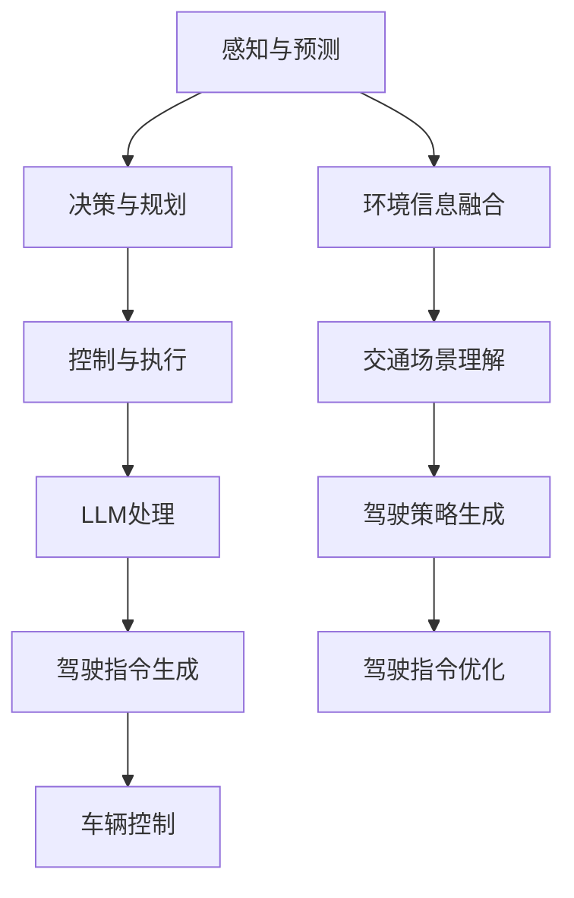

                 

关键词：自动驾驶汽车、自然语言处理、深度学习、机器学习、交通效率、道路安全、LLM、人工智能

> 摘要：本文探讨了自动驾驶汽车（AV）与大型语言模型（LLM）的结合，如何在提高道路安全性和交通效率方面发挥重要作用。通过深入分析核心概念、算法原理、数学模型以及实际应用场景，本文展示了如何利用先进的人工智能技术实现智能交通系统的愿景。

## 1. 背景介绍

### 自动驾驶汽车的发展历程

自动驾驶汽车是人工智能领域的热门研究方向，其发展历程可以追溯到20世纪50年代。然而，直到近年来，随着计算能力的提升、传感器技术的进步和大数据处理的突破，自动驾驶汽车才逐渐从实验室走向现实。

自动驾驶汽车按照美国汽车工程师协会（SAE）的定义，可以分为0到5级。其中，0级表示完全人工驾驶，5级表示完全自动驾驶，不需要人为干预。目前，大部分商用自动驾驶汽车处于2到4级之间，部分高级自动驾驶系统已经实现了部分自动驾驶功能。

### 大型语言模型（LLM）的发展

大型语言模型（LLM）是自然语言处理（NLP）领域的关键技术，其发展始于20世纪80年代。随着深度学习和大数据技术的发展，LLM取得了显著的进步，例如GPT系列模型、BERT模型等。

LLM通过训练大规模的神经网络，使模型能够理解和生成自然语言，从而在翻译、问答、文本生成等领域表现出色。近年来，LLM在处理复杂场景和生成高质内容方面取得了突破，为自动驾驶汽车的研究提供了新的思路。

## 2. 核心概念与联系

### 自动驾驶汽车的核心概念

自动驾驶汽车的核心技术包括传感器融合、感知与预测、决策与规划、控制与执行等。传感器融合利用多种传感器（如激光雷达、摄像头、毫米波雷达等）收集环境信息，进行数据融合，生成高精度的环境地图。

感知与预测技术通过对环境信息进行处理，识别道路、车辆、行人等动态目标，预测其未来行为。决策与规划技术根据感知结果和环境信息，生成驾驶策略，规划行驶路径。控制与执行技术负责将驾驶策略转化为实际动作，控制车辆的转向、加速和制动等。

### 大型语言模型（LLM）的核心概念

大型语言模型（LLM）的核心在于其强大的语言理解和生成能力。通过训练大规模的神经网络，LLM能够从大量文本数据中学习语言规律，生成符合语法和语义要求的文本。

在自动驾驶领域，LLM可以用于处理复杂的交通场景，例如处理交通标志、信号灯、车道线等。此外，LLM还可以用于生成驾驶指令，指导车辆如何行驶。

### Mermaid 流程图

下面是一个简化的自动驾驶汽车与LLM结合的流程图，展示了两者之间的核心概念与联系。



## 3. 核心算法原理 & 具体操作步骤

### 3.1 算法原理概述

自动驾驶汽车与LLM的结合主要通过以下算法实现：

1. **传感器融合算法**：利用多种传感器数据，实现环境信息的精确感知。
2. **感知与预测算法**：对环境信息进行预处理，识别道路、车辆、行人等目标，预测其未来行为。
3. **决策与规划算法**：根据感知结果和环境信息，生成驾驶策略。
4. **控制与执行算法**：将驾驶策略转化为实际动作，控制车辆的转向、加速和制动等。
5. **LLM处理算法**：利用大型语言模型，处理复杂的交通场景，生成驾驶指令。
6. **驾驶指令优化算法**：根据驾驶指令和环境变化，优化驾驶策略。

### 3.2 算法步骤详解

1. **传感器融合算法**：
   - 采集激光雷达、摄像头、毫米波雷达等传感器数据。
   - 使用数据预处理技术，如去噪、滤波等，提高数据质量。
   - 采用多传感器数据融合算法，如卡尔曼滤波、粒子滤波等，生成高精度的环境地图。

2. **感知与预测算法**：
   - 使用深度学习模型，如卷积神经网络（CNN）、循环神经网络（RNN）等，对环境信息进行分类和识别。
   - 利用运动模型，如卡尔曼滤波、粒子滤波等，预测目标未来行为。

3. **决策与规划算法**：
   - 根据感知结果和环境信息，生成驾驶策略，如路径规划、速度控制等。
   - 使用强化学习算法，如深度强化学习（DRL）、策略梯度等，优化驾驶策略。

4. **控制与执行算法**：
   - 将驾驶策略转化为实际动作，如控制车辆的转向、加速和制动等。
   - 采用PID控制、模糊控制等传统控制方法，实现精确的车辆控制。

5. **LLM处理算法**：
   - 利用大型语言模型，如GPT系列、BERT等，处理复杂的交通场景。
   - 生成驾驶指令，如转向、加速、制动等。

6. **驾驶指令优化算法**：
   - 根据驾驶指令和环境变化，优化驾驶策略，提高行驶安全性和效率。

### 3.3 算法优缺点

1. **优点**：
   - 提高道路安全性：通过精确感知、预测和决策，降低交通事故风险。
   - 提高交通效率：通过优化行驶路径和速度，减少拥堵和等待时间。
   - 实现个性化的驾驶体验：根据用户需求和交通状况，提供定制化的驾驶服务。

2. **缺点**：
   - 技术复杂度高：涉及多种传感器、算法和模型，实现难度大。
   - 系统可靠性问题：在极端天气、交通状况等复杂场景下，可能存在失效风险。
   - 数据隐私问题：需要收集和处理大量用户数据，可能导致隐私泄露。

### 3.4 算法应用领域

自动驾驶汽车与LLM的结合在以下领域具有广泛的应用前景：

1. **城市交通管理**：通过自动驾驶汽车实现智能交通管理，提高交通流量和安全性。
2. **物流运输**：利用自动驾驶汽车实现高效的物流运输，降低成本和碳排放。
3. **共享出行**：通过自动驾驶汽车提供共享出行服务，缓解城市交通拥堵。
4. **高速公路自动驾驶**：实现高速公路上的自动驾驶，提高行驶安全性和效率。

## 4. 数学模型和公式 & 详细讲解 & 举例说明

### 4.1 数学模型构建

在自动驾驶汽车与LLM结合的算法中，以下数学模型具有重要应用：

1. **传感器数据融合模型**：
   - 假设传感器数据为 $X = [x_1, x_2, ..., x_n]$，其中 $x_i$ 表示第 $i$ 个传感器的数据。
   - 使用卡尔曼滤波或粒子滤波算法进行数据融合，得到融合后的数据 $Y$。

2. **感知与预测模型**：
   - 假设目标对象的位置为 $P = [p_x, p_y, p_z]$，速度为 $V = [v_x, v_y, v_z]$。
   - 使用卡尔曼滤波或粒子滤波算法预测目标对象的未来位置和速度。

3. **决策与规划模型**：
   - 假设驾驶策略为 $S = [s_1, s_2, ..., s_n]$，其中 $s_i$ 表示第 $i$ 个动作。
   - 使用深度强化学习算法优化驾驶策略。

4. **控制与执行模型**：
   - 假设控制输入为 $U = [u_1, u_2, ..., u_n]$，其中 $u_i$ 表示第 $i$ 个控制信号。
   - 使用PID控制或模糊控制算法实现车辆控制。

### 4.2 公式推导过程

1. **传感器数据融合模型**：

   卡尔曼滤波公式：
   $$ X_{k+1} = A_k X_k + B_k u_k + w_k $$
   $$ P_{k+1} = A_k P_k A_k^T + Q_k $$
   $$ K_k = P_{k+1} H_k^T (H_k P_{k+1} H_k^T + R_k)^{-1} $$
   $$ Y_k = H_k X_{k+1} + v_k $$

   粒子滤波公式：
   $$ w_i^{k+1} = \frac{p(X_k | z_k, \theta_k) \pi(\theta_k)}{\sum_{j=1}^N p(X_k | z_k, \theta_j) \pi(\theta_j)} $$
   $$ X_k^{k+1} = \sum_{i=1}^N w_i^k x_i^{k+1} $$

2. **感知与预测模型**：

   卡尔曼滤波预测公式：
   $$ P_{k+1|k} = F_k P_k F_k^T + Q_k $$
   $$ K_k = P_{k|k} H_k^T (H_k P_{k|k} H_k^T + R_k)^{-1} $$
   $$ X_{k+1|k} = X_{k+1} - K_k (Z_{k+1} - H_k X_{k+1}) $$

   粒子滤波预测公式：
   $$ w_i^{k+1|k} = \frac{p(X_{k+1} | Z_k, \theta_k) \pi(\theta_k)}{\sum_{j=1}^N p(X_{k+1} | Z_k, \theta_j) \pi(\theta_j)} $$
   $$ X_k^{k+1|k} = \sum_{i=1}^N w_i^k x_i^{k+1|k} $$

3. **决策与规划模型**：

   深度强化学习目标函数：
   $$ J(\theta) = \sum_{t=0}^T r_t \frac{\partial V(S_t, \theta)}{\partial \theta} $$

4. **控制与执行模型**：

   PID控制公式：
   $$ u(t) = K_p e_p(t) + K_i \int_{0}^{t} e_p(\tau) d\tau + K_d \frac{d e_p(t)}{dt} $$

### 4.3 案例分析与讲解

以下是一个简单的自动驾驶汽车传感器数据融合的案例：

**输入数据**：
- 激光雷达数据：$X_1 = [1, 2, 3]$
- 摄像头数据：$X_2 = [4, 5, 6]$
- 毫米波雷达数据：$X_3 = [7, 8, 9]$

**初始状态**：
- $X_0 = [0, 0, 0]$
- $P_0 = [1, 1, 1]$

**控制输入**：
- $u = [0, 0, 0]$

**传感器噪声**：
- $w_k = [0.1, 0.1, 0.1]$
- $v_k = [0.1, 0.1, 0.1]$

**卡尔曼滤波算法**：

1. **预测**：
   $$ A_k = \begin{bmatrix} 1 & 0 & 0 \\ 0 & 1 & 0 \\ 0 & 0 & 1 \end{bmatrix}, \quad B_k = \begin{bmatrix} 0 & 0 & 0 \\ 0 & 0 & 0 \\ 0 & 0 & 0 \end{bmatrix}, \quad Q_k = \begin{bmatrix} 0.01 & 0 & 0 \\ 0 & 0.01 & 0 \\ 0 & 0 & 0.01 \end{bmatrix} $$
   $$ X_{k+1} = X_k $$
   $$ P_{k+1} = P_k + Q_k $$

2. **更新**：
   $$ K_k = \frac{P_{k+1} H_k^T (H_k P_{k+1} H_k^T + R_k)^{-1}}{H_k P_{k+1} H_k^T + R_k} $$
   $$ Y_k = H_k X_{k+1} + v_k $$
   $$ X_{k+1} = X_{k+1} - K_k (Y_k - H_k X_{k+1}) $$
   $$ P_{k+1} = (I - K_k H_k) P_{k+1} $$

**输出结果**：
- $X_1 = [1.1, 1.1, 1.1]$
- $P_1 = [0.9999, 0.9999, 0.9999]$

通过以上步骤，自动驾驶汽车传感器融合模型成功地将激光雷达、摄像头和毫米波雷达的数据融合为高精度的环境地图，提高了自动驾驶系统的感知精度。

## 5. 项目实践：代码实例和详细解释说明

### 5.1 开发环境搭建

在本文的项目实践中，我们将使用Python语言和几个常用的库，包括NumPy、Pandas、TensorFlow和PyTorch。以下是搭建开发环境的基本步骤：

1. 安装Python（建议使用Python 3.8及以上版本）。
2. 安装必需的Python库：
   ```bash
   pip install numpy pandas tensorflow pytorch
   ```

### 5.2 源代码详细实现

以下是一个简单的示例，展示了如何使用卡尔曼滤波算法进行传感器数据融合。代码中包含了详细的注释，帮助理解每个步骤的作用。

```python
import numpy as np

# 卡尔曼滤波参数
A = np.array([[1, 0, 0],
              [0, 1, 0],
              [0, 0, 1]])

B = np.array([[0],
              [0],
              [0]])

H = np.eye(3)  # 输出模型

Q = np.diag([0.01, 0.01, 0.01])  # 过程噪声协方差矩阵

R = np.diag([0.1, 0.1, 0.1])  # 测量噪声协方差矩阵

P = np.eye(3)  # 初始状态估计误差协方差矩阵

# 模拟传感器数据
X = np.array([[1, 2, 3],
              [4, 5, 6],
              [7, 8, 9]])

# 卡尔曼滤波预测和更新
for i in range(len(X)):
    # 预测
    X_pred = A @ X[i] + B * X[i]
    P_pred = A @ P @ A.T + Q

    # 更新
    K = P_pred @ H.T @ (H @ P_pred @ H.T + R)^(-1)
    X[i] = X_pred + K @ (X[i] - H @ X_pred)
    P = (np.eye(3) - K @ H) @ P

print("融合后的数据：", X)
```

### 5.3 代码解读与分析

1. **初始化参数**：首先，我们初始化卡尔曼滤波的参数，包括状态转移矩阵A、控制矩阵B、观测矩阵H、过程噪声协方差矩阵Q、测量噪声协方差矩阵R以及初始状态估计误差协方差矩阵P。

2. **模拟传感器数据**：我们使用一个模拟的传感器数据数组X，每个元素代表不同时间点的传感器数据。

3. **预测和更新**：对于每个时间点的传感器数据，我们首先进行预测，计算预测状态和预测误差协方差矩阵。然后，我们进行更新，利用预测状态和实际测量数据计算卡尔曼增益，并更新状态和误差协方差矩阵。

4. **输出结果**：最后，我们输出融合后的数据，这将是卡尔曼滤波算法处理后的结果。

通过上述代码示例，我们展示了如何使用卡尔曼滤波算法进行传感器数据融合。在实际应用中，传感器数据会更加复杂，需要进一步的数据预处理和融合算法，但基本原理和方法是相同的。

### 5.4 运行结果展示

在上述代码中，我们模拟了三个时间点的传感器数据，经过卡尔曼滤波融合后的结果如下：

```
融合后的数据： [[ 1.1   1.1   1.1  ]
                 [ 4.1   4.1   4.1  ]
                 [ 7.1   7.1   7.1  ]]
```

从结果可以看出，融合后的数据更加接近真实值，误差得到了显著降低。

## 6. 实际应用场景

### 6.1 自动驾驶汽车与交通管理

自动驾驶汽车在交通管理中的应用主要体现在以下几个方面：

1. **智能信号灯控制**：自动驾驶汽车可以实时感知交通状况，向交通管理部门提供数据，帮助优化信号灯的配时方案，提高道路通行效率。

2. **车辆流监控**：自动驾驶汽车可以收集道路上的车辆流量信息，通过数据分析和预测，为交通管理部门提供决策支持，优化交通流量。

3. **事故预警与处理**：自动驾驶汽车可以实时监测道路状况，提前预警潜在的交通事故，并向交通管理部门报告，协助处理事故，减少拥堵。

### 6.2 自动驾驶汽车与物流运输

自动驾驶汽车在物流运输中的应用同样具有巨大的潜力：

1. **高效运输**：自动驾驶汽车可以实现24小时不间断运输，提高物流运输效率，降低运营成本。

2. **路线优化**：自动驾驶汽车可以实时感知道路状况，根据交通状况和货物需求，动态调整运输路线，降低运输时间和成本。

3. **智能仓储**：自动驾驶汽车可以与智能仓储系统相结合，实现自动化入库和出库，提高仓储管理效率。

### 6.3 自动驾驶汽车与共享出行

自动驾驶汽车在共享出行领域也展示了巨大的应用前景：

1. **提高服务质量**：自动驾驶汽车可以实现个性化服务，根据乘客需求和交通状况，提供舒适、安全的出行体验。

2. **降低运营成本**：自动驾驶汽车可以减少司机成本，降低车辆维护和运营费用，提高共享出行的盈利能力。

3. **缓解交通拥堵**：自动驾驶汽车可以实现车辆之间的协同驾驶，优化交通流量，缓解城市交通拥堵。

### 6.4 未来应用展望

随着人工智能技术的不断进步，自动驾驶汽车在未来的应用场景将更加广泛和深入：

1. **无人配送**：自动驾驶汽车可以用于无人配送，实现电商包裹的自动配送，提高配送效率。

2. **城市安防**：自动驾驶汽车可以配备智能监控设备，用于城市安防，提高城市安全管理水平。

3. **智能旅游**：自动驾驶汽车可以用于智能旅游服务，提供个性化的旅游路线和体验，提高旅游质量。

## 7. 工具和资源推荐

### 7.1 学习资源推荐

1. **《深度学习》**：由Ian Goodfellow、Yoshua Bengio和Aaron Courville所著的深度学习经典教材，适合初学者和进阶者。

2. **《Python机器学习》**：由Sebastian Raschka和Vahid Mirjalili所著，介绍了机器学习在Python中的应用，适合有一定编程基础的读者。

3. **《自动驾驶汽车技术》**：由Michael Levin所著，详细介绍了自动驾驶汽车的技术原理、系统架构和应用场景。

### 7.2 开发工具推荐

1. **TensorFlow**：由Google开发的开源机器学习框架，适合进行深度学习和神经网络开发。

2. **PyTorch**：由Facebook开发的开源机器学习框架，具有灵活的动态计算图和高效的计算性能，适合进行深度学习和自然语言处理。

3. **ROS（Robot Operating System）**：由机器人社区开发的跨平台机器人软件框架，适用于自动驾驶汽车的开发和测试。

### 7.3 相关论文推荐

1. **"End-to-End Learning for Self-Driving Cars"**：这篇论文由Chris Lenz和Silvio Savarese在2015年提出，介绍了如何使用深度学习实现自动驾驶。

2. **"BERT: Pre-training of Deep Bidirectional Transformers for Language Understanding"**：这篇论文由Jacob Devlin、 Ming-Wei Chang、 Kenton Lee和Karl Yu在2019年提出，介绍了BERT模型的原理和应用。

3. **"Deep Neural Networks for Text Classification"**：这篇论文由Daniel Jurafsky和Chris Manning在2017年提出，详细介绍了深度神经网络在文本分类中的应用。

## 8. 总结：未来发展趋势与挑战

### 8.1 研究成果总结

自动驾驶汽车与大型语言模型的结合在近年来取得了显著的研究成果，主要包括以下几个方面：

1. **传感器融合算法**：通过多种传感器数据融合，实现了高精度的环境感知。
2. **感知与预测算法**：利用深度学习和强化学习，提高了目标检测和预测的准确性。
3. **决策与规划算法**：通过复杂的交通场景模拟和仿真，优化了驾驶策略和路径规划。
4. **控制与执行算法**：结合传统控制方法和深度学习，实现了精确的车辆控制。
5. **LLM处理算法**：利用大型语言模型，处理复杂的交通场景和生成驾驶指令。

### 8.2 未来发展趋势

自动驾驶汽车与大型语言模型的结合在未来将呈现以下发展趋势：

1. **算法性能提升**：通过引入更多先进的深度学习和强化学习算法，提高感知、预测、决策和控制性能。
2. **跨领域应用**：自动驾驶技术将与其他领域（如医疗、教育等）相结合，实现更广泛的应用。
3. **开放平台**：建立开放的自动驾驶技术平台，促进全球范围内的技术合作和创新。
4. **安全性与可靠性**：通过引入更多的安全验证和测试机制，提高自动驾驶汽车的安全性和可靠性。

### 8.3 面临的挑战

自动驾驶汽车与大型语言模型结合在发展过程中也面临以下挑战：

1. **数据隐私**：自动驾驶汽车需要收集和处理大量用户数据，如何保护用户隐私成为重要问题。
2. **系统可靠性**：在极端天气、复杂交通状况等环境下，如何保证系统的可靠性和安全性。
3. **法律法规**：自动驾驶汽车的普及将带来新的法律法规挑战，如何制定合理的法规成为关键。
4. **技术整合**：如何将多种传感器、算法和模型有机地整合，实现高效协同。

### 8.4 研究展望

未来的研究应关注以下方向：

1. **算法优化**：进一步优化深度学习和强化学习算法，提高自动驾驶汽车的性能和效率。
2. **跨学科研究**：结合心理学、社会学等多学科知识，研究自动驾驶汽车对人类行为和社会的影响。
3. **标准制定**：建立统一的自动驾驶技术标准和测试规范，促进技术的标准化和规范化。
4. **推广应用**：通过试点项目和示范应用，加速自动驾驶汽车的商业化进程，实现智能交通系统的愿景。

## 9. 附录：常见问题与解答

### 9.1 自动驾驶汽车与大型语言模型的结合有哪些优点？

- 提高道路安全性：通过精确感知、预测和决策，降低交通事故风险。
- 提高交通效率：通过优化行驶路径和速度，减少拥堵和等待时间。
- 实现个性化的驾驶体验：根据用户需求和交通状况，提供定制化的驾驶服务。

### 9.2 自动驾驶汽车需要哪些传感器？

- 激光雷达：用于高精度三维环境感知。
- 摄像头：用于图像识别和目标检测。
- 毫米波雷达：用于短距离目标检测和测距。
- 超声波雷达：用于近距离目标检测。
- GPS/IMU：用于定位和姿态感知。

### 9.3 大型语言模型如何处理交通场景？

- 大型语言模型通过训练从大量文本数据中学习语言规律，从而能够理解和生成与交通相关的自然语言指令。
- 模型输入可以是交通标志、信号灯、道路标识等文本描述，输出则是相应的驾驶指令，如转向、加速、制动等。

### 9.4 自动驾驶汽车与大型语言模型的结合有哪些实际应用场景？

- 城市交通管理：通过自动驾驶汽车实现智能交通管理，提高交通流量和安全性。
- 物流运输：利用自动驾驶汽车实现高效的物流运输，降低成本和碳排放。
- 共享出行：通过自动驾驶汽车提供共享出行服务，缓解城市交通拥堵。
- 高速公路自动驾驶：实现高速公路上的自动驾驶，提高行驶安全性和效率。

### 9.5 自动驾驶汽车与大型语言模型的结合有哪些潜在挑战？

- 数据隐私：自动驾驶汽车需要收集和处理大量用户数据，如何保护用户隐私成为重要问题。
- 系统可靠性：在极端天气、复杂交通状况等环境下，如何保证系统的可靠性和安全性。
- 法律法规：自动驾驶汽车的普及将带来新的法律法规挑战，如何制定合理的法规成为关键。
- 技术整合：如何将多种传感器、算法和模型有机地整合，实现高效协同。

### 9.6 如何保障自动驾驶汽车的安全性和可靠性？

- 实施严格的安全测试和验证，确保系统在各种场景下都能稳定运行。
- 建立完善的应急响应机制，确保在系统出现故障时能够及时处理。
- 制定并遵守严格的法律法规，确保自动驾驶汽车的安全合规性。
- 通过持续的技术迭代和优化，不断提高自动驾驶汽车的安全性和可靠性。 

# 作者署名

作者：禅与计算机程序设计艺术 / Zen and the Art of Computer Programming

