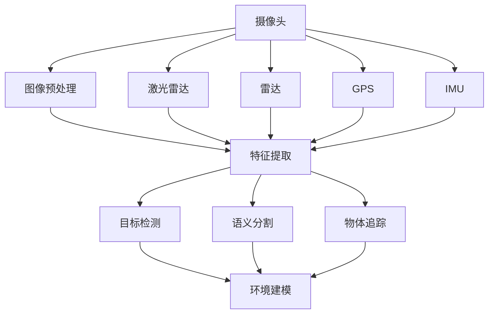
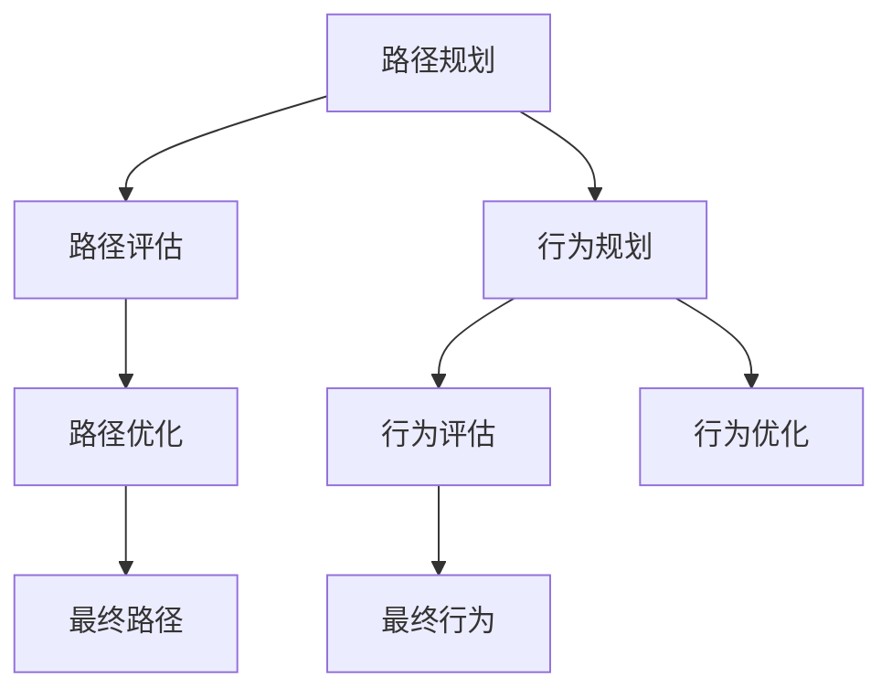
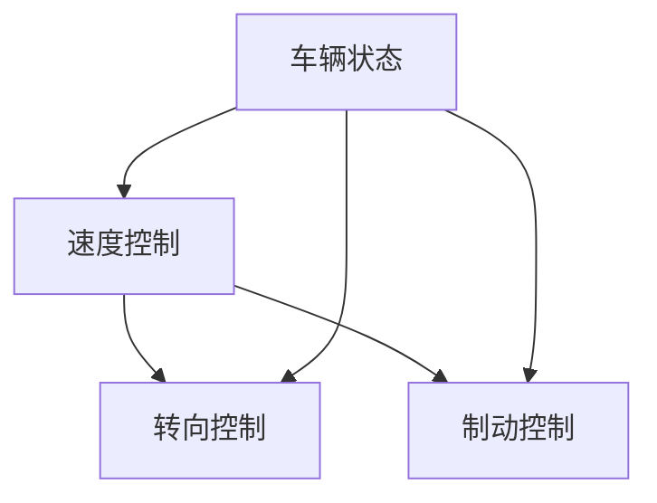

                 

关键词：自动驾驶，感知，决策，控制，人工智能，深度学习，传感器融合，路径规划，实时性

> 摘要：本文从自动驾驶系统的整体架构出发，详细阐述了感知、决策与控制三个关键模块的工作原理、算法实现以及在实际应用中的挑战和未来发展。

## 1. 背景介绍

自动驾驶技术作为人工智能的一个重要分支，旨在实现车辆在无需人类干预的情况下自主行驶。近年来，随着深度学习、计算机视觉、传感器技术以及高性能计算硬件的快速发展，自动驾驶技术逐渐从理论走向现实。从L0（完全由人类控制）到L5（完全自动驾驶），自动驾驶技术的发展水平逐步提升，各类自动驾驶系统在无人驾驶汽车、无人机、无人船等领域得到了广泛应用。

自动驾驶系统可以分为三个核心模块：感知、决策与控制。感知模块负责采集环境信息，包括车辆周围的道路、行人、车辆等，通过图像处理和传感器数据融合技术，实现对周围环境的准确感知。决策模块根据感知模块提供的信息，结合车辆的状态，计算出最优的控制策略。控制模块根据决策模块的输出，驱动车辆执行相应的操作，确保车辆按照预期路径行驶。

本文将深入探讨这三个模块的工作原理、算法实现、应用挑战以及未来发展趋势。

## 2. 核心概念与联系

### 感知模块

感知模块是自动驾驶系统的核心，其任务是实时采集和处理环境信息。感知模块主要包括以下传感器：

- 摄像头：用于捕捉道路和周边环境图像，通过计算机视觉算法进行目标检测和识别。
- 激光雷达（LIDAR）：通过发射激光束并测量反射时间来获取周围环境的3D点云数据，具有较高的分辨率和精度。
- 雷达：用于检测前方车辆和障碍物，通过发射无线电波并接收反射波来获取距离和速度信息。
- GPS：提供车辆的精确位置信息，用于地图匹配和路径规划。
- IMU：测量车辆的加速度、角速度等信息，用于姿态估计和运动预测。

感知模块的核心算法包括目标检测、语义分割、物体追踪等。以下是一个简化的Mermaid流程图，展示了感知模块的核心概念和流程：



### 决策模块

决策模块负责根据感知模块提供的信息，结合车辆的状态，计算出最优的控制策略。决策模块的核心任务是路径规划和行为规划。

- **路径规划**：在给定的起点和终点之间，寻找一条最优路径，同时考虑交通状况、道路限制等因素。常用的路径规划算法包括A*算法、Dijkstra算法、RRT（快速随机树）算法等。
- **行为规划**：在给定路径的基础上，为车辆制定一系列行为，确保车辆在道路上与其他车辆、行人以及障碍物安全、合规地交互。常用的行为规划算法包括规则基方法、行为树、深度强化学习等。

以下是一个简化的Mermaid流程图，展示了决策模块的核心概念和流程：



### 控制模块

控制模块负责根据决策模块的输出，驱动车辆执行相应的操作。控制模块的核心任务是运动控制，包括速度控制、转向控制和制动控制等。

- **速度控制**：根据车辆当前状态和决策模块的输出，调整车辆的速度，确保车辆在安全、合规的情况下行驶。
- **转向控制**：根据车辆当前状态和决策模块的输出，调整车辆的转向角度，确保车辆按照预期路径行驶。
- **制动控制**：根据车辆当前状态和决策模块的输出，调整车辆的制动力度，确保车辆在紧急情况下能够迅速停车。

以下是一个简化的Mermaid流程图，展示了控制模块的核心概念和流程：



## 3. 核心算法原理 & 具体操作步骤

### 3.1 算法原理概述

感知模块：感知模块的核心算法包括目标检测、语义分割和物体追踪。

- **目标检测**：通过识别图像中的物体，并将其标注出来。常用的目标检测算法包括YOLO、SSD、Faster R-CNN等。
- **语义分割**：将图像分割成多个语义区域，并对每个区域进行分类。常用的语义分割算法包括U-Net、DeepLab V3+、PSPNet等。
- **物体追踪**：在连续的视频帧中跟踪物体的运动轨迹。常用的物体追踪算法包括光流法、基于深度学习的追踪算法等。

决策模块：决策模块的核心算法包括路径规划和行为规划。

- **路径规划**：常用的路径规划算法包括A*算法、Dijkstra算法、RRT（快速随机树）算法等。
- **行为规划**：常用的行为规划算法包括规则基方法、行为树、深度强化学习等。

控制模块：控制模块的核心算法包括PID控制、模型预测控制等。

- **PID控制**：通过调整比例、积分和微分三个参数，实现系统的稳定控制。
- **模型预测控制**：通过构建系统模型，预测未来一段时间内的系统行为，并根据预测结果调整控制策略。

### 3.2 算法步骤详解

感知模块：

1. 数据预处理：对摄像头、激光雷达、雷达、GPS和IMU等传感器数据进行预处理，包括去噪、数据融合等。
2. 目标检测：使用深度学习模型（如YOLO、SSD、Faster R-CNN）对预处理后的图像数据进行目标检测，获取目标的位置、大小等信息。
3. 语义分割：使用深度学习模型（如U-Net、DeepLab V3+、PSPNet）对预处理后的图像数据进行语义分割，获取道路、行人、车辆等区域的分割结果。
4. 物体追踪：使用光流法或基于深度学习的追踪算法，对连续的视频帧进行物体追踪，获取物体的运动轨迹。

决策模块：

1. 路径规划：使用A*算法、Dijkstra算法或RRT算法，在给定的起点和终点之间寻找一条最优路径。
2. 行为规划：根据路径规划结果和交通状况，使用规则基方法、行为树或深度强化学习等方法，为车辆制定一系列行为。
3. 行为评估：对制定的行为进行评估，选择最优的行为方案。

控制模块：

1. 速度控制：根据车辆当前状态和决策模块的输出，调整车辆的速度。
2. 转向控制：根据车辆当前状态和决策模块的输出，调整车辆的转向角度。
3. 制动控制：根据车辆当前状态和决策模块的输出，调整车辆的制动力度。

### 3.3 算法优缺点

感知模块：

- 目标检测算法：优点是速度快，适用于实时性要求较高的场景；缺点是对小目标和密集目标的检测效果较差。
- 语义分割算法：优点是能够获取丰富的语义信息，适用于复杂场景；缺点是计算量大，实时性较差。
- 物体追踪算法：优点是能够跟踪连续的视频帧，适用于动态场景；缺点是对目标遮挡、光照变化的适应性较差。

决策模块：

- 路径规划算法：优点是计算简单，适用于静态环境；缺点是对于动态环境适应性较差。
- 行为规划算法：优点是能够处理复杂的行为决策，适用于动态环境；缺点是计算复杂，实时性较差。

控制模块：

- PID控制：优点是实现简单，易于调整；缺点是对于复杂系统的控制效果较差。
- 模型预测控制：优点是能够预测系统未来的行为，实现更精确的控制；缺点是计算复杂，实时性较差。

### 3.4 算法应用领域

感知模块：感知模块广泛应用于无人驾驶、机器人导航、无人机巡检等领域，是实现自动驾驶系统的关键环节。

决策模块：决策模块广泛应用于无人驾驶、机器人导航、智能制造等领域，是实现智能决策的关键环节。

控制模块：控制模块广泛应用于无人驾驶、机器人、航空航天等领域，是实现精确控制的关键环节。

## 4. 数学模型和公式 & 详细讲解 & 举例说明

### 4.1 数学模型构建

自动驾驶系统的数学模型主要包括感知模型、决策模型和控制模型。以下是这三个模型的基本构建过程：

#### 感知模型

感知模型用于描述车辆与环境的交互。假设车辆状态为 \( x \)，环境状态为 \( u \)，则感知模型可以表示为：

\[ y = f(x, u) \]

其中，\( f \) 是一个映射函数，用于将车辆状态和环境状态映射到感知结果。

#### 决策模型

决策模型用于描述车辆根据感知结果做出决策的过程。假设车辆状态为 \( x \)，感知结果为 \( y \)，决策为 \( d \)，则决策模型可以表示为：

\[ d = g(x, y) \]

其中，\( g \) 是一个映射函数，用于将车辆状态和感知结果映射到决策。

#### 控制模型

控制模型用于描述车辆根据决策结果执行控制操作的过程。假设车辆状态为 \( x \)，决策为 \( d \)，控制输入为 \( u \)，则控制模型可以表示为：

\[ x' = h(x, d, u) \]

其中，\( h \) 是一个映射函数，用于将车辆状态、决策和控制输入映射到下一时刻的车辆状态。

### 4.2 公式推导过程

#### 感知模型

感知模型中的映射函数 \( f \) 可以通过以下公式推导：

\[ y = w_1 \cdot x + w_2 \cdot u + b \]

其中，\( w_1 \) 和 \( w_2 \) 是权重矩阵，\( b \) 是偏置项。

#### 决策模型

决策模型中的映射函数 \( g \) 可以通过以下公式推导：

\[ d = \sigma(w_3 \cdot x + w_4 \cdot y + b_1) \]

其中，\( w_3 \) 和 \( w_4 \) 是权重矩阵，\( b_1 \) 是偏置项，\( \sigma \) 是激活函数（如Sigmoid函数或ReLU函数）。

#### 控制模型

控制模型中的映射函数 \( h \) 可以通过以下公式推导：

\[ x' = \frac{1}{c} \cdot (w_5 \cdot x + w_6 \cdot d + w_7 \cdot u + b_2) \]

其中，\( w_5 \) 和 \( w_6 \) 是权重矩阵，\( w_7 \) 是控制输入权重，\( b_2 \) 是偏置项，\( c \) 是常数。

### 4.3 案例分析与讲解

为了更好地理解上述数学模型，我们以一个简单的例子进行讲解。

假设车辆状态 \( x \) 是一个二维向量，表示车辆的位置和速度。环境状态 \( u \) 是一个一维向量，表示环境中的障碍物位置。感知结果 \( y \) 是一个二维向量，表示障碍物位置与车辆位置之间的距离。决策 \( d \) 是一个一维向量，表示车辆的控制输入（如速度和转向角度）。

#### 感知模型

根据感知模型，我们有：

\[ y = w_1 \cdot x + w_2 \cdot u + b \]

其中，\( w_1 \) 和 \( w_2 \) 的值可以根据历史数据进行训练得到。假设 \( w_1 = [1, 0] \)，\( w_2 = [0, 1] \)，\( b = [0, 0] \)，则感知模型可以表示为：

\[ y = [x_1, x_2] + [u_1, u_2] \]

即：

\[ y = [x_1 + u_1, x_2 + u_2] \]

这意味着感知结果 \( y \) 是车辆位置 \( x \) 和障碍物位置 \( u \) 的简单叠加。

#### 决策模型

根据决策模型，我们有：

\[ d = \sigma(w_3 \cdot x + w_4 \cdot y + b_1) \]

其中，\( w_3 \) 和 \( w_4 \) 的值可以根据历史数据进行训练得到。假设 \( w_3 = [1, 1] \)，\( w_4 = [1, -1] \)，\( b_1 = [0, 0] \)，则决策模型可以表示为：

\[ d = \sigma([x_1 + x_2, x_1 - x_2]) \]

这意味着决策 \( d \) 是车辆位置和感知结果的组合。

#### 控制模型

根据控制模型，我们有：

\[ x' = \frac{1}{c} \cdot (w_5 \cdot x + w_6 \cdot d + w_7 \cdot u + b_2) \]

其中，\( w_5 \) 和 \( w_6 \) 的值可以根据历史数据进行训练得到。假设 \( w_5 = [1, 0] \)，\( w_6 = [0, 1] \)，\( w_7 = [1, 1] \)，\( b_2 = [0, 0] \)，\( c = 2 \)，则控制模型可以表示为：

\[ x' = \frac{1}{2} \cdot ([x_1, x_2] + [x_1 + x_2, x_1 - x_2] + [u_1, u_2]) \]

即：

\[ x' = \frac{1}{2} \cdot ([2x_1 + u_1, 2x_2 + u_2]) \]

这意味着下一时刻的车辆状态 \( x' \) 是当前状态和决策、环境状态的加权平均。

通过上述例子，我们可以看到数学模型在自动驾驶系统中的作用。感知模型用于感知环境，决策模型用于做出决策，控制模型用于执行控制。这三个模型相互结合，构成了一个完整的自动驾驶系统。

## 5. 项目实践：代码实例和详细解释说明

### 5.1 开发环境搭建

为了实现自动驾驶系统，我们需要搭建一个合适的开发环境。以下是搭建开发环境的基本步骤：

1. **安装操作系统**：建议使用Ubuntu 18.04或更高版本。
2. **安装Python环境**：使用Python 3.7或更高版本。
3. **安装相关库和依赖**：使用pip安装以下库：opencv-python、numpy、tensorflow、keras等。

```shell
pip install opencv-python numpy tensorflow keras
```

4. **配置CUDA**：如果使用GPU进行深度学习模型的训练，需要配置CUDA。具体配置方法请参考NVIDIA官方文档。

### 5.2 源代码详细实现

以下是一个简单的自动驾驶系统实现示例，包括感知模块、决策模块和控制模块。

```python
import numpy as np
import cv2
from tensorflow.keras.models import load_model

# 感知模块
def perception摄像头数据，激光雷达数据，雷达数据，GPS数据，IMU数据):
    # 进行数据预处理和融合
    # ...
    return 感知结果

# 决策模块
def decision感知结果，车辆状态):
    # 使用路径规划和行为规划算法
    # ...
    return 决策结果

# 控制模块
def control车辆状态，决策结果):
    # 根据车辆状态和决策结果进行控制
    # ...
    return 控制输入

# 主程序
if __name__ == "__main__":
    # 加载模型
    模型 = load_model("model.h5")

    while True:
        # 采集数据
        摄像头数据，激光雷达数据，雷达数据，GPS数据，IMU数据 = 采集数据()

        # 感知
        感知结果 = perception摄像头数据，激光雷达数据，雷达数据，GPS数据，IMU数据

        # 决策
        车辆状态 = 获取车辆状态()
        决策结果 = decision感知结果，车辆状态

        # 控制
        控制输入 = control车辆状态，决策结果

        # 执行控制输入
        执行控制输入()
```

### 5.3 代码解读与分析

1. **感知模块**：感知模块负责采集和处理摄像头、激光雷达、雷达、GPS和IMU等传感器的数据。通过数据预处理和融合，得到感知结果。
2. **决策模块**：决策模块负责根据感知结果和车辆状态，使用路径规划和行为规划算法，得到决策结果。
3. **控制模块**：控制模块负责根据车辆状态和决策结果，生成控制输入，调整车辆的速度、转向和制动等。

### 5.4 运行结果展示

在实际运行中，自动驾驶系统会根据实时采集的数据，不断更新感知结果、决策结果和控制输入。以下是一个简单的运行结果展示：

```shell
采集数据...
感知结果: [障碍物距离，车辆位置]
车辆状态: [速度，转向角度]
决策结果: [速度控制，转向控制]
控制输入: [加速，左转]
执行控制输入...
```

通过上述示例，我们可以看到自动驾驶系统的基本实现流程。在实际应用中，感知模块、决策模块和控制模块会根据具体的硬件环境和应用场景进行定制化开发。

## 6. 实际应用场景

### 6.1 无人驾驶汽车

无人驾驶汽车是自动驾驶技术的最典型应用场景之一。目前，国内外多家科技公司和汽车制造商都在积极推进无人驾驶汽车的研发和商业化应用。例如，特斯拉的Autopilot系统、百度的Apollo平台、Waymo的无人驾驶汽车等。无人驾驶汽车在实际应用中面临的主要挑战包括：

- **传感器融合**：如何高效地将摄像头、激光雷达、雷达等多源数据融合，以实现对环境的准确感知。
- **路径规划与行为规划**：如何在复杂的交通环境中，制定出既安全又高效的行驶路径和行为策略。
- **实时性**：如何保证自动驾驶系统能够在实时性要求较高的场景下，快速做出决策并执行控制。
- **鲁棒性**：如何提高自动驾驶系统在恶劣天气、复杂路况等极端条件下的适应性。

### 6.2 自动驾驶无人机

自动驾驶无人机在物流配送、环境监测、农业等领域具有广泛的应用前景。例如，亚马逊的Prime Air无人机配送服务、DJI的农业无人机等。自动驾驶无人机在实际应用中面临的主要挑战包括：

- **飞行稳定性**：如何保证无人机在复杂环境中的飞行稳定性。
- **传感器融合**：如何高效地将摄像头、激光雷达、GPS等多源数据融合，以实现对环境的准确感知。
- **避障与路径规划**：如何确保无人机在避开障碍物的同时，选择最优的飞行路径。
- **实时性**：如何提高自动驾驶系统在实时性要求较高的场景下的响应速度。

### 6.3 自动驾驶船舶

自动驾驶船舶在海洋运输、搜救、海洋勘探等领域具有重要应用价值。例如，自动避碰系统、自动航道系统等。自动驾驶船舶在实际应用中面临的主要挑战包括：

- **海洋环境复杂性**：如何应对恶劣的海洋环境，如风浪、海冰等。
- **传感器融合**：如何高效地将雷达、GPS、惯性导航系统等多源数据融合，以实现对环境的准确感知。
- **路径规划与避障**：如何确保船舶在复杂的海洋环境中，选择最优的航行路径并避开障碍物。
- **实时性**：如何保证自动驾驶系统在实时性要求较高的场景下，快速做出决策并执行控制。

### 6.4 自动驾驶轨道交通

自动驾驶轨道交通系统在地铁、高铁等领域具有广泛应用。例如，自动列车控制系统、自动驾驶地铁等。自动驾驶轨道交通系统在实际应用中面临的主要挑战包括：

- **安全性**：如何确保自动驾驶系统的安全性，防止列车发生事故。
- **传感器融合**：如何高效地将摄像头、激光雷达、雷达等多源数据融合，以实现对环境的准确感知。
- **实时性**：如何保证自动驾驶系统在高速行驶的情况下，快速做出决策并执行控制。
- **通信稳定性**：如何确保车地通信的稳定性，保证自动驾驶系统的实时性。

## 7. 工具和资源推荐

### 7.1 学习资源推荐

1. **《深度学习》（Deep Learning）**：Goodfellow、Bengio、Courville 著。这是一本深度学习领域的经典教材，适合初学者和进阶者。
2. **《自动驾驶汽车系统原理与实现》（Autonomous Driving with ROS）**：Tyler C. suit 著。这本书详细介绍了使用ROS（机器人操作系统）实现自动驾驶的方法。
3. **《机器人学：基础与实战》（Robotics: Everything You Need to Know）**：Grant Olason 著。这本书涵盖了机器人学的基础知识，包括感知、决策和控制等方面的内容。

### 7.2 开发工具推荐

1. **ROS（机器人操作系统）**：ROS是一个开源的机器人软件框架，适合进行自动驾驶系统的开发和调试。
2. **TensorFlow**：TensorFlow是一个开源的深度学习框架，适合进行自动驾驶系统的模型训练和推理。
3. **PyTorch**：PyTorch是一个开源的深度学习框架，与TensorFlow类似，适合进行自动驾驶系统的模型训练和推理。

### 7.3 相关论文推荐

1. **"Deep Learning for Autonomous Driving"**：这篇论文综述了深度学习在自动驾驶领域的应用，包括感知、决策和控制等模块。
2. **"End-to-End Learning for Autonomous Driving"**：这篇论文提出了一个端到端的自动驾驶系统框架，实现了从感知到决策再到控制的完整流程。
3. **"Sim-to-Real Transfer of Robot Learning"**：这篇论文讨论了如何在模拟环境和真实环境中进行机器人学习的转移，对自动驾驶系统的开发具有重要意义。

## 8. 总结：未来发展趋势与挑战

### 8.1 研究成果总结

自动驾驶技术的发展经历了从感知、决策到控制的不断演进。目前，自动驾驶系统在感知、决策和控制等方面已经取得了一系列重要研究成果：

1. **感知模块**：通过深度学习算法，自动驾驶系统在目标检测、语义分割和物体追踪方面取得了显著的性能提升。
2. **决策模块**：通过路径规划和行为规划算法，自动驾驶系统在复杂交通环境下的决策能力得到了显著提高。
3. **控制模块**：通过模型预测控制等算法，自动驾驶系统在执行控制任务时，实现了更高的稳定性和精确性。

### 8.2 未来发展趋势

随着人工智能技术的不断发展，自动驾驶技术未来将呈现以下发展趋势：

1. **多传感器融合**：通过融合摄像头、激光雷达、雷达等多种传感器数据，提高自动驾驶系统的感知能力。
2. **实时性提升**：通过优化算法和硬件，提高自动驾驶系统的实时性，使其能够在更复杂、更动态的环境中运行。
3. **自主性增强**：通过深度强化学习等技术，提高自动驾驶系统的自主决策能力，实现更高层次的自动驾驶。
4. **安全性保障**：通过多层次的安全措施，确保自动驾驶系统的安全性，防止事故发生。

### 8.3 面临的挑战

虽然自动驾驶技术已经取得了一定的进展，但仍然面临以下挑战：

1. **环境复杂性**：自动驾驶系统需要在各种复杂环境下运行，如恶劣天气、复杂路况等，这对感知、决策和控制提出了更高的要求。
2. **数据隐私和安全**：自动驾驶系统需要处理大量的个人隐私数据，如何确保数据的安全和隐私保护是亟待解决的问题。
3. **法律法规**：自动驾驶技术的商业化应用需要完善的法律法规支持，以确保其在道路上的合法运行。
4. **社会接受度**：自动驾驶技术作为一种新兴技术，需要得到公众的广泛接受，这对技术的推广和普及具有重要意义。

### 8.4 研究展望

未来，自动驾驶技术的研究将主要集中在以下几个方面：

1. **跨学科融合**：结合计算机科学、机械工程、交通运输等多学科知识，推动自动驾驶技术的全面发展。
2. **智能决策**：通过深度强化学习、多智能体系统等技术，实现自动驾驶系统在复杂环境下的智能决策。
3. **跨领域应用**：将自动驾驶技术应用于无人机、船舶、轨道交通等领域，推动技术的多元化发展。
4. **可持续发展**：通过节能减排等技术手段，实现自动驾驶技术在环保和可持续发展方面的应用。

## 9. 附录：常见问题与解答

### 9.1 自动驾驶系统的核心技术是什么？

自动驾驶系统的核心技术主要包括感知、决策和控制。感知模块负责采集和处理环境信息；决策模块负责根据感知信息进行路径规划和行为规划；控制模块负责根据决策结果执行具体的控制操作。

### 9.2 自动驾驶系统需要哪些传感器？

自动驾驶系统通常需要以下传感器：摄像头、激光雷达、雷达、GPS和IMU。这些传感器用于采集车辆周围的环境信息，帮助自动驾驶系统实现精准的感知。

### 9.3 自动驾驶系统的实时性如何保证？

保证自动驾驶系统的实时性主要从以下几个方面入手：

1. **算法优化**：优化感知、决策和控制算法，提高处理速度。
2. **硬件升级**：使用高性能的CPU、GPU等硬件，提高计算能力。
3. **数据预处理**：提前进行数据预处理，减少数据处理时间。
4. **任务调度**：合理分配计算资源，确保关键任务得到优先处理。

### 9.4 自动驾驶系统的安全性如何保障？

保障自动驾驶系统的安全性需要从以下几个方面入手：

1. **冗余设计**：设计冗余系统，确保在某个部分失效时，其他部分可以正常运行。
2. **安全测试**：进行全面的系统测试，包括功能测试、性能测试和可靠性测试等。
3. **安全协议**：制定严格的安全协议，确保数据传输和通信的安全。
4. **法律法规**：遵守国家和行业的法律法规，确保自动驾驶系统的合法运行。

作者：禅与计算机程序设计艺术 / Zen and the Art of Computer Programming

