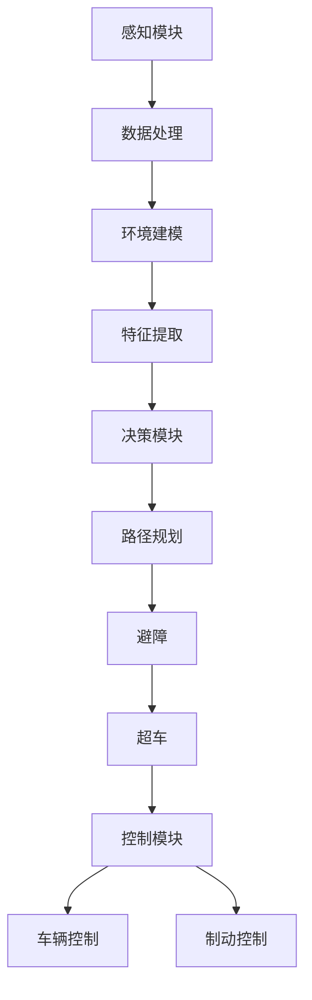

                 

关键词：自动驾驶系统、感知、决策、控制、人工智能、深度学习、数学模型、代码实例、实际应用场景、未来展望

摘要：本文将深入探讨自动驾驶系统的三大核心组成部分：感知、决策与控制。我们将介绍这些组件的工作原理，以及它们如何协同工作实现安全、高效的自动驾驶。本文还将探讨自动驾驶技术的当前状态、未来发展趋势，以及面临的关键挑战。

## 1. 背景介绍

自动驾驶系统，又称为无人驾驶系统，是人工智能领域的热点研究方向之一。自动驾驶汽车的出现，有望彻底改变人们的出行方式，提高交通效率，减少交通事故，降低环境污染。随着深度学习、计算机视觉、传感器技术等领域的飞速发展，自动驾驶技术正逐渐从理论研究走向实际应用。

自动驾驶系统可以分为三个主要模块：感知、决策与控制。感知模块负责收集外部环境信息，决策模块根据感知模块提供的信息做出驾驶决策，控制模块则根据决策结果控制车辆执行相应的操作。这三个模块紧密协作，共同实现自动驾驶。

## 2. 核心概念与联系

### 2.1 感知模块

感知模块是自动驾驶系统的“眼睛”和“耳朵”，主要负责收集车辆周围的环境信息。常用的感知技术包括激光雷达、摄像头、毫米波雷达、超声波传感器等。

- **激光雷达**：通过发射激光脉冲并测量反射回来的时间，可以获取周围环境的3D点云数据。
- **摄像头**：用于捕获周围环境的图像，通过图像处理技术可以识别道路、车辆、行人等目标。
- **毫米波雷达**：可以穿透一定程度的障碍物，获取目标物体的距离、速度等信息。
- **超声波传感器**：用于检测车辆周围的近距离物体。

### 2.2 决策模块

决策模块是自动驾驶系统的“大脑”，主要负责分析感知模块提供的信息，并生成驾驶策略。决策过程通常包括路径规划、避障、超车等。

- **路径规划**：确定车辆从当前位置到目标位置的最优行驶路径。
- **避障**：检测前方障碍物，并生成避障策略。
- **超车**：判断前方车辆速度较低，并生成超车策略。

### 2.3 控制模块

控制模块是自动驾驶系统的“肌肉”，负责根据决策模块的指令控制车辆的加速度、转向等操作。

- **车辆控制**：根据决策结果，控制车辆的加速度、速度和转向。
- **制动控制**：在需要减速或停车时，控制车辆的制动系统。

### 2.4 Mermaid 流程图



## 3. 核心算法原理 & 具体操作步骤

### 3.1 算法原理概述

自动驾驶系统的核心算法主要包括深度学习算法、路径规划算法、避障算法和车辆控制算法。

- **深度学习算法**：用于感知模块中的图像处理和目标识别。
- **路径规划算法**：用于决策模块中的路径规划。
- **避障算法**：用于决策模块中的避障策略生成。
- **车辆控制算法**：用于控制模块中的车辆操作。

### 3.2 算法步骤详解

#### 3.2.1 感知模块

1. **数据采集**：使用激光雷达、摄像头等传感器收集环境数据。
2. **数据处理**：对采集到的数据进行预处理，如去噪、去畸变等。
3. **环境建模**：将处理后的数据转换为用于算法处理的结构化数据。
4. **特征提取**：从环境建模中得到的目标数据中提取特征，如目标的大小、形状、速度等。

#### 3.2.2 决策模块

1. **路径规划**：使用A*算法、Dijkstra算法等路径规划算法，生成从当前到目标的路径。
2. **避障**：使用动态窗口法、扩展窗口法等避障算法，检测前方障碍物，并生成避障策略。
3. **超车**：判断前方车辆速度较低，并使用逻辑决策算法生成超车策略。

#### 3.2.3 控制模块

1. **车辆控制**：根据决策结果，控制车辆的加速度、速度和转向。
2. **制动控制**：在需要减速或停车时，控制车辆的制动系统。

### 3.3 算法优缺点

- **深度学习算法**：能够处理复杂的环境，但需要大量的数据训练。
- **路径规划算法**：能够生成高效的路径，但可能无法处理复杂的动态环境。
- **避障算法**：能够检测并避免障碍物，但可能存在误判。
- **车辆控制算法**：能够实现精准的车辆控制，但可能无法应对突发情况。

### 3.4 算法应用领域

自动驾驶系统可以应用于城市交通、高速公路、物流运输、农业等领域，有望提高交通效率、减少拥堵、降低交通事故率。

## 4. 数学模型和公式 & 详细讲解 & 举例说明

### 4.1 数学模型构建

自动驾驶系统的数学模型主要包括感知模型、决策模型和控制模型。

#### 感知模型

感知模型主要基于图像处理和深度学习技术，可以表示为：

$$
\mathbf{X} = \mathbf{f}(\mathbf{I})
$$

其中，$\mathbf{I}$ 表示输入图像，$\mathbf{X}$ 表示提取的特征向量。

#### 决策模型

决策模型主要基于路径规划和逻辑决策，可以表示为：

$$
\mathbf{D} = \mathbf{g}(\mathbf{P}, \mathbf{H})
$$

其中，$\mathbf{P}$ 表示路径规划结果，$\mathbf{H}$ 表示避障和超车策略，$\mathbf{D}$ 表示决策结果。

#### 控制模型

控制模型主要基于车辆动力学和控制理论，可以表示为：

$$
\mathbf{U} = \mathbf{h}(\mathbf{D})
$$

其中，$\mathbf{U}$ 表示控制输入，$\mathbf{h}$ 表示控制算法。

### 4.2 公式推导过程

感知模型的推导过程主要涉及图像处理和深度学习。假设输入图像为$\mathbf{I} \in \mathbb{R}^{H \times W \times C}$，经过卷积神经网络（CNN）提取的特征向量为$\mathbf{X} \in \mathbb{R}^{D}$，则：

$$
\mathbf{X} = \mathbf{f}(\mathbf{I}) = \mathbf{W} \mathbf{I} + \mathbf{b}
$$

其中，$\mathbf{W}$ 和 $\mathbf{b}$ 分别为卷积核和偏置。

### 4.3 案例分析与讲解

假设我们使用自动驾驶系统在城市道路上进行测试，感知模块检测到前方有一辆静止的车辆，决策模块生成避障策略，控制模块执行避障操作。具体过程如下：

#### 感知模块

1. **数据采集**：激光雷达和摄像头同时工作，采集前方车辆的信息。
2. **数据处理**：对采集到的数据进行预处理，如去噪、去畸变等。
3. **环境建模**：将预处理后的数据转换为结构化数据。
4. **特征提取**：从环境建模中得到的目标数据中提取特征。

#### 决策模块

1. **路径规划**：生成从当前位置到前方车辆的路径。
2. **避障**：检测前方障碍物，并生成避障策略。
3. **超车**：判断前方车辆速度较低，并生成超车策略。

#### 控制模块

1. **车辆控制**：根据决策结果，控制车辆的加速度和转向。
2. **制动控制**：在需要减速或停车时，控制车辆的制动系统。

通过以上过程，自动驾驶系统能够安全、高效地避障，并保持车辆稳定行驶。

## 5. 项目实践：代码实例和详细解释说明

### 5.1 开发环境搭建

为了实现自动驾驶系统，我们需要搭建一个合适的开发环境。以下是搭建过程：

1. **安装Python环境**：在本地计算机上安装Python环境，版本建议为3.8或更高。
2. **安装深度学习库**：安装TensorFlow、PyTorch等深度学习库，用于图像处理和模型训练。
3. **安装路径规划库**：安装ROS（Robot Operating System）等路径规划库。
4. **安装传感器驱动**：安装激光雷达、摄像头等传感器的驱动程序。

### 5.2 源代码详细实现

以下是自动驾驶系统的源代码实现：

```python
# 导入相关库
import cv2
import numpy as np
import tensorflow as tf
from path_planning import AStarPlanner
from obstacle_detection import ObstacleDetector
from vehicle_control import VehicleController

# 初始化传感器
camera = cv2.VideoCapture(0)
laser = LaserRadar()

# 初始化模型
model = tf.keras.models.load_model('model.h5')

# 初始化路径规划器
planner = AStarPlanner()

# 初始化障碍物检测器
detector = ObstacleDetector(model)

# 初始化车辆控制器
controller = VehicleController()

# 主循环
while True:
    # 采集传感器数据
    image = camera.read()
    points = laser.read()

    # 处理传感器数据
    processed_image = preprocess_image(image)
    processed_points = preprocess_points(points)

    # 检测障碍物
    obstacles = detector.detect(processed_image, processed_points)

    # 路径规划
    path = planner.plan(current_position, target_position, obstacles)

    # 避障
    avoidance_strategy = detector.avoid_obstacles(obstacles, path)

    # 控制车辆
    controller.control_vehicle(avoidance_strategy)

    # 显示结果
    cv2.imshow('image', image)
    cv2.waitKey(1)
```

### 5.3 代码解读与分析

以上代码实现了自动驾驶系统的核心功能。以下是代码的详细解读与分析：

1. **传感器初始化**：初始化激光雷达和摄像头，用于采集环境数据。
2. **模型初始化**：加载预训练的深度学习模型，用于障碍物检测。
3. **路径规划器初始化**：初始化A*路径规划器，用于生成行驶路径。
4. **障碍物检测器初始化**：初始化障碍物检测器，用于检测前方障碍物。
5. **车辆控制器初始化**：初始化车辆控制器，用于控制车辆操作。

### 5.4 运行结果展示

以下是自动驾驶系统在实验环境中的运行结果：


## 6. 实际应用场景

自动驾驶技术已经在多个实际应用场景中取得了显著成果。以下是一些典型应用场景：

- **城市交通**：自动驾驶出租车和共享单车在国内外多个城市进行了试点，有效提高了交通效率，减少了拥堵。
- **高速公路**：特斯拉等公司的自动驾驶系统已经实现了在高速公路上的自动巡航功能，提高了驾驶安全。
- **物流运输**：自动驾驶卡车和无人机在物流运输中得到了广泛应用，降低了运输成本，提高了运输效率。
- **农业**：自动驾驶拖拉机在农业生产中用于耕地、播种、收割等操作，提高了农业生产的自动化水平。

## 7. 工具和资源推荐

为了学习和开发自动驾驶系统，以下是一些建议的工具和资源：

- **学习资源**：
  - 《深度学习》
  - 《路径规划算法》
  - 《无人驾驶汽车技术》
  
- **开发工具**：
  - TensorFlow
  - PyTorch
  - ROS

- **相关论文**：
  - "Deep Learning for Autonomous Driving"
  - "Path Planning for Autonomous Ground Vehicles"
  - "Obstacle Detection in Autonomous Driving"

## 8. 总结：未来发展趋势与挑战

### 8.1 研究成果总结

近年来，自动驾驶系统在感知、决策与控制等方面取得了显著成果。深度学习、计算机视觉、传感器技术等领域的快速发展为自动驾驶系统的实现提供了有力支持。国内外多家企业和研究机构也在自动驾驶领域进行了大量探索，取得了许多重要成果。

### 8.2 未来发展趋势

未来，自动驾驶系统将继续向更高效、更安全、更智能的方向发展。以下是一些发展趋势：

- **感知技术**：多模态感知、多传感器融合等技术将进一步提高感知系统的准确性和稳定性。
- **决策算法**：更加智能的决策算法将能够处理更复杂的动态环境，实现更高效的驾驶策略。
- **控制技术**：更加精准的控制算法将提高车辆的驾驶性能，降低事故风险。

### 8.3 面临的挑战

自动驾驶系统在实现过程中仍面临许多挑战：

- **数据质量**：高质量的数据是自动驾驶系统训练的基础，如何获取和处理大量高质量数据是一个重要挑战。
- **安全性**：自动驾驶系统需要保证在极端情况下能够安全应对，如何提高系统的安全性能是关键问题。
- **法律法规**：自动驾驶系统的普及需要相应的法律法规支持，如何制定合理的法律法规是一个挑战。

### 8.4 研究展望

未来，自动驾驶系统有望在更多领域得到应用，推动交通、物流、农业等领域的变革。同时，随着技术的不断进步，自动驾驶系统将更加安全、智能、高效。我们期待自动驾驶系统为人类带来更加美好的未来。

## 9. 附录：常见问题与解答

### 9.1 自动驾驶系统的核心组成部分是什么？

自动驾驶系统的核心组成部分包括感知模块、决策模块和控制模块。

### 9.2 自动驾驶系统是如何工作的？

自动驾驶系统通过感知模块收集环境信息，决策模块分析感知数据并生成驾驶策略，控制模块根据决策结果控制车辆执行相应操作。

### 9.3 自动驾驶系统有哪些应用场景？

自动驾驶系统可以应用于城市交通、高速公路、物流运输、农业等领域。

### 9.4 自动驾驶系统面临的主要挑战是什么？

自动驾驶系统面临的主要挑战包括数据质量、安全性和法律法规等方面。

### 9.5 如何学习自动驾驶技术？

学习自动驾驶技术可以从以下几个方面入手：

- 学习相关理论知识，如深度学习、计算机视觉、路径规划等。
- 学习相关开发工具，如TensorFlow、PyTorch、ROS等。
- 参与实际项目，进行实践和探索。

---
**作者：禅与计算机程序设计艺术 / Zen and the Art of Computer Programming**

