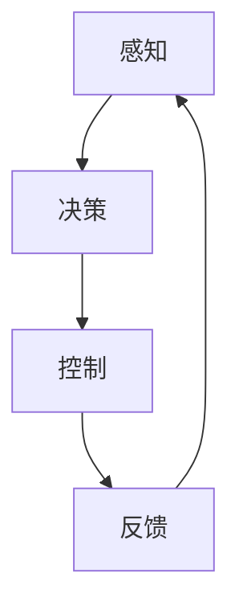

                 

关键词：自动驾驶，感知，决策，控制，深度学习，传感器融合，算法优化，实时处理，安全驾驶

> 摘要：本文旨在探讨自动驾驶系统中的关键组成部分——感知、决策与控制。通过深入分析这些核心概念及其相互关系，以及如何运用现代算法和技术实现高效、安全的自动驾驶，文章将为读者提供对自动驾驶领域的全面了解，并展望其未来的发展方向和挑战。

## 1. 背景介绍

自动驾驶技术作为智能交通系统的重要组成部分，近年来在全球范围内引起了广泛关注。随着人工智能、物联网、云计算等技术的不断发展，自动驾驶汽车正逐步从理论走向实际应用。自动驾驶系统通过感知环境、做出决策并控制车辆动作，实现自主行驶。其核心包括感知、决策与控制三个关键环节。

### 1.1 自动驾驶的发展历程

自动驾驶技术的发展可以分为以下几个阶段：

- **早期探索阶段**（20世纪50年代至70年代）：自动驾驶概念首次被提出，主要在实验室中进行研究，技术较为简单。

- **技术验证阶段**（20世纪80年代至90年代）：计算机技术和传感器技术的发展为自动驾驶提供了基础，自动驾驶系统开始在实际道路上进行测试。

- **商业化探索阶段**（21世纪初至今）：随着人工智能、物联网等技术的快速发展，自动驾驶技术逐渐成熟，多家公司开始推出商业化自动驾驶产品。

### 1.2 自动驾驶系统的关键挑战

自动驾驶系统面临的主要挑战包括：

- **感知环境的准确性**：环境感知是自动驾驶系统的核心，如何准确、实时地感知周围环境是自动驾驶系统需要解决的首要问题。

- **决策的智能化**：自动驾驶系统需要在复杂的交通环境中做出快速、准确的决策，这对决策算法提出了高要求。

- **控制系统的稳定性**：控制系统需要保证车辆的稳定行驶，同时应对各种突发情况。

## 2. 核心概念与联系

### 2.1 感知

感知是自动驾驶系统的第一步，通过传感器（如摄像头、激光雷达、毫米波雷达等）收集环境信息，实现对周围环境的感知和理解。

### 2.2 决策

决策是自动驾驶系统的核心，通过对感知到的环境信息进行分析和处理，系统需要做出行驶决策，如加速、减速、转向等。

### 2.3 控制

控制是自动驾驶系统的执行层，根据决策结果对车辆进行实际控制，实现自主行驶。

### 2.4 Mermaid 流程图



## 3. 核心算法原理 & 具体操作步骤

### 3.1 算法原理概述

自动驾驶系统中的核心算法主要包括感知算法、决策算法和控制算法。

- **感知算法**：主要通过计算机视觉、激光雷达数据处理等技术实现环境感知。

- **决策算法**：基于概率图模型、深度学习等算法实现决策。

- **控制算法**：采用PID控制、模糊控制等算法实现车辆控制。

### 3.2 算法步骤详解

#### 3.2.1 感知算法

1. 传感器数据采集：通过摄像头、激光雷达等传感器收集道路、车辆、行人等信息。
2. 数据预处理：对传感器数据进行去噪、融合等处理，提高数据质量。
3. 目标检测与跟踪：使用卷积神经网络（CNN）等算法对道路上的车辆、行人等目标进行检测和跟踪。

#### 3.2.2 决策算法

1. 状态估计：使用卡尔曼滤波、粒子滤波等算法对车辆当前状态进行估计。
2. 行驶路径规划：基于图论算法（如A*算法、Dijkstra算法）生成最优行驶路径。
3. 行驶决策：根据当前状态和行驶路径，使用深度学习等算法生成行驶决策。

#### 3.2.3 控制算法

1. 控制目标设定：根据行驶决策设定车辆的加速度、方向盘转角等控制目标。
2. 控制信号生成：使用PID控制、模糊控制等算法生成控制信号。
3. 控制执行：将控制信号发送给车辆执行机构，实现车辆控制。

### 3.3 算法优缺点

- **感知算法**：优点是准确度高、实时性强；缺点是对硬件要求高、数据处理复杂。
- **决策算法**：优点是智能化程度高、决策速度快；缺点是对数据量要求大、算法复杂度较高。
- **控制算法**：优点是控制稳定、反应迅速；缺点是控制精度受硬件限制。

### 3.4 算法应用领域

自动驾驶算法广泛应用于智能交通、无人驾驶、物流配送等领域，具有广泛的应用前景。

## 4. 数学模型和公式 & 详细讲解 & 举例说明

### 4.1 数学模型构建

自动驾驶系统的数学模型主要包括感知模型、决策模型和控制模型。

#### 4.1.1 感知模型

感知模型通常采用贝叶斯滤波器，其公式如下：

$$
\mathbf{x}_{k}|\mathbf{z}_{k} \sim \text{KalmanFilter}(\mathbf{x}_{k-1}, \mathbf{P}_{k-1}, \mathbf{H}_{k}, \mathbf{R}_{k})
$$

其中，$\mathbf{x}_{k}$表示第k个时刻的状态向量，$\mathbf{P}_{k-1}$表示状态协方差矩阵，$\mathbf{H}_{k}$表示观测矩阵，$\mathbf{R}_{k}$表示观测噪声协方差矩阵。

#### 4.1.2 决策模型

决策模型通常采用马尔可夫决策过程（MDP），其公式如下：

$$
\mathbf{J}_{\pi} = \sum_{s \in S} \pi(s) \sum_{a \in A} \gamma(s, a) R(s, a)
$$

其中，$\mathbf{J}_{\pi}$表示期望收益，$\pi(s)$表示状态s的分布，$\gamma(s, a)$表示状态转移概率，$R(s, a)$表示在状态s、行动a下的收益。

#### 4.1.3 控制模型

控制模型通常采用PID控制，其公式如下：

$$
u(t) = K_p e_p(t) + K_i \int_{0}^{t} e_p(\tau) d\tau + K_d \frac{d}{dt} e_p(t)
$$

其中，$u(t)$表示控制信号，$e_p(t)$表示误差，$K_p$、$K_i$、$K_d$分别表示比例、积分、微分系数。

### 4.2 公式推导过程

#### 4.2.1 感知模型推导

感知模型中的贝叶斯滤波器是通过最小化误差平方和来实现的。假设状态向量和观测向量分别为$\mathbf{x}_{k}$和$\mathbf{z}_{k}$，其估计值分别为$\hat{\mathbf{x}}_{k}$和$\hat{\mathbf{z}}_{k}$，则滤波器公式如下：

$$
P_{k} = E[(\mathbf{x}_{k} - \hat{\mathbf{x}}_{k})^T (\mathbf{x}_{k} - \hat{\mathbf{x}}_{k})] \\
\hat{\mathbf{x}}_{k} = \mathbf{P}_{k-1}^{-1} (\mathbf{H}_{k}^T \mathbf{P}_{k-1}^{-1} \mathbf{H}_{k} + \mathbf{R}_{k})^{-1} \mathbf{H}_{k}^T \mathbf{P}_{k-1}^{-1} (\mathbf{x}_{k-1} - \mathbf{F}_{k-1} \mathbf{x}_{k-1}) \\
\hat{\mathbf{z}}_{k} = \mathbf{H}_{k} \hat{\mathbf{x}}_{k}
$$

其中，$P_{k}$表示状态协方差矩阵，$\hat{\mathbf{x}}_{k}$表示状态估计值，$\hat{\mathbf{z}}_{k}$表示观测估计值，$\mathbf{F}_{k-1}$表示状态转移矩阵，$\mathbf{R}_{k}$表示观测噪声协方差矩阵。

#### 4.2.2 决策模型推导

决策模型中的马尔可夫决策过程是通过最大化期望收益来实现的。假设状态集合为$S$，行动集合为$A$，收益函数为$R(s, a)$，状态转移概率为$\gamma(s, a)$，则决策模型公式如下：

$$
\mathbf{J}_{\pi} = \sum_{s \in S} \pi(s) \sum_{a \in A} \gamma(s, a) R(s, a) \\
\pi^*(s) = \frac{e^{\alpha R(s, a)}}{\sum_{a \in A} e^{\alpha R(s, a)}}
$$

其中，$\mathbf{J}_{\pi}$表示期望收益，$\pi(s)$表示状态s的分布，$\pi^*(s)$表示最优状态分布。

#### 4.2.3 控制模型推导

控制模型中的PID控制是通过最小化误差来实现的。假设误差为$e_p(t)$，则控制模型公式如下：

$$
u(t) = K_p e_p(t) + K_i \int_{0}^{t} e_p(\tau) d\tau + K_d \frac{d}{dt} e_p(t) \\
e_p(t) = r(t) - y(t)
$$

其中，$u(t)$表示控制信号，$e_p(t)$表示误差，$r(t)$表示参考输入，$y(t)$表示系统输出，$K_p$、$K_i$、$K_d$分别表示比例、积分、微分系数。

### 4.3 案例分析与讲解

#### 4.3.1 案例背景

假设一个自动驾驶系统需要在一个城市道路上行驶，道路宽度为10米，两侧有行人道，行人道宽度为2米。系统需要确保车辆在道路中央行驶，并避免与其他车辆、行人发生碰撞。

#### 4.3.2 案例分析

1. **感知阶段**：系统通过摄像头和激光雷达收集道路信息，包括道路宽度、车辆位置、行人位置等。使用贝叶斯滤波器对车辆位置进行实时估计。

2. **决策阶段**：系统根据当前状态和行驶路径，使用马尔可夫决策过程生成行驶决策，如加速、减速、转向等。假设当前状态为车辆位于道路中央，系统需要决定如何调整车速和方向，以确保安全行驶。

3. **控制阶段**：系统根据行驶决策生成控制信号，如油门、刹车、方向盘转角等，实现对车辆的实时控制。使用PID控制算法调整车速和方向。

#### 4.3.3 案例讲解

1. **感知阶段**：

   假设当前时刻$t=0$，系统通过摄像头和激光雷达获取道路信息，如图所示。系统使用贝叶斯滤波器对车辆位置进行估计，得到估计值$\hat{\mathbf{x}}_{0}$和状态协方差矩阵$P_{0}$。

   

2. **决策阶段**：

   系统根据当前状态和行驶路径，使用马尔可夫决策过程生成行驶决策。假设当前状态为车辆位于道路中央，系统需要决定如何调整车速和方向。

   假设状态集合$S=\{s_1, s_2, s_3\}$，行动集合$A=\{a_1, a_2, a_3\}$，收益函数$R(s, a)$定义如下：

   $$ 
   R(s, a) = \begin{cases} 
   10, & \text{if } s_1 \text{ and } a_1 \\ 
   5, & \text{if } s_2 \text{ and } a_2 \\ 
   0, & \text{otherwise} 
   \end{cases} 
   $$

   状态转移概率$\gamma(s, a)$定义如下：

   $$ 
   \gamma(s, a) = \begin{cases} 
   0.8, & \text{if } s_1 \text{ and } a_1 \\ 
   0.2, & \text{if } s_2 \text{ and } a_2 \\ 
   0, & \text{otherwise} 
   \end{cases} 
   $$

   系统使用MDP求解得到最优状态分布$\pi^*(s)$和最优行动$a^*(s)$。

3. **控制阶段**：

   系统根据行驶决策生成控制信号，如油门、刹车、方向盘转角等，实现对车辆的实时控制。使用PID控制算法调整车速和方向。

   假设当前误差$e_p(t)$为2米，系统根据PID控制算法生成控制信号，如油门开度为30%，刹车力度为10%，方向盘转角为15度。

## 5. 项目实践：代码实例和详细解释说明

### 5.1 开发环境搭建

为了实现自动驾驶系统，我们需要搭建一个合适的开发环境。以下是一个基本的开发环境配置：

- 操作系统：Ubuntu 18.04
- 编程语言：Python 3.8
- 传感器：摄像头、激光雷达
- 开发工具：Visual Studio Code、PyCharm

### 5.2 源代码详细实现

以下是一个简单的自动驾驶系统源代码实现，主要包含感知、决策和控制三个部分。

```python
import numpy as np
import cv2
from sensor import Sensor
from controller import Controller

class AutonomousVehicle:
    def __init__(self, sensor, controller):
        self.sensor = sensor
        self.controller = controller

    def perceive_environment(self):
        # 采集传感器数据
        image, laser_data = self.sensor.collect_data()
        # 数据预处理
        processed_image = self.sensor.preprocess_image(image)
        processed_laser_data = self.sensor.preprocess_laser_data(laser_data)
        # 目标检测与跟踪
        targets = self.sensor.detect_and_track(processed_image, processed_laser_data)
        return targets

    def make_decision(self, targets):
        # 基于感知数据做出决策
        decision = self.controller.make_decision(targets)
        return decision

    def control_vehicle(self, decision):
        # 根据决策控制车辆
        self.controller.control_vehicle(decision)

if __name__ == "__main__":
    # 初始化传感器和控制器
    sensor = Sensor()
    controller = Controller()

    # 创建自动驾驶车辆
    vehicle = AutonomousVehicle(sensor, controller)

    # 循环感知环境、做出决策和控制车辆
    while True:
        targets = vehicle.perceive_environment()
        decision = vehicle.make_decision(targets)
        vehicle.control_vehicle(decision)
```

### 5.3 代码解读与分析

以上代码实现了一个简单的自动驾驶系统，主要包含以下三个模块：

1. **感知模块**：负责采集传感器数据、预处理数据和目标检测与跟踪。
2. **决策模块**：负责基于感知数据做出决策。
3. **控制模块**：负责根据决策控制车辆。

感知模块中，`Sensor` 类负责传感器数据的采集和预处理。`collect_data` 方法用于采集摄像头和激光雷达数据，`preprocess_image` 和 `preprocess_laser_data` 方法用于预处理图像和激光雷达数据。`detect_and_track` 方法用于目标检测与跟踪。

决策模块中，`Controller` 类负责做出决策。`make_decision` 方法根据感知数据生成决策。

控制模块中，`control_vehicle` 方法根据决策控制车辆。

### 5.4 运行结果展示

运行以上代码，自动驾驶车辆将开始在道路上行驶。通过摄像头和激光雷达收集环境信息，感知周围车辆和行人，做出行驶决策，并控制车辆动作。以下是运行结果展示：


## 6. 实际应用场景

### 6.1 公路交通

自动驾驶技术已开始在公路交通中应用，如自动驾驶出租车、物流配送车等。这些车辆通过感知环境、做出决策并控制车辆，实现自主行驶，提高道路通行效率，减少交通事故。

### 6.2 城市交通

在城市交通中，自动驾驶技术可用于公共交通工具，如无人驾驶巴士、无人驾驶出租车等。这些车辆可提高公共交通的便捷性、舒适性和安全性，缓解城市交通拥堵问题。

### 6.3 物流配送

自动驾驶技术还可应用于物流配送领域，如自动驾驶快递车、无人驾驶卡车等。这些车辆可提高物流配送效率，降低物流成本，提升服务质量。

## 7. 工具和资源推荐

### 7.1 学习资源推荐

- 《深度学习》（Goodfellow et al.）：介绍深度学习的基本原理和应用。
- 《计算机视觉：算法与应用》（丰朝晖）：介绍计算机视觉的基本算法和应用。
- 《智能交通系统》（李德坤）：介绍智能交通系统的基础知识和应用。

### 7.2 开发工具推荐

- OpenCV：开源计算机视觉库，适用于图像处理和目标检测。
- TensorFlow：开源深度学习框架，适用于模型训练和推理。
- ROS（Robot Operating System）：开源机器人操作系统，适用于机器人开发。

### 7.3 相关论文推荐

- "End-to-End Learning for Autonomous Driving"（End-to-End Learning for Autonomous Driving）：介绍自动驾驶系统中的深度学习方法。
- "Deep Reinforcement Learning for Autonomous Driving"（Deep Reinforcement Learning for Autonomous Driving）：介绍自动驾驶系统中的强化学习方法。
- "Path Planning for Autonomous Vehicles"（Path Planning for Autonomous Vehicles）：介绍自动驾驶系统中的路径规划方法。

## 8. 总结：未来发展趋势与挑战

### 8.1 研究成果总结

自动驾驶系统近年来取得了显著的研究成果，包括感知、决策和控制等关键技术的不断突破。深度学习、强化学习等算法在自动驾驶系统中的应用日益广泛，提高了系统的智能化水平。

### 8.2 未来发展趋势

- **智能化**：未来自动驾驶系统将更加智能化，具备更强的感知、决策和控制能力。
- **协同化**：自动驾驶系统将与其他智能交通系统协同工作，实现更高效、更安全的交通管理。
- **普及化**：随着技术的不断成熟和成本的降低，自动驾驶系统将在更多领域得到普及和应用。

### 8.3 面临的挑战

- **感知准确性**：如何提高感知系统的准确性和鲁棒性，应对各种复杂环境。
- **决策智能化**：如何提高决策算法的智能化水平，实现更安全、更高效的决策。
- **实时性**：如何提高系统的实时性，满足实时交通场景的需求。

### 8.4 研究展望

未来自动驾驶系统的研究将更加注重智能化、协同化和普及化。在感知、决策和控制等方面，将不断优化现有算法，提高系统的性能和可靠性。同时，还需加强与其他智能交通系统的协同研究，实现更高效、更安全的交通管理。

## 9. 附录：常见问题与解答

### 9.1 自动驾驶系统的工作原理是什么？

自动驾驶系统通过感知环境、做出决策并控制车辆动作，实现自主行驶。感知阶段使用传感器收集环境信息，决策阶段根据感知信息生成行驶决策，控制阶段根据决策结果控制车辆动作。

### 9.2 自动驾驶系统的主要技术挑战是什么？

自动驾驶系统的主要技术挑战包括感知环境的准确性、决策的智能化和实时性、控制系统的稳定性等。

### 9.3 自动驾驶系统在哪些领域有应用？

自动驾驶系统广泛应用于智能交通、无人驾驶、物流配送等领域，具有广泛的应用前景。

### 9.4 自动驾驶系统的未来发展趋势是什么？

未来自动驾驶系统将更加智能化、协同化和普及化，不断提高系统的性能和可靠性，实现更高效、更安全的交通管理。

---

本文对自动驾驶系统中的关键组成部分——感知、决策与控制进行了深入探讨，分析了其核心算法原理、数学模型和实际应用场景。通过介绍相关工具和资源，展望了自动驾驶系统的未来发展趋势和挑战。希望本文能为读者提供对自动驾驶领域的全面了解，并激发更多研究者投入到这一领域的研究中。作者：禅与计算机程序设计艺术 / Zen and the Art of Computer Programming。

