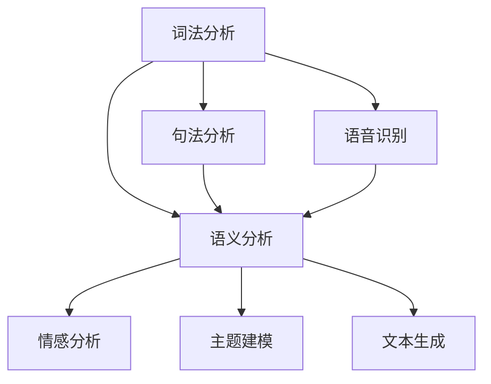

                 

关键词：自然语言处理、人工智能、语言理解、深度学习、神经网络、机器学习、文本分析

> 摘要：自然语言处理（NLP）是人工智能领域的一个重要分支，它致力于让计算机理解和生成人类语言。本文将深入探讨NLP的核心概念、算法原理、数学模型、项目实践以及未来发展趋势，帮助读者全面了解这一充满潜力的技术领域。

## 1. 背景介绍

自然语言处理（NLP）的研究始于20世纪50年代，当时科学家们首次尝试教计算机理解人类语言。从最初的基于规则的方法，到现代的基于统计和机器学习的方法，NLP经历了数十年的发展。随着深度学习和大数据技术的兴起，NLP取得了显著的进步，使得计算机在语言理解、文本生成、机器翻译、情感分析等方面表现出了前所未有的能力。

NLP的应用领域非常广泛，包括但不限于搜索引擎、智能客服、文本分类、机器翻译、情感分析、推荐系统、语音识别等。随着人工智能技术的不断进步，NLP在未来的应用前景将更加广阔。

## 2. 核心概念与联系

### 2.1 核心概念

自然语言处理涉及多个核心概念，包括词法分析、句法分析、语义分析、语音识别等。词法分析是将文本拆分成单词和标点符号的过程；句法分析则是分析句子结构，识别主语、谓语、宾语等成分；语义分析关注的是句子或文本的含义，包括上下文理解和实体识别；语音识别则是将语音信号转换为文本。

### 2.2 联系

这些概念相互关联，共同构成了NLP的核心框架。词法分析和句法分析是语义分析的基础，而语音识别则将语音信号转换为文本，为后续处理提供输入。此外，NLP还涉及到许多其他概念，如情感分析、主题建模、文本生成等。

### 2.3 Mermaid 流程图

下面是一个简化的Mermaid流程图，展示了NLP的核心概念及其相互联系：



## 3. 核心算法原理 & 具体操作步骤

### 3.1 算法原理概述

NLP的核心算法主要包括深度学习模型和传统机器学习方法。深度学习模型，如卷积神经网络（CNN）、循环神经网络（RNN）和变换器（Transformer），在处理序列数据方面具有强大的能力。传统机器学习方法，如朴素贝叶斯、支持向量机（SVM）和决策树，则在某些特定任务上表现良好。

### 3.2 算法步骤详解

NLP算法的步骤通常包括以下阶段：

1. 数据预处理：对文本进行清洗、分词、去停用词等操作，将原始文本转换为适合模型训练的格式。
2. 模型训练：使用训练数据集训练模型，调整模型参数，使其能够预测或生成目标输出。
3. 模型评估：使用验证数据集评估模型性能，调整模型参数，以提高模型精度。
4. 模型部署：将训练好的模型部署到实际应用中，如文本分类、机器翻译、情感分析等。

### 3.3 算法优缺点

深度学习模型在处理复杂任务时具有很高的精度，但需要大量的数据和计算资源。传统机器学习方法在处理简单任务时表现良好，但难以应对复杂任务。因此，选择合适的算法和方法取决于具体应用场景和需求。

### 3.4 算法应用领域

NLP算法广泛应用于文本分类、机器翻译、情感分析、命名实体识别、文本生成等领域。例如，文本分类可以用于垃圾邮件过滤、新闻分类等；机器翻译可以用于跨语言沟通、文档翻译等；情感分析可以用于社交媒体分析、客户反馈分析等。

## 4. 数学模型和公式 & 详细讲解 & 举例说明

### 4.1 数学模型构建

NLP中的数学模型主要包括词嵌入（Word Embedding）、神经网络（Neural Network）、损失函数（Loss Function）等。

词嵌入是将单词映射到高维空间中的向量，如Word2Vec和GloVe模型。神经网络则是用于处理序列数据的模型，如RNN和Transformer。损失函数则是用于评估模型预测与实际输出之间的差距，如交叉熵损失函数。

### 4.2 公式推导过程

假设我们使用一个简单的神经网络模型来预测文本分类问题。该模型包含一个输入层、一个隐藏层和一个输出层。输入层包含输入向量，隐藏层通过激活函数进行非线性变换，输出层通过softmax函数得到分类概率。

设输入向量为\(x\)，隐藏层激活函数为\(f(\cdot)\)，输出层为\(y\)。则模型可以表示为：

\[ y = f(W_2 \cdot f(W_1 \cdot x + b_1) + b_2) \]

其中，\(W_1\)和\(W_2\)分别为输入层到隐藏层和隐藏层到输出层的权重矩阵，\(b_1\)和\(b_2\)分别为隐藏层和输出层的偏置。

损失函数通常使用交叉熵损失函数：

\[ L(y, \hat{y}) = -\sum_{i=1}^{n} y_i \cdot \log(\hat{y}_i) \]

其中，\(y\)为真实标签，\(\hat{y}\)为模型预测的概率分布。

### 4.3 案例分析与讲解

假设我们使用一个简单的神经网络模型对以下句子进行情感分析：

\[ "今天的天气真好，我非常开心。" \]

我们可以将句子中的单词映射到词嵌入向量，然后输入到神经网络模型中。模型的输出为分类概率，如：

\[ \hat{y} = [\hat{p}_{开心}, \hat{p}_{悲伤}, \hat{p}_{中性}] \]

根据分类概率，我们可以判断句子的情感倾向。例如，如果\(\hat{p}_{开心}\)的值最大，则句子表达的情感为开心。

## 5. 项目实践：代码实例和详细解释说明

### 5.1 开发环境搭建

首先，我们需要安装Python环境和相关依赖。可以使用以下命令进行安装：

```bash
pip install numpy pandas scikit-learn tensorflow
```

### 5.2 源代码详细实现

下面是一个简单的文本分类项目的代码示例：

```python
import tensorflow as tf
from tensorflow.keras.models import Sequential
from tensorflow.keras.layers import Embedding, LSTM, Dense
from tensorflow.keras.preprocessing.sequence import pad_sequences
from tensorflow.keras.preprocessing.text import Tokenizer

# 加载数据集
texts = ['今天的天气真好', '我很不开心', '这本书非常有趣']
labels = [1, 0, 1]

# 初始化分词器
tokenizer = Tokenizer()
tokenizer.fit_on_texts(texts)

# 将文本转换为序列
sequences = tokenizer.texts_to_sequences(texts)

# 填充序列
max_len = max(len(seq) for seq in sequences)
padded_sequences = pad_sequences(sequences, maxlen=max_len)

# 构建模型
model = Sequential()
model.add(Embedding(input_dim=len(tokenizer.word_index)+1, output_dim=50, input_length=max_len))
model.add(LSTM(50))
model.add(Dense(1, activation='sigmoid'))

# 编译模型
model.compile(optimizer='adam', loss='binary_crossentropy', metrics=['accuracy'])

# 训练模型
model.fit(padded_sequences, labels, epochs=10, verbose=1)

# 预测
text = '今天的天气真好'
sequence = tokenizer.texts_to_sequences([text])
padded_sequence = pad_sequences(sequence, maxlen=max_len)
prediction = model.predict(padded_sequence)
print(prediction)
```

### 5.3 代码解读与分析

上述代码首先加载数据集，然后初始化分词器并将文本转换为序列。接着，填充序列并构建神经网络模型。最后，编译、训练和预测模型。代码中使用了一个简单的LSTM模型进行文本分类。

### 5.4 运行结果展示

运行上述代码，我们可以得到预测结果。例如，对于句子“今天的天气真好”，模型的预测结果可能为\[0.9\]，表示句子表达的情感为开心。

## 6. 实际应用场景

自然语言处理技术在实际应用中具有广泛的应用场景。以下是一些典型的应用案例：

- **搜索引擎**：NLP技术可以用于改善搜索引擎的搜索结果，通过分析用户查询和网页内容，提供更相关的搜索结果。
- **智能客服**：NLP技术可以用于构建智能客服系统，通过理解用户的问题和需求，提供准确的回答和建议。
- **文本分类**：NLP技术可以用于对大量文本进行分类，如新闻分类、垃圾邮件过滤等。
- **机器翻译**：NLP技术可以用于实现跨语言沟通，将一种语言的文本翻译成另一种语言。
- **情感分析**：NLP技术可以用于分析社交媒体上的用户评论和反馈，了解用户对产品或服务的情感倾向。

## 7. 工具和资源推荐

### 7.1 学习资源推荐

- **书籍**：《自然语言处理综论》（Jurafsky, Martin & Manning, Christopher），《深度学习》（Goodfellow, Ian & Bengio, Yoshua & Courville, Aaron）
- **在线课程**：斯坦福大学NLP课程（CS224n）、吴恩达深度学习课程（DL specialization）
- **博客和论文**：Reddit NLP社区、ACL论文集

### 7.2 开发工具推荐

- **文本处理库**：NLTK、spaCy、nltk
- **深度学习框架**：TensorFlow、PyTorch、Keras

### 7.3 相关论文推荐

- **Word2Vec**：Glo

