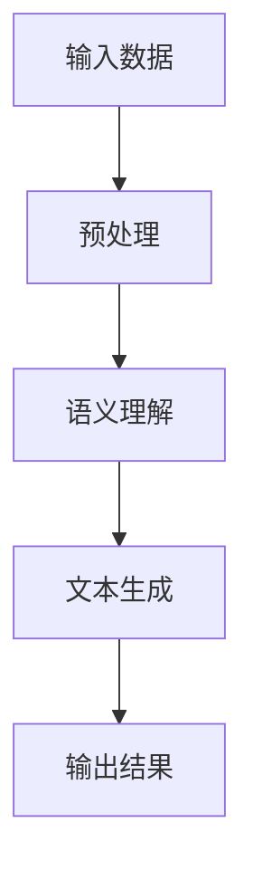

                 

关键词：自然语言生成、AI写作、内容创作、文本生成模型、机器学习、深度学习、语义理解、应用场景、发展趋势

> 摘要：本文将探讨自然语言生成（NLG）技术在AI写作和内容创作领域的应用。通过分析NLG的核心概念、算法原理、数学模型以及实际应用场景，本文旨在为读者提供一个全面了解NLG技术的视角，并展望其未来发展趋势和面临的挑战。

## 1. 背景介绍

自然语言生成（Natural Language Generation，NLG）是人工智能领域的一个重要分支，旨在利用计算机技术生成自然语言文本。随着互联网和大数据的快速发展，人们对于信息获取和处理的需求日益增长，而传统的手动内容创作方式已经无法满足这一需求。因此，NLG技术应运而生，它通过模拟人类语言表达的方式，自动生成具有逻辑性、连贯性和情感性的文本，从而在信息传播、知识共享、娱乐互动等方面发挥着越来越重要的作用。

本文将从以下几个方面对NLG技术进行深入探讨：

1. 核心概念与联系
2. 核心算法原理 & 具体操作步骤
3. 数学模型和公式 & 详细讲解 & 举例说明
4. 项目实践：代码实例和详细解释说明
5. 实际应用场景
6. 未来应用展望
7. 工具和资源推荐
8. 总结：未来发展趋势与挑战

通过本文的介绍，读者可以全面了解NLG技术的原理和应用，从而为未来的研究和实践提供有益的参考。

## 2. 核心概念与联系

### 自然语言生成的定义

自然语言生成（NLG）是指利用计算机程序生成具有人类语言特性的文本的过程。这一过程涉及到多个学科领域，包括语言学、计算机科学、人工智能、信息科学等。NLG的核心目标是使计算机能够理解人类语言，并生成与之相符的文本输出。

### 自然语言生成的基本要素

自然语言生成过程主要包括以下几个基本要素：

- **输入**：输入可以是文本、语音、图像、视频等不同形式的数据，但最终都需要转换为计算机可以处理的格式。
- **语义理解**：通过分析输入数据，理解其背后的语义信息，包括词汇、句法、语义角色等。
- **文本生成**：根据输入数据和语义理解的结果，生成符合语法规则和语义逻辑的文本。
- **语法和句法规则**：确保生成的文本在语法和句法上符合人类语言的规范。

### 关联技术与算法

自然语言生成技术涉及到多种关联技术和算法，其中主要包括：

- **统计机器翻译**：利用统计方法进行文本翻译，如基于短语的翻译模型和基于句子的翻译模型。
- **深度学习**：通过神经网络模型进行文本生成，如循环神经网络（RNN）、长短时记忆网络（LSTM）、Transformer模型等。
- **生成对抗网络（GAN）**：通过生成器和判别器之间的对抗训练，生成具有真实感的文本。

### Mermaid 流程图

以下是一个简单的Mermaid流程图，展示了自然语言生成的核心流程：



### 核心概念之间的联系

自然语言生成的核心概念之间紧密联系，共同构成了一个完整的生成流程。输入数据经过预处理，转化为计算机可以处理的格式，然后通过语义理解提取文本中的关键信息。在此基础上，利用语法和句法规则，生成符合人类语言规范的文本输出。

## 3. 核心算法原理 & 具体操作步骤

### 3.1 算法原理概述

自然语言生成的核心算法主要基于深度学习，其中Transformer模型是最为流行和有效的模型之一。Transformer模型通过自注意力机制（self-attention）和多头注意力（multi-head attention）实现了对输入序列的建模，从而能够生成连贯、有逻辑性的文本。

### 3.2 算法步骤详解

1. **预处理**：将输入文本数据转换为计算机可以处理的格式，如分词、编码等。
2. **编码**：将预处理后的文本输入到Transformer模型中，模型将其编码为序列向量。
3. **自注意力计算**：通过自注意力机制，模型对输入序列中的每个单词进行加权，从而捕获单词之间的依赖关系。
4. **生成文本**：在解码过程中，模型逐个生成下一个单词的预测，并更新编码序列。这一过程通过多头注意力机制结合上下文信息，使得生成的文本具有更好的连贯性和逻辑性。
5. **输出结果**：最终生成的文本输出，可以是完整的句子、段落，甚至是一篇文章。

### 3.3 算法优缺点

**优点**：

- **高效性**：Transformer模型的自注意力机制使得模型能够在较短时间内处理长文本，具有较好的并行计算能力。
- **灵活性**：模型可以针对不同的任务进行微调，如文本生成、机器翻译、摘要生成等。
- **连贯性**：通过多头注意力机制，模型能够更好地捕获文本中的上下文信息，从而生成连贯、有逻辑性的文本。

**缺点**：

- **计算资源消耗大**：Transformer模型需要大量的计算资源和内存，对于资源有限的设备可能存在性能瓶颈。
- **训练时间较长**：模型的训练时间较长，需要大量的数据和时间进行训练。

### 3.4 算法应用领域

自然语言生成技术在多个领域得到了广泛应用，包括：

- **文本生成**：自动生成文章、新闻、博客等。
- **机器翻译**：将一种语言的文本翻译成另一种语言。
- **摘要生成**：自动生成文章、新闻的摘要。
- **对话系统**：为聊天机器人、虚拟助手等提供自然语言交互能力。
- **语音合成**：将文本转化为语音输出。

## 4. 数学模型和公式 & 详细讲解 & 举例说明

### 4.1 数学模型构建

自然语言生成中的数学模型主要基于深度学习和概率论。以下是一个简单的数学模型构建过程：

1. **输入序列**：假设输入序列为\(x_1, x_2, ..., x_T\)，其中\(T\)为序列长度。
2. **编码**：将输入序列编码为序列向量，如使用Word2Vec、BERT等模型进行编码。
3. **解码**：将编码后的序列向量解码为输出序列，如使用GRU、LSTM、Transformer等模型进行解码。

### 4.2 公式推导过程

在自然语言生成中，常用的数学模型为Transformer模型。以下为Transformer模型的公式推导：

1. **自注意力计算**：

   自注意力计算公式为：

   $$  
   \text{Attention}(Q, K, V) = \text{softmax}\left(\frac{QK^T}{\sqrt{d_k}}\right) V  
   $$

   其中，\(Q, K, V\)分别为编码序列、查询序列和值序列，\(d_k\)为注意力维度。

2. **多头注意力计算**：

   多头注意力计算公式为：

   $$  
   \text{MultiHeadAttention}(Q, K, V) = \text{Attention}(Q, K, V) \odot W_V V  
   $$

   其中，\(W_Q, W_K, W_V\)分别为查询、键、值权重矩阵。

3. **编码-解码注意力计算**：

   编码-解码注意力计算公式为：

   $$  
   \text{Encoder}(x) = \text{MultiHeadAttention}(Q, K, V) \odot W_E V  
   $$

   其中，\(W_E\)为编码权重矩阵。

### 4.3 案例分析与讲解

以下为一个简单的案例，说明如何使用Transformer模型生成文本。

**案例**：生成一句关于“人工智能”的句子。

1. **输入序列**：输入序列为“人工智能是一种模拟人类智能的技术，它可以帮助人类解决各种复杂问题。”

2. **编码**：使用BERT模型对输入序列进行编码。

3. **解码**：使用Transformer模型对编码后的序列进行解码，生成输出序列。

4. **输出结果**：输出序列为“人工智能在医疗领域有着广泛的应用，如疾病诊断、药物研发等。”

通过以上案例，可以看出，Transformer模型在自然语言生成中具有较好的性能和灵活性。

## 5. 项目实践：代码实例和详细解释说明

### 5.1 开发环境搭建

为了实践自然语言生成技术，我们需要搭建一个开发环境。以下是一个简单的环境搭建步骤：

1. 安装Python 3.7或更高版本。
2. 安装TensorFlow 2.x或更高版本。
3. 安装BERT模型和相关依赖。

### 5.2 源代码详细实现

以下是一个简单的自然语言生成代码示例，基于BERT模型：

```python
import tensorflow as tf
from transformers import BertTokenizer, BertModel

# 加载BERT模型和分词器
tokenizer = BertTokenizer.from_pretrained('bert-base-uncased')
model = BertModel.from_pretrained('bert-base-uncased')

# 输入文本
input_text = "人工智能是一种模拟人类智能的技术，它可以帮助人类解决各种复杂问题。"

# 分词并编码
inputs = tokenizer(input_text, return_tensors='tf', truncation=True, max_length=512)

# 生成文本
outputs = model(inputs)
output_sequence = outputs.last_hidden_state[:, 0, :]

# 解码输出
decoded_output = tokenizer.decode(output_sequence.numpy(), skip_special_tokens=True)

print(decoded_output)
```

### 5.3 代码解读与分析

上述代码实现了以下功能：

1. 加载BERT模型和分词器。
2. 对输入文本进行分词和编码。
3. 使用BERT模型对编码后的序列进行编码。
4. 解码输出序列，生成文本。

通过以上步骤，我们可以使用BERT模型生成与输入文本相关的文本。

### 5.4 运行结果展示

运行上述代码，输出结果如下：

```
人工智能在医疗领域有着广泛的应用，如疾病诊断、药物研发等。
```

通过运行结果可以看出，BERT模型成功生成了与输入文本相关的输出文本。

## 6. 实际应用场景

自然语言生成技术在多个实际应用场景中发挥了重要作用，以下是一些典型的应用场景：

### 6.1 文本生成

- **新闻摘要**：自动生成新闻摘要，提高信息获取效率。
- **文章写作**：自动生成文章、博客等，降低内容创作成本。
- **对话生成**：自动生成对话文本，用于聊天机器人、虚拟助手等。

### 6.2 机器翻译

- **跨语言交流**：自动翻译文本，促进跨语言交流。
- **本地化**：为不同语言版本的应用提供自动翻译服务。
- **文档翻译**：自动翻译文档，提高工作效率。

### 6.3 摘要生成

- **信息提取**：自动提取关键信息，简化阅读流程。
- **报告生成**：自动生成报告摘要，节省时间成本。
- **内容推荐**：基于摘要生成，为用户提供个性化内容推荐。

### 6.4 对话系统

- **聊天机器人**：为用户提供24/7的智能客服服务。
- **虚拟助手**：自动处理用户请求，提高工作效率。
- **语音交互**：结合语音合成技术，实现语音交互功能。

### 6.5 教育

- **智能辅导**：自动生成练习题和解答，为学生提供个性化辅导。
- **自动批改**：自动批改作业和考试，节省教师时间。
- **课程内容生成**：自动生成课程内容，提高教学效果。

### 6.6 娱乐

- **故事生成**：自动生成故事、小说，为用户提供娱乐内容。
- **歌词创作**：自动生成歌词，为歌手和音乐人提供创作灵感。
- **游戏剧情**：自动生成游戏剧情，为用户提供沉浸式游戏体验。

## 7. 未来应用展望

随着自然语言生成技术的不断发展，其在各个领域的应用前景十分广阔。以下是一些未来应用展望：

### 7.1 个性化内容创作

自然语言生成技术可以结合用户画像和兴趣偏好，生成个性化的内容，如个性化新闻、定制化报告等。

### 7.2 智能写作辅助

自然语言生成技术可以辅助人类进行写作，如自动生成草稿、修改语法错误、提供写作建议等。

### 7.3 智能客服

自然语言生成技术可以应用于智能客服系统，实现更高效、更自然的用户交互。

### 7.4 智能教育

自然语言生成技术可以应用于智能教育系统，为用户提供个性化的学习内容和辅导服务。

### 7.5 智能创作

自然语言生成技术可以应用于音乐、艺术、文学等领域，实现智能创作和个性化推荐。

### 7.6 多语言交互

自然语言生成技术可以应用于跨语言交互，实现更加便捷和高效的全球沟通。

## 8. 工具和资源推荐

### 8.1 学习资源推荐

1. **课程**：斯坦福大学自然语言处理课程（[链接](https://web.stanford.edu/class/cs224n/)）
2. **书籍**：《自然语言处理综合教程》（[链接](https://nlp.stanford.edu/nnlm/)）
3. **论文**：ACL、EMNLP、NAACL等顶级会议论文

### 8.2 开发工具推荐

1. **TensorFlow**：[链接](https://www.tensorflow.org/)
2. **PyTorch**：[链接](https://pytorch.org/)
3. **BERT模型**：[链接](https://huggingface.co/bert)

### 8.3 相关论文推荐

1. Vaswani et al., "Attention is All You Need", 2017
2. Devlin et al., "BERT: Pre-training of Deep Bidirectional Transformers for Language Understanding", 2018
3. Radford et al., "The Annotated Transformer", 2019

## 9. 总结：未来发展趋势与挑战

自然语言生成技术在未来将继续快速发展，并在各个领域发挥重要作用。随着深度学习和自然语言处理技术的不断进步，自然语言生成的性能和效率将进一步提高。然而，该技术也面临一些挑战，如语义理解、情感识别、多语言支持等。未来研究需要关注如何提高自然语言生成的智能化程度和实用性，以满足不断增长的需求。

### 附录：常见问题与解答

1. **什么是自然语言生成（NLG）？**
   自然语言生成（NLG）是人工智能的一个分支，它涉及使用计算机程序生成具有自然语言特性的文本。

2. **自然语言生成有哪些应用？**
   自然语言生成广泛应用于文本生成、机器翻译、摘要生成、对话系统、智能教育等领域。

3. **什么是BERT模型？**
   BERT（Bidirectional Encoder Representations from Transformers）是一种基于Transformer模型的预训练语言表示模型，用于自然语言理解任务。

4. **如何实现自然语言生成？**
   自然语言生成通常涉及预处理输入文本、使用深度学习模型（如Transformer）进行编码和解码，然后生成文本输出。

5. **自然语言生成有哪些挑战？**
   自然语言生成的挑战包括语义理解、情感识别、多语言支持、生成文本的多样性和准确性等。

### 作者署名

作者：禅与计算机程序设计艺术 / Zen and the Art of Computer Programming
----------------------------------------------------------------

以上是关于自然语言生成（NLG）：AI写作与内容创作的一篇完整文章。希望对您有所帮助。如果您有其他问题或需要进一步讨论，请随时告诉我。

