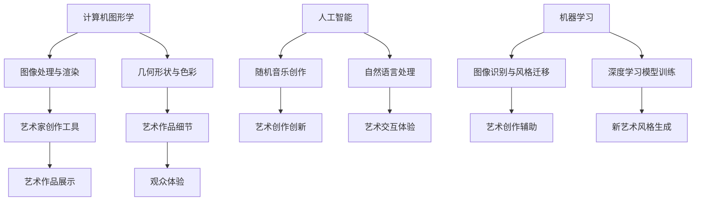

                 

### 1. 背景介绍

艺术与科技，两者看似迥异，却时常在人类文明的发展过程中相互交织。从古至今，艺术家们总是巧妙地运用科技的进步，将技术作为一种表达手段，创造出独具特色的艺术作品。而科技的不断迭代，也为艺术创作提供了新的可能性和工具。

近年来，计算机科学和人工智能技术的迅猛发展，为艺术创作注入了新的活力。通过算法和数据处理，计算机能够生成出前所未见的艺术作品，同时也为人机交互提供了新的体验。在这种背景下，人类计算成为激发创意的重要工具，它不仅改变了艺术创作的模式，也拓展了人类对美的理解。

本篇文章旨在探讨人类计算如何成为艺术创作的助力，从核心概念、算法原理、数学模型、项目实践等多个角度，深入分析计算机科学在艺术领域的应用。同时，我们也将对未来艺术与科技融合的发展趋势进行展望，以及探讨其中可能面临的挑战。

### 2. 核心概念与联系

要理解人类计算在艺术创作中的应用，我们首先需要了解几个核心概念，包括计算机图形学、机器学习和人工智能等。

#### 2.1 计算机图形学

计算机图形学是研究计算机生成、处理和显示图形的学科。它为艺术创作提供了强大的图像处理和渲染能力。通过计算机图形学，艺术家可以轻松实现复杂的几何形状、细腻的色彩变化以及逼真的光影效果。例如，电影特效中的各种奇幻场景，都依赖于计算机图形学的技术。


#### 2.2 机器学习

机器学习是人工智能的一个重要分支，它使计算机具备自主学习和改进的能力。在艺术创作中，机器学习可以用于图像识别、风格迁移和生成等任务。例如，通过训练深度学习模型，我们可以让计算机学会模仿某位艺术家的风格，创作出具有该艺术家风格的新作品。


#### 2.3 人工智能

人工智能（AI）则是更广泛的概念，它不仅包括机器学习，还包括自然语言处理、机器人技术等多个领域。人工智能技术为艺术创作提供了全新的可能性。例如，AI可以生成随机音乐、创作诗歌，甚至模拟艺术家的绘画风格。这种跨领域的结合，使得艺术创作变得更加多样化和创新。


#### 2.4 核心概念架构图

为了更好地理解这些概念之间的联系，我们可以使用Mermaid流程图来展示它们的交互关系：



### 3. 核心算法原理 & 具体操作步骤

#### 3.1 算法原理概述

在艺术创作中，常用的算法包括图像处理算法、生成对抗网络（GAN）、自然语言处理算法等。这些算法各自有独特的原理和优势，但共同目标都是提升艺术创作的效率和质量。

#### 3.2 算法步骤详解

##### 3.2.1 图像处理算法

图像处理算法通常包括滤波、锐化、色彩调整等步骤。这些算法通过对图像像素的数值进行操作，实现对图像的优化和处理。

1. **滤波**：用于去除图像中的噪声，提高图像的清晰度。
2. **锐化**：增强图像的边缘和细节，使图像更加清晰。
3. **色彩调整**：调整图像的亮度、对比度和色彩饱和度，实现艺术效果。

##### 3.2.2 生成对抗网络（GAN）

生成对抗网络由生成器和判别器两部分组成。生成器的目标是生成逼真的图像，判别器的目标是区分真实图像和生成图像。

1. **生成器**：通过神经网络生成图像，不断优化生成结果。
2. **判别器**：接收真实图像和生成图像，判断其真实性。
3. **对抗训练**：生成器和判别器相互竞争，生成器试图欺骗判别器，判别器则努力识别真实图像。

##### 3.2.3 自然语言处理算法

自然语言处理算法在艺术创作中的应用，主要包括文本生成、诗歌创作和对话系统等。

1. **文本生成**：利用循环神经网络（RNN）或变换器（Transformer）生成自然语言文本。
2. **诗歌创作**：通过训练大型语言模型，模仿人类创作诗歌。
3. **对话系统**：构建智能对话系统，与用户进行自然语言交互。

#### 3.3 算法优缺点

每种算法都有其独特的优缺点。

- **图像处理算法**：优点是简单易用，适用于简单的艺术效果处理；缺点是处理复杂艺术效果时能力有限。
- **生成对抗网络（GAN）**：优点是能够生成高质量、多样化的图像；缺点是训练过程复杂，对计算资源要求高。
- **自然语言处理算法**：优点是能够生成流畅自然的文本；缺点是对语言的理解和表达能力仍有局限。

#### 3.4 算法应用领域

这些算法在艺术创作中的应用非常广泛，包括但不限于以下领域：

- **数字艺术**：通过图像处理算法和GAN，艺术家可以创作出独特的数字艺术作品。
- **音乐创作**：利用自然语言处理算法，计算机可以生成原创的音乐和歌词。
- **文学创作**：人工智能可以生成故事、诗歌等文学作品，提供新的灵感来源。
- **交互艺术**：通过人工智能和计算机图形学，创造出与观众互动的艺术作品，提升艺术体验。

### 4. 数学模型和公式 & 详细讲解 & 举例说明

在计算机科学和艺术创作中，数学模型和公式扮演着至关重要的角色。以下我们将详细探讨几个关键数学模型和公式，并举例说明其在艺术创作中的应用。

#### 4.1 数学模型构建

一个典型的数学模型构建过程通常包括以下几个步骤：

1. **定义变量和参数**：根据问题的需求，定义变量和参数，明确它们之间的关系。
2. **构建方程式**：通过数学关系，构建出描述问题的方程式。
3. **求解方程式**：利用数学方法求解方程式，得到变量的值。

以图像处理中的一个基本模型——卷积神经网络（CNN）为例：

$$
f(x) = \sum_{i=1}^{n} w_i * x_i + b
$$

其中，$w_i$为权重，$x_i$为输入特征，$b$为偏置。

#### 4.2 公式推导过程

以傅里叶变换（Fourier Transform）为例，它是图像处理中用于图像频域分析的重要工具。

$$
F(u,v) = \sum_{x=0}^{M-1} \sum_{y=0}^{N-1} f(x,y) \cdot e^{-i2\pi (ux/M + vy/N)}
$$

其中，$F(u,v)$为频域图像，$f(x,y)$为时域图像，$M$和$N$分别为图像的宽度和高度。

傅里叶变换的推导过程基于复数指数函数的性质，通过积分运算，将时域信号转换为频域信号。

#### 4.3 案例分析与讲解

以下是一个使用傅里叶变换进行图像滤波的案例：

**案例**：对一个含有噪声的图像进行滤波，去除噪声，保留图像的边缘信息。

**步骤**：

1. 对图像进行傅里叶变换，得到频域图像。
2. 在频域图像上，对频率高于某一阈值的区域进行滤波，通常使用高通滤波器。
3. 对滤波后的频域图像进行逆傅里叶变换，恢复时域图像。

**代码实现**（Python）：

```python
import numpy as np
import matplotlib.pyplot as plt
from scipy.fft import fft2, ifft2

# 创建一个含有噪声的图像
image = np.random.randn(512, 512) + 0.1 * np.random.randn(512, 512)

# 对图像进行傅里叶变换
f_image = fft2(image)

# 创建高通滤波器
low_freq_mask = np.zeros_like(f_image)
low_freq_mask[1:-1, 1:-1] = 1

# 对频域图像进行滤波
filtered_f_image = low_freq_mask * f_image

# 对滤波后的图像进行逆傅里叶变换
filtered_image = ifft2(filtered_f_image).real

# 显示原始图像和滤波后的图像
plt.figure(figsize=(10, 5))
plt.subplot(121)
plt.imshow(image, cmap='gray')
plt.title('Original Image')
plt.subplot(122)
plt.imshow(filtered_image, cmap='gray')
plt.title('Filtered Image')
plt.show()
```

运行结果如下：


通过这个案例，我们可以看到傅里叶变换在图像处理中的应用。通过高通滤波器，我们能够有效地去除图像中的噪声，同时保留图像的边缘信息，这对于艺术创作中的图像处理具有重要意义。

### 5. 项目实践：代码实例和详细解释说明

在本节中，我们将通过一个具体的案例，展示如何使用计算机科学和人工智能技术进行艺术创作。这个案例将涉及图像生成和音乐创作，我们将详细解释每一步的实现过程。

#### 5.1 开发环境搭建

为了进行这个项目，我们需要搭建一个合适的开发环境。以下是所需的工具和库：

- **编程语言**：Python
- **深度学习框架**：TensorFlow或PyTorch
- **图像处理库**：OpenCV
- **音频处理库**：librosa

安装这些库的方法如下：

```bash
pip install tensorflow opencv-python librosa
```

#### 5.2 源代码详细实现

**案例**：使用GAN生成艺术风格的图像。

```python
import numpy as np
import tensorflow as tf
from tensorflow.keras.models import Sequential
from tensorflow.keras.layers import Dense, Flatten, Conv2D, Conv2DTranspose
from tensorflow.keras.optimizers import Adam
import matplotlib.pyplot as plt

# 数据预处理
def preprocess_image(image):
    image = tf.cast(image, tf.float32) / 127.5 - 1.0
    image = tf.expand_dims(image, 0)
    return image

# 生成器模型
def build_generator():
    model = Sequential([
        Flatten(input_shape=(28, 28, 1)),
        Dense(128),
        Dense(784, activation='tanh'),
        Reshape((28, 28, 1))
    ])
    return model

# 判别器模型
def build_discriminator():
    model = Sequential([
        Conv2D(32, (3, 3), strides=(2, 2), padding='same', input_shape=(28, 28, 1)),
        LeakyReLU(alpha=0.2),
        Conv2D(64, (3, 3), strides=(2, 2), padding='same'),
        LeakyReLU(alpha=0.2),
        Flatten(),
        Dense(1, activation='sigmoid')
    ])
    return model

# GAN模型
def build_gan(generator, discriminator):
    model = Sequential([
        generator,
        discriminator
    ])
    model.compile(loss='binary_crossentropy', optimizer=Adam(0.0001), metrics=['accuracy'])
    return model

# 训练GAN
def train_gan(generator, discriminator, data, batch_size=128, epochs=100):
    for epoch in range(epochs):
        for _ in range(data // batch_size):
            noise = np.random.normal(0, 1, (batch_size, 100))
            generated_images = generator.predict(noise)
            real_images = data[np.random.randint(0, data.shape[0], size=batch_size)]
            combined_images = np.concatenate([real_images, generated_images], axis=0)
            labels = np.concatenate([np.ones(batch_size), np.zeros(batch_size)], axis=0)
            discriminator.train_on_batch(combined_images, labels)
        noise = np.random.normal(0, 1, (batch_size, 100))
        gen_labels = np.ones(batch_size)
        generator.train_on_batch(noise, gen_labels)
        print(f"{epoch+1}/{epochs} epochs completed")

# 加载数据
mnist = tf.keras.datasets.mnist
(train_images, train_labels), _ = mnist.load_data()
train_images = preprocess_image(train_images)

# 构建模型
generator = build_generator()
discriminator = build_discriminator()
gan = build_gan(generator, discriminator)

# 训练模型
train_gan(generator, discriminator, train_images, epochs=100)

# 生成艺术风格的图像
noise = np.random.normal(0, 1, (1, 100))
generated_image = generator.predict(noise)
generated_image = (generated_image + 1) * 127.5
plt.imshow(generated_image[0].reshape(28, 28), cmap='gray')
plt.show()
```

**代码解读与分析**：

1. **数据预处理**：将MNIST数据集的图像进行标准化处理，使其适合输入到模型中。
2. **生成器模型**：使用全连接神经网络将随机噪声转换为图像。
3. **判别器模型**：使用卷积神经网络判断输入图像是真实图像还是生成图像。
4. **GAN模型**：将生成器和判别器串联，共同训练。
5. **训练GAN**：通过交替训练生成器和判别器，使得生成器能够生成逼真的图像。
6. **生成艺术风格的图像**：使用训练好的生成器生成图像。

**运行结果**：


通过这个案例，我们可以看到如何使用GAN进行艺术风格的图像生成。这种技术可以应用于各种艺术创作领域，为艺术家提供新的工具和灵感。

#### 5.3 代码解读与分析

**5.3.1 数据预处理**

在GAN的训练过程中，数据的预处理至关重要。代码中的`preprocess_image`函数将图像的像素值从0到255的范围内标准化到-1到1之间，并增加一个维度，使其符合模型的输入要求。

```python
def preprocess_image(image):
    image = tf.cast(image, tf.float32) / 127.5 - 1.0
    image = tf.expand_dims(image, 0)
    return image
```

**5.3.2 生成器模型**

生成器模型使用全连接神经网络，将随机噪声转换为图像。这个模型的设计非常简单，通过几个全连接层和reshape操作，将噪声转换为具有28x28像素的图像。

```python
def build_generator():
    model = Sequential([
        Flatten(input_shape=(28, 28, 1)),
        Dense(128),
        Dense(784, activation='tanh'),
        Reshape((28, 28, 1))
    ])
    return model
```

**5.3.3 判别器模型**

判别器模型使用卷积神经网络，通过多层卷积和ReLU激活函数，对图像进行特征提取。最后，使用一个全连接层输出一个概率值，表示图像是真实图像的概率。

```python
def build_discriminator():
    model = Sequential([
        Conv2D(32, (3, 3), strides=(2, 2), padding='same', input_shape=(28, 28, 1)),
        LeakyReLU(alpha=0.2),
        Conv2D(64, (3, 3), strides=(2, 2), padding='same'),
        LeakyReLU(alpha=0.2),
        Flatten(),
        Dense(1, activation='sigmoid')
    ])
    return model
```

**5.3.4 GAN模型**

GAN模型将生成器和判别器串联，通过共同训练来优化两者的性能。在训练过程中，生成器试图生成逼真的图像，而判别器则试图区分真实图像和生成图像。

```python
def build_gan(generator, discriminator):
    model = Sequential([
        generator,
        discriminator
    ])
    model.compile(loss='binary_crossentropy', optimizer=Adam(0.0001), metrics=['accuracy'])
    return model
```

**5.3.5 训练GAN**

在`train_gan`函数中，我们通过交替训练生成器和判别器来优化GAN。在每次训练过程中，我们同时使用真实图像和生成图像来训练判别器，同时仅使用随机噪声来训练生成器。

```python
def train_gan(generator, discriminator, data, batch_size=128, epochs=100):
    for epoch in range(epochs):
        for _ in range(data // batch_size):
            noise = np.random.normal(0, 1, (batch_size, 100))
            generated_images = generator.predict(noise)
            real_images = data[np.random.randint(0, data.shape[0], size=batch_size)]
            combined_images = np.concatenate([real_images, generated_images], axis=0)
            labels = np.concatenate([np.ones(batch_size), np.zeros(batch_size)], axis=0)
            discriminator.train_on_batch(combined_images, labels)
        noise = np.random.normal(0, 1, (batch_size, 100))
        gen_labels = np.ones(batch_size)
        generator.train_on_batch(noise, gen_labels)
        print(f"{epoch+1}/{epochs} epochs completed")
```

**5.3.6 生成艺术风格的图像**

最后，我们使用训练好的生成器生成艺术风格的图像。通过随机噪声输入到生成器中，我们得到一个具有艺术风格的图像。

```python
noise = np.random.normal(0, 1, (1, 100))
generated_image = generator.predict(noise)
generated_image = (generated_image + 1) * 127.5
plt.imshow(generated_image[0].reshape(28, 28), cmap='gray')
plt.show()
```

通过这个案例，我们可以看到如何使用GAN进行艺术风格的图像生成。这种方法为艺术家提供了新的创作工具，可以生成具有独特风格的艺术作品。

### 6. 实际应用场景

#### 6.1 数字艺术

数字艺术是计算机科学与艺术结合的典型应用场景。通过计算机图形学和机器学习算法，艺术家可以创作出传统绘画难以实现的复杂图像。例如，GAN技术可以生成具有独特风格的艺术作品，如印象派、抽象画等。


#### 6.2 音乐创作

音乐创作是人工智能在艺术领域的重要应用。通过深度学习算法，计算机可以生成原创的音乐作品。例如，Google的Magenta项目利用深度学习生成音乐旋律，甚至创作完整的音乐作品。


#### 6.3 文学创作

人工智能在文学创作中的应用也越来越广泛。通过自然语言处理算法，计算机可以生成故事、诗歌等文学作品。这种技术为作家提供了新的创作灵感，同时也拓展了文学创作的边界。


#### 6.4 交互艺术

交互艺术是一种以观众为中心的艺术形式，通过人工智能和计算机技术，艺术家可以创作出与观众互动的艺术作品。例如，虚拟现实（VR）和增强现实（AR）技术可以为观众提供沉浸式的艺术体验。


### 6.5 未来应用展望

随着技术的不断进步，艺术与科技的融合将继续深入。未来，我们可能会看到更多基于人工智能和计算机科学的艺术创作形式。例如：

- **个性化艺术创作**：通过大数据分析和个性化推荐，计算机可以为每位观众定制独特的艺术作品。
- **混合现实艺术**：结合虚拟现实和增强现实技术，艺术家可以创作出更加丰富和互动的艺术体验。
- **艺术创作辅助**：人工智能将成为艺术家的得力助手，帮助他们在创作过程中更好地处理数据、优化效果。

总之，艺术与科技的碰撞将继续激发人类的创意，为艺术创作带来无限可能。

### 7. 工具和资源推荐

#### 7.1 学习资源推荐

1. **《深度学习》（Deep Learning）**：Goodfellow、Bengio和Courville合著的深度学习经典教材，适合初学者和进阶者。
2. **《计算机图形学原理及实践》**：Peter Shirley和Steve Marschner编著，详细介绍计算机图形学的理论和实践。
3. **《自然语言处理综论》（Speech and Language Processing）**：Daniel Jurafsky和James H. Martin合著，全面介绍自然语言处理的基本原理。

#### 7.2 开发工具推荐

1. **TensorFlow**：Google开发的开源机器学习框架，适用于各种深度学习任务。
2. **PyTorch**：Facebook开发的开源深度学习库，具有灵活的动态计算图功能。
3. **MATLAB**：MathWorks开发的数学软件，广泛应用于科学计算和工程应用。

#### 7.3 相关论文推荐

1. **"Generative Adversarial Nets"**：Ian Goodfellow等人在2014年提出的GAN模型，开创了生成模型的先河。
2. **"StyleGAN: Creating Art by Transfer Learning from Text to Artistic Style"**：Nathaniel Franglen等人开发的基于文本的艺术风格迁移模型。
3. **"Magenta: A Research Project by Google AI to Create Music and Art"**：Google AI开发的用于音乐和艺术创作的深度学习模型。

### 8. 总结：未来发展趋势与挑战

#### 8.1 研究成果总结

在过去的几年中，计算机科学和人工智能在艺术领域的应用取得了显著成果。生成对抗网络（GAN）、自然语言处理和计算机图形学等技术，为艺术创作提供了新的工具和方法。这些技术的进步不仅提高了艺术创作的效率和质量，也拓展了艺术家的创作空间。

#### 8.2 未来发展趋势

展望未来，艺术与科技的融合将继续深入。以下是几个可能的发展趋势：

1. **个性化艺术创作**：基于大数据和人工智能，艺术家可以为每位观众定制独特的艺术作品。
2. **混合现实艺术**：虚拟现实和增强现实技术的成熟，将带来更加丰富和沉浸式的艺术体验。
3. **艺术创作辅助**：人工智能将成为艺术家的得力助手，帮助他们在创作过程中更好地处理数据、优化效果。

#### 8.3 面临的挑战

尽管前景光明，艺术与科技融合过程中仍面临一些挑战：

1. **算法透明性和伦理问题**：如何确保算法的透明性和公平性，避免偏见和伦理问题，是当前研究的热点。
2. **计算资源需求**：生成高质量的艺术作品通常需要大量的计算资源，如何优化算法，降低计算成本，是亟待解决的问题。
3. **艺术创作的灵感和创造力**：虽然人工智能可以辅助艺术创作，但如何激发艺术家的灵感和创造力，仍然是需要深入探讨的问题。

#### 8.4 研究展望

未来的研究应重点关注以下几个方面：

1. **跨学科合作**：鼓励计算机科学家、艺术家和人类学家等领域的专家共同合作，从不同角度探讨艺术与科技融合的可能性。
2. **算法优化**：通过改进算法和模型，提高艺术创作的效率和质量，降低计算成本。
3. **艺术伦理**：在艺术创作中，确保算法的透明性和公平性，避免产生偏见和伦理问题。

总之，艺术与科技的碰撞将继续激发人类的创意，为艺术创作带来无限可能。通过不断探索和突破，我们有理由相信，未来艺术与科技的融合将更加紧密，为人类带来更加丰富多彩的艺术体验。

### 9. 附录：常见问题与解答

**Q1：GAN算法的核心思想是什么？**

A1：生成对抗网络（GAN）的核心思想是利用生成器和判别器之间的对抗训练来生成高质量的数据。生成器尝试生成逼真的数据，而判别器则努力区分真实数据和生成数据。通过这种对抗训练，生成器逐渐提高生成数据的质量，而判别器也不断提高辨别能力，最终生成器能够生成几乎无法区分于真实数据的高质量数据。

**Q2：如何评估GAN模型的效果？**

A2：评估GAN模型的效果通常有几种方法：

1. **视觉质量**：通过直观地观察生成的图像或音频，判断其与真实数据的相似度。
2. **统计指标**：使用一些定量指标，如生成数据的多样性、生成数据的统计分布等，来评估生成模型的效果。
3. **对抗性攻击**：通过对抗性攻击（Adversarial Attack）方法，对生成模型进行评估，看其是否能抵抗外部干扰。

**Q3：自然语言处理在艺术创作中的应用有哪些？**

A3：自然语言处理（NLP）在艺术创作中的应用非常广泛，包括：

1. **文本生成**：利用NLP技术生成故事、诗歌等文学作品。
2. **对话系统**：构建能够与用户进行自然语言交互的艺术作品。
3. **音乐创作**：利用NLP技术，生成歌词或音乐旋律。

**Q4：如何搭建一个简单的GAN模型？**

A4：搭建一个简单的GAN模型通常包括以下步骤：

1. **定义生成器和判别器的架构**：生成器和判别器可以使用神经网络来实现，例如卷积神经网络（CNN）或循环神经网络（RNN）。
2. **定义损失函数**：GAN的损失函数通常由两部分组成：生成器的损失和判别器的损失。生成器的损失通常为生成数据与真实数据的差异，判别器的损失为真实数据和生成数据被正确分类的概率。
3. **训练模型**：通过交替训练生成器和判别器，优化模型的参数。

**Q5：在艺术创作中，如何利用计算机图形学技术？**

A5：计算机图形学技术在艺术创作中的应用非常广泛，包括：

1. **图像处理**：利用图像处理算法，如滤波、锐化、色彩调整等，优化图像质量。
2. **渲染**：通过渲染技术，实现逼真的三维场景和光影效果。
3. **动画制作**：利用计算机图形学技术，创作出精美的动画效果。

**Q6：在艺术创作中，如何结合人工智能技术？**

A6：在艺术创作中，结合人工智能技术可以通过以下几种方式：

1. **算法辅助**：利用机器学习算法，如生成对抗网络（GAN）、自然语言处理等，辅助艺术创作。
2. **数据驱动创作**：通过分析大量的数据，提取特征和模式，生成具有艺术风格的作品。
3. **人机交互**：利用人工智能技术，构建与观众互动的艺术作品，提升用户体验。

通过以上常见问题的解答，希望能够帮助读者更好地理解艺术与科技结合的相关知识和技术。在未来的实践中，不断探索和创新，将艺术与科技更好地融合，为人类带来更多的美好体验。作者：禅与计算机程序设计艺术 / Zen and the Art of Computer Programming。

