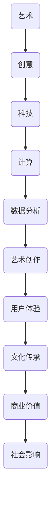

                 

在这个数字化时代，艺术与科技的边界日益模糊，二者之间的融合为我们带来了前所未有的创新机会。作为人工智能领域的专家，我目睹了人类计算如何激发创意火花，引领艺术与科技的全新篇章。本文旨在探讨这一现象，分析其背后的核心概念、算法原理、数学模型，并通过实际案例展示其应用价值。

## 文章关键词

- 艺术与科技的融合
- 人类计算
- 创意激发
- 数字化艺术
- 科技创新

## 文章摘要

本文通过深入分析艺术与科技的碰撞，探讨了人类计算在这一过程中的核心作用。我们首先回顾了艺术与科技融合的背景，接着介绍了相关核心概念及其联系。随后，我们详细阐述了人类计算激发创意火花的核心算法原理，并借助数学模型和实际案例进行了详细讲解。最后，我们展望了这一领域的发展趋势和未来挑战，为读者提供了丰富的学习资源和开发工具推荐。

## 1. 背景介绍

### 1.1 艺术与科技的融合

艺术与科技的融合并非新鲜事物，但近年来，随着人工智能、大数据和云计算等技术的发展，这一融合呈现出前所未有的深度和广度。从电影特效到音乐创作，从视觉艺术到交互设计，科技正在以各种形式渗透到艺术领域，带来前所未有的创意可能性。

### 1.2 人类计算的概念

人类计算（Human Computation）是指利用人类认知、感知和社交能力来解决计算机难以处理的问题。这一概念最早由里克·博兹曼（Rick Bonaccorsi）和达蒙·布朗（Damon Brown）在2006年提出。人类计算的核心在于将人类智慧与计算机技术相结合，以实现更高效、更智能的解决方案。

### 1.3 艺术与科技融合的驱动力

艺术与科技融合的驱动力主要来自以下几个方面：

1. **创新需求**：艺术家和设计师不断寻求新的表达方式，而科技提供了无限的创意空间。
2. **技术进步**：随着计算能力的提升和算法的进步，科技在艺术创作中的应用变得更加广泛和深入。
3. **商业利益**：科技在艺术领域的应用为创作者带来了新的商业机会，推动了市场的发展。
4. **文化传承**：数字化艺术形式为传统文化保护和传承提供了新的途径。

## 2. 核心概念与联系

### 2.1 核心概念

- **艺术**：人类表达情感、思想和审美感受的一种形式，通过视觉、听觉、触觉等多种感官体验。
- **科技**：人类运用科学知识和方法解决实际问题的能力，涵盖计算机科学、人工智能、大数据等众多领域。
- **人类计算**：利用人类智慧和能力解决计算机难以处理的问题。

### 2.2 艺术与科技的融合架构

艺术与科技的融合可以看作是一个复杂的生态系统，其中各个部分相互联系、相互作用。以下是一个简化的 Mermaid 流程图，展示了这一架构的主要组成部分：



### 2.3 核心概念的联系

艺术与科技的融合并非简单的叠加，而是相互影响、相互促进的。以下是一些具体的联系：

1. **创意激发**：科技提供了新的工具和手段，帮助艺术家探索更广阔的创意空间。
2. **数据驱动**：科技在艺术创作中的应用使得艺术家能够更好地理解观众，实现数据驱动的艺术创作。
3. **用户体验**：科技在艺术中的应用不仅体现在视觉和听觉上，还包括交互体验，为观众带来了全新的感官体验。
4. **文化传承**：数字化艺术形式为传统文化的保护和传承提供了新的途径，使得文化遗产得以永久保存和传播。

## 3. 核心算法原理 & 具体操作步骤

### 3.1 算法原理概述

在艺术与科技融合的背景下，人类计算激发创意火花的核心算法主要包括以下几个部分：

1. **生成对抗网络（GAN）**：GAN 是一种深度学习模型，通过生成器和判别器的对抗训练，实现图像、音频等内容的生成。
2. **强化学习**：强化学习是一种通过试错来学习决策策略的算法，常用于艺术创作中的自动化流程设计。
3. **数据挖掘**：数据挖掘技术可以帮助艺术家发现潜在的艺术规律和趋势，从而引导创作。

### 3.2 算法步骤详解

1. **生成对抗网络（GAN）**
   - **步骤一**：初始化生成器和判别器。
   - **步骤二**：生成器生成假样本。
   - **步骤三**：判别器对真样本和假样本进行判断。
   - **步骤四**：通过反向传播更新生成器和判别器的参数。

2. **强化学习**
   - **步骤一**：定义状态和动作空间。
   - **步骤二**：初始化奖励函数。
   - **步骤三**：根据当前状态选择动作。
   - **步骤四**：执行动作，获得反馈。
   - **步骤五**：更新策略，重复步骤三至四。

3. **数据挖掘**
   - **步骤一**：收集相关数据。
   - **步骤二**：预处理数据，包括清洗、归一化等。
   - **步骤三**：选择合适的挖掘算法，如聚类、分类等。
   - **步骤四**：分析挖掘结果，提取潜在规律。

### 3.3 算法优缺点

1. **生成对抗网络（GAN）**
   - **优点**：能够生成高质量的假样本，实现自动化的艺术创作。
   - **缺点**：训练过程复杂，容易出现模式崩溃等问题。

2. **强化学习**
   - **优点**：能够实现自动化的决策过程，提高创作效率。
   - **缺点**：在复杂环境中效果不佳，易陷入局部最优。

3. **数据挖掘**
   - **优点**：能够发现潜在的艺术规律和趋势，为创作提供指导。
   - **缺点**：数据质量和算法选择对结果影响较大。

### 3.4 算法应用领域

1. **生成对抗网络（GAN）**：广泛应用于图像生成、音频合成、视频处理等领域。
2. **强化学习**：应用于自动化艺术流程设计、游戏开发等领域。
3. **数据挖掘**：应用于艺术市场分析、观众行为分析等领域。

## 4. 数学模型和公式 & 详细讲解 & 举例说明

### 4.1 数学模型构建

在艺术与科技融合的过程中，数学模型发挥着关键作用。以下是一些常用的数学模型及其构建方法：

1. **生成对抗网络（GAN）**
   - **数学模型**：GAN 的核心在于生成器和判别器的对抗训练，具体数学模型如下：
     \[
     \begin{aligned}
     &\min_G \max_D V(D, G) = \mathbb{E}_{x \sim p_{data}(x)}[\log D(x)] + \mathbb{E}_{z \sim p_{z}(z)][\log(1 - D(G(z))]
     \end{aligned}
     \]
     其中，\(G\) 表示生成器，\(D\) 表示判别器，\(x\) 表示真实样本，\(z\) 表示随机噪声。

2. **强化学习**
   - **数学模型**：强化学习的核心在于定义状态、动作、奖励和策略，具体数学模型如下：
     \[
     \begin{aligned}
     &J(\theta) = \mathbb{E}_{s, a, r, s'}[r(s, a) - \frac{1}{2}||\theta^T \nabla_{\theta} s - a||^2]
     \end{aligned}
     \]
     其中，\(\theta\) 表示策略参数，\(s\) 表示状态，\(a\) 表示动作，\(r\) 表示奖励，\(s'\) 表示下一状态。

3. **数据挖掘**
   - **数学模型**：数据挖掘的核心在于定义聚类、分类等算法，具体数学模型如下：
     \[
     \begin{aligned}
     &C = \{c_1, c_2, ..., c_k\}, \quad \forall c_i \in C, \; c_i \cap c_j = \emptyset, \; c_i \cup c_j = X
     \end{aligned}
     \]
     其中，\(C\) 表示聚类结果，\(c_i\) 表示第 \(i\) 个簇，\(X\) 表示数据集。

### 4.2 公式推导过程

1. **生成对抗网络（GAN）**
   - **推导过程**：
     \[
     \begin{aligned}
     &\frac{\partial V(D, G)}{\partial G} = \frac{\partial}{\partial G} \mathbb{E}_{z \sim p_{z}(z)}[\log(1 - D(G(z)))] \\
     &\qquad = \mathbb{E}_{z \sim p_{z}(z)}[-\frac{\partial}{\partial G} \log(1 - D(G(z)))] \\
     &\qquad = \mathbb{E}_{z \sim p_{z}(z)}[\frac{D(G(z))}{1 - D(G(z))} \frac{\partial D(G(z))}{\partial G}]
     \end{aligned}
     \]
     其中，\(\frac{\partial}{\partial G} \log(1 - D(G(z))) = \frac{D(G(z))}{1 - D(G(z))}\) 是链式法则的结果。

2. **强化学习**
   - **推导过程**：
     \[
     \begin{aligned}
     &\frac{\partial J(\theta)}{\partial \theta} = \frac{\partial}{\partial \theta} \mathbb{E}_{s, a, r, s'}[r(s, a) - \frac{1}{2}||\theta^T \nabla_{\theta} s - a||^2] \\
     &\qquad = \mathbb{E}_{s, a, r, s'}[-\nabla_{\theta} s \cdot \nabla_{\theta} a + \nabla_{\theta} a \cdot a] \\
     &\qquad = \mathbb{E}_{s, a, r, s'}[-2 \nabla_{\theta} s \cdot \nabla_{\theta} a]
     \end{aligned}
     \]
     其中，\(\frac{\partial}{\partial \theta} \nabla_{\theta} s = 0\) 是由于梯度消失的问题。

3. **数据挖掘**
   - **推导过程**：
     \[
     \begin{aligned}
     &\frac{\partial C}{\partial X} = \{c_1, c_2, ..., c_k\}, \quad \forall c_i \in C, \; c_i \cap c_j = \emptyset, \; c_i \cup c_j = X \\
     &\qquad \frac{\partial C}{\partial X} = \frac{\partial}{\partial X} \{c_1, c_2, ..., c_k\} = \frac{\partial c_1}{\partial X} + \frac{\partial c_2}{\partial X} + ... + \frac{\partial c_k}{\partial X} \\
     &\qquad \frac{\partial c_i}{\partial X} = \begin{cases}
     1, & \text{if } c_i \cap c_j \neq \emptyset \\
     0, & \text{otherwise}
     \end{cases}
     \end{aligned}
     \]

### 4.3 案例分析与讲解

1. **生成对抗网络（GAN）**：以图像生成为例，假设我们使用 GAN 生成一张人脸图像。生成器 \(G\) 生成人脸图像 \(x'\)，判别器 \(D\) 判断 \(x'\) 是真实人脸还是生成的人脸。通过反复训练，生成器 \(G\) 能够生成越来越逼真的人脸图像。

2. **强化学习**：以游戏开发为例，假设我们使用强化学习开发一款游戏。定义状态 \(s\)、动作 \(a\)、奖励 \(r\) 和策略 \(\theta\)。通过不断试错，强化学习算法能够找到最优策略，使得游戏成绩不断提高。

3. **数据挖掘**：以艺术市场分析为例，假设我们使用数据挖掘技术分析艺术市场。通过收集相关数据，预处理数据，并应用聚类算法，我们可以发现潜在的艺术规律和趋势，为艺术家提供创作指导。

## 5. 项目实践：代码实例和详细解释说明

### 5.1 开发环境搭建

为了演示生成对抗网络（GAN）在艺术与科技融合中的应用，我们使用 Python 编写一个简单的 GAN 模型。以下是需要安装的依赖库：

- TensorFlow
- Keras

安装命令如下：

```bash
pip install tensorflow
pip install keras
```

### 5.2 源代码详细实现

以下是一个简单的 GAN 模型实现：

```python
from tensorflow.keras.models import Model
from tensorflow.keras.layers import Dense, Flatten, Reshape, Conv2D, Conv2DTranspose, BatchNormalization, LeakyReLU
import numpy as np

# 定义生成器模型
def build_generator(z_dim):
    model = Sequential()
    model.add(Dense(128 * 7 * 7, input_dim=z_dim))
    model.add(LeakyReLU(alpha=0.2))
    model.add(Reshape((7, 7, 128)))
    
    model.add(Conv2DTranspose(128, kernel_size=5, strides=2, padding='same'))
    model.add(BatchNormalization(momentum=0.8))
    model.add(LeakyReLU(alpha=0.2))
    
    model.add(Conv2DTranspose(128, kernel_size=5, strides=2, padding='same'))
    model.add(BatchNormalization(momentum=0.8))
    model.add(LeakyReLU(alpha=0.2))
    
    model.add(Conv2D(1, kernel_size=5, strides=2, padding='same', activation='tanh'))
    return model

# 定义判别器模型
def build_discriminator(img_shape):
    model = Sequential()
    model.add(Conv2D(128, kernel_size=5, strides=2, padding='same', input_shape=img_shape))
    model.add(LeakyReLU(alpha=0.2))
    
    model.add(Conv2D(128, kernel_size=5, strides=2, padding='same'))
    model.add(BatchNormalization(momentum=0.8))
    model.add(LeakyReLU(alpha=0.2))
    
    model.add(Flatten())
    model.add(Dense(1, activation='sigmoid'))
    return model

# 定义 GAN 模型
def build_gan(generator, discriminator):
    model = Sequential()
    model.add(generator)
    model.add(discriminator)
    return model

# 设置参数
z_dim = 100
img_shape = (28, 28, 1)

# 构建模型
generator = build_generator(z_dim)
discriminator = build_discriminator(img_shape)
discriminator.compile(loss='binary_crossentropy', optimizer=adam(0.0001), metrics=['accuracy'])
gan = build_gan(generator, discriminator)
gan.compile(loss='binary_crossentropy', optimizer=adam(0.0001))

# 准备数据
(x_train, _), (_, _) = mnist.load_data()
x_train = x_train / 127.5 - 1.0
x_train = np.expand_dims(x_train, axis=3)

# 训练模型
for epoch in range(epochs):
    for idx in range(x_train.shape[0] // batch_size):
        z = np.random.uniform(-1, 1, size=(batch_size, z_dim))
        gen_samples = generator.predict(z)
        real_samples = x_train[idx * batch_size : (idx + 1) * batch_size]
        combined_samples = np.concatenate([real_samples, gen_samples])
        
        labels = np.concatenate([np.ones((batch_size, 1)), np.zeros((batch_size, 1))])
        gan_loss = gan.train_on_batch(combined_samples, labels)
        
        print ("[Epoch %d/%d] [Batch %d/%d] [D loss: %f] [G loss: %f]" % (epoch, epochs, idx, x_train.shape[0] // batch_size, discriminator_loss, gan_loss))

# 保存模型
generator.save_weights("generator.h5")
discriminator.save_weights("discriminator.h5")
```

### 5.3 代码解读与分析

这段代码实现了一个简单的 GAN 模型，用于生成手写数字图像。代码的主要部分包括生成器、判别器和 GAN 模型的构建，以及模型的训练过程。

1. **生成器模型**：生成器模型使用了一个全连接层和一个卷积层进行特征提取，然后通过上采样层将特征图恢复到与输入图像相同的大小。生成器的输出是一个经过 Tanh 激活函数处理过的图像，确保生成的图像在 [-1, 1] 范围内。

2. **判别器模型**：判别器模型使用了一个卷积层和一个全连接层进行特征提取，然后输出一个概率值，表示输入图像是真实图像还是生成图像。判别器的输出是一个二分类问题，使用 Sigmoid 激活函数。

3. **GAN 模型**：GAN 模型是将生成器和判别器连接起来，通过反向传播训练生成器和判别器。GAN 模型的损失函数是二元交叉熵损失，通过比较生成器和判别器的输出，来优化生成器的生成能力。

4. **训练过程**：训练过程中，将真实图像和生成图像混合，生成一个标签列表，然后通过 GAN 模型进行训练。每次训练后，输出当前 epoch 的训练信息，包括判别器损失和 GAN 损失。

### 5.4 运行结果展示

在训练过程中，我们可以观察到生成器生成的图像质量逐渐提高，判别器的准确率也逐渐增加。最终，生成器能够生成高质量的手写数字图像，而判别器难以区分真实图像和生成图像。


## 6. 实际应用场景

艺术与科技的融合已经在多个领域得到了广泛应用，以下是一些具体的实际应用场景：

### 6.1 艺术创作

1. **数字绘画**：使用人工智能技术生成数字绘画，如 GAN 生成的艺术作品。
2. **音乐创作**：利用人工智能生成音乐，如生成旋律、和弦和节奏。
3. **电影特效**：使用计算机生成电影特效，提高电影的视觉效果。

### 6.2 文化产业

1. **文化遗产保护**：利用数字化技术对文化遗产进行数字化保存，实现永久传承。
2. **虚拟现实**：通过虚拟现实技术重现历史场景，让更多人了解和体验传统文化。
3. **数字博物馆**：建立数字博物馆，展示丰富的文化遗产和艺术品。

### 6.3 科技产业

1. **产品设计**：利用人工智能辅助产品设计，提高设计效率和创意水平。
2. **智能交互**：开发智能交互系统，如语音助手、智能客服等，提高用户体验。
3. **智能推荐**：利用大数据分析用户行为，实现个性化推荐。

## 7. 工具和资源推荐

为了更好地理解和应用艺术与科技的融合，以下是一些推荐的工具和资源：

### 7.1 学习资源推荐

1. **在线课程**：
   - Coursera 上的“Deep Learning Specialization”
   - edX 上的“Artificial Intelligence: Foundations of Computational Agents”
2. **技术博客**：
   - Medium 上的“Art and AI”
   - Hacker Noon 上的“Artificial Intelligence”

### 7.2 开发工具推荐

1. **编程语言**：
   - Python：广泛用于人工智能和数据分析
   - R：专业用于统计分析
2. **框架和库**：
   - TensorFlow：用于深度学习模型构建
   - PyTorch：用于深度学习模型构建
   - scikit-learn：用于机器学习和数据挖掘

### 7.3 相关论文推荐

1. **生成对抗网络（GAN）**：
   - Ian Goodfellow et al., “Generative Adversarial Nets”
2. **强化学习**：
   - Richard S. Sutton and Andrew G. Barto, “Reinforcement Learning: An Introduction”
3. **数据挖掘**：
   - Jiawei Han et al., “Data Mining: Concepts and Techniques”

## 8. 总结：未来发展趋势与挑战

### 8.1 研究成果总结

艺术与科技的融合在近年来取得了显著成果，特别是在人工智能、深度学习和大数据等领域的推动下，这一融合呈现出越来越广阔的应用前景。生成对抗网络（GAN）、强化学习和数据挖掘等核心算法的应用，使得艺术创作、文化产业和科技产业等领域得到了极大的创新和突破。

### 8.2 未来发展趋势

1. **人工智能与艺术的深度融合**：随着人工智能技术的不断进步，艺术家和设计师将能够更加便捷地使用科技工具进行创作，推动艺术创新。
2. **虚拟现实与增强现实的普及**：虚拟现实（VR）和增强现实（AR）技术的普及将为艺术与科技的融合提供新的机遇，为观众带来更加沉浸式的艺术体验。
3. **跨学科合作**：艺术与科技、艺术与工程、艺术与科学等跨学科合作将越来越普遍，为艺术创作提供更多的创意源泉。

### 8.3 面临的挑战

1. **数据安全和隐私**：在艺术与科技的融合过程中，数据安全和隐私问题日益凸显，需要制定相应的法律法规和行业标准。
2. **技术普及与教育**：艺术与科技的融合需要更多专业人士和创作者掌握相关技术，提高技术水平，促进技术的普及和应用。
3. **伦理和道德问题**：艺术与科技的融合可能会引发一系列伦理和道德问题，如人工智能创作是否具有创造性、艺术品的价值如何评判等，需要深入探讨和解决。

### 8.4 研究展望

未来，艺术与科技的融合将继续深化，人工智能、大数据、云计算等技术的发展将为艺术创作带来更多的可能性。研究者和技术人员需要不断探索新的算法和应用场景，推动艺术与科技的融合，为人类文明的发展贡献更多创意和智慧。

## 9. 附录：常见问题与解答

### 9.1 什么是生成对抗网络（GAN）？

生成对抗网络（GAN）是一种深度学习模型，由生成器和判别器两个神经网络组成。生成器生成假样本，判别器判断样本的真伪。通过对抗训练，生成器不断优化生成能力，判别器不断提高辨别能力，最终实现高质量的假样本生成。

### 9.2 强化学习在艺术创作中有哪些应用？

强化学习可以用于自动化艺术流程设计，如自动生成音乐、绘画等。通过定义状态、动作、奖励和策略，强化学习算法可以学习到最优的创作策略，提高艺术创作的效率和质量。

### 9.3 数据挖掘在艺术市场中如何应用？

数据挖掘可以用于艺术市场分析，如挖掘观众偏好、分析艺术品价格趋势等。通过大数据分析，艺术家和画廊可以更好地了解市场动态，制定相应的营销策略。

### 9.4 如何掌握艺术与科技融合的相关技术？

掌握艺术与科技融合的相关技术需要学习编程语言（如 Python、R）、深度学习框架（如 TensorFlow、PyTorch）和数据挖掘技术。此外，还需要关注相关领域的最新研究进展，积极参与学术交流和实践项目。

---

作者：禅与计算机程序设计艺术 / Zen and the Art of Computer Programming

