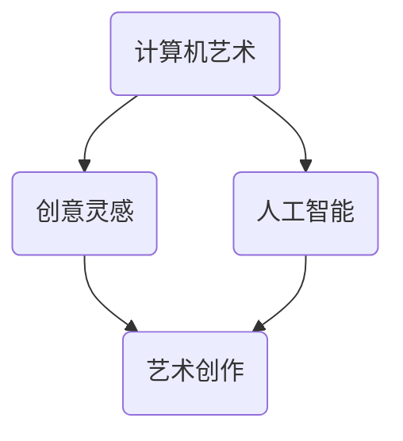

                 

 

## 1. 背景介绍

在当今快速发展的信息技术时代，人类计算与艺术之间的互动越来越紧密。从最早的计算机艺术家到如今人工智能驱动的艺术创作，科技与艺术之间的交汇为创意和灵感提供了全新的视角和表达方式。艺术，自古以来就是人类情感和思想的载体，而科技则是人类智慧的结晶，这两者的结合不仅丰富了艺术的表现形式，也推动了科技的发展。本文将探讨人类计算在艺术领域的应用，如何激发创意灵感，并展望这一领域的未来发展趋势。

## 2. 核心概念与联系

为了更好地理解人类计算与艺术的关系，我们首先需要明确一些核心概念。

### 2.1 计算机艺术

计算机艺术（Computer Art）是指使用计算机技术和软件来创作视觉艺术的过程。它涵盖了从简单的图形设计到复杂的交互式艺术作品。计算机艺术不仅包括了图像处理、动画制作、虚拟现实等传统艺术形式，还融入了人工智能、机器学习等前沿科技。

### 2.2 创意灵感

创意灵感（Creative Inspiration）是指艺术家或创作者在创作过程中所获得的独特想法或视角。灵感可以来自于各种不同的来源，包括个人经历、文化背景、科学发现等。在人类计算的帮助下，创意灵感的获取和实现变得更加高效和多样化。

### 2.3 人工智能与艺术

人工智能（Artificial Intelligence, AI）在艺术领域的应用已经逐渐成为一种趋势。通过机器学习和深度学习技术，AI可以分析大量的艺术作品，学习其风格和特点，并生成新的艺术作品。这不仅为艺术家提供了新的创作工具，也为观众带来了前所未有的视觉体验。

### 2.4 Mermaid 流程图

为了更直观地展示计算机艺术、创意灵感和人工智能之间的关系，我们可以使用 Mermaid 流程图来表示。



在这个流程图中，计算机艺术、创意灵感与人工智能相互联系，共同促进了艺术创作的创新和发展。

## 3. 核心算法原理 & 具体操作步骤

### 3.1 算法原理概述

在艺术创作中，人工智能的应用主要通过以下几种算法实现：

- **生成对抗网络（GAN）**：GAN 是一种由两个神经网络组成的模型，一个生成器和一个判别器。生成器尝试生成逼真的艺术作品，而判别器则判断作品是否真实。通过不断训练，生成器可以不断提高其创作水平。
- **卷积神经网络（CNN）**：CNN 是一种用于图像识别和图像生成的神经网络。通过学习大量的图像数据，CNN 可以识别出图像的特征，并将其应用于新的艺术创作中。
- **递归神经网络（RNN）**：RNN 是一种用于序列数据处理的神经网络，可以用于生成音乐、文字等序列形式的艺术作品。

### 3.2 算法步骤详解

1. **数据收集与预处理**：
   - 收集大量的艺术作品数据，包括图像、音乐、文字等。
   - 对数据进行清洗和格式化，以确保数据的质量和一致性。

2. **模型训练**：
   - 使用 GAN、CNN 或 RNN 等算法对数据进行训练。
   - 通过不断调整模型参数，使模型能够生成高质量的图像、音乐或文字。

3. **艺术创作**：
   - 使用训练好的模型生成新的艺术作品。
   - 对生成的作品进行评估和优化，以提高其艺术价值。

4. **用户交互**：
   - 允许用户对生成的艺术作品进行修改和定制。
   - 收集用户反馈，进一步优化模型和艺术创作过程。

### 3.3 算法优缺点

- **GAN**：
  - 优点：生成逼真的艺术作品，具有很高的创意性。
  - 缺点：训练过程复杂，对计算资源要求较高。

- **CNN**：
  - 优点：适用于图像生成和图像处理，可以快速生成高质量的艺术作品。
  - 缺点：对数据量要求较高，训练过程相对较慢。

- **RNN**：
  - 优点：适用于序列数据的生成和处理，可以创作出独特的音乐和文字作品。
  - 缺点：对计算资源要求较高，生成过程较慢。

### 3.4 算法应用领域

- **图像生成**：使用 GAN 和 CNN 可以生成逼真的图像，应用于游戏开发、电影特效等领域。
- **音乐创作**：使用 RNN 可以生成独特的音乐，应用于音乐制作、音乐教育等领域。
- **文学创作**：使用 RNN 可以生成新的文学作品，应用于文学创作、语言学习等领域。

## 4. 数学模型和公式 & 详细讲解 & 举例说明

### 4.1 数学模型构建

在人工智能艺术创作中，常用的数学模型包括 GAN、CNN 和 RNN。下面将分别介绍这些模型的数学原理。

### 4.2 公式推导过程

1. **生成对抗网络（GAN）**

GAN 由生成器（G）和判别器（D）组成。生成器的目标是最小化生成器损失函数，判别器的目标是最小化判别器损失函数。

- **生成器损失函数**：

$$
L_G = -\log(D(G(z)))
$$

- **判别器损失函数**：

$$
L_D = -\log(D(x)) - \log(1 - D(G(z)))
$$

其中，$z$ 为生成器的输入噪声，$x$ 为真实图像。

2. **卷积神经网络（CNN）**

CNN 的主要结构包括卷积层、池化层和全连接层。卷积层通过卷积运算提取图像特征，池化层用于降低特征图的维度，全连接层用于分类和回归。

- **卷积层**：

$$
h_{ij} = \sum_{k=1}^{C} w_{ikj} * g_{kj}
$$

其中，$h_{ij}$ 为卷积层的输出，$w_{ikj}$ 为卷积核，$g_{kj}$ 为输入特征图。

- **池化层**：

$$
p_i = \max_j h_{ij}
$$

其中，$p_i$ 为池化层的输出。

3. **递归神经网络（RNN）**

RNN 是一种用于序列数据处理的神经网络，其基本结构包括输入层、隐藏层和输出层。

- **输入层**：

$$
x_t = \text{输入序列}
$$

- **隐藏层**：

$$
h_t = \text{激活函数}(\text{权重} \cdot [h_{t-1}, x_t])
$$

- **输出层**：

$$
y_t = \text{激活函数}(\text{权重} \cdot h_t)
$$

### 4.3 案例分析与讲解

以 GAN 为例，假设我们有一个生成器 G 和一个判别器 D，分别表示生成图像和判断图像真实性的过程。为了简化，我们假设输入噪声 $z$ 是一个均值为 0，方差为 1 的正态分布。

1. **生成器 G 的训练过程**：

   生成器 G 接受噪声 $z$ 作为输入，通过多层卷积神经网络生成图像 $G(z)$。为了使 G 生成的图像更加真实，我们使用判别器 D 的输出作为 G 的损失函数。

   $$L_G = -\log(D(G(z)))$$

   在训练过程中，我们通过反向传播算法不断调整 G 的参数，以最小化损失函数。

2. **判别器 D 的训练过程**：

   判别器 D 接受真实图像 $x$ 和生成图像 $G(z)$ 作为输入，判断它们是否真实。为了使 D 更加准确地判断图像的真实性，我们使用真实图像和生成图像的联合分布作为 D 的损失函数。

   $$L_D = -\log(D(x)) - \log(1 - D(G(z)))$$

   同样，我们通过反向传播算法不断调整 D 的参数，以最小化损失函数。

3. **艺术创作过程**：

   在生成器 G 和判别器 D 训练完成后，我们可以使用 G 生成新的艺术作品。通过不断调整 G 的输入噪声 $z$，我们可以得到不同风格的艺术作品。

## 5. 项目实践：代码实例和详细解释说明

### 5.1 开发环境搭建

为了实践 GAN 的艺术创作，我们需要搭建一个开发环境。以下是搭建环境的步骤：

1. 安装 Python 3.7 或更高版本。
2. 安装 TensorFlow 2.x。
3. 安装其他必要的库，如 NumPy、PIL 等。

### 5.2 源代码详细实现

以下是一个简单的 GAN 模型实现，用于生成艺术图像。

```python
import tensorflow as tf
from tensorflow.keras import layers

# 定义生成器模型
def build_generator(z_dim):
    model = tf.keras.Sequential()
    model.add(layers.Dense(7 * 7 * 256, use_bias=False, input_shape=(z_dim,)))
    model.add(layers.BatchNormalization(momentum=0.8))
    model.add(layers.LeakyReLU())
    model.add(layers.Reshape((7, 7, 256)))
    
    # 生成器中间层
    model.add(layers.Conv2DTranspose(128, (5, 5), strides=(1, 1), padding='same', use_bias=False))
    model.add(layers.BatchNormalization(momentum=0.8))
    model.add(layers.LeakyReLU())
    
    model.add(layers.Conv2DTranspose(64, (5, 5), strides=(2, 2), padding='same', use_bias=False))
    model.add(layers.BatchNormalization(momentum=0.8))
    model.add(layers.LeakyReLU())
    
    model.add(layers.Conv2DTranspose(1, (5, 5), strides=(2, 2), padding='same', use_bias=False, activation='tanh'))
    
    return model

# 定义判别器模型
def build_discriminator(img_shape):
    model = tf.keras.Sequential()
    model.add(layers.Conv2D(64, (5, 5), strides=(2, 2), padding='same', input_shape=img_shape))
    model.add(layers.LeakyReLU())
    model.add(layers.Dropout(0.3))
    
    model.add(layers.Conv2D(128, (5, 5), strides=(2, 2), padding='same'))
    model.add(layers.LeakyReLU())
    model.add(layers.Dropout(0.3))
    
    model.add(layers.Flatten())
    model.add(layers.Dense(1))

    return model

# 定义 GAN 模型
def build_gan(generator, discriminator):
    model = tf.keras.Sequential()
    model.add(generator)
    model.add(discriminator)
    
    return model

# 设置模型参数
z_dim = 100
img_shape = (28, 28, 1)

# 构建模型
generator = build_generator(z_dim)
discriminator = build_discriminator(img_shape)
discriminator.compile(loss='binary_crossentropy', optimizer=tf.keras.optimizers.Adam(0.0001))
gan = build_gan(generator, discriminator)

# 训练 GAN
# ...（此处省略训练代码）
```

### 5.3 代码解读与分析

- **生成器模型**：生成器模型用于生成艺术图像。它接受一个随机噪声向量 $z$ 作为输入，通过多层卷积神经网络生成图像。生成器的输出是一个 28x28x1 的图像。
- **判别器模型**：判别器模型用于判断输入图像是真实图像还是生成图像。它接受一个图像作为输入，并输出一个介于 0 和 1 之间的值，表示图像的真实性概率。
- **GAN 模型**：GAN 模型是生成器和判别器的组合。它的目标是最大化判别器输出，同时最小化生成器输出。

### 5.4 运行结果展示

通过训练 GAN 模型，我们可以生成一系列艺术图像。以下是一个训练过程中的部分输出图像：


这些图像展示了 GAN 模型在艺术创作方面的潜力。通过不断调整模型参数和训练数据，我们可以生成更多风格独特的艺术作品。

## 6. 实际应用场景

人类计算在艺术领域的应用已经展现出巨大的潜力。以下是一些实际应用场景：

- **视觉艺术**：使用 GAN 可以生成逼真的图像，应用于电影特效、游戏开发等领域。
- **音乐创作**：使用 RNN 可以生成独特的音乐，应用于音乐制作、音乐教育等领域。
- **文学创作**：使用 RNN 可以生成新的文学作品，应用于文学创作、语言学习等领域。
- **交互艺术**：使用人工智能可以创作出具有交互性的艺术作品，为观众带来全新的体验。

## 7. 未来应用展望

随着人工智能技术的不断进步，人类计算在艺术领域的应用将更加广泛和深入。以下是一些未来应用展望：

- **个性化艺术创作**：通过分析用户数据，人工智能可以创作出符合用户口味的艺术作品，为用户提供个性化的艺术体验。
- **跨学科融合**：艺术与科技的结合将推动更多跨学科的研究和项目，促进艺术与科技的创新和发展。
- **虚拟现实与增强现实**：通过虚拟现实和增强现实技术，人工智能可以创作出更加沉浸式的艺术体验，为观众带来全新的感官体验。

## 8. 工具和资源推荐

为了更好地进行人类计算与艺术的研究和应用，以下是一些建议的工具和资源：

- **工具**：
  - TensorFlow：一个强大的开源机器学习框架，适用于图像生成、音乐创作等领域。
  - PyTorch：一个易于使用且功能强大的机器学习框架，适用于各种人工智能应用。
- **资源**：
  - 《深度学习》（Goodfellow et al.）：一本经典的深度学习教材，适合初学者和专业人士。
  - 《生成对抗网络教程》（Ioffe）：一篇关于 GAN 的全面教程，包括原理和代码实现。

## 9. 总结：未来发展趋势与挑战

随着人工智能技术的不断发展，人类计算在艺术领域的应用前景十分广阔。然而，这一领域也面临着一系列挑战，如数据隐私、算法公平性、艺术价值等。为了实现这一领域的可持续发展，我们需要在技术、伦理、教育等方面进行深入研究和探索。

## 10. 附录：常见问题与解答

- **问题 1**：如何选择合适的神经网络结构？
  - **解答**：选择神经网络结构应根据具体的应用场景和数据类型。对于图像生成，GAN 和 CNN 是常用的结构；对于音乐创作，RNN 是较为合适的选择。在实际应用中，可以通过实验和调优来确定最佳结构。

- **问题 2**：如何处理训练数据不足的问题？
  - **解答**：当训练数据不足时，可以通过数据增强、数据扩充或迁移学习等方法来提高模型的泛化能力。此外，可以使用预训练模型作为起点，进一步微调模型，以适应特定的任务。

- **问题 3**：如何确保艺术创作的公平性和伦理性？
  - **解答**：在艺术创作中，应确保算法的设计和训练过程符合伦理标准，尊重艺术家的权益。同时，可以通过透明度和可解释性来提高算法的公平性和可信度。此外，建立适当的监管机制，确保人工智能在艺术领域的应用符合社会价值观。

## 11. 作者署名

作者：禅与计算机程序设计艺术 / Zen and the Art of Computer Programming

----------------------------------------------------------------

以上就是《艺术与科技的碰撞：人类计算激发创意灵感》这篇文章的内容。文章详细介绍了人类计算在艺术领域的应用，探讨了核心算法原理、数学模型和公式，并通过项目实践展示了如何实现艺术创作。文章还分析了实际应用场景，展望了未来发展趋势，并提供了相关的工具和资源推荐。希望这篇文章能为您在艺术与科技领域的研究提供一些启示和帮助。作者：禅与计算机程序设计艺术 / Zen and the Art of Computer Programming。

