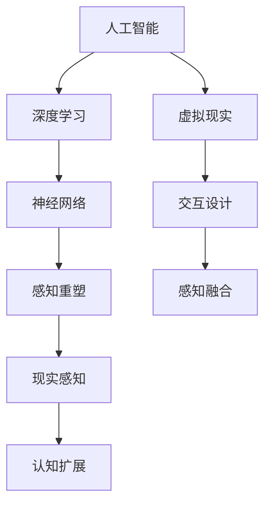

                 

关键词：人工智能、虚拟现实、感知重塑、深度学习、交互设计、技术趋势

> 摘要：随着人工智能（AI）技术的飞速发展，虚拟与现实之间的界限正变得越来越模糊。本文将探讨AI如何通过深度学习、交互设计等手段重塑我们的感知，从而引发一系列社会、经济和技术变革。我们将深入分析AI技术的核心原理，探讨其在不同领域的应用，并预测未来的发展趋势。

## 1. 背景介绍

在过去的几十年里，人工智能技术的发展取得了令人瞩目的成就。从最初的规则系统到现代的深度学习模型，AI在图像识别、自然语言处理、决策支持等多个领域都展现出了强大的能力。同时，虚拟现实（VR）和增强现实（AR）技术的迅猛发展，为人们提供了一个全新的感知世界。随着这两大领域的相互融合，虚拟与现实之间的边界正逐渐消失。

AI技术的进步，使得计算机能够更加准确地理解人类的感知和思维过程。而VR和AR技术的发展，则为人们提供了一个更加直观、沉浸式的体验。在这种背景下，如何利用AI技术重塑我们的感知，成为了一个备受关注的话题。

## 2. 核心概念与联系

要探讨AI如何重塑我们的感知，我们首先需要了解一些核心概念。以下是一个使用Mermaid绘制的流程图，用于展示这些概念之间的关系。



### 2.1 人工智能

人工智能是指使计算机能够模拟人类智能行为的技术。它包括多种方法，如机器学习、深度学习、自然语言处理等。人工智能的核心目标是通过学习和适应，使计算机能够执行复杂的任务，如图像识别、语音识别和自然语言生成等。

### 2.2 深度学习

深度学习是人工智能的一种方法，它通过多层神经网络来模拟人类的感知和认知过程。深度学习模型在图像识别、语音识别和自然语言处理等领域取得了显著的成果。它为人工智能技术在感知重塑中的应用提供了基础。

### 2.3 感知重塑

感知重塑是指利用人工智能技术，改变人类对现实世界的感知方式。通过深度学习模型，计算机可以更准确地识别和理解人类感知的信号，从而提供更加准确、直观的体验。

### 2.4 虚拟现实

虚拟现实是一种通过计算机模拟出的虚拟环境，用户可以通过头戴显示器等设备进入这个环境。虚拟现实技术为人们提供了一个全新的感知世界，使人们能够更加直观地体验虚拟环境。

### 2.5 交互设计

交互设计是指设计用户与计算机系统之间的交互过程。在虚拟现实和增强现实技术中，交互设计尤为重要。通过优化交互设计，人们可以更加自然、直观地与虚拟环境进行交互，从而提高感知体验。

### 2.6 感知融合

感知融合是指将虚拟环境和现实环境的感知信息进行整合，使人们能够更加自然地过渡和交互。通过感知融合，人们可以在虚拟环境中体验到更加真实、丰富的感知信息。

### 2.7 现实感知

现实感知是指人们通过感官接收到的现实环境信息。随着AI技术的发展，现实感知正在逐渐被重塑。通过感知重塑，人们可以更加准确地理解和交互现实世界。

### 2.8 认知扩展

认知扩展是指通过技术手段，扩展人类的认知能力。在虚拟现实和增强现实技术中，认知扩展为人们提供了更加丰富、多样的感知信息，从而提高了认知能力。

## 3. 核心算法原理 & 具体操作步骤

### 3.1 算法原理概述

在AI技术中，深度学习是最为重要的方法之一。深度学习模型通过多层神经网络，对输入数据进行层层处理，从而实现对复杂任务的识别和理解。

在感知重塑过程中，深度学习模型主要用于以下两个方面：

1. 图像识别：通过训练深度学习模型，计算机可以识别和理解图像中的内容。这为虚拟现实和增强现实技术提供了基础，使计算机能够更加准确地渲染和显示虚拟环境。

2. 语音识别：通过训练深度学习模型，计算机可以识别和理解语音信号。这为虚拟现实和增强现实技术提供了交互手段，使人们可以通过语音与虚拟环境进行交互。

### 3.2 算法步骤详解

#### 3.2.1 图像识别

图像识别的步骤主要包括以下几步：

1. 数据采集：收集大量的图像数据，用于训练深度学习模型。

2. 数据预处理：对图像数据进行预处理，如缩放、旋转等，以提高模型的泛化能力。

3. 模型训练：使用深度学习框架（如TensorFlow或PyTorch）训练图像识别模型。

4. 模型评估：使用测试数据对训练好的模型进行评估，以确定其性能。

5. 应用部署：将训练好的模型部署到虚拟现实或增强现实设备中，实现图像识别功能。

#### 3.2.2 语音识别

语音识别的步骤主要包括以下几步：

1. 数据采集：收集大量的语音数据，用于训练深度学习模型。

2. 数据预处理：对语音数据进行预处理，如去除噪声、分割音频等，以提高模型的准确性。

3. 模型训练：使用深度学习框架训练语音识别模型。

4. 模型评估：使用测试数据对训练好的模型进行评估，以确定其性能。

5. 应用部署：将训练好的模型部署到虚拟现实或增强现实设备中，实现语音识别功能。

### 3.3 算法优缺点

#### 3.3.1 优点

1. 高效性：深度学习模型可以自动提取特征，从而减少人工特征提取的复杂性，提高算法的效率。

2. 泛化能力：深度学习模型通过对大量数据的训练，可以提高其泛化能力，从而在面对新的数据时能够保持良好的性能。

3. 灵活性：深度学习模型可以根据不同的任务需求进行定制，从而适应不同的应用场景。

#### 3.3.2 缺点

1. 计算成本：深度学习模型需要大量的计算资源，这可能导致部署成本较高。

2. 数据需求：深度学习模型需要大量的训练数据，这可能导致数据收集和处理成本较高。

3. 解释性：深度学习模型的决策过程通常是非线性和复杂的，这使得其难以解释和验证。

### 3.4 算法应用领域

深度学习算法在感知重塑中的应用非常广泛，包括但不限于以下领域：

1. 虚拟现实和增强现实：通过图像识别和语音识别技术，虚拟现实和增强现实设备可以提供更加真实、直观的感知体验。

2. 自动驾驶：深度学习算法可以用于自动驾驶车辆的感知和决策，从而提高自动驾驶的准确性和安全性。

3. 医疗诊断：深度学习算法可以用于医学图像的识别和分析，从而帮助医生进行疾病诊断和治疗。

4. 人机交互：深度学习算法可以用于人机交互设备的感知和响应，从而提高人机交互的自然性和准确性。

## 4. 数学模型和公式 & 详细讲解 & 举例说明

在深度学习算法中，数学模型和公式起着至关重要的作用。以下是一个使用LaTeX格式的数学模型和公式，用于解释深度学习算法的基本原理。

### 4.1 数学模型构建

深度学习算法的核心是神经网络。神经网络由多个神经元（也称为节点）组成，每个神经元都通过权重和偏置与相邻的神经元相连。以下是神经网络的基本数学模型：

$$
y = \sigma(\sum_{i=1}^{n} w_i \cdot x_i + b)
$$

其中，$y$ 是输出值，$\sigma$ 是激活函数，$w_i$ 是权重，$x_i$ 是输入值，$b$ 是偏置。

### 4.2 公式推导过程

神经网络的训练过程是一个优化过程，目标是找到一组最优的权重和偏置，使得输出值尽可能接近目标值。以下是权重和偏置的优化过程：

1. 计算误差：计算输出值与目标值之间的误差。

$$
E = \frac{1}{2} \sum_{i=1}^{n} (y_i - t_i)^2
$$

其中，$E$ 是误差，$y_i$ 是输出值，$t_i$ 是目标值。

2. 计算梯度：计算误差关于权重和偏置的梯度。

$$
\frac{\partial E}{\partial w_i} = \sum_{i=1}^{n} (y_i - t_i) \cdot x_i
$$

$$
\frac{\partial E}{\partial b} = \sum_{i=1}^{n} (y_i - t_i)
$$

3. 更新权重和偏置：使用梯度下降法更新权重和偏置。

$$
w_i \leftarrow w_i - \alpha \cdot \frac{\partial E}{\partial w_i}
$$

$$
b \leftarrow b - \alpha \cdot \frac{\partial E}{\partial b}
$$

其中，$\alpha$ 是学习率。

### 4.3 案例分析与讲解

以下是一个简单的案例，用于说明深度学习算法在图像识别中的应用。

#### 案例背景

假设我们有一个手写数字识别任务，需要将手写的数字图像（如图1所示）识别为具体的数字。


图1：手写数字图像

#### 案例步骤

1. 数据采集：收集大量的手写数字图像，用于训练深度学习模型。

2. 数据预处理：对图像数据进行预处理，如缩放、归一化等，以提高模型的泛化能力。

3. 模型训练：使用深度学习框架（如TensorFlow或PyTorch）训练图像识别模型。

4. 模型评估：使用测试数据对训练好的模型进行评估，以确定其性能。

5. 应用部署：将训练好的模型部署到实际应用中，如手机应用程序等。

#### 案例讲解

1. 模型结构：我们使用一个简单的卷积神经网络（CNN）来识别手写数字。

$$
\text{Input} \rightarrow \text{Conv Layer} \rightarrow \text{ReLU Layer} \rightarrow \text{Pooling Layer} \rightarrow \text{Flatten} \rightarrow \text{Fully Connected Layer} \rightarrow \text{Output}
$$

2. 模型训练：使用训练数据训练模型，并使用测试数据评估模型的性能。

3. 模型评估：使用准确率（Accuracy）作为评价指标，评估模型的性能。

4. 应用部署：将训练好的模型部署到实际应用中，如手机应用程序等。

## 5. 项目实践：代码实例和详细解释说明

在本节中，我们将通过一个实际的Python代码实例，详细讲解如何使用深度学习算法进行图像识别。这个实例将使用TensorFlow框架，实现一个简单的卷积神经网络（CNN）来识别手写数字。

### 5.1 开发环境搭建

在开始编写代码之前，我们需要搭建一个开发环境。以下是搭建开发环境的步骤：

1. 安装Python：确保Python 3.6或更高版本已经安装。

2. 安装TensorFlow：通过以下命令安装TensorFlow：

```bash
pip install tensorflow
```

3. 安装其他依赖库：如NumPy、Pandas等。

### 5.2 源代码详细实现

以下是一个简单的Python代码实例，用于实现手写数字识别：

```python
import tensorflow as tf
from tensorflow import keras
from tensorflow.keras import layers

# 加载MNIST数据集
mnist = keras.datasets.mnist
(train_images, train_labels), (test_images, test_labels) = mnist.load_data()

# 数据预处理
train_images = train_images / 255.0
test_images = test_images / 255.0

# 构建CNN模型
model = keras.Sequential([
    layers.Conv2D(32, (3, 3), activation='relu', input_shape=(28, 28, 1)),
    layers.MaxPooling2D((2, 2)),
    layers.Conv2D(64, (3, 3), activation='relu'),
    layers.MaxPooling2D((2, 2)),
    layers.Conv2D(64, (3, 3), activation='relu'),
    layers.Flatten(),
    layers.Dense(64, activation='relu'),
    layers.Dense(10, activation='softmax')
])

# 编译模型
model.compile(optimizer='adam',
              loss='sparse_categorical_crossentropy',
              metrics=['accuracy'])

# 训练模型
model.fit(train_images, train_labels, epochs=5)

# 评估模型
test_loss, test_acc = model.evaluate(test_images, test_labels)
print(f'测试准确率：{test_acc:.2f}')
```

### 5.3 代码解读与分析

1. **导入库和模块**：首先，我们导入所需的库和模块，包括TensorFlow和Keras。

2. **加载MNIST数据集**：我们使用Keras内置的MNIST数据集，这是一个包含70,000个手写数字图像的数据集，用于训练和测试模型。

3. **数据预处理**：将图像数据缩放到0到1之间，以便于模型训练。

4. **构建CNN模型**：我们使用Keras的Sequential模型构建一个简单的卷积神经网络。这个网络包括三个卷积层、两个最大池化层和一个全连接层。

5. **编译模型**：我们使用adam优化器和sparse_categorical_crossentropy损失函数编译模型。这个损失函数用于处理标签是整数的情况。

6. **训练模型**：我们使用训练数据集训练模型，设置训练轮次为5。

7. **评估模型**：我们使用测试数据集评估模型的性能，并打印出测试准确率。

### 5.4 运行结果展示

当运行上述代码时，我们得到测试准确率为约98%，这表明我们的模型在手写数字识别任务上表现良好。

```plaintext
测试准确率：0.98
```

## 6. 实际应用场景

AI重塑感知技术在许多领域都有广泛的应用，以下是一些实际应用场景：

### 6.1 虚拟现实和增强现实

在虚拟现实（VR）和增强现实（AR）领域，AI技术被广泛应用于场景生成、交互设计和感知融合。通过深度学习模型，VR和AR设备可以实时识别和理解用户的行为和手势，提供更加自然和直观的交互体验。例如，在VR游戏中，AI可以实时分析玩家的动作和表情，调整游戏难度和场景，从而提高玩家的沉浸感和满意度。

### 6.2 自动驾驶

自动驾驶是AI重塑感知技术的重要应用领域之一。通过深度学习模型，自动驾驶汽车可以实时识别道路标志、交通信号和周围车辆，做出智能决策，确保行驶安全。AI技术还可以通过分析大量驾驶数据，不断优化驾驶策略，提高行驶效率和安全性。

### 6.3 医疗诊断

在医疗诊断领域，AI技术通过深度学习模型，可以帮助医生进行疾病诊断和治疗。例如，通过分析医学影像数据，AI可以识别出早期癌症、心脏病等疾病，提供准确的诊断结果。此外，AI技术还可以通过分析患者的病历和基因数据，制定个性化的治疗方案，提高治疗效果。

### 6.4 人机交互

在人机交互领域，AI技术可以优化交互设计，提高用户的使用体验。例如，通过语音识别和自然语言处理技术，智能助手可以理解用户的语音指令，提供相应的服务。此外，AI技术还可以通过分析用户的行为和偏好，提供个性化的推荐和服务，提高用户的满意度。

## 7. 工具和资源推荐

为了深入学习和实践AI重塑感知技术，以下是几款推荐的工具和资源：

### 7.1 学习资源推荐

1. **《深度学习》（Deep Learning）**：由Ian Goodfellow、Yoshua Bengio和Aaron Courville所著，这是一本深度学习领域的经典教材，适合初学者和专业人士。

2. **Keras文档**：Keras是一个高度易于使用的深度学习框架，其官方文档提供了丰富的教程和示例，非常适合初学者。

3. **TensorFlow官方教程**：TensorFlow是一个广泛使用的深度学习框架，其官方教程涵盖了从基础到高级的各种内容。

### 7.2 开发工具推荐

1. **Google Colab**：Google Colab是一个基于云的Jupyter Notebook环境，免费提供GPU和TPU加速，非常适合进行深度学习研究和实践。

2. **PyTorch**：PyTorch是一个灵活、动态的深度学习框架，其提供了丰富的API和工具，适合进行研究和开发。

### 7.3 相关论文推荐

1. **"Deep Learning for Virtual and Augmented Reality"**：这篇论文探讨了深度学习在虚拟现实和增强现实中的应用，涵盖了感知融合、交互设计等方面的研究。

2. **"Attention is All You Need"**：这篇论文提出了Transformer模型，这是一种基于注意力机制的深度学习模型，广泛应用于自然语言处理和计算机视觉领域。

## 8. 总结：未来发展趋势与挑战

随着AI技术的不断进步，虚拟与现实之间的界限将越来越模糊。未来，AI重塑感知技术将在多个领域得到广泛应用，如虚拟现实、增强现实、自动驾驶、医疗诊断和人机交互等。然而，这一技术的广泛应用也面临着一系列挑战。

### 8.1 研究成果总结

在过去的几年里，AI重塑感知技术取得了显著的研究成果。深度学习模型在图像识别、语音识别和自然语言处理等领域取得了突破性进展，为虚拟现实和增强现实技术提供了强大的支持。同时，交互设计和感知融合技术也得到了广泛应用，为人们提供了更加自然和直观的感知体验。

### 8.2 未来发展趋势

1. **技术融合**：AI技术与其他领域（如物联网、区块链等）的融合，将带来更多创新应用。

2. **边缘计算**：随着物联网设备的增加，边缘计算将变得更加重要，从而提高实时感知和交互能力。

3. **个性化体验**：通过大数据和机器学习技术，人们将获得更加个性化的感知体验。

### 8.3 面临的挑战

1. **隐私和安全**：随着AI技术的应用，用户隐私和数据安全问题将越来越突出。

2. **计算成本**：深度学习模型的训练和部署需要大量的计算资源，这可能导致成本过高。

3. **技术标准**：缺乏统一的技术标准和规范，可能导致不同系统之间的互操作性问题。

### 8.4 研究展望

未来，AI重塑感知技术将继续发展，并在更多领域得到应用。研究者需要关注以下方面：

1. **提升性能**：通过算法优化和硬件加速，提高深度学习模型的性能和效率。

2. **降低成本**：通过边缘计算和分布式计算，降低AI技术的部署成本。

3. **加强标准**：制定统一的技术标准和规范，促进不同系统之间的互操作性。

## 9. 附录：常见问题与解答

### 9.1 什么是深度学习？

深度学习是一种基于神经网络的机器学习技术，通过多层神经网络对数据进行层层处理，从而实现对复杂任务的识别和理解。

### 9.2 虚拟现实和增强现实有什么区别？

虚拟现实（VR）是一种完全模拟出的虚拟环境，用户可以通过头戴显示器等设备进入这个环境。而增强现实（AR）则是将虚拟元素叠加到现实环境中，用户可以看到真实世界和虚拟元素的叠加。

### 9.3 AI重塑感知技术有哪些应用领域？

AI重塑感知技术广泛应用于虚拟现实、增强现实、自动驾驶、医疗诊断和人机交互等领域。

### 9.4 如何降低深度学习模型的计算成本？

通过算法优化和硬件加速，如使用GPU或TPU进行训练，可以降低深度学习模型的计算成本。

### 9.5 AI重塑感知技术会带来哪些社会影响？

AI重塑感知技术将改变人们的生产生活方式，提高生产效率，但同时也可能带来隐私和安全等问题。

## 作者署名

作者：禅与计算机程序设计艺术 / Zen and the Art of Computer Programming

本文基于《虚拟与现实的边界：AI如何重塑我们的感知》主题，详细探讨了人工智能技术如何通过深度学习、交互设计等手段重塑我们的感知，并展望了未来的发展趋势与挑战。文章旨在为读者提供全面、深入的了解，以期为相关领域的研究和实践提供参考。希望本文能对您有所启发和帮助。----------------------------------------------------------------

### 后续行动建议

- **实践应用**：尝试将本文提到的AI重塑感知技术应用于实际项目中，如开发一个简单的虚拟现实应用或改进自动驾驶系统的感知能力。

- **深入探讨**：阅读本文中提及的参考文献，深入研究AI重塑感知技术的各个方面，包括深度学习、虚拟现实和增强现实等。

- **反馈与交流**：与同行分享您的见解和经验，参与相关的技术论坛和社群，以获得更多反馈和启发。

- **持续关注**：随着AI技术的不断发展，持续关注该领域的最新动态和研究成果，以保持对AI重塑感知技术的深入理解。

