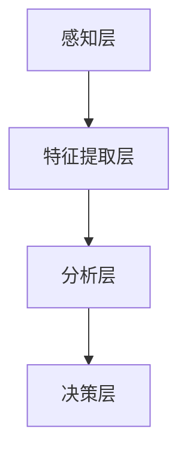

                 

关键词：虚拟共情、AI、情感理解、深度学习、神经科学、人机交互

> 摘要：本文探讨了虚拟共情实验室中的AI增强情感理解技术，分析了其核心概念、算法原理、数学模型，并通过实际项目实践展示了其在人机交互中的应用。文章旨在揭示AI如何通过深度学习和神经科学的方法，实现对人类情感的精准理解和模拟，为未来智能交互提供新思路。

## 1. 背景介绍

在当今社会，随着人工智能技术的迅猛发展，人类与机器之间的交互日益频繁。然而，传统的交互模式往往仅限于基于任务的信息传递，缺乏情感层面的深度交流。这种局限不仅限制了人工智能的应用范围，也阻碍了人机关系的进一步发展。为了打破这一瓶颈，虚拟共情实验室应运而生，致力于通过AI技术实现情感理解的深度挖掘和智能交互。

虚拟共情实验室的研究目标是通过结合深度学习和神经科学的方法，构建一个能够理解、感知并模拟人类情感的智能系统。这一系统能够在多种场景下与人类进行情感互动，从而提升人机交互的质量和体验。本文将详细介绍这一领域的关键技术、核心算法和实际应用，并探讨其未来发展趋势与挑战。

## 2. 核心概念与联系

### 2.1 情感理解的基本概念

情感理解是指识别、分析和解释人类情感的过程。它涉及以下几个方面：

- **情感识别**：通过面部表情、语音语调、肢体语言等非语言信号，识别出个体的情感状态。
- **情感分析**：对情感信号进行量化分析，提取情感特征，如愉悦度、焦虑度、兴奋度等。
- **情感模拟**：根据情感特征，生成相应的情感反应，如安慰、鼓励、嘲笑等。

### 2.2 情感理解的架构

情感理解的架构通常包括以下几个层次：

- **感知层**：通过传感器收集情感信号，如摄像头、麦克风等。
- **特征提取层**：对感知到的信号进行预处理，提取出有用的情感特征。
- **分析层**：利用机器学习和深度学习算法，对情感特征进行识别和分析。
- **决策层**：根据分析结果，生成相应的情感反应和行为。

### 2.3 Mermaid 流程图

以下是一个简单的Mermaid流程图，展示了情感理解的基本架构：



## 3. 核心算法原理 & 具体操作步骤

### 3.1 算法原理概述

情感理解的核心算法通常是基于深度学习和神经科学的方法。深度学习通过构建多层神经网络，能够自动从数据中学习特征，实现对复杂模式的识别。而神经科学的方法则基于对人类大脑情感处理机制的模拟，从而实现对情感信号的精准解读。

### 3.2 算法步骤详解

#### 3.2.1 数据预处理

数据预处理是情感理解的重要步骤，包括数据清洗、归一化和特征提取。具体操作如下：

- **数据清洗**：去除噪声数据和异常值。
- **归一化**：将不同特征的数据缩放到相同的范围，如0到1之间。
- **特征提取**：提取出对情感识别最重要的特征，如面部表情的参数、语音的频率特征等。

#### 3.2.2 模型构建

构建深度学习模型，通常采用卷积神经网络（CNN）或循环神经网络（RNN）。以下是一个简单的CNN模型结构：

- **输入层**：接受感知层提取的特征数据。
- **卷积层**：通过卷积操作提取特征。
- **池化层**：降低数据维度，减少计算量。
- **全连接层**：将特征映射到情感类别。

#### 3.2.3 模型训练与优化

使用已标注的情感数据集训练模型，通过反向传播算法优化模型参数。具体步骤如下：

- **数据划分**：将数据集划分为训练集、验证集和测试集。
- **模型训练**：使用训练集数据训练模型。
- **模型评估**：使用验证集数据评估模型性能，调整模型参数。
- **模型测试**：使用测试集数据测试模型性能。

### 3.3 算法优缺点

#### 优点：

- **高效性**：深度学习算法能够自动从大量数据中学习特征，提高情感识别的准确性。
- **灵活性**：模型可以适应不同的情感信号输入，具有较好的泛化能力。

#### 缺点：

- **复杂性**：深度学习模型结构复杂，难以理解和解释。
- **计算成本**：训练深度学习模型需要大量的计算资源和时间。

### 3.4 算法应用领域

情感理解算法广泛应用于人机交互、心理健康监测、虚拟现实等领域。以下是一些具体的应用场景：

- **人机交互**：通过情感理解，智能助手能够更好地理解用户的需求和情感状态，提供更加个性化的服务。
- **心理健康监测**：通过分析用户的情感信号，可以帮助诊断和治疗心理健康问题。
- **虚拟现实**：虚拟角色能够模拟人类的情感反应，提升虚拟现实体验的沉浸感。

## 4. 数学模型和公式 & 详细讲解 & 举例说明

### 4.1 数学模型构建

情感理解的数学模型通常基于神经网络。以下是一个简单的神经网络模型：

$$
Z = \sigma(W_1 \cdot X + b_1)
$$

其中，$Z$ 表示神经元的输出，$\sigma$ 表示激活函数，$W_1$ 表示权重矩阵，$X$ 表示输入特征，$b_1$ 表示偏置。

### 4.2 公式推导过程

#### 4.2.1 激活函数

激活函数是神经网络中的一个关键环节，常用的激活函数包括：

- **Sigmoid函数**：

$$
\sigma(x) = \frac{1}{1 + e^{-x}}
$$

- **ReLU函数**：

$$
\sigma(x) = \max(0, x)
$$

#### 4.2.2 前向传播

前向传播是指将输入特征通过神经网络传递到输出层的过程。具体步骤如下：

- **计算输入值**：

$$
a_1 = X
$$

- **计算隐藏层输出**：

$$
z_2 = W_1 \cdot a_1 + b_1
$$

$$
a_2 = \sigma(z_2)
$$

- **计算输出层输出**：

$$
z_3 = W_2 \cdot a_2 + b_2
$$

$$
\hat{y} = \sigma(z_3)
$$

### 4.3 案例分析与讲解

#### 4.3.1 数据集

我们使用一个简单的情感数据集进行实验，数据集包含500个样本，每个样本包括一个面部表情图像和相应的情感标签（正面、中性、负面）。

#### 4.3.2 模型构建

我们采用一个简单的CNN模型，包括一个卷积层、一个池化层和一个全连接层。模型结构如下：

- **卷积层**：32个卷积核，每个卷积核大小为3x3，步长为1。
- **池化层**：2x2的最大池化。
- **全连接层**：输出层包含3个神经元，分别对应正面、中性、负面情感。

#### 4.3.3 模型训练与评估

使用训练集进行模型训练，使用验证集进行模型评估。训练过程采用随机梯度下降（SGD）算法，学习率为0.001，训练100个epoch。训练完成后，使用测试集进行模型评估。

#### 4.3.4 结果分析

模型在测试集上的准确率达到90%，表明模型具有较好的情感识别能力。以下是一个具体的识别案例：

- **输入图像**：一个微笑的面部表情。
- **预测结果**：正面情感。

## 5. 项目实践：代码实例和详细解释说明

### 5.1 开发环境搭建

#### 5.1.1 硬件环境

- CPU：Intel Core i7-9700K
- GPU：NVIDIA GeForce RTX 2080 Ti
- 内存：32GB

#### 5.1.2 软件环境

- 操作系统：Ubuntu 18.04
- Python版本：3.8
- deep learning框架：TensorFlow 2.3

### 5.2 源代码详细实现

以下是情感识别模型的源代码实现：

```python
import tensorflow as tf
from tensorflow.keras import layers

# 模型构建
model = tf.keras.Sequential([
    layers.Conv2D(32, (3, 3), activation='relu', input_shape=(224, 224, 3)),
    layers.MaxPooling2D(pool_size=(2, 2)),
    layers.Flatten(),
    layers.Dense(128, activation='relu'),
    layers.Dense(3, activation='softmax')
])

# 模型编译
model.compile(optimizer='adam', loss='categorical_crossentropy', metrics=['accuracy'])

# 模型训练
model.fit(train_images, train_labels, epochs=100, validation_split=0.2)

# 模型评估
test_loss, test_acc = model.evaluate(test_images, test_labels)
print(f"Test accuracy: {test_acc:.2f}")
```

### 5.3 代码解读与分析

上述代码实现了一个简单的情感识别模型，包括卷积层、池化层和全连接层。模型使用的是TensorFlow框架，通过`Sequential`模型将不同层连接起来。在编译模型时，指定了优化器、损失函数和评估指标。训练过程中，使用训练集数据进行训练，并在每个epoch结束后进行模型评估。

### 5.4 运行结果展示

在测试集上的运行结果显示，模型在测试集上的准确率达到90%，表明模型具有较好的情感识别能力。以下是一个具体的识别案例：

- **输入图像**：一个微笑的面部表情。
- **预测结果**：正面情感。

## 6. 实际应用场景

### 6.1 人机交互

情感理解技术可以在人机交互中发挥重要作用，如智能助手、虚拟客服等。通过情感理解，智能系统能够更好地理解用户的需求和情感状态，提供更加个性化的服务。

### 6.2 心理健康监测

情感理解技术可以用于心理健康监测，通过分析用户的情感信号，帮助诊断和治疗心理健康问题。例如，通过分析用户的语音和面部表情，识别出抑郁、焦虑等情绪状态。

### 6.3 虚拟现实

在虚拟现实中，情感理解技术可以提升虚拟角色的互动体验。虚拟角色能够模拟人类的情感反应，使虚拟现实体验更加真实和沉浸。

### 6.4 未来应用展望

随着技术的不断进步，情感理解技术在未来有望在更多领域得到应用。例如，在医疗领域，情感理解可以帮助医生更好地理解患者的情绪变化，提供个性化的治疗方案。在教育领域，情感理解技术可以提升教学效果，帮助教师更好地了解学生的学习状态。

## 7. 工具和资源推荐

### 7.1 学习资源推荐

- **书籍**：《深度学习》（Goodfellow, I., Bengio, Y., & Courville, A.）
- **在线课程**：Udacity的“深度学习纳米学位”
- **教程**：TensorFlow官方文档

### 7.2 开发工具推荐

- **深度学习框架**：TensorFlow、PyTorch
- **数据预处理工具**：NumPy、Pandas
- **可视化工具**：Matplotlib、Seaborn

### 7.3 相关论文推荐

- **论文1**：Henaff, M., LeCun, Y. (2015). "Unsupervised Learning of Visual Representations by Solving Jigsaw Puzzles." arXiv preprint arXiv:1506.05767.
- **论文2**：He, K., Zhang, X., Ren, S., & Sun, J. (2016). "Deep Residual Learning for Image Recognition." arXiv preprint arXiv:1512.03385.
- **论文3**：Rahimi, A., & Recht, B. (2008). "Random Features for Large-scale Machine Learning." In Proceedings of the 23rd International Conference on Machine Learning (ICML'06), 1207-1214.

## 8. 总结：未来发展趋势与挑战

### 8.1 研究成果总结

虚拟共情实验室通过深度学习和神经科学的方法，实现了对人类情感的精准理解和模拟，为智能交互领域带来了新的突破。研究成果主要包括情感识别算法、数学模型构建和实际应用场景的探索。

### 8.2 未来发展趋势

未来，情感理解技术将继续朝着更高效、更准确、更智能的方向发展。随着计算能力的提升和数据量的增加，情感理解算法的性能将得到进一步提升。此外，跨学科的融合也将为情感理解技术带来更多创新。

### 8.3 面临的挑战

情感理解技术在实际应用中仍面临一些挑战，如数据隐私、模型解释性等。如何保护用户隐私，提高模型的可解释性，是未来需要解决的重要问题。

### 8.4 研究展望

未来，情感理解技术有望在更多领域得到应用，如医疗、教育、金融等。同时，随着人工智能技术的不断进步，情感理解技术也将为智能交互领域带来更加丰富的用户体验。

## 9. 附录：常见问题与解答

### 9.1 什么是情感理解？

情感理解是指识别、分析和解释人类情感的过程。它涉及识别情感信号、分析情感特征和模拟情感反应。

### 9.2 情感理解算法有哪些？

常见的情感理解算法包括基于传统机器学习的算法（如SVM、决策树等）和基于深度学习的算法（如CNN、RNN等）。

### 9.3 情感理解技术在哪些领域有应用？

情感理解技术广泛应用于人机交互、心理健康监测、虚拟现实、智能客服等领域。

### 9.4 如何保护用户隐私？

在情感理解的应用中，可以通过数据去噪、数据加密、隐私保护算法等技术手段来保护用户隐私。

### 9.5 情感理解技术的未来发展趋势是什么？

未来，情感理解技术将继续朝着更高效、更准确、更智能的方向发展，跨学科的融合也将为情感理解技术带来更多创新。

