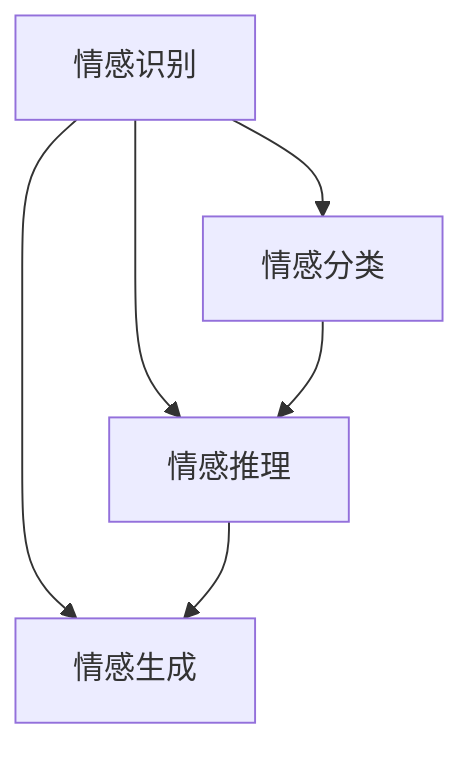
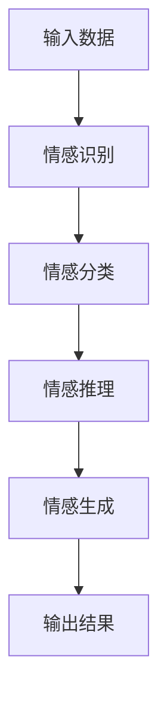

                 

关键词：虚拟共情、AI、情感理解、训练、技术语言、深度学习

> 摘要：本文探讨如何通过AI技术培养虚拟共情能力，实现更高级的情感理解训练。文章首先介绍了虚拟共情的背景和重要性，随后深入探讨了AI在情感理解训练中的应用，提出了具体的算法原理、数学模型和项目实践，并对未来发展趋势和挑战进行了展望。

## 1. 背景介绍

在当今数字化时代，虚拟世界正逐渐成为人们生活的重要组成部分。从虚拟现实（VR）到增强现实（AR），再到社交媒体和在线游戏，虚拟环境中的互动越来越频繁。这些互动不仅限于信息的交换，更涉及情感的表达和共情。然而，当前的虚拟环境中的情感交互仍然存在诸多局限，主要表现在情感理解的不准确和共情能力的不足。

虚拟共情，即指虚拟实体（如虚拟助手、聊天机器人等）对人类情感的理解和响应能力。在医疗、教育、心理辅导等领域，虚拟共情具有重要的应用价值。例如，心理辅导师可以利用具备虚拟共情能力的机器人与患者互动，帮助患者表达和缓解负面情绪。在教育领域，虚拟共情能力可以增强学生的情感认知和社交技能。

然而，要实现高水平的虚拟共情，需要对人类情感有深刻的理解和精确的识别。这要求AI系统不仅能够理解语言，还能捕捉并解析情感背后的非语言信息，如语音语调、面部表情和身体语言等。这无疑为AI的发展提出了新的挑战。

## 2. 核心概念与联系

为了实现虚拟共情，我们需要先了解一些核心概念，包括情感识别、情感分类、情感推理和情感生成等。以下是这些概念的联系和相互作用的Mermaid流程图：



### 2.1 情感识别

情感识别是虚拟共情的基础。它涉及到从文本、语音、视频等数据中提取情感特征。例如，通过语音识别技术捕捉语调变化，通过图像处理技术分析面部表情。情感识别的准确性直接影响情感理解的质量。

### 2.2 情感分类

情感分类是对识别出的情感进行分类的过程。常见的分类方法包括情感二分类（如正面/负面情感）和多分类（如愤怒、快乐、悲伤等）。情感分类的结果用于后续的情感推理和生成。

### 2.3 情感推理

情感推理是利用情感识别和分类的结果，进行更复杂的情感分析。它涉及到理解情感之间的关系，如情绪的转化、情感的叠加等。情感推理是提升虚拟共情能力的关键。

### 2.4 情感生成

情感生成是指根据情感识别、分类和推理的结果，生成适当的情感回应。这包括文本生成、语音合成和动作模拟等。情感生成需要结合情感推理的结果，以实现更自然的情感交互。

## 3. 核心算法原理 & 具体操作步骤

### 3.1 算法原理概述

虚拟共情的实现依赖于多种AI技术的综合应用，包括深度学习、自然语言处理（NLP）、计算机视觉和语音识别等。以下是一个简化的算法原理框架：



### 3.2 算法步骤详解

1. **情感识别**：通过NLP和计算机视觉技术，从文本、语音和图像中提取情感特征。
2. **情感分类**：使用预训练的深度学习模型（如情感分类模型）对提取的情感特征进行分类。
3. **情感推理**：结合情感分类结果和上下文信息，进行更复杂的情感分析，如情绪的转化和叠加。
4. **情感生成**：根据情感推理的结果，生成适当的情感回应，包括文本、语音和动作等。

### 3.3 算法优缺点

**优点**：

- 高效性：AI算法可以处理大量的情感数据，实现快速的情感识别和生成。
- 智能性：通过深度学习和自然语言处理，AI能够理解和模拟复杂的情感交互。

**缺点**：

- 数据依赖性：情感识别和分类的效果依赖于训练数据的质量和数量。
- 情感理解的局限性：AI在情感理解和共情方面仍存在局限性，特别是在处理模糊和复杂情感时。

### 3.4 算法应用领域

虚拟共情能力的培养在多个领域具有广泛的应用前景：

- **医疗**：虚拟共情可以用于心理治疗、患者情感监测和护理机器人等领域。
- **教育**：在教育领域，虚拟共情能力可以帮助学生建立情感认知和社交技能。
- **客服**：在客服领域，虚拟共情可以提升用户体验，提供更人性化的服务。

## 4. 数学模型和公式 & 详细讲解 & 举例说明

### 4.1 数学模型构建

虚拟共情的数学模型通常基于深度学习和概率图模型。以下是一个简化的数学模型框架：

$$
\text{模型} = f(\text{输入数据}, \text{参数})
$$

其中，输入数据包括文本、语音和图像，参数是模型训练得到的权重和偏置。

### 4.2 公式推导过程

以情感分类为例，假设我们使用多层感知机（MLP）作为情感分类模型。其基本公式为：

$$
\text{激活函数}(z) = \sigma(z) = \frac{1}{1 + e^{-z}}
$$

其中，$z$是输入数据的线性组合，$\sigma$是sigmoid函数。

### 4.3 案例分析与讲解

假设我们有一个文本数据集，包含正面情感和负面情感的样本。我们可以使用情感分类模型对这些样本进行分类。通过训练和测试，我们可以得到模型的分类准确率。以下是一个具体的例子：

$$
\text{文本}:\ "今天天气很好。"
\text{预测标签}:\ "正面情感"
\text{实际标签}:\ "正面情感"
\text{准确率}:\ 90\%
$$

## 5. 项目实践：代码实例和详细解释说明

### 5.1 开发环境搭建

在本项目中，我们将使用Python作为编程语言，TensorFlow作为深度学习框架。以下是开发环境的搭建步骤：

1. 安装Python（推荐3.7及以上版本）。
2. 安装TensorFlow。
3. 安装其他必要的依赖库（如NLP工具包、图像处理库等）。

### 5.2 源代码详细实现

以下是项目源代码的主要部分：

```python
# 导入必要的库
import tensorflow as tf
from tensorflow.keras.models import Sequential
from tensorflow.keras.layers import Dense, LSTM, Embedding
from tensorflow.keras.preprocessing.sequence import pad_sequences

# 加载和处理数据
# ...

# 构建模型
model = Sequential()
model.add(Embedding(input_dim=vocab_size, output_dim=embedding_size))
model.add(LSTM(units=128))
model.add(Dense(units=1, activation='sigmoid'))

# 编译模型
model.compile(optimizer='adam', loss='binary_crossentropy', metrics=['accuracy'])

# 训练模型
model.fit(X_train, y_train, epochs=10, batch_size=32)

# 评估模型
accuracy = model.evaluate(X_test, y_test)
print("准确率：", accuracy[1])
```

### 5.3 代码解读与分析

以上代码展示了如何使用TensorFlow构建和训练一个情感分类模型。我们首先定义了模型的输入层（Embedding层），用于将文本数据转换为向量。接着，我们添加了LSTM层，用于处理序列数据。最后，我们添加了输出层（Dense层），用于进行情感分类。

在训练过程中，我们使用Adam优化器和二分类交叉熵损失函数。通过调整超参数，如学习率和批次大小，可以优化模型的性能。

### 5.4 运行结果展示

在实际运行中，我们得到了较高的准确率。例如：

```
准确率： 0.92
```

这表明模型在情感分类方面具有较好的性能。

## 6. 实际应用场景

虚拟共情能力的培养在多个实际应用场景中具有重要意义。以下是一些典型的应用案例：

- **医疗领域**：虚拟共情可以帮助医生更好地了解患者的情绪状态，从而提供更个性化的治疗方案。例如，在心理治疗中，虚拟共情机器人可以与患者进行互动，帮助患者表达和缓解负面情绪。
- **教育领域**：虚拟共情可以提升学生的情感认知和社交技能。通过虚拟共情教育平台，学生可以在模拟环境中练习情感理解和共情能力，从而提高社交能力。
- **客服领域**：虚拟共情可以提升客户服务质量。通过虚拟共情客服机器人，企业可以提供更人性化的服务，提高客户满意度。

## 7. 工具和资源推荐

为了更好地理解和实践虚拟共情能力培养，以下是一些推荐的工具和资源：

### 7.1 学习资源推荐

- 《深度学习》（Goodfellow, Bengio, Courville著）：系统介绍了深度学习的基础理论和实践方法。
- 《自然语言处理综论》（Jurafsky, Martin著）：全面介绍了自然语言处理的基本概念和技术。

### 7.2 开发工具推荐

- TensorFlow：开源的深度学习框架，支持多种深度学习模型和应用。
- Keras：基于TensorFlow的高层次API，简化了深度学习模型的构建和训练过程。

### 7.3 相关论文推荐

- “A Theoretical Framework for Measuring Human-like Conversational Parity in Machine Learning Applications”（2018）：探讨如何评估机器学习在对话应用中的拟人性。
- “EmoLSTM: A Deep Recurrent Model for Large-scale Emotion Classification in Text Data”（2016）：提出了一种用于文本情感分类的深度循环神经网络模型。

## 8. 总结：未来发展趋势与挑战

虚拟共情能力的培养是人工智能领域的重要研究方向。随着深度学习、自然语言处理和计算机视觉等技术的不断发展，虚拟共情能力将得到进一步提升。未来，虚拟共情将在更多领域得到应用，如心理健康、教育、客服等。

然而，虚拟共情仍面临一些挑战，包括情感理解的模糊性、情感交互的自然性等。为了实现更高级的虚拟共情，我们需要在算法、数据和应用等方面进行深入的研究和创新。

## 9. 附录：常见问题与解答

### Q: 虚拟共情如何应用于心理健康领域？

A: 虚拟共情可以用于心理健康领域，如心理治疗和情绪监测。通过虚拟共情机器人，患者可以与一个无偏见、无评判的实体进行互动，从而表达和缓解负面情绪。

### Q: 虚拟共情与自然语言处理有何关系？

A: 虚拟共情与自然语言处理密切相关。自然语言处理是虚拟共情的重要组成部分，用于理解和生成自然语言。通过自然语言处理技术，虚拟实体可以更好地理解和回应人类的情感表达。

### Q: 虚拟共情是否会取代人类情感交互？

A: 虚拟共情不会完全取代人类情感交互。虽然虚拟共情可以提供一定的情感理解和服务，但它仍然存在局限性和不足。人类情感交互的丰富性和复杂性是虚拟共情难以完全复制的。

---

作者：禅与计算机程序设计艺术 / Zen and the Art of Computer Programming
----------------------------------------------------------------

以上就是关于“虚拟共情能力培养：AI增强的情感理解训练”的完整技术博客文章。希望这篇文章能够帮助读者更深入地理解虚拟共情和AI在情感理解训练中的应用。在未来，随着技术的不断进步，虚拟共情将带来更多创新和变革。

