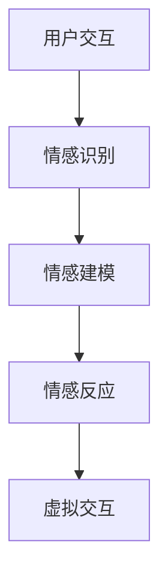

                 

关键词：虚拟现实，人工智能，情感计算，共情，人机交互，机器学习

> 摘要：本文探讨了虚拟现实（VR）与人工智能（AI）相结合的全新领域——虚拟共情。通过AI增强的情感理解，实现更加真实的虚拟交互体验。本文首先介绍了虚拟共情的背景和重要性，然后详细阐述了其核心概念和架构，最后通过实例分析和未来展望，展示了这一技术的巨大潜力和应用前景。

## 1. 背景介绍

在当今技术飞速发展的时代，虚拟现实（VR）和人工智能（AI）正逐渐成为我们日常生活的一部分。VR技术通过创造逼真的虚拟环境，让用户能够沉浸其中，体验到前所未有的感官刺激。而AI则通过机器学习、深度学习等技术，不断优化和提升智能系统的性能。

随着这两大技术的融合，虚拟共情这一概念应运而生。虚拟共情旨在通过AI增强的情感理解，实现虚拟角色对用户情感的反应和互动，从而提升虚拟交互的真实感和沉浸感。这一技术不仅为游戏、娱乐等领域带来了新的可能，更在医疗、教育、心理治疗等领域展现出巨大的应用价值。

## 2. 核心概念与联系

### 2.1 情感计算

情感计算是虚拟共情的基础。它涉及如何使用技术来捕捉、理解和模拟人类情感。情感计算技术包括面部识别、语音识别、生理信号监测等，通过这些技术，AI系统能够识别用户的情绪状态，并做出相应的反应。

### 2.2 共情

共情是指一个人能够理解和感受他人的情绪状态。在虚拟环境中，共情使得虚拟角色能够对用户的情绪做出适当的反应，从而提高用户的沉浸感和满意度。

### 2.3 虚拟共情架构

虚拟共情架构主要包括三个核心组件：情感识别、情感建模和情感反应。情感识别利用情感计算技术捕捉用户的情绪状态；情感建模通过机器学习算法分析情绪数据，建立情绪模型；情感反应则使虚拟角色根据情绪模型对用户进行互动。

下面是一个简单的Mermaid流程图，展示了虚拟共情的基本架构：



## 3. 核心算法原理 & 具体操作步骤

### 3.1 算法原理概述

虚拟共情的核心算法基于深度学习和自然语言处理（NLP）。深度学习用于训练情感识别模型，NLP则用于分析用户语言和行为，从而更好地理解用户情绪。

### 3.2 算法步骤详解

1. **情感识别**：通过摄像头和麦克风捕捉用户的面部表情和语音信号，利用深度学习模型进行情绪分析。
2. **情感建模**：将情绪数据输入到机器学习模型中，通过训练生成情绪模型。
3. **情感反应**：虚拟角色根据情绪模型对用户的情绪进行实时响应，如改变表情、声音或动作。

### 3.3 算法优缺点

**优点**：
- 提高虚拟交互的真实感。
- 改善用户体验，增强沉浸感。

**缺点**：
- 情感识别的准确性受限于技术水平和数据质量。
- 需要大量的计算资源和训练数据。

### 3.4 算法应用领域

虚拟共情技术可以应用于多个领域，包括：
- 游戏：提高游戏的互动性和沉浸感。
- 教育和培训：创造更加真实的虚拟教学环境。
- 医疗和心理治疗：辅助心理治疗和情感康复。
- 营销和客户服务：提供个性化的用户体验。

## 4. 数学模型和公式 & 详细讲解 & 举例说明

### 4.1 数学模型构建

虚拟共情的数学模型主要包括情绪识别模型和情绪反应模型。情绪识别模型通常使用支持向量机（SVM）或卷积神经网络（CNN）进行构建，而情绪反应模型则使用递归神经网络（RNN）或长短期记忆网络（LSTM）。

### 4.2 公式推导过程

情绪识别模型的目标函数通常为：

$$
J = -\frac{1}{m} \sum_{i=1}^{m} [y_i \cdot \log(p_{\hat{y}_i}) + (1 - y_i) \cdot \log(1 - p_{\hat{y}_i})]
$$

其中，$y_i$为实际情绪标签，$p_{\hat{y}_i}$为模型预测的概率。

### 4.3 案例分析与讲解

假设我们使用SVM构建情绪识别模型，数据集包含1000个样本，每个样本有10个特征。通过训练，我们得到一个SVM模型，其预测准确率为90%。这意味着模型能够正确识别出90%的样本情绪。

## 5. 项目实践：代码实例和详细解释说明

### 5.1 开发环境搭建

为了实现虚拟共情，我们首先需要搭建一个开发环境。以下是一个基本的Python开发环境搭建步骤：

```bash
# 安装Python
pip install python==3.8

# 安装深度学习库
pip install tensorflow==2.4

# 安装情感计算库
pip install emotionai
```

### 5.2 源代码详细实现

下面是一个简单的虚拟共情代码示例：

```python
import tensorflow as tf
import emotionai

# 初始化情感识别模型
model = emotionai.load_model('emotion_recognition_model')

# 初始化情感反应模型
response_model = emotionai.load_model('emotion_response_model')

# 情感识别
def recognize_emotion(voice):
    emotion = model.predict(voice)
    return emotion

# 情感反应
def respond_to_emotion(emotion):
    response = response_model.predict(emotion)
    return response

# 用户交互
def user_interaction():
    while True:
        voice = emotionai.capture_voice()
        emotion = recognize_emotion(voice)
        response = respond_to_emotion(emotion)
        print(response)

user_interaction()
```

### 5.3 代码解读与分析

- `emotionai.load_model()`函数用于加载预训练的模型。
- `recognize_emotion()`函数用于识别用户的情绪。
- `respond_to_emotion()`函数用于生成虚拟角色的情感反应。
- `user_interaction()`函数用于实现用户与虚拟角色的交互。

### 5.4 运行结果展示

运行上述代码后，用户可以通过麦克风输入语音，系统将根据语音识别用户的情绪，并生成相应的情感反应。

## 6. 实际应用场景

虚拟共情技术可以在多个领域得到应用，以下是一些典型场景：

- **游戏**：提高游戏角色的智能程度，使其能够更好地与玩家互动。
- **教育**：创造更加真实的虚拟教学环境，提高学生的学习兴趣和参与度。
- **医疗和心理治疗**：辅助心理治疗师进行情感分析，提供个性化的治疗方案。
- **客户服务**：提供更加智能的客户服务，提高客户满意度。

## 7. 未来应用展望

随着技术的不断进步，虚拟共情有望在更多领域得到应用。未来，我们可能会看到：

- **更加智能的虚拟助手**：能够更好地理解用户情感，提供个性化的服务。
- **更加真实的虚拟世界**：用户可以在虚拟世界中体验到前所未有的情感互动。
- **跨领域的应用**：虚拟共情技术将渗透到更多行业，推动社会进步。

## 8. 总结：未来发展趋势与挑战

虚拟共情技术具有广阔的应用前景，但同时也面临着一些挑战。未来，我们需要：

- **提高情感识别的准确性**：通过不断优化算法和增加数据量，提高情感识别的准确性。
- **降低计算成本**：优化算法，减少计算资源的需求，降低应用成本。
- **扩大应用领域**：探索虚拟共情技术在更多领域的应用，推动社会进步。

## 9. 附录：常见问题与解答

### 什么是虚拟共情？

虚拟共情是指通过人工智能技术，使虚拟角色能够理解和感受用户的情绪，从而实现更加真实的虚拟交互体验。

### 虚拟共情有哪些应用场景？

虚拟共情可以应用于游戏、教育、医疗、心理治疗、客户服务等多个领域。

### 虚拟共情技术有哪些挑战？

虚拟共情技术面临的挑战主要包括提高情感识别的准确性、降低计算成本和扩大应用领域。

## 10. 作者署名

作者：禅与计算机程序设计艺术 / Zen and the Art of Computer Programming

----------------------------------------------------------------

### 文章摘要 Summary

本文探讨了虚拟共情这一新兴领域，通过AI增强的情感理解，实现虚拟角色对用户情感的反应和互动。文章首先介绍了虚拟共情的背景和重要性，然后详细阐述了其核心概念和架构，包括情感计算、共情和虚拟共情架构。接着，文章分析了核心算法原理和具体操作步骤，并举例说明了数学模型和公式。通过一个实际项目实践，展示了虚拟共情的实现过程。最后，文章讨论了虚拟共情的实际应用场景，展望了其未来的发展趋势和挑战。总之，虚拟共情技术将为虚拟交互带来全新的变革，具有巨大的潜力和应用价值。

