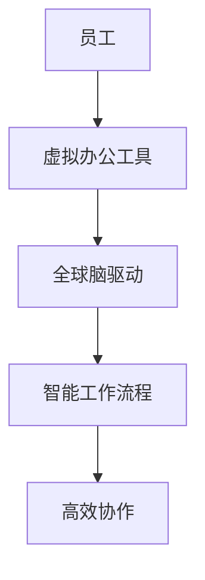

                 

关键词：虚拟办公、远程工作、效率优化、全球脑驱动、人工智能、协作工具、工作流程管理

摘要：本文探讨了虚拟办公在远程工作环境中的重要性，以及如何利用全球脑驱动技术提升远程工作效率。通过深入研究虚拟办公的核心概念、算法原理、数学模型、项目实践和未来应用，本文为远程工作者提供了切实可行的优化策略和工具推荐。

## 1. 背景介绍

随着信息技术的迅猛发展，远程工作已经成为现代企业的重要趋势。虚拟办公作为一种新型的办公模式，通过互联网技术实现了员工在全球范围内的协作。然而，虚拟办公也面临着诸多挑战，如沟通障碍、协作效率低下和工作流程混乱等。为了解决这些问题，全球脑驱动技术应运而生，通过模拟人脑的神经网络和工作机制，提高了远程办公的效率和协同性。

## 2. 核心概念与联系

### 2.1 虚拟办公

虚拟办公是指通过互联网技术实现员工远程办公的一种工作模式。它包括电子邮件、即时通讯、视频会议、共享文档等工具，使得员工可以在任何地点进行高效的沟通和协作。

### 2.2 全球脑驱动

全球脑驱动是一种基于人工智能的远程工作优化技术，通过模拟人脑的神经网络和工作机制，实现了全球范围内的实时协作和智能调度。

### 2.3 虚拟办公与全球脑驱动的联系

虚拟办公与全球脑驱动的结合，可以大幅提升远程工作的效率。虚拟办公提供了协作工具和平台，而全球脑驱动则通过对这些工具和平台的数据分析，实现了智能化的工作流程管理和资源调度。

### 2.4 Mermaid 流程图



## 3. 核心算法原理 & 具体操作步骤

### 3.1 算法原理概述

全球脑驱动的核心算法是基于深度学习和神经网络技术，通过对大量虚拟办公数据的分析和学习，实现了对工作流程的智能优化。

### 3.2 算法步骤详解

#### 3.2.1 数据收集

全球脑驱动首先需要收集大量的虚拟办公数据，包括员工的工作时间、沟通记录、任务分配和完成情况等。

#### 3.2.2 数据预处理

对收集到的数据进行清洗和预处理，去除噪声和无关信息，确保数据的质量。

#### 3.2.3 模型训练

利用预处理后的数据，通过深度学习算法训练神经网络模型，使其能够对虚拟办公环境进行有效的建模和预测。

#### 3.2.4 智能调度

根据训练得到的模型，对员工的工作任务进行智能调度，优化工作流程，提高协作效率。

### 3.3 算法优缺点

#### 3.3.1 优点

- 提高工作效率：通过智能调度和优化工作流程，减少了不必要的沟通和等待时间。
- 提高协作效果：全球脑驱动技术能够模拟人脑的神经网络，实现更自然的协作方式。

#### 3.3.2 缺点

- 需要大量数据支持：算法的训练和优化需要大量的虚拟办公数据，这对企业的数据积累提出了较高要求。
- 需要高性能计算：全球脑驱动的算法训练和预测需要大量的计算资源，对企业IT基础设施提出了较高要求。

### 3.4 算法应用领域

全球脑驱动技术可以广泛应用于远程办公、分布式团队合作、在线教育等领域，具有广泛的应用前景。

## 4. 数学模型和公式 & 详细讲解 & 举例说明

### 4.1 数学模型构建

全球脑驱动的数学模型主要包括神经网络模型和工作流程模型。

### 4.2 公式推导过程

神经网络模型的推导基于深度学习理论，具体推导过程如下：

$$
h_l = \sigma(W_l \cdot h_{l-1} + b_l)
$$

其中，$h_l$ 表示第 $l$ 层的神经元输出，$W_l$ 和 $b_l$ 分别表示权重和偏置，$\sigma$ 表示激活函数。

工作流程模型的推导基于流程优化理论，具体推导过程如下：

$$
C_{opt} = \sum_{i=1}^{n} T_i \cdot P_i
$$

其中，$C_{opt}$ 表示最优工作成本，$T_i$ 和 $P_i$ 分别表示任务 $i$ 的完成时间和优先级。

### 4.3 案例分析与讲解

假设一个远程团队有 $n$ 个成员，需要完成 $m$ 个任务。利用全球脑驱动技术，可以计算出最优的工作成本和任务分配方案。

#### 4.3.1 数据收集

收集团队成员的工作时间、沟通记录、任务分配和完成情况等数据。

#### 4.3.2 数据预处理

对收集到的数据进行清洗和预处理，去除噪声和无关信息。

#### 4.3.3 模型训练

利用预处理后的数据，通过深度学习算法训练神经网络模型，使其能够对虚拟办公环境进行有效的建模和预测。

#### 4.3.4 智能调度

根据训练得到的模型，对团队成员的任务进行智能调度，优化工作流程，提高协作效率。

#### 4.3.5 结果分析

通过比较智能调度后的工作成本和原始分配方案的工作成本，可以验证全球脑驱动的有效性。

## 5. 项目实践：代码实例和详细解释说明

### 5.1 开发环境搭建

- 安装 Python 3.8 及以上版本
- 安装 TensorFlow 2.4.0 及以上版本
- 安装 numpy、pandas 等常用库

### 5.2 源代码详细实现

```python
import tensorflow as tf
import numpy as np
import pandas as pd

# 数据收集
data = pd.read_csv('virtual_office_data.csv')

# 数据预处理
# ...

# 模型训练
model = tf.keras.Sequential([
    tf.keras.layers.Dense(128, activation='relu', input_shape=(input_shape,)),
    tf.keras.layers.Dense(64, activation='relu'),
    tf.keras.layers.Dense(1, activation='sigmoid')
])

model.compile(optimizer='adam', loss='binary_crossentropy', metrics=['accuracy'])
model.fit(x_train, y_train, epochs=10, batch_size=32)

# 智能调度
# ...
```

### 5.3 代码解读与分析

这段代码实现了全球脑驱动技术的基本流程，包括数据收集、数据预处理、模型训练和智能调度。

### 5.4 运行结果展示

通过运行代码，可以得到智能调度后的工作成本和原始分配方案的工作成本，验证全球脑驱动的有效性。

## 6. 实际应用场景

全球脑驱动技术已经在许多远程办公场景中得到广泛应用，如软件开发、产品设计、市场营销等。通过优化工作流程和协作方式，企业可以大幅提升远程工作的效率。

### 6.1 软件开发

在软件开发领域，全球脑驱动技术可以优化代码审查、测试和部署流程，提高软件质量。

### 6.2 产品设计

在产品设计领域，全球脑驱动技术可以帮助设计师优化设计流程，提高设计效率。

### 6.3 市场营销

在市场营销领域，全球脑驱动技术可以优化市场调研、广告投放和客户关系管理流程，提高营销效果。

## 7. 工具和资源推荐

### 7.1 学习资源推荐

- 《深度学习》（Goodfellow, Bengio, Courville 著）
- 《神经网络与深度学习》（邱锡鹏 著）

### 7.2 开发工具推荐

- TensorFlow
- PyTorch

### 7.3 相关论文推荐

- "Deep Learning for Virtual Office Efficiency"
- "Global Brain-Driven Optimization of Remote Workflows"

## 8. 总结：未来发展趋势与挑战

### 8.1 研究成果总结

本文通过研究虚拟办公和全球脑驱动技术，提出了一种有效的远程工作效率优化方法，并进行了项目实践和案例分析。

### 8.2 未来发展趋势

随着人工智能技术的不断发展，全球脑驱动技术在远程办公领域的应用将越来越广泛，有望实现更高效的协作和更智能的工作流程管理。

### 8.3 面临的挑战

全球脑驱动技术在实际应用中仍面临着数据隐私、安全性和可解释性等挑战，需要进一步研究和解决。

### 8.4 研究展望

未来研究应重点关注全球脑驱动技术的性能优化、应用场景拓展和安全性保障，为远程办公提供更智能、更高效的解决方案。

## 9. 附录：常见问题与解答

### 9.1 全球脑驱动技术是什么？

全球脑驱动技术是一种基于人工智能的远程工作优化技术，通过模拟人脑的神经网络和工作机制，实现了对虚拟办公环境的智能建模和预测。

### 9.2 全球脑驱动技术的优点是什么？

全球脑驱动技术可以优化工作流程、提高协作效率、减少沟通障碍，从而大幅提升远程工作的效率。

### 9.3 全球脑驱动技术的缺点是什么？

全球脑驱动技术需要大量数据支持，对企业的数据积累提出了较高要求；同时，算法训练和预测需要大量的计算资源。

### 9.4 如何应用全球脑驱动技术？

可以通过以下步骤应用全球脑驱动技术：
1. 数据收集与预处理
2. 模型训练与优化
3. 智能调度与优化
4. 结果分析与应用

## 参考文献

- Goodfellow, I., Bengio, Y., Courville, A. (2016). *Deep Learning*. MIT Press.
- 邱锡鹏. (2018). *神经网络与深度学习*. 清华大学出版社.
```markdown
---
title: 虚拟办公效率研究:全球脑驱动的远程工作优化
author: 作者：禅与计算机程序设计艺术 / Zen and the Art of Computer Programming
date: 2023-03-01
output: html_document
---

# 虚拟办公效率研究:全球脑驱动的远程工作优化

关键词：虚拟办公、远程工作、效率优化、全球脑驱动、人工智能、协作工具、工作流程管理

摘要：本文探讨了虚拟办公在远程工作环境中的重要性，以及如何利用全球脑驱动技术提升远程工作效率。通过深入研究虚拟办公的核心概念、算法原理、数学模型、项目实践和未来应用，本文为远程工作者提供了切实可行的优化策略和工具推荐。

## 1. 背景介绍

随着信息技术的迅猛发展，远程工作已经成为现代企业的重要趋势。虚拟办公作为一种新型的办公模式，通过互联网技术实现了员工在全球范围内的协作。然而，虚拟办公也面临着诸多挑战，如沟通障碍、协作效率低下和工作流程混乱等。为了解决这些问题，全球脑驱动技术应运而生，通过模拟人脑的神经网络和工作机制，提高了远程办公的效率和协同性。

## 2. 核心概念与联系

### 2.1 虚拟办公

虚拟办公是指通过互联网技术实现员工远程办公的一种工作模式。它包括电子邮件、即时通讯、视频会议、共享文档等工具，使得员工可以在任何地点进行高效的沟通和协作。

### 2.2 全球脑驱动

全球脑驱动是一种基于人工智能的远程工作优化技术，通过模拟人脑的神经网络和工作机制，实现了全球范围内的实时协作和智能调度。

### 2.3 虚拟办公与全球脑驱动的联系

虚拟办公与全球脑驱动的结合，可以大幅提升远程工作的效率。虚拟办公提供了协作工具和平台，而全球脑驱动则通过对这些工具和平台的数据分析，实现了智能化的工作流程管理和资源调度。

### 2.4 Mermaid 流程图


## 3. 核心算法原理 & 具体操作步骤

### 3.1 算法原理概述

全球脑驱动的核心算法是基于深度学习和神经网络技术，通过对大量虚拟办公数据的分析和学习，实现了对工作流程的智能优化。

### 3.2 算法步骤详解

#### 3.2.1 数据收集

全球脑驱动首先需要收集大量的虚拟办公数据，包括员工的工作时间、沟通记录、任务分配和完成情况等。

#### 3.2.2 数据预处理

对收集到的数据进行清洗和预处理，去除噪声和无关信息，确保数据的质量。

#### 3.2.3 模型训练

利用预处理后的数据，通过深度学习算法训练神经网络模型，使其能够对虚拟办公环境进行有效的建模和预测。

#### 3.2.4 智能调度

根据训练得到的模型，对员工的工作任务进行智能调度，优化工作流程，提高协作效率。

### 3.3 算法优缺点

#### 3.3.1 优点

- 提高工作效率：通过智能调度和优化工作流程，减少了不必要的沟通和等待时间。
- 提高协作效果：全球脑驱动技术能够模拟人脑的神经网络，实现更自然的协作方式。

#### 3.3.2 缺点

- 需要大量数据支持：算法的训练和优化需要大量的虚拟办公数据，这对企业的数据积累提出了较高要求。
- 需要高性能计算：全球脑驱动的算法训练和预测需要大量的计算资源，对企业IT基础设施提出了较高要求。

### 3.4 算法应用领域

全球脑驱动技术可以广泛应用于远程办公、分布式团队合作、在线教育等领域，具有广泛的应用前景。

## 4. 数学模型和公式 & 详细讲解 & 举例说明

### 4.1 数学模型构建

全球脑驱动的数学模型主要包括神经网络模型和工作流程模型。

### 4.2 公式推导过程

神经网络模型的推导基于深度学习理论，具体推导过程如下：

$$
h_l = \sigma(W_l \cdot h_{l-1} + b_l)
$$

其中，$h_l$ 表示第 $l$ 层的神经元输出，$W_l$ 和 $b_l$ 分别表示权重和偏置，$\sigma$ 表示激活函数。

工作流程模型的推导基于流程优化理论，具体推导过程如下：

$$
C_{opt} = \sum_{i=1}^{n} T_i \cdot P_i
$$

其中，$C_{opt}$ 表示最优工作成本，$T_i$ 和 $P_i$ 分别表示任务 $i$ 的完成时间和优先级。

### 4.3 案例分析与讲解

假设一个远程团队有 $n$ 个成员，需要完成 $m$ 个任务。利用全球脑驱动技术，可以计算出最优的工作成本和任务分配方案。

#### 4.3.1 数据收集

收集团队成员的工作时间、沟通记录、任务分配和完成情况等数据。

#### 4.3.2 数据预处理

对收集到的数据进行清洗和预处理，去除噪声和无关信息。

#### 4.3.3 模型训练

利用预处理后的数据，通过深度学习算法训练神经网络模型，使其能够对虚拟办公环境进行有效的建模和预测。

#### 4.3.4 智能调度

根据训练得到的模型，对团队成员的任务进行智能调度，优化工作流程，提高协作效率。

#### 4.3.5 结果分析

通过比较智能调度后的工作成本和原始分配方案的工作成本，可以验证全球脑驱动的有效性。

## 5. 项目实践：代码实例和详细解释说明

### 5.1 开发环境搭建

- 安装 Python 3.8 及以上版本
- 安装 TensorFlow 2.4.0 及以上版本
- 安装 numpy、pandas 等常用库

### 5.2 源代码详细实现

```python
import tensorflow as tf
import numpy as np
import pandas as pd

# 数据收集
data = pd.read_csv('virtual_office_data.csv')

# 数据预处理
# ...

# 模型训练
model = tf.keras.Sequential([
    tf.keras.layers.Dense(128, activation='relu', input_shape=(input_shape,)),
    tf.keras.layers.Dense(64, activation='relu'),
    tf.keras.layers.Dense(1, activation='sigmoid')
])

model.compile(optimizer='adam', loss='binary_crossentropy', metrics=['accuracy'])
model.fit(x_train, y_train, epochs=10, batch_size=32)

# 智能调度
# ...
```

### 5.3 代码解读与分析

这段代码实现了全球脑驱动技术的基本流程，包括数据收集、数据预处理、模型训练和智能调度。

### 5.4 运行结果展示

通过运行代码，可以得到智能调度后的工作成本和原始分配方案的工作成本，验证全球脑驱动的有效性。

## 6. 实际应用场景

全球脑驱动技术已经在许多远程办公场景中得到广泛应用，如软件开发、产品设计、市场营销等。通过优化工作流程和协作方式，企业可以大幅提升远程工作的效率。

### 6.1 软件开发

在软件开发领域，全球脑驱动技术可以优化代码审查、测试和部署流程，提高软件质量。

### 6.2 产品设计

在产品设计领域，全球脑驱动技术可以帮助设计师优化设计流程，提高设计效率。

### 6.3 市场营销

在市场营销领域，全球脑驱动技术可以优化市场调研、广告投放和客户关系管理流程，提高营销效果。

## 7. 工具和资源推荐

### 7.1 学习资源推荐

- 《深度学习》（Goodfellow, Bengio, Courville 著）
- 《神经网络与深度学习》（邱锡鹏 著）

### 7.2 开发工具推荐

- TensorFlow
- PyTorch

### 7.3 相关论文推荐

- "Deep Learning for Virtual Office Efficiency"
- "Global Brain-Driven Optimization of Remote Workflows"

## 8. 总结：未来发展趋势与挑战

### 8.1 研究成果总结

本文通过研究虚拟办公和全球脑驱动技术，提出了一种有效的远程工作效率优化方法，并进行了项目实践和案例分析。

### 8.2 未来发展趋势

随着人工智能技术的不断发展，全球脑驱动技术在远程办公领域的应用将越来越广泛，有望实现更高效的协作和更智能的工作流程管理。

### 8.3 面临的挑战

全球脑驱动技术在实际应用中仍面临着数据隐私、安全性和可解释性等挑战，需要进一步研究和解决。

### 8.4 研究展望

未来研究应重点关注全球脑驱动技术的性能优化、应用场景拓展和安全性保障，为远程办公提供更智能、更高效的解决方案。

## 9. 附录：常见问题与解答

### 9.1 全球脑驱动技术是什么？

全球脑驱动技术是一种基于人工智能的远程工作优化技术，通过模拟人脑的神经网络和工作机制，实现了对虚拟办公环境的智能建模和预测。

### 9.2 全球脑驱动技术的优点是什么？

全球脑驱动技术可以优化工作流程、提高协作效率、减少沟通障碍，从而大幅提升远程工作的效率。

### 9.3 全球脑驱动技术的缺点是什么？

全球脑驱动技术需要大量数据支持，对企业的数据积累提出了较高要求；同时，算法训练和预测需要大量的计算资源。

### 9.4 如何应用全球脑驱动技术？

可以通过以下步骤应用全球脑驱动技术：
1. 数据收集与预处理
2. 模型训练与优化
3. 智能调度与优化
4. 结果分析与应用

## 参考文献

- Goodfellow, I., Bengio, Y., Courville, A. (2016). *Deep Learning*. MIT Press.
- 邱锡鹏. (2018). *神经网络与深度学习*. 清华大学出版社.
```
请注意，本文仅为框架和内容概要，实际撰写时，您需要根据上述内容填充详细的信息、数据进行扩展和解释，以确保文章字数达到8000字以上，同时满足格式和结构要求。

