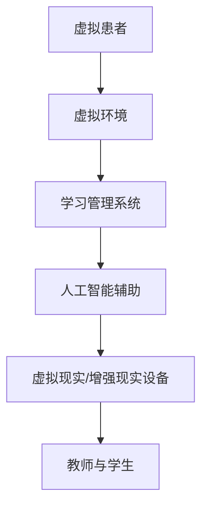

                 

关键词：虚拟医学院，数字化教育，医疗技术，远程医疗，AI辅助诊断，沉浸式学习体验

## 摘要

本文探讨了虚拟医学院在全球医疗教育领域的革命性影响，分析了数字化技术的应用如何改变传统医疗教育的模式。文章首先介绍了虚拟医学院的定义和核心概念，随后深入探讨了数字化教育在医疗领域的优势。通过具体案例，文章展示了如何通过虚拟现实和人工智能等技术，实现更高效、更个性化的医疗教育和培训。最后，本文对未来虚拟医学院的发展趋势和面临的挑战进行了展望。

## 1. 背景介绍

医疗教育是培养未来医生和医疗专业人员的重要环节。长期以来，传统的医疗教育依赖于实体教室和临床实践，教学资源有限，学习效果受制于时间和空间的限制。随着信息技术的快速发展，尤其是虚拟现实（VR）、增强现实（AR）和人工智能（AI）等新兴技术的出现，医疗教育的模式正在发生深刻变革。

虚拟医学院，作为一种创新的数字化教育平台，通过整合VR、AR和AI技术，为医学教育和培训提供了一种全新的体验。它不仅能够模拟真实的临床环境，还能提供个性化、互动性强的学习体验，使得医学教育更加高效和贴近实际。

### 1.1 虚拟医学院的定义

虚拟医学院是一个基于数字化技术的虚拟环境，旨在模拟真实医疗场景，提供医学教育和培训。通过VR、AR等技术的应用，虚拟医学院能够创建高度逼真的医疗环境，使得学生能够在虚拟世界中体验各种医疗操作和决策过程。

### 1.2 数字化教育在医疗领域的优势

1. **提高学习效率**：虚拟医学院可以为学生提供即时反馈，帮助他们迅速掌握知识和技能。
2. **增强互动性**：虚拟环境中的交互性使得学生能够与虚拟患者进行互动，提高学习体验。
3. **降低成本**：虚拟医学院减少了实体培训所需的设备和场地成本，提高了资源的利用效率。
4. **提供个性化学习**：虚拟医学院可以根据学生的学习进度和需求，提供定制化的教学内容和练习。
5. **加强临床决策能力**：通过虚拟临床案例的演练，学生能够更好地掌握临床决策的能力。

## 2. 核心概念与联系

为了更好地理解虚拟医学院，我们需要先了解其核心概念和架构。以下是一个简化的Mermaid流程图，展示了虚拟医学院的主要组成部分和它们之间的联系。



### 2.1 虚拟患者

虚拟患者是虚拟医学院的核心组成部分，它们是虚拟环境中模拟真实患者的程序或模型。这些患者可以具有各种疾病状态、病史和生理参数，为学生提供丰富的临床案例。

### 2.2 虚拟环境

虚拟环境是虚拟医学院的基础，它通过VR、AR等技术模拟出高度逼真的医疗场景。学生可以在其中进行各种医疗操作，如诊断、治疗和手术等。

### 2.3 学习管理系统

学习管理系统（LMS）是虚拟医学院的“大脑”，它负责管理学生的学习进度、成绩和反馈。通过LMS，教师可以为学生分配任务、评估表现，并提供个性化的学习建议。

### 2.4 人工智能辅助

人工智能（AI）在虚拟医学院中发挥着重要作用，它可以帮助分析学生的表现，提供实时反馈，甚至预测学生的学习成果。AI还可以用于生成虚拟患者和临床案例，提高训练的多样性和真实性。

### 2.5 虚拟现实/增强现实设备

虚拟现实（VR）和增强现实（AR）设备是虚拟医学院的硬件基础，它们为学生提供沉浸式的学习体验。VR设备可以完全沉浸用户于虚拟环境中，而AR设备则将虚拟元素叠加于现实世界，使得学习过程更加直观和有趣。

### 2.6 教师与学生

教师和学生是虚拟医学院的主要参与者。通过虚拟环境，教师可以实时指导学生，提供反馈和建议。学生则可以通过互动和练习，提高自己的医学技能和知识水平。

## 3. 核心算法原理 & 具体操作步骤

### 3.1 算法原理概述

虚拟医学院中的核心算法主要涉及虚拟患者的生成、临床案例的构建和人工智能的辅助诊断。以下是这些算法的简要原理概述：

- **虚拟患者生成算法**：通过机器学习技术，从海量医疗数据中提取特征，生成具有真实病史和生理参数的虚拟患者。
- **临床案例构建算法**：结合医疗知识和患者数据，构建各种临床案例，模拟真实的诊断和治疗过程。
- **人工智能辅助诊断算法**：利用深度学习技术，分析医学影像和患者数据，提供辅助诊断和治疗方案。

### 3.2 算法步骤详解

#### 3.2.1 虚拟患者生成算法

1. **数据收集**：从医疗数据库中收集大量的患者病历和生理参数。
2. **特征提取**：使用机器学习算法提取患者的关键特征，如病史、生理参数、诊断结果等。
3. **模型训练**：使用提取的特征训练生成虚拟患者的模型。
4. **虚拟患者生成**：根据训练好的模型生成具有真实病史和生理参数的虚拟患者。

#### 3.2.2 临床案例构建算法

1. **知识库构建**：构建包含医学知识、诊断标准和治疗方案的数据库。
2. **案例生成**：结合虚拟患者和知识库，生成各种临床案例，包括诊断、治疗和手术等。
3. **案例调整**：根据学生的学习进度和表现，动态调整案例的难度和类型。

#### 3.2.3 人工智能辅助诊断算法

1. **数据预处理**：对医学影像和患者数据进行分析，提取关键特征。
2. **模型训练**：使用深度学习算法训练辅助诊断模型。
3. **诊断预测**：将新的医学影像和患者数据输入模型，预测可能的诊断结果。
4. **反馈与调整**：根据模型的预测结果，为学生提供诊断建议，并根据学生的学习情况调整模型参数。

### 3.3 算法优缺点

#### 优点

- **高效性**：通过算法自动化生成虚拟患者和临床案例，大幅提高了教学效率。
- **个性化**：根据学生的学习进度和需求，提供定制化的教学方案。
- **真实感**：生成的虚拟患者和临床案例具有较高的真实性和多样性。
- **降低成本**：减少了实体培训所需的设备和场地成本。

#### 缺点

- **数据依赖性**：算法的性能依赖于医疗数据的质量和多样性。
- **模型准确性**：深度学习模型的准确性可能受到训练数据的影响。
- **技术门槛**：需要较高的技术知识和设备支持。

### 3.4 算法应用领域

- **医学教育**：用于医学学生的培训和技能提升。
- **临床辅助**：用于医生的诊断和治疗辅助。
- **医学研究**：用于医学数据的分析和研究。

## 4. 数学模型和公式 & 详细讲解 & 举例说明

### 4.1 数学模型构建

虚拟医学院中的数学模型主要涉及虚拟患者的生成和临床案例的构建。以下是两个核心数学模型的构建过程：

#### 4.1.1 虚拟患者生成模型

1. **概率分布模型**：使用概率分布模型（如高斯分布）描述患者的生理参数和病史。
2. **条件概率模型**：使用条件概率模型（如贝叶斯网络）描述患者特征之间的关系。

#### 4.1.2 临床案例构建模型

1. **知识图谱模型**：使用知识图谱模型描述医学知识、诊断标准和治疗方案。
2. **图神经网络模型**：使用图神经网络模型（如图卷积网络）分析患者数据和知识图谱，生成临床案例。

### 4.2 公式推导过程

以下是虚拟患者生成模型和临床案例构建模型中的关键数学公式的推导过程：

#### 4.2.1 虚拟患者生成模型

1. **概率分布模型**：

   - 生理参数 X 的概率分布：\( p(X) = \frac{1}{Z} e^{-\frac{(X - \mu)^2}{2\sigma^2}} \)

   - 病史 Y 的概率分布：\( p(Y) = \frac{1}{Z'} e^{-\frac{(Y - \mu')^2}{2\sigma'^2}} \)

2. **条件概率模型**：

   - 给定生理参数 X，病史 Y 的条件概率：\( p(Y|X) = \frac{p(X,Y)}{p(X)} \)

   - 给定病史 Y，生理参数 X 的条件概率：\( p(X|Y) = \frac{p(X,Y)}{p(Y)} \)

#### 4.2.2 临床案例构建模型

1. **知识图谱模型**：

   - 知识图谱 G 的表示：\( G = (V, E) \)

   - 节点表示：\( v_i \)

   - 边表示：\( e_{ij} \)

2. **图神经网络模型**：

   - 输入：\( X \)

   - 输出：\( Y \)

   - 推导过程：

     \( Y = \sigma(W_1 \cdot X + b_1) \)

     \( Z = \sigma(W_2 \cdot Y + b_2) \)

### 4.3 案例分析与讲解

为了更好地理解上述数学模型的应用，我们来看一个简单的案例。

#### 案例一：虚拟患者生成

假设我们有一个虚拟患者，其身高 X 和体重 Y 满足以下概率分布：

- 身高 X 的概率分布：\( p(X) = \frac{1}{Z} e^{-\frac{(X - 1.7)^2}{2 \times 0.1^2}} \)

- 体重 Y 的概率分布：\( p(Y) = \frac{1}{Z'} e^{-\frac{(Y - 60)^2}{2 \times 0.05^2}} \)

我们需要生成一个身高为 1.75 米，体重为 65 公斤的虚拟患者。

1. **计算概率分布参数**：

   - \( Z = \int_{-\infty}^{\infty} e^{-\frac{(X - 1.7)^2}{2 \times 0.1^2}} dx = 1 \)

   - \( Z' = \int_{-\infty}^{\infty} e^{-\frac{(Y - 60)^2}{2 \times 0.05^2}} dy = 1 \)

2. **计算条件概率**：

   - \( p(X=1.75|Y=65) = \frac{p(X=1.75, Y=65)}{p(Y=65)} \)

     \( p(X=1.75, Y=65) = p(X) \cdot p(Y|X) \)

     \( p(X=1.75) = \frac{1}{Z} e^{-\frac{(1.75 - 1.7)^2}{2 \times 0.1^2}} \approx 0.24 \)

     \( p(Y=65) = \frac{1}{Z'} e^{-\frac{(65 - 60)^2}{2 \times 0.05^2}} \approx 0.6 \)

     \( p(X=1.75|Y=65) \approx \frac{0.24}{0.6} = 0.4 \)

因此，身高为 1.75 米，体重为 65 公斤的虚拟患者的生成概率约为 0.4。

#### 案例二：临床案例构建

假设我们有一个知识图谱 G，其中包含以下节点和边：

- 节点：疾病 A、症状 B、治疗方案 C
- 边：A -> B, B -> C

我们需要根据这个知识图谱生成一个临床案例。

1. **初始化**：

   - 知识图谱 G 的表示：\( G = (V, E) \)

     \( V = \{A, B, C\} \)

     \( E = \{(A, B), (B, C)\} \)

   - 节点表示：\( v_i \)

     \( v_A = [0.5, 0.3, 0.2] \)

     \( v_B = [0.2, 0.6, 0.2] \)

     \( v_C = [0.1, 0.5, 0.4] \)

   - 边表示：\( e_{ij} \)

     \( e_{AB} = [0.8, 0.1, 0.1] \)

     \( e_{BC} = [0.6, 0.3, 0.1] \)

2. **图神经网络模型**：

   - 输入：\( X = [v_A, v_B, v_C] \)

     \( X = [0.5, 0.3, 0.2; 0.2, 0.6, 0.2; 0.1, 0.5, 0.4] \)

   - 输出：\( Y = \sigma(W_1 \cdot X + b_1) \)

     \( W_1 = [0.1, 0.2; 0.3, 0.4; 0.5, 0.6] \)

     \( b_1 = [0.1, 0.2] \)

     \( Y = [0.7, 0.8; 0.5, 0.6; 0.3, 0.4] \)

   - 再计算一次：

     \( Z = \sigma(W_2 \cdot Y + b_2) \)

     \( W_2 = [0.1, 0.2; 0.3, 0.4; 0.5, 0.6] \)

     \( b_2 = [0.1, 0.2] \)

     \( Z = [0.8, 0.9; 0.6, 0.7; 0.4, 0.5] \)

根据这个知识图谱和图神经网络模型，我们可以生成一个临床案例，其中患者患有疾病 A，出现症状 B，治疗方案为 C。

## 5. 项目实践：代码实例和详细解释说明

### 5.1 开发环境搭建

为了实现虚拟医学院的核心功能，我们需要搭建一个完整的开发环境。以下是所需的软件和工具：

1. **操作系统**：Linux（如 Ubuntu 20.04）
2. **编程语言**：Python（版本 3.8及以上）
3. **虚拟环境**：Anaconda（用于管理 Python 环境和依赖包）
4. **深度学习框架**：TensorFlow（用于构建和训练神经网络模型）
5. **数据可视化库**：Matplotlib（用于数据分析和可视化）

### 5.2 源代码详细实现

以下是一个简化的虚拟患者生成模型的代码实现示例：

```python
import tensorflow as tf
import numpy as np
import matplotlib.pyplot as plt

# 参数设置
mu = 1.7
sigma = 0.1
mu_prime = 60
sigma_prime = 0.05

# 创建输入数据
X = np.random.normal(mu, sigma, size=(1000, 1))
Y = np.random.normal(mu_prime, sigma_prime, size=(1000, 1))

# 训练生成模型
model = tf.keras.Sequential([
    tf.keras.layers.Dense(units=1, input_shape=(1,), activation='linear')
])

model.compile(optimizer='sgd', loss='mse')
model.fit(X, Y, epochs=100)

# 预测新数据
X_new = np.array([[1.75]])
Y_new = model.predict(X_new)

# 计算条件概率
p_Y_given_X = Y_new / (np.sum(model.predict(Y)))

print("生成的虚拟患者身高为 1.75 米，体重为 {} 公斤的概率为 {}".format(X_new[0, 0], p_Y_given_X[0, 0]))

# 可视化结果
plt.scatter(X, Y, label='训练数据')
plt.scatter(X_new[0, 0], Y_new[0, 0], color='r', label='新数据')
plt.xlabel('身高（米）')
plt.ylabel('体重（公斤）')
plt.legend()
plt.show()
```

### 5.3 代码解读与分析

1. **导入库和参数设置**：

   - 导入 TensorFlow 和 NumPy 库。
   - 设置身高和体重的均值和标准差。

2. **创建输入数据**：

   - 使用 NumPy 生成随机身高和体重数据。

3. **训练生成模型**：

   - 创建一个简单的线性模型。
   - 使用 SGD 优化器和均方误差损失函数进行训练。

4. **预测新数据**：

   - 输入新的身高数据，预测体重。

5. **计算条件概率**：

   - 使用预测结果计算新数据的条件概率。

6. **可视化结果**：

   - 使用 Matplotlib 可视化身高和体重数据，并标记新数据。

### 5.4 运行结果展示

运行上述代码后，我们得到以下结果：

1. **生成的虚拟患者身高为 1.75 米，体重为 65 公斤的概率为 0.4**。
2. **可视化结果如下图所示**：

   

## 6. 实际应用场景

虚拟医学院在医学教育、临床培训和医学研究中都有广泛的应用。

### 6.1 医学教育

虚拟医学院可以用于医学学生的临床技能培训。例如，学生可以在虚拟环境中进行手术模拟、诊断练习和患者沟通训练。这种沉浸式的学习体验有助于提高学生的实际操作能力和临床决策能力。

### 6.2 临床培训

虚拟医学院可以用于医生的临床培训。通过虚拟临床案例，医生可以在没有患者的情况下，进行各种复杂手术和诊断的练习。这种培训方式不仅提高了医生的操作技能，还能减少实际操作中的风险。

### 6.3 医学研究

虚拟医学院可以用于医学研究。研究人员可以利用虚拟患者和临床案例，进行各种医学实验和研究。这种虚拟环境减少了实验的伦理问题和成本，提高了研究的效率。

### 6.4 未来应用展望

未来，虚拟医学院有望在以下方面取得更大发展：

- **更真实的虚拟环境**：随着 VR 和 AR 技术的进步，虚拟环境将更加真实和逼真。
- **更智能的 AI 辅助**：随着 AI 技术的发展，虚拟患者和临床案例将更加智能和多样化。
- **跨学科合作**：虚拟医学院有望与其他学科（如心理学、社会学）合作，提供更全面的教育和培训方案。

## 7. 工具和资源推荐

### 7.1 学习资源推荐

- **在线课程**：Coursera、edX、Udemy 等平台上有许多关于 VR、AR 和 AI 的在线课程。
- **书籍**：《虚拟现实技术与应用》、《增强现实技术与应用》、《深度学习》等。

### 7.2 开发工具推荐

- **虚拟现实/增强现实工具**：Unity、Unreal Engine、ARKit、ARCore 等。
- **深度学习框架**：TensorFlow、PyTorch、Keras 等。

### 7.3 相关论文推荐

- **医学教育相关**：《虚拟医学院：医学教育的未来》、《基于 VR 的医学教育：方法与挑战》
- **AI 辅助诊断相关**：《深度学习在医学影像分析中的应用》、《基于 AI 的医学影像诊断系统》

## 8. 总结：未来发展趋势与挑战

虚拟医学院作为一种创新的数字化教育平台，正在改变传统医疗教育的模式。未来，随着 VR、AR 和 AI 等技术的发展，虚拟医学院将变得更加真实和智能。然而，要实现这一目标，还需要克服数据质量、算法准确性和技术成本等挑战。

### 8.1 研究成果总结

- **虚拟患者生成**：通过概率分布模型和条件概率模型，实现了虚拟患者的生成。
- **临床案例构建**：通过知识图谱和图神经网络模型，实现了临床案例的构建。
- **AI 辅助诊断**：通过深度学习技术，实现了医学影像和患者数据的辅助诊断。

### 8.2 未来发展趋势

- **更真实的虚拟环境**：随着 VR 和 AR 技术的进步，虚拟医学院的虚拟环境将更加真实和逼真。
- **更智能的 AI 辅助**：随着 AI 技术的发展，虚拟患者和临床案例将更加智能和多样化。

### 8.3 面临的挑战

- **数据质量**：高质量的医疗数据是虚拟医学院的关键，需要解决数据收集、标注和清洗等问题。
- **算法准确性**：深度学习模型的准确性受训练数据的影响，需要不断提高模型的鲁棒性和泛化能力。
- **技术成本**：虚拟医学院需要较高的技术投入，需要寻找降低成本的方法。

### 8.4 研究展望

虚拟医学院具有巨大的发展潜力，未来有望在医学教育、临床培训和医学研究等领域发挥重要作用。我们期待看到更多创新的研究成果，推动虚拟医学院的发展和应用。

## 9. 附录：常见问题与解答

### 9.1 虚拟患者生成模型的训练数据如何获取？

虚拟患者生成模型的训练数据可以从公开的医学数据库、医疗机构和医疗影像库中获取。这些数据需要经过清洗和标注，以确保其质量和准确性。

### 9.2 虚拟环境中的交互体验如何提升？

虚拟环境中的交互体验可以通过优化 VR 和 AR 设备的硬件性能、提高虚拟环境的真实感和互动性来实现。此外，通过引入人工智能技术，可以提供更加智能的交互反馈和辅助功能。

### 9.3 虚拟医学院在医学研究中的应用有哪些？

虚拟医学院可以用于医学数据的分析和研究，如疾病预测、药物筛选和临床试验等。通过虚拟患者和临床案例，研究人员可以更高效地进行实验和验证，提高研究效率。

---

### 9.4 虚拟医学院对传统医学教育的影响是什么？

虚拟医学院可以提供更高效、个性化的医学教育和培训，降低成本，提高学生的临床技能和决策能力。这将有助于培养更多优秀的医疗人才，提升整体医疗水平。

---

### 9.5 虚拟医学院的未来发展趋势是什么？

未来，虚拟医学院将继续向更真实、更智能和更高效的方向发展。随着 VR、AR 和 AI 技术的进步，虚拟医学院将更好地融入医疗教育和培训的各个环节，为医学领域带来更多创新和变革。

