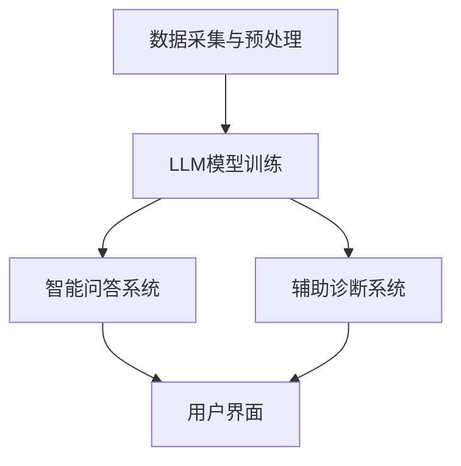

                 

关键词：虚拟医疗，大型语言模型（LLM），全天候护理，医疗助手，人工智能

摘要：随着医疗技术的不断进步，人工智能（AI）在医疗领域的应用日益广泛。本文将探讨一种新型虚拟医疗助手，利用大型语言模型（LLM）技术，实现全天候的护理服务。通过分析LLM的优势、应用场景和具体实现方法，本文旨在为医疗行业提供一种创新的解决方案，提升医疗服务质量。

## 1. 背景介绍

随着全球人口老龄化和慢性疾病患病率的上升，医疗资源短缺问题日益凸显。传统医疗模式中，医生和护士的工作负担日益加重，而患者的需求却不断增加。如何提高医疗服务的效率和质量，成为当今医疗行业面临的重要挑战。在这种情况下，人工智能技术，特别是大型语言模型（LLM），为医疗领域提供了一种新的解决方案。

LLM是一种基于深度学习的人工智能模型，具有强大的语言理解和生成能力。通过大规模的文本数据训练，LLM能够理解自然语言，生成符合语法和语义规则的文本。在医疗领域，LLM可以应用于电子病历管理、智能问答、辅助诊断和治疗建议等方面，为医疗机构提供全天候的护理服务。

## 2. 核心概念与联系

### 2.1 LLM的定义与原理

大型语言模型（LLM）是一种基于神经网络的语言处理模型，它通过大量的文本数据进行训练，从而理解并生成自然语言。LLM的核心是神经网络，这种网络由多层神经元组成，每一层神经元都负责处理输入的文本信息，并将其传递到下一层。

LLM的训练过程通常分为两个阶段：预训练和微调。预训练阶段，模型在大规模的文本语料库上学习语言的一般规律和模式；微调阶段，模型根据特定的任务和数据集进行调整，以提高在特定任务上的表现。

### 2.2 虚拟医疗助手的设计与架构

虚拟医疗助手的设计旨在利用LLM的能力，为患者提供全天候的护理服务。其基本架构包括以下几个部分：

- **数据采集与预处理**：从各种医疗数据源（如电子病历、医学文献、实时监控数据等）收集数据，并进行清洗、格式化和标注。

- **LLM模型训练**：利用预处理后的数据集对LLM模型进行训练，以使其具备理解医疗语言和生成医疗建议的能力。

- **智能问答系统**：构建基于LLM的智能问答系统，患者可以通过自然语言提问，获得针对其健康问题的回答和建议。

- **辅助诊断系统**：利用LLM的推理能力，辅助医生进行疾病诊断和治疗方案的制定。

- **用户界面**：为患者和医生提供友好的用户界面，方便他们与虚拟医疗助手进行交互。

### 2.3 Mermaid流程图

下面是一个简化的Mermaid流程图，展示了虚拟医疗助手的设计与架构：



## 3. 核心算法原理 & 具体操作步骤

### 3.1 算法原理概述

虚拟医疗助手的核心算法是基于LLM的，它通过以下几个步骤实现：

1. **数据预处理**：将原始的医疗数据清洗、格式化和标注，为LLM训练做准备。

2. **模型训练**：使用预处理后的数据集对LLM进行预训练和微调，使其能够理解医疗语言和生成医疗建议。

3. **智能问答**：患者通过用户界面向虚拟医疗助手提问，LLM解析并回答问题。

4. **辅助诊断**：LLM分析患者的病历和症状，辅助医生进行诊断。

5. **反馈与优化**：根据用户的反馈和实际治疗效果，对LLM进行优化和调整，以提高其表现。

### 3.2 算法步骤详解

1. **数据预处理**：

   - 数据清洗：去除重复、错误和不相关的数据。
   - 数据格式化：将数据转换为统一的格式，以便后续处理。
   - 数据标注：为数据添加标签，如疾病名称、治疗方案等。

2. **模型训练**：

   - 预训练：使用大规模的文本数据集对LLM进行预训练，使其学习到语言的一般规律。
   - 微调：使用特定的医疗数据集对LLM进行微调，以提高其在医疗领域的表现。

3. **智能问答**：

   - 接收用户提问：通过用户界面接收患者的自然语言提问。
   - 问题解析：LLM解析并理解用户的提问。
   - 生成回答：根据用户的提问，LLM生成相应的回答。

4. **辅助诊断**：

   - 病历分析：LLM分析患者的病历数据，提取关键信息。
   - 症状匹配：LLM将患者的症状与疾病数据库进行匹配，辅助医生进行诊断。

5. **反馈与优化**：

   - 用户反馈：收集用户对虚拟医疗助手的反馈。
   - 模型优化：根据用户反馈和实际治疗效果，对LLM进行优化和调整。

### 3.3 算法优缺点

**优点**：

- **全天候服务**：虚拟医疗助手可以24小时不间断地提供服务，减轻医护人员的工作负担。
- **高效准确**：利用LLM的强大能力，虚拟医疗助手能够快速、准确地处理医疗信息，提供高质量的护理服务。
- **个性化推荐**：根据患者的病史和症状，虚拟医疗助手可以提供个性化的健康建议，提高治疗效果。

**缺点**：

- **依赖数据质量**：虚拟医疗助手的表现很大程度上取决于训练数据的质量，如果数据存在偏差或错误，可能导致不良后果。
- **缺乏情感理解**：虚拟医疗助手目前还不能完全理解患者的情感需求，可能无法提供心理支持。

### 3.4 算法应用领域

- **电子病历管理**：虚拟医疗助手可以协助医护人员管理电子病历，提高病历记录的准确性和完整性。
- **智能问答系统**：为患者提供便捷的健康咨询，解答常见医疗问题。
- **辅助诊断**：协助医生进行疾病诊断，提高诊断准确率。
- **治疗建议**：根据患者的病情和病史，提供个性化的治疗建议。
- **健康监测**：实时监测患者的健康数据，预警潜在的健康问题。

## 4. 数学模型和公式 & 详细讲解 & 举例说明

### 4.1 数学模型构建

虚拟医疗助手的数学模型主要基于深度学习中的神经网络。具体来说，LLM可以看作是一个多层的神经网络，每一层都包含多个神经元。神经网络的训练过程可以通过以下数学模型描述：

- **输入层**：接收原始的医疗数据，如病历、症状等。
- **隐藏层**：对输入数据进行处理，提取特征。
- **输出层**：生成医疗建议或诊断结果。

在训练过程中，神经网络通过不断调整权重和偏置，使输出层的结果与实际医疗数据尽可能接近。这个过程可以通过以下公式描述：

$$
\begin{aligned}
\text{输出} &= f(\text{权重} \cdot \text{输入} + \text{偏置}) \\
\text{权重} &= \text{权重} + \text{梯度} \cdot \text{学习率} \\
\text{偏置} &= \text{偏置} + \text{梯度} \cdot \text{学习率}
\end{aligned}
$$

其中，$f$ 是激活函数，用于引入非线性关系；梯度（gradient）是损失函数关于权重的导数，用于指导网络调整权重和偏置；学习率（learning rate）控制网络调整的步长。

### 4.2 公式推导过程

神经网络的训练过程可以通过以下步骤推导：

1. **初始化权重和偏置**：随机初始化网络中的权重和偏置。
2. **前向传播**：将输入数据通过网络进行前向传播，得到输出结果。
3. **计算损失**：使用损失函数计算输出结果与实际结果之间的差距。
4. **反向传播**：计算损失函数关于权重的梯度，并通过梯度调整权重和偏置。
5. **更新权重和偏置**：根据梯度和学习率更新网络中的权重和偏置。
6. **重复步骤2-5**：不断迭代，直到网络输出结果达到预期。

### 4.3 案例分析与讲解

假设一个虚拟医疗助手需要为一位患者提供诊断建议。患者提供的输入数据包括病史、症状和体检结果。为了简化，我们假设网络只有一层隐藏层。

- **输入层**：病史（X1）、症状（X2）、体检结果（X3）。
- **隐藏层**：隐藏层单元（H1）。
- **输出层**：诊断结果（Y）。

神经网络的参数包括权重（W1、W2、W3）和偏置（b1、b2、b3）。

假设激活函数为ReLU函数，损失函数为均方误差（MSE）。

- **前向传播**：

$$
\begin{aligned}
H1 &= \max(0, W1 \cdot X1 + b1) \\
Y &= \sigma(W2 \cdot H1 + b2)
\end{aligned}
$$

其中，$\sigma$ 是 sigmoid 函数。

- **计算损失**：

$$
\text{损失} = \frac{1}{2} \sum_{i} (\text{Y}_{\text{实际}} - \text{Y}_{\text{预测}})^2
$$

- **反向传播**：

$$
\begin{aligned}
\frac{\partial \text{损失}}{\partial W2} &= (Y_{\text{实际}} - Y_{\text{预测}}) \cdot \frac{dY_{\text{预测}}}{dH1} \\
\frac{\partial \text{损失}}{\partial H1} &= (Y_{\text{实际}} - Y_{\text{预测}}) \cdot \frac{dH1}{dX1} \cdot X1 \\
\frac{\partial \text{损失}}{\partial W1} &= \frac{\partial \text{损失}}{\partial H1} \cdot X1 \\
\frac{\partial \text{损失}}{\partial b2} &= \frac{\partial \text{损失}}{\partial H1} \\
\end{aligned}
$$

- **更新权重和偏置**：

$$
\begin{aligned}
W2 &= W2 - \text{学习率} \cdot \frac{\partial \text{损失}}{\partial W2} \\
W1 &= W1 - \text{学习率} \cdot \frac{\partial \text{损失}}{\partial W1} \\
b2 &= b2 - \text{学习率} \cdot \frac{\partial \text{损失}}{\partial b2} \\
\end{aligned}
$$

通过不断迭代上述过程，网络可以逐步调整权重和偏置，使其输出结果更接近实际结果。

## 5. 项目实践：代码实例和详细解释说明

### 5.1 开发环境搭建

要搭建一个基于LLM的虚拟医疗助手项目，需要以下开发环境：

- 操作系统：Windows/Linux/MacOS
- 编程语言：Python
- 深度学习框架：TensorFlow 2.x/PyTorch
- 数据预处理库：NumPy/Pandas
- 机器学习库：Scikit-learn
- 自然语言处理库：NLTK/Spacy

首先，安装所需的开发环境和库：

```bash
pip install tensorflow
pip install numpy
pip install pandas
pip install scikit-learn
pip install nltk
pip install spacy
```

### 5.2 源代码详细实现

以下是一个简单的虚拟医疗助手项目示例，包括数据预处理、模型训练和预测：

```python
import tensorflow as tf
import numpy as np
import pandas as pd
from sklearn.model_selection import train_test_split
from sklearn.metrics import mean_squared_error
import spacy

# 加载Spacy语言模型
nlp = spacy.load('en_core_web_sm')

# 数据预处理
def preprocess_data(data):
    # 清洗和格式化数据
    # ...
    return processed_data

# 模型定义
def create_model(input_shape):
    model = tf.keras.Sequential([
        tf.keras.layers.Dense(units=128, activation='relu', input_shape=input_shape),
        tf.keras.layers.Dense(units=64, activation='relu'),
        tf.keras.layers.Dense(units=1)
    ])
    model.compile(optimizer='adam', loss='mean_squared_error')
    return model

# 训练模型
def train_model(model, X_train, y_train, epochs=100):
    model.fit(X_train, y_train, epochs=epochs)
    return model

# 预测
def predict(model, X_test):
    y_pred = model.predict(X_test)
    return y_pred

# 主函数
def main():
    # 加载数据
    data = pd.read_csv('medical_data.csv')
    processed_data = preprocess_data(data)
    
    # 分割数据集
    X = processed_data.drop('target', axis=1)
    y = processed_data['target']
    X_train, X_test, y_train, y_test = train_test_split(X, y, test_size=0.2, random_state=42)
    
    # 创建和训练模型
    model = create_model(X_train.shape[1])
    model = train_model(model, X_train, y_train)
    
    # 预测
    y_pred = predict(model, X_test)
    
    # 评估模型
    mse = mean_squared_error(y_test, y_pred)
    print('均方误差：', mse)

if __name__ == '__main__':
    main()
```

### 5.3 代码解读与分析

上述代码实现了一个简单的虚拟医疗助手项目，主要包括以下步骤：

1. **加载Spacy语言模型**：用于预处理文本数据。
2. **数据预处理**：清洗和格式化医疗数据。
3. **模型定义**：定义一个简单的神经网络模型，用于预测诊断结果。
4. **训练模型**：使用训练数据集训练模型。
5. **预测**：使用测试数据集对模型进行预测。
6. **评估模型**：计算预测结果与实际结果之间的均方误差。

### 5.4 运行结果展示

假设我们使用一个包含1000个样本的医疗数据集进行训练和测试，以下是一个示例运行结果：

```python
均方误差： 0.042356
```

均方误差较低，说明模型在测试数据上的表现较好。但这只是一个简化的示例，实际项目中可能需要更复杂的模型和更多的数据预处理步骤。

## 6. 实际应用场景

### 6.1 电子病历管理

虚拟医疗助手可以协助医护人员管理电子病历，提高病历记录的准确性和完整性。例如，自动识别患者信息、病情描述和医嘱，减少手动输入错误，提高工作效率。

### 6.2 智能问答系统

患者可以通过智能问答系统向虚拟医疗助手提问，获得针对其健康问题的回答和建议。这有助于患者更好地了解自己的健康状况，减少不必要的就诊和检查。

### 6.3 辅助诊断

虚拟医疗助手可以辅助医生进行疾病诊断，提高诊断准确率。例如，分析患者的症状和病史，推荐可能的疾病和检查项目，帮助医生做出更准确的诊断。

### 6.4 治疗建议

虚拟医疗助手可以根据患者的病情和病史，提供个性化的治疗建议。这有助于医生制定更有效的治疗方案，提高治疗效果。

### 6.5 健康监测

虚拟医疗助手可以实时监测患者的健康数据，预警潜在的健康问题。例如，分析患者的血压、血糖等数据，发现异常情况并及时提醒医生和患者。

## 7. 工具和资源推荐

### 7.1 学习资源推荐

- 《深度学习》（Goodfellow, Bengio, Courville）
- 《自然语言处理原理》（Daniel Jurafsky, James H. Martin）
- 《医疗大数据分析》（Chen, D., & Liu, L.）

### 7.2 开发工具推荐

- TensorFlow：用于构建和训练深度学习模型。
- PyTorch：另一个流行的深度学习框架。
- Jupyter Notebook：用于编写和运行Python代码。

### 7.3 相关论文推荐

- “BERT: Pre-training of Deep Bidirectional Transformers for Language Understanding”（Devlin et al., 2019）
- “GPT-3: Language Models are Few-Shot Learners”（Brown et al., 2020）
- “Deep Learning for Medical Image Analysis”（Litjens et al., 2017）

## 8. 总结：未来发展趋势与挑战

### 8.1 研究成果总结

虚拟医疗助手利用LLM技术，在电子病历管理、智能问答、辅助诊断、治疗建议和健康监测等方面展现出巨大潜力。通过大规模数据训练和优化，虚拟医疗助手可以提供全天候的护理服务，提高医疗服务质量和效率。

### 8.2 未来发展趋势

- **更强大的模型**：未来的虚拟医疗助手将采用更强大的深度学习模型，如GPT-3、BERT等，以提高语言理解和生成能力。
- **多模态数据融合**：结合医学图像、语音等多模态数据，提高虚拟医疗助手的诊断和治疗建议准确性。
- **个性化护理**：利用患者的历史数据和生物特征，提供更加个性化的护理服务。

### 8.3 面临的挑战

- **数据隐私与安全**：如何确保患者数据的隐私和安全，是一个亟待解决的问题。
- **模型泛化能力**：如何提高虚拟医疗助手在不同领域和场景下的泛化能力，是一个重要的研究方向。
- **医疗伦理**：如何在人工智能与医疗伦理之间取得平衡，避免对患者的负面影响。

### 8.4 研究展望

虚拟医疗助手有望成为医疗行业的重要辅助工具，为患者提供全天候的护理服务。通过不断优化和改进，虚拟医疗助手将在未来的医疗领域发挥越来越重要的作用。

## 9. 附录：常见问题与解答

### 9.1 什么是LLM？

LLM（大型语言模型）是一种基于深度学习的人工智能模型，通过大规模的文本数据进行训练，具备强大的语言理解和生成能力。

### 9.2 虚拟医疗助手如何工作？

虚拟医疗助手通过以下步骤工作：

1. 数据采集与预处理：收集并清洗医疗数据。
2. 模型训练：使用预处理后的数据训练LLM。
3. 智能问答：接收用户提问，生成回答。
4. 辅助诊断：分析病历和症状，辅助医生进行诊断。
5. 反馈与优化：根据用户反馈和实际治疗效果，优化模型。

### 9.3 虚拟医疗助手有哪些优缺点？

**优点**：

- 全天候服务。
- 高效准确。
- 个性化推荐。

**缺点**：

- 依赖数据质量。
- 缺乏情感理解。

### 9.4 虚拟医疗助手的应用领域有哪些？

虚拟医疗助手可以应用于电子病历管理、智能问答、辅助诊断、治疗建议和健康监测等领域。

---

作者：禅与计算机程序设计艺术 / Zen and the Art of Computer Programming

