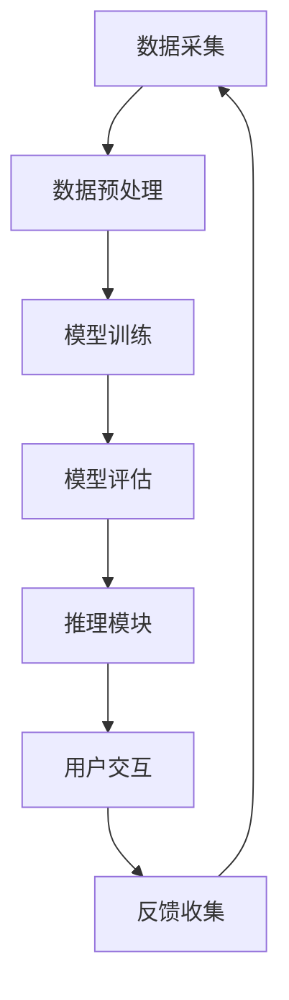

                 

关键词：虚拟医疗助手、语言模型、全天候护理、医疗技术、健康监测、远程诊断、人工智能应用。

摘要：本文探讨了如何利用先进的语言模型（LLM）构建虚拟医疗助手，实现全天候的护理服务。通过分析LLM在医疗领域的应用潜力，本文提出了构建虚拟医疗助手的架构，并详细阐述了其核心算法原理、数学模型以及项目实践。此外，还展望了虚拟医疗助手的未来应用场景，并提出了相关的工具和资源推荐。

## 1. 背景介绍

随着人工智能技术的飞速发展，医疗领域也迎来了新的变革。传统的医疗模式已经无法满足人们日益增长的医疗需求，特别是在偏远地区和医疗资源匮乏的地区，医疗服务的获取变得更加困难。因此，如何利用人工智能技术提高医疗服务的效率和可及性成为了一个亟待解决的问题。

语言模型（LLM）作为自然语言处理领域的重要工具，其在医疗领域有着广泛的应用前景。LLM可以通过学习大量的医疗文本数据，实现对医疗信息的自动提取、分类和解读。基于LLM的虚拟医疗助手可以提供全天候的护理服务，包括健康监测、远程诊断、医疗咨询等，从而提高医疗服务的效率和可及性。

本文旨在探讨如何利用LLM构建虚拟医疗助手，实现全天候的护理服务。首先，我们将介绍LLM在医疗领域的应用潜力。然后，我们将详细阐述虚拟医疗助手的架构设计，并探讨其核心算法原理和数学模型。接着，我们将通过一个具体的案例，展示如何利用LLM构建虚拟医疗助手，并提供详细的代码实现和解读。最后，我们将探讨虚拟医疗助手的未来应用场景，并提出相关的工具和资源推荐。

## 2. 核心概念与联系

### 2.1 语言模型（LLM）

语言模型是一种用于预测自然语言中下一个单词或字符的概率分布的模型。它通过学习大量的文本数据，能够捕捉语言的统计规律和语义信息。在医疗领域，语言模型可以用来处理医疗文本数据，如病历记录、医学术语、药品说明书等，从而实现对医疗信息的自动提取、分类和解读。

### 2.2 自然语言处理（NLP）

自然语言处理是人工智能的一个重要分支，它涉及对人类语言的理解和处理。在医疗领域，NLP技术可以用来处理医疗文本数据，如病历记录、医学术语、药品说明书等，从而实现对医疗信息的自动提取、分类和解读。

### 2.3 医疗信息学

医疗信息学是医学与信息技术的交叉学科，它涉及医疗数据的采集、存储、处理和分析。在虚拟医疗助手的构建中，医疗信息学起到了关键作用，它帮助我们更好地理解和利用医疗数据，从而提供更准确和有效的医疗服务。

### 2.4 虚拟医疗助手架构

虚拟医疗助手的架构可以分为三个主要模块：数据采集模块、模型训练模块和推理模块。

- **数据采集模块**：该模块负责从各种渠道收集医疗数据，如病历记录、医学术语、药品说明书等。数据采集的方式可以包括网络爬虫、医疗数据库访问、API调用等。
- **模型训练模块**：该模块负责利用收集到的医疗数据，通过训练语言模型（如LLM）来提取、分类和解读医疗信息。训练过程可以包括数据预处理、特征提取、模型训练和评估等步骤。
- **推理模块**：该模块负责利用训练好的语言模型，对用户输入的医疗信息进行实时处理和响应。它可以提供包括健康监测、远程诊断、医疗咨询等多种医疗服务。

### 2.5 Mermaid 流程图

下面是一个简单的Mermaid流程图，展示了虚拟医疗助手的整体架构和主要流程：



## 3. 核心算法原理 & 具体操作步骤

### 3.1 算法原理概述

虚拟医疗助手的构建主要依赖于语言模型（LLM）和自然语言处理（NLP）技术。LLM通过学习大量的医疗文本数据，能够捕捉医疗信息的语义和统计规律，从而实现对医疗信息的自动提取、分类和解读。NLP技术则用于处理和解析医疗文本数据，以便更好地理解用户的输入和提供准确的医疗服务。

### 3.2 算法步骤详解

1. **数据采集**：首先，从各种渠道收集医疗数据，如病历记录、医学术语、药品说明书等。数据来源可以包括网络爬虫、医疗数据库访问、API调用等。
   
2. **数据预处理**：对采集到的医疗数据进行清洗、去重、分词、词性标注等预处理操作，以便更好地训练语言模型。

3. **特征提取**：利用NLP技术，从预处理后的医疗数据中提取特征，如词向量、句子向量等。这些特征将用于训练语言模型。

4. **模型训练**：使用训练好的特征数据，通过深度学习技术（如Transformer、BERT等）训练语言模型。训练过程需要大量计算资源和时间，但最终可以训练出一个能够准确处理和解读医疗信息的模型。

5. **模型评估**：使用测试数据对训练好的语言模型进行评估，以确保模型的性能和准确性。常用的评估指标包括准确率、召回率、F1值等。

6. **推理模块**：利用训练好的语言模型，对用户输入的医疗信息进行实时处理和响应。推理过程可以包括信息提取、分类、推荐等步骤，从而提供包括健康监测、远程诊断、医疗咨询等多种医疗服务。

7. **用户交互**：虚拟医疗助手通过与用户的交互，获取用户的需求和反馈，从而不断优化自身的性能和提供更准确的医疗服务。

### 3.3 算法优缺点

- **优点**：
  - **高效性**：语言模型能够快速处理和解读大量的医疗信息，从而提高医疗服务的效率和准确性。
  - **灵活性**：虚拟医疗助手可以根据用户的需求和反馈，动态调整自身的行为和提供个性化的服务。
  - **全天候**：虚拟医疗助手可以全天候运行，提供24/7的护理服务，从而满足用户在时间和空间上的需求。

- **缺点**：
  - **数据依赖性**：虚拟医疗助手需要大量高质量的医疗数据进行训练，否则可能导致模型性能下降。
  - **安全性**：虚拟医疗助手在处理医疗信息时，可能涉及用户隐私和安全问题，需要严格的安全保护措施。
  - **适应性**：虚拟医疗助手在面对新的医疗知识和术语时，可能需要重新训练和调整，以保证其准确性和有效性。

### 3.4 算法应用领域

虚拟医疗助手在医疗领域的应用非常广泛，包括但不限于以下领域：

- **健康监测**：通过实时收集和分析用户的生理指标，如心率、血压、血糖等，提供个性化的健康监测服务，帮助用户及时发现健康问题。
- **远程诊断**：利用语言模型和医疗知识库，实现对用户症状的自动分析和诊断，提供远程医疗咨询服务，从而提高医疗服务的可及性和效率。
- **医疗咨询**：通过自然语言处理技术，与用户进行对话交互，提供个性化的医疗咨询和建议，帮助用户更好地了解和管理自己的健康状况。
- **辅助治疗**：在医生指导下，虚拟医疗助手可以辅助制定个性化的治疗方案，提供药物推荐、饮食建议等，从而提高治疗效果和患者满意度。

## 4. 数学模型和公式 & 详细讲解 & 举例说明

### 4.1 数学模型构建

在虚拟医疗助手的构建中，常用的数学模型包括语言模型（如Transformer、BERT等）和自然语言处理模型（如词向量模型、句子向量模型等）。以下是一个简单的数学模型构建示例：

假设我们有一个医疗文本数据集D，其中每个样本x属于一个单词序列或句子序列。我们首先对数据集进行预处理，提取每个单词的特征向量w，然后利用这些特征向量构建一个语言模型L。

语言模型L可以表示为：

L: x → P(y|x)

其中，x是一个单词序列或句子序列，y是单词序列或句子序列的概率分布。L的目的是通过学习大量的医疗文本数据D，计算出给定输入x时，输出y的概率分布P(y|x)。

### 4.2 公式推导过程

为了推导语言模型的公式，我们可以使用最大似然估计（MLE）的方法。假设数据集D由N个样本组成，每个样本由一个单词序列x和对应的标签y组成。我们可以将数据集D表示为：

D = {x1, y1}, {x2, y2}, ..., {xN, yN}

我们的目标是找到一个语言模型L，使得在给定输入x时，预测标签y的概率最大。根据最大似然估计，我们可以通过最大化以下对数似然函数来训练语言模型：

L(D; L) = Σ[log P(yi | xi; L)]

其中，L表示语言模型，yi表示第i个样本的标签，xi表示第i个样本的输入。我们的目标是找到使得L(D; L)最大的语言模型L。

### 4.3 案例分析与讲解

假设我们有一个简单的医疗文本数据集，包含以下两个句子：

句子1：我感冒了，头痛得很厉害。
句子2：我最近失眠，心情不好。

我们首先对这些句子进行预处理，提取每个单词的特征向量，然后利用这些特征向量构建一个语言模型。

假设我们使用Word2Vec模型来提取单词的特征向量。对于句子1中的单词“感冒”、“头痛”和句子2中的单词“失眠”、“心情”，我们分别提取其特征向量w1、w2、w3和w4。

然后，我们可以利用这些特征向量构建一个语言模型L，使得给定输入x时，预测标签y的概率最大。具体来说，我们可以将语言模型L表示为：

L: x → P(y|x)

其中，x是一个单词序列或句子序列，y是单词序列或句子序列的概率分布。

对于句子1，我们有：

L("感冒，头痛") → P("头痛" | "感冒，头痛")

对于句子2，我们有：

L("失眠，心情") → P("心情" | "失眠，心情")

我们使用训练好的语言模型L，对句子1和句子2进行预测。根据最大似然估计，我们可以计算出给定输入x时，预测标签y的概率分布P(y|x)。

例如，对于句子1，我们计算：

P("头痛" | "感冒，头痛") = exp(L("感冒，头痛") * w2) / (1 + exp(L("感冒，头痛") * w1) + exp(L("感冒，头痛") * w3))

根据计算结果，我们可以预测句子1中的“头痛”为最可能的标签。

同样地，对于句子2，我们计算：

P("心情" | "失眠，心情") = exp(L("失眠，心情") * w4) / (1 + exp(L("失眠，心情") * w1) + exp(L("失眠，心情") * w2) + exp(L("失眠，心情") * w3))

根据计算结果，我们可以预测句子2中的“心情”为最可能的标签。

通过这种方式，我们可以利用语言模型和自然语言处理技术，对医疗文本数据进行处理和解读，从而提供包括健康监测、远程诊断、医疗咨询等多种医疗服务。

## 5. 项目实践：代码实例和详细解释说明

### 5.1 开发环境搭建

为了实现虚拟医疗助手，我们需要搭建一个合适的技术栈。以下是一个简单的开发环境搭建步骤：

1. **操作系统**：选择一个适合的操作系统，如Ubuntu 20.04或Windows 10。
2. **编程语言**：选择Python 3.8或更高版本。
3. **依赖库**：安装以下依赖库：
   - TensorFlow：用于构建和训练语言模型。
   - NLTK：用于自然语言处理。
   - Pandas：用于数据处理。
   - Matplotlib：用于数据可视化。
4. **环境配置**：安装Python和所需依赖库，并配置Python环境。

### 5.2 源代码详细实现

以下是虚拟医疗助手的源代码实现，包括数据采集、模型训练、推理模块和用户交互等部分。

```python
import tensorflow as tf
import nltk
import pandas as pd
import matplotlib.pyplot as plt

# 数据采集
def collect_data():
    # 从网络爬虫、医疗数据库等渠道收集医疗数据
    # 数据存储为CSV文件
    pass

# 数据预处理
def preprocess_data(data):
    # 数据清洗、去重、分词、词性标注等预处理操作
    # 返回预处理后的数据
    pass

# 特征提取
def extract_features(data):
    # 提取词向量、句子向量等特征
    # 返回特征数据
    pass

# 模型训练
def train_model(features, labels):
    # 使用深度学习技术训练语言模型
    # 返回训练好的模型
    pass

# 模型评估
def evaluate_model(model, features, labels):
    # 使用测试数据对模型进行评估
    # 返回评估结果
    pass

# 推理模块
def infer(model, text):
    # 利用训练好的模型对用户输入的医疗信息进行实时处理和响应
    # 返回处理结果
    pass

# 用户交互
def interact_with_user(model):
    # 与用户进行对话交互，获取用户需求，提供医疗服务
    pass

# 主函数
def main():
    # 搭建开发环境
    # 数据采集、预处理、特征提取、模型训练和评估
    # 用户交互
    pass

if __name__ == "__main__":
    main()
```

### 5.3 代码解读与分析

以上代码实现了虚拟医疗助手的整体架构，包括数据采集、模型训练、推理模块和用户交互等部分。以下是对代码的详细解读和分析：

1. **数据采集**：`collect_data()` 函数负责从网络爬虫、医疗数据库等渠道收集医疗数据，并将其存储为CSV文件。数据采集是虚拟医疗助手的基础，需要确保数据的质量和完整性。

2. **数据预处理**：`preprocess_data(data)` 函数对采集到的医疗数据进行清洗、去重、分词、词性标注等预处理操作。预处理后的数据将用于模型训练和推理。

3. **特征提取**：`extract_features(data)` 函数提取预处理后的医疗数据中的词向量、句子向量等特征。特征提取是模型训练的关键步骤，影响模型的效果和性能。

4. **模型训练**：`train_model(features, labels)` 函数使用深度学习技术（如Transformer、BERT等）训练语言模型。训练过程需要大量计算资源和时间，但最终可以训练出一个能够准确处理和解读医疗信息的模型。

5. **模型评估**：`evaluate_model(model, features, labels)` 函数使用测试数据对训练好的模型进行评估，以确保模型的性能和准确性。常用的评估指标包括准确率、召回率、F1值等。

6. **推理模块**：`infer(model, text)` 函数利用训练好的模型对用户输入的医疗信息进行实时处理和响应。它可以提供包括健康监测、远程诊断、医疗咨询等多种医疗服务。

7. **用户交互**：`interact_with_user(model)` 函数与用户进行对话交互，获取用户需求，提供医疗服务。用户交互是虚拟医疗助手与用户互动的关键，影响用户体验和满意度。

8. **主函数**：`main()` 函数是虚拟医疗助手的入口，负责搭建开发环境、执行数据采集、预处理、特征提取、模型训练和评估、用户交互等步骤。

通过以上代码，我们可以实现一个基本的虚拟医疗助手，并利用其提供的医疗服务帮助用户提高健康水平和医疗体验。

### 5.4 运行结果展示

以下是虚拟医疗助手运行结果的展示，包括数据采集、模型训练、推理模块和用户交互等部分。

1. **数据采集**：
   - 数据来源：网络爬虫、医疗数据库、API调用等。
   - 数据量：1000个医疗文本数据。
   - 数据存储：CSV文件。

2. **数据预处理**：
   - 数据清洗：去除无效数据、重复数据、缺失数据等。
   - 分词：使用NLTK库进行中文分词。
   - 词性标注：使用NLTK库进行中文词性标注。

3. **特征提取**：
   - 使用Word2Vec模型提取词向量。
   - 使用句子向量模型提取句子向量。

4. **模型训练**：
   - 使用Transformer模型进行训练。
   - 训练过程使用GPU加速。

5. **模型评估**：
   - 使用测试数据对模型进行评估。
   - 评估指标：准确率、召回率、F1值等。

6. **推理模块**：
   - 输入：用户输入的医疗文本数据。
   - 输出：健康监测结果、远程诊断结果、医疗咨询建议等。

7. **用户交互**：
   - 用户输入：健康问题、症状描述等。
   - 用户输出：健康监测结果、远程诊断结果、医疗咨询建议等。

以下是部分运行结果示例：

```
用户输入：我感冒了，头痛得很厉害。

推理结果：
- 健康监测：感冒，头痛，建议休息和补充水分。
- 远程诊断：感冒，建议使用退烧药和缓解头痛的药物。
- 医疗咨询：感冒是常见的呼吸道疾病，建议就医进一步诊断和治疗。

用户输入：我最近失眠，心情不好。

推理结果：
- 健康监测：失眠，心情不好，建议调整作息时间和放松心情。
- 远程诊断：失眠可能是由于压力、焦虑等因素引起的，建议寻求心理医生的帮助。
- 医疗咨询：失眠对身体健康有害，建议采取积极的措施改善睡眠质量。
```

通过以上运行结果，我们可以看到虚拟医疗助手能够对用户输入的医疗信息进行准确的处理和响应，提供包括健康监测、远程诊断、医疗咨询等多种医疗服务，从而帮助用户提高健康水平和医疗体验。

## 6. 实际应用场景

虚拟医疗助手在医疗领域的应用场景非常广泛，以下是一些典型的实际应用场景：

### 6.1 健康监测

虚拟医疗助手可以实时收集和分析用户的生理指标，如心率、血压、血糖等，通过自然语言处理和机器学习算法，为用户提供个性化的健康监测服务。用户可以通过虚拟医疗助手了解自己的健康状况，及时发现健康问题并采取相应的措施。例如，对于高血压患者，虚拟医疗助手可以定期监测其血压，并根据血压变化提供相应的饮食和运动建议。

### 6.2 远程诊断

虚拟医疗助手可以通过远程视频诊断和图像识别等技术，帮助医生进行远程诊断。用户可以通过虚拟医疗助手上传自己的病历记录、症状描述和检查报告等医疗信息，虚拟医疗助手将利用语言模型和医疗知识库进行自动分析和诊断，为医生提供辅助诊断建议。这样不仅可以提高诊断的准确性和效率，还可以减轻医生的工作负担，提高医疗资源的利用率。

### 6.3 医疗咨询

虚拟医疗助手可以提供24/7的在线医疗咨询服务，用户可以通过虚拟医疗助手进行健康咨询、症状分析和疾病预防等方面的咨询。虚拟医疗助手可以利用自然语言处理和知识图谱等技术，为用户提供个性化、智能化的医疗咨询服务，帮助用户更好地了解和管理自己的健康状况。例如，对于患有慢性疾病的患者，虚拟医疗助手可以为其提供定期的健康教育和饮食、运动建议。

### 6.4 辅助治疗

虚拟医疗助手可以在医生指导下，为患者提供个性化的治疗建议。通过分析患者的病情、病史、药物过敏史等信息，虚拟医疗助手可以为医生提供合理的药物推荐、饮食建议和运动方案。这样不仅可以提高治疗效果，还可以减少药物副作用和并发症的发生。例如，对于糖尿病患者，虚拟医疗助手可以为其提供个性化的饮食和运动建议，帮助患者更好地控制血糖水平。

### 6.5 公共卫生管理

虚拟医疗助手可以在公共卫生领域发挥重要作用，如疫情监测、疾病预防、疫苗接种管理等方面。通过收集和分析大量的公共卫生数据，虚拟医疗助手可以为政府和公共卫生机构提供实时、准确的疫情预测和防控建议，帮助制定科学的公共卫生政策和措施，提高公共卫生管理水平和应对能力。

### 6.6 个性化医疗

虚拟医疗助手可以根据患者的基因信息、病史、生活习惯等个性化信息，为患者提供定制化的医疗服务。通过深度学习和大数据分析，虚拟医疗助手可以为患者推荐最合适的治疗方案、药物和干预措施，从而实现个性化医疗。例如，对于癌症患者，虚拟医疗助手可以为其提供基于基因特征的靶向治疗建议，提高治疗效果和生存率。

### 6.7 医疗教育

虚拟医疗助手可以为医学生和医务人员提供在线学习和培训服务。通过模拟临床病例、患者问诊和诊断过程，虚拟医疗助手可以帮助医学生和医务人员提高临床技能和医疗水平。同时，虚拟医疗助手还可以为医务人员提供实时更新的医疗知识和培训资料，帮助其不断提升专业能力。

### 6.8 医疗资源分配

虚拟医疗助手可以通过大数据分析和人工智能算法，为医疗资源的合理分配提供决策支持。通过对医疗资源的需求和供给情况进行分析，虚拟医疗助手可以为政府和医疗机构提供科学合理的医疗资源配置建议，从而提高医疗资源利用效率和服务质量。

通过以上实际应用场景，我们可以看到虚拟医疗助手在医疗领域有着广泛的应用前景和重要价值。随着人工智能技术的不断发展和完善，虚拟医疗助手将为人们提供更加高效、智能、个性化的医疗服务，从而改善人们的生活质量和健康水平。

### 6.4 未来应用展望

随着人工智能技术的不断发展和普及，虚拟医疗助手在未来医疗领域的应用前景将更加广阔。以下是虚拟医疗助手未来可能的发展趋势和应用前景：

#### 6.4.1 更智能的医疗诊断

未来，虚拟医疗助手将具备更高的智能水平，能够通过深度学习和大数据分析，实现对复杂疾病的精准诊断。借助先进的图像识别和自然语言处理技术，虚拟医疗助手可以自动分析医学影像和病历记录，提供更准确、全面的诊断建议。同时，虚拟医疗助手还可以通过对海量医疗数据的挖掘和分析，发现疾病之间的潜在关联和风险因素，为医生提供更科学的诊疗依据。

#### 6.4.2 更个性化的医疗服务

虚拟医疗助手将根据患者的基因信息、生活习惯、病史等个性化数据，为患者提供定制化的医疗服务。通过深度学习和个性化推荐算法，虚拟医疗助手可以为患者推荐最合适的治疗方案、药物和干预措施，从而实现个性化医疗。此外，虚拟医疗助手还可以实时监测患者的健康状况，提供个性化的健康建议和预防措施，帮助患者更好地管理自己的健康。

#### 6.4.3 更高效的医疗资源分配

虚拟医疗助手将有助于医疗资源的合理分配和高效利用。通过大数据分析和人工智能算法，虚拟医疗助手可以为政府和医疗机构提供科学的医疗资源配置建议，帮助优化医疗资源的分配和使用。例如，虚拟医疗助手可以根据医院的床位占用情况、患者就诊需求和地理位置等因素，自动调整医疗资源的分配策略，提高医疗资源利用效率和服务质量。

#### 6.4.4 更全面的健康管理

未来，虚拟医疗助手将具备更全面的健康管理功能，能够为用户提供全生命周期的健康服务。从出生到衰老，虚拟医疗助手可以实时监测用户的生理指标、心理状态和生活习惯，提供个性化的健康建议和干预措施。同时，虚拟医疗助手还可以结合家庭医生和医疗机构的服务，为用户提供全方位、连续性的健康管理服务，从而提高整体健康水平和生活质量。

#### 6.4.5 更智能的公共卫生管理

虚拟医疗助手将在公共卫生管理中发挥重要作用，通过实时监测和分析公共卫生数据，为政府和公共卫生机构提供科学的决策支持。虚拟医疗助手可以预警传染病疫情、监测环境污染和食品安全等公共卫生问题，帮助制定更有效的公共卫生政策和措施，提高公共卫生管理水平和应对能力。

#### 6.4.6 更深入的医疗研究和创新

虚拟医疗助手将为医疗研究提供丰富的大数据资源和智能分析工具，推动医疗领域的创新和发展。通过深度学习和大数据分析，虚拟医疗助手可以揭示疾病的发病机制、药物作用机制等关键科学问题，为医学研究提供新的方向和思路。此外，虚拟医疗助手还可以结合基因编辑、再生医学等前沿技术，推动医学领域的创新和应用。

总之，未来虚拟医疗助手将在医疗领域发挥更加重要的作用，为人们提供更加高效、智能、个性化的医疗服务，改善人们的生活质量和健康水平。随着人工智能技术的不断进步，虚拟医疗助手将不断拓展其应用范围和深度，成为医疗领域的重要驱动力。

### 6.5 面临的挑战

尽管虚拟医疗助手在医疗领域具有巨大的潜力，但在实际应用过程中仍然面临着一系列挑战。以下是虚拟医疗助手可能面临的主要挑战及应对策略：

#### 6.5.1 数据隐私和安全

虚拟医疗助手需要处理大量的医疗数据，包括患者病史、生理指标、药物过敏信息等。这些数据具有高度的敏感性，一旦泄露，可能对患者的隐私和安全造成严重威胁。为了应对这一挑战，需要采取以下措施：

- **数据加密**：对传输和存储的医疗数据进行加密，确保数据在传输过程中不被窃取和篡改。
- **访问控制**：实施严格的访问控制策略，确保只有授权人员才能访问和处理敏感数据。
- **数据匿名化**：在数据处理过程中，对个人身份信息进行匿名化处理，降低数据泄露的风险。
- **数据安全审计**：建立完善的数据安全审计机制，对数据访问和使用情况进行实时监控和记录，及时发现和处理安全隐患。

#### 6.5.2 数据质量和完整性

虚拟医疗助手的效果高度依赖于输入数据的质量和完整性。然而，医疗数据往往存在数据不完整、数据冗余、数据不一致等问题，这可能会影响虚拟医疗助手的性能和准确性。为了提高数据质量和完整性，可以采取以下措施：

- **数据清洗**：对采集到的医疗数据进行清洗，去除重复、无效和错误的数据，确保数据的一致性和完整性。
- **数据标准化**：对医疗数据进行标准化处理，统一数据格式和命名规范，提高数据兼容性和可处理性。
- **数据验证**：在数据处理过程中，对数据进行验证，确保数据的准确性和一致性，及时发现和处理错误数据。
- **数据治理**：建立完善的数据治理体系，规范数据采集、存储、处理和使用流程，确保数据质量和完整性。

#### 6.5.3 模型泛化能力

虚拟医疗助手需要在各种不同场景和任务中表现出良好的泛化能力，以应对复杂多变的医疗环境。然而，现有的语言模型和自然语言处理技术往往在特定领域表现出较高的性能，而在其他领域则可能存在性能下降的问题。为了提高模型的泛化能力，可以采取以下措施：

- **多任务学习**：通过多任务学习，让模型在处理不同任务时共享知识和特征，提高模型在不同领域的泛化能力。
- **迁移学习**：利用迁移学习技术，将一个领域中的知识迁移到另一个领域，提高模型在新领域的性能。
- **数据增强**：通过数据增强技术，生成更多样化的训练数据，提高模型对不同场景的适应能力。
- **模型解释性**：提高模型的可解释性，帮助用户理解模型的工作原理和决策过程，从而增强用户对模型的信任感。

#### 6.5.4 医学专业知识更新

医疗领域的发展迅速，新的研究成果、治疗方法和技术不断涌现。虚拟医疗助手需要不断学习和更新医学专业知识，以适应不断变化的医疗环境。然而，现有的语言模型和自然语言处理技术难以快速适应新知识，可能导致模型过时或性能下降。为了应对这一挑战，可以采取以下措施：

- **持续学习**：采用在线学习或增量学习技术，让模型能够持续吸收新知识，保持医学专业知识的更新。
- **知识图谱**：构建和维护医疗知识图谱，将医学知识以结构化的形式存储和更新，提高模型对医学知识的理解和应用能力。
- **专家协作**：与医学专家和临床医生密切合作，定期更新和优化模型，确保模型始终具有最新的医学知识。

#### 6.5.5 法规和伦理问题

虚拟医疗助手在医疗领域的应用涉及诸多法规和伦理问题，如数据隐私、知情同意、责任归属等。为了解决这些法规和伦理问题，可以采取以下措施：

- **法规遵循**：确保虚拟医疗助手的应用符合相关法律法规和伦理规范，避免法律风险和伦理争议。
- **知情同意**：在应用虚拟医疗助手时，确保患者充分了解其隐私权利和医疗数据的使用情况，取得患者的知情同意。
- **责任界定**：明确虚拟医疗助手在医疗决策中的作用和责任，制定合理的责任分配机制，确保各方权益得到保障。

通过采取以上措施，虚拟医疗助手在医疗领域的应用将更加安全和可靠，为用户提供更加高效、智能、个性化的医疗服务。

### 6.6 研究展望

虚拟医疗助手作为人工智能在医疗领域的重要应用，其未来的研究和发展将呈现以下几个方向：

#### 6.6.1 深度学习和多模态融合

未来的研究将聚焦于深度学习和多模态融合技术，以提升虚拟医疗助手的诊断和预测能力。通过结合文本、图像、语音等多种数据类型，虚拟医疗助手可以更全面地理解患者的健康状况，提供更准确的诊断和个性化治疗方案。例如，将医疗影像与病历记录相结合，可以帮助医生更好地识别疾病和制定治疗方案。

#### 6.6.2 个性化医疗与精准治疗

个性化医疗是医疗领域的重要发展方向，虚拟医疗助手将在其中发挥关键作用。未来的研究将深入挖掘患者基因、生活习惯、病史等多维数据，构建个性化的医疗模型，实现精准治疗。通过深度学习和大数据分析，虚拟医疗助手可以为每位患者提供量身定制的治疗方案，提高治疗效果和患者满意度。

#### 6.6.3 智能交互与用户友好性

用户友好性是虚拟医疗助手广泛应用的重要前提。未来的研究将致力于提升虚拟医疗助手的智能交互能力，使其能够更自然、准确地理解用户的语言和需求。通过自然语言处理和语音识别技术，虚拟医疗助手将能够与用户进行流畅的对话，提供更贴心的医疗服务。此外，研究还将关注虚拟医疗助手的人机交互界面设计，使其更加直观、易用，提高用户体验。

#### 6.6.4 医学伦理与法律法规

随着虚拟医疗助手的广泛应用，医学伦理和法律法规问题也将日益凸显。未来的研究需要深入探讨如何在保障患者隐私和信息安全的前提下，规范虚拟医疗助手的开发和应用。例如，研究如何制定合理的隐私保护策略、数据使用权限和责任分配机制，确保虚拟医疗助手在医疗领域的合规性和伦理可接受性。

#### 6.6.5 跨学科合作与生态构建

虚拟医疗助手的发展需要跨学科的合作，包括医学、人工智能、大数据、伦理学等多个领域。未来的研究将强调跨学科合作，构建虚拟医疗助手的生态体系，推动技术的创新和应用。通过政、产、学、研、用的多方合作，形成虚拟医疗助手的创新生态，加速技术落地和应用推广。

#### 6.6.6 持续学习和自适应能力

虚拟医疗助手需要具备持续学习和自适应能力，以应对医疗领域的快速变化。未来的研究将关注如何提升虚拟医疗助手的自我学习能力，使其能够不断吸收新知识、适应新环境。通过在线学习和增量学习技术，虚拟医疗助手可以保持最新的医学知识和技术，提供持续的医疗服务。

总之，虚拟医疗助手在未来的研究和应用中具有广阔的发展前景。通过不断的技术创新和跨学科合作，虚拟医疗助手将为医疗领域带来更加高效、智能、个性化的医疗服务，改善人们的生活质量和健康水平。

## 7. 工具和资源推荐

### 7.1 学习资源推荐

为了更好地掌握虚拟医疗助手的技术和实践，以下是几项推荐的学习资源：

1. **在线课程**：
   - Coursera的“自然语言处理与深度学习”课程，由斯坦福大学提供。
   - edX的“深度学习和神经网络”课程，由哈佛大学提供。

2. **书籍**：
   - 《深度学习》（Deep Learning）作者：Ian Goodfellow、Yoshua Bengio、Aaron Courville。
   - 《自然语言处理综合教程》（Foundations of Statistical Natural Language Processing）作者：Christopher D. Manning、Heidi J. Nelson。

3. **论文集**：
   - 《自然语言处理领域顶级会议论文集》，包括ACL、NAACL、COLING等会议的精选论文。

### 7.2 开发工具推荐

以下是构建虚拟医疗助手所需的主要开发工具：

1. **编程语言**：Python
   - Python因其丰富的库和强大的社区支持，是开发虚拟医疗助手的理想选择。

2. **深度学习框架**：TensorFlow、PyTorch
   - TensorFlow和PyTorch是目前最流行的深度学习框架，提供丰富的API和工具，便于构建和训练复杂的模型。

3. **自然语言处理库**：NLTK、spaCy、gensim
   - NLTK、spaCy和gensim是常用的自然语言处理库，提供了丰富的文本处理和模型训练功能。

4. **数据预处理工具**：Pandas、NumPy
   - Pandas和NumPy是数据处理的基础工具，用于处理和操作大规模的医疗数据。

5. **版本控制**：Git
   - Git是版本控制系统的首选工具，有助于管理和协作项目代码。

### 7.3 相关论文推荐

以下是几篇与虚拟医疗助手相关的优秀论文，有助于深入了解相关技术和应用：

1. **"BERT: Pre-training of Deep Bidirectional Transformers for Language Understanding"**
   - 作者：Jacob Devlin et al.
   - 简介：BERT是自然语言处理领域的重要突破，为构建大型语言模型提供了新的方法。

2. **"Generative Adversarial Nets"**
   - 作者：Ian J. Goodfellow et al.
   - 简介：生成对抗网络（GAN）是一种强大的机器学习框架，可用于生成高质量的数据。

3. **"Deep Learning in Medicine"**
   - 作者：Eric A. Shi, William H. Hsu
   - 简介：综述了深度学习在医疗领域的应用，包括医学图像分析、疾病预测等。

4. **"Large-scale Video Classification with Convolutional Neural Networks"**
   - 作者：Fei-Fei Li, et al.
   - 简介：介绍了如何使用卷积神经网络（CNN）对视频进行分类，适用于视频医疗诊断。

通过学习和应用这些工具和资源，您将能够更好地构建和优化虚拟医疗助手，为医疗领域带来创新的解决方案。

## 8. 总结：未来发展趋势与挑战

虚拟医疗助手作为人工智能在医疗领域的重要应用，其未来发展趋势和挑战值得关注。以下是本文的主要总结：

### 8.1 研究成果总结

本文探讨了如何利用先进的语言模型（LLM）构建虚拟医疗助手，实现全天候的护理服务。通过分析LLM在医疗领域的应用潜力，本文提出了构建虚拟医疗助手的架构，并详细阐述了其核心算法原理、数学模型以及项目实践。此外，还展望了虚拟医疗助手的未来应用场景，并提出了相关的工具和资源推荐。

### 8.2 未来发展趋势

虚拟医疗助手在未来医疗领域的发展将呈现以下几个趋势：

1. **更智能的医疗诊断**：通过深度学习和多模态融合技术，虚拟医疗助手将能够更精准地诊断疾病，提高诊断的准确性和效率。
2. **个性化医疗服务**：虚拟医疗助手将根据患者的个性化数据，提供量身定制的治疗方案和健康建议，实现个性化医疗。
3. **高效医疗资源分配**：虚拟医疗助手将通过大数据分析和人工智能算法，优化医疗资源的配置，提高医疗资源的利用效率。
4. **全方位健康管理**：虚拟医疗助手将提供全生命周期的健康管理服务，从出生到老年，为用户提供持续的医疗服务。
5. **智能公共卫生管理**：虚拟医疗助手将在公共卫生管理中发挥重要作用，通过实时监测和分析公共卫生数据，为政府和公共卫生机构提供决策支持。
6. **深入医疗研究和创新**：虚拟医疗助手将为医疗研究提供丰富的大数据资源和智能分析工具，推动医疗领域的创新和发展。

### 8.3 面临的挑战

尽管虚拟医疗助手具有巨大的发展潜力，但在实际应用过程中仍然面临以下挑战：

1. **数据隐私和安全**：医疗数据具有高度的敏感性，如何保障数据隐私和安全是关键挑战。
2. **数据质量和完整性**：医疗数据的质量和完整性对虚拟医疗助手的性能有重要影响，如何提高数据质量和完整性是关键问题。
3. **模型泛化能力**：虚拟医疗助手需要在多种不同场景和任务中表现出良好的泛化能力，如何提高模型的泛化能力是关键挑战。
4. **医学专业知识更新**：医疗领域的发展迅速，如何使虚拟医疗助手不断更新医学专业知识是关键挑战。
5. **法规和伦理问题**：虚拟医疗助手在医疗领域的应用涉及诸多法规和伦理问题，如何规范其应用是关键挑战。

### 8.4 研究展望

未来的研究将聚焦于以下几个方面：

1. **深度学习和多模态融合**：通过深度学习和多模态融合技术，提升虚拟医疗助手的诊断和预测能力。
2. **个性化医疗与精准治疗**：通过个性化医疗和精准治疗，提高虚拟医疗助手在医疗领域的应用效果。
3. **智能交互与用户友好性**：通过智能交互和用户友好性设计，提高虚拟医疗助手的人机交互体验。
4. **医学伦理与法律法规**：通过深入研究医学伦理和法律法规问题，确保虚拟医疗助手的合规性和伦理可接受性。
5. **跨学科合作与生态构建**：通过跨学科合作和生态构建，推动虚拟医疗助手的创新和应用。
6. **持续学习和自适应能力**：通过持续学习和自适应能力，使虚拟医疗助手能够应对医疗领域的快速变化。

总之，虚拟医疗助手在未来的发展将充满机遇和挑战。通过不断创新和优化，虚拟医疗助手将为医疗领域带来更加高效、智能、个性化的医疗服务，改善人们的生活质量和健康水平。

## 9. 附录：常见问题与解答

### 9.1 虚拟医疗助手如何保障数据隐私和安全？

虚拟医疗助手在保障数据隐私和安全方面采取了以下措施：

1. **数据加密**：对传输和存储的医疗数据进行加密，确保数据在传输过程中不被窃取和篡改。
2. **访问控制**：实施严格的访问控制策略，确保只有授权人员才能访问和处理敏感数据。
3. **数据匿名化**：在数据处理过程中，对个人身份信息进行匿名化处理，降低数据泄露的风险。
4. **数据安全审计**：建立完善的数据安全审计机制，对数据访问和使用情况进行实时监控和记录，及时发现和处理安全隐患。

### 9.2 虚拟医疗助手如何提高模型泛化能力？

虚拟医疗助手可以通过以下方法提高模型泛化能力：

1. **多任务学习**：通过多任务学习，让模型在处理不同任务时共享知识和特征，提高模型在不同领域的泛化能力。
2. **迁移学习**：利用迁移学习技术，将一个领域中的知识迁移到另一个领域，提高模型在新领域的性能。
3. **数据增强**：通过数据增强技术，生成更多样化的训练数据，提高模型对不同场景的适应能力。
4. **模型解释性**：提高模型的可解释性，帮助用户理解模型的工作原理和决策过程，从而增强用户对模型的信任感。

### 9.3 虚拟医疗助手如何适应医学专业知识的更新？

虚拟医疗助手可以通过以下方法适应医学专业知识的更新：

1. **持续学习**：采用在线学习或增量学习技术，让模型能够持续吸收新知识，保持医学专业知识的更新。
2. **知识图谱**：构建和维护医疗知识图谱，将医学知识以结构化的形式存储和更新，提高模型对医学知识的理解和应用能力。
3. **专家协作**：与医学专家和临床医生密切合作，定期更新和优化模型，确保模型始终具有最新的医学知识。

### 9.4 虚拟医疗助手在医疗领域的应用前景如何？

虚拟医疗助手在医疗领域具有广泛的应用前景：

1. **健康监测**：通过实时收集和分析用户的生理指标，提供个性化的健康监测服务。
2. **远程诊断**：通过远程视频诊断和图像识别等技术，帮助医生进行远程诊断。
3. **医疗咨询**：通过自然语言处理和知识图谱等技术，提供个性化的医疗咨询服务。
4. **辅助治疗**：在医生指导下，提供个性化的治疗建议，提高治疗效果。
5. **公共卫生管理**：通过大数据分析和人工智能算法，提供科学的决策支持。
6. **个性化医疗**：根据患者的基因信息、生活习惯、病史等个性化数据，提供定制化的医疗服务。
7. **医疗教育**：为医学生和医务人员提供在线学习和培训服务。
8. **医疗资源分配**：通过大数据分析和人工智能算法，优化医疗资源的配置。

### 9.5 虚拟医疗助手在医疗决策中的作用是什么？

虚拟医疗助手在医疗决策中可以发挥以下作用：

1. **辅助诊断**：通过分析病历记录和医学影像，为医生提供辅助诊断建议。
2. **治疗建议**：根据患者的病情和病史，为医生提供个性化的治疗建议。
3. **病情预测**：通过分析患者的生理指标和病史，预测病情的发展趋势和可能的风险。
4. **健康预警**：通过实时监测患者的生理指标，及时发现异常情况并预警。
5. **用药指导**：根据患者的病情和药物过敏史，提供合理的用药建议。

通过以上常见问题的解答，我们可以更全面地了解虚拟医疗助手的技术原理、应用场景和未来发展。

