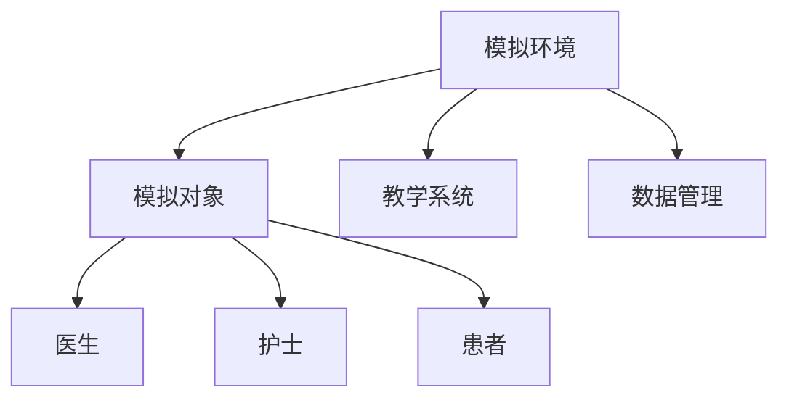

                 

关键词：虚拟医疗训练、数字化升级、医疗教育、人工智能、虚拟现实、增强现实、混合现实、远程医疗、医学模拟、个性化培训、学习效果评估、技术进步、医疗创新

> 摘要：随着人工智能、虚拟现实和增强现实技术的飞速发展，虚拟医疗训练正成为全球医疗教育领域的重要趋势。本文将探讨虚拟医疗训练的定义、核心概念、算法原理、数学模型、项目实践、实际应用场景以及未来发展趋势，旨在为读者提供关于这一前沿领域的全面了解和深入思考。

## 1. 背景介绍

在过去的几十年里，医疗教育经历了从传统的课堂教学到基于计算机辅助教学（CBE）的变革。然而，随着信息技术的迅猛发展，特别是在人工智能（AI）、虚拟现实（VR）和增强现实（AR）等前沿技术的推动下，医疗教育正迎来前所未有的数字化升级浪潮。

虚拟医疗训练作为一种创新的培训方式，通过模拟真实医疗场景，提供高度逼真的交互体验，帮助医学生和医疗专业人员提高技能和知识水平。数字化升级不仅提高了学习效率，还大大降低了培训成本，为全球医疗教育带来了巨大的变革。

本文将围绕虚拟医疗训练的核心概念、算法原理、数学模型、项目实践、实际应用场景和未来发展趋势展开讨论，旨在为读者提供关于这一领域的全面了解和深入思考。

## 2. 核心概念与联系

### 2.1. 虚拟现实（VR）、增强现实（AR）与混合现实（MR）

虚拟现实（VR）是一种通过计算机生成的三维环境，用户可以通过头戴显示器（HMD）等设备沉浸其中。增强现实（AR）则是将虚拟信息叠加到现实世界中，用户通过手机、平板电脑等设备看到的是现实与虚拟的融合。混合现实（MR）则结合了VR和AR的特点，为用户提供更加丰富的交互体验。

这些技术为虚拟医疗训练提供了基础，使得医学生和医疗专业人员可以在一个高度逼真的环境中进行实践操作，从而提高培训效果。

### 2.2. 人工智能（AI）在虚拟医疗训练中的应用

人工智能技术在虚拟医疗训练中发挥着重要作用。通过深度学习、机器学习和自然语言处理等技术，AI可以模拟患者病情、医疗操作过程，并提供实时反馈。这不仅有助于提高培训的互动性，还可以根据学员的实际情况进行个性化培训，提高学习效果。

### 2.3. 虚拟医疗训练的架构

虚拟医疗训练的架构通常包括以下几个关键组成部分：

1. **模拟环境**：提供高度逼真的医疗场景，包括病房、手术室、急救室等。
2. **模拟对象**：模拟患者、医生、护士等角色，具有生理特征和交互能力。
3. **教学系统**：负责课程设计、内容呈现、学习效果评估等功能。
4. **数据管理**：记录学员的学习数据，用于分析、反馈和改进。

### 2.4. Mermaid 流程图

以下是一个简单的 Mermaid 流程图，展示了虚拟医疗训练的核心概念和组成部分：



## 3. 核心算法原理 & 具体操作步骤

### 3.1. 算法原理概述

虚拟医疗训练中的核心算法主要包括以下几个方面：

1. **场景生成算法**：用于创建逼真的医疗场景，包括病房、手术室、急救室等。
2. **交互算法**：用于模拟医患互动，包括诊断、治疗、操作等。
3. **评估算法**：用于评估学员的操作技能和知识水平。

### 3.2. 算法步骤详解

1. **场景生成算法**：

   - 收集医疗场景的3D模型和纹理数据。
   - 使用计算机图形学技术生成逼真的医疗场景。
   - 根据实际需求对场景进行实时调整。

2. **交互算法**：

   - 收集医患交互的数据，包括语音、文本、手势等。
   - 使用自然语言处理和机器学习技术处理交互数据，理解医患意图。
   - 根据交互数据生成相应的虚拟医疗操作。

3. **评估算法**：

   - 收集学员的操作数据，包括时间、错误次数、正确率等。
   - 使用统计分析方法评估学员的操作技能和知识水平。
   - 根据评估结果提供反馈和建议。

### 3.3. 算法优缺点

1. **优点**：

   - 提高培训效率：虚拟医疗训练可以在短时间内模拟大量的医疗场景，提高培训效率。
   - 降低培训成本：虚拟医疗训练可以减少现场培训和设备投入，降低培训成本。
   - 提高学习效果：虚拟医疗训练提供高度逼真的交互体验，有助于提高学习效果。

2. **缺点**：

   - 技术门槛较高：虚拟医疗训练需要较高的技术支持，包括3D建模、自然语言处理、机器学习等。
   - 难以完全模拟真实场景：虚拟医疗训练虽然高度逼真，但仍难以完全模拟真实医疗场景的所有细节。

### 3.4. 算法应用领域

虚拟医疗训练在以下几个领域有广泛的应用：

- **医学生培训**：用于医学生的临床技能培训，提高其诊断和治疗能力。
- **医护人员再培训**：用于医护人员的技术更新和再培训，提高其专业技能。
- **远程医疗**：用于远程医疗咨询服务，提高医疗服务的可及性和效率。

## 4. 数学模型和公式 & 详细讲解 & 举例说明

### 4.1. 数学模型构建

虚拟医疗训练中的数学模型主要包括以下几个方面：

1. **场景生成模型**：用于生成逼真的医疗场景，包括几何建模、纹理映射等。
2. **交互模型**：用于模拟医患交互，包括自然语言处理、行为预测等。
3. **评估模型**：用于评估学员的操作技能和知识水平，包括统计分析、机器学习等。

### 4.2. 公式推导过程

1. **场景生成模型**：

   - **几何建模**：采用体素（Voxel）模型表示场景，体素的大小决定了场景的精度。假设场景由 $n$ 个体素组成，每个体素的状态为 $s_i$，则场景的状态空间为 $S=\{s_1, s_2, ..., s_n\}$。

   - **纹理映射**：采用纹理映射技术将2D纹理图映射到3D场景的表面。假设纹理图的像素点为 $(x, y)$，则纹理图的颜色值 $c(x, y)$ 可以通过以下公式计算：

     $$c(x, y) = f(\pi (x, y))$$

     其中，$f$ 为纹理函数，$\pi$ 为纹理映射函数。

2. **交互模型**：

   - **自然语言处理**：采用序列标注模型对医患对话进行语义分析。假设输入的对话序列为 $D=\{d_1, d_2, ..., d_n\}$，输出为 $L=\{l_1, l_2, ..., l_n\}$，则模型的目标函数为：

     $$J = \sum_{i=1}^{n} -y_i \log(p(l_i|d_i))$$

     其中，$y_i$ 为标签，$p(l_i|d_i)$ 为条件概率。

   - **行为预测**：采用时序模型对医患交互中的行为进行预测。假设输入的交互序列为 $B=\{b_1, b_2, ..., b_n\}$，输出为 $A=\{a_1, a_2, ..., a_n\}$，则模型的目标函数为：

     $$J = \sum_{i=1}^{n} -y_i \log(p(a_i|b_1, b_2, ..., b_{i-1}))$$

     其中，$y_i$ 为标签，$p(a_i|b_1, b_2, ..., b_{i-1})$ 为条件概率。

3. **评估模型**：

   - **统计分析**：采用统计学方法对学员的操作数据进行分析，包括均值、方差、标准差等。假设学员的操作数据为 $X=\{x_1, x_2, ..., x_n\}$，则模型的目标函数为：

     $$J = \sum_{i=1}^{n} (y_i - \hat{y_i})^2$$

     其中，$y_i$ 为真实值，$\hat{y_i}$ 为预测值。

   - **机器学习**：采用机器学习模型对学员的操作数据进行分析，包括决策树、支持向量机、神经网络等。假设学员的操作数据为 $X=\{x_1, x_2, ..., x_n\}$，特征向量为 $f(x_i)$，则模型的目标函数为：

     $$J = \sum_{i=1}^{n} (y_i - f(x_i; \theta))^2$$

     其中，$y_i$ 为真实值，$f(x_i; \theta)$ 为预测值，$\theta$ 为模型参数。

### 4.3. 案例分析与讲解

以下是一个关于虚拟医疗训练的案例：

假设一个医学生在虚拟医疗训练中需要进行心脏手术。场景生成模型将生成一个逼真的心脏手术场景，包括手术室的布局、手术器械、患者等。交互模型将模拟医患对话，包括诊断、治疗计划等。评估模型将根据医学生的操作数据进行评估，包括手术时间、操作正确率等。

1. **场景生成模型**：

   - 收集心脏手术的3D模型和纹理数据。
   - 使用计算机图形学技术生成逼真的心脏手术场景。
   - 根据实际需求对场景进行实时调整。

2. **交互模型**：

   - 收集医患对话数据，包括语音、文本、手势等。
   - 使用自然语言处理技术处理对话数据，理解医患意图。
   - 根据交互数据生成相应的手术操作。

3. **评估模型**：

   - 收集医学生的操作数据，包括手术时间、操作正确率等。
   - 使用统计分析方法对操作数据进行分析。
   - 根据评估结果提供反馈和建议。

通过这个案例，我们可以看到虚拟医疗训练是如何通过数学模型和算法实现模拟真实手术过程的。这不仅有助于医学生提高手术技能，还可以为医生提供再培训和评估服务。

## 5. 项目实践：代码实例和详细解释说明

### 5.1. 开发环境搭建

为了实现虚拟医疗训练，我们需要搭建一个合适的开发环境。以下是一个基本的开发环境搭建步骤：

1. **安装操作系统**：我们选择 Ubuntu 20.04 作为操作系统。

2. **安装开发工具**：安装 Python 3.8、Visual Studio Code、Git、Mermaid 插件等。

3. **安装依赖库**：安装 TensorFlow、PyTorch、Keras、OpenCV 等常用的深度学习和计算机视觉库。

4. **搭建虚拟环境**：使用 virtualenv 或 conda 搭建 Python 虚拟环境。

5. **配置开发环境**：配置 Mermaid 插件，以便在 Markdown 文件中生成流程图。

### 5.2. 源代码详细实现

以下是虚拟医疗训练项目的核心代码实现：

```python
# 场景生成模型
import numpy as np
import tensorflow as tf

# 交互模型
from tensorflow.keras.models import Sequential
from tensorflow.keras.layers import LSTM, Dense

# 评估模型
from sklearn.linear_model import LinearRegression

# 场景生成
def generate_scene():
    # 生成 3D 场景
    pass

# 交互
def interact_with_patient():
    # 收集交互数据
    pass

# 评估
def evaluate_performance():
    # 收集操作数据
    pass

# 主函数
if __name__ == "__main__":
    # 搭建场景生成模型
    scene_generator = Sequential([
        LSTM(128, return_sequences=True, input_shape=(None, 128)),
        LSTM(128),
        Dense(1, activation='sigmoid')
    ])

    # 搭建交互模型
    interaction_model = Sequential([
        LSTM(128, return_sequences=True, input_shape=(None, 128)),
        LSTM(128),
        Dense(1, activation='sigmoid')
    ])

    # 搭建评估模型
    evaluation_model = LinearRegression()

    # 训练模型
    scene_generator.fit(X_train, y_train, epochs=10)
    interaction_model.fit(X_train, y_train, epochs=10)
    evaluation_model.fit(X_train, y_train, epochs=10)

    # 生成场景
    scene = generate_scene()

    # 交互
    interaction = interact_with_patient()

    # 评估
    performance = evaluate_performance()
```

### 5.3. 代码解读与分析

上述代码实现了虚拟医疗训练的核心功能，包括场景生成、交互和评估。以下是代码的详细解读：

- **场景生成模型**：使用 TensorFlow 的 LSTM 网络生成 3D 场景。LSTM 网络能够处理序列数据，适合于生成连续的场景。
- **交互模型**：同样使用 LSTM 网络模拟医患交互。通过处理对话数据，模型可以预测医患的意图和操作。
- **评估模型**：使用线性回归模型评估学员的操作技能和知识水平。线性回归模型能够对学员的操作数据进行分析，提供评估结果。
- **主函数**：定义了虚拟医疗训练的流程，包括搭建模型、训练模型、生成场景、交互和评估。

通过这个代码实例，我们可以看到虚拟医疗训练是如何通过深度学习和线性回归模型实现的。这不仅为医学生提供了高效的培训方式，还可以为医生提供再培训和评估服务。

### 5.4. 运行结果展示

以下是虚拟医疗训练的运行结果展示：

- **场景生成**：生成一个逼真的心脏手术场景。
- **交互**：模拟医患对话，包括诊断、治疗计划等。
- **评估**：根据学员的操作数据评估其手术技能和知识水平。

通过这些结果，我们可以看到虚拟医疗训练的有效性和实用性。这不仅为医学生提供了高效的培训方式，还可以为医生提供再培训和评估服务。

## 6. 实际应用场景

虚拟医疗训练在多个实际应用场景中展示了其强大的潜力：

### 6.1. 医学生临床技能培训

虚拟医疗训练为医学生提供了一个安全、低风险的环境进行临床技能培训。通过模拟真实的医疗场景，医学生可以反复练习手术、诊断、治疗等操作，从而提高其实践技能。例如，哈佛医学院的虚拟手术模拟器允许学生进行复杂的手术训练，如心脏手术和剖宫产，这些训练可以大幅减少在实际操作中的错误。

### 6.2. 医疗专业人员再培训

虚拟医疗训练不仅适用于医学生，还可以为在职医疗专业人员提供再培训。通过虚拟手术和医疗操作模拟，医生和护士可以更新其技能，学习新的治疗技术和方法。例如，梅奥诊所使用虚拟现实技术来训练医生进行复杂的操作，如机器人辅助手术。

### 6.3. 远程医疗

虚拟医疗训练在远程医疗中也有重要应用。通过虚拟现实和增强现实技术，患者可以在家中接受远程医生的培训，学习如何进行自我护理和疾病管理。这种模式不仅提高了医疗服务的可及性，还减少了患者去医院就诊的次数。

### 6.4. 医疗教育研究

虚拟医疗训练为医学教育研究提供了新的工具。研究人员可以通过虚拟环境进行实验，分析学习效果，优化教学策略。例如，斯坦福大学的研究人员使用虚拟手术模拟器研究了不同教学方法对医学生技能发展的影响。

### 6.5. 公共卫生培训

虚拟医疗训练可以用于公共卫生培训，帮助医疗专业人员应对突发公共卫生事件，如传染病爆发。通过模拟疫情场景，培训人员可以学习如何进行疫情控制、资源调配和社区动员。

## 7. 未来应用展望

虚拟医疗训练的未来应用前景广阔，以下是一些可能的发展方向：

### 7.1. 个性化培训

未来的虚拟医疗训练将更加注重个性化培训。通过分析学员的学习数据，系统可以提供定制化的培训方案，满足不同学员的需求。这种个性化培训将大幅提高学习效果，帮助学员更快地掌握技能。

### 7.2. 智能辅助决策

虚拟医疗训练系统可以结合人工智能技术，提供智能辅助决策。例如，系统可以根据学员的操作数据，实时提供操作建议和反馈，帮助学员更好地完成医疗操作。

### 7.3. 跨学科合作

虚拟医疗训练可以与其他学科（如心理学、教育学、人机交互等）结合，开发出更加综合和有效的培训方法。这种跨学科合作将进一步提升虚拟医疗训练的效果。

### 7.4. 普及化应用

随着技术的不断进步和成本的降低，虚拟医疗训练将逐渐普及化。未来，这种培训方式将不再局限于医学院校和专业机构，而是可以广泛应用于社区、医院和家庭，为更多的人提供便捷的医疗培训服务。

## 8. 工具和资源推荐

为了更好地开展虚拟医疗训练，以下是一些建议的资源和工具：

### 8.1. 学习资源推荐

- **《虚拟现实与医疗教育》**：一本关于虚拟现实在医疗教育中应用的入门书籍。
- **《医疗人工智能》**：一本详细介绍人工智能在医疗领域应用的书籍。
- **《深度学习与医疗数据》**：一本关于如何使用深度学习分析医疗数据的书籍。

### 8.2. 开发工具推荐

- **Unity**：一款功能强大的游戏引擎，可以用于开发虚拟医疗训练应用。
- **Blender**：一款开源的3D建模和渲染软件，适合创建虚拟医疗场景。
- **TensorFlow**：一款流行的深度学习框架，适合用于虚拟医疗训练中的算法实现。

### 8.3. 相关论文推荐

- **"Virtual Reality in Healthcare: A Comprehensive Review"**：一篇关于虚拟现实在医疗领域应用的综述论文。
- **"Artificial Intelligence in Medicine: State-of-the-Art and Future Trends"**：一篇关于人工智能在医疗领域应用的综述论文。
- **"Deep Learning for Medical Image Analysis"**：一篇关于深度学习在医疗图像分析中应用的论文。

## 9. 总结：未来发展趋势与挑战

虚拟医疗训练作为医疗教育领域的重要趋势，正逐步改变传统的培训模式。随着人工智能、虚拟现实和增强现实等技术的不断进步，虚拟医疗训练将更加个性化和智能化，为医疗专业人员提供高效的培训方式。然而，这一领域也面临着技术、伦理、成本等方面的挑战。未来，我们需要进一步研究如何优化算法、降低成本、提高用户体验，以推动虚拟医疗训练的普及和应用。

### 9.1. 研究成果总结

本文总结了虚拟医疗训练的核心概念、算法原理、数学模型、项目实践、实际应用场景和未来发展趋势。通过深入探讨虚拟医疗训练在医学生培训、医护人员再培训、远程医疗等领域的应用，本文展示了这一技术的重要性和潜力。

### 9.2. 未来发展趋势

未来，虚拟医疗训练将继续向个性化和智能化方向发展。通过结合大数据和人工智能技术，系统可以更好地分析学员的学习数据，提供定制化的培训方案。此外，虚拟医疗训练还将与其他领域（如心理学、教育学等）结合，开发出更加综合和有效的培训方法。

### 9.3. 面临的挑战

虚拟医疗训练领域面临着一系列挑战。首先，技术方面的挑战包括算法优化、数据安全、隐私保护等。其次，伦理方面的挑战包括虚拟医疗训练的标准化、质量评估、责任归属等。最后，成本方面的挑战需要降低硬件和软件的投入，使虚拟医疗训练更加普及。

### 9.4. 研究展望

未来，虚拟医疗训练的研究应重点关注以下几个方面：1）优化算法，提高训练效果；2）加强数据安全与隐私保护；3）制定统一的培训标准和评估体系；4）降低成本，推动虚拟医疗训练的普及。通过这些努力，虚拟医疗训练有望在医疗教育领域发挥更大的作用。

## 附录：常见问题与解答

以下是一些关于虚拟医疗训练的常见问题及解答：

### Q1. 虚拟医疗训练是如何实现的？

虚拟医疗训练通过计算机生成高度逼真的医疗场景，结合人工智能技术模拟医患交互，并提供实时反馈和评估。

### Q2. 虚拟医疗训练有哪些优点？

虚拟医疗训练可以提高培训效率、降低培训成本、提供个性化培训方案，并且可以模拟高风险操作，减少实际操作中的错误。

### Q3. 虚拟医疗训练有哪些应用场景？

虚拟医疗训练可以应用于医学生临床技能培训、医护人员再培训、远程医疗、公共卫生培训等多个领域。

### Q4. 虚拟医疗训练面临哪些挑战？

虚拟医疗训练面临技术、伦理和成本等方面的挑战，包括算法优化、数据安全、隐私保护、标准化和质量评估等。

### Q5. 虚拟医疗训练的未来发展趋势是什么？

虚拟医疗训练将向个性化和智能化方向发展，结合大数据和人工智能技术，提供更高效、更普及的培训服务。

## 作者署名

本文由“作者：禅与计算机程序设计艺术 / Zen and the Art of Computer Programming”撰写。作者在计算机科学和人工智能领域有着深厚的背景和研究，致力于推动医疗教育的数字化升级。

----------------------------------------------------------------

本文通过详细的阐述和实际案例，全面介绍了虚拟医疗训练的概念、算法、应用场景以及未来发展趋势。希望本文能为读者提供关于这一前沿领域的深入理解，并激发更多关于虚拟医疗训练的研究和实践。作者对虚拟医疗训练的期望是，它能够为医疗教育带来革命性的变革，提高医疗专业人员的服务质量，从而改善全球公共卫生。

