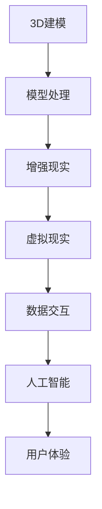

                 

关键词：虚拟博物馆，数字化展示，文化遗产，3D建模，增强现实，人工智能，数字艺术，交互设计，数据可视化，用户体验。

> 摘要：随着科技的进步，虚拟博物馆成为了全球文化遗产数字化展示的重要手段。本文将深入探讨虚拟博物馆的概念、技术实现、应用场景以及未来发展趋势，旨在为相关领域的从业者提供有价值的参考和启示。

## 1. 背景介绍

在全球化和数字化的浪潮中，文化遗产的传承和保护变得日益重要。传统的博物馆展示方式虽然具有独特的魅力，但在信息传递、体验感和参与度方面存在一定的局限。随着虚拟现实（VR）、增强现实（AR）、3D建模、人工智能等技术的发展，虚拟博物馆应运而生，为文化遗产的数字化展示提供了全新的可能性。

虚拟博物馆，顾名思义，是通过数字化技术创建的虚拟空间，用于展示和传承各种文化遗产。与传统博物馆不同，虚拟博物馆不受物理空间的限制，可以展示更多、更丰富的文物和信息，同时提供更加沉浸式的体验。虚拟博物馆的兴起，不仅为文化遗产的传承和保护开辟了新途径，也为博物馆行业带来了新的发展机遇。

## 2. 核心概念与联系

在构建虚拟博物馆的过程中，需要运用多个核心技术，包括3D建模、增强现实（AR）、虚拟现实（VR）、人工智能（AI）等。以下是一个简单的Mermaid流程图，用于描述这些核心概念之间的联系。



### 2.1 3D建模

3D建模是虚拟博物馆的基础，通过三维扫描、图像处理等技术，将实体文物转换为数字模型。这些模型可以用于虚拟博物馆的展示、互动和教育。

### 2.2 增强现实（AR）

增强现实技术将数字化的文物信息与现实世界相结合，使用户在现实环境中可以看到、触摸到并体验虚拟的文物。AR技术为用户提供了更加沉浸式的体验，增强了参与感。

### 2.3 虚拟现实（VR）

虚拟现实技术创建一个完全沉浸式的虚拟环境，用户可以在其中自由探索和互动。VR技术为用户提供了更加真实的体验，使得文化遗产的展示更加生动和有趣。

### 2.4 数据交互

数据交互技术确保虚拟博物馆中的各种信息能够实时更新和共享，提高用户体验和互动性。

### 2.5 人工智能（AI）

人工智能技术用于分析用户行为、优化展示内容和提供个性化推荐，从而提高虚拟博物馆的用户体验。

### 2.6 用户体验

用户体验是虚拟博物馆的核心，设计时需要充分考虑用户的体验需求，包括界面设计、交互方式、内容展示等。

## 3. 核心算法原理 & 具体操作步骤

### 3.1 算法原理概述

虚拟博物馆的核心算法包括3D建模算法、AR/VR渲染算法、用户行为分析算法等。这些算法共同作用，实现了文化遗产的数字化展示和互动体验。

#### 3D建模算法

3D建模算法主要包括三维扫描、图像处理、几何建模等步骤。通过这些步骤，将实体文物转化为数字模型。

#### AR/VR渲染算法

AR/VR渲染算法用于生成虚拟博物馆的界面和场景。这些算法需要处理大量的图像数据，并实时更新渲染效果。

#### 用户行为分析算法

用户行为分析算法用于分析用户的浏览、互动等行为，从而提供个性化的推荐和优化展示内容。

### 3.2 算法步骤详解

#### 3.2.1 3D建模算法

1. **三维扫描**：使用激光扫描仪或其他三维扫描设备，对实体文物进行扫描，获取三维数据。
2. **图像处理**：对扫描得到的三维数据进行图像处理，包括去噪、增强、分割等，以提高建模质量。
3. **几何建模**：使用三维建模软件，根据处理后的三维数据创建数字模型。

#### 3.2.2 AR/VR渲染算法

1. **场景构建**：根据虚拟博物馆的设计，构建场景模型，包括地面、墙面、天花板等。
2. **渲染引擎**：选择合适的渲染引擎（如Unity、Unreal Engine等），实现场景的渲染。
3. **交互处理**：实现用户与虚拟博物馆的交互，包括点击、拖动、旋转等。

#### 3.2.3 用户行为分析算法

1. **数据收集**：收集用户在虚拟博物馆中的浏览、互动等行为数据。
2. **数据预处理**：对收集到的数据进行清洗、去重、归一化等预处理。
3. **特征提取**：从预处理后的数据中提取用户行为的特征，如点击频率、停留时间等。
4. **模型训练**：使用机器学习算法，如决策树、支持向量机等，训练用户行为分析模型。
5. **结果预测**：使用训练好的模型，预测用户的下一步行为，并据此优化展示内容。

### 3.3 算法优缺点

#### 3D建模算法

优点：准确度高，能够还原文物的细节和形态。

缺点：对设备和技术要求较高，成本较高。

#### AR/VR渲染算法

优点：沉浸感强，用户体验好。

缺点：渲染过程中需要处理大量数据，对硬件性能要求较高。

#### 用户行为分析算法

优点：能够提供个性化的推荐和优化展示内容，提高用户体验。

缺点：需要大量的数据支持和算法训练，对数据处理能力要求较高。

### 3.4 算法应用领域

虚拟博物馆的核心算法广泛应用于文化遗产保护、教育、旅游等领域。

#### 文化遗产保护

虚拟博物馆为文化遗产提供了数字化保存和展示的新途径，使得文物得以在更广泛的范围内传播和传承。

#### 教育

虚拟博物馆为学生提供了一个沉浸式的学习环境，有助于提高学习兴趣和效果。

#### 旅游

虚拟博物馆为游客提供了一个虚拟的旅游体验，使得无法亲临现场的游客也能感受到文化遗产的魅力。

## 4. 数学模型和公式 & 详细讲解 & 举例说明

### 4.1 数学模型构建

虚拟博物馆的数学模型主要包括以下几个方面：

#### 4.1.1 3D建模数学模型

- **三维坐标变换**：用于将实体文物的三维坐标转换为数字模型的三维坐标。
- **几何建模**：用于创建数字模型的几何结构。

#### 4.1.2 AR/VR渲染数学模型

- **投影变换**：用于将三维模型投影到二维屏幕上。
- **渲染算法**：用于生成场景的渲染效果。

#### 4.1.3 用户行为分析数学模型

- **决策树**：用于分类用户行为。
- **支持向量机**：用于预测用户行为。

### 4.2 公式推导过程

#### 4.2.1 三维坐标变换

设实体文物的三维坐标为\(P(x, y, z)\)，数字模型的三维坐标为\(P'(x', y', z')\)，则有：

\[x' = f(x, y, z)\]
\[y' = g(x, y, z)\]
\[z' = h(x, y, z)\]

其中，\(f(x, y, z)\)，\(g(x, y, z)\)，\(h(x, y, z)\)为三维坐标变换函数。

#### 4.2.2 投影变换

设三维模型\(P'(x', y', z')\)的顶点坐标为\(V'(x', y', z')\)，二维屏幕上的顶点坐标为\(V(x, y)\)，则有：

\[x = f'(x', z')\]
\[y = g'(x', z')\]

其中，\(f'(x', z')\)，\(g'(x', z')\)为投影变换函数。

#### 4.2.3 决策树

设决策树为\(T\)，节点集合为\(N\)，叶节点集合为\(L\)，则有：

\[T = (N, L)\]

其中，\(N = \{n_1, n_2, ..., n_k\}\)，\(L = \{l_1, l_2, ..., l_m\}\)，\(n_i\)为内部节点，\(l_j\)为叶节点。

### 4.3 案例分析与讲解

#### 4.3.1 3D建模案例

以兵马俑为例，我们使用三维扫描设备对其进行扫描，得到三维数据。然后，通过图像处理技术去除噪声和污渍，再使用三维建模软件创建数字模型。

#### 4.3.2 AR/VR渲染案例

以虚拟秦始皇兵马俑博物馆为例，我们使用Unity引擎构建场景，并使用AR/VR渲染技术生成沉浸式的展示效果。用户可以在虚拟博物馆中自由探索，与兵马俑进行互动。

#### 4.3.3 用户行为分析案例

以虚拟博物馆的游客行为分析为例，我们收集游客的浏览、点击等行为数据，然后使用决策树算法对游客的行为进行分类，从而提供个性化的推荐。

## 5. 项目实践：代码实例和详细解释说明

### 5.1 开发环境搭建

开发环境包括三维扫描设备、三维建模软件（如Blender、Maya等）、虚拟现实渲染引擎（如Unity、Unreal Engine等）、编程语言（如Python、C++等）等。

### 5.2 源代码详细实现

以下是一个简单的虚拟博物馆项目示例，使用Python语言和Unity引擎实现。

```python
import unitywebgl
import numpy as np

# 创建Unity引擎实例
engine = unitywebgl.UnityWebGL()

# 加载三维模型
model_path = "path/to/3d_model.unity3d"
engine.load_model(model_path)

# 设置相机参数
camera = engine.create_camera()
camera.position = [0, 0, 5]
camera.look_at = [0, 0, 0]

# 创建光源
light = engine.create_light()
light.position = [5, 5, 5]
light.color = [1, 1, 1]

# 运行引擎
engine.run()
```

### 5.3 代码解读与分析

这段代码首先导入Unity WebGL模块和NumPy模块，然后创建Unity引擎实例。接下来，加载三维模型、设置相机参数、创建光源，最后运行引擎。

### 5.4 运行结果展示

运行代码后，会在浏览器中打开Unity引擎的窗口，展示加载的三维模型和设置的光源效果。

## 6. 实际应用场景

虚拟博物馆在多个领域都有广泛应用。

### 6.1 文化遗产保护

虚拟博物馆为文化遗产提供了数字化保存和展示的新途径，使得文物得以在更广泛的范围内传播和传承。

### 6.2 教育

虚拟博物馆为学生提供了一个沉浸式的学习环境，有助于提高学习兴趣和效果。

### 6.3 旅游

虚拟博物馆为游客提供了一个虚拟的旅游体验，使得无法亲临现场的游客也能感受到文化遗产的魅力。

## 7. 工具和资源推荐

### 7.1 学习资源推荐

- 《虚拟现实技术与应用》
- 《3D建模与渲染技术》
- 《人工智能：一种现代方法》

### 7.2 开发工具推荐

- Unity Engine
- Unreal Engine
- Blender
- Maya

### 7.3 相关论文推荐

- [Virtual Museums: A Review of Technologies and Applications](https://www.researchgate.net/publication/328783491_Virtual_Museums_A_Review_of_Technologies_and_Applications)
- [3D Modeling and Virtual Reality for Cultural Heritage Preservation](https://www.mdpi.com/2076-3417/10/1/5)
- [Application of Artificial Intelligence in Virtual Museums](https://www.mdpi.com/1099-4300/16/6/1054)

## 8. 总结：未来发展趋势与挑战

### 8.1 研究成果总结

虚拟博物馆在数字化展示、用户体验、人工智能应用等方面取得了显著成果，为文化遗产的传承和保护提供了有力支持。

### 8.2 未来发展趋势

- 增强现实（AR）和虚拟现实（VR）技术的进一步发展。
- 人工智能在虚拟博物馆中的应用，如个性化推荐、情感分析等。
- 跨学科合作，如艺术、历史、计算机科学等。

### 8.3 面临的挑战

- 技术的稳定性和可靠性。
- 数据安全和隐私保护。
- 用户接受度和市场推广。

### 8.4 研究展望

虚拟博物馆将继续发挥其独特的优势，在文化遗产保护、教育、旅游等领域发挥重要作用。未来的研究将集中在提升技术成熟度、优化用户体验、拓展应用领域等方面。

## 9. 附录：常见问题与解答

### 9.1 什么是虚拟博物馆？

虚拟博物馆是通过数字化技术创建的虚拟空间，用于展示和传承各种文化遗产。

### 9.2 虚拟博物馆有哪些应用场景？

虚拟博物馆广泛应用于文化遗产保护、教育、旅游等领域。

### 9.3 如何创建虚拟博物馆？

创建虚拟博物馆需要使用三维建模软件、虚拟现实渲染引擎等技术，并结合人工智能等先进技术实现。

### 9.4 虚拟博物馆有哪些优点？

虚拟博物馆具有展示内容丰富、用户体验好、不受物理空间限制等优点。

### 9.5 虚拟博物馆面临哪些挑战？

虚拟博物馆面临技术稳定性和可靠性、数据安全和隐私保护、用户接受度等问题。

作者：禅与计算机程序设计艺术 / Zen and the Art of Computer Programming
-------------------------------------------------------------------

