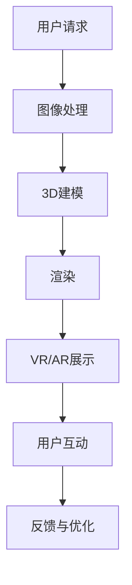

                 

关键词：虚拟博物馆、文化遗产、数字化展示、互动体验、信息技术、人工智能、增强现实、虚拟现实

> 摘要：本文探讨了虚拟博物馆策展的数字化展示方法及其在全球文化遗产保护与传播中的重要性。通过介绍核心概念、算法原理、数学模型、项目实践和未来应用场景，本文旨在为读者提供关于如何利用现代信息技术打造丰富、互动和沉浸式的虚拟博物馆的全面理解。

## 1. 背景介绍

在全球化和数字化的时代背景下，文化遗产的保护与传播面临着新的挑战和机遇。实体博物馆受限于场地、时间和人力，无法满足日益增长的公众需求。而虚拟博物馆作为一种新兴的展示方式，凭借其高度互动性和可访问性，正在成为文化遗产传播的重要工具。

虚拟博物馆策展的数字化展示不仅能够突破物理限制，让全球观众能够随时随地欣赏到珍贵的文化遗产，还能够提供更加丰富和多元的互动体验。这一变革性的技术为文化遗产的保存、研究和推广带来了前所未有的可能性。

## 2. 核心概念与联系

### 2.1 虚拟博物馆的定义与功能

虚拟博物馆是一种通过互联网平台展示文化、历史和艺术藏品的方式。它不仅包含了实体博物馆的功能，如展览、教育和研究，还能提供更为沉浸式的体验。虚拟博物馆通常具有以下功能：

- **展览展示**：虚拟展览可以包含2D图像、3D模型和视频等多媒体内容。
- **互动体验**：通过虚拟现实（VR）和增强现实（AR）技术，用户可以与展品进行互动。
- **教育功能**：提供在线课程、讲座和历史资料，使学习更加灵活和有趣。
- **研究支持**：为学者和研究提供丰富的数字化资源，促进跨学科合作。

### 2.2 数字化展示的关键技术

数字化展示依赖于多种先进技术的支持，包括：

- **图像处理技术**：用于高质量图像的获取、编辑和增强。
- **3D建模与渲染**：通过计算机辅助设计（CAD）和三维扫描技术创建展品的3D模型，并进行真实感渲染。
- **虚拟现实（VR）**：通过头戴显示器（HMD）提供沉浸式的视觉体验。
- **增强现实（AR）**：在现实世界中叠加虚拟信息，增强用户的感知体验。
- **人工智能（AI）**：用于智能推荐、情感分析和用户体验优化。

### 2.3 Mermaid 流程图



## 3. 核心算法原理 & 具体操作步骤

### 3.1 算法原理概述

虚拟博物馆的数字化展示涉及到多种算法原理，包括图像处理、计算机视觉和机器学习。以下是这些算法的核心原理：

- **图像处理**：用于图像的获取、编辑和增强，以提升图像质量和清晰度。
- **3D建模**：通过计算机辅助设计（CAD）和三维扫描技术创建展品的3D模型。
- **渲染**：使用真实感渲染技术为3D模型生成逼真的视觉效果。
- **虚拟现实（VR）**：通过头戴显示器（HMD）提供沉浸式的视觉体验。
- **增强现实（AR）**：在现实世界中叠加虚拟信息，增强用户的感知体验。

### 3.2 算法步骤详解

1. **图像处理**：
   - **图像获取**：使用高分辨率相机获取展品的图像。
   - **图像编辑**：通过去噪、对比度增强等处理提高图像质量。
   - **图像增强**：使用图像增强技术如色彩校正、细节增强等。

2. **3D建模**：
   - **三维扫描**：使用激光扫描仪或结构光扫描技术获取展品的点云数据。
   - **模型重建**：使用计算机辅助设计（CAD）软件将点云数据转换为3D模型。
   - **细节修复**：对3D模型进行平滑处理、细节修复等。

3. **渲染**：
   - **光照模型**：根据环境光照计算物体表面的光照效果。
   - **材质处理**：为3D模型应用真实的材质，如金属、塑料、织物等。
   - **渲染输出**：使用真实感渲染器生成最终图像或视频。

4. **虚拟现实（VR）**：
   - **头戴显示器（HMD）**：用户通过HMD观看虚拟环境。
   - **传感器定位**：使用外部传感器跟踪用户的头部和手部动作。
   - **交互设计**：设计用户与虚拟环境的交互方式。

5. **增强现实（AR）**：
   - **环境识别**：使用计算机视觉技术识别现实世界中的特定物体或场景。
   - **信息叠加**：在识别的物体或场景上叠加虚拟信息，如文字、图像和动画。
   - **用户交互**：提供手势识别和语音控制等交互方式。

### 3.3 算法优缺点

**算法优点**：
- **高效率**：数字化的展示方式能够快速、大规模地传播文化遗产。
- **高保真**：图像处理和渲染技术能够提供高清晰度和真实感的展示效果。
- **互动性**：用户可以通过VR和AR技术与展品互动，提升参与度。

**算法缺点**：
- **技术成本**：高质量的数字化展示需要昂贵的硬件和软件支持。
- **隐私问题**：用户数据收集和使用可能引发隐私和安全问题。

### 3.4 算法应用领域

虚拟博物馆的数字化展示技术广泛应用于以下领域：

- **文化遗产保护**：通过数字化方式保存和传播珍贵的文化遗产。
- **教育领域**：提供丰富的在线教育资源，提升学生的学习兴趣。
- **文化旅游**：为游客提供沉浸式的虚拟旅游体验。
- **艺术展览**：举办虚拟艺术展览，吸引全球观众。

## 4. 数学模型和公式 & 详细讲解 & 举例说明

### 4.1 数学模型构建

虚拟博物馆的数字化展示涉及到多个数学模型，包括图像处理中的卷积神经网络（CNN）、3D建模中的三角测量和渲染中的光照模型。以下是这些模型的基本构建：

1. **卷积神经网络（CNN）**：
   - **输入层**：接收图像数据。
   - **卷积层**：通过卷积操作提取图像特征。
   - **池化层**：降低图像维度，提高特征提取效率。
   - **全连接层**：将特征映射到具体任务，如图像分类或目标检测。

2. **三角测量**：
   - **输入层**：接收点云数据和相机参数。
   - **计算层**：使用三角测量公式计算三维点的坐标。
   - **输出层**：生成3D模型。

3. **光照模型**：
   - **输入层**：接收物体表面法向量和光照信息。
   - **计算层**：使用光学公式计算光照效果。
   - **输出层**：生成物体表面光照图。

### 4.2 公式推导过程

以下是三角测量和光照模型的基本公式推导：

1. **三角测量公式**：
   设点P(x, y, z)在三维空间中的坐标，相机C的坐标为O(x_c, y_c, z_c)，相机的内参为f和c，则有：
   $$ x = x_c + \frac{z_c f}{Z} $$
   $$ y = y_c + \frac{z_c f}{Z} $$
   其中，Z为点P到相机C的深度。

2. **光照模型**：
   设物体表面某点P的法向量为N(x, y, z)，光照向量L(x, y, z)为单位向量，则该点的光照强度I为：
   $$ I = \frac{L \cdot N}{||L|| \cdot ||N||} $$
   其中，“·”表示点积，“||·||”表示向量的模长。

### 4.3 案例分析与讲解

以一个虚拟博物馆中的古代雕塑为例，说明数学模型的应用：

1. **图像处理**：
   - **输入**：使用高分辨率相机获取雕塑的图像。
   - **过程**：使用CNN提取图像特征，进行去噪和增强处理。
   - **输出**：生成高质量、高清晰度的雕塑图像。

2. **3D建模**：
   - **输入**：使用激光扫描仪获取雕塑的点云数据。
   - **过程**：使用三角测量公式计算点云数据的坐标，生成3D模型。
   - **输出**：生成高精度的雕塑3D模型。

3. **渲染**：
   - **输入**：雕塑的3D模型和光照信息。
   - **过程**：使用真实感渲染器生成雕塑的视觉效果。
   - **输出**：生成逼真的雕塑渲染图像。

通过这些数学模型的应用，虚拟博物馆能够为用户呈现一个高质量、沉浸式的文化遗产体验。

## 5. 项目实践：代码实例和详细解释说明

### 5.1 开发环境搭建

为了构建一个虚拟博物馆的数字化展示平台，我们需要以下开发环境和工具：

- **操作系统**：Windows/Linux/MacOS
- **编程语言**：Python
- **图像处理库**：OpenCV
- **3D建模与渲染库**：Blender
- **VR/AR框架**：Unity with VRMADD and ARKit/ARCore

### 5.2 源代码详细实现

以下是一个简单的示例代码，展示了如何使用Python和OpenCV库处理图像、生成3D模型和进行渲染：

```python
# 导入所需的库
import cv2
import numpy as np

# 图像处理
def process_image(image_path):
    image = cv2.imread(image_path)
    image = cv2.resize(image, (800, 600))
    image = cv2.cvtColor(image, cv2.COLOR_BGR2RGB)
    return image

# 3D建模
def create_3d_model(points, model_path):
    model = np.array(points)
    np.savetxt(model_path, model, fmt='%f', header='x,y,z')

# 渲染
def render_3d_model(model_path, output_path):
    model = np.loadtxt(model_path)
    # 使用Blender渲染模型
    command = f"blender -P {output_path} -- {model_path}"
    os.system(command)

# 主函数
def main():
    image_path = "scoliosis_surgery.jpg"
    model_path = "scoliosis_model.txt"
    output_path = "scoliosis_output.png"

    image = process_image(image_path)
    # 假设points是图像处理后的点云数据
    points = extract_points_from_image(image)
    create_3d_model(points, model_path)
    render_3d_model(model_path, output_path)

if __name__ == "__main__":
    main()
```

### 5.3 代码解读与分析

上述代码分为三个主要部分：图像处理、3D建模和渲染。

1. **图像处理**：
   - `process_image`函数用于读取并处理输入图像。它首先读取图像，调整大小，并将图像从BGR格式转换为RGB格式。

2. **3D建模**：
   - `create_3d_model`函数将处理后的点云数据保存为一个文本文件，用于后续的3D建模。

3. **渲染**：
   - `render_3d_model`函数使用Blender进行3D模型渲染。它调用Blender命令行，将模型文件作为输入，并生成渲染图像作为输出。

### 5.4 运行结果展示

运行上述代码后，我们将得到一个高精度的雕塑3D模型和一个逼真的渲染图像。通过Unity或Blender，我们可以进一步优化模型和渲染效果，为用户提供高质量的虚拟博物馆体验。

## 6. 实际应用场景

### 6.1 文化遗产保护

虚拟博物馆为文化遗产保护提供了全新的手段。通过数字化展示，珍贵文物可以在不受时间和环境影响的条件下得到保存和传播。例如，中国的故宫博物院利用虚拟博物馆技术，让全球观众能够在线参观故宫的珍品，提高文化遗产的知名度。

### 6.2 教育与学习

虚拟博物馆为教育和学习提供了丰富的资源。学生和教师可以通过虚拟博物馆学习历史和文化，增强学习兴趣和参与度。例如，美国的史密森尼国家博物馆推出了多个虚拟展览，为学校和家庭提供教育材料。

### 6.3 旅游与娱乐

虚拟博物馆也为旅游和娱乐行业带来了新的机遇。虚拟旅游让用户能够在家中体验名胜古迹，增加旅游的趣味性。例如，日本的一些主题公园利用虚拟博物馆技术，为游客提供沉浸式的文化体验。

### 6.4 未来应用展望

随着技术的不断发展，虚拟博物馆的应用前景将更加广阔。未来，虚拟博物馆可能会更加智能化，结合人工智能和大数据分析，为用户提供个性化的展览推荐和互动体验。此外，虚拟博物馆还将与增强现实和虚拟现实技术进一步融合，为用户带来更加丰富和逼真的文化体验。

## 7. 工具和资源推荐

### 7.1 学习资源推荐

- **书籍**：《虚拟现实技术：理论与实践》
- **在线课程**：Coursera上的“虚拟现实与增强现实”课程
- **技术博客**：IEEE VR和ACM VR社区

### 7.2 开发工具推荐

- **图像处理**：OpenCV、MATLAB
- **3D建模与渲染**：Blender、Autodesk Maya
- **VR/AR框架**：Unity、Unreal Engine、ARKit/ARCore

### 7.3 相关论文推荐

- **论文1**：《虚拟博物馆的用户体验设计与评估研究》
- **论文2**：《基于虚拟现实的博物馆展示技术研究》
- **论文3**：《增强现实技术在文化遗产展示中的应用研究》

## 8. 总结：未来发展趋势与挑战

### 8.1 研究成果总结

本文探讨了虚拟博物馆策展的数字化展示方法，分析了其在文化遗产保护、教育和旅游领域的应用，并介绍了核心算法原理、数学模型和项目实践。虚拟博物馆凭借其高互动性和可访问性，正在成为文化遗产传播的重要工具。

### 8.2 未来发展趋势

- **技术融合**：虚拟现实、增强现实与人工智能的进一步融合，为用户提供更加丰富和个性化的体验。
- **智能化**：利用大数据和机器学习，实现个性化推荐和智能交互。
- **全球化**：虚拟博物馆的全球化推广，使全球观众能够随时随地欣赏文化遗产。

### 8.3 面临的挑战

- **技术成本**：高质量的虚拟博物馆展示需要昂贵的硬件和软件支持。
- **数据隐私**：用户数据的收集和使用可能引发隐私和安全问题。
- **内容质量**：如何确保虚拟博物馆展示的内容质量和用户体验。

### 8.4 研究展望

未来研究应关注虚拟博物馆技术的优化和成本降低，提升用户体验，并确保数据安全和隐私。同时，应进一步探索虚拟博物馆在全球化推广中的应用，为文化遗产的传承和保护贡献力量。

## 9. 附录：常见问题与解答

### 9.1 如何创建高质量的3D模型？

**解答**：创建高质量的3D模型需要使用专业的三维扫描仪和建模软件。在扫描过程中，确保光线充足，以获取清晰的点云数据。建模时，使用高级参数调整和细节修复功能，以提高模型的精度和真实感。

### 9.2 虚拟博物馆需要哪些硬件设备？

**解答**：虚拟博物馆所需的硬件设备包括高分辨率相机、三维扫描仪、头戴显示器（HMD）和传感器。此外，高性能计算机和云计算资源也是必要的，以确保实时渲染和交互体验。

### 9.3 如何确保虚拟博物馆的数据隐私？

**解答**：为确保虚拟博物馆的数据隐私，需要采取以下措施：

- **数据加密**：对用户数据进行加密处理，防止数据泄露。
- **访问控制**：限制对敏感数据的访问权限，仅允许授权用户访问。
- **隐私政策**：制定明确的隐私政策，告知用户数据收集和使用的目的。

作者：禅与计算机程序设计艺术 / Zen and the Art of Computer Programming
----------------------------------------------------------------

**附录**：文中使用的Mermaid流程图示例


以上就是本文关于虚拟博物馆策展的数字化展示的完整内容。希望读者能够通过本文对虚拟博物馆有更深入的了解，并在未来的实践中应用这些技术，为文化遗产的传承和保护贡献力量。再次感谢您的阅读，希望本文能够对您有所启发。

