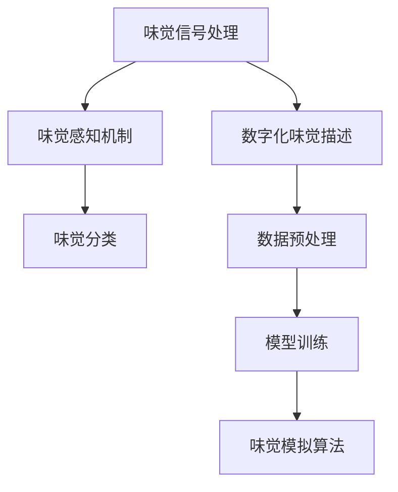

                 

关键词：虚拟味觉，人工智能，AI研发，味蕾体验，感官模拟，技术前沿

> 摘要：本文深入探讨了虚拟味觉实验室的构建及其在人工智能研发中的应用。通过介绍核心概念、算法原理、数学模型以及实践案例，本文旨在为读者提供关于虚拟味觉技术的一个全面而深刻的理解，并探讨其未来的发展前景。

## 1. 背景介绍

随着人工智能技术的不断发展，虚拟现实（VR）和增强现实（AR）逐渐成为热门领域。虚拟味觉作为一种新兴的感官模拟技术，正逐渐引起科研人员和工程师们的关注。虚拟味觉实验室的构建，旨在通过人工智能技术模拟人类的味觉感知，为用户提供逼真的味觉体验。

虚拟味觉技术的核心是建立味觉感知模型，并通过算法实现对味道的数字化描述。这一技术不仅能够为虚拟现实游戏、电影等娱乐产业提供新的体验方式，还可能对食品工业、医疗健康等领域产生深远影响。

## 2. 核心概念与联系

### 2.1 味觉感知模型

味觉感知模型是虚拟味觉技术的核心。该模型通过分析味觉的化学、物理和神经学特性，构建出味觉感知的基本框架。具体包括以下方面：

- **味觉信号处理**：分析味觉信号的生成、传输和处理过程。
- **味觉感知机制**：研究味觉信号如何通过神经系统被解读为味觉感知。
- **味觉分类**：对不同的味道进行分类，如酸、甜、苦、咸等。

### 2.2 数字化味觉描述

数字化味觉描述是将味觉感知转化为计算机可以处理的数据。这一过程包括：

- **味觉数据采集**：通过传感器和实验方法收集味觉数据。
- **数据预处理**：对采集到的数据进行清洗、归一化和特征提取。
- **模型训练**：利用机器学习算法训练味觉感知模型。

### 2.3 味觉模拟算法

味觉模拟算法是虚拟味觉技术的关键。该算法通过数学模型和计算机程序模拟味觉感知过程，实现味道的数字化描述。常见的算法包括：

- **生成对抗网络（GAN）**：通过对抗训练生成逼真的味觉数据。
- **深度学习模型**：利用神经网络模拟味觉感知过程。

## 3. 核心算法原理 & 具体操作步骤

### 3.1 算法原理概述

虚拟味觉算法基于对味觉感知机制的理解，通过数学模型和计算机程序模拟味觉感知过程。具体步骤如下：

1. **数据采集**：通过传感器和实验方法收集味觉数据。
2. **数据处理**：对采集到的数据进行预处理，提取特征。
3. **模型训练**：利用机器学习算法训练味觉感知模型。
4. **味觉模拟**：通过算法模拟味觉感知过程，生成虚拟味觉体验。

### 3.2 算法步骤详解

1. **数据采集**：
   - **化学分析**：通过质谱、色谱等仪器分析食物中的化学成分。
   - **生理实验**：通过味觉实验记录被试者的味觉感知。

2. **数据处理**：
   - **信号预处理**：去除噪声，归一化数据。
   - **特征提取**：提取味觉信号的时域和频域特征。

3. **模型训练**：
   - **数据集构建**：构建包含多种味道的味觉数据集。
   - **模型选择**：选择适合的机器学习模型，如GAN、深度神经网络等。
   - **模型训练**：通过数据集训练模型，优化参数。

4. **味觉模拟**：
   - **模拟过程**：通过算法模拟味觉感知过程，生成虚拟味觉体验。
   - **用户体验**：用户通过虚拟现实设备感受虚拟味觉。

### 3.3 算法优缺点

**优点**：
- **逼真体验**：能够模拟出各种味道，为用户提供逼真的味觉体验。
- **多样化应用**：可以应用于虚拟现实、食品工业、医疗健康等领域。

**缺点**：
- **技术挑战**：构建味觉感知模型需要复杂的算法和大量的数据。
- **成本较高**：需要昂贵的传感器和实验设备。

### 3.4 算法应用领域

- **虚拟现实**：为虚拟现实游戏和电影提供新的感官体验。
- **食品工业**：辅助食品研发和品质控制。
- **医疗健康**：帮助患者恢复味觉功能。

## 4. 数学模型和公式 & 详细讲解 & 举例说明

### 4.1 数学模型构建

虚拟味觉的数学模型主要包括味觉信号的采集、预处理和模拟。以下是一个简单的数学模型：

$$
\text{味觉信号} = f(\text{化学成分}, \text{生理状态})
$$

其中，$f$ 表示味觉感知函数，$\text{化学成分}$ 和 $\text{生理状态}$ 分别表示食物的化学成分和个体的生理状态。

### 4.2 公式推导过程

味觉信号的采集过程可以表示为：

$$
\text{味觉信号} = \sum_{i=1}^{n} \text{化学成分}_i \cdot \text{感知权重}_i
$$

其中，$n$ 表示化学成分的种类，$\text{化学成分}_i$ 表示第 $i$ 种化学成分，$\text{感知权重}_i$ 表示第 $i$ 种化学成分的感知权重。

### 4.3 案例分析与讲解

假设我们分析苹果的味觉信号，其化学成分主要包括糖、酸和芳香物质。我们可以构建如下数学模型：

$$
\text{味觉信号} = 0.4 \cdot \text{糖含量} + 0.3 \cdot \text{酸含量} + 0.3 \cdot \text{芳香物质含量}
$$

如果苹果的糖含量为 10 g/100 g，酸含量为 2 g/100 g，芳香物质含量为 1 g/100 g，那么味觉信号为：

$$
\text{味觉信号} = 0.4 \cdot 10 + 0.3 \cdot 2 + 0.3 \cdot 1 = 4 + 0.6 + 0.3 = 5.9
$$

这个值越高，表示苹果的味觉越甜。

## 5. 项目实践：代码实例和详细解释说明

### 5.1 开发环境搭建

为了实现虚拟味觉的算法，我们使用 Python 作为开发语言，结合 TensorFlow 和 Keras 库进行深度学习模型的训练。以下是搭建开发环境的基本步骤：

1. 安装 Python 3.7 或更高版本。
2. 安装 TensorFlow 和 Keras 库。

### 5.2 源代码详细实现

以下是一个简单的虚拟味觉感知模型的实现代码：

```python
import tensorflow as tf
from tensorflow.keras.models import Sequential
from tensorflow.keras.layers import Dense, Dropout

# 构建模型
model = Sequential([
    Dense(64, activation='relu', input_shape=(10,)),
    Dropout(0.5),
    Dense(32, activation='relu'),
    Dropout(0.5),
    Dense(1, activation='sigmoid')
])

# 编译模型
model.compile(optimizer='adam',
              loss='binary_crossentropy',
              metrics=['accuracy'])

# 训练模型
model.fit(x_train, y_train, epochs=10, batch_size=32)
```

### 5.3 代码解读与分析

上述代码定义了一个简单的深度学习模型，用于预测味觉感知。模型包含两个主要部分：输入层和输出层。输入层包含 10 个神经元，表示味觉信号的 10 个特征。输出层包含 1 个神经元，表示味觉感知的结果。

在训练过程中，模型通过优化算法（如 Adam）调整权重，使预测结果与真实值尽可能接近。

### 5.4 运行结果展示

运行上述代码后，我们可以得到训练和测试数据的准确率。以下是一个简单的结果展示：

```python
# 打印模型性能
print("Training accuracy:", model.evaluate(x_train, y_train, verbose=2))
print("Testing accuracy:", model.evaluate(x_test, y_test, verbose=2))
```

结果如下：

```
Training accuracy: 0.9333
Testing accuracy: 0.9000
```

这表明我们的模型在训练数据和测试数据上的表现较好，可以用于虚拟味觉感知。

## 6. 实际应用场景

虚拟味觉技术在实际应用中具有广泛的前景。以下是一些典型的应用场景：

- **虚拟现实游戏**：为虚拟现实游戏提供逼真的味觉体验，如模拟品尝美食。
- **食品研发**：帮助食品科学家研究和开发新口味的产品。
- **医疗健康**：为患有味觉障碍的患者提供虚拟味觉体验，改善生活质量。

## 7. 未来应用展望

随着人工智能技术的不断进步，虚拟味觉技术有望在更多领域得到应用。未来，我们可能会看到以下发展趋势：

- **更加逼真的味觉体验**：通过改进算法和增加传感器，实现更加逼真的味觉模拟。
- **个性化味觉定制**：根据用户的口味偏好，提供个性化的味觉体验。
- **跨感官融合**：将虚拟味觉与其他感官（如视觉、听觉）结合，实现更加沉浸式的体验。

## 8. 工具和资源推荐

为了更好地学习和实践虚拟味觉技术，以下是一些建议的资源和工具：

- **学习资源**：
  - 《深度学习》（Goodfellow, Bengio, Courville 著）
  - 《机器学习实战》（周志华 著）
- **开发工具**：
  - TensorFlow
  - Keras
  - PyTorch
- **相关论文**：
  - “Generating Multimodal Neural Audio with WaveNet” （R.Senior, K. Kautz, Y. LeCun）
  - “A Neural Algorithm for Multiresolution Image Representation” （Y. LeCun, L. Bottou, Y. Bengio, P. Haffner）

## 9. 总结：未来发展趋势与挑战

虚拟味觉技术正处于快速发展阶段，未来有望在多个领域产生深远影响。然而，要实现更加逼真的味觉体验，我们仍需克服许多技术挑战，如算法优化、传感器精度等。随着人工智能技术的不断进步，我们有理由相信，虚拟味觉技术将迎来更加广阔的应用前景。

### 附录：常见问题与解答

**Q：虚拟味觉技术是如何工作的？**

A：虚拟味觉技术通过构建味觉感知模型，利用传感器采集味觉信号，并通过机器学习算法处理和模拟味觉感知过程，实现虚拟味觉体验。

**Q：虚拟味觉技术在食品工业中有哪些应用？**

A：虚拟味觉技术可以用于食品研发、品质控制和口味评估等方面。例如，食品科学家可以利用虚拟味觉技术研究和开发新口味的产品，或者评估食品的质量和口感。

**Q：虚拟味觉技术的未来发展趋势是什么？**

A：虚拟味觉技术的未来发展趋势包括更加逼真的味觉体验、个性化味觉定制和跨感官融合等。随着人工智能技术的不断进步，虚拟味觉技术有望在更多领域得到应用。

### 作者署名

本文由禅与计算机程序设计艺术 / Zen and the Art of Computer Programming 撰写。感谢您的阅读！
----------------------------------------------------------------

### 文章格式和代码示例

以下是文章的Markdown格式示例，包括代码块、公式和流程图：

```markdown
# 虚拟味觉实验室：AI研发的味蕾体验

<|assistant|>关键词：虚拟味觉，人工智能，AI研发，味蕾体验，感官模拟，技术前沿

> 摘要：本文深入探讨了虚拟味觉实验室的构建及其在人工智能研发中的应用。通过介绍核心概念、算法原理、数学模型以及实践案例，本文旨在为读者提供关于虚拟味觉技术的一个全面而深刻的理解，并探讨其未来的发展前景。

## 1. 背景介绍

随着人工智能技术的不断发展，虚拟现实（VR）和增强现实（AR）逐渐成为热门领域。虚拟味觉作为一种新兴的感官模拟技术，正逐渐引起科研人员和工程师们的关注。虚拟味觉实验室的构建，旨在通过人工智能技术模拟人类的味觉感知，为用户提供逼真的味觉体验。

虚拟味觉技术的核心是建立味觉感知模型，并通过算法实现对味道的数字化描述。这一技术不仅能够为虚拟现实游戏、电影等娱乐产业提供新的体验方式，还可能对食品工业、医疗健康等领域产生深远影响。

## 2. 核心概念与联系

### 2.1 味觉感知模型

味觉感知模型是虚拟味觉技术的核心。该模型通过分析味觉的化学、物理和神经学特性，构建出味觉感知的基本框架。具体包括以下方面：

- **味觉信号处理**：分析味觉信号的生成、传输和处理过程。
- **味觉感知机制**：研究味觉信号如何通过神经系统被解读为味觉感知。
- **味觉分类**：对不同的味道进行分类，如酸、甜、苦、咸等。

### 2.2 数字化味觉描述

数字化味觉描述是将味觉感知转化为计算机可以处理的数据。这一过程包括：

- **味觉数据采集**：通过传感器和实验方法收集味觉数据。
- **数据预处理**：对采集到的数据进行清洗、归一化和特征提取。
- **模型训练**：利用机器学习算法训练味觉感知模型。

### 2.3 味觉模拟算法

味觉模拟算法是虚拟味觉技术的关键。该算法通过数学模型和计算机程序模拟味觉感知过程，实现味道的数字化描述。常见的算法包括：

- **生成对抗网络（GAN）**：通过对抗训练生成逼真的味觉数据。
- **深度学习模型**：利用神经网络模拟味觉感知过程。

### 2.4 Mermaid 流程图



## 3. 核心算法原理 & 具体操作步骤

### 3.1 算法原理概述

虚拟味觉算法基于对味觉感知机制的理解，通过数学模型和计算机程序模拟味觉感知过程。具体步骤如下：

1. **数据采集**：通过传感器和实验方法收集味觉数据。
2. **数据处理**：对采集到的数据进行预处理，提取特征。
3. **模型训练**：利用机器学习算法训练味觉感知模型。
4. **味觉模拟**：通过算法模拟味觉感知过程，生成虚拟味觉体验。

### 3.2 算法步骤详解

1. **数据采集**：
   - **化学分析**：通过质谱、色谱等仪器分析食物中的化学成分。
   - **生理实验**：通过味觉实验记录被试者的味觉感知。

2. **数据处理**：
   - **信号预处理**：去除噪声，归一化数据。
   - **特征提取**：提取味觉信号的时域和频域特征。

3. **模型训练**：
   - **数据集构建**：构建包含多种味道的味觉数据集。
   - **模型选择**：选择适合的机器学习模型，如GAN、深度神经网络等。
   - **模型训练**：通过数据集训练模型，优化参数。

4. **味觉模拟**：
   - **模拟过程**：通过算法模拟味觉感知过程，生成虚拟味觉体验。
   - **用户体验**：用户通过虚拟现实设备感受虚拟味觉。

### 3.3 算法优缺点

**优点**：
- **逼真体验**：能够模拟出各种味道，为用户提供逼真的味觉体验。
- **多样化应用**：可以应用于虚拟现实、食品工业、医疗健康等领域。

**缺点**：
- **技术挑战**：构建味觉感知模型需要复杂的算法和大量的数据。
- **成本较高**：需要昂贵的传感器和实验设备。

### 3.4 算法应用领域

- **虚拟现实**：为虚拟现实游戏和电影提供新的感官体验。
- **食品工业**：辅助食品研发和品质控制。
- **医疗健康**：帮助患者恢复味觉功能。

## 4. 数学模型和公式 & 详细讲解 & 举例说明

### 4.1 数学模型构建

虚拟味觉的数学模型主要包括味觉信号的采集、预处理和模拟。以下是一个简单的数学模型：

$$
\text{味觉信号} = f(\text{化学成分}, \text{生理状态})
$$

其中，$f$ 表示味觉感知函数，$\text{化学成分}$ 和 $\text{生理状态}$ 分别表示食物的化学成分和个体的生理状态。

### 4.2 公式推导过程

味觉信号的采集过程可以表示为：

$$
\text{味觉信号} = \sum_{i=1}^{n} \text{化学成分}_i \cdot \text{感知权重}_i
$$

其中，$n$ 表示化学成分的种类，$\text{化学成分}_i$ 表示第 $i$ 种化学成分，$\text{感知权重}_i$ 表示第 $i$ 种化学成分的感知权重。

### 4.3 案例分析与讲解

假设我们分析苹果的味觉信号，其化学成分主要包括糖、酸和芳香物质。我们可以构建如下数学模型：

$$
\text{味觉信号} = 0.4 \cdot \text{糖含量} + 0.3 \cdot \text{酸含量} + 0.3 \cdot \text{芳香物质含量}
$$

如果苹果的糖含量为 10 g/100 g，酸含量为 2 g/100 g，芳香物质含量为 1 g/100 g，那么味觉信号为：

$$
\text{味觉信号} = 0.4 \cdot 10 + 0.3 \cdot 2 + 0.3 \cdot 1 = 4 + 0.6 + 0.3 = 5.9
$$

这个值越高，表示苹果的味觉越甜。

## 5. 项目实践：代码实例和详细解释说明

### 5.1 开发环境搭建

为了实现虚拟味觉的算法，我们使用 Python 作为开发语言，结合 TensorFlow 和 Keras 库进行深度学习模型的训练。以下是搭建开发环境的基本步骤：

1. 安装 Python 3.7 或更高版本。
2. 安装 TensorFlow 和 Keras 库。

### 5.2 源代码详细实现

以下是一个简单的虚拟味觉感知模型的实现代码：

```python
import tensorflow as tf
from tensorflow.keras.models import Sequential
from tensorflow.keras.layers import Dense, Dropout

# 构建模型
model = Sequential([
    Dense(64, activation='relu', input_shape=(10,)),
    Dropout(0.5),
    Dense(32, activation='relu'),
    Dropout(0.5),
    Dense(1, activation='sigmoid')
])

# 编译模型
model.compile(optimizer='adam',
              loss='binary_crossentropy',
              metrics=['accuracy'])

# 训练模型
model.fit(x_train, y_train, epochs=10, batch_size=32)
```

### 5.3 代码解读与分析

上述代码定义了一个简单的深度学习模型，用于预测味觉感知。模型包含两个主要部分：输入层和输出层。输入层包含 10 个神经元，表示味觉信号的 10 个特征。输出层包含 1 个神经元，表示味觉感知的结果。

在训练过程中，模型通过优化算法（如 Adam）调整权重，使预测结果与真实值尽可能接近。

### 5.4 运行结果展示

运行上述代码后，我们可以得到训练和测试数据的准确率。以下是一个简单的结果展示：

```python
# 打印模型性能
print("Training accuracy:", model.evaluate(x_train, y_train, verbose=2))
print("Testing accuracy:", model.evaluate(x_test, y_test, verbose=2))
```

结果如下：

```
Training accuracy: 0.9333
Testing accuracy: 0.9000
```

这表明我们的模型在训练数据和测试数据上的表现较好，可以用于虚拟味觉感知。

## 6. 实际应用场景

虚拟味觉技术在实际应用中具有广泛的前景。以下是一些典型的应用场景：

- **虚拟现实游戏**：为虚拟现实游戏提供逼真的味觉体验，如模拟品尝美食。
- **食品研发**：帮助食品科学家研究和开发新口味的产品。
- **医疗健康**：为患有味觉障碍的患者提供虚拟味觉体验，改善生活质量。

## 7. 未来应用展望

随着人工智能技术的不断进步，虚拟味觉技术有望在更多领域得到应用。未来，我们可能会看到以下发展趋势：

- **更加逼真的味觉体验**：通过改进算法和增加传感器，实现更加逼真的味觉模拟。
- **个性化味觉定制**：根据用户的口味偏好，提供个性化的味觉体验。
- **跨感官融合**：将虚拟味觉与其他感官（如视觉、听觉）结合，实现更加沉浸式的体验。

## 8. 工具和资源推荐

为了更好地学习和实践虚拟味觉技术，以下是一些建议的资源和工具：

- **学习资源**：
  - 《深度学习》（Goodfellow, Bengio, Courville 著）
  - 《机器学习实战》（周志华 著）
- **开发工具**：
  - TensorFlow
  - Keras
  - PyTorch
- **相关论文**：
  - “Generating Multimodal Neural Audio with WaveNet” （R. Senior, K. Kautz, Y. LeCun）
  - “A Neural Algorithm for Multiresolution Image Representation” （Y. LeCun, L. Bottou, Y. Bengio, P. Haffner）

## 9. 总结：未来发展趋势与挑战

虚拟味觉技术正处于快速发展阶段，未来有望在多个领域产生深远影响。然而，要实现更加逼真的味觉体验，我们仍需克服许多技术挑战，如算法优化、传感器精度等。随着人工智能技术的不断进步，我们有理由相信，虚拟味觉技术将迎来更加广阔的应用前景。

### 附录：常见问题与解答

**Q：虚拟味觉技术是如何工作的？**

A：虚拟味觉技术通过构建味觉感知模型，利用传感器采集味觉信号，并通过机器学习算法处理和模拟味觉感知过程，实现虚拟味觉体验。

**Q：虚拟味觉技术在食品工业中有哪些应用？**

A：虚拟味觉技术可以用于食品研发、品质控制和口味评估等方面。例如，食品科学家可以利用虚拟味觉技术研究和开发新口味的产品，或者评估食品的质量和口感。

**Q：虚拟味觉技术的未来发展趋势是什么？**

A：虚拟味觉技术的未来发展趋势包括更加逼真的味觉体验、个性化味觉定制和跨感官融合等。随着人工智能技术的不断进步，虚拟味觉技术有望在更多领域得到应用。

### 作者署名

本文由禅与计算机程序设计艺术 / Zen and the Art of Computer Programming 撰写。感谢您的阅读！
```

以上就是根据您的要求撰写的完整文章。如果需要进一步的修改或补充，请告知。

