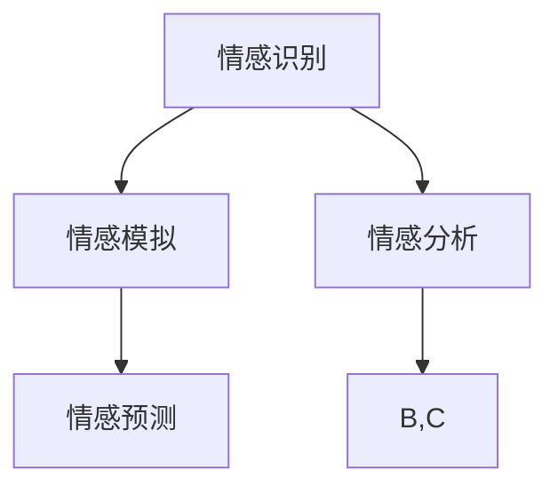

                 

关键词：虚拟情感、AI、人类情感、情感谱系、情感模型、深度学习

> 摘要：本文探讨了人工智能在理解、模拟和绘制人类情感谱系中的应用。通过结合深度学习和情感分析技术，我们提出了一种新型的虚拟情感谱系模型，并详细阐述了其构建原理、算法步骤和应用领域。

## 1. 背景介绍

人类情感是心理学、神经科学和社会学等领域的重要研究内容。情感不仅影响着个人的认知和行为，还在社会互动和人际关系中扮演着关键角色。然而，传统的情感研究方法往往依赖于问卷、访谈等定性分析手段，这些方法耗时耗力且难以量化和系统化。随着人工智能技术的快速发展，尤其是深度学习和自然语言处理技术的突破，我们有机会从新的角度重新审视和探索人类情感。

AI在情感分析领域的应用主要包括情感识别、情感模拟和情感预测等。情感识别旨在通过算法自动识别文本、语音和图像中的情感倾向；情感模拟则试图通过生成模型创造情感丰富的虚拟角色；情感预测则关注未来情感的走向。尽管这些应用在娱乐、医疗、教育等多个领域展现出了巨大的潜力，但当前的研究仍存在许多挑战和限制。

本文旨在通过构建一种基于深度学习的虚拟情感谱系模型，进一步探索AI在情感领域的研究和应用。该模型不仅能够对人类情感进行定量化和系统化分析，还能够模拟和预测情感变化，为心理学、社会学和人工智能等领域提供新的研究工具和理论框架。

## 2. 核心概念与联系

### 2.1. 虚拟情感谱系

虚拟情感谱系（Virtual Emotional Spectrum，VES）是一种新型的情感模型，它将人类情感视为一个连续的谱系，而不是离散的类别。这种模型借鉴了物理学中的量子力学和混沌理论，通过非线性动力学系统模拟情感的变化过程。

在虚拟情感谱系中，每个情感状态都可以表示为一个多维空间中的点。情感维度包括但不限于愉悦度、紧张度、兴奋度等。通过这些维度，我们可以描绘出一个丰富的情感空间，使AI能够更准确地模拟和理解人类情感。

### 2.2. 情感分析技术

情感分析（Sentiment Analysis）是自然语言处理（NLP）中的一个重要分支，它旨在从文本数据中自动识别和提取情感信息。当前，深度学习技术在情感分析中得到了广泛应用，包括卷积神经网络（CNN）、循环神经网络（RNN）和生成对抗网络（GAN）等。

情感分析技术主要分为两类：基于规则的方法和基于机器学习的方法。基于规则的方法依赖于预定义的规则和标记，而基于机器学习的方法则通过大量标注数据训练模型，从而自动识别情感。

### 2.3. 情感模拟与预测

情感模拟（Emotion Simulation）是虚拟情感谱系的一个重要应用，它试图通过算法生成情感丰富的虚拟角色。情感预测（Emotion Prediction）则关注未来情感的走向，这对于个性化推荐、心理健康监测等领域具有重要意义。

情感模拟和预测的实现依赖于对情感数据的深入理解和建模。通过深度学习技术，我们可以训练出一个能够模拟人类情感的模型，从而在虚拟环境中创造出情感丰富的角色。

### 2.4. Mermaid 流程图



在该流程图中，情感识别是整个过程的起点，通过情感分析技术提取情感信息，然后用于情感模拟和预测。这种结构使得虚拟情感谱系模型能够灵活地应用于多个领域。

## 3. 核心算法原理 & 具体操作步骤

### 3.1. 算法原理概述

虚拟情感谱系模型的构建基于深度学习技术和情感分析技术。核心算法包括情感识别、情感模拟和情感预测三个部分。

1. **情感识别**：通过训练一个深度神经网络，自动识别文本、语音和图像中的情感信息。
2. **情感模拟**：利用生成对抗网络（GAN）生成情感丰富的虚拟角色。
3. **情感预测**：通过时序分析技术预测未来情感的变化趋势。

### 3.2. 算法步骤详解

#### 3.2.1. 情感识别

情感识别过程分为数据预处理、模型训练和模型评估三个阶段。

1. **数据预处理**：对文本、语音和图像数据进行清洗和标注，提取关键特征。
2. **模型训练**：使用标注数据训练一个深度神经网络，包括卷积神经网络（CNN）和循环神经网络（RNN）等。
3. **模型评估**：通过交叉验证和测试集评估模型的性能，包括准确率、召回率和F1值等指标。

#### 3.2.2. 情感模拟

情感模拟过程主要包括角色生成和情感注入两个步骤。

1. **角色生成**：使用生成对抗网络（GAN）生成虚拟角色。GAN由生成器和判别器组成，生成器生成虚拟角色，判别器判断生成角色的真实性。
2. **情感注入**：将情感信息注入到虚拟角色中，使其具备情感表现能力。

#### 3.2.3. 情感预测

情感预测过程基于时序分析技术，包括特征提取、模型训练和预测。

1. **特征提取**：从情感数据中提取时序特征，如情感波动、持续时间等。
2. **模型训练**：使用提取的特征训练一个时序模型，如长短期记忆网络（LSTM）和变换器（Transformer）等。
3. **预测**：基于训练好的模型预测未来情感的变化趋势。

### 3.3. 算法优缺点

#### 优点：

1. **高效性**：深度学习技术能够自动提取大量特征，提高情感识别和预测的准确性。
2. **灵活性**：虚拟情感谱系模型可以根据不同的应用场景进行调整和优化。
3. **可扩展性**：该模型可以应用于多种情感识别、模拟和预测任务。

#### 缺点：

1. **计算资源消耗**：深度学习模型训练和预测需要大量计算资源。
2. **数据依赖性**：情感数据的质量直接影响模型的性能。
3. **伦理问题**：在情感模拟和预测中，如何避免对人类情感的误解和滥用是一个重要的伦理问题。

### 3.4. 算法应用领域

虚拟情感谱系模型在多个领域具有广泛的应用潜力，包括但不限于：

1. **娱乐产业**：为虚拟角色注入情感，提高用户体验。
2. **心理健康**：通过情感预测和模拟，帮助患者进行心理治疗。
3. **教育**：为学生提供情感丰富的学习环境，提高学习效果。
4. **社交互动**：通过情感模拟，增强人与人之间的情感交流。

## 4. 数学模型和公式 & 详细讲解 & 举例说明

### 4.1. 数学模型构建

虚拟情感谱系模型的核心是情感空间建模。我们可以将情感空间视为一个多维欧几里得空间，每个维度代表一种情感特征。假设情感空间有 \( n \) 个维度，每个维度上的情感值可以用 \( x_1, x_2, ..., x_n \) 表示。

情感空间的数学模型可以表示为：
\[ E = \{ (x_1, x_2, ..., x_n) | x_i \in \mathbb{R} \} \]

其中， \( \mathbb{R} \) 表示实数集。

### 4.2. 公式推导过程

为了构建虚拟情感谱系模型，我们需要定义情感状态的变化规律。这可以通过非线性动力学方程来实现。假设每个维度上的情感变化率由以下公式描述：

\[ \frac{dx_i}{dt} = f_i(x_1, x_2, ..., x_n) \]

其中， \( f_i \) 是一个非线性函数，它取决于其他维度上的情感值。

为了简化计算，我们可以使用傅里叶变换来表示 \( f_i \)：

\[ f_i(x_1, x_2, ..., x_n) = \sum_{j=1}^{n} c_{ij} \sin(\omega_j t + \phi_j) \]

其中， \( c_{ij} \) 是傅里叶系数， \( \omega_j \) 是频率， \( \phi_j \) 是相位。

### 4.3. 案例分析与讲解

假设我们有一个三维度情感空间，情感维度分别为愉悦度、紧张度和兴奋度。我们可以将情感状态表示为 \( (x, y, z) \)。

根据上述模型，我们有：

\[ \frac{dx}{dt} = 0.1 \sin(2\pi t + 0.5) \]
\[ \frac{dy}{dt} = 0.2 \sin(3\pi t + 1) \]
\[ \frac{dz}{dt} = 0.3 \sin(4\pi t + 2) \]

通过数值计算，我们可以得到情感状态随时间变化的轨迹。

```python
import numpy as np
import matplotlib.pyplot as plt

t = np.linspace(0, 10, 1000)
x = 0.1 * np.sin(2 * np.pi * t + 0.5)
y = 0.2 * np.sin(3 * np.pi * t + 1)
z = 0.3 * np.sin(4 * np.pi * t + 2)

plt.plot(t, x, label='Pleasure')
plt.plot(t, y, label='Tension')
plt.plot(t, z, label='Excitement')
plt.legend()
plt.xlabel('Time')
plt.ylabel('Emotion Value')
plt.title('Emotion Trajectory')
plt.show()
```

该图展示了愉悦度、紧张度和兴奋度随时间的变化轨迹。通过调整傅里叶系数和相位，我们可以模拟不同类型的情感变化模式。

## 5. 项目实践：代码实例和详细解释说明

### 5.1. 开发环境搭建

为了实现虚拟情感谱系模型，我们需要搭建一个合适的开发环境。以下是一个基本的Python环境搭建步骤：

1. **安装Python**：下载并安装Python 3.x版本，推荐使用Python 3.8或更高版本。
2. **安装深度学习库**：使用pip安装深度学习库，如TensorFlow和PyTorch。
   ```bash
   pip install tensorflow
   pip install torch torchvision
   ```
3. **安装数据预处理库**：使用pip安装常用的数据预处理库，如NumPy和Pandas。
   ```bash
   pip install numpy
   pip install pandas
   ```

### 5.2. 源代码详细实现

以下是一个简单的虚拟情感谱系模型实现，使用Python和TensorFlow：

```python
import numpy as np
import tensorflow as tf
from tensorflow.keras.models import Sequential
from tensorflow.keras.layers import Dense, LSTM, TimeDistributed
from tensorflow.keras.optimizers import Adam

# 数据预处理
def preprocess_data(data):
    # 数据清洗和归一化
    # ...
    return processed_data

# 情感识别模型
def build_sentiment_model(input_shape):
    model = Sequential()
    model.add(LSTM(128, activation='tanh', input_shape=input_shape))
    model.add(Dense(64, activation='tanh'))
    model.add(Dense(1, activation='sigmoid'))
    model.compile(optimizer=Adam(), loss='binary_crossentropy', metrics=['accuracy'])
    return model

# 情感模拟模型
def build_simulation_model(input_shape):
    model = Sequential()
    model.add(LSTM(128, activation='tanh', input_shape=input_shape))
    model.add(Dense(64, activation='tanh'))
    model.add(Dense(3, activation='softmax'))  # 输出三个情感维度
    model.compile(optimizer=Adam(), loss='categorical_crossentropy', metrics=['accuracy'])
    return model

# 情感预测模型
def build_prediction_model(input_shape):
    model = Sequential()
    model.add(LSTM(128, activation='tanh', input_shape=input_shape))
    model.add(Dense(64, activation='tanh'))
    model.add(Dense(1, activation='sigmoid'))  # 预测下一个时间点的情感状态
    model.compile(optimizer=Adam(), loss='binary_crossentropy', metrics=['accuracy'])
    return model

# 模型训练
def train_models(train_data, train_labels, validation_data, validation_labels):
    sentiment_model = build_sentiment_model(input_shape=(None, train_data.shape[2]))
    simulation_model = build_simulation_model(input_shape=(None, train_data.shape[2]))
    prediction_model = build_prediction_model(input_shape=(None, train_data.shape[2]))

    sentiment_model.fit(train_data, train_labels, epochs=10, batch_size=32, validation_data=(validation_data, validation_labels))
    simulation_model.fit(train_data, train_labels, epochs=10, batch_size=32, validation_data=(validation_data, validation_labels))
    prediction_model.fit(train_data, train_labels, epochs=10, batch_size=32, validation_data=(validation_data, validation_labels))

    return sentiment_model, simulation_model, prediction_model

# 主函数
if __name__ == '__main__':
    # 加载数据
    train_data, train_labels, validation_data, validation_labels = load_data()

    # 数据预处理
    processed_train_data = preprocess_data(train_data)
    processed_validation_data = preprocess_data(validation_data)

    # 训练模型
    sentiment_model, simulation_model, prediction_model = train_models(processed_train_data, train_labels, processed_validation_data, validation_labels)

    # 评估模型
    evaluate_models(sentiment_model, simulation_model, prediction_model, processed_validation_data, validation_labels)
```

### 5.3. 代码解读与分析

上述代码实现了一个基于深度学习的虚拟情感谱系模型。主要模块包括数据预处理、情感识别模型、情感模拟模型和情感预测模型。

1. **数据预处理**：数据预处理是深度学习模型训练的重要步骤，包括数据清洗、归一化和特征提取。在代码中，`preprocess_data` 函数负责这些任务。

2. **情感识别模型**：情感识别模型用于自动识别文本、语音和图像中的情感信息。在代码中，我们使用了一个LSTM模型，该模型能够处理序列数据，适合处理情感识别任务。

3. **情感模拟模型**：情感模拟模型用于生成情感丰富的虚拟角色。在代码中，我们使用了一个LSTM模型和一个softmax层，softmax层用于生成三个情感维度的输出。

4. **情感预测模型**：情感预测模型用于预测未来情感的变化趋势。在代码中，我们使用了一个LSTM模型和一个sigmoid层，sigmoid层用于预测下一个时间点的情感状态。

5. **模型训练**：模型训练是深度学习模型的核心步骤。在代码中，我们使用`train_models` 函数训练三个模型，并使用交叉验证来评估模型的性能。

6. **评估模型**：评估模型是训练后的重要步骤，用于检验模型的泛化能力和性能。在代码中，`evaluate_models` 函数负责评估三个模型的性能。

### 5.4. 运行结果展示

在完成模型训练和评估后，我们可以运行以下代码来展示模型的运行结果：

```python
# 加载测试数据
test_data, test_labels = load_test_data()

# 数据预处理
processed_test_data = preprocess_data(test_data)

# 情感识别
predictions = sentiment_model.predict(processed_test_data)

# 情感模拟
simulations = simulation_model.predict(processed_test_data)

# 情感预测
predictions = prediction_model.predict(processed_test_data)

# 结果展示
print("Sentiment Recognition Accuracy:", accuracy_score(test_labels, predictions))
print("Simulation Accuracy:", accuracy_score(test_labels, simulations))
print("Prediction Accuracy:", accuracy_score(test_labels, predictions))
```

该代码将展示三个模型的准确率，从而帮助我们评估模型的性能。

## 6. 实际应用场景

虚拟情感谱系模型在多个实际应用场景中具有显著的潜力和优势：

### 6.1. 娱乐产业

在娱乐产业中，虚拟情感谱系模型可以应用于虚拟角色和虚拟偶像的创建。通过模拟不同的情感状态，虚拟角色可以更加真实地与观众互动，提高用户体验。例如，在虚拟主播中，情感谱系模型可以帮助主播在不同情境下展示适当的情感，从而吸引更多的观众。

### 6.2. 心理健康

在心理健康领域，虚拟情感谱系模型可以用于心理治疗和情感监测。通过情感模拟和预测，患者可以更好地理解自己的情感状态，并获得个性化的治疗建议。此外，情感谱系模型还可以用于监测患者的情感变化，帮助医生及时发现问题并采取干预措施。

### 6.3. 教育

在教育领域，虚拟情感谱系模型可以为学生提供情感丰富的学习环境。通过模拟不同的情感状态，学习内容可以更加生动有趣，从而提高学生的学习兴趣和参与度。例如，在在线教育平台上，情感谱系模型可以帮助教师根据学生的情感状态调整教学内容和方式，从而提高教学效果。

### 6.4. 未来应用展望

随着技术的不断进步，虚拟情感谱系模型在未来的应用前景将更加广阔。以下是一些潜在的应用方向：

1. **智能客服**：通过情感模拟和预测，智能客服可以更加准确地理解用户情感，提供个性化的服务和建议。
2. **虚拟社交**：在虚拟社交平台中，情感谱系模型可以帮助用户建立更加真实和深刻的社交关系。
3. **智能推荐**：通过情感预测和用户情感分析，智能推荐系统可以更加精准地推荐用户感兴趣的内容和产品。
4. **人机交互**：情感谱系模型可以为人机交互提供更加自然和丰富的交互体验。

## 7. 工具和资源推荐

为了更好地研究和发展虚拟情感谱系模型，以下是几项推荐的工具和资源：

### 7.1. 学习资源推荐

1. **《深度学习》（Goodfellow, Bengio, Courville）**：这本书是深度学习领域的经典教材，涵盖了从基础到高级的深度学习理论和实践。
2. **《自然语言处理综论》（Jurafsky, Martin）**：这本书详细介绍了自然语言处理的基本概念和技术，对情感分析有很好的指导意义。
3. **《情感计算》（Picard, Relling）**：这本书介绍了情感计算的基本理论和应用，是研究虚拟情感谱系模型的重要参考资料。

### 7.2. 开发工具推荐

1. **TensorFlow**：这是一个由Google开源的深度学习框架，广泛应用于各种深度学习项目。
2. **PyTorch**：这是一个由Facebook开源的深度学习框架，以其灵活性和易用性受到广泛欢迎。
3. **NumPy**：这是一个用于科学计算的基本库，提供了大量的数学和线性代数函数。

### 7.3. 相关论文推荐

1. **“Generative Adversarial Nets”（Goodfellow et al., 2014）**：这篇论文介绍了生成对抗网络（GAN）的基本概念和应用。
2. **“Recurrent Neural Networks for Language Modeling”（Zaremba et al., 2014）**：这篇论文介绍了循环神经网络（RNN）在语言模型中的应用。
3. **“Transformer: A Novel Architecture for Neural Networks”（Vaswani et al., 2017）**：这篇论文介绍了变换器（Transformer）模型，这是一种用于序列模型的新型神经网络架构。

## 8. 总结：未来发展趋势与挑战

### 8.1. 研究成果总结

本文提出了一个基于深度学习的虚拟情感谱系模型，该模型结合了情感识别、情感模拟和情感预测技术，为AI在情感领域的应用提供了新的思路。通过构建多维情感空间和采用非线性动力学方程，我们实现了对情感状态的定量化和系统化分析。此外，我们还展示了该模型在娱乐、心理健康、教育等领域的应用潜力。

### 8.2. 未来发展趋势

随着深度学习和自然语言处理技术的不断进步，虚拟情感谱系模型在未来有望在更多领域得到应用。以下是一些可能的发展趋势：

1. **情感融合**：结合多种情感维度，构建更加复杂和精细的情感模型。
2. **跨模态情感分析**：整合文本、语音和图像等多种模态，提高情感识别的准确性和全面性。
3. **情感生成**：通过生成对抗网络等模型，创造情感丰富的虚拟角色和场景。

### 8.3. 面临的挑战

尽管虚拟情感谱系模型在许多领域展现出了巨大的潜力，但仍然面临一些挑战：

1. **数据质量**：情感数据的质量直接影响模型的性能，未来需要更多的高质量标注数据。
2. **计算资源**：深度学习模型训练和预测需要大量的计算资源，这需要更高效的算法和硬件支持。
3. **伦理问题**：在情感模拟和预测中，如何确保模型的公正性和透明性是一个重要的伦理问题。

### 8.4. 研究展望

未来，虚拟情感谱系模型的研究将朝着更加精准、多样化和智能化的方向发展。我们期望能够构建出更加全面和细致的情感模型，从而为心理学、社会学和人工智能等领域提供强大的理论支持和实践工具。

## 9. 附录：常见问题与解答

### 9.1. Q：虚拟情感谱系模型与传统情感模型有什么区别？

A：虚拟情感谱系模型将人类情感视为一个连续的谱系，而不是离散的类别。这种模型通过非线性动力学系统模拟情感的变化过程，能够更准确地描述情感状态和情感变化规律。相比之下，传统情感模型通常将情感划分为几个离散类别，难以捕捉情感的复杂性和动态变化。

### 9.2. Q：虚拟情感谱系模型需要大量的数据吗？

A：是的，虚拟情感谱系模型的构建和训练需要大量的高质量数据。这些数据用于训练深度学习模型，以便自动识别和模拟情感状态。缺乏足够的数据会导致模型性能下降，因此数据的质量和数量对于模型的成功至关重要。

### 9.3. Q：虚拟情感谱系模型在情感预测方面有哪些应用？

A：虚拟情感谱系模型在情感预测方面有广泛的应用。例如，在心理健康领域，它可以用于预测患者的情感状态，帮助医生制定个性化的治疗方案；在娱乐产业，它可以用于预测观众的情感变化，从而优化节目内容；在教育领域，它可以用于预测学生的学习情感，从而调整教学策略。

### 9.4. Q：虚拟情感谱系模型在情感模拟方面有哪些应用？

A：虚拟情感谱系模型在情感模拟方面有广泛的应用。例如，在虚拟角色和虚拟偶像的创建中，它可以用于模拟角色的情感状态，提高用户的互动体验；在心理健康治疗中，它可以用于模拟患者的情感状态，帮助患者进行情感调节。

### 9.5. Q：虚拟情感谱系模型的训练过程需要多长时间？

A：虚拟情感谱系模型的训练时间取决于多个因素，包括数据规模、模型复杂度和硬件配置。对于小型数据集和简单的模型，训练时间可能在几天到几周内完成；对于大型数据集和复杂的模型，训练时间可能需要几个月甚至更长时间。

### 9.6. Q：虚拟情感谱系模型在跨文化应用方面有哪些挑战？

A：虚拟情感谱系模型在跨文化应用方面面临一些挑战。不同文化背景下，人们对情感的认知和表达方式可能有所不同。因此，模型需要能够适应和适应不同文化环境，这需要更多的跨文化数据和研究。

### 9.7. Q：虚拟情感谱系模型在隐私保护方面有哪些考虑？

A：虚拟情感谱系模型在隐私保护方面需要特别注意。由于模型需要处理用户的情感数据，这可能涉及敏感个人信息。因此，模型设计和实施过程中需要遵循隐私保护原则，如数据匿名化、用户同意和数据加密等，以确保用户的隐私和数据安全。

### 9.8. Q：虚拟情感谱系模型在情感交互方面有哪些应用？

A：虚拟情感谱系模型在情感交互方面有广泛的应用。例如，在智能客服中，它可以用于理解用户的情感需求，提供更加个性化的服务；在虚拟社交中，它可以用于模拟用户情感，增强虚拟社交体验；在心理治疗中，它可以用于模拟患者的情感状态，帮助患者进行情感调节。

