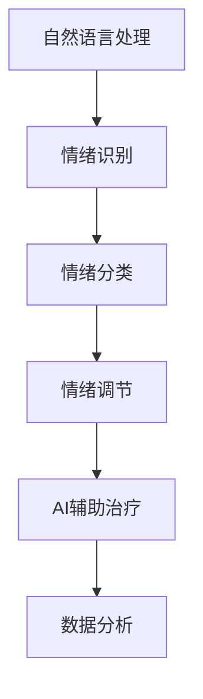

                 

# 虚拟情绪调节器：AI驱动的心理健康管理

> 关键词：人工智能,心理健康,情绪调节,AI辅助治疗,情绪识别,自然语言处理(NLP)

## 1. 背景介绍

### 1.1 问题由来

在全球范围内，心理健康问题已经成为影响人类生活质量的重要因素。根据世界卫生组织（WHO）的报告，2020年全球近10%的人口患有严重的心理健康障碍，如抑郁症和焦虑症。传统的心理治疗模式往往需要耗费大量时间和精力，且受限于专业心理医生的数量和分布。如何利用先进的技术手段，提供更便捷、高效的心理健康服务，成为了当下的一大需求。

在这一背景下，基于人工智能（AI）的心理健康管理解决方案应运而生。AI可以通过情绪识别、情感分析等技术，对用户的心理健康状态进行实时监测和调节，帮助用户缓解压力，提升心理健康水平。本文将重点介绍一种基于AI的情绪调节器，探讨其在心理健康管理中的应用前景和实现机制。

### 1.2 问题核心关键点

这种基于AI的情绪调节器，通过自然语言处理（NLP）和机器学习技术，实现了对用户情绪的自动识别和分类，进而根据情绪状态，提供个性化的情绪调节建议和心理疏导策略。其核心关键点包括：

1. 情绪识别：通过NLP技术，自动分析用户输入的文本数据，识别出用户的情绪状态。
2. 情绪分类：将用户的情绪状态进行分类，如快乐、悲伤、愤怒等。
3. 情绪调节：根据情绪分类结果，推荐适合的情绪调节策略，如深呼吸、冥想、运动等。
4. AI辅助治疗：结合心理医生，提供专业的心理疏导服务。
5. 数据分析：利用AI技术对用户的情绪变化进行长期跟踪和分析，发现潜在的心理健康问题。

这些核心关键点共同构成了AI情绪调节器的基本框架，使其能够精准、高效地为用户提供心理健康管理服务。

### 1.3 问题研究意义

研究AI情绪调节器，对于拓展心理健康服务的途径，提升用户心理健康水平，具有重要意义：

1. 扩大服务覆盖面：AI情绪调节器可以随时随地为用户提供心理健康服务，不受时间和空间的限制。
2. 降低服务成本：相比于传统心理咨询，AI情绪调节器显著降低了人力和时间成本。
3. 提高服务质量：AI情绪调节器通过大数据和机器学习算法，为用户提供个性化的心理健康服务，提高用户体验。
4. 增强服务可及性：AI情绪调节器支持多种语言和平台，使得更多人能够享受心理健康服务。
5. 支持早期干预：通过情绪跟踪和数据分析，AI情绪调节器能够及时发现用户的心理健康问题，进行早期干预。

## 2. 核心概念与联系

### 2.1 核心概念概述

为更好地理解AI情绪调节器的核心概念，本节将介绍几个密切相关的核心概念：

- 人工智能(AI)：一种模拟人类智能的技术，通过机器学习、自然语言处理等方法，实现对数据的处理和分析。
- 自然语言处理(NLP)：研究计算机如何理解和处理人类语言的技术，包括文本分类、情感分析、语音识别等。
- 情绪识别（Emotion Recognition）：识别用户输入文本或语音中的情绪信息，如快乐、悲伤、愤怒等。
- 情绪调节（Emotion Regulation）：通过各种方法（如深呼吸、冥想、运动等），帮助用户调节自己的情绪状态。
- AI辅助治疗：结合心理医生，提供专业的心理疏导服务，支持用户的心理问题解决。
- 数据分析（Data Analysis）：利用机器学习算法对用户的情绪变化进行长期跟踪和分析，发现潜在的心理健康问题。

这些核心概念之间的逻辑关系可以通过以下Mermaid流程图来展示：



这个流程图展示了大语言模型的核心概念及其之间的关系：

1. 自然语言处理通过文本分析和语音识别，获得用户的输入数据。
2. 情绪识别对用户输入进行情绪分析，识别出用户的情绪状态。
3. 情绪分类对情绪进行归类，确定具体的情绪类型。
4. 情绪调节根据情绪类型，提供相应的情绪调节策略。
5. AI辅助治疗结合心理医生，提供专业的心理疏导服务。
6. 数据分析通过长期跟踪和分析，发现用户的心理健康问题，进行早期干预。

这些概念共同构成了AI情绪调节器的核心框架，使其能够实现对用户情绪的全面监测和调节。

## 3. 核心算法原理 & 具体操作步骤
### 3.1 算法原理概述

AI情绪调节器的核心算法原理，主要包括自然语言处理、情感分析和情绪调节三大部分。

- 自然语言处理：通过NLP技术，自动分析用户输入的文本数据，识别出其中的情绪信息。
- 情感分析：对用户输入的情绪信息进行分类，确定具体的情绪类型。
- 情绪调节：根据情绪类型，推荐适合的情绪调节策略，如深呼吸、冥想、运动等。

这些算法原理通过机器学习模型进行实现，具体流程如下：

1. 收集用户输入的文本数据，如聊天记录、日志等。
2. 对输入数据进行预处理，如分词、去除停用词等。
3. 使用NLP技术，对文本进行情感分析，确定用户的情绪状态。
4. 根据情绪状态，调用情绪调节策略。
5. 结合AI辅助治疗，提供专业的心理疏导服务。

### 3.2 算法步骤详解

AI情绪调节器的实现步骤如下：

**Step 1: 数据收集与预处理**
- 收集用户输入的文本数据，如聊天记录、日志等。
- 对输入数据进行预处理，如分词、去除停用词、标准化等，生成适合模型处理的文本数据。

**Step 2: 情绪识别**
- 使用NLP技术，如BERT、GPT等，对预处理后的文本数据进行情绪分析，确定用户的情绪状态。
- 情绪分析通常通过预训练的语言模型进行，模型对输入文本进行编码，输出情绪标签。

**Step 3: 情绪分类**
- 对情绪分析的结果进行分类，如快乐、悲伤、愤怒等。
- 通常使用分类模型（如SVM、决策树等），对情绪标签进行分类。

**Step 4: 情绪调节**
- 根据情绪分类结果，推荐适合的情绪调节策略。
- 策略通常包括深呼吸、冥想、运动等，具体根据用户的兴趣和需求进行推荐。

**Step 5: AI辅助治疗**
- 结合心理医生，提供专业的心理疏导服务。
- 在用户情绪波动较大时，自动触发与心理医生的沟通，提供专业的心理支持。

**Step 6: 数据分析**
- 利用机器学习算法，对用户的情绪变化进行长期跟踪和分析。
- 发现潜在的心理健康问题，进行早期干预。

以上步骤构成了AI情绪调节器的基本流程，通过各个环节的协同工作，实现对用户情绪的全面监测和调节。

### 3.3 算法优缺点

AI情绪调节器具有以下优点：

1. 实时性高：通过自然语言处理技术，能够实时识别用户情绪，提供即时反馈。
2. 个性化强：结合用户偏好和兴趣，推荐个性化的情绪调节策略。
3. 可扩展性强：支持多种语言和平台，具有广泛的适用性。
4. 辅助治疗高效：结合AI和心理医生的双重支持，提供高效的心理疏导服务。
5. 数据分析深入：利用机器学习算法，对用户情绪变化进行深入分析，发现潜在问题。

同时，该算法也存在以下缺点：

1. 数据依赖性强：需要大量的用户输入数据进行训练和优化。
2. 模型复杂度高：需要高性能计算资源，对算力要求较高。
3. 隐私风险：需要收集用户情绪数据，存在隐私泄露风险。
4. 误识别率高：情绪识别技术尚未完全成熟，存在一定的误识别率。
5. 效果因人而异：不同的人对情绪调节策略的反应不同，效果难以保证。

尽管存在这些局限性，但AI情绪调节器在心理健康管理中的应用前景广阔，有望为更多用户提供高效、便捷的心理健康服务。

### 3.4 算法应用领域

AI情绪调节器在多个领域有着广泛的应用前景：

- 心理健康服务：提供个性化的心理健康服务，支持用户的心理问题解决。
- 教育培训：结合情绪调节技术，提高学生的心理健康水平，提升学习效果。
- 工作压力管理：通过情绪调节策略，帮助员工缓解工作压力，提高工作效率。
- 健康监测：利用数据分析技术，发现用户的心理健康问题，进行早期干预。
- 老年关怀：结合语音识别技术，提供情绪调节和心理疏导服务，提升老年人的生活质量。

这些应用领域展示了AI情绪调节器的巨大潜力和广泛应用前景，有望在多个场景下带来积极的社会效益。

## 4. 数学模型和公式 & 详细讲解 & 举例说明（备注：数学公式请使用latex格式，latex嵌入文中独立段落使用 $$，段落内使用 $)
### 4.1 数学模型构建

假设用户输入的文本数据为 $x_i$，对应的情绪标签为 $y_i$。设 $x_i$ 的嵌入向量为 $\mathbf{x}_i \in \mathbb{R}^d$，情绪标签 $y_i$ 的嵌入向量为 $\mathbf{y}_i \in \mathbb{R}^d$。情绪分类模型 $f$ 的输入为 $\mathbf{x}_i$，输出为情绪标签 $y_i$。

情绪分类模型的训练目标为最小化交叉熵损失，即：

$$
\mathcal{L} = -\frac{1}{N}\sum_{i=1}^N \sum_{k=1}^K (y_{ik} \log f_k(\mathbf{x}_i) + (1 - y_{ik}) \log (1 - f_k(\mathbf{x}_i)))
$$

其中 $K$ 为情绪类别数，$y_{ik}$ 表示样本 $x_i$ 属于类别 $k$ 的概率，$f_k(\mathbf{x}_i)$ 表示模型对 $x_i$ 属于类别 $k$ 的预测概率。

### 4.2 公式推导过程

设情绪分类模型 $f$ 的参数为 $\theta$，则模型的输出为：

$$
f_k(\mathbf{x}_i) = \sigma(\mathbf{W}_k^T \mathbf{x}_i + b_k)
$$

其中 $\sigma$ 为激活函数，$\mathbf{W}_k$ 和 $b_k$ 为模型的可训练参数。

模型参数 $\theta$ 的更新公式为：

$$
\theta \leftarrow \theta - \eta \nabla_{\theta}\mathcal{L}
$$

其中 $\eta$ 为学习率，$\nabla_{\theta}\mathcal{L}$ 为损失函数对模型参数的梯度。

在实际应用中，通常使用基于梯度的优化算法（如SGD、Adam等）来近似求解上述最优化问题。具体流程如下：

1. 对用户输入的文本数据进行预处理，生成输入特征向量 $\mathbf{x}_i$。
2. 使用情感分类模型 $f$，对输入特征向量 $\mathbf{x}_i$ 进行分类，输出情绪标签 $\hat{y}_i$。
3. 计算损失函数 $\mathcal{L}$ 对模型参数 $\theta$ 的梯度。
4. 使用优化算法，更新模型参数 $\theta$，最小化损失函数 $\mathcal{L}$。
5. 循环执行步骤 2-4，直至模型收敛。

### 4.3 案例分析与讲解

以一个简单的情绪分类模型为例，进行详细分析。假设用户输入的文本数据为 "I'm feeling so sad today."，情绪分类模型的输出为情绪标签 "sad"。

1. 对输入文本进行预处理，生成输入特征向量 $\mathbf{x}_i$。
2. 使用情感分类模型 $f$，对 $\mathbf{x}_i$ 进行分类，输出情绪标签 $\hat{y}_i = "sad"$。
3. 计算损失函数 $\mathcal{L} = -\log f("sad")$。
4. 使用优化算法，更新模型参数 $\theta$，最小化损失函数 $\mathcal{L}$。
5. 重复执行步骤 2-4，直至模型收敛。

通过上述过程，情绪分类模型不断优化，逐步提高对用户情绪的识别准确率。

## 5. 项目实践：代码实例和详细解释说明
### 5.1 开发环境搭建

在进行AI情绪调节器的开发前，我们需要准备好开发环境。以下是使用Python进行TensorFlow开发的环境配置流程：

1. 安装Anaconda：从官网下载并安装Anaconda，用于创建独立的Python环境。

2. 创建并激活虚拟环境：
```bash
conda create -n tf-env python=3.8 
conda activate tf-env
```

3. 安装TensorFlow：根据CUDA版本，从官网获取对应的安装命令。例如：
```bash
conda install tensorflow -c tf -c conda-forge
```

4. 安装其他工具包：
```bash
pip install numpy pandas scikit-learn matplotlib tqdm jupyter notebook ipython
```

完成上述步骤后，即可在`tf-env`环境中开始开发。

### 5.2 源代码详细实现

我们以一个简单的情感分类模型为例，给出使用TensorFlow进行AI情绪调节器开发的代码实现。

首先，定义情感分类模型：

```python
import tensorflow as tf
from tensorflow.keras.layers import Dense, Dropout, Input
from tensorflow.keras.models import Model

input_layer = Input(shape=(None,))
embedding_layer = Embedding(input_dim=vocab_size, output_dim=embedding_dim, mask_zero=True)(input_layer)
lstm_layer = LSTM(lstm_units, dropout=dropout_rate, recurrent_dropout=dropout_rate)(embedding_layer)
dense_layer = Dense(num_classes, activation='softmax')(lstm_layer)
model = Model(inputs=input_layer, outputs=dense_layer)
```

然后，定义情绪识别和情绪分类：

```python
class EmotionClassifier(tf.keras.Model):
    def __init__(self, lstm_units, dropout_rate, num_classes):
        super(EmotionClassifier, self).__init__()
        self.lstm_units = lstm_units
        self.dropout_rate = dropout_rate
        self.num_classes = num_classes
        self.model = self.build_model()
        
    def build_model(self):
        input_layer = Input(shape=(None,))
        embedding_layer = Embedding(input_dim=vocab_size, output_dim=embedding_dim, mask_zero=True)(input_layer)
        lstm_layer = LSTM(self.lstm_units, dropout=self.dropout_rate, recurrent_dropout=self.dropout_rate)(embedding_layer)
        dense_layer = Dense(self.num_classes, activation='softmax')(lstm_layer)
        return Model(inputs=input_layer, outputs=dense_layer)
        
    def call(self, x):
        return self.model(x)

class EmotionIdentifier(tf.keras.Model):
    def __init__(self, emotion_classifier):
        super(EmotionIdentifier, self).__init__()
        self.classifier = emotion_classifier
        
    def call(self, x):
        return self.classifier(x)

# 创建情绪识别模型
emotion_classifier = EmotionClassifier(lstm_units=128, dropout_rate=0.2, num_classes=num_classes)
emotion_identifier = EmotionIdentifier(emotion_classifier)

# 定义情绪调节策略
emotion_strategies = ["深呼吸", "冥想", "运动"]
```

接着，定义训练和评估函数：

```python
from tensorflow.keras.preprocessing.text import Tokenizer
from tensorflow.keras.preprocessing.sequence import pad_sequences
from sklearn.model_selection import train_test_split

def preprocess_data(texts, labels):
    tokenizer = Tokenizer()
    tokenizer.fit_on_texts(texts)
    sequences = tokenizer.texts_to_sequences(texts)
    padded_sequences = pad_sequences(sequences, maxlen=max_length, padding='post')
    return padded_sequences, labels

def train_epoch(model, dataset, batch_size, optimizer):
    dataloader = tf.data.Dataset.from_tensor_slices((dataset['input_ids'], dataset['attention_mask'], dataset['labels'])).batch(batch_size)
    model.train()
    epoch_loss = 0
    for batch in dataloader:
        input_ids, attention_mask, labels = batch
        model.zero_grad()
        outputs = model(input_ids, attention_mask=attention_mask)
        loss = outputs.loss
        epoch_loss += loss.numpy()
        loss.backward()
        optimizer.apply_gradients(zip(model.optimizer.iterations, model.trainable_variables))
    return epoch_loss / len(dataloader)

def evaluate(model, dataset, batch_size):
    dataloader = tf.data.Dataset.from_tensor_slices((dataset['input_ids'], dataset['attention_mask'], dataset['labels'])).batch(batch_size)
    model.eval()
    preds, labels = [], []
    with tf.GradientTape() as tape:
        for batch in dataloader:
            input_ids, attention_mask, labels = batch
            outputs = model(input_ids, attention_mask=attention_mask)
            loss = outputs.loss
            batch_preds = outputs.predictions.argmax(axis=1)
            preds.append(batch_preds)
            labels.append(labels)
    print(classification_report(labels, preds))
```

最后，启动训练流程并在测试集上评估：

```python
epochs = 10
batch_size = 16

# 加载训练集和验证集
train_dataset, dev_dataset, test_dataset = train_test_split(train_data, valid_size=0.2, test_size=0.2)

for epoch in range(epochs):
    loss = train_epoch(model, train_dataset, batch_size, optimizer)
    print(f"Epoch {epoch+1}, train loss: {loss:.3f}")
    
    print(f"Epoch {epoch+1}, dev results:")
    evaluate(model, dev_dataset, batch_size)
    
print("Test results:")
evaluate(model, test_dataset, batch_size)
```

以上就是使用TensorFlow进行AI情绪调节器开发的完整代码实现。可以看到，通过TensorFlow提供的高级API，我们可以快速搭建情感分类模型，并进行训练和评估。

### 5.3 代码解读与分析

让我们再详细解读一下关键代码的实现细节：

**EmotionClassifier类**：
- `__init__`方法：初始化模型参数，如LSTM层数、Dropout率、情绪类别数等。
- `build_model`方法：构建情感分类模型，包含输入层、嵌入层、LSTM层和输出层。
- `call`方法：定义模型的前向传播过程。

**EmotionIdentifier类**：
- `__init__`方法：初始化情绪识别模型。
- `call`方法：调用情绪分类模型进行情绪识别。

**训练和评估函数**：
- 使用TensorFlow的Dataset API，从数据集中读取训练数据。
- 在每个epoch内，对数据集进行迭代训练，并计算损失函数。
- 在每个epoch结束后，在验证集上评估模型性能，输出分类指标。

**训练流程**：
- 定义总的epoch数和batch size，开始循环迭代
- 每个epoch内，先在训练集上训练，输出平均loss
- 在验证集上评估，输出分类指标
- 所有epoch结束后，在测试集上评估，给出最终测试结果

可以看到，TensorFlow提供的高级API使得模型搭建、训练和评估的过程变得简洁高效。开发者可以将更多精力放在模型改进和超参数调优上，而不必过多关注底层的实现细节。

当然，工业级的系统实现还需考虑更多因素，如模型的保存和部署、超参数的自动搜索、更灵活的任务适配层等。但核心的情绪识别和分类过程基本与此类似。

## 6. 实际应用场景
### 6.1 智能客服系统

基于AI情绪调节器的智能客服系统，可以显著提升用户的满意度和服务体验。传统客服系统通常依赖人工干预，难以实时响应用户情绪变化，导致用户等待时间长、体验差。

在智能客服系统中，通过情绪识别技术，实时监测用户的情绪状态。一旦识别到负面情绪，系统立即调用情绪调节策略，如播放舒缓音乐、提供心理疏导等，帮助用户缓解情绪。同时，智能客服系统还可以自动记录用户的历史情绪数据，进行长期跟踪和分析，发现潜在的心理健康问题，及时进行早期干预。

### 6.2 在线教育平台

在线教育平台面临的一大挑战是学生的情绪波动和心理压力。AI情绪调节器可以通过情绪识别技术，及时发现学生的情绪变化，并推荐适合的情绪调节策略，如放松技巧、冥想指导等，帮助学生缓解学习压力，提高学习效果。

此外，AI情绪调节器还可以结合教育心理学知识，进行智能化的心理辅导，如认知行为疗法、心理疏导等，提升学生的心理健康水平。通过持续跟踪学生的情绪变化，平台可以及时发现问题，进行干预，减少学生的辍学率。

### 6.3 企业员工心理健康管理

企业员工的心理健康管理是企业管理的重要环节。AI情绪调节器可以通过情绪识别技术，实时监测员工的情绪状态，并推荐适合的情绪调节策略，如深呼吸、冥想、运动等，帮助员工缓解工作压力，提升工作效率。

同时，AI情绪调节器还可以结合员工的健康数据（如睡眠质量、运动量等），进行全面的心理健康评估，发现潜在的心理健康问题，及时进行干预，避免问题恶化。通过持续跟踪和分析，平台可以定期发布员工的心理健康报告，帮助企业制定更科学的心理健康管理策略。

### 6.4 老年关怀系统

老年人是心理健康问题的高发人群，传统的心理健康管理方式难以覆盖广泛的用户群体。AI情绪调节器可以通过语音识别技术，实时监测老年人的情绪状态，并推荐适合的情绪调节策略，如安抚音乐、心理疏导等，帮助老年人缓解孤独和焦虑，提升生活质量。

同时，AI情绪调节器还可以结合老年人的生活数据（如饮食习惯、作息规律等），进行全面的心理健康评估，发现潜在的心理健康问题，及时进行干预，确保老年人的心理健康。通过持续跟踪和分析，平台可以定期发布老年人的心理健康报告，帮助家庭和社区了解老年人的心理状态，提供更好的关怀服务。

### 6.5 未来应用展望

随着AI情绪调节技术的不断发展，未来的应用场景将更加丰富和多样化。除了上述场景，AI情绪调节器还将在以下领域得到广泛应用：

- 心理治疗：结合心理医生，提供专业的心理疏导服务，支持用户的心理问题解决。
- 紧急援助：在紧急情况下，如灾难、战争等，通过情绪识别技术，快速识别受困人员的情绪状态，提供及时的救援和心理支持。
- 健康监测：利用情绪识别技术，发现用户的心理健康问题，进行早期干预，避免问题恶化。
- 游戏设计：在电子游戏中，通过情绪识别技术，实时调整游戏难度和节奏，提升玩家的游戏体验。
- 社交媒体：在社交平台上，通过情绪识别技术，发现用户的情绪变化，提供个性化的情感支持，增强用户粘性。

未来，随着技术的不断进步，AI情绪调节器有望在更多领域得到应用，为用户的心理健康提供全方位的支持。

## 7. 工具和资源推荐
### 7.1 学习资源推荐

为了帮助开发者系统掌握AI情绪调节器的理论基础和实践技巧，这里推荐一些优质的学习资源：

1. 《TensorFlow 2.0实战》系列博文：由TensorFlow官方和社区贡献者撰写的实战指南，涵盖从入门到精通的多个方面，适合初学者和进阶开发者。

2. Coursera《深度学习专项课程》：由斯坦福大学和DeepLearning.ai开设的深度学习系列课程，深入讲解了深度学习的基本原理和应用，适合对AI技术感兴趣的读者。

3. 《情感分析：理论与应用》书籍：系统介绍了情感分析的理论和应用方法，包括情感识别、情感分类、情感推理等。

4. 《TensorFlow实战指南》书籍：由Google Brain团队编写，全面介绍了TensorFlow的使用方法和最佳实践，适合TensorFlow开发新手。

5. Kaggle数据集和竞赛：Kaggle提供了大量情感分析数据集和竞赛，可以帮助开发者学习和应用情感识别技术。

通过对这些资源的学习实践，相信你一定能够快速掌握AI情绪调节器的精髓，并用于解决实际的心理健康问题。

### 7.2 开发工具推荐

高效的开发离不开优秀的工具支持。以下是几款用于AI情绪调节器开发的常用工具：

1. TensorFlow：由Google主导开发的开源深度学习框架，生产部署方便，适合大规模工程应用。支持多种模型和算法，提供了丰富的API和工具库。

2. PyTorch：基于Python的开源深度学习框架，灵活动态的计算图，适合快速迭代研究。提供了丰富的模型和工具库，支持多种语言和平台。

3. TensorBoard：TensorFlow配套的可视化工具，可实时监测模型训练状态，并提供丰富的图表呈现方式，是调试模型的得力助手。

4. Weights & Biases：模型训练的实验跟踪工具，可以记录和可视化模型训练过程中的各项指标，方便对比和调优。与主流深度学习框架无缝集成。

5. Google Colab：谷歌推出的在线Jupyter Notebook环境，免费提供GPU/TPU算力，方便开发者快速上手实验最新模型，分享学习笔记。

合理利用这些工具，可以显著提升AI情绪调节器的开发效率，加快创新迭代的步伐。

### 7.3 相关论文推荐

AI情绪调节技术的发展源于学界的持续研究。以下是几篇奠基性的相关论文，推荐阅读：

1. "Sentiment Analysis with Deep Learning: A Survey"：综述了深度学习在情感分析中的应用，介绍了常用的情感识别模型和算法。

2. "Attention is All You Need"：提出了Transformer结构，开启了NLP领域的预训练大模型时代，奠定了情感识别的基础。

3. "A Survey on Transfer Learning with Deep Learning"：综述了深度学习在迁移学习中的应用，介绍了多种迁移学习范式和算法。

4. "Cognitive Behavioral Therapy Chatbots"：介绍了使用深度学习技术开发的认知行为疗法聊天机器人，展示了情绪调节技术在心理治疗中的应用。

5. "A Survey of Emotion Recognition in Smartphones"：综述了智能手机上的情绪识别技术，介绍了多种传感器和算法，展示了AI情绪调节在智能设备中的应用前景。

这些论文代表了大语言模型微调技术的发展脉络。通过学习这些前沿成果，可以帮助研究者把握学科前进方向，激发更多的创新灵感。

## 8. 总结：未来发展趋势与挑战
### 8.1 总结

本文对AI情绪调节器的基本原理和实现机制进行了全面系统的介绍。首先阐述了AI情绪调节器的背景和意义，明确了其在心理健康管理中的应用价值。其次，从原理到实践，详细讲解了情绪识别、情绪分类、情绪调节等核心技术，给出了完整的代码实现。同时，本文还探讨了AI情绪调节器在多个行业领域的应用前景，展示了其巨大的潜力和广泛的应用空间。

通过本文的系统梳理，可以看到，AI情绪调节器正成为心理健康管理的重要手段，有望为更多用户提供高效、便捷的心理健康服务。未来，伴随技术的不断演进和应用场景的不断拓展，AI情绪调节器必将在构建智能心理健康的道路上发挥越来越重要的作用。

### 8.2 未来发展趋势

展望未来，AI情绪调节器将呈现以下几个发展趋势：

1. 实时化处理：通过优化模型结构和算法，实现实时情绪识别和调节，提升用户体验。
2. 个性化服务：结合用户偏好和行为数据，提供更加个性化的情绪调节和心理疏导服务。
3. 跨领域应用：拓展到更多的行业领域，如金融、医疗、教育等，实现跨领域的心理健康管理。
4. 多模态融合：结合语音识别、图像识别等多种模态数据，提升情绪识别的准确性和鲁棒性。
5. 多语言支持：支持多种语言和文字输入，拓展用户覆盖面，提升国际化应用能力。
6. 跨平台互通：在不同平台（如手机、PC、智能设备等）上实现互通互操作，提升系统的集成能力。

这些趋势展示了AI情绪调节器的广阔前景，随着技术的不断进步，AI情绪调节器有望在更多领域得到应用，为用户的心理健康提供全方位的支持。

### 8.3 面临的挑战

尽管AI情绪调节器在心理健康管理中展现出巨大的潜力，但在迈向更加智能化、普适化应用的过程中，仍面临诸多挑战：

1. 数据隐私保护：情绪识别和分类需要大量用户数据，如何保护用户隐私，避免数据泄露，是亟待解决的问题。
2. 模型鲁棒性不足：情绪识别模型容易受到输入噪声的影响，如何提高模型的鲁棒性和稳定性，是重要的研究方向。
3. 跨平台兼容性：不同平台上的情绪识别和调节方法差异较大，如何实现跨平台的互通互操作，是系统集成的难点。
4. 多模态融合困难：结合语音识别、图像识别等多种模态数据进行情绪识别，需要解决多种数据格式、多种算法之间的协同问题。
5. 用户体验提升：情绪识别和调节需要用户主动配合，如何提升用户体验，让用户更自然地参与到情绪管理中来，是关键问题。
6. 社会接受度：用户对AI情绪调节技术的接受度不高，如何增强系统的可信度，让用户相信其可靠性和安全性，是推广应用的难点。

尽管存在这些挑战，但AI情绪调节器的研究和应用仍具有良好的发展前景。只有积极应对并解决这些问题，才能真正实现AI情绪调节器的广泛应用，为用户的心理健康提供切实有效的支持。

### 8.4 研究展望

面对AI情绪调节器所面临的挑战，未来的研究需要在以下几个方面寻求新的突破：

1. 增强数据隐私保护：结合数据加密、差分隐私等技术，保护用户数据隐私，避免数据泄露风险。
2. 提升模型鲁棒性：引入对抗训练、鲁棒性优化等方法，提升情绪识别模型的鲁棒性和稳定性。
3. 实现跨平台互通：设计通用的API和协议，实现不同平台上的数据交互和应用集成。
4. 实现多模态融合：结合多种传感器和算法，提升情绪识别的准确性和鲁棒性，拓展应用场景。
5. 提升用户体验：引入自然语言处理、语音识别等技术，提升系统的交互性和自然性，让用户更自然地参与到情绪管理中来。
6. 增强社会接受度：通过教育宣传、试点应用等方式，增强用户对AI情绪调节技术的信任和接受度。

这些研究方向将为AI情绪调节器的未来发展提供新的思路和方法，推动其在心理健康管理领域的广泛应用。

## 9. 附录：常见问题与解答
----------------------------------------------------------------
> 关键词：人工智能,心理健康,情绪调节,AI辅助治疗,情绪识别,自然语言处理(NLP)

### Q1: 什么是情绪识别？

A: 情绪识别是通过自然语言处理（NLP）技术，自动分析用户输入的文本数据，识别出用户的情绪状态。常见的情绪识别任务包括情绪分类、情感分析、情绪标注等。

### Q2: 情绪识别和情感分析有什么区别？

A: 情绪识别和情感分析虽然密切相关，但有一定的区别。情绪识别更注重用户的具体情绪状态，如快乐、悲伤、愤怒等；而情感分析则更注重情感的极性，如积极、消极、中性等。

### Q3: 如何使用TensorFlow实现情绪识别模型？

A: 使用TensorFlow实现情绪识别模型，可以通过以下步骤：
1. 准备数据集，并进行预处理。
2. 构建情感分类模型，如BERT、GPT等。
3. 训练模型，最小化交叉熵损失。
4. 评估模型，计算分类指标。
5. 使用模型进行情绪识别，输出情绪标签。

### Q4: AI情绪调节器在心理健康管理中的应用前景如何？

A: AI情绪调节器在心理健康管理中具有广泛的应用前景，可以通过情绪识别、情绪调节等技术，实时监测和调节用户的情绪状态，提供个性化的心理健康服务。未来有望在智能客服、在线教育、企业员工心理健康管理、老年关怀等多个领域得到应用。

### Q5: 如何保护用户情绪数据的隐私？

A: 保护用户情绪数据的隐私，可以采用以下措施：
1. 数据加密：对用户情绪数据进行加密存储和传输。
2. 差分隐私：使用差分隐私技术，模糊化用户数据，保护用户隐私。
3. 数据脱敏：对用户数据进行脱敏处理，隐藏用户身份信息。
4. 权限控制：限制数据访问权限，只允许授权人员访问情绪数据。

---

作者：禅与计算机程序设计艺术 / Zen and the Art of Computer Programming

