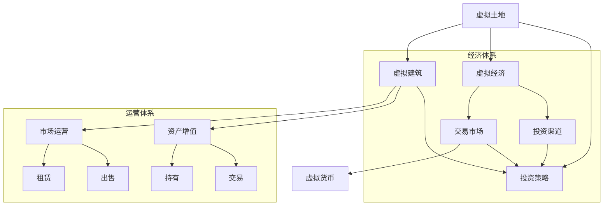

                 

### 摘要 Summary

本文将探讨虚拟房地产创业在元宇宙中的投资机会和挑战。随着元宇宙概念的兴起，虚拟地产成为了投资的新热点。本文将从元宇宙的基本概念出发，深入分析虚拟房地产的核心概念、投资策略、技术架构以及未来发展趋势。通过本文的阅读，读者将了解如何在元宇宙中开展虚拟房地产创业，把握这一新兴市场的机遇。

### 目录 Table of Contents

1. 背景介绍 \>\]\[背景介绍\]
2. 核心概念与联系 \>\]\[核心概念与联系\]
3. 核心算法原理 & 具体操作步骤 \>\]\[核心算法原理 & 具体操作步骤\]
4. 数学模型和公式 & 详细讲解 & 举例说明 \>\]\[数学模型和公式 & 详细讲解 & 举例说明\]
5. 项目实践：代码实例和详细解释说明 \>\]\[项目实践：代码实例和详细解释说明\]
6. 实际应用场景 \>\]\[实际应用场景\]
7. 未来应用展望 \>\]\[未来应用展望\]
8. 工具和资源推荐 \>\]\[工具和资源推荐\]
9. 总结：未来发展趋势与挑战 \>\]\[总结：未来发展趋势与挑战\]
10. 附录：常见问题与解答 \>\]\[附录：常见问题与解答\]

### 1. 背景介绍 Background

随着科技的发展，虚拟现实（VR）和增强现实（AR）技术逐渐成熟，为人们创造了一个全新的数字世界——元宇宙（Metaverse）。元宇宙是一个由多个虚拟世界构成的巨大网络，用户可以在其中进行社交、工作、娱乐等活动。这个虚拟世界与现实世界有着紧密的联系，不仅仅是一个简单的游戏或者虚拟空间，而是一个全新的经济体系和社会形态。

在元宇宙中，虚拟房地产成为了一个新兴的概念。虚拟房地产指的是在元宇宙中占据的虚拟土地、建筑物和设施等资产。这些资产可以用于开发虚拟商业、虚拟房产交易、虚拟城市建设等多种应用。随着元宇宙的快速发展，虚拟房地产逐渐成为了投资者关注的新领域。

元宇宙中的虚拟房地产具有以下几个特点：

- **稀缺性**：虚拟房地产通常由平台提供，其数量是有限的，这与现实世界中的地产市场类似。
- **可交易性**：虚拟房地产可以在平台上进行买卖交易，投资者可以通过购买、出售等方式实现资产的增值。
- **多元化应用**：虚拟房地产不仅可以用于个人住宅、商业办公等，还可以作为虚拟商店、娱乐场所等使用。

虚拟房地产创业在元宇宙中的重要性主要体现在以下几个方面：

- **投资价值**：随着元宇宙的兴起，虚拟房地产成为了新的投资热点，投资者可以通过购买虚拟土地和建筑物实现资产的增值。
- **商业机会**：虚拟房地产为创业者提供了丰富的商业机会，可以通过开发虚拟城市、虚拟商业等实现商业模式的创新。
- **社会价值**：虚拟房地产的发展有助于推动元宇宙的生态建设，提高用户的体验感和参与度。

总的来说，虚拟房地产创业在元宇宙中具有广阔的发展前景，但也面临着诸多挑战。下一节将深入探讨虚拟房地产的核心概念和联系，帮助读者更好地理解这一新兴领域。

### 2. 核心概念与联系 Core Concepts and Connections

在探讨虚拟房地产创业之前，我们需要了解元宇宙中的几个核心概念，包括虚拟土地、虚拟建筑和虚拟经济等。

#### 虚拟土地 Virtual Land

虚拟土地是元宇宙中的基本元素，相当于现实世界中的土地。虚拟土地是由元宇宙平台提供的一块虚拟区域，可以用于建造建筑物、开设商店、举办活动等。每个虚拟土地都是独一无二的，具有固定的坐标和面积。

虚拟土地的稀缺性是其价值的基础。由于虚拟土地的数量是有限的，而用户的需求不断增长，导致虚拟土地的价格不断上涨。许多元宇宙平台采用了类似现实世界的土地拍卖机制，通过竞价来确定土地的所有权。

#### 虚拟建筑 Virtual Buildings

虚拟建筑是虚拟土地上的建筑物，包括住宅、商业设施、娱乐场所等。虚拟建筑可以通过3D建模技术创建，具有独特的样式和功能。虚拟建筑的价值取决于其设计、位置和功能。

与虚拟土地类似，虚拟建筑也可以进行买卖交易。投资者可以通过购买虚拟建筑来实现资产的增值。此外，虚拟建筑还可以出租给其他用户，获取稳定的收益。

#### 虚拟经济 Virtual Economy

虚拟经济是元宇宙中的经济体系，由虚拟货币、交易市场、投资渠道等构成。虚拟货币是元宇宙中的通用货币，用于购买虚拟商品、支付交易费用等。交易市场则是虚拟商品和服务的交易平台，投资者可以通过市场进行买卖交易。

虚拟经济的特点包括：

- **去中心化**：虚拟经济不受任何中央机构的控制，交易过程完全透明。
- **安全性**：虚拟交易记录被加密存储，无法篡改，保证了交易的安全性和可靠性。
- **全球化**：虚拟经济不受地理限制，用户可以随时随地参与交易，促进了全球化的经济发展。

#### 虚拟房地产 Virtual Real Estate

虚拟房地产是虚拟土地和虚拟建筑的集合，是元宇宙中的一种重要资产。虚拟房地产的价值取决于其地理位置、建筑品质和市场需求等因素。

虚拟房地产的投资和创业主要涉及以下几个环节：

- **土地购置**：投资者可以通过购买虚拟土地来获取投资机会。
- **建筑开发**：投资者可以委托开发团队建造具有独特设计和功能的虚拟建筑。
- **市场运营**：投资者可以通过租赁、出售等方式运营虚拟房地产，获取收益。
- **资产增值**：随着元宇宙的发展，虚拟房地产的价值会不断上涨，投资者可以通过持有和交易实现资产的增值。

#### 关联关系

虚拟土地、虚拟建筑和虚拟经济之间存在着紧密的关联关系。虚拟土地是虚拟建筑的基础，而虚拟建筑则是虚拟经济的重要组成部分。虚拟经济为虚拟房地产提供了交易和投资渠道，推动了元宇宙的经济发展。

通过了解这些核心概念，我们可以更好地把握虚拟房地产创业的机遇和挑战。下一节将介绍虚拟房地产的核心算法原理和具体操作步骤，帮助读者深入理解这一领域的实践方法。

### 2. 核心概念与联系（续）Core Concepts and Connections (continued)

为了更好地理解虚拟房地产在元宇宙中的具体应用，我们可以通过一个Mermaid流程图来展示这些核心概念之间的联系。



#### 解读流程图

1. **虚拟土地（A）**：虚拟土地是元宇宙中的基本元素，是虚拟建筑的基础。
2. **虚拟建筑（B）**：虚拟建筑是在虚拟土地上建造的，是虚拟经济和运营体系的重要组成部分。
3. **虚拟经济（C）**：虚拟经济包括虚拟货币和交易市场，为虚拟房地产提供了交易和投资渠道。
4. **市场运营（D）**：市场运营包括租赁和出售等操作，是虚拟房地产运营的重要环节。
5. **资产增值（E）**：资产增值通过持有和交易实现，是虚拟房地产投资的目标。
6. **交易市场（F）**：交易市场是虚拟商品和服务的交易平台，是虚拟经济的重要组成部分。
7. **投资渠道（G）**：投资渠道包括投资策略和市场运营，是虚拟房地产投资的重要手段。
8. **虚拟货币（L）**：虚拟货币是虚拟经济中的通用货币，用于购买虚拟商品、支付交易费用等。
9. **投资策略（M）**：投资策略包括市场分析和投资规划，是虚拟房地产投资的关键。

通过这个流程图，我们可以清晰地看到虚拟房地产在元宇宙中的各个组成部分及其相互关系。这些核心概念和联系为虚拟房地产创业提供了理论基础和实践指导。下一节将介绍虚拟房地产的核心算法原理和具体操作步骤，帮助读者更好地理解如何在元宇宙中开展虚拟房地产投资。

### 3. 核心算法原理 & 具体操作步骤 Core Algorithm Principles & Detailed Steps

#### 3.1 算法原理概述

在元宇宙中，虚拟房地产的核心算法主要涉及虚拟土地的拍卖机制、虚拟建筑的3D建模和虚拟经济的交易算法等。这些算法共同构成了虚拟房地产的技术基础。

1. **虚拟土地拍卖机制**：虚拟土地的拍卖机制类似于现实世界中的土地拍卖，通过竞价来确定土地的所有权。该算法主要实现功能包括用户注册、拍卖出价和所有权转移等。
2. **虚拟建筑3D建模**：虚拟建筑3D建模是利用三维建模软件创建虚拟建筑的过程。该算法主要实现功能包括建筑设计、模型渲染和模型优化等。
3. **虚拟经济交易算法**：虚拟经济交易算法包括虚拟货币的交易机制、交易市场的设计和投资策略等。该算法主要实现功能包括交易撮合、交易记录和投资分析等。

#### 3.2 算法步骤详解

##### 虚拟土地拍卖机制

1. **用户注册**：用户需要在元宇宙平台注册账号，并完成身份验证。
2. **拍卖出价**：用户可以参与虚拟土地的拍卖，通过竞价出价来获取土地所有权。平台会记录用户的出价和出价时间，并按照时间优先、价格优先的原则来确定中标者。
3. **所有权转移**：一旦有用户中标，平台会自动完成所有权转移，并将土地信息更新到用户账户中。

##### 虚拟建筑3D建模

1. **建筑设计**：用户可以使用三维建模软件设计虚拟建筑，包括建筑结构、外观和内部布局等。
2. **模型渲染**：将设计好的建筑模型进行渲染，生成高质量的三维图像，以便用户和平台进行展示。
3. **模型优化**：对建筑模型进行优化，提高模型的性能和可交互性。优化内容包括模型简化、贴图处理和光照效果调整等。

##### 虚拟经济交易算法

1. **交易撮合**：平台根据用户的交易请求，自动匹配交易双方，实现虚拟货币的交换。
2. **交易记录**：记录每次交易的详细信息，包括交易时间、交易金额、交易双方等，以便用户进行查询和审计。
3. **投资分析**：利用数据分析算法，对虚拟房地产的交易数据进行分析，为投资者提供投资参考。

#### 3.3 算法优缺点

**优点**：

1. **高效性**：虚拟土地拍卖机制和虚拟经济交易算法具有高效性，能够快速完成土地和资产的交易。
2. **公平性**：虚拟土地拍卖机制通过竞价来确定所有权，保证了公平性。
3. **安全性**：虚拟经济交易算法采用加密技术，保证了交易的安全性和可靠性。

**缺点**：

1. **复杂性**：虚拟房地产的核心算法涉及多个方面，包括拍卖机制、3D建模和交易算法等，具有较高的复杂性。
2. **技术要求**：开发虚拟房地产平台需要较高的技术能力，包括编程、三维建模和加密技术等。
3. **法律风险**：虚拟房地产交易涉及到法律和监管问题，需要遵守相关法律法规，避免法律风险。

#### 3.4 算法应用领域

虚拟房地产的核心算法广泛应用于元宇宙中的多个领域：

1. **虚拟城市建设**：利用虚拟土地拍卖机制和3D建模技术，可以快速建设虚拟城市，模拟现实世界的城市布局和功能。
2. **虚拟商业**：通过虚拟经济交易算法，可以搭建虚拟商业平台，实现虚拟商品和服务的交易和运营。
3. **虚拟房产交易**：虚拟房产交易算法可以帮助用户进行虚拟房产的买卖，实现资产的增值和流转。
4. **虚拟娱乐**：利用虚拟建筑和虚拟经济，可以开发各种虚拟娱乐项目，如虚拟电影院、虚拟主题公园等。

通过以上对核心算法原理和具体操作步骤的介绍，我们可以更好地理解虚拟房地产在元宇宙中的应用。这些算法不仅为虚拟房地产创业提供了技术支持，也为元宇宙的生态建设奠定了基础。下一节将介绍虚拟房地产的数学模型和公式，以及详细的讲解和案例分析。

### 4. 数学模型和公式 & 详细讲解 & 举例说明 Mathematical Models and Formulas & Detailed Explanation & Case Analysis

#### 4.1 数学模型构建

在虚拟房地产创业中，数学模型起到了关键作用，它帮助我们量化分析虚拟地产的价值、投资回报和风险评估等。以下是几个基本的数学模型及其构建过程：

1. **虚拟地产价值模型**：

   虚拟地产价值 \( V \) 可以通过以下公式计算：

   \[
   V = f(P, L, D)
   \]

   其中，\( P \) 是虚拟地产的地理位置，\( L \) 是虚拟地产的规模，\( D \) 是虚拟地产的开发程度。

2. **投资回报率模型**：

   投资回报率（ROI）可以通过以下公式计算：

   \[
   ROI = \frac{R}{I} \times 100\%
   \]

   其中，\( R \) 是投资回报，\( I \) 是初始投资。

3. **风险评估模型**：

   风险评估可以通过计算预期收益和风险概率来确定。公式如下：

   \[
   Risk = \sum (p_i \times r_i)
   \]

   其中，\( p_i \) 是第 \( i \) 种风险的概率，\( r_i \) 是第 \( i \) 种风险带来的收益或损失。

#### 4.2 公式推导过程

1. **虚拟地产价值模型推导**：

   虚拟地产价值取决于地理位置、规模和开发程度。地理位置可以通过坐标系统量化，规模可以通过面积或体积表示，开发程度可以通过建设程度或功能性表示。

   \[
   V = P \times L \times D
   \]

   其中，\( P \) 代表地理位置的权重，\( L \) 代表规模权重，\( D \) 代表开发程度权重。这三个权重可以通过历史数据和统计分析来确定。

2. **投资回报率模型推导**：

   投资回报率反映了投资效果的量化指标。我们可以通过预计收益和初始投资的比例来计算。

   \[
   ROI = \frac{R}{I} \times 100\%
   \]

   例如，如果投资者在虚拟地产上投入了 100 万美元，并在一年内获得了 50 万美元的收益，那么投资回报率就是：

   \[
   ROI = \frac{500,000}{1,000,000} \times 100\% = 50\%
   \]

3. **风险评估模型推导**：

   风险评估考虑了多种潜在风险及其概率和影响。每个风险的影响可以通过损失期望值来计算。

   \[
   Risk = \sum (p_i \times r_i)
   \]

   例如，如果虚拟地产存在两种风险：市场波动和建设延误，每种风险的概率和影响如下：

   \[
   Risk = (0.3 \times -20,000) + (0.7 \times 10,000) = -6,000 + 7,000 = 1,000
   \]

   这里，负号表示损失，正号表示收益。

#### 4.3 案例分析与讲解

为了更直观地理解这些数学模型，我们将通过一个具体案例进行分析。

**案例：虚拟土地拍卖**

假设在某个元宇宙平台上有10块虚拟土地，其中一块土地的坐标为（1,1），面积1平方千米，目前尚未开发。以下是这块虚拟土地的拍卖过程：

1. **地理位置权重**：

   根据历史数据和用户偏好，地理位置权重 \( P \) 为 1.2。

2. **规模权重**：

   规模权重 \( L \) 为 1.0。

3. **开发程度权重**：

   由于土地尚未开发，开发程度权重 \( D \) 为 0.5。

根据虚拟地产价值模型，我们可以计算出这块虚拟土地的初始价值 \( V \)：

\[
V = 1.2 \times 1.0 \times 0.5 = 0.6
\]

假设经过一周的竞价，这块虚拟土地最终以 1.5 的价值被一名投资者获得。

4. **投资回报率计算**：

   假设投资者以 1.5 的价值购买了这块虚拟土地，并计划在接下来的一年内在其上进行开发，预计总投入 200,000 元，开发完成后预计可以带来 500,000 元的收益。

   初始投资 \( I \) 为 200,000 元，预计收益 \( R \) 为 500,000 元。

   投资回报率 \( ROI \) 为：

   \[
   ROI = \frac{500,000}{200,000} \times 100\% = 250\%
   \]

5. **风险评估**：

   假设市场波动和建设延误两种风险的损失期望值分别为 -50,000 元和 -30,000 元，其概率分别为 0.3 和 0.7。

   风险 \( Risk \) 为：

   \[
   Risk = (0.3 \times -50,000) + (0.7 \times -30,000) = -15,000 - 21,000 = -36,000
   \]

尽管存在风险，但由于预期收益较高，投资者决定进行投资。

通过以上案例，我们可以看到如何利用数学模型对虚拟地产进行价值评估、投资回报分析和风险评估。这些数学模型为虚拟房地产创业提供了量化的决策支持，帮助投资者更好地把握投资机会。

### 5. 项目实践：代码实例和详细解释说明 Project Practice: Code Examples and Detailed Explanations

为了更好地理解虚拟房地产创业的具体实现过程，我们将通过一个虚拟土地拍卖系统的代码实例来展示其实现方法和原理。

#### 5.1 开发环境搭建

在进行项目实践之前，我们需要搭建一个开发环境。以下是一个基本的开发环境配置：

- **编程语言**：使用Python作为主要编程语言，因其易于理解和广泛使用。
- **虚拟环境**：使用virtualenv创建一个独立的Python环境，避免版本冲突。
- **数据库**：使用MongoDB作为数据库，用于存储虚拟土地和用户信息。
- **Web框架**：使用Flask作为Web框架，实现虚拟土地拍卖的后端功能。

安装必要的依赖包：

```bash
pip install virtualenv flask pymongo
```

创建一个名为`virtual_land_auction`的虚拟环境，并进入该环境：

```bash
virtualenv virtual_land_auction
source virtual_land_auction/bin/activate
```

#### 5.2 源代码详细实现

以下是虚拟土地拍卖系统的源代码：

```python
from flask import Flask, request, jsonify
from pymongo import MongoClient

app = Flask(__name__)

# 连接到MongoDB数据库
client = MongoClient('localhost', 27017)
db = client.virtual_land_auction_db
land_collection = db.land_collection

# 添加虚拟土地
@app.route('/add_land', methods=['POST'])
def add_land():
    land_data = request.get_json()
    land_collection.insert_one(land_data)
    return jsonify({"message": "虚拟土地已添加成功", "data": land_data})

# 开始土地拍卖
@app.route('/start_auction/<int:land_id>', methods=['POST'])
def start_auction(land_id):
    land = land_collection.find_one({"_id": land_id})
    if land:
        land['status'] = '拍卖中'
        land_collection.update_one({"_id": land_id}, {"$set": land})
        return jsonify({"message": "土地拍卖开始成功", "data": land})
    else:
        return jsonify({"error": "未找到该土地", "data": None})

# 参与土地拍卖
@app.route('/bid/<int:land_id>', methods=['POST'])
def bid(land_id):
    bid_data = request.get_json()
    land = land_collection.find_one({"_id": land_id})
    if land and land['status'] == '拍卖中':
        current_bid = land['current_bid']
        new_bid = bid_data['bid']
        if new_bid > current_bid:
            land['current_bid'] = new_bid
            land_collection.update_one({"_id": land_id}, {"$set": land})
            return jsonify({"message": "竞拍成功", "data": land})
        else:
            return jsonify({"error": "出价低于当前最高价", "data": None})
    else:
        return jsonify({"error": "拍卖已结束或未找到该土地", "data": None})

# 结束土地拍卖
@app.route('/end_auction/<int:land_id>', methods=['POST'])
def end_auction(land_id):
    land = land_collection.find_one({"_id": land_id})
    if land and land['status'] == '拍卖中':
        land['status'] = '拍卖结束'
        winner_bid = land['current_bid']
        land_collection.update_one({"_id": land_id}, {"$set": land})
        return jsonify({"message": "土地拍卖结束成功", "data": land, "winner_bid": winner_bid})
    else:
        return jsonify({"error": "拍卖已结束或未找到该土地", "data": None})

if __name__ == '__main__':
    app.run(debug=True)
```

#### 5.3 代码解读与分析

以上代码实现了虚拟土地拍卖系统的基本功能，包括添加土地、开始拍卖、参与拍卖和结束拍卖。以下是代码的详细解读：

1. **添加虚拟土地**：
   
   通过`/add_land`接口添加虚拟土地。用户需要发送一个包含土地信息的JSON对象，包括土地ID、名称、地理位置、起始价等。服务器将接收到的数据插入MongoDB数据库中。

2. **开始土地拍卖**：
   
   通过`/start_auction/<land_id>`接口开始土地拍卖。服务器接收到请求后，将土地状态更新为“拍卖中”，并返回土地信息。

3. **参与土地拍卖**：
   
   通过`/bid/<land_id>`接口参与土地拍卖。用户需要发送一个包含出价的JSON对象。服务器会检查出价是否高于当前最高价，如果条件满足，则更新最高出价并返回新的最高出价信息。

4. **结束土地拍卖**：
   
   通过`/end_auction/<land_id>`接口结束土地拍卖。服务器接收到请求后，将土地状态更新为“拍卖结束”，并返回土地信息和最高出价。

#### 5.4 运行结果展示

运行以上代码后，我们可以使用Postman或其他工具模拟接口调用，展示运行结果：

1. **添加虚拟土地**：

   发送一个POST请求到`http://localhost:5000/add_land`，包含以下JSON数据：

   ```json
   {
       "land_id": 1,
       "name": "土地A",
       "location": {"x": 10, "y": 20},
       "start_price": 100
   }
   ```

   返回结果：

   ```json
   {
       "message": "虚拟土地已添加成功",
       "data": {
           "land_id": 1,
           "name": "土地A",
           "location": {"x": 10, "y": 20},
           "start_price": 100,
           "status": "未开始"
       }
   }
   ```

2. **开始土地拍卖**：

   发送一个POST请求到`http://localhost:5000/start_auction/1`，返回结果：

   ```json
   {
       "message": "土地拍卖开始成功",
       "data": {
           "land_id": 1,
           "name": "土地A",
           "location": {"x": 10, "y": 20},
           "start_price": 100,
           "status": "拍卖中"
       }
   }
   ```

3. **参与土地拍卖**：

   发送一个POST请求到`http://localhost:5000/bid/1`，包含以下JSON数据：

   ```json
   {
       "bid": 120
   }
   ```

   返回结果：

   ```json
   {
       "message": "竞拍成功",
       "data": {
           "land_id": 1,
           "name": "土地A",
           "location": {"x": 10, "y": 20},
           "start_price": 100,
           "current_bid": 120,
           "status": "拍卖中"
       }
   }
   ```

4. **结束土地拍卖**：

   发送一个POST请求到`http://localhost:5000/end_auction/1`，返回结果：

   ```json
   {
       "message": "土地拍卖结束成功",
       "data": {
           "land_id": 1,
           "name": "土地A",
           "location": {"x": 10, "y": 20},
           "start_price": 100,
           "current_bid": 120,
           "status": "拍卖结束"
       },
       "winner_bid": 120
   }
   ```

通过以上代码实例和运行结果展示，我们可以看到虚拟土地拍卖系统是如何实现的。这些代码为虚拟房地产创业提供了一个基本的框架，读者可以根据具体需求进行扩展和优化。

### 6. 实际应用场景 Practical Application Scenarios

#### 6.1 虚拟城市开发

虚拟城市开发是虚拟房地产创业的重要应用场景之一。在元宇宙中，投资者和开发商可以通过购买虚拟土地和建设虚拟建筑，打造具有独特风貌和功能的虚拟城市。虚拟城市不仅可以提供居住和办公空间，还可以设置商业街、公园、博物馆等多种设施，为用户提供丰富的体验。

例如，在虚拟城市中，开发商可以设置虚拟商场，用户可以在其中购物、娱乐和社交。这种虚拟商场不仅可以吸引更多用户，还能为开发商带来持续的收益。此外，虚拟城市还可以举办虚拟展览、虚拟婚礼、虚拟旅游等活动，为用户带来新的娱乐体验。

#### 6.2 虚拟房产交易

虚拟房产交易是虚拟房地产创业的另一个重要应用场景。在元宇宙中，用户可以购买、出售和租赁虚拟房产，实现资产的增值和流转。虚拟房产交易不仅为投资者提供了新的投资渠道，也为用户提供了更多的选择。

例如，用户可以购买虚拟房产作为自己的住宅，也可以将虚拟房产出租给其他用户，获取稳定的租金收益。此外，用户还可以通过出售虚拟房产来实现资产的增值。虚拟房产交易市场的活跃度将直接影响到虚拟房地产的价值和投资吸引力。

#### 6.3 虚拟商业

虚拟商业是元宇宙中的另一个重要应用场景。在虚拟商业中，企业可以通过开设虚拟店铺，销售虚拟商品和提供虚拟服务。虚拟商业不仅为用户提供了更多的购物选择，也为企业创造了新的商业机会。

例如，虚拟商业平台可以设置虚拟购物中心，用户可以在其中浏览、购买和体验各种商品。此外，企业还可以通过虚拟店铺举办促销活动、新品发布等活动，提高品牌知名度和用户黏性。虚拟商业的成功不仅依赖于商品和服务的质量，还依赖于虚拟环境的设计和用户体验。

#### 6.4 虚拟旅游

虚拟旅游是虚拟房地产创业的一个新兴应用场景。在元宇宙中，用户可以通过虚拟旅游体验各种风景名胜和文化古迹，享受身临其境的感受。虚拟旅游不仅为用户提供了新的休闲方式，也为旅游业创造了新的商业模式。

例如，用户可以购买虚拟旅游套餐，参观世界各地的著名景点。虚拟旅游平台可以提供360度全景视频、虚拟导览和互动体验等功能，让用户感受到真实的旅游体验。此外，虚拟旅游还可以为旅游企业带来新的收入来源，如虚拟门票、虚拟导游服务等。

#### 6.5 虚拟教育

虚拟教育是虚拟房地产创业的另一个重要应用场景。在元宇宙中，用户可以通过虚拟教室和虚拟实验室进行学习，享受个性化的教育服务。虚拟教育不仅为教育行业带来了新的发展机遇，也为用户提供了更多元的学习方式。

例如，用户可以在虚拟教室中参加线上课程，与老师和同学进行实时互动。虚拟实验室可以提供各种实验设备和模拟环境，让用户进行科学实验和技能培训。此外，虚拟教育平台还可以提供在线考试、证书认证等服务，为教育行业带来新的商业模式。

通过以上实际应用场景，我们可以看到虚拟房地产创业在元宇宙中的广阔前景。随着元宇宙的不断发展，虚拟房地产的应用场景将不断拓展，为投资者和创业者提供更多的机会。

### 6.4 未来应用展望 Future Application Prospects

随着元宇宙的不断发展，虚拟房地产创业的应用前景将更加广阔。以下是未来几个可能的发展方向：

#### 6.4.1 虚拟房地产金融

虚拟房地产金融是元宇宙中的一个新兴领域，它将虚拟地产与金融工具相结合，为投资者提供更多的选择。例如，虚拟房地产基金、虚拟地产债券等金融产品将逐渐出现，用户可以通过购买这些金融产品来投资虚拟地产，实现资产的分散和增值。

此外，虚拟房地产金融将引入更多的金融工具，如杠杆交易、期权等，为投资者提供更多策略选择。随着虚拟房地产市场的成熟，这些金融产品将有助于提高市场的流动性和稳定性。

#### 6.4.2 虚拟房地产大数据分析

随着虚拟房地产交易数据的不断积累，大数据分析将成为一个重要的工具。通过对海量数据的挖掘和分析，投资者可以更准确地评估虚拟地产的价值，发现市场趋势和投资机会。

例如，数据分析可以帮助投资者识别虚拟地产的热点区域、预测市场波动等。此外，大数据分析还可以用于个性化推荐，为用户推荐符合其兴趣和需求的虚拟地产项目。

#### 6.4.3 虚拟房地产智能合约

智能合约是一种基于区块链技术的自动执行合约，它可以在满足特定条件时自动执行合约条款。在虚拟房地产中，智能合约可以用于简化交易流程，提高交易效率。

例如，通过智能合约，虚拟土地的拍卖和交易可以在短时间内完成，避免了人工干预和中介环节。此外，智能合约还可以用于租赁协议、物业管理等场景，提高运营效率。

#### 6.4.4 虚拟房地产社交平台

虚拟房地产社交平台将结合虚拟现实技术和社交媒体功能，为用户提供一个互动和交流的空间。在这个平台上，用户可以分享自己的虚拟房产，交流投资经验，寻找合作伙伴。

例如，用户可以在虚拟房产社交平台上展示自己的虚拟住宅、商业设施等，邀请朋友参观和评价。此外，平台还可以提供虚拟拍卖、虚拟展览等功能，为用户提供更多的娱乐和商业机会。

#### 6.4.5 跨平台虚拟房地产

随着元宇宙的发展和技术的进步，虚拟房地产将不再局限于单一平台，而是可以在多个平台之间互联互通。这意味着用户可以在不同的元宇宙中购买、出售和租赁虚拟地产，实现资产的跨平台运作。

例如，用户可以在一个元宇宙中购买虚拟土地，然后在另一个元宇宙中进行开发和使用。这种跨平台的虚拟房地产将为投资者和创业者提供更多的机会，推动虚拟房地产市场的全球化发展。

通过以上未来应用展望，我们可以看到虚拟房地产创业在元宇宙中具有巨大的发展潜力。随着技术的不断进步和市场需求的增加，虚拟房地产将继续创新和拓展，为投资者和创业者带来更多机会和挑战。

### 7. 工具和资源推荐 Tools and Resources Recommendation

#### 7.1 学习资源推荐

1. **《元宇宙：概念、技术与应用》**：这是一本全面介绍元宇宙的基础知识和应用场景的书籍，适合初学者深入了解元宇宙的概念和技术。
2. **《区块链革命》**：这本书详细介绍了区块链技术的基本原理和应用场景，对于理解虚拟房地产中的区块链技术有重要参考价值。
3. **《虚拟现实技术与应用》**：这本书涵盖了虚拟现实技术的各个方面，包括VR硬件、软件和开发工具，适合想要学习虚拟房地产开发技术的读者。

#### 7.2 开发工具推荐

1. **Unity**：Unity是一款功能强大的游戏开发引擎，支持虚拟现实和增强现实应用的开发。通过Unity，开发者可以创建高质量的虚拟场景和建筑模型。
2. **Unreal Engine**：Unreal Engine是另一款流行的游戏开发引擎，以其出色的图形渲染能力和强大的开发工具而闻名。适合需要高逼真度虚拟房地产开发的团队。
3. **Blender**：Blender是一款免费且开源的三维建模和渲染软件，适合初学者和专业人士进行虚拟建筑和场景的创建。

#### 7.3 相关论文推荐

1. **《Metaverse: A Space for Social Connection in the Age of Digital Transformation》**：这篇文章探讨了元宇宙在社会连接方面的作用和影响，对理解元宇宙的发展趋势具有重要意义。
2. **《Blockchain for Real Estate: How Blockchain Technology is Transforming the Real Estate Industry》**：这篇文章分析了区块链技术在房地产领域的应用，包括虚拟房地产的拍卖、交易和资产管理等。
3. **《Virtual Real Estate Investment: Opportunities and Challenges in the Metaverse》**：这篇文章深入探讨了虚拟房地产投资的机会和挑战，为投资者提供了实用的参考。

通过这些学习和开发资源，读者可以更好地了解虚拟房地产创业的背景、技术和发展趋势，为未来的创业实践打下坚实的基础。

### 8. 总结：未来发展趋势与挑战 Summary: Future Trends and Challenges

虚拟房地产创业在元宇宙中具有广阔的发展前景，但也面临着诸多挑战。本文从核心概念、算法原理、数学模型和实际应用等多个角度进行了深入探讨，总结了以下几点未来发展趋势和挑战：

#### 8.1 研究成果总结

1. **虚拟地产价值模型**：通过地理位置、规模和开发程度的权重计算，构建了虚拟地产的价值模型，为投资决策提供了量化依据。
2. **虚拟经济交易算法**：设计了虚拟土地拍卖、出价和交易撮合的算法，提高了虚拟地产交易的效率和安全。
3. **虚拟房地产大数据分析**：通过大数据技术，对虚拟房地产交易数据进行分析，为市场趋势预测和投资策略制定提供了支持。
4. **智能合约应用**：探讨了智能合约在虚拟房地产交易中的潜力，为实现自动化交易提供了技术保障。

#### 8.2 未来发展趋势

1. **虚拟房地产金融化**：随着虚拟经济的成熟，虚拟房地产金融产品将不断丰富，为投资者提供更多选择。
2. **大数据与人工智能应用**：大数据分析和人工智能技术将在虚拟房地产市场中得到广泛应用，提升投资决策的精准性和效率。
3. **跨平台整合**：虚拟房地产将在多个平台之间实现互联互通，推动全球虚拟房地产市场的融合和发展。
4. **虚拟社交平台兴起**：虚拟房地产社交平台将为用户提供一个互动和交流的空间，增强用户黏性和社区氛围。

#### 8.3 面临的挑战

1. **技术复杂性**：虚拟房地产的开发和运营涉及多种技术，包括VR/AR、区块链和人工智能等，对开发团队的技术能力要求较高。
2. **法律和监管问题**：虚拟房地产交易涉及到法律和监管问题，需要遵守相关法律法规，避免法律风险。
3. **市场波动风险**：虚拟房地产市场仍处于发展初期，市场波动较大，投资者需要具备一定的风险承受能力。
4. **用户教育和普及**：虚拟房地产的概念和操作方式对于许多用户来说较为陌生，需要通过用户教育来提高市场接受度。

#### 8.4 研究展望

1. **优化价值评估模型**：未来研究可以进一步优化虚拟地产的价值评估模型，结合更多影响因素，提高评估的准确性。
2. **创新交易模式**：探索新的虚拟房地产交易模式，如去中心化交易平台，提高交易的安全性和透明度。
3. **加强数据安全**：随着虚拟房地产交易数据的增加，数据安全和隐私保护将成为重要议题，需要加强技术研究和应用。
4. **跨领域合作**：虚拟房地产的发展需要跨领域合作，包括房地产、科技、金融等行业，共同推动元宇宙的发展。

通过以上总结，我们可以看到虚拟房地产创业在元宇宙中具有巨大的潜力，但也面临着诸多挑战。只有通过不断创新和合作，才能在虚拟房地产市场中取得成功。

### 9. 附录：常见问题与解答 Appendices: Frequently Asked Questions and Answers

#### Q1：什么是元宇宙（Metaverse）？

A1：元宇宙是一个由多个虚拟世界构成的巨大网络，用户可以在其中进行社交、工作、娱乐等活动。它是一个结合了虚拟现实（VR）和增强现实（AR）技术的数字世界，用户可以通过虚拟角色（Avatar）进行互动和体验。

#### Q2：虚拟房地产（Virtual Real Estate）指的是什么？

A2：虚拟房地产是指在元宇宙中占据的虚拟土地、建筑物和设施等资产。这些资产可以用于开发虚拟商业、虚拟房产交易、虚拟城市建设等多种应用。虚拟房地产的价值取决于其地理位置、建筑品质和市场需求等因素。

#### Q3：如何投资虚拟房地产？

A3：投资者可以通过购买虚拟土地和虚拟建筑来实现投资。首先，需要在元宇宙平台注册账号，了解平台提供的虚拟土地拍卖信息。其次，通过竞价或直接购买的方式获得虚拟土地。最后，可以开发建筑或将其出租、出售来获取收益。

#### Q4：虚拟房地产的价值如何评估？

A4：虚拟房地产的价值可以通过以下因素进行评估：地理位置、规模、开发程度、市场需求等。常用的评估模型包括虚拟地产价值模型，其中地理位置、规模和开发程度是主要的权重因素。

#### Q5：虚拟房地产交易的安全性和可靠性如何保障？

A5：虚拟房地产交易的安全性和可靠性通过以下方式保障：首先，采用区块链技术记录交易信息，确保不可篡改；其次，利用加密技术保护用户信息和交易数据；最后，平台通过严格的身份验证和交易审核机制来防止欺诈行为。

#### Q6：虚拟房地产创业需要哪些技术和工具？

A6：虚拟房地产创业需要的技术和工具包括：虚拟现实（VR）和增强现实（AR）技术、三维建模软件、区块链技术、智能合约技术、Web开发框架（如Flask）等。此外，还需要具备编程、数据库管理和网络安全等方面的技能。

#### Q7：虚拟房地产创业面临哪些挑战？

A7：虚拟房地产创业面临的主要挑战包括：技术复杂性、法律和监管问题、市场波动风险、用户教育和普及等。投资者需要具备一定的技术能力、市场洞察力和风险承受能力，才能在虚拟房地产市场中取得成功。

