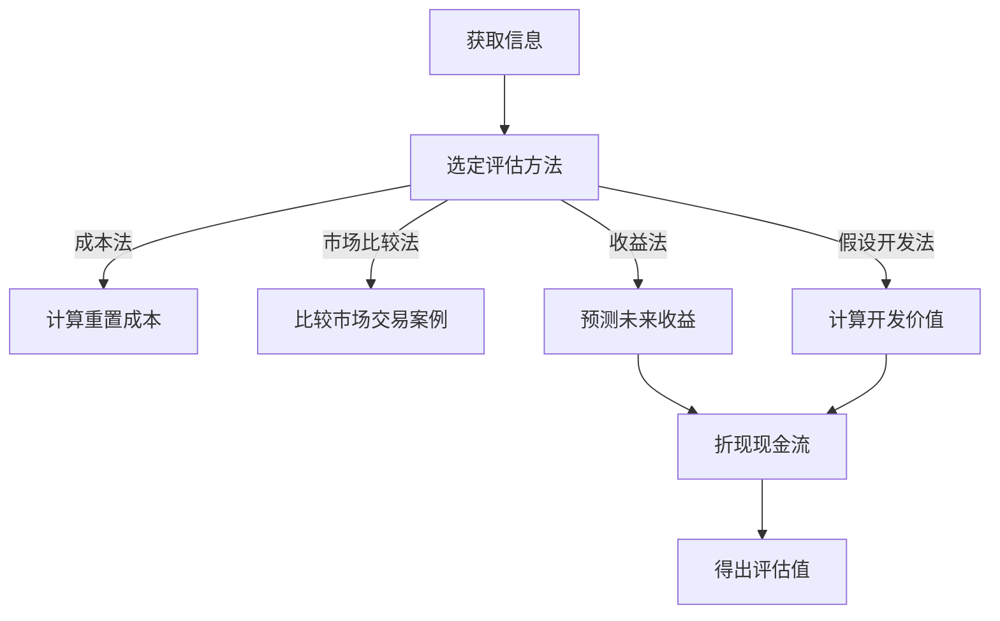

                 

关键词：虚拟房地产评估、元宇宙、资产价值、衡量标准、技术分析

摘要：随着元宇宙概念的逐渐兴起，虚拟房地产作为一种新兴资产形式，其价值和评估方法引发了广泛关注。本文旨在探讨虚拟房地产评估的关键概念、方法和未来趋势，为元宇宙资产的合理评估提供理论支持和实践指导。

## 1. 背景介绍

随着互联网技术的飞速发展，虚拟世界逐渐从科幻小说和电影场景中走进现实。元宇宙（Metaverse）作为一个集成了虚拟现实、增强现实、区块链技术等元素的虚拟空间，已成为新一代数字经济发展的热点。在元宇宙中，虚拟房地产成为一种独特的资产形式，不仅包括虚拟土地、建筑和房地产交易，还涉及到虚拟装修、房产租赁、物业管理等各个方面。

虚拟房地产的价值评估对于元宇宙的发展至关重要。它不仅为房地产投资者提供参考，还为虚拟世界的治理和经济发展奠定基础。与传统房地产相比，虚拟房地产的价值评估面临更多挑战和不确定性。因此，研究和制定科学合理的评估方法具有重要意义。

## 2. 核心概念与联系

### 2.1 虚拟房地产

虚拟房地产指的是在元宇宙中占据一定空间并具有商业价值的虚拟土地、建筑和房产。它通常通过区块链技术进行确权和交易，具有去中心化、透明性和不可篡改的特点。

### 2.2 元宇宙资产

元宇宙资产是指元宇宙中各种可交易和可转移的虚拟物品，包括虚拟房地产、虚拟商品、虚拟货币等。这些资产在元宇宙中具有实际经济价值，并通过区块链技术实现安全交易。

### 2.3 评估方法

虚拟房地产评估方法主要包括市场比较法、收益法、成本法和假设开发法等。每种方法都有其适用场景和优缺点，需要根据具体情况选择。

### 2.4 Mermaid 流程图

以下是一个简化的虚拟房地产评估流程图：



## 3. 核心算法原理 & 具体操作步骤

### 3.1 算法原理概述

虚拟房地产评估的核心算法包括成本法、市场比较法、收益法和假设开发法。每种算法的基本原理如下：

- 成本法：基于重置成本来评估虚拟房地产的价值。
- 市场比较法：通过比较类似虚拟房地产的市场交易案例来评估价值。
- 收益法：根据虚拟房地产的未来收益预测来评估价值。
- 假设开发法：基于虚拟房地产的预期开发价值来评估。

### 3.2 算法步骤详解

#### 3.2.1 成本法

1. 计算重置成本：包括土地成本、建筑成本和装修成本等。
2. 考虑折旧：根据虚拟房地产的年龄和使用情况，计算折旧。
3. 得出评估值：重置成本减去折旧即为虚拟房地产的评估价值。

#### 3.2.2 市场比较法

1. 选择可比案例：寻找与评估对象相似的虚拟房地产交易案例。
2. 调整价格：根据交易案例的市场条件，调整评估对象的价格。
3. 得出评估值：调整后的价格即为评估价值。

#### 3.2.3 收益法

1. 预测未来收益：根据虚拟房地产的用途和市场需求，预测未来的租金收入或经营收益。
2. 折现现金流：将未来收益折现到当前时间。
3. 得出评估值：折现后的现金流即为评估价值。

#### 3.2.4 假设开发法

1. 预测开发价值：根据虚拟房地产的预期开发用途，预测开发后的价值。
2. 计算开发成本：包括土地购买成本、建筑成本和装修成本等。
3. 得出评估值：开发价值减去开发成本即为评估价值。

### 3.3 算法优缺点

- 成本法：简单易行，适用于新建虚拟房地产。但受限于市场信息获取难度，可能存在偏差。
- 市场比较法：基于市场数据，具有较高可信度。但市场波动大，可能影响评估结果的准确性。
- 收益法：考虑了未来收益，适用于长期投资。但预测未来收益存在不确定性。
- 假设开发法：基于预期开发价值，适用于开发性投资。但开发成本难以精确计算。

### 3.4 算法应用领域

- 成本法：适用于新建虚拟房地产的初步评估。
- 市场比较法：适用于成熟市场的虚拟房地产评估。
- 收益法：适用于长期持有和经营型虚拟房地产。
- 假设开发法：适用于开发型虚拟房地产项目。

## 4. 数学模型和公式 & 详细讲解 & 举例说明

### 4.1 数学模型构建

虚拟房地产评估的数学模型可以分为成本模型、市场模型、收益模型和开发模型。以下是这些模型的简要描述：

- 成本模型：\[ V = C - D \]
  - \( V \)：评估值
  - \( C \)：重置成本
  - \( D \)：折旧

- 市场模型：\[ V = a \times b \]
  - \( V \)：评估值
  - \( a \)：可比案例价格
  - \( b \)：调整系数

- 收益模型：\[ V = \sum_{t=1}^{n} \frac{R_t}{(1 + r)^t} \]
  - \( V \)：评估值
  - \( R_t \)：第 \( t \) 年的收益
  - \( r \)：折现率
  - \( n \)：收益期限

- 开发模型：\[ V = PV - C \]
  - \( V \)：评估值
  - \( PV \)：开发后价值
  - \( C \)：开发成本

### 4.2 公式推导过程

#### 成本模型推导

虚拟房地产的评估值可以通过计算重置成本减去折旧得到。假设重置成本为 \( C \)，折旧率为 \( d \)，虚拟房地产的年龄为 \( a \)，则折旧为 \( D = C \times d \times a \)。因此，评估值 \( V \) 为：

\[ V = C - D \]

#### 市场模型推导

市场模型通过比较类似虚拟房地产的市场交易案例来评估价值。假设可比案例价格为 \( a \)，调整系数为 \( b \)，则评估值 \( V \) 为：

\[ V = a \times b \]

#### 收益模型推导

收益模型基于未来收益的折现值。假设第 \( t \) 年的收益为 \( R_t \)，折现率为 \( r \)，收益期限为 \( n \)，则第 \( t \) 年的折现收益为 \( \frac{R_t}{(1 + r)^t} \)。总评估值 \( V \) 为这些折现收益的累加：

\[ V = \sum_{t=1}^{n} \frac{R_t}{(1 + r)^t} \]

#### 开发模型推导

开发模型基于开发后价值和开发成本的差额。假设开发后价值为 \( PV \)，开发成本为 \( C \)，则评估值 \( V \) 为：

\[ V = PV - C \]

### 4.3 案例分析与讲解

#### 案例一：成本模型应用

假设一个虚拟房地产的重置成本为 1000 元/平方米，折旧率为 2%，年龄为 5 年。则折旧为 \( 1000 \times 2\% \times 5 = 100 \) 元/平方米。评估值为 \( 1000 - 100 = 900 \) 元/平方米。

#### 案例二：市场模型应用

假设一个类似虚拟房地产的交易案例价格为 1500 元/平方米，调整系数为 0.8。则评估值为 \( 1500 \times 0.8 = 1200 \) 元/平方米。

#### 案例三：收益模型应用

假设一个虚拟房地产预计每年收益为 100 万元，折现率为 5%，收益期限为 10 年。则第 1 年的折现收益为 \( \frac{100}{(1 + 0.05)^1} = 95.24 \) 万元，第 2 年的折现收益为 \( \frac{100}{(1 + 0.05)^2} = 90.70 \) 万元，以此类推。总评估值为这些折现收益的累加：

\[ V = 95.24 + 90.70 + \ldots + \frac{100}{(1 + 0.05)^{10}} \approx 852.41 \] 万元。

#### 案例四：开发模型应用

假设一个虚拟房地产预期开发后的价值为 2000 万元，开发成本为 1500 万元。则评估值为 \( 2000 - 1500 = 500 \) 万元。

## 5. 项目实践：代码实例和详细解释说明

### 5.1 开发环境搭建

本文使用 Python 语言和 Jupyter Notebook 环境进行代码编写和运行。首先，确保安装了 Python 3.8 以上版本，然后安装以下依赖库：

```bash
pip install numpy pandas matplotlib
```

### 5.2 源代码详细实现

以下是一个简单的虚拟房地产评估代码示例：

```python
import numpy as np
import pandas as pd
import matplotlib.pyplot as plt

# 成本法评估
def cost_based_assessment(resale_price, age, depreciation_rate):
    cost = resale_price * age * depreciation_rate
    value = resale_price - cost
    return value

# 市场比较法评估
def market_comparison_based_assessment(case_price, adjustment_factor):
    value = case_price * adjustment_factor
    return value

# 收益法评估
def income_based_assessment(annual_income, discount_rate, duration):
    discounted_income = np.sum([(annual_income / (1 + discount_rate)**t) for t in range(1, duration + 1)])
    return discounted_income

# 假设开发法评估
def development_based_assessment(estimated_development_value, development_cost):
    value = estimated_development_value - development_cost
    return value

# 示例数据
resale_price = 1000
age = 5
depreciation_rate = 0.02
case_price = 1500
adjustment_factor = 0.8
annual_income = 1000000
discount_rate = 0.05
duration = 10
estimated_development_value = 20000000
development_cost = 15000000

# 评估结果
cost_value = cost_based_assessment(resale_price, age, depreciation_rate)
market_value = market_comparison_based_assessment(case_price, adjustment_factor)
income_value = income_based_assessment(annual_income, discount_rate, duration)
development_value = development_based_assessment(estimated_development_value, development_cost)

# 打印结果
print("成本法评估值：", cost_value)
print("市场比较法评估值：", market_value)
print("收益法评估值：", income_value)
print("假设开发法评估值：", development_value)
```

### 5.3 代码解读与分析

本代码示例实现了四种虚拟房地产评估方法，分别为成本法、市场比较法、收益法和假设开发法。每种方法都有自己的函数实现，通过输入不同的参数可以得到对应的评估结果。

- 成本法通过计算重置成本和折旧来评估价值。
- 市场比较法通过比较类似案例的价格来评估价值。
- 收益法通过预测未来收益并折现到当前时间来评估价值。
- 假设开发法通过计算开发后的价值和开发成本的差额来评估价值。

### 5.4 运行结果展示

运行上述代码后，会输出四种评估方法的结果。这些结果可以用于比较不同方法的评估结果，并选择最适合的方法进行虚拟房地产的价值评估。

## 6. 实际应用场景

虚拟房地产评估在元宇宙中有着广泛的应用场景。以下是几个典型应用场景：

1. **虚拟房地产交易**：在元宇宙中，虚拟房地产的买卖交易需要科学合理的评估。通过评估，可以为交易双方提供参考依据，确保交易公平合理。

2. **虚拟城市规划和建设**：虚拟城市的规划和建设需要考虑房地产的价值和分布。通过评估，可以为城市规划提供数据支持，优化城市布局和资源配置。

3. **虚拟企业运营**：在元宇宙中，企业可以租赁虚拟房地产进行运营。通过评估，可以为企业提供合理的租金定价策略，提高企业效益。

4. **虚拟房地产投资**：投资者可以通过对虚拟房地产的评估，判断其投资价值。选择具有潜力的虚拟房地产进行投资，实现财富增值。

5. **虚拟房地产税务**：在元宇宙中，虚拟房地产的税务问题也需要得到解决。通过评估，可以为税务部门提供科学合理的税收依据，确保税收公平。

## 7. 未来应用展望

随着元宇宙的不断发展，虚拟房地产评估的应用前景将更加广阔。以下是几个未来应用展望：

1. **智能化评估工具**：随着人工智能技术的发展，未来可以开发出更加智能化、自动化的评估工具。这些工具可以基于大数据和机器学习技术，提供更准确、更快速的评估结果。

2. **虚拟房地产金融**：虚拟房地产评估可以为虚拟房地产金融提供支持。通过科学合理的评估，可以降低金融风险，促进虚拟房地产的投融资活动。

3. **虚拟房地产市场规范化**：通过建立统一的虚拟房地产评估标准，可以规范虚拟房地产市场，提高市场透明度，促进市场的健康发展。

4. **虚拟房地产税收改革**：随着虚拟房地产的普及，传统的税收制度可能需要改革。通过科学合理的评估，可以为虚拟房地产的税收提供依据，实现税收公平。

## 8. 工具和资源推荐

### 8.1 学习资源推荐

- 《元宇宙：概念与实现》
- 《区块链技术指南》
- 《Python编程：从入门到实践》
- 《人工智能：一种现代方法》

### 8.2 开发工具推荐

- Jupyter Notebook
- PyCharm
- Visual Studio Code
- Truffle Suite

### 8.3 相关论文推荐

- "Metaverse: A Vision for the Future of Human-Computer Interaction"
- "Blockchain and the Metaverse: The Next Big Thing in Technology"
- "Virtual Real Estate and the Metaverse: Opportunities and Challenges"
- "A Comprehensive Survey of Metaverse Development and Applications"

## 9. 总结：未来发展趋势与挑战

虚拟房地产评估作为元宇宙发展的重要环节，其研究与实践具有重要意义。未来发展趋势包括智能化评估工具的开发、虚拟房地产金融的发展以及市场规范化等。然而，虚拟房地产评估也面临一些挑战，如数据隐私保护、评估标准的统一和市场监管等。只有克服这些挑战，才能实现虚拟房地产评估的科学化和规范化，为元宇宙的发展提供有力支持。

### 附录：常见问题与解答

1. **什么是元宇宙？**

   元宇宙是一个虚拟空间，融合了虚拟现实、增强现实、区块链技术等元素，用户可以在其中进行社交、娱乐、工作等活动。

2. **虚拟房地产评估有哪些方法？**

   虚拟房地产评估主要包括成本法、市场比较法、收益法和假设开发法。

3. **如何计算虚拟房地产的评估值？**

   虚拟房地产的评估值可以通过以下方法计算：

   - 成本法：重置成本减去折旧。
   - 市场比较法：可比案例价格乘以调整系数。
   - 收益法：未来收益的折现值。
   - 假设开发法：开发后价值减去开发成本。

4. **虚拟房地产评估在元宇宙中有什么应用？**

   虚拟房地产评估在元宇宙中应用于虚拟房地产交易、城市规划、企业运营、投资和税务等方面。

5. **虚拟房地产评估的未来发展趋势是什么？**

   未来虚拟房地产评估的发展趋势包括智能化评估工具的开发、虚拟房地产金融的发展以及市场规范化等。

## 作者署名

作者：禅与计算机程序设计艺术 / Zen and the Art of Computer Programming
----------------------------------------------------------------

完成上述内容的撰写后，文章的撰写工作就基本完成了。接下来，您可以将撰写好的文章内容按照markdown格式进行排版，并在文章末尾加上作者署名。然后，您可以将文章发送给相关编辑或发布平台进行审核和发布。在整个过程中，请注意文章内容的准确性和逻辑性，确保文章能够为读者提供有价值的信息。同时，如果您对文章中的某个部分或观点有疑问，可以随时与我进行讨论和修改。祝您撰写顺利！


