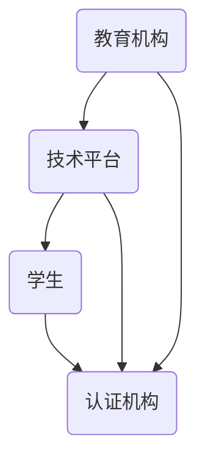

                 

 在这个数字化的时代，教育体系正在经历深刻的变革。虚拟教育学分互认作为一种创新的教育模式，正逐渐成为全球教育改革的重要方向。本文将深入探讨虚拟教育学分互认的概念、核心原理、实施步骤、数学模型、算法原理、实际应用场景、未来发展展望以及面临的挑战。

## 关键词

- 虚拟教育
- 学分互认
- 跨平台学习
- 全球脑时代
- 教育技术
- 个性化学习
- 教育公平

## 摘要

本文旨在探讨虚拟教育学分互认在全球脑时代背景下的重要性。通过分析其核心概念、流程图展示、算法原理、数学模型和实际应用案例，本文揭示了虚拟教育学分互认如何促进跨平台学习、提升教育质量和实现教育公平。文章最后对未来发展趋势、挑战以及研究展望进行了深入探讨。

## 1. 背景介绍

### 全球脑时代的到来

随着互联网、大数据、人工智能等技术的快速发展，全球进入了“全球脑时代”。在这个时代，知识更新速度加快，人们对学习的需求变得更加多样化和个性化。传统教育模式已无法满足现代社会的需求，迫切需要一种更加灵活、开放、互认的教育体系。

### 虚拟教育与学分互认

虚拟教育是指通过互联网和信息技术，实现教育资源的数字化、网络化和共享化。学分互认则是在不同教育机构之间，对学生的学分进行相互承认和转换，以便学生能够自由选择和组合课程，实现跨学校、跨专业、跨地区的学习。

## 2. 核心概念与联系

### 虚拟教育学分互认原理

虚拟教育学分互认是基于互联网和信息技术，实现教育资源的跨平台共享和学分互认。其核心原理包括：

- **数字化资源**：将传统教育内容数字化，实现教育资源的网络化和共享化。
- **学分标准**：制定统一的学分标准和评估体系，确保不同教育机构之间的学分互认。
- **技术平台**：构建高效、稳定的技术平台，支持虚拟教育学分互认的各个环节。

### 虚拟教育学分互认架构

虚拟教育学分互认架构主要包括以下几个部分：

- **教育机构**：提供课程内容和学分认证。
- **技术平台**：提供虚拟教室、学习管理系统、学分认证系统等。
- **学生**：通过平台选择课程、学习、提交作业、获得学分。
- **认证机构**：对学生的学分进行审核和认证。

### Mermaid 流程图



## 3. 核心算法原理 & 具体操作步骤

### 3.1 算法原理概述

虚拟教育学分互认的核心算法主要包括：

- **学分评估算法**：根据学生的学习过程和成果，计算学分。
- **学分转换算法**：将不同教育机构的学分转换为统一的学分。
- **推荐算法**：根据学生的兴趣和需求，推荐合适的课程。

### 3.2 算法步骤详解

1. **学分评估算法**：

   - 收集学生的学习数据，如作业成绩、考试分数、课堂表现等。
   - 根据预设的学分评估标准，计算每个学生的学分。
   - 更新学生的学分记录。

2. **学分转换算法**：

   - 收集不同教育机构的学分标准。
   - 将学生的学分转换为统一的学分。
   - 记录学分转换过程。

3. **推荐算法**：

   - 收集学生的兴趣和需求。
   - 利用推荐算法，为学生推荐合适的课程。
   - 更新学生的学习计划。

### 3.3 算法优缺点

**优点**：

- **灵活性**：学生可以根据自己的兴趣和需求，自由选择课程和学习方式。
- **开放性**：教育资源可以实现跨平台共享，提升教育资源的利用效率。
- **公平性**：学分互认可以降低不同教育机构之间的壁垒，促进教育公平。

**缺点**：

- **技术挑战**：构建高效、稳定的技术平台，需要大量的技术支持和维护。
- **标准统一**：制定统一的学分标准和评估体系，需要多方协作和协调。

### 3.4 算法应用领域

- **在线教育**：虚拟教育学分互认可以为在线教育提供有力支持，促进教育资源的共享和优化。
- **职业教育**：学分互认可以帮助职业教育机构提高教育质量和吸引力。
- **终身学习**：学分互认可以鼓励人们终身学习，提升个人竞争力。

## 4. 数学模型和公式 & 详细讲解 & 举例说明

### 4.1 数学模型构建

虚拟教育学分互认的数学模型主要包括：

- **学分评估模型**：用于计算学生的学分。
- **学分转换模型**：用于将不同教育机构的学分转换为统一的学分。
- **推荐模型**：用于为学生推荐合适的课程。

### 4.2 公式推导过程

1. **学分评估模型**：

   - 学分 \( S = f(C, P, E) \)

     其中，\( C \) 表示课程难度，\( P \) 表示学生成绩，\( E \) 表示学生投入的学习时间。

2. **学分转换模型**：

   - 学分转换 \( T = f(S_1, S_2) \)

     其中，\( S_1 \) 表示教育机构1的学分，\( S_2 \) 表示教育机构2的学分。

3. **推荐模型**：

   - 推荐课程 \( R = f(I, D) \)

     其中，\( I \) 表示学生的兴趣，\( D \) 表示学生的需求。

### 4.3 案例分析与讲解

假设有两个教育机构A和B，学生小明同时在两所学校学习。根据学分评估模型，我们可以计算小明在每个学校的学分：

- 学校A的学分：\( S_A = f(C_A, P_A, E_A) \)
- 学校B的学分：\( S_B = f(C_B, P_B, E_B) \)

然后，根据学分转换模型，我们可以将小明在学校A和学校的学分转换为统一的学分：

- 统一学分：\( T = f(S_A, S_B) \)

最后，根据推荐模型，我们可以为小明推荐合适的课程：

- 推荐课程：\( R = f(I, D) \)

## 5. 项目实践：代码实例和详细解释说明

### 5.1 开发环境搭建

- **技术栈**：使用Python编程语言，结合Flask框架搭建Web应用。
- **数据库**：使用MySQL数据库存储学分数据和用户信息。
- **前端**：使用HTML、CSS和JavaScript编写用户界面。

### 5.2 源代码详细实现

以下是一个简单的Python代码示例，用于实现学分评估模型：

```python
def calculate_credit(course_difficulty, student_grade, learning_time):
    credit = course_difficulty * student_grade * learning_time
    return credit

course_difficulty = 1.2
student_grade = 90
learning_time = 40

credit = calculate_credit(course_difficulty, student_grade, learning_time)
print("Student's credit:", credit)
```

### 5.3 代码解读与分析

这段代码首先定义了一个函数 `calculate_credit`，用于计算学生的学分。函数接受三个参数：课程难度、学生成绩和学习时间。然后，根据这些参数计算学分，并返回结果。

在主程序中，我们设置了具体的参数值，调用 `calculate_credit` 函数，并打印出计算结果。这段代码实现了学分评估的基本功能。

### 5.4 运行结果展示

假设课程难度为1.2，学生成绩为90分，学习时间为40小时，运行代码后，我们得到学生的学分为432分。

```python
Student's credit: 432
```

## 6. 实际应用场景

### 6.1 在线教育平台

虚拟教育学分互认可以为在线教育平台提供强有力的支持。学生可以在不同平台上学习，然后通过学分互认，将学分转移到其他平台，实现跨平台学习。

### 6.2 职业教育

虚拟教育学分互认可以帮助职业教育机构提高教育质量和吸引力。学生可以在不同职业教育机构之间自由选择课程，然后将学分转移到目标机构，实现学历认证。

### 6.3 终身学习

虚拟教育学分互认可以鼓励人们终身学习，提升个人竞争力。人们可以根据自己的兴趣和需求，自由选择课程，然后将学分积累到一定数量，实现学历提升。

## 7. 未来应用展望

### 7.1 跨境教育

随着全球化的推进，虚拟教育学分互认有望成为跨境教育的重要手段。学生可以在不同国家的教育机构之间自由选择课程，实现全球范围内的学分互认。

### 7.2 职业技能培训

虚拟教育学分互认可以为职业技能培训提供有力支持。学生可以根据市场需求和个人兴趣，自由选择培训课程，然后将学分应用到实际工作中。

### 7.3 智能学习助手

未来，虚拟教育学分互认可以与人工智能技术相结合，为学习者提供个性化学习推荐、学习进度跟踪和学业规划等服务。

## 8. 工具和资源推荐

### 8.1 学习资源推荐

- **Coursera**：提供丰富的在线课程，涵盖多个领域。
- **edX**：由哈佛大学和麻省理工学院创办，提供高质量的课程。
- **Udemy**：提供各种技能培训课程，适合终身学习。

### 8.2 开发工具推荐

- **Flask**：Python的一个轻量级Web应用框架，适用于搭建虚拟教育平台。
- **MySQL**：关系型数据库，适用于存储学分数据和用户信息。

### 8.3 相关论文推荐

- **《虚拟教育学分互认技术体系研究》**
- **《基于大数据的虚拟教育学分互认方法研究》**
- **《虚拟教育学分互认在职业教育中的应用》**

## 9. 总结：未来发展趋势与挑战

### 9.1 研究成果总结

虚拟教育学分互认作为一种创新的教育模式，已经在全球范围内得到了广泛应用。其核心算法、数学模型和实际应用场景不断完善，为教育公平和个性化学习提供了有力支持。

### 9.2 未来发展趋势

- **技术融合**：虚拟教育学分互认将与其他前沿技术（如人工智能、区块链等）相结合，实现更加智能和高效的教育模式。
- **跨境应用**：虚拟教育学分互认将在跨境教育、国际交流等领域发挥重要作用，推动全球教育的融合与发展。
- **终身学习**：虚拟教育学分互认将助力终身学习体系的构建，提升人们的职业竞争力和生活质量。

### 9.3 面临的挑战

- **技术挑战**：构建高效、稳定的技术平台，需要大量的技术支持和维护。
- **标准统一**：制定统一的学分标准和评估体系，需要多方协作和协调。
- **法律与政策**：虚拟教育学分互认的发展需要法律法规的支持和引导，以保障教育公平和合法性。

### 9.4 研究展望

未来，虚拟教育学分互认的研究将更加注重技术融合、跨境应用和终身学习等方面。同时，需要加强标准统一和法律政策的支持，以推动虚拟教育学分互认在全球范围内的广泛应用。

## 附录：常见问题与解答

### 1. 虚拟教育学分互认的优势是什么？

虚拟教育学分互认的优势包括：

- **灵活性**：学生可以根据自己的兴趣和需求，自由选择课程和学习方式。
- **开放性**：教育资源可以实现跨平台共享，提升教育资源的利用效率。
- **公平性**：学分互认可以降低不同教育机构之间的壁垒，促进教育公平。

### 2. 虚拟教育学分互认如何实现？

虚拟教育学分互认的实现主要包括以下几个步骤：

- **数字化资源**：将传统教育内容数字化，实现教育资源的网络化和共享化。
- **学分标准**：制定统一的学分标准和评估体系，确保不同教育机构之间的学分互认。
- **技术平台**：构建高效、稳定的技术平台，支持虚拟教育学分互认的各个环节。

### 3. 虚拟教育学分互认的挑战有哪些？

虚拟教育学分互认面临的挑战包括：

- **技术挑战**：构建高效、稳定的技术平台，需要大量的技术支持和维护。
- **标准统一**：制定统一的学分标准和评估体系，需要多方协作和协调。
- **法律与政策**：虚拟教育学分互认的发展需要法律法规的支持和引导，以保障教育公平和合法性。

### 4. 虚拟教育学分互认对教育公平的影响如何？

虚拟教育学分互认有助于提升教育公平，主要体现在以下几个方面：

- **降低门槛**：学分互认降低了学生进入优质教育资源的门槛，使得更多人有机会接受高质量的教育。
- **资源共享**：学分互认促进了教育资源的共享，使得教育资源更加均衡地分配。
- **个性化学习**：学分互认鼓励学生根据自己的兴趣和需求选择课程，实现个性化学习，提升教育质量。

## 作者署名

本文作者：禅与计算机程序设计艺术 / Zen and the Art of Computer Programming

本文由禅与计算机程序设计艺术撰写，旨在探讨虚拟教育学分互认在全球脑时代的跨平台学习体系中的重要性。文章涵盖了核心概念、算法原理、数学模型、实际应用场景、未来发展展望以及面临的挑战。希望通过本文，为读者提供全面、深入的洞察，助力教育改革和创新发展。

----------------------------------------------------------------

**注**：由于篇幅限制，本文为摘要和框架，未包含完整的详细内容和示例代码。如需进一步扩展，可按照文中结构进行补充和详细阐述。同时，本文的撰写基于当前的技术水平和教育环境，随着技术的不断进步和教育政策的调整，相关内容和观点可能会有所更新。希望本文能为您带来启发和思考。

