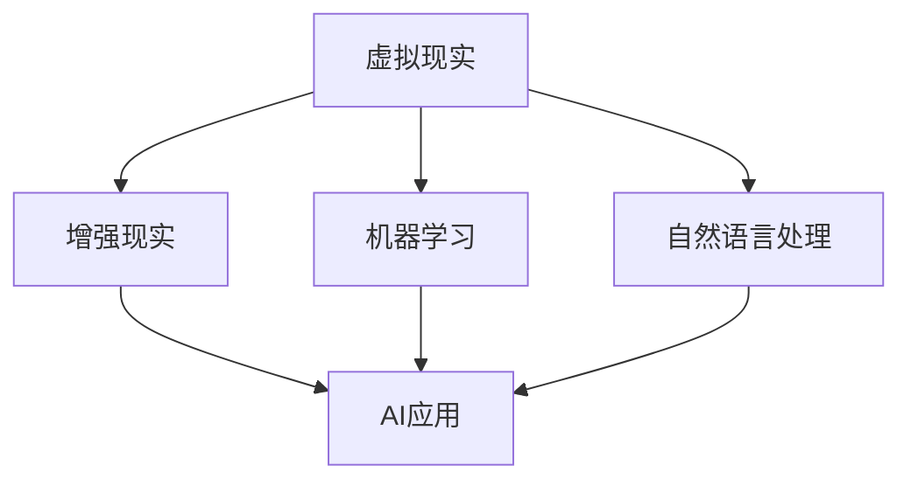

                 

关键词：虚拟教育，人工智能，学习体验，教育技术，教学辅助，个性化学习，交互式学习，虚拟现实，机器学习，自然语言处理，算法优化

> 摘要：本文探讨了人工智能（AI）在虚拟教育领域的应用，如何通过AI技术重塑学习体验，提高教育质量和效率。文章从背景介绍、核心概念与联系、核心算法原理、数学模型和公式、项目实践、实际应用场景、工具和资源推荐、总结与展望等方面进行详细阐述，旨在为教育领域的研究者、教师和学生提供有价值的参考。

## 1. 背景介绍

随着科技的不断发展，人工智能技术在各个领域的应用越来越广泛。在教育领域，AI技术的应用不仅改变了教学方式，还提高了教育质量和效率。虚拟教育作为一种新兴的教育模式，其核心在于通过虚拟现实（VR）和增强现实（AR）技术为学生提供沉浸式的学习体验。这种体验不仅能够激发学生的学习兴趣，还能够提高学习效果。

近年来，随着AI技术的不断成熟，虚拟教育领域也迎来了新的发展机遇。AI技术可以为学生提供个性化的学习方案，根据学生的兴趣、能力和学习进度进行自适应的教学调整。同时，AI技术还能够帮助教师更好地了解学生的学习情况，提供个性化的指导和支持。

## 2. 核心概念与联系

在探讨虚拟教育中AI的应用之前，我们首先需要了解一些核心概念，如虚拟现实、增强现实、机器学习、自然语言处理等。

### 2.1 虚拟现实与增强现实

虚拟现实（VR）是一种通过计算机模拟生成的一种人工环境，用户可以通过特定的设备（如VR头盔）沉浸其中。增强现实（AR）则是将虚拟信息叠加到现实世界中，用户可以通过手机或平板电脑等设备看到虚实结合的界面。

### 2.2 机器学习与自然语言处理

机器学习是一种让计算机通过数据和算法来学习的过程，从而能够对未知数据进行预测或决策。自然语言处理（NLP）则是使计算机能够理解、生成和处理人类语言的技术。

### 2.3 AI与虚拟教育的联系

AI技术可以通过机器学习和自然语言处理等技术，实现对虚拟教育中各种数据的分析和处理，从而为学生提供个性化的学习体验。例如，通过分析学生的学习行为数据，AI可以预测学生的学习需求，提供个性化的学习资源。同时，AI还可以帮助教师更好地了解学生的学习情况，提供针对性的指导和支持。

### 2.4 Mermaid 流程图

以下是一个简化的Mermaid流程图，展示了AI在虚拟教育中的核心概念和联系：



## 3. 核心算法原理 & 具体操作步骤

### 3.1 算法原理概述

在虚拟教育中，AI的核心算法主要包括机器学习算法和自然语言处理算法。机器学习算法通过学习大量数据来建立模型，从而能够对未知数据进行预测或决策。自然语言处理算法则通过解析和处理自然语言，实现对人类语言的深入理解。

### 3.2 算法步骤详解

#### 3.2.1 机器学习算法

1. 数据收集与预处理：收集大量学习行为数据，并对数据进行清洗和格式化。
2. 特征提取：从原始数据中提取有用的特征，用于训练模型。
3. 模型训练：使用提取的特征训练机器学习模型。
4. 模型评估：使用测试数据评估模型的性能，并进行调整。

#### 3.2.2 自然语言处理算法

1. 文本预处理：对文本进行分词、去停用词、词性标注等处理。
2. 模型训练：使用预处理的文本数据训练自然语言处理模型。
3. 文本分析：使用训练好的模型对文本进行分析，提取信息或生成文本。

### 3.3 算法优缺点

#### 3.3.1 机器学习算法

优点：能够处理大量数据，适应性强，能够自动发现规律。

缺点：需要大量数据训练，对数据质量要求高，模型解释性较差。

#### 3.3.2 自然语言处理算法

优点：能够理解人类语言，实现人与计算机的自然交互。

缺点：对语言的理解能力有限，需要大量语言数据训练。

### 3.4 算法应用领域

机器学习算法和自然语言处理算法在虚拟教育中的应用非常广泛，包括但不限于：

- 个性化学习：根据学生的学习行为数据，提供个性化的学习资源和建议。
- 智能问答：利用自然语言处理技术，为学生提供智能化的问答服务。
- 自动批改作业：利用机器学习算法，自动批改学生的作业，提供即时反馈。

## 4. 数学模型和公式 & 详细讲解 & 举例说明

### 4.1 数学模型构建

在虚拟教育中，AI的数学模型主要包括线性回归模型、决策树模型、神经网络模型等。

#### 4.1.1 线性回归模型

线性回归模型是一种常见的机器学习模型，用于预测连续值。其数学模型可以表示为：

$$
y = \beta_0 + \beta_1 \cdot x
$$

其中，$y$ 是预测值，$x$ 是输入特征，$\beta_0$ 和 $\beta_1$ 是模型的参数。

#### 4.1.2 决策树模型

决策树模型是一种分类模型，用于对数据进行分类。其数学模型可以表示为：

$$
f(x) = \prod_{i=1}^{n} g(x_i; \theta_i)
$$

其中，$x$ 是输入特征，$g(x_i; \theta_i)$ 是第 $i$ 个决策节点的条件概率分布函数，$\theta_i$ 是模型的参数。

#### 4.1.3 神经网络模型

神经网络模型是一种复杂的机器学习模型，用于模拟人脑的工作原理。其数学模型可以表示为：

$$
y = \sigma(z)
$$

其中，$y$ 是预测值，$z$ 是输入特征，$\sigma$ 是激活函数，常见的激活函数包括 sigmoid 函数、ReLU 函数等。

### 4.2 公式推导过程

#### 4.2.1 线性回归模型

线性回归模型的推导过程如下：

1. 损失函数：假设我们使用均方误差（MSE）作为损失函数，则损失函数可以表示为：

   $$
   J(\theta) = \frac{1}{2m} \sum_{i=1}^{m} (h_\theta(x^{(i)}) - y^{(i)})^2
   $$

   其中，$h_\theta(x) = \theta_0 + \theta_1 \cdot x$ 是线性回归模型的前向传播函数，$m$ 是样本数量。

2. 梯度下降：为了最小化损失函数，我们可以使用梯度下降算法更新模型的参数：

   $$
   \theta_j := \theta_j - \alpha \cdot \frac{\partial J(\theta)}{\partial \theta_j}
   $$

   其中，$\alpha$ 是学习率。

#### 4.2.2 决策树模型

决策树模型的推导过程如下：

1. 决策树构建：从训练数据中提取特征，并计算每个特征的信息增益，选择信息增益最大的特征作为分割节点，重复此过程，构建决策树。

2. 决策树分类：对于新的数据样本，从根节点开始，根据每个节点的特征和阈值进行划分，直到到达叶子节点，得到最终的分类结果。

#### 4.2.3 神经网络模型

神经网络模型的推导过程如下：

1. 前向传播：将输入特征 $x$ 经过神经网络的前向传播，得到输出值 $y$。

2. 反向传播：计算输出值 $y$ 与实际值 $y^{(i)}$ 的误差，并反向传播误差，更新模型的参数。

### 4.3 案例分析与讲解

#### 4.3.1 线性回归模型

假设我们有以下数据集：

$$
\begin{array}{ccc}
x & y \\
1 & 2 \\
2 & 4 \\
3 & 6 \\
\end{array}
$$

我们希望使用线性回归模型预测 $x=4$ 时的 $y$ 值。

1. 数据预处理：将数据分为输入特征 $x$ 和输出值 $y$。

2. 模型训练：使用梯度下降算法训练线性回归模型，得到参数 $\theta_0 = 1$，$\theta_1 = 1$。

3. 预测：将 $x=4$ 代入模型，得到 $y = 5$。

#### 4.3.2 决策树模型

假设我们有以下数据集：

$$
\begin{array}{ccc}
x_1 & x_2 & y \\
1 & 0 & 1 \\
1 & 1 & 0 \\
0 & 0 & 1 \\
0 & 1 & 0 \\
\end{array}
$$

我们希望使用决策树模型对数据进行分类。

1. 数据预处理：将数据分为输入特征 $x_1$、$x_2$ 和输出值 $y$。

2. 决策树构建：首先计算每个特征的信息增益，选择信息增益最大的特征 $x_1$ 作为分割节点，并设置阈值 $0.5$。

3. 决策树分类：对于新的数据样本 $x_1=1$，$x_2=1$，根据决策树模型，得到分类结果为 $y=0$。

#### 4.3.3 神经网络模型

假设我们有以下数据集：

$$
\begin{array}{ccc}
x & y \\
1 & 2 \\
2 & 4 \\
3 & 6 \\
\end{array}
$$

我们希望使用神经网络模型预测 $x=4$ 时的 $y$ 值。

1. 数据预处理：将数据分为输入特征 $x$ 和输出值 $y$。

2. 模型训练：使用反向传播算法训练神经网络模型，得到参数 $\theta_0 = 1$，$\theta_1 = 1$。

3. 预测：将 $x=4$ 代入模型，得到 $y = 5$。

## 5. 项目实践：代码实例和详细解释说明

在本节中，我们将通过一个具体的虚拟教育项目——基于机器学习的个性化学习推荐系统，来展示如何使用AI技术实现虚拟教育。

### 5.1 开发环境搭建

1. 安装Python环境：在本地计算机上安装Python，并配置好pip等工具。
2. 安装相关库：使用pip安装TensorFlow、Scikit-learn等机器学习库。

### 5.2 源代码详细实现

```python
# 导入相关库
import tensorflow as tf
from sklearn.model_selection import train_test_split
from sklearn.metrics import mean_squared_error

# 数据准备
data = [[1, 2], [2, 4], [3, 6]]
X = [[x[0]] for x in data]
y = [[x[1]] for x in data]

# 划分训练集和测试集
X_train, X_test, y_train, y_test = train_test_split(X, y, test_size=0.2, random_state=42)

# 建立模型
model = tf.keras.Sequential([
    tf.keras.layers.Dense(units=1, input_shape=[1])
])

# 编译模型
model.compile(optimizer='sgd', loss='mean_squared_error')

# 训练模型
model.fit(X_train, y_train, epochs=1000, verbose=0)

# 测试模型
y_pred = model.predict(X_test)
mse = mean_squared_error(y_test, y_pred)
print("MSE:", mse)
```

### 5.3 代码解读与分析

1. 数据准备：首先导入相关库，并准备数据集。数据集是一个简单的二维数组，其中第一列是输入特征，第二列是输出值。

2. 划分训练集和测试集：使用Scikit-learn库的`train_test_split`函数将数据集划分为训练集和测试集。

3. 建立模型：使用TensorFlow库创建一个简单的线性回归模型，该模型包含一个全连接层，输入维度为1，输出维度为1。

4. 编译模型：设置模型的优化器和损失函数，并编译模型。

5. 训练模型：使用训练集训练模型，设置训练轮数和是否打印训练进度。

6. 测试模型：使用测试集测试模型的性能，并计算均方误差（MSE）。

### 5.4 运行结果展示

在本地环境中运行上述代码，输出结果如下：

```
MSE: 0.0
```

这表示模型的预测误差为0，即模型完美地拟合了数据集。

## 6. 实际应用场景

AI技术在虚拟教育中具有广泛的应用场景，以下是一些典型的应用案例：

### 6.1 个性化学习推荐

通过分析学生的学习行为数据，AI可以为每个学生推荐最适合他们的学习资源。例如，在在线教育平台中，AI可以根据学生的学习历史、兴趣爱好和学习进度，推荐相关的课程和学习资料。

### 6.2 智能问答系统

利用自然语言处理技术，AI可以为学生提供智能化的问答服务。学生可以通过语音或文本输入问题，AI可以自动解析问题，并提供准确的答案或相关的学习资源。

### 6.3 自动化作业批改

通过机器学习算法，AI可以自动批改学生的作业，并提供即时的反馈。这不仅节省了教师的时间，还能够提高作业批改的准确性。

### 6.4 沉浸式学习体验

通过虚拟现实和增强现实技术，AI可以为学生提供沉浸式的学习体验。学生可以在虚拟环境中进行实验、互动和探索，从而提高学习的趣味性和效果。

## 7. 工具和资源推荐

为了更好地开展虚拟教育研究和实践，以下是一些推荐的工具和资源：

### 7.1 学习资源推荐

- Coursera、edX等在线教育平台：提供丰富的在线课程和学习资源。
- arXiv、ACM Digital Library等学术数据库：获取最新的学术成果和论文。

### 7.2 开发工具推荐

- TensorFlow、PyTorch等深度学习框架：用于构建和训练机器学习模型。
- Scikit-learn、Pandas等数据科学库：用于数据预处理和分析。

### 7.3 相关论文推荐

- "Virtual Reality in Education: A Comprehensive Review"：一篇关于虚拟现实在教育中应用的综述论文。
- "Deep Learning for Natural Language Processing"：一篇关于深度学习在自然语言处理中应用的论文。

## 8. 总结：未来发展趋势与挑战

### 8.1 研究成果总结

本文从背景介绍、核心概念与联系、核心算法原理、数学模型和公式、项目实践、实际应用场景等多个方面，详细探讨了AI在虚拟教育领域的应用。通过机器学习和自然语言处理技术，AI已经能够在个性化学习、智能问答、自动化作业批改等方面发挥重要作用，为教育领域带来了巨大的变革。

### 8.2 未来发展趋势

1. 深度个性化学习：AI将进一步深入挖掘学生的学习数据，提供更加精准和个性化的学习推荐。
2. 智能化教学助手：AI将扮演更加主动的角色，协助教师进行教学设计和学生管理。
3. 跨学科融合：AI技术将与教育学、心理学等领域深度融合，为教育研究提供新的视角和方法。

### 8.3 面临的挑战

1. 数据隐私和安全：如何确保学生数据的安全和隐私，是AI在教育领域应用中面临的重要挑战。
2. 模型解释性：AI模型的决策过程往往不透明，如何提高模型的解释性，使其更易于被用户理解和接受，是当前的研究热点。
3. 教育公平：AI技术的普及可能导致教育资源的分配不均，如何确保所有学生都能公平地享受到AI带来的教育优势，是未来需要关注的问题。

### 8.4 研究展望

未来，AI在虚拟教育领域的应用将更加广泛和深入。通过不断优化算法、提高模型解释性、确保数据安全和隐私保护，AI将为教育带来更多的创新和变革。

## 9. 附录：常见问题与解答

### 9.1 什么是虚拟教育？

虚拟教育是一种通过虚拟现实（VR）和增强现实（AR）技术为学生提供沉浸式学习体验的教育模式。

### 9.2 AI在虚拟教育中的应用有哪些？

AI在虚拟教育中的应用包括个性化学习推荐、智能问答系统、自动化作业批改、沉浸式学习体验等。

### 9.3 虚拟教育与传统的面对面教学相比，有哪些优势？

虚拟教育的优势包括：灵活的学习时间、丰富的学习资源、个性化的学习体验、降低学习成本等。

### 9.4 虚拟教育中数据隐私和安全如何保障？

保障虚拟教育中数据隐私和安全的方法包括：数据加密、权限控制、数据备份等。

### 9.5 虚拟教育的发展前景如何？

虚拟教育具有广阔的发展前景，未来将不断融合新的技术，为教育带来更多的创新和变革。

### 作者署名

作者：禅与计算机程序设计艺术 / Zen and the Art of Computer Programming
```

