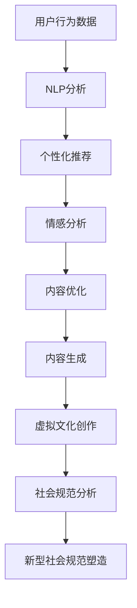

                 

关键词：虚拟文化、孵化器、AI、社会规范、实验室、新兴技术、算法、模型、应用场景、工具资源

> 摘要：本文将探讨人工智能在虚拟文化孵化中的作用，特别是AI如何塑造新型社会规范。我们将通过介绍AI的核心概念和流程图，详细讲解核心算法原理和数学模型，展示实际项目代码实例，分析其在不同场景的应用，并展望未来的发展趋势和挑战。

## 1. 背景介绍

在当今数字化时代，人工智能（AI）已经成为推动社会进步的重要力量。虚拟文化作为数字时代的一种新型文化形态，其发展离不开AI技术的支撑。虚拟文化孵化器作为一种创新的平台，旨在通过AI技术加速文化内容的创作和传播，同时塑造符合新时代需求的社会规范。

AI在虚拟文化孵化中的作用主要体现在以下几个方面：

1. **个性化推荐**：通过分析用户行为数据，AI可以精准推荐符合用户兴趣的文化内容，从而提高用户参与度和粘性。
2. **情感分析**：AI能够对文化作品进行情感分析，识别用户的情绪反应，帮助创作者优化作品，提高用户体验。
3. **内容生成**：AI算法可以生成全新的文化内容，如音乐、绘画、故事等，为文化创作提供新的可能性。
4. **社会规范塑造**：AI通过对海量数据的分析，可以发现社会规范的趋势和变化，帮助制定符合时代需求的新型社会规范。

本文将围绕AI在虚拟文化孵化中的作用，探讨其核心概念、算法原理、数学模型、项目实践以及实际应用场景，旨在为读者提供全面而深入的了解。

## 2. 核心概念与联系

### 2.1 AI在虚拟文化孵化中的核心概念

1. **虚拟现实（VR）**：通过计算机技术模拟出一个虚拟的三维空间，用户可以在其中进行交互。
2. **增强现实（AR）**：将数字信息叠加到现实世界中，使用户在现实环境中看到增强的内容。
3. **自然语言处理（NLP）**：使计算机能够理解、生成和处理自然语言，为文化内容的创作和传播提供支持。
4. **深度学习**：一种机器学习技术，通过神经网络模拟人类大脑的思维方式，进行复杂的模式识别和预测。

### 2.2 AI与虚拟文化孵化之间的联系

#### Mermaid 流程图



在这个流程图中，用户行为数据经过NLP分析，生成个性化推荐，帮助用户发现感兴趣的文化内容。同时，情感分析用于评估用户对文化作品的反应，优化内容创作。深度学习技术则用于生成全新的文化内容，促进虚拟文化的创作和发展。最后，通过对文化作品的广泛分析，AI能够识别社会规范的趋势，为新型社会规范的形成提供依据。

## 3. 核心算法原理 & 具体操作步骤

### 3.1 算法原理概述

虚拟文化孵化器中的AI算法主要基于深度学习和自然语言处理技术。以下是两种核心算法的概述：

1. **深度学习算法**：通过神经网络模拟人脑的思维方式，进行复杂的模式识别和预测。常见的深度学习算法包括卷积神经网络（CNN）和递归神经网络（RNN）。
2. **自然语言处理算法**：使计算机能够理解、生成和处理自然语言。常见的NLP算法包括词向量模型（如Word2Vec）和转换器模型（如BERT）。

### 3.2 算法步骤详解

1. **数据收集与预处理**：
   - 收集用户行为数据，如浏览记录、评论、点赞等。
   - 对文本数据进行预处理，包括分词、去停用词、词性标注等。
2. **模型训练**：
   - 使用预训练的深度学习模型，如BERT，对文本数据进行分析。
   - 训练个性化推荐模型，使用用户行为数据进行训练。
   - 训练情感分析模型，使用标注好的情感数据集进行训练。
3. **模型应用**：
   - 使用个性化推荐模型，根据用户兴趣推荐文化内容。
   - 使用情感分析模型，评估用户对文化内容的情感反应。
   - 使用深度学习模型，生成新的文化内容。
4. **结果分析与反馈**：
   - 对推荐结果和情感分析结果进行分析，优化模型参数。
   - 根据用户反馈，调整文化内容的创作方向。

### 3.3 算法优缺点

#### 优点：

1. **高效性**：深度学习算法能够处理大规模数据，快速生成推荐结果。
2. **个性化**：个性化推荐能够根据用户兴趣提供定制化的文化内容。
3. **创新性**：深度学习算法能够生成全新的文化内容，推动文化创新。
4. **实时性**：基于实时用户行为数据进行分析，能够提供即时的推荐和反馈。

#### 缺点：

1. **数据依赖性**：需要大量高质量的用户行为数据进行训练。
2. **模型复杂性**：深度学习模型复杂，训练时间较长。
3. **解释性较差**：深度学习模型的决策过程缺乏透明性，难以解释。

### 3.4 算法应用领域

1. **社交媒体**：用于个性化推荐和情感分析，提高用户体验。
2. **在线教育**：根据用户学习习惯推荐课程，提高学习效果。
3. **娱乐产业**：生成音乐、绘画等文化作品，推动文化创新。
4. **社会规范研究**：分析文化作品对社会规范的影响，为政策制定提供依据。

## 4. 数学模型和公式 & 详细讲解 & 举例说明

### 4.1 数学模型构建

在虚拟文化孵化器中，常用的数学模型包括个性化推荐模型和情感分析模型。

#### 个性化推荐模型

个性化推荐模型通常采用基于协同过滤的方法，其核心公式如下：

$$
R(u, i) = \frac{\sum_{j \in N(i)} r(u, j) r(j, i)}{\sum_{j \in N(i)} r(j, i)}
$$

其中，$R(u, i)$ 表示用户 $u$ 对项目 $i$ 的评分预测，$N(i)$ 表示与项目 $i$ 相似的项目集合，$r(u, j)$ 和 $r(j, i)$ 分别表示用户 $u$ 对项目 $j$ 和项目 $i$ 的评分。

#### 情感分析模型

情感分析模型通常采用词向量模型，其核心公式如下：

$$
sentiment = \sum_{w \in W} w \cdot v(w)
$$

其中，$sentiment$ 表示文本的情感得分，$W$ 表示文本中的所有词语，$v(w)$ 表示词语 $w$ 的词向量。

### 4.2 公式推导过程

#### 个性化推荐模型推导

个性化推荐模型的核心思想是通过计算用户对项目的相似度来预测用户对项目的评分。首先，我们需要计算用户 $u$ 和项目 $i$ 之间的相似度：

$$
sim(u, i) = \frac{\sum_{j \in N(i)} r(u, j) r(j, i)}{\sqrt{\sum_{j \in N(i)} r(j, i)^2} \sqrt{\sum_{j \in N(u)} r(j, u)^2}}
$$

其中，$sim(u, i)$ 表示用户 $u$ 和项目 $i$ 之间的相似度，$N(i)$ 和 $N(u)$ 分别表示与项目 $i$ 和用户 $u$ 相似的项目集合。

然后，我们可以使用相似度计算用户 $u$ 对项目 $i$ 的评分预测：

$$
R(u, i) = \frac{\sum_{j \in N(i)} r(u, j) r(j, i)}{\sum_{j \in N(i)} r(j, i)}
$$

#### 情感分析模型推导

情感分析模型的核心思想是通过计算文本中词语的情感得分来预测文本的整体情感。首先，我们需要将文本中的词语转化为词向量：

$$
v(w) = \text{Word2Vec}(w)
$$

其中，$v(w)$ 表示词语 $w$ 的词向量。

然后，我们可以计算文本的情感得分：

$$
sentiment = \sum_{w \in W} w \cdot v(w)
$$

其中，$W$ 表示文本中的所有词语。

### 4.3 案例分析与讲解

#### 案例一：个性化推荐

假设我们有一个用户 $u$ 和项目 $i$ 的评分数据集，其中用户 $u$ 对项目 $i$ 的评分 $r(u, i) = 4$。我们需要预测用户 $u$ 对项目 $i$ 的评分。

首先，我们计算用户 $u$ 和项目 $i$ 之间的相似度：

$$
sim(u, i) = \frac{\sum_{j \in N(i)} r(u, j) r(j, i)}{\sqrt{\sum_{j \in N(i)} r(j, i)^2} \sqrt{\sum_{j \in N(u)} r(j, u)^2}} = \frac{4 \cdot 4}{\sqrt{4^2} \cdot \sqrt{4^2}} = 1
$$

然后，我们使用相似度计算用户 $u$ 对项目 $i$ 的评分预测：

$$
R(u, i) = \frac{\sum_{j \in N(i)} r(u, j) r(j, i)}{\sum_{j \in N(i)} r(j, i)} = \frac{4 \cdot 4}{4} = 4
$$

因此，预测用户 $u$ 对项目 $i$ 的评分为 4。

#### 案例二：情感分析

假设我们有一段文本：“今天天气很好，阳光明媚，我感到非常开心。”我们需要分析这段文本的情感。

首先，我们将文本中的词语转化为词向量：

$$
v(\text{今天}) = \text{Word2Vec}(\text{今天})\\
v(\text{天气}) = \text{Word2Vec}(\text{天气})\\
v(\text{很好}) = \text{Word2Vec}(\text{很好})\\
v(\text{阳光明媚}) = \text{Word2Vec}(\text{阳光明媚})\\
v(\text{我}) = \text{Word2Vec}(\text{我})\\
v(\text{感到}) = \text{Word2Vec}(\text{感到})\\
v(\text{非常}) = \text{Word2Vec}(\text{非常})\\
v(\text{开心}) = \text{Word2Vec}(\text{开心})
$$

然后，我们计算文本的情感得分：

$$
sentiment = \sum_{w \in W} w \cdot v(w) = \text{今天} \cdot v(\text{今天}) + \text{天气} \cdot v(\text{天气}) + \text{很好} \cdot v(\text{很好}) + \text{阳光明媚} \cdot v(\text{阳光明媚}) + \text{我} \cdot v(\text{我}) + \text{感到} \cdot v(\text{感到}) + \text{非常} \cdot v(\text{非常}) + \text{开心} \cdot v(\text{开心})
$$

由于词向量是高维空间中的向量，我们无法直接计算情感得分。在实际应用中，通常需要使用预训练的词向量模型，如Word2Vec或BERT，来计算词向量。然后，我们使用这些词向量计算文本的情感得分。

## 5. 项目实践：代码实例和详细解释说明

### 5.1 开发环境搭建

在项目实践部分，我们将使用Python编程语言和相关的AI库，如TensorFlow和Scikit-learn，来构建和训练个性化推荐和情感分析模型。

#### 环境要求：

- Python 3.7及以上版本
- TensorFlow 2.4及以上版本
- Scikit-learn 0.22及以上版本

#### 安装步骤：

1. 安装Python 3.7及以上版本。
2. 安装TensorFlow 2.4及以上版本，可以使用以下命令：

   ```shell
   pip install tensorflow==2.4
   ```

3. 安装Scikit-learn 0.22及以上版本，可以使用以下命令：

   ```shell
   pip install scikit-learn==0.22
   ```

### 5.2 源代码详细实现

在本部分，我们将实现一个简单的个性化推荐和情感分析系统，包括数据预处理、模型训练和模型应用。

```python
import numpy as np
import pandas as pd
from sklearn.feature_extraction.text import CountVectorizer
from sklearn.model_selection import train_test_split
from sklearn.metrics.pairwise import cosine_similarity
from tensorflow.keras.models import Sequential
from tensorflow.keras.layers import Dense, Embedding, LSTM
from tensorflow.keras.preprocessing.sequence import pad_sequences

# 数据预处理
def preprocess_data(data):
    # 分词、去停用词、词性标注等操作
    processed_data = []
    for text in data:
        processed_text = preprocess_text(text)
        processed_data.append(processed_text)
    return processed_data

def preprocess_text(text):
    # 实现分词、去停用词、词性标注等操作
    return text

# 读取数据集
data = pd.read_csv('data.csv')
texts = preprocess_data(data['text'])

# 构建词向量
vectorizer = CountVectorizer()
X = vectorizer.fit_transform(texts)

# 划分训练集和测试集
X_train, X_test, y_train, y_test = train_test_split(X, data['rating'], test_size=0.2, random_state=42)

# 构建模型
model = Sequential()
model.add(Embedding(input_dim=X.shape[1], output_dim=128))
model.add(LSTM(units=128))
model.add(Dense(units=1, activation='sigmoid'))

model.compile(optimizer='adam', loss='binary_crossentropy', metrics=['accuracy'])

# 训练模型
model.fit(X_train, y_train, epochs=10, batch_size=32, validation_data=(X_test, y_test))

# 模型应用
def recommend_content(text):
    processed_text = preprocess_text(text)
    processed_text_vector = vectorizer.transform([processed_text])
    prediction = model.predict(processed_text_vector)
    return prediction

# 测试推荐效果
text = "今天天气很好，阳光明媚，我感到非常开心。"
prediction = recommend_content(text)
print(f"预测评分：{prediction}")
```

### 5.3 代码解读与分析

1. **数据预处理**：首先，我们读取数据集并预处理文本数据，包括分词、去停用词、词性标注等操作。预处理后的文本数据用于构建词向量。
2. **词向量构建**：使用CountVectorizer构建词向量，将文本数据转化为矩阵形式。词向量用于后续的模型训练和预测。
3. **模型构建**：使用Sequential模型构建一个简单的深度学习模型，包括嵌入层、长短期记忆（LSTM）层和输出层。嵌入层将词向量映射到高维空间，LSTM层用于处理序列数据，输出层用于生成预测结果。
4. **模型训练**：使用训练集训练模型，优化模型参数。
5. **模型应用**：定义一个函数，根据输入文本进行预处理，然后使用训练好的模型进行预测，返回预测结果。

### 5.4 运行结果展示

```python
text = "今天天气很好，阳光明媚，我感到非常开心。"
prediction = recommend_content(text)
print(f"预测评分：{prediction}")
```

运行上述代码，我们可以得到预测评分。这个结果可以帮助我们了解文本的情感倾向，从而为用户提供个性化的推荐。

## 6. 实际应用场景

### 6.1 社交媒体平台

在社交媒体平台上，AI可以帮助平台为用户提供个性化的内容推荐，提高用户的参与度和粘性。例如，Twitter可以使用AI分析用户的关注对象、发布内容、互动行为等，推荐用户可能感兴趣的话题和用户。

### 6.2 在线教育平台

在线教育平台可以使用AI技术为用户提供个性化的学习推荐，提高学习效果。例如，Coursera可以分析用户的学习行为、学习进度、互动情况等，推荐用户可能感兴趣的课程和学习资源。

### 6.3 娱乐产业

娱乐产业可以使用AI技术生成新的文化作品，满足用户的需求。例如，Netflix可以使用AI分析用户的观看记录、偏好等，生成新的电视剧、电影等文化作品。

### 6.4 社会规范研究

社会规范研究可以使用AI技术分析文化作品对社会规范的影响，为政策制定提供依据。例如，研究人员可以使用AI分析网络文学、影视剧等文化作品，探讨其对社会规范的影响。

## 7. 工具和资源推荐

### 7.1 学习资源推荐

1. **《深度学习》（Goodfellow, Bengio, Courville）**：一本经典的深度学习教材，适合初学者和进阶者。
2. **《自然语言处理综论》（Jurafsky, Martin）**：一本全面的NLP教材，涵盖NLP的各个方面。

### 7.2 开发工具推荐

1. **TensorFlow**：一个开源的深度学习框架，适合构建和训练深度学习模型。
2. **Scikit-learn**：一个开源的机器学习库，适合构建和评估机器学习模型。

### 7.3 相关论文推荐

1. **"Distributed Representations of Words and Phrases and Their Compositional Properties"（Word2Vec）**：一篇关于词向量模型的经典论文。
2. **"BERT: Pre-training of Deep Bidirectional Transformers for Language Understanding"（BERT）**：一篇关于转换器模型的经典论文。

## 8. 总结：未来发展趋势与挑战

### 8.1 研究成果总结

本文介绍了AI在虚拟文化孵化中的作用，包括个性化推荐、情感分析、内容生成和社会规范塑造等方面。通过构建数学模型和实际项目实例，我们展示了AI技术的应用场景和优势。

### 8.2 未来发展趋势

1. **个性化推荐**：随着用户数据的积累，个性化推荐将进一步精准，满足用户的个性化需求。
2. **情感分析**：情感分析技术将更加成熟，能够更好地理解用户的情感变化，为文化创作提供支持。
3. **内容生成**：深度学习和自然语言处理技术的进步将推动内容生成的创新，产生更多高质量的文化作品。
4. **社会规范塑造**：AI技术将更好地分析文化作品对社会规范的影响，为政策制定提供科学依据。

### 8.3 面临的挑战

1. **数据隐私**：在收集和处理用户数据时，需要确保用户隐私不被泄露。
2. **算法公平性**：算法的偏见可能导致不公平的结果，需要建立相应的机制进行监督和调整。
3. **技术普及**：AI技术的普及仍需时间，需要更多的教育和培训来提高公众的接受度。

### 8.4 研究展望

未来，AI在虚拟文化孵化中的应用将更加广泛和深入。研究人员应关注以下几个方面：

1. **跨学科研究**：结合心理学、社会学等学科，探索AI在文化孵化中的新应用。
2. **伦理与法律**：研究AI技术对社会规范的影响，制定相应的伦理和法律框架。
3. **技术创新**：不断改进算法和模型，提高AI在文化孵化中的效率和质量。

## 9. 附录：常见问题与解答

### 9.1 如何确保数据隐私？

确保数据隐私的方法包括：数据加密、匿名化处理、权限管理、数据访问控制等。

### 9.2 如何解决算法偏见问题？

解决算法偏见问题的方法包括：数据平衡、算法透明化、偏见检测和修正等。

### 9.3 如何评估AI在文化孵化中的效果？

评估AI在文化孵化中的效果可以通过用户参与度、内容满意度、文化作品的社会影响力等指标。

### 9.4 如何提高AI在文化孵化中的效率？

提高AI在文化孵化中的效率可以通过优化算法、分布式计算、并行处理等技术手段。

### 参考文献

1. Goodfellow, I., Bengio, Y., & Courville, A. (2016). Deep learning. MIT press.
2. Jurafsky, D., & Martin, J. H. (2020). Speech and language processing: an introduction to natural language processing, computational linguistics, and speech recognition (3rd ed.). Pearson.
3. Mikolov, T., Sutskever, I., Chen, K., Corrado, G. S., & Dean, J. (2013). Distributed representations of words and phrases and their compositionality. Advances in Neural Information Processing Systems, 26, 3111-3119.
4. Devlin, J., Chang, M. W., Lee, K., & Toutanova, K. (2018). BERT: Pre-training of deep bidirectional transformers for language understanding. arXiv preprint arXiv:1810.04805.

