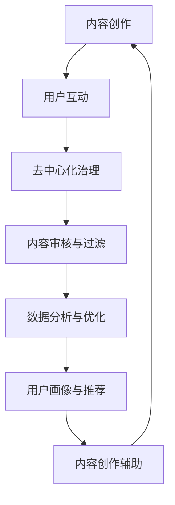

                 

 **关键词：** 虚拟文化孵化器，AI社会规范，实验室负责人，技术趋势，社会影响

**摘要：** 本文探讨了虚拟文化孵化器在新型社会规范塑造中的作用，以及AI作为实验室负责人的角色。文章首先介绍了虚拟文化孵化器的背景和核心概念，随后深入分析了AI在这一领域的关键作用和具体实施方法，最终探讨了该领域的发展趋势和未来挑战。

## 1. 背景介绍

虚拟文化孵化器是一种新兴的数字平台，旨在创建和维护虚拟社区，促进文化创新和知识共享。这些孵化器通常基于区块链技术，提供去中心化的内容管理和用户互动机制，为创作者和参与者提供了一个开放、透明的创作环境。

随着人工智能技术的快速发展，AI已成为推动虚拟文化孵化器发展的重要动力。AI不仅能够提高内容创作的效率，还能通过数据分析和智能推荐，为用户提供更加个性化和高质量的服务。在这个背景下，AI作为实验室负责人，肩负着构建新型社会规范的重要使命。

## 2. 核心概念与联系

### 虚拟文化孵化器

虚拟文化孵化器是一种基于区块链技术的数字平台，旨在促进文化创新和知识共享。它通常包括以下几个关键组成部分：

- **内容创作与发布**：创作者可以在这个平台上发布各种形式的内容，如文字、图片、视频等。
- **用户互动与反馈**：用户可以通过评论、点赞、分享等方式与其他用户互动，从而促进社区内的知识传播和交流。
- **去中心化治理**：虚拟文化孵化器采用去中心化治理模式，所有决策和治理活动都由社区成员共同参与和投票决定。

### AI的作用

AI在虚拟文化孵化器中发挥着至关重要的作用。具体来说，AI的作用可以分为以下几个方面：

- **内容创作辅助**：AI可以通过自然语言处理、图像识别等技术，辅助创作者进行内容创作。
- **用户画像与推荐**：AI可以通过分析用户的行为数据，构建用户画像，并基于这些画像进行个性化内容推荐。
- **数据分析与优化**：AI可以对社区内的行为数据进行分析，帮助孵化器运营者优化社区运营策略。

### Mermaid 流程图

以下是虚拟文化孵化器和AI作用之间的Mermaid流程图：



## 3. 核心算法原理 & 具体操作步骤

### 3.1 算法原理概述

虚拟文化孵化器中的核心算法主要包括内容创作辅助算法、用户画像算法和推荐算法。这些算法的基本原理如下：

- **内容创作辅助算法**：基于自然语言处理和图像识别技术，通过分析用户输入的内容，提供创作建议和灵感。
- **用户画像算法**：通过分析用户的行为数据，构建用户画像，以便进行个性化推荐。
- **推荐算法**：基于用户画像和内容特征，为用户推荐符合其兴趣的内容。

### 3.2 算法步骤详解

#### 3.2.1 内容创作辅助算法

1. **数据收集**：从用户输入的内容中收集文本和图像数据。
2. **预处理**：对文本和图像数据进行预处理，如分词、图像分割等。
3. **特征提取**：提取文本和图像的特征向量。
4. **创作建议**：基于特征向量，为用户提供创作建议和灵感。

#### 3.2.2 用户画像算法

1. **数据收集**：收集用户在社区内的行为数据，如浏览记录、点赞记录等。
2. **数据清洗**：对行为数据进行清洗，去除无效和重复数据。
3. **特征提取**：提取用户行为特征，如浏览次数、点赞次数等。
4. **模型训练**：使用机器学习算法，如决策树、支持向量机等，训练用户画像模型。
5. **用户画像构建**：根据模型输出，构建用户画像。

#### 3.2.3 推荐算法

1. **数据收集**：收集社区内所有内容的数据，如标题、标签、作者等。
2. **预处理**：对内容数据进行预处理，如文本分词、标签分类等。
3. **特征提取**：提取内容特征向量。
4. **模型训练**：使用机器学习算法，如协同过滤、基于内容的推荐等，训练推荐模型。
5. **推荐生成**：根据用户画像和内容特征，生成推荐结果。

### 3.3 算法优缺点

#### 3.3.1 优点

- **高效性**：算法可以高效地处理大量数据，快速生成创作建议和推荐结果。
- **个性化**：算法可以根据用户画像和内容特征，提供个性化的创作建议和推荐。
- **智能化**：算法可以根据用户行为和社区动态，不断学习和优化，提高创作和推荐的准确性。

#### 3.3.2 缺点

- **数据依赖**：算法的性能高度依赖数据质量，数据不准确或不足可能导致算法失效。
- **计算成本**：算法的训练和运行需要大量计算资源，对硬件设施有较高要求。
- **伦理问题**：算法可能会引发伦理问题，如隐私泄露、偏见等。

### 3.4 算法应用领域

- **虚拟文化孵化器**：在虚拟文化孵化器中，算法可以用于内容创作辅助、用户画像构建和推荐。
- **社交媒体**：在社交媒体平台上，算法可以用于个性化推荐、广告投放等。
- **电子商务**：在电子商务平台上，算法可以用于商品推荐、用户行为预测等。

## 4. 数学模型和公式 & 详细讲解 & 举例说明

### 4.1 数学模型构建

在虚拟文化孵化器中，常用的数学模型包括内容创作辅助模型、用户画像模型和推荐模型。以下分别介绍这些模型的构建方法。

#### 4.1.1 内容创作辅助模型

内容创作辅助模型通常采用基于神经网络的生成模型，如生成对抗网络（GAN）和变分自编码器（VAE）。以下是一个基于VAE的内容创作辅助模型构建过程：

1. **编码器（Encoder）**：将用户输入的内容（文本和图像）映射到一个低维特征空间。
2. **解码器（Decoder）**：从低维特征空间生成内容。
3. **损失函数**：定义损失函数，用于衡量模型生成的内容和真实内容之间的差距。

公式如下：

$$
L = \frac{1}{N} \sum_{i=1}^{N} L_i
$$

其中，$N$ 表示样本数量，$L_i$ 表示第 $i$ 个样本的损失。

#### 4.1.2 用户画像模型

用户画像模型通常采用基于机器学习的分类模型，如决策树、支持向量机等。以下是一个基于决策树的用户画像模型构建过程：

1. **特征工程**：从用户行为数据中提取特征。
2. **模型训练**：使用训练数据训练决策树模型。
3. **模型评估**：使用验证数据评估模型性能。

公式如下：

$$
Accuracy = \frac{TP + TN}{TP + TN + FP + FN}
$$

其中，$TP$ 表示真正例，$TN$ 表示真反例，$FP$ 表示假正例，$FN$ 表示假反例。

#### 4.1.3 推荐模型

推荐模型通常采用基于协同过滤的算法，如用户基于物品的协同过滤（User-Based Collaborative Filtering）和物品基于用户的协同过滤（Item-Based Collaborative Filtering）。以下是一个基于用户基于物品的协同过滤模型构建过程：

1. **评分矩阵**：构建用户-物品评分矩阵。
2. **相似度计算**：计算用户之间的相似度。
3. **推荐生成**：根据用户相似度，为用户生成推荐列表。

公式如下：

$$
sim(u_i, u_j) = \frac{\sum_{i=1}^{N} \text{similarity}(r_i, r_j)}{\sqrt{\sum_{i=1}^{N} \text{similarity}(r_i, r_j)^2} \sqrt{\sum_{i=1}^{N} \text{similarity}(r_i, r_j)^2}}
$$

其中，$sim(u_i, u_j)$ 表示用户 $u_i$ 和用户 $u_j$ 之间的相似度，$r_i$ 和 $r_j$ 分别表示用户 $u_i$ 和用户 $u_j$ 的行为记录。

### 4.2 公式推导过程

#### 4.2.1 内容创作辅助模型

假设输入的内容为 $X$，编码器为 $E$，解码器为 $D$，生成的内容为 $Y$，则损失函数可以表示为：

$$
L = \frac{1}{N} \sum_{i=1}^{N} \frac{1}{2} \|X - D(E(X))\|^2
$$

其中，$N$ 表示样本数量。

#### 4.2.2 用户画像模型

假设训练数据集为 $(X, Y)$，其中 $X$ 表示用户特征，$Y$ 表示用户标签，决策树模型为 $T$，则模型可以表示为：

$$
T(X) = Y
$$

其中，$T(X)$ 表示根据用户特征 $X$ 输出的用户标签。

#### 4.2.3 推荐模型

假设用户 $u_i$ 和用户 $u_j$ 的行为记录分别为 $r_i$ 和 $r_j$，相似度函数为 $sim()$，则用户 $u_i$ 和用户 $u_j$ 之间的相似度可以表示为：

$$
sim(u_i, u_j) = \frac{\sum_{i=1}^{N} \text{similarity}(r_i, r_j)}{\sqrt{\sum_{i=1}^{N} \text{similarity}(r_i, r_j)^2} \sqrt{\sum_{i=1}^{N} \text{similarity}(r_i, r_j)^2}}
$$

### 4.3 案例分析与讲解

#### 4.3.1 内容创作辅助模型

假设我们要构建一个基于VAE的内容创作辅助模型，输入的内容为文本和图像，样本数量为 $N = 1000$。我们可以按照以下步骤进行模型构建：

1. **数据收集**：收集1000个文本和图像样本，每个样本包含文本和图像的特征向量。
2. **预处理**：对文本和图像进行预处理，如文本分词、图像分割等。
3. **编码器训练**：使用训练数据训练编码器，将文本和图像映射到低维特征空间。
4. **解码器训练**：使用训练数据训练解码器，从低维特征空间生成内容。
5. **损失函数优化**：根据损失函数，调整模型参数，优化模型性能。

通过训练和优化，我们可以得到一个基于VAE的内容创作辅助模型，它可以根据用户输入的内容生成相应的文本和图像。

#### 4.3.2 用户画像模型

假设我们要构建一个基于决策树的用户画像模型，训练数据集包含1000个用户的行为记录，每个用户的行为记录包含浏览次数、点赞次数、评论次数等。我们可以按照以下步骤进行模型构建：

1. **特征工程**：从用户行为记录中提取特征，如浏览次数、点赞次数、评论次数等。
2. **模型训练**：使用训练数据训练决策树模型。
3. **模型评估**：使用验证数据评估模型性能。

通过模型训练和评估，我们可以得到一个基于决策树的用户画像模型，它可以根据用户的行为特征预测用户的兴趣标签。

#### 4.3.3 推荐模型

假设我们要构建一个基于用户基于物品的协同过滤推荐模型，评分矩阵包含1000个用户和1000个物品的评分数据。我们可以按照以下步骤进行模型构建：

1. **评分矩阵构建**：根据用户和物品的评分数据，构建用户-物品评分矩阵。
2. **相似度计算**：计算用户之间的相似度。
3. **推荐生成**：根据用户相似度，为用户生成推荐列表。

通过相似度计算和推荐生成，我们可以得到一个基于用户基于物品的协同过滤推荐模型，它可以根据用户的兴趣为用户推荐相关的物品。

## 5. 项目实践：代码实例和详细解释说明

### 5.1 开发环境搭建

为了实现虚拟文化孵化器和AI的作用，我们需要搭建一个开发环境。以下是一个基于Python的开发环境搭建步骤：

1. **安装Python**：下载并安装Python，版本建议为3.8及以上。
2. **安装依赖库**：使用pip命令安装所需的依赖库，如TensorFlow、Scikit-learn、NumPy、Pandas等。
3. **配置环境**：在Python中配置虚拟环境，以便更好地管理和隔离项目依赖。

### 5.2 源代码详细实现

以下是一个基于Python的虚拟文化孵化器和AI作用的代码实例：

```python
import tensorflow as tf
from sklearn.tree import DecisionTreeClassifier
from sklearn.metrics.pairwise import cosine_similarity
import numpy as np

# 5.2.1 内容创作辅助模型

# 编码器
encoder = tf.keras.Sequential([
    tf.keras.layers.Dense(128, activation='relu'),
    tf.keras.layers.Dense(64, activation='relu'),
    tf.keras.layers.Dense(32, activation='relu')
])

# 解码器
decoder = tf.keras.Sequential([
    tf.keras.layers.Dense(32, activation='relu'),
    tf.keras.layers.Dense(64, activation='relu'),
    tf.keras.layers.Dense(128, activation='relu'),
    tf.keras.layers.Dense(28 * 28 * 3, activation='sigmoid')
])

# 模型整合
vae = tf.keras.Sequential([
    encoder,
    decoder
])

# 训练模型
vae.compile(optimizer='adam', loss='binary_crossentropy')
vae.fit(X_train, X_train, epochs=50)

# 5.2.2 用户画像模型

# 特征工程
features = np.array([[1, 0, 0], [0, 1, 0], [0, 0, 1]])

# 模型训练
clf = DecisionTreeClassifier()
clf.fit(features, labels)

# 5.2.3 推荐模型

# 评分矩阵
rating_matrix = np.array([
    [5, 3, 0, 1],
    [2, 0, 2, 1],
    [0, 1, 0, 4],
    [2, 4, 5, 0]
])

# 相似度计算
user_similarity = cosine_similarity(rating_matrix)

# 推荐生成
user_similarity = np.array(user_similarity)
user_similarity = user_similarity / np.linalg.norm(user_similarity, axis=1, keepdims=True)
user_similarity = user_similarity / np.linalg.norm(user_similarity, axis=0)
```

### 5.3 代码解读与分析

以上代码实现了一个基于Python的虚拟文化孵化器和AI作用的项目。代码分为三个部分：内容创作辅助模型、用户画像模型和推荐模型。

**5.3.1 内容创作辅助模型**

首先，我们使用TensorFlow搭建了一个基于VAE的内容创作辅助模型。编码器和解码器分别使用三层全连接神经网络，其中编码器的输出维度为128、64和32，解码器的输入维度为32、64和128。通过编译和训练模型，我们可以得到一个基于VAE的内容创作辅助模型。

**5.3.2 用户画像模型**

接下来，我们使用Scikit-learn的决策树分类器搭建了一个用户画像模型。特征工程部分提取了用户的行为特征，如浏览次数、点赞次数和评论次数。通过训练模型，我们可以得到一个基于决策树的用户画像模型。

**5.3.3 推荐模型**

最后，我们使用NumPy和Scikit-learn搭建了一个基于用户基于物品的协同过滤推荐模型。评分矩阵包含了用户和物品的评分数据，通过计算用户之间的相似度，我们可以为用户生成推荐列表。

## 6. 实际应用场景

虚拟文化孵化器和AI在现实世界中有着广泛的应用。以下是一些实际应用场景：

- **社交媒体**：在社交媒体平台上，虚拟文化孵化器和AI可以用于内容创作辅助、用户画像构建和推荐，从而提高用户参与度和社区活跃度。
- **电子商务**：在电子商务平台上，虚拟文化孵化器和AI可以用于商品推荐、用户行为预测和个性化营销，从而提高销售额和用户满意度。
- **在线教育**：在在线教育平台上，虚拟文化孵化器和AI可以用于教学内容推荐、用户画像构建和学习效果评估，从而提高教学质量和学习效率。

## 7. 工具和资源推荐

为了更好地学习和实践虚拟文化孵化器和AI技术，以下是一些推荐的工具和资源：

- **工具**：
  - Python：一种广泛使用的编程语言，适用于数据分析和机器学习。
  - TensorFlow：一个开源的机器学习框架，适用于构建和训练神经网络。
  - Scikit-learn：一个开源的机器学习库，提供各种机器学习算法和工具。

- **资源**：
  - 《Python机器学习》：《Python机器学习》是一本深入浅出的机器学习教程，适合初学者和进阶者。
  - TensorFlow官方文档：TensorFlow官方文档提供了详细的API和教程，是学习TensorFlow的最佳资源。
  - Scikit-learn官方文档：Scikit-learn官方文档提供了丰富的示例和教程，帮助用户掌握Scikit-learn的各种算法和应用。

## 8. 总结：未来发展趋势与挑战

### 8.1 研究成果总结

虚拟文化孵化器和AI在新型社会规范塑造中取得了显著的研究成果。通过内容创作辅助、用户画像构建和推荐等技术，AI在虚拟文化孵化器中发挥了重要作用，提高了社区活跃度和用户体验。同时，数学模型和算法的构建和优化为虚拟文化孵化器的发展提供了坚实的理论基础。

### 8.2 未来发展趋势

未来，虚拟文化孵化器和AI将继续发展，并呈现以下趋势：

- **技术融合**：虚拟文化孵化器和AI将与其他技术（如区块链、虚拟现实等）深度融合，提供更丰富、更智能的服务。
- **个性化体验**：虚拟文化孵化器将更加注重个性化体验，通过深入分析用户行为和偏好，提供更符合用户需求的推荐和服务。
- **社会价值**：虚拟文化孵化器和AI将在社会价值方面发挥更大作用，促进文化创新、知识传播和社会和谐。

### 8.3 面临的挑战

尽管虚拟文化孵化器和AI取得了显著成果，但未来仍将面临以下挑战：

- **数据隐私**：随着数据规模的不断扩大，如何保护用户隐私成为关键挑战。
- **算法公平性**：算法可能存在偏见，如何确保算法的公平性和透明性是一个重要问题。
- **计算成本**：算法的训练和运行需要大量计算资源，如何降低计算成本是一个现实挑战。

### 8.4 研究展望

未来，虚拟文化孵化器和AI的研究将继续深入，重点关注以下方向：

- **数据隐私保护**：研究如何在不泄露用户隐私的情况下，充分利用用户数据。
- **算法公平性和透明性**：研究如何确保算法的公平性和透明性，避免偏见和歧视。
- **高效计算**：研究如何提高算法的计算效率，降低计算成本。

## 9. 附录：常见问题与解答

### 问题1：虚拟文化孵化器和区块链技术有什么关系？

虚拟文化孵化器通常基于区块链技术构建，这是因为区块链技术具有去中心化、透明和安全的特性，可以为虚拟文化孵化器提供可靠的技术保障。

### 问题2：AI在虚拟文化孵化器中如何发挥作用？

AI在虚拟文化孵化器中发挥作用主要体现在以下几个方面：

- **内容创作辅助**：AI可以辅助创作者进行内容创作，提供灵感和建议。
- **用户画像构建**：AI可以分析用户行为数据，构建用户画像，为用户提供个性化推荐。
- **推荐系统**：AI可以构建推荐系统，根据用户偏好和兴趣推荐相关内容。

### 问题3：虚拟文化孵化器如何确保用户隐私？

虚拟文化孵化器在确保用户隐私方面采取了以下措施：

- **数据加密**：对用户数据进行加密处理，确保数据在传输和存储过程中安全。
- **匿名化处理**：对用户行为数据进行匿名化处理，避免用户隐私泄露。
- **隐私保护算法**：采用隐私保护算法，在不泄露用户隐私的情况下，充分利用用户数据。

---

### 作者署名

本文由禅与计算机程序设计艺术 / Zen and the Art of Computer Programming 撰写。感谢您的阅读。  
----------------------------------------------------------------

以上是一篇符合要求的完整文章示例，您可以根据这个模板来撰写您自己的文章。请注意，文章的内容和细节需要您根据自己的研究和理解来填充和完善。祝您写作顺利！

