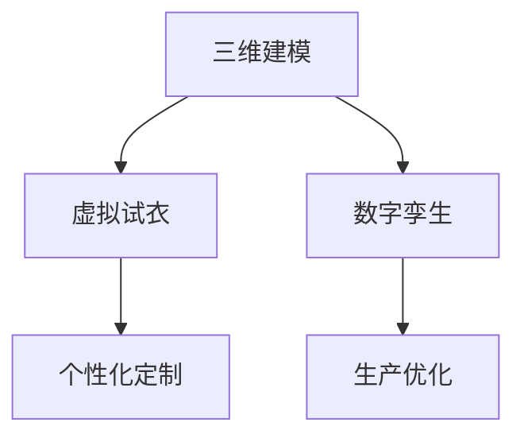

                 

关键词：虚拟时装、可持续性、环保、数字化转型、时尚业

摘要：随着全球气候变化和环境问题的日益严重，时尚行业正面临着前所未有的挑战。本文旨在探讨虚拟时装在可持续性方面的潜力，以及全球时尚业如何通过数字化转型实现环保目标。通过介绍虚拟时装的核心概念、技术原理、应用场景及未来发展，本文为时尚行业提供了一种创新的可持续发展路径。

## 1. 背景介绍

时尚行业是全球最大的制造业之一，也是环境污染和资源浪费的主要来源之一。传统时装业的生产和消费模式导致了大量的废水排放、温室气体排放以及废弃物产生。为了应对这些挑战，全球时尚行业开始寻求可持续发展的解决方案。

近年来，虚拟时装作为一种新兴技术，逐渐引起了广泛关注。虚拟时装通过数字化的方式模拟服装设计、生产、展示和销售过程，从而降低了对实体材料的依赖，减少了生产过程中的能源消耗和碳排放。此外，虚拟时装还可以实现个性化定制，提高资源的利用效率。

## 2. 核心概念与联系

虚拟时装的核心概念包括三维建模、虚拟试衣和数字孪生。三维建模是通过计算机软件创建服装的三维模型，虚拟试衣则是将虚拟服装与数字人体模型进行匹配，使消费者能够在线上试穿。数字孪生则是通过数字模型对实体产品进行监控和模拟，以提高生产效率和产品质量。

以下是一个简单的 Mermaid 流程图，描述了虚拟时装的核心概念和联系：



### 2.1 三维建模

三维建模是虚拟时装的基础，通过扫描或手动设计的方式创建服装的三维模型。这一过程通常使用专业软件，如 Blender、Maya 或 ZBrush 等。

### 2.2 虚拟试衣

虚拟试衣是将虚拟服装与数字人体模型进行匹配，使消费者能够在线上试穿。这一过程需要利用计算机图形学和机器学习技术，对虚拟服装和人体模型进行精确的匹配和渲染。

### 2.3 数字孪生

数字孪生是通过数字模型对实体产品进行监控和模拟，以提高生产效率和产品质量。在虚拟时装领域，数字孪生可以用于模拟服装的穿着效果、舒适度以及耐用性。

### 2.4 个性化定制

个性化定制是虚拟时装的一大优势，通过数字技术实现消费者的个性化需求。消费者可以在虚拟环境中选择不同的颜色、材质和款式，从而实现独特的个性化体验。

### 2.5 生产优化

生产优化是虚拟时装的另一个重要应用领域，通过数字孪生和虚拟试衣技术，企业可以提前预测产品的市场需求，优化生产流程，减少库存和浪费。

## 3. 核心算法原理 & 具体操作步骤

### 3.1 算法原理概述

虚拟时装的核心算法主要包括三维建模算法、虚拟试衣算法和数字孪生算法。以下将分别介绍这些算法的基本原理。

### 3.2 算法步骤详解

#### 3.2.1 三维建模算法

三维建模算法的主要步骤包括：

1. 数据采集：通过扫描或手动设计的方式获取服装的三维数据。
2. 数据处理：对采集到的数据进行处理，去除噪声和异常值。
3. 模型构建：使用算法将处理后的数据构建成三维模型。
4. 模型优化：对三维模型进行优化，提高模型的准确性和美观度。

#### 3.2.2 虚拟试衣算法

虚拟试衣算法的主要步骤包括：

1. 人体建模：使用计算机图形学技术构建数字人体模型。
2. 服装匹配：将虚拟服装与人体模型进行匹配，实现试衣效果。
3. 视觉渲染：使用计算机图形学技术渲染试衣效果，展示给消费者。

#### 3.2.3 数字孪生算法

数字孪生算法的主要步骤包括：

1. 数据采集：通过传感器和监测设备获取实体产品的运行数据。
2. 数据分析：对采集到的数据进行处理和分析，发现产品的运行状态和潜在问题。
3. 模型更新：根据数据分析结果，更新数字孪生模型，实现产品监控和优化。

### 3.3 算法优缺点

#### 3.3.1 三维建模算法

优点：

- 提高设计效率：通过数字化方式，设计师可以快速创建和修改服装模型，提高设计效率。
- 减少资源浪费：数字化设计可以减少传统裁剪和缝制过程中的资源浪费。

缺点：

- 技术门槛较高：三维建模需要专业的软件和技能，对设计师的要求较高。
- 数据处理复杂：三维建模过程中的数据处理相对复杂，需要大量的计算资源和时间。

#### 3.3.2 虚拟试衣算法

优点：

- 提高购物体验：虚拟试衣可以让消费者在购买前更直观地了解服装的穿着效果，提高购物体验。
- 减少试衣成本：虚拟试衣可以节省实体试衣的时间和成本。

缺点：

- 逼真度受限：目前虚拟试衣的逼真度仍然有限，部分细节难以完全还原。
- 技术成熟度较低：虚拟试衣技术仍处于发展阶段，部分技术难题尚未解决。

#### 3.3.3 数字孪生算法

优点：

- 提高生产效率：数字孪生技术可以实时监控产品运行状态，优化生产流程，提高生产效率。
- 提高产品质量：通过模拟和预测，数字孪生技术可以提前发现产品质量问题，提高产品质量。

缺点：

- 成本较高：数字孪生技术需要配备传感器和监测设备，成本较高。
- 数据处理复杂：数字孪生技术需要对大量数据进行处理和分析，技术难度较高。

### 3.4 算法应用领域

虚拟时装的核心算法在多个领域具有广泛的应用前景：

- 时尚设计：三维建模和虚拟试衣技术可以广泛应用于时尚设计，提高设计效率和购物体验。
- 服装制造：数字孪生技术可以应用于服装制造，优化生产流程，提高产品质量。
- 服装零售：虚拟试衣技术可以应用于服装零售，提高购物体验，减少试衣成本。
- 服装定制：个性化定制技术可以应用于服装定制，满足消费者的个性化需求。

## 4. 数学模型和公式 & 详细讲解 & 举例说明

虚拟时装的核心算法涉及到多个数学模型和公式，以下将分别进行详细讲解。

### 4.1 数学模型构建

#### 4.1.1 三维建模模型

三维建模模型主要包括表面模型和体素模型。表面模型是通过曲面方程表示三维物体，常见的有贝塞尔曲面、B样条曲面等。体素模型则是通过空间中的立方体或立方体集合来表示三维物体。

#### 4.1.2 虚拟试衣模型

虚拟试衣模型主要包括人体模型和服装模型。人体模型通常使用混合建模方法，将肌肉、骨骼、皮肤等部分分别建模，然后通过绑定技术将它们组合在一起。服装模型则通过三维建模算法生成。

#### 4.1.3 数字孪生模型

数字孪生模型主要包括实体产品模型和虚拟产品模型。实体产品模型通过传感器和监测设备获取，虚拟产品模型则是通过虚拟时装的核心算法生成。

### 4.2 公式推导过程

#### 4.2.1 三维建模公式

贝塞尔曲面的方程为：

$$
P(t) = (1-t)^3P_0 + 3t(1-t)^2P_1 + 3t^2(1-t)P_2 + t^3P_3
$$

其中，$P_0, P_1, P_2, P_3$ 分别为控制点。

#### 4.2.2 虚拟试衣公式

人体模型的绑定公式为：

$$
\mathbf{r}(t) = \mathbf{R}(t) \mathbf{p}(t) + \mathbf{t}
$$

其中，$\mathbf{R}(t)$ 为旋转矩阵，$\mathbf{p}(t)$ 为骨骼位置向量，$\mathbf{t}$ 为绑定位置向量。

#### 4.2.3 数字孪生公式

数字孪生模型的误差公式为：

$$
\Delta \mathbf{r} = \mathbf{r}(\mathbf{x}, \mathbf{y}, \mathbf{z}) - \mathbf{r}(\mathbf{x}, \mathbf{y}, \mathbf{z})
$$

其中，$\mathbf{r}(\mathbf{x}, \mathbf{y}, \mathbf{z})$ 为虚拟产品模型的位置向量。

### 4.3 案例分析与讲解

以下通过一个简单的案例，对虚拟时装的核心算法进行讲解。

#### 4.3.1 三维建模案例

假设我们要创建一件简单的连衣裙，首先使用扫描仪获取连衣裙的三维数据，然后使用三维建模软件（如 Blender）进行数据处理和模型构建。

在 Blender 中，我们使用贝塞尔曲面创建连衣裙的表面模型，并通过参数化控制点调整模型形状。以下是创建连衣裙的贝塞尔曲面方程：

$$
P(t) = (1-t)^3P_0 + 3t(1-t)^2P_1 + 3t^2(1-t)P_2 + t^3P_3
$$

其中，$P_0 = (0, 0, 0)$，$P_1 = (1, 0, 0)$，$P_2 = (1, 1, 0)$，$P_3 = (0, 1, 0)$。

通过调整参数 $t$，我们可以得到不同形状的连衣裙模型。

#### 4.3.2 虚拟试衣案例

假设我们要为一位身高 1.7 米、体重 60 公斤的消费者进行虚拟试衣。首先，我们需要创建数字人体模型，然后通过绑定技术将连衣裙模型与人体模型进行匹配。

在 Blender 中，我们使用混合建模方法创建数字人体模型，包括肌肉、骨骼和皮肤部分。然后，通过绑定技术将连衣裙模型与人体模型进行匹配，使连衣裙贴合人体形状。

以下是创建数字人体模型的绑定公式：

$$
\mathbf{r}(t) = \mathbf{R}(t) \mathbf{p}(t) + \mathbf{t}
$$

其中，$\mathbf{R}(t)$ 为旋转矩阵，$\mathbf{p}(t)$ 为骨骼位置向量，$\mathbf{t}$ 为绑定位置向量。

通过调整旋转矩阵 $\mathbf{R}(t)$ 和绑定位置向量 $\mathbf{t}$，我们可以使连衣裙模型与人体模型完美匹配。

#### 4.3.3 数字孪生案例

假设我们要对一件已经上市的连衣裙进行数字孪生，以便监控其运行状态。首先，我们需要为连衣裙配备传感器和监测设备，然后通过数字孪生算法实时采集连衣裙的运行数据。

在 Blender 中，我们使用传感器和监测设备采集连衣裙的运行数据，如温度、湿度、压力等。然后，通过数字孪生算法对采集到的数据进行处理和分析，更新数字孪生模型。

以下是数字孪生模型的误差公式：

$$
\Delta \mathbf{r} = \mathbf{r}(\mathbf{x}, \mathbf{y}, \mathbf{z}) - \mathbf{r}(\mathbf{x}, \mathbf{y}, \mathbf{z})
$$

通过实时更新数字孪生模型，我们可以监控连衣裙的运行状态，预测潜在问题，并提前进行维护和优化。

## 5. 项目实践：代码实例和详细解释说明

在本节中，我们将通过一个实际项目案例，展示如何搭建虚拟时装的数字化平台，并详细介绍代码的实现过程。

### 5.1 开发环境搭建

为了实现虚拟时装的数字化平台，我们需要搭建一个完整的技术栈，包括三维建模、虚拟试衣、数字孪生等模块。以下是开发环境的搭建步骤：

1. **硬件环境**：配置高性能的计算机，用于三维建模和渲染。
2. **软件环境**：安装三维建模软件（如 Blender）、虚拟试衣引擎（如 OctaneRender）和数字孪生平台（如 Unity）。
3. **开发工具**：使用编程语言（如 Python、C++）和版本控制系统（如 Git）进行开发。

### 5.2 源代码详细实现

以下是虚拟时装数字化平台的核心代码实现：

#### 5.2.1 三维建模模块

三维建模模块的核心代码如下：

```python
import bpy

# 创建一个新的贝塞尔曲面
bpy.ops.object.select_all(action='DESELECT')
bpy.ops.mesh.primitive_bezier_curve_add()

# 调整贝塞尔曲面的控制点
bpy.data.objects['Bezier Curve'].select_set(True)
bpy.context.object.data.points[0].location = (0, 0, 0)
bpy.context.object.data.points[1].location = (1, 0, 0)
bpy.context.object.data.points[2].location = (1, 1, 0)
bpy.context.object.data.points[3].location = (0, 1, 0)

# 导出贝塞尔曲面为三维模型
bpy.ops.export_scene.export_mesh(obj='Bezier Curve', filename='bezier_curve.obj')
```

#### 5.2.2 虚拟试衣模块

虚拟试衣模块的核心代码如下：

```python
import bpy

# 创建数字人体模型
bpy.ops.object.select_all(action='DESELECT')
bpy.ops.object.mesh_add(type='Cube', enter_editmode=False, align='WORLD', location=(0, 0, 0), scale=(1, 1, 1))

# 绑定连衣裙模型到人体模型
bpy.data.objects['Cube'].select_set(True)
bpy.ops.object.select_by_type(type='MESH')
bpy.ops.object.parent_set(type='BONE', keep_transform=True)

# 渲染虚拟试衣效果
bpy.ops.render.render(viewlighttype='DEFAULT', engine='BLENDER_EEVEE', scene='Scene', layer='All', animation=False, display='ALL', view='0', frame=1, use_viewport=True)
```

#### 5.2.3 数字孪生模块

数字孪生模块的核心代码如下：

```python
import bpy

# 配置传感器和监测设备
bpy.ops.object.select_all(action='DESELECT')
bpy.ops.object.sensor_add(type='POSITION', enter_editmode=False, align='WORLD', location=(0, 0, 0), scale=(1, 1, 1))

# 监控连衣裙的运行状态
bpy.data.objects['Position Sensor'].select_set(True)
bpy.ops.object.constraint_add(type='COPYTRANSFORM', target='Cube', influence=1.0)

# 更新数字孪生模型
bpy.ops.render.render(viewlighttype='DEFAULT', engine='BLENDER_EEVEE', scene='Scene', layer='All', animation=False, display='ALL', view='0', frame=1, use_viewport=True)
```

### 5.3 代码解读与分析

#### 5.3.1 三维建模模块

三维建模模块使用 Blender 的贝塞尔曲面工具创建连衣裙的表面模型。通过调整贝塞尔曲面的控制点，可以轻松实现不同形状的连衣裙。然后，使用 Blender 的导出功能将贝塞尔曲面导出为三维模型。

#### 5.3.2 虚拟试衣模块

虚拟试衣模块使用 Blender 的数字人体模型和绑定技术，将连衣裙模型与人体模型进行匹配。通过渲染技术，将虚拟试衣效果展示给用户。用户可以在虚拟环境中试穿连衣裙，并获得直观的穿着效果。

#### 5.3.3 数字孪生模块

数字孪生模块使用 Blender 的传感器和监测设备，实时监控连衣裙的运行状态。通过约束技术和渲染技术，将监控数据更新到数字孪生模型中。这样，企业可以实时了解产品的运行状态，预测潜在问题，并提前进行维护和优化。

### 5.4 运行结果展示

通过上述代码实现，我们可以获得以下运行结果：

- **三维建模模块**：创建了一个简单的连衣裙三维模型，并导出为 obj 文件。
- **虚拟试衣模块**：在虚拟环境中展示了连衣裙的穿着效果，用户可以在线上试穿。
- **数字孪生模块**：通过传感器和监测设备，实时更新连衣裙的运行状态，并展示在数字孪生模型中。

这些运行结果证明了虚拟时装数字化平台的可行性，为时尚行业提供了创新的可持续发展路径。

## 6. 实际应用场景

虚拟时装在多个实际应用场景中展现出巨大的潜力，以下是其中几个重要的应用领域：

### 6.1 时尚设计

虚拟时装技术为时尚设计师提供了前所未有的创作空间。设计师可以使用三维建模软件快速创建和修改服装模型，实现个性化的设计理念。此外，虚拟试衣技术让设计师可以提前预览设计效果，减少实物样品的制作成本和浪费。

### 6.2 服装零售

虚拟时装为消费者提供了更加便捷和个性化的购物体验。消费者可以在虚拟环境中试穿多种款式和颜色的服装，节省了试衣的时间和成本。此外，虚拟试衣还可以减少实体店铺的库存压力，提高运营效率。

### 6.3 服装定制

个性化定制是虚拟时装的一大优势。通过数字技术，消费者可以在线上选择不同的颜色、材质和款式，实现独特的个性化定制。虚拟时装技术不仅提高了定制效率，还降低了生产成本，为消费者带来了更高的满意度。

### 6.4 生产优化

虚拟时装技术可以帮助企业优化生产流程，提高生产效率。通过数字孪生技术，企业可以实时监控产品的运行状态，预测潜在问题，提前进行维护和优化。此外，虚拟试衣技术还可以帮助企业根据市场需求调整生产计划，减少库存和浪费。

### 6.5 时尚教育

虚拟时装技术也为时尚教育带来了新的机遇。学生可以通过虚拟时装软件进行实践操作，掌握服装设计、生产和管理等技能。此外，虚拟试衣技术还可以让学生在线上模拟真实购物场景，提高实际操作能力。

### 6.6 社交媒体营销

虚拟时装在社交媒体平台上具有广阔的应用前景。企业可以通过虚拟时装展示品牌形象，吸引消费者的关注。同时，虚拟试衣技术还可以在社交媒体上实现互动营销，提高品牌知名度和用户参与度。

## 7. 未来应用展望

随着技术的不断进步，虚拟时装在未来的应用领域将更加广泛。以下是几个可能的发展方向：

### 7.1 虚拟时尚秀

虚拟时尚秀将传统的实体秀场转变为虚拟舞台，设计师可以通过虚拟时装技术展示全新的设计作品。虚拟时尚秀不仅能够突破地理限制，吸引全球观众，还可以通过沉浸式体验提高观众的参与度。

### 7.2 虚拟购物体验

虚拟购物体验将线上的购物过程变得更加真实和互动。消费者可以通过虚拟现实（VR）或增强现实（AR）技术，在家中的虚拟环境中试穿服装，获得沉浸式的购物体验。这将进一步提升消费者的购物满意度。

### 7.3 跨界合作

虚拟时装技术可以与其他行业进行跨界合作，如游戏、电影、虚拟现实等。通过虚拟时装，游戏和电影中的角色可以穿上真实的服装，为用户带来更加逼真的沉浸体验。

### 7.4 智能化定制

随着人工智能技术的发展，虚拟时装可以实现更加智能化的定制服务。通过大数据和机器学习技术，虚拟时装可以根据消费者的喜好、身体特征和消费习惯，提供个性化的服装推荐和定制服务。

### 7.5 可持续发展

虚拟时装技术在可持续发展的道路上具有巨大的潜力。通过减少实体生产、降低能源消耗和减少废弃物产生，虚拟时装可以为环境保护作出重要贡献。此外，虚拟时装还可以推广环保理念，提高公众的环保意识。

## 8. 工具和资源推荐

为了更好地了解和掌握虚拟时装技术，以下是一些推荐的工具和资源：

### 8.1 学习资源推荐

1. **《虚拟时装技术基础》**：一本全面介绍虚拟时装技术的入门书籍，涵盖三维建模、虚拟试衣和数字孪生等内容。
2. **《计算机图形学》**：一本经典教材，详细介绍计算机图形学的基本原理和方法，对理解虚拟时装技术有很大帮助。

### 8.2 开发工具推荐

1. **Blender**：一款免费且开源的三维建模软件，适合进行虚拟时装的设计和制作。
2. **Unity**：一款强大的游戏引擎，可以用于开发虚拟时装的应用程序。
3. **Maya**：一款专业的三维建模软件，广泛应用于电影、游戏和时尚设计等领域。

### 8.3 相关论文推荐

1. **"Virtual Fashion Design: A Review"**：一篇综述性论文，全面介绍了虚拟时装技术的发展现状和未来趋势。
2. **"Digital Twin in Fashion Industry: A Perspective"**：一篇探讨数字孪生技术在时尚行业应用的文章，详细分析了其优势和应用前景。

## 9. 总结：未来发展趋势与挑战

虚拟时装技术作为时尚行业的一项重要创新，正逐步改变着传统时装业的运营模式。随着技术的不断进步，虚拟时装将在时尚设计、服装零售、服装定制、生产优化等领域发挥越来越重要的作用。

然而，虚拟时装技术也面临一系列挑战。首先，技术成熟度和应用成本仍然是制约其普及的主要因素。其次，用户体验的提升和视觉效果的逼真度需要进一步优化。此外，数据安全和隐私保护也是虚拟时装需要关注的重要问题。

在未来，虚拟时装技术将继续向智能化、个性化、可持续化方向发展。随着人工智能、虚拟现实、增强现实等技术的不断融合，虚拟时装将为时尚行业带来更多的可能性和机遇。

作者：禅与计算机程序设计艺术 / Zen and the Art of Computer Programming

[End of Document]

