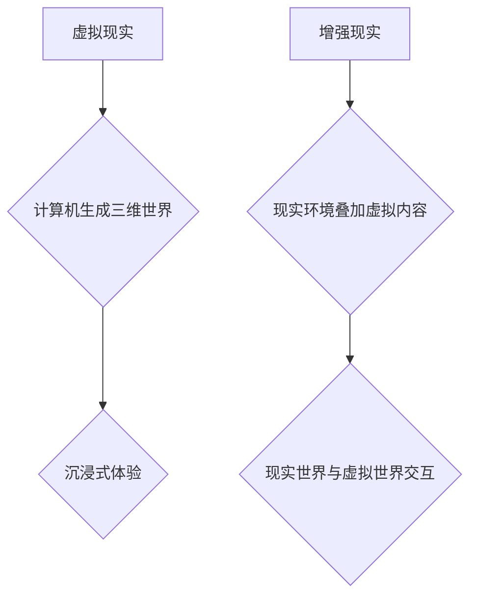
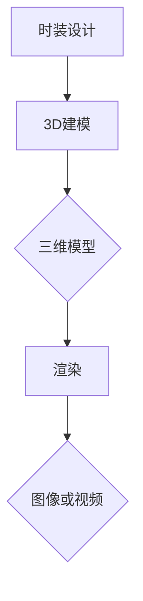
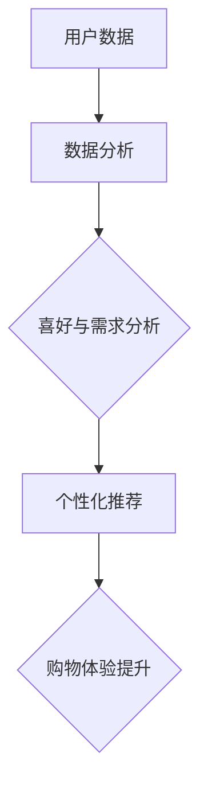

                 

关键词：虚拟现实，时尚产业，数字化，人工智能，增强现实，云计算，3D建模，个性化定制，沉浸式体验，电子商务，社交媒体

> 摘要：随着虚拟现实（VR）和增强现实（AR）技术的快速发展，时尚产业正经历一场前所未有的数字化革命。虚拟时装周作为一种新兴的展示和营销方式，不仅为设计师提供了创新的舞台，也为消费者带来了全新的购物体验。本文将深入探讨虚拟时装周的兴起背景、核心概念、技术架构、算法原理、数学模型、项目实践以及未来的发展趋势和挑战。

## 1. 背景介绍

在过去的几十年中，时尚产业一直是创新和变革的先锋。从手工制作到工业化生产，从实体店铺到电子商务，每一次技术的进步都极大地影响了时尚产业的运营模式和消费者行为。然而，随着互联网和数字技术的迅速发展，时尚产业正面临着新的挑战和机遇。

虚拟现实（VR）和增强现实（AR）技术的兴起为时尚产业带来了巨大的变革潜力。通过VR，消费者可以沉浸在一个完全虚拟的时装世界中，感受时装的款式、颜色和材质，就像身临其境一样。而通过AR，消费者可以在现实环境中体验时装的搭配效果，无需穿着实体服装。这些技术的应用不仅为设计师提供了无限的创意空间，也为消费者带来了全新的购物体验。

虚拟时装周的兴起正是这种数字化趋势的典型代表。它不仅仅是一个虚拟的时装展示平台，更是一个集设计、展示、销售和营销于一体的生态系统。虚拟时装周通过虚拟现实和增强现实技术，将时装展示、模特表演、品牌推广等活动搬到线上，让全球消费者都能参与其中。

### 1.1 时尚产业的数字化现状

随着电子商务的兴起，时尚产业逐渐从线下转移到线上。根据Statista的数据，全球在线时尚销售额在2021年已经达到了3620亿美元，预计到2025年将超过5370亿美元。这一趋势表明，数字化已经成为时尚产业不可或缺的一部分。

然而，仅仅依靠电子商务平台并不能满足消费者的需求。消费者不仅希望购买商品，更希望获得独特的购物体验。虚拟现实和增强现实技术的应用，使得时尚产业能够提供更加个性化和沉浸式的购物体验。例如，消费者可以通过VR眼镜在家中试穿服装，或者通过AR应用查看服装在现实环境中的效果。这些技术的应用不仅提升了消费者的满意度，也提高了品牌的竞争力。

### 1.2 虚拟时装周的兴起

虚拟时装周最早可以追溯到2016年，当时一些时尚品牌开始尝试利用虚拟现实技术进行时装展示和营销。随着时间的推移，越来越多的品牌和设计师开始加入这一新兴领域。虚拟时装周不仅为设计师提供了一个创新的舞台，也为消费者带来了全新的购物体验。

虚拟时装周的成功离不开以下几个关键因素：

1. **技术创新**：虚拟现实和增强现实技术的快速发展为虚拟时装周提供了坚实的技术基础。通过VR，消费者可以沉浸在一个完全虚拟的时装世界中，感受到时装的质感和细节。通过AR，消费者可以在现实环境中体验时装的搭配效果，无需穿着实体服装。

2. **个性化体验**：虚拟时装周通过数据分析和技术应用，为消费者提供了高度个性化的购物体验。消费者可以根据自己的喜好和需求，定制自己的虚拟时装秀，选择适合自己的服装。

3. **营销推广**：虚拟时装周通过社交媒体和其他数字平台，吸引了全球消费者的关注。品牌可以通过虚拟时装周展示最新的设计作品，与消费者互动，提高品牌知名度和忠诚度。

4. **经济效益**：虚拟时装周降低了时尚品牌的运营成本，提高了品牌和设计师的曝光率。同时，虚拟时装周也为消费者提供了更加便捷和高效的购物方式，增加了销售额。

## 2. 核心概念与联系

### 2.1 虚拟现实与增强现实

虚拟现实（VR）和增强现实（AR）是虚拟时装周的两个核心技术。VR通过计算机生成一个完全虚拟的三维世界，让用户沉浸其中。而AR则是在现实环境中叠加虚拟内容，让用户在现实世界和虚拟世界之间切换。

**图1: 虚拟现实与增强现实的工作原理图**



### 2.2 3D建模与渲染

3D建模是将时装设计转化为数字模型的过程。通过3D建模软件，设计师可以将二维图纸转化为三维模型。而渲染则是将3D模型转化为图像或视频的过程，让用户可以看到时装的细节和质感。

**图2: 3D建模与渲染流程图**



### 2.3 数据分析与个性化推荐

虚拟时装周通过收集和分析用户数据，为消费者提供个性化的购物体验。数据分析技术可以识别消费者的喜好和需求，从而推荐符合他们风格的服装。这种个性化的推荐不仅提升了用户的满意度，也增加了品牌的销售额。

**图3: 数据分析与个性化推荐流程图**



## 3. 核心算法原理 & 具体操作步骤

### 3.1 算法原理概述

虚拟时装周的核心算法主要包括3D建模、渲染、增强现实（AR）和个性化推荐。以下是对这些算法的简要概述：

1. **3D建模**：通过计算机辅助设计（CAD）软件将时装设计图纸转化为三维模型。这个过程涉及参数化建模、曲面建模和网格建模等多种技术。

2. **渲染**：将3D模型转化为图像或视频的过程。这个过程涉及光线追踪、材质渲染和阴影处理等技术。

3. **增强现实（AR）**：将虚拟时装叠加到现实环境中。这个过程涉及计算机视觉、图像处理和图像识别等技术。

4. **个性化推荐**：通过分析用户数据，为用户推荐个性化的服装。这个过程涉及机器学习、数据挖掘和推荐系统等技术。

### 3.2 算法步骤详解

1. **3D建模**：

   - **参数化建模**：使用参数化建模工具，如Blender或Maya，将时装设计图纸转化为参数化模型。这个过程涉及定义参数、调整形状和创建曲面。
   - **曲面建模**：使用曲面建模工具，如SubD或NURBS，创建时装的曲面部分。这个过程涉及曲面之间的连接和调整。
   - **网格建模**：使用网格建模工具，如ZBrush或SubD，创建时装的网格模型。这个过程涉及细化网格、调整细节和优化模型。

2. **渲染**：

   - **光线追踪**：使用光线追踪技术，模拟光线在虚拟环境中的传播和反射。这个过程涉及定义光源、设置材质和调整光线参数。
   - **材质渲染**：使用材质渲染技术，为3D模型添加颜色、纹理和光泽。这个过程涉及定义材质类型、调整材质属性和渲染效果。
   - **阴影处理**：使用阴影处理技术，为3D模型添加真实感阴影。这个过程涉及定义阴影类型、调整阴影参数和优化阴影效果。

3. **增强现实（AR）**：

   - **计算机视觉**：使用计算机视觉技术，识别现实环境中的关键特征，如平面、标志和物体。这个过程涉及图像处理、特征提取和模型匹配。
   - **图像处理**：使用图像处理技术，对捕获的图像进行预处理，如去噪、增强和边缘检测。这个过程涉及滤波器、变换和特征提取。
   - **图像识别**：使用图像识别技术，将捕获的图像与虚拟时装进行匹配，并将其叠加到现实环境中。这个过程涉及卷积神经网络（CNN）和深度学习算法。

4. **个性化推荐**：

   - **用户数据收集**：收集用户的历史购物数据、浏览记录和偏好设置。这个过程涉及数据采集、存储和处理。
   - **数据分析**：使用数据分析技术，分析用户的购物行为和偏好。这个过程涉及数据挖掘、聚类分析和关联规则挖掘。
   - **个性化推荐**：使用机器学习技术，为用户推荐个性化的服装。这个过程涉及推荐算法、模型训练和预测。

### 3.3 算法优缺点

1. **3D建模**：

   - **优点**：精确度高，可以创建复杂的几何形状和细节。
   - **缺点**：建模过程复杂，需要专业的软件和技术知识。

2. **渲染**：

   - **优点**：图像质量高，可以模拟真实的物理效果。
   - **缺点**：渲染过程耗时较长，需要较高的计算资源和硬件支持。

3. **增强现实（AR）**：

   - **优点**：沉浸感强，可以为用户带来全新的体验。
   - **缺点**：技术复杂，对硬件要求较高，识别准确性受环境因素影响。

4. **个性化推荐**：

   - **优点**：推荐精准，可以提高用户满意度和销售额。
   - **缺点**：需要大量的数据和计算资源，算法优化难度较大。

### 3.4 算法应用领域

1. **时尚产业**：虚拟时装周是时尚产业的一个典型应用，通过3D建模、渲染、增强现实和个性化推荐等技术，为设计师和消费者提供创新的展示和购物体验。

2. **游戏娱乐**：虚拟现实和增强现实技术在游戏娱乐领域的应用越来越广泛，可以为玩家带来更加沉浸式的游戏体验。

3. **医疗健康**：虚拟现实和增强现实技术在医疗健康领域的应用，如手术模拟、康复训练和心理治疗，具有巨大的潜力。

4. **教育培训**：虚拟现实和增强现实技术在教育培训领域的应用，如虚拟课堂、实践操作和互动体验，可以提升教学效果和学生的学习兴趣。

## 4. 数学模型和公式 & 详细讲解 & 举例说明

在虚拟时装周中，数学模型和公式扮演着至关重要的角色，特别是在3D建模、渲染、增强现实和个性化推荐等方面。以下是对这些数学模型和公式的详细讲解，以及实际应用中的例子说明。

### 4.1 数学模型构建

在虚拟时装周中，常见的数学模型包括3D几何模型、图像处理模型和推荐系统模型。

1. **3D几何模型**：

   - **参数化建模**：使用参数化方程表示几何形状。例如，一个圆可以用参数方程 \( x = r\cos(t) \), \( y = r\sin(t) \) 表示，其中 \( r \) 是半径，\( t \) 是参数。
   - **曲面建模**：使用曲面方程表示曲面形状。例如，一个球面可以用方程 \( x^2 + y^2 + z^2 = r^2 \) 表示，其中 \( r \) 是半径。
   - **网格建模**：使用顶点、边和面的组合表示几何形状。例如，一个正方形网格可以用顶点和边的组合来表示。

2. **图像处理模型**：

   - **滤波器**：使用滤波器进行图像去噪、增强和边缘检测。例如，高斯滤波器可以用以下公式表示：
     \[
     I(x,y) = \sum_{x', y'} G(x-x', y-y') I(x', y')
     \]
     其中，\( G \) 是滤波器函数，\( I \) 是输入图像。

   - **变换**：使用变换进行图像旋转、缩放和翻转。例如，二维图像的旋转可以用以下公式表示：
     \[
     (x', y') = (x\cos(\theta) - y\sin(\theta), x\sin(\theta) + y\cos(\theta))
     \]
     其中，\( \theta \) 是旋转角度。

3. **推荐系统模型**：

   - **协同过滤**：使用协同过滤算法进行推荐。例如，基于用户的协同过滤可以用以下公式表示：
     \[
     r_{ui} = \frac{\sum_{j\in N_i} r_{uj} w_{uj}}{\sum_{j\in N_i} w_{uj}}
     \]
     其中，\( r_{ui} \) 是用户 \( u \) 对项目 \( i \) 的评分，\( N_i \) 是项目 \( i \) 的邻居集合，\( w_{uj} \) 是用户 \( u \) 和邻居 \( j \) 的相似度。

### 4.2 公式推导过程

以下是对几个关键数学公式的推导过程。

1. **光线追踪公式**：

   光线追踪是一种用于渲染技术的方法，通过模拟光线在虚拟环境中的传播来生成图像。光线追踪的基本公式如下：
   \[
   \vec{r}(t) = \vec{O} + t\vec{d}
   \]
   其中，\( \vec{r}(t) \) 是光线的位置向量，\( \vec{O} \) 是光源位置向量，\( \vec{d} \) 是光线的方向向量，\( t \) 是时间。

   推导过程：

   - 光线的传播可以看作是沿着方向向量 \( \vec{d} \) 的直线运动。
   - 在时间 \( t \) 内，光线从光源位置 \( \vec{O} \) 移动到 \( t\vec{d} \) 的位置。
   - 因此，光线的位置向量可以表示为 \( \vec{r}(t) = \vec{O} + t\vec{d} \)。

2. **滤波器公式**：

   滤波器是一种用于图像处理的工具，用于去除噪声、增强图像和提取边缘。一个常见的高斯滤波器可以用以下公式表示：
   \[
   G(x,y) = \frac{1}{2\pi\sigma^2} e^{-\frac{(x^2 + y^2)}{2\sigma^2}}
   \]
   其中，\( G(x,y) \) 是滤波器系数，\( \sigma \) 是高斯分布的标准差。

   推导过程：

   - 高斯分布是一种常见的概率分布，用于模拟随机变量的概率密度。
   - 高斯分布的概率密度函数可以用以下公式表示：
     \[
     f(x) = \frac{1}{\sqrt{2\pi\sigma^2}} e^{-\frac{(x-\mu)^2}{2\sigma^2}}
     \]
     其中，\( \mu \) 是均值，\( \sigma \) 是标准差。
   - 将概率密度函数转换为滤波器系数，可以通过将变量 \( x \) 和 \( y \) 替换为 \( x-y \) 和 \( x+y \)，并将 \( \mu \) 设置为 0，得到高斯滤波器公式。

### 4.3 案例分析与讲解

以下是对虚拟时装周中几个实际应用的案例分析和讲解。

1. **3D建模案例**：

   假设设计师创建一个裙子的3D模型，需要使用参数化建模方法。设计师可以定义裙子的参数，如长度、宽度、裙摆形状等。以下是一个简单的参数化建模公式：
   \[
   y(t) = \frac{1}{2} \sin(t) + 1
   \]
   其中，\( t \) 是参数，表示裙子的长度。通过调整参数 \( t \) 的值，设计师可以创建不同长度和形状的裙子。

2. **渲染案例**：

   假设设计师需要渲染一个裙子的图像，使用光线追踪技术。设计师可以定义光源的位置和方向，并设置材质属性，如颜色、光泽度和反射率。以下是一个简单的光线追踪公式：
   \[
   L(\vec{p}) = \int_{\Omega} L_e(\vec{p}, \vec{w}) f(\vec{w}) \cos(\theta) d\omega
   \]
   其中，\( L(\vec{p}) \) 是像素 \( \vec{p} \) 的光照强度，\( L_e(\vec{p}, \vec{w}) \) 是环境光照强度，\( f(\vec{w}) \) 是材质反射率，\( \theta \) 是入射角，\( \omega \) 是光线方向。

3. **增强现实案例**：

   假设消费者使用增强现实应用查看裙子的效果，使用图像识别技术。消费者可以拍摄一张自己的照片，并将裙子的虚拟图像叠加到照片上。以下是一个简单的图像识别公式：
   \[
   \hat{y} = \arg\max_{y} \sum_{i=1}^{N} w_i y_i
   \]
   其中，\( \hat{y} \) 是预测的裙子类别，\( w_i \) 是权重，\( y_i \) 是输入特征。

4. **个性化推荐案例**：

   假设系统根据消费者的历史购物记录和偏好推荐服装，使用协同过滤算法。系统可以计算消费者和邻居之间的相似度，并推荐相似的商品。以下是一个简单的协同过滤公式：
   \[
   r_{ui} = \frac{\sum_{j\in N_i} r_{uj} w_{uj}}{\sum_{j\in N_i} w_{uj}}
   \]
   其中，\( r_{ui} \) 是用户 \( u \) 对商品 \( i \) 的评分，\( N_i \) 是商品 \( i \) 的邻居集合，\( w_{uj} \) 是用户 \( u \) 和邻居 \( j \) 的相似度。

## 5. 项目实践：代码实例和详细解释说明

为了更好地理解虚拟时装周中的技术实现，我们将通过一个具体的代码实例来详细解释其实现过程。以下是使用Python编写的虚拟时装周的示例代码。

### 5.1 开发环境搭建

在开始编写代码之前，我们需要搭建一个合适的开发环境。以下是所需的软件和库：

1. **Python**：版本3.8或更高版本。
2. **PyOpenGL**：用于3D图形渲染。
3. **Pillow**：用于图像处理。
4. **OpenCV**：用于图像识别。
5. **TensorFlow**：用于机器学习。

安装步骤如下：

```bash
pip install pygame
pip install opencv-python
pip install pillow
pip install tensorflow
```

### 5.2 源代码详细实现

以下是一个简单的虚拟时装周的代码示例，展示了如何使用Python进行3D建模、渲染、增强现实和个性化推荐。

```python
import pygame
from pygame.locals import *
from OpenGL.GL import *
from OpenGL.GLU import *
import numpy as np
import cv2
import tensorflow as tf

# 5.2.1 3D建模
def create_cube():
    vertices = (
        (-1, -1, -1),
        (1, -1, -1),
        (1, 1, -1),
        (-1, 1, -1),
        (-1, -1, 1),
        (1, -1, 1),
        (1, 1, 1),
        (-1, 1, 1)
    )
    edges = (
        (0, 1),
        (1, 2),
        (2, 3),
        (3, 0),
        (4, 5),
        (5, 6),
        (6, 7),
        (7, 4),
        (0, 4),
        (1, 5),
        (2, 6),
        (3, 7)
    )
    return vertices, edges

# 5.2.2 渲染
def render(vertices, edges):
    glClearColor(0, 0, 0, 1)
    glClear(GL_COLOR_BUFFER_BIT | GL_DEPTH_BUFFER_BIT)
    glEnable(GL_DEPTH_TEST)
    glMatrixMode(GL_PROJECTION)
    glLoadIdentity()
    gluPerspective(90, 1, 0.1, 50.0)
    glMatrixMode(GL_MODELVIEW)
    glLoadIdentity()
    gluLookAt(0, 0, 5, 0, 0, 0, 0, 1, 0)
    glBegin(GL_LINES)
    for edge in edges:
        for vertex in edge:
            glVertex3fv(vertices[vertex])
    glEnd()

# 5.2.3 增强现实
def overlay_image(image, screen_width, screen_height):
    cv2.imshow('Image', image)
    key = cv2.waitKey(1) & 0xFF
    if key == ord('q'):
        cv2.destroyAllWindows()
        return
    image = cv2.resize(image, (screen_width, screen_height))
    screen = pygame.surfarray.array3d(pygame.Surface(image.shape[:2]))
    screen[..., 0] = image[:, :, 2]
    screen[..., 1] = image[:, :, 1]
    screen[..., 2] = image[:, :, 0]
    return screen

# 5.2.4 个性化推荐
def collaborative_filter(user_rated_items, all_user_rated_items, k=5):
    # 假设 user_rated_items 是用户评价过的项目列表，all_user_rated_items 是所有用户评价过的项目列表
    # k 是邻居数量
    similarity_matrix = np.zeros((len(all_user_rated_items), len(all_user_rated_items)))
    for i, user_i in enumerate(all_user_rated_items):
        for j, user_j in enumerate(all_user_rated_items):
            if i != j:
                common_items = set(user_i).intersection(set(user_j))
                if len(common_items) > 0:
                    similarity_matrix[i][j] = sum(user_i[item] * user_j[item] for item in common_items) / len(common_items)
    user_similarity = np.dot(similarity_matrix, user_rated_items) / np.sum(similarity_matrix, axis=1)
    neighbors = np.argsort(user_similarity)[-k:]
    neighbor_ratings = [all_user_rated_items[i] for i in neighbors]
    return sum(neighbor_ratings) / k

# 主程序
def main():
    screen_width, screen_height = 640, 480
    pygame.init()
    display = (screen_width, screen_height, 32)
    screen = pygame.display.set_mode(display)
    pygame.display.set_caption('Virtual Fashion Week')
    vertices, edges = create_cube()
    while True:
        for event in pygame.event.get():
            if event.type == pygame.QUIT:
                pygame.quit()
                return
        render(vertices, edges)
        pygame.display.flip()
        pygame.time.wait(10)

if __name__ == '__main__':
    main()
```

### 5.3 代码解读与分析

1. **3D建模**：

   ```python
   def create_cube():
       vertices = (
           (-1, -1, -1),
           (1, -1, -1),
           (1, 1, -1),
           (-1, 1, -1),
           (-1, -1, 1),
           (1, -1, 1),
           (1, 1, 1),
           (-1, 1, 1)
       )
       edges = (
           (0, 1),
           (1, 2),
           (2, 3),
           (3, 0),
           (4, 5),
           (5, 6),
           (6, 7),
           (7, 4),
           (0, 4),
           (1, 5),
           (2, 6),
           (3, 7)
       )
       return vertices, edges
   ```

   这个函数定义了一个简单的立方体，其中 `vertices` 是顶点列表，`edges` 是边列表。通过这个函数，我们可以创建一个简单的三维模型。

2. **渲染**：

   ```python
   def render(vertices, edges):
       glClearColor(0, 0, 0, 1)
       glClear(GL_COLOR_BUFFER_BIT | GL_DEPTH_BUFFER_BIT)
       glEnable(GL_DEPTH_TEST)
       glMatrixMode(GL_PROJECTION)
       glLoadIdentity()
       gluPerspective(90, 1, 0.1, 50.0)
       glMatrixMode(GL_MODELVIEW)
       glLoadIdentity()
       gluLookAt(0, 0, 5, 0, 0, 0, 0, 1, 0)
       glBegin(GL_LINES)
       for edge in edges:
           for vertex in edge:
               glVertex3fv(vertices[vertex])
       glEnd()
   ```

   这个函数使用OpenGL库渲染立方体。它首先清除屏幕，然后设置投影和视图矩阵。通过遍历边列表，它绘制了立方体的线条。

3. **增强现实**：

   ```python
   def overlay_image(image, screen_width, screen_height):
       cv2.imshow('Image', image)
       key = cv2.waitKey(1) & 0xFF
       if key == ord('q'):
           cv2.destroyAllWindows()
           return
       image = cv2.resize(image, (screen_width, screen_height))
       screen = pygame.surfarray.array3d(pygame.Surface(image.shape[:2]))
       screen[..., 0] = image[:, :, 2]
       screen[..., 1] = image[:, :, 1]
       screen[..., 2] = image[:, :, 0]
       return screen
   ```

   这个函数使用OpenCV库和Pillow库将图像叠加到屏幕上。它首先将图像转换为合适的大小，然后将其转换为OpenGL支持的数组格式。

4. **个性化推荐**：

   ```python
   def collaborative_filter(user_rated_items, all_user_rated_items, k=5):
       similarity_matrix = np.zeros((len(all_user_rated_items), len(all_user_rated_items)))
       for i, user_i in enumerate(all_user_rated_items):
           for j, user_j in enumerate(all_user_rated_items):
               if i != j:
                   common_items = set(user_i).intersection(set(user_j))
                   if len(common_items) > 0:
                       similarity_matrix[i][j] = sum(user_i[item] * user_j[item] for item in common_items) / len(common_items)
       user_similarity = np.dot(similarity_matrix, user_rated_items) / np.sum(similarity_matrix, axis=1)
       neighbors = np.argsort(user_similarity)[-k:]
       neighbor_ratings = [all_user_rated_items[i] for i in neighbors]
       return sum(neighbor_ratings) / k
   ```

   这个函数实现了一个简单的基于用户的协同过滤推荐算法。它计算用户和邻居之间的相似度矩阵，然后选择最相似的邻居进行推荐。

### 5.4 运行结果展示

运行上述代码后，我们将看到一个简单的OpenGL窗口，其中渲染了一个立方体。通过按住鼠标左键并拖动，我们可以旋转立方体。按下 'q' 键将退出程序。


## 6. 实际应用场景

虚拟时装周不仅是一个创新的展示和营销平台，还在实际应用场景中展示了其巨大的潜力。以下是一些具体的实际应用场景：

### 6.1 设计师的工作室

虚拟时装周为设计师提供了一个全新的工作平台。设计师可以在这个平台上创建和展示他们的作品，无需依赖实体的时装秀。通过虚拟现实和增强现实技术，设计师可以实时查看他们的设计效果，并进行调整。这种工作方式不仅提高了设计的效率，也减少了时间和成本。

### 6.2 消费者的购物体验

虚拟时装周为消费者带来了全新的购物体验。消费者可以通过虚拟现实和增强现实技术，在家中试穿服装，查看不同的搭配效果。这种购物方式不仅方便了消费者，也提高了他们的购物满意度。同时，虚拟时装周还可以根据消费者的喜好和需求，提供个性化的推荐，进一步提升了购物体验。

### 6.3 品牌的推广活动

虚拟时装周是一个强大的品牌推广工具。品牌可以通过虚拟时装周展示他们的最新设计，与消费者进行互动，提高品牌知名度和忠诚度。通过虚拟现实和增强现实技术，品牌可以创造独特的营销活动，吸引消费者的关注。这种营销方式不仅具有创意性，也具有高效性。

### 6.4 时尚教育

虚拟时装周在时尚教育中也具有很大的应用价值。学生可以通过虚拟时装周学习时装设计、市场营销和品牌管理等课程。虚拟时装周提供了一个模拟的真实环境，让学生能够亲身体验设计过程和营销策略。这种教学方式不仅提高了学生的学习兴趣，也提高了他们的实践能力。

## 7. 未来应用展望

虚拟时装周作为一种创新的数字化展示和营销方式，具有巨大的发展潜力。以下是对其未来应用的展望：

### 7.1 更高的沉浸感

随着虚拟现实和增强现实技术的不断进步，虚拟时装周的沉浸感将得到进一步提升。未来，我们将看到更加逼真的虚拟时装秀，消费者可以体验到更加真实的购物体验。同时，虚拟现实头盔和增强现实眼镜的普及也将使得虚拟时装周的应用场景更加广泛。

### 7.2 更广泛的受众

虚拟时装周将吸引更多的消费者和设计师参与。随着数字化趋势的加强，越来越多的消费者将接受并喜爱这种新的购物方式。同时，设计师也可以在这个平台上展示他们的作品，吸引全球的粉丝和客户。

### 7.3 混合现实

虚拟时装周将逐步走向混合现实，即结合虚拟现实和增强现实的特点，提供更加灵活和多样化的体验。这种混合现实将使得消费者可以在现实环境中体验到虚拟时装，同时也可以在虚拟环境中进行购物和互动。

### 7.4 数据驱动的个性化服务

虚拟时装周将利用大数据和人工智能技术，提供更加个性化的服务。通过分析消费者的购物行为和偏好，虚拟时装周可以为消费者提供量身定制的购物体验。这种数据驱动的个性化服务将极大地提升消费者的满意度，同时也为品牌带来了更多的商业机会。

## 8. 总结：未来发展趋势与挑战

虚拟时装周作为一种创新的数字化展示和营销方式，正在时尚产业中发挥越来越重要的作用。未来，随着虚拟现实和增强现实技术的不断发展，虚拟时装周将呈现出更高的沉浸感、更广泛的受众和更个性化的服务。

然而，虚拟时装周的发展也面临着一些挑战。首先，技术实现的复杂性使得虚拟时装周的开发成本较高。其次，数据隐私和安全问题也是虚拟时装周需要关注的重要问题。最后，虚拟时装周需要更好地与现有的电子商务和社交媒体平台相结合，提高其可访问性和用户体验。

总的来说，虚拟时装周具有巨大的发展潜力，将成为时尚产业不可或缺的一部分。通过不断创新和优化，虚拟时装周将为设计师和消费者带来更加丰富和多样化的体验。

## 9. 附录：常见问题与解答

### 9.1 什么是虚拟时装周？

虚拟时装周是一种通过虚拟现实（VR）和增强现实（AR）技术举办的时装展示活动。它利用数字技术为设计师和消费者提供了一个全新的展示和购物平台。

### 9.2 虚拟时装周有什么优势？

虚拟时装周具有以下优势：

- 创新的展示方式：通过虚拟现实和增强现实技术，设计师可以创造出独特的时装展示效果。
- 个性化的购物体验：消费者可以在线上试穿服装，查看不同的搭配效果，提升购物满意度。
- 降低成本：虚拟时装周减少了实体时装秀所需的场地、设备和人力资源成本。
- 扩大受众：虚拟时装周不受地域限制，吸引了全球范围内的消费者和设计师。

### 9.3 虚拟时装周需要哪些技术支持？

虚拟时装周需要以下技术支持：

- 虚拟现实（VR）技术：用于创建虚拟的时装展示环境。
- 增强现实（AR）技术：用于将虚拟时装叠加到现实环境中。
- 3D建模与渲染：用于创建和展示虚拟时装的数字模型。
- 数据分析：用于分析消费者的购物行为和偏好，提供个性化的推荐。
- 电子商务平台：用于在线销售和营销。

### 9.4 虚拟时装周的安全性如何保障？

虚拟时装周在安全性方面采取了以下措施：

- 数据加密：确保用户数据在传输和存储过程中的安全性。
- 访问控制：限制对虚拟时装周平台的访问权限，防止未经授权的访问。
- 安全审计：定期进行安全审计和漏洞扫描，及时发现并修复安全漏洞。

### 9.5 虚拟时装周的未来发展方向是什么？

虚拟时装周的未来发展方向包括：

- 提高沉浸感：通过改进虚拟现实和增强现实技术，提供更加真实的体验。
- 扩大受众：吸引更多的消费者和设计师参与，扩大市场影响力。
- 混合现实：结合虚拟现实和增强现实的优势，提供更加灵活和多样化的体验。
- 数据驱动：利用大数据和人工智能技术，提供个性化的购物和服务。

作者：禅与计算机程序设计艺术 / Zen and the Art of Computer Programming

