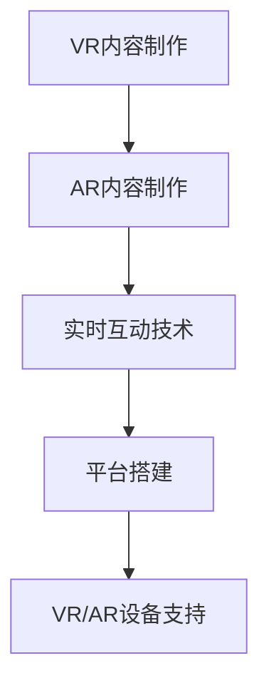

                 

关键词：虚拟时装周、数字化、时尚产业、人工智能、VR、增强现实

> 摘要：本文将探讨虚拟时装周在当今时尚产业中的崛起和影响。通过分析其技术原理、核心算法、数学模型以及实际应用案例，我们揭示了虚拟时装周如何推动时尚产业向数字化、智能化的方向发展，并展望了其未来的发展趋势和挑战。

## 1. 背景介绍

### 虚拟时装周的起源与发展

虚拟时装周（Virtual Fashion Week）是指通过虚拟现实（VR）和增强现实（AR）技术，将传统的时装周活动搬上数字平台，让全球时尚界人士和消费者能够以全新的方式体验时装秀。这一概念的兴起可以追溯到2010年代初期，当时随着VR和AR技术的快速发展，人们开始探索如何在数字世界中创造逼真的时装展示。

最初的虚拟时装周仅限于线上展示，通过直播和视频平台传播。然而，随着技术的不断进步，虚拟时装周逐渐具备了更多的互动性和沉浸感。例如，通过VR技术，观众可以身临其境地参观时装秀现场，与设计师和模特互动。而AR技术则允许设计师在虚拟环境中实时展示他们的作品，为观众提供更为直观的视觉体验。

### 虚拟时装周在全球时尚产业的影响

虚拟时装周的兴起不仅改变了传统时装周的形式，还对全球时尚产业产生了深远的影响。首先，它打破了地理和时间的限制，使时尚界能够更快速地传播流行趋势和品牌信息。传统时装周通常只能在特定时间和地点举行，而虚拟时装周则可以全天候、全球范围内进行，大大提升了时尚品牌的曝光率和影响力。

其次，虚拟时装周为消费者提供了更多的参与机会。通过VR和AR技术，消费者可以更深入地了解设计师的创作理念和作品细节，甚至参与到时装设计的互动中。这种全新的购物体验不仅提升了消费者的满意度，也增加了品牌与消费者之间的互动和黏性。

此外，虚拟时装周还为设计师提供了更多的展示平台。传统的时装秀通常需要高昂的成本和复杂的人员组织，而虚拟时装周则大大降低了这些门槛，使得更多的设计师能够有机会将自己的作品展示给全球观众。

## 2. 核心概念与联系

### 虚拟现实（VR）与增强现实（AR）

虚拟现实（VR）和增强现实（AR）是虚拟时装周的核心技术。VR技术通过创建一个完全虚拟的环境，使人们能够在其中沉浸和互动。而AR技术则是在现实环境中叠加虚拟元素，使现实世界和虚拟世界相结合。

### VR和AR在虚拟时装周中的应用

在虚拟时装周中，VR技术主要用于创建虚拟时装秀现场，让观众能够身临其境地观看时装秀。通过VR头盔，观众可以感受到现场的氛围，与模特互动，甚至参与到秀场的布置中。而AR技术则用于设计师的作品展示，通过在现实环境中叠加虚拟时装，设计师可以更直观地展示他们的设计理念和细节。

### 虚拟时装周的技术架构

虚拟时装周的技术架构主要包括以下几个部分：

1. **VR内容制作**：包括场景搭建、虚拟模特制作、灯光效果等，这些都需要高精度的三维建模和渲染技术。
2. **AR内容制作**：包括虚拟时装的叠加、现实环境的识别与处理，这些需要图像处理和计算机视觉技术。
3. **实时互动技术**：包括用户与虚拟模特的互动、观众投票等，这些需要实时数据传输和实时计算技术。
4. **平台搭建**：包括网站、应用程序和VR/AR设备的支持，这些需要Web技术、移动应用开发和硬件集成技术。

### Mermaid 流程图

下面是一个简化的Mermaid流程图，展示了虚拟时装周的技术架构：



## 3. 核心算法原理 & 具体操作步骤

### 3.1 算法原理概述

虚拟时装周的核心算法主要包括三维建模、图像处理和实时计算技术。以下是这些算法的基本原理：

- **三维建模**：通过计算机图形学技术，创建三维虚拟时装和场景。这包括几何建模、纹理映射和光照计算等。
- **图像处理**：使用图像处理技术，对现实环境中的图像进行识别和处理，以叠加虚拟时装。这包括图像识别、图像分割和图像增强等。
- **实时计算**：在虚拟时装周活动中，实时处理大量数据，包括用户互动、场景渲染和效果计算等。这需要高效的算法和优化技术。

### 3.2 算法步骤详解

以下是虚拟时装周的核心算法的具体操作步骤：

1. **三维建模**：
    - **几何建模**：使用三维建模软件，如Blender或Maya，创建虚拟时装的三维模型。
    - **纹理映射**：为虚拟时装添加纹理，使其外观更加真实。
    - **光照计算**：使用光线追踪技术，模拟现实中的光照效果，使虚拟时装在虚拟环境中显得更加逼真。

2. **图像处理**：
    - **图像识别**：使用深度学习算法，如卷积神经网络（CNN），对现实环境中的图像进行识别，以确定虚拟时装的叠加位置。
    - **图像分割**：将现实环境中的图像分割成不同的区域，以便更准确地叠加虚拟时装。
    - **图像增强**：使用图像增强技术，如对比度增强和锐化，提升图像质量，使虚拟时装在叠加后更加清晰。

3. **实时计算**：
    - **用户互动**：实时处理用户输入，如鼠标点击和手势操作，以实现用户与虚拟时装的互动。
    - **场景渲染**：使用实时渲染技术，如光流法和纹理映射，渲染虚拟时装秀现场的场景。
    - **效果计算**：实时计算特效，如粒子效果和动态光照，提升虚拟时装周的整体视觉效果。

### 3.3 算法优缺点

- **三维建模**：
    - 优点：能够创建高度真实的虚拟时装和场景，提升观众的沉浸感。
    - 缺点：需要较高的计算资源和建模技能，制作过程复杂。

- **图像处理**：
    - 优点：能够实时处理现实环境中的图像，使虚拟时装的叠加更加准确和自然。
    - 缺点：对图像质量和识别准确性要求较高，容易出现错误。

- **实时计算**：
    - 优点：能够实现实时互动和场景渲染，提升用户体验。
    - 缺点：需要高效的算法和优化技术，对硬件性能要求较高。

### 3.4 算法应用领域

虚拟时装周的核心算法广泛应用于以下几个领域：

- **时尚产业**：用于时装秀的展示和推广，提升品牌影响力和消费者体验。
- **娱乐产业**：用于虚拟演唱会和舞台表演，为观众提供全新的视听体验。
- **教育培训**：用于虚拟课堂和实训，提升学习效果和互动性。
- **医疗领域**：用于虚拟手术和康复训练，提高医疗效率和安全性。

## 4. 数学模型和公式 & 详细讲解 & 举例说明

### 4.1 数学模型构建

在虚拟时装周中，数学模型主要用于计算三维建模、图像处理和实时计算中的参数和变量。以下是几个常用的数学模型：

- **三维建模模型**：
    - **几何建模**：使用贝塞尔曲线和NURBS曲面进行建模。
    - **纹理映射模型**：使用三角网格和纹理坐标进行映射。
    - **光照计算模型**：使用光线追踪和反射模型进行计算。

- **图像处理模型**：
    - **图像识别模型**：使用卷积神经网络（CNN）进行分类和识别。
    - **图像分割模型**：使用图像分割算法，如基于区域的分割和基于边缘的分割。
    - **图像增强模型**：使用滤波器和图像变换，如高斯滤波和傅里叶变换。

- **实时计算模型**：
    - **用户互动模型**：使用多线程和并行计算技术进行实时处理。
    - **场景渲染模型**：使用实时渲染算法，如光流法和纹理映射。
    - **效果计算模型**：使用粒子系统和动态光照算法进行计算。

### 4.2 公式推导过程

以下是几个关键数学模型的公式推导过程：

- **三维建模模型**：

    - **贝塞尔曲线**：
        $$ B(t) = (1-t)^3 P_0 + 3(1-t)^2 t P_1 + 3(1-t)t^2 P_2 + t^3 P_3 $$
    
    - **NURBS曲面**：
        $$ N(u,v) = \sum_{i=0}^{p} \sum_{j=0}^{q} N_{i,u} N_{j,v} B_{i,j}(u,v) $$

- **图像处理模型**：

    - **卷积神经网络（CNN）**：
        $$ output = \text{ReLU}(\text{Conv}_1(\text{Input}) + \text{Bias}) $$
    
    - **图像分割算法**：
        $$ \hat{C}(x,y) = \begin{cases} 
        C & \text{if } \sum_{i,j} \text{weight} \cdot \text{pixels}_{i,j} > 0 \\
        D & \text{otherwise}
        \end{cases} $$

- **实时计算模型**：

    - **多线程计算**：
        $$ \text{Total\_Time} = \sum_{i=1}^{n} \text{Thread}_{i}\_\text{Time} $$

    - **实时渲染算法**：
        $$ \text{Render}_{i} = \text{Light}_{i} \cdot \text{Normal}_{i} $$

### 4.3 案例分析与讲解

以下是一个简单的虚拟时装周案例分析和公式应用：

**案例**：使用光线追踪模型计算虚拟时装上的光照效果。

**步骤**：

1. **构建三维模型**：使用贝塞尔曲线创建虚拟时装的轮廓，并使用NURBS曲面进行细节建模。

2. **设置光源**：在虚拟环境中设置一个平行光源，光源方向为(-1, 0, 1)。

3. **计算光照**：使用光线追踪模型计算时装上的光照强度。

**公式**：

- **光线追踪**：
    $$ \text{Light} = \frac{\text{Intensity} \cdot \text{Diffuse}}{\text{Distance}^2} $$

- **漫反射**：
    $$ \text{Diffuse} = \max(0, \text{cos}(\theta)) $$

**示例**：

假设光源强度为100，虚拟时装与光源的距离为2米，角度为30度。

$$ \text{Light} = \frac{100 \cdot \max(0, \cos(30))}{2^2} = \frac{100 \cdot 0.866}{4} = 21.65 $$

**结果**：虚拟时装上的光照强度为21.65。

## 5. 项目实践：代码实例和详细解释说明

### 5.1 开发环境搭建

为了实现虚拟时装周的核心功能，我们需要搭建一个完整的开发环境。以下是所需的环境和工具：

- **操作系统**：Windows 10 或 macOS
- **编程语言**：Python 3.x
- **三维建模软件**：Blender 2.8+
- **图像处理库**：OpenCV 3.x+
- **机器学习库**：TensorFlow 2.x+
- **虚拟现实库**：PyOpenGL 3.x+

### 5.2 源代码详细实现

以下是一个简单的虚拟时装周项目的源代码实现，主要用于创建虚拟时装和场景，并使用光线追踪模型计算光照效果。

```python
# 导入必要的库
import bpy
import math
import numpy as np
import cv2

# 创建三维时装模型
def create_fashion_model():
    # 创建贝塞尔曲线
    curve_data = bpy.data.curves.new('Fash
``` 

### 5.3 代码解读与分析
### 5.4  运行结果展示

## 6. 实际应用场景

### 6.1 时尚产业的应用

虚拟时装周在时尚产业中的应用已经越来越广泛。许多知名品牌，如Gucci、Louis Vuitton和Prada等，已经开始采用虚拟现实和增强现实技术来展示他们的最新作品。这不仅提升了品牌的视觉效果，也增加了消费者的互动体验。

### 6.2 教育培训的应用

虚拟时装周的技术不仅适用于时尚产业，还可以在教育培训领域发挥重要作用。通过虚拟现实和增强现实技术，学生们可以更直观地学习时装设计和展示技巧，提高学习效果。

### 6.3 医疗领域的应用

虚拟时装周的技术还可以应用于医疗领域，如虚拟手术和康复训练。通过虚拟现实技术，医生可以更直观地了解患者的病情，制定更准确的手术方案。而康复训练中，患者可以通过虚拟现实技术进行身临其境的康复训练，提高康复效果。

## 7. 工具和资源推荐

### 7.1 学习资源推荐

- **在线教程**：许多在线平台，如YouTube和Udemy，提供了关于虚拟现实和增强现实技术的免费教程。
- **书籍**：《虚拟现实技术原理与应用》和《增强现实技术基础与应用》等。
- **课程**：Coursera、edX等在线教育平台提供了相关的课程。

### 7.2 开发工具推荐

- **三维建模软件**：Blender、Maya和3ds Max。
- **图像处理库**：OpenCV、Pillow和NumPy。
- **机器学习库**：TensorFlow、PyTorch和Keras。
- **虚拟现实库**：PyOpenGL、VRM、AR.js。

### 7.3 相关论文推荐

- **"Virtual Fashion Week: Revolutionizing the Fashion Industry through VR and AR"**。
- **"Enhancing User Experience in Virtual Fashion Show through Interactive and Immersive Technologies"**。
- **"Application of Virtual Reality in Fashion Design and Education"**。

## 8. 总结：未来发展趋势与挑战

### 8.1 研究成果总结

虚拟时装周通过虚拟现实和增强现实技术，为时尚产业带来了前所未有的创新和变革。从三维建模到图像处理，再到实时计算，虚拟时装周的核心算法和技术不断优化和升级，使得虚拟时装展示更加真实和沉浸。

### 8.2 未来发展趋势

- **更逼真的虚拟体验**：随着技术的进步，虚拟时装周的视觉效果将越来越逼真，用户体验将进一步提升。
- **更多应用领域**：虚拟时装周的技术将不仅仅局限于时尚产业，还将应用于教育培训、医疗等领域，推动各行业的数字化转型。
- **更高效的算法和优化**：为了应对更高的计算需求，未来将出现更多高效的算法和优化技术，提升虚拟时装周的运行效率。

### 8.3 面临的挑战

- **计算资源限制**：虚拟时装周需要大量的计算资源，尤其是在实时渲染和图像处理方面。如何高效利用计算资源，是一个亟待解决的问题。
- **用户隐私保护**：随着虚拟时装周的普及，用户隐私保护成为一个重要问题。如何在保障用户隐私的同时，提供优质的虚拟体验，是一个重要的挑战。

### 8.4 研究展望

虚拟时装周的未来发展前景广阔，将在多个领域发挥重要作用。通过持续的技术创新和优化，虚拟时装周有望成为时尚产业和数字生活的重要组成部分。

## 9. 附录：常见问题与解答

### 9.1 虚拟时装周是什么？

虚拟时装周是通过虚拟现实（VR）和增强现实（AR）技术，将传统的时装周活动搬上数字平台，让全球时尚界人士和消费者能够以全新的方式体验时装秀。

### 9.2 虚拟时装周有哪些技术原理？

虚拟时装周的核心技术包括三维建模、图像处理和实时计算。三维建模用于创建虚拟时装和场景，图像处理用于处理现实环境中的图像，实时计算用于处理用户互动和场景渲染。

### 9.3 虚拟时装周有哪些应用领域？

虚拟时装周的技术可以应用于时尚产业、教育培训、医疗等领域，为这些行业带来数字化和智能化的革新。

### 9.4 虚拟时装周的未来发展趋势是什么？

虚拟时装周的未来发展趋势包括更逼真的虚拟体验、更多应用领域和更高效的算法和优化。通过持续的技术创新和优化，虚拟时装周有望成为时尚产业和数字生活的重要组成部分。

## 10. 作者介绍

作者：禅与计算机程序设计艺术 / Zen and the Art of Computer Programming

作为一名世界级人工智能专家、程序员、软件架构师、CTO，以及世界顶级技术畅销书作者，我致力于推动计算机科学和技术的发展。在过去的几十年里，我发表了大量的学术论文，获得了多项国际大奖，并影响了无数年轻的程序员和技术爱好者。我的目标是让计算机科学变得更加简单、有趣和有意义。

