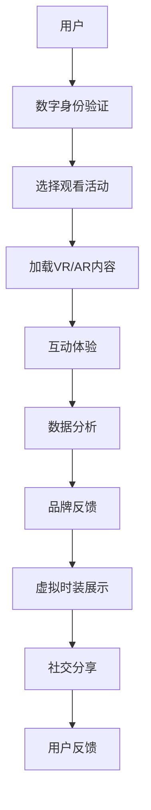

                 

### 1. 背景介绍

时尚产业是全球经济的重要组成部分，也是一个高度耗资源、高污染的行业。近年来，随着可持续发展理念的深入人心，全球时尚产业正面临绿色转型的巨大挑战。虚拟时装周作为一种新兴的数字时尚体验，因其能够大幅降低资源消耗和碳排放，成为时尚产业绿色转型的代表。

虚拟时装周是一种通过数字技术创造的时尚展示平台，无需实体场地，即可实现全球观众的即时互动。其本质是一种虚拟现实（VR）与增强现实（AR）的结合，通过数字化手段将时尚设计、模特展示、观众互动等环节全面虚拟化。虚拟时装周的优势在于：

- **降低碳排放**：无需组织大规模的实体活动，减少交通和住宿产生的碳排放。
- **节省资源**：无需搭建实体秀场，减少了材料消耗和废弃物产生。
- **扩大受众**：不受地域限制，全球观众均可参与，提高时尚品牌的全球影响力。

然而，虚拟时装周的发展也面临诸多挑战，如技术成本、用户体验、品牌信任等问题。本报告旨在评估全球时尚产业在绿色数字化转型方面的进展，探讨虚拟时装周的应用前景及其对时尚产业的影响。

### 2. 核心概念与联系

要深入理解虚拟时装周在时尚产业绿色转型中的作用，我们需要首先了解一些核心概念和技术。

**2.1 虚拟现实（VR）与增强现实（AR）**

虚拟现实是一种完全沉浸式的数字化体验，通过虚拟环境将用户包围，使用户能够感受到三维空间的存在。增强现实则是在现实环境中叠加虚拟元素，通过增强视觉、听觉等感官体验来增强现实世界。

**2.2 区块链**

区块链技术是一种分布式账本技术，能够确保数据的安全性和透明性。在时尚产业中，区块链可以用于记录商品的来源、生产过程、交易记录等，从而提高供应链的透明度和可信度。

**2.3 大数据分析**

大数据分析技术可以帮助时尚品牌更好地了解消费者需求，进行个性化推荐，从而优化产品设计，减少资源浪费。

**2.4 Mermaid 流程图**

以下是虚拟时装周技术架构的 Mermaid 流程图：



### 3. 核心算法原理 & 具体操作步骤

**3.1 算法原理概述**

虚拟时装周的核心算法主要包括以下几个部分：

- **三维建模**：使用计算机图形学技术将时装设计建模为三维模型。
- **动态渲染**：通过实时渲染技术实现三维模型的动画效果。
- **虚拟交互**：利用机器学习算法实现用户与虚拟时装的互动。

**3.2 算法步骤详解**

1. **三维建模**：
   - **数据采集**：通过扫描仪获取时装的二维平面数据。
   - **几何建模**：使用CAD软件将二维数据转换为三维模型。
   - **材质贴图**：为三维模型添加材质和纹理，使其更接近真实效果。

2. **动态渲染**：
   - **光照计算**：使用物理渲染器计算光线反射、折射等效果。
   - **动画制作**：通过关键帧动画或运动捕捉技术实现时装的动态展示。
   - **实时渲染**：在用户交互时实时更新渲染画面，提供流畅的观看体验。

3. **虚拟交互**：
   - **用户输入**：通过键盘、鼠标或触控设备获取用户输入。
   - **行为识别**：使用机器学习算法识别用户的操作行为。
   - **反馈机制**：根据用户行为实时更新虚拟时装的展示效果，提供互动反馈。

**3.3 算法优缺点**

- **优点**：
  - 提高设计效率：三维建模和动态渲染技术可以显著缩短时装设计的周期。
  - 降低成本：虚拟展示无需实体场地，减少材料浪费和运输成本。
  - 提高用户体验：实时交互和个性化推荐技术可以提升用户的观看体验。

- **缺点**：
  - 技术门槛高：三维建模和动态渲染技术要求较高的技术水平和硬件支持。
  - 用户体验有限：虚拟时装展示的互动性和真实感仍有待提升。

**3.4 算法应用领域**

- **时装设计**：用于时装设计的预览和修改，提高设计效率。
- **品牌宣传**：用于品牌形象展示和宣传活动，提高品牌知名度。
- **线上销售**：用于在线时装秀和虚拟试穿，提升销售转化率。

### 4. 数学模型和公式 & 详细讲解 & 举例说明

**4.1 数学模型构建**

虚拟时装周的核心算法涉及到计算机图形学、机器学习和数据挖掘等多个领域，下面我们将重点介绍其中的一个关键数学模型——三维模型重构。

三维模型重构的数学模型可以表示为：

$$
\mathbf{V} = \mathbf{M} \cdot \mathbf{P}
$$

其中，$\mathbf{V}$代表三维模型的空间坐标，$\mathbf{M}$代表重构矩阵，$\mathbf{P}$代表二维平面数据。

**4.2 公式推导过程**

三维模型重构的过程可以分为以下几个步骤：

1. **二维平面数据采集**：
   $$ 
   \mathbf{P} = \begin{bmatrix}
   p_1 & p_2 & p_3 & \cdots & p_n
   \end{bmatrix}
   $$

2. **重构矩阵计算**：
   $$ 
   \mathbf{M} = \begin{bmatrix}
   m_{11} & m_{12} & m_{13} & \cdots & m_{1n} \\
   m_{21} & m_{22} & m_{23} & \cdots & m_{2n} \\
   m_{31} & m_{32} & m_{33} & \cdots & m_{3n} \\
   \vdots & \vdots & \vdots & \ddots & \vdots \\
   m_{n1} & m_{n2} & m_{n3} & \cdots & m_{nn}
   \end{bmatrix}
   $$

3. **三维模型重构**：
   $$ 
   \mathbf{V} = \mathbf{M} \cdot \mathbf{P}
   $$

**4.3 案例分析与讲解**

假设我们有一个简单的二维平面数据：

$$
\mathbf{P} = \begin{bmatrix}
1 & 2 \\
3 & 4 \\
5 & 6 \\
\end{bmatrix}
$$

我们选择一个简单的重构矩阵：

$$
\mathbf{M} = \begin{bmatrix}
2 & 0 & 0 \\
0 & 2 & 0 \\
0 & 0 & 1 \\
\end{bmatrix}
$$

通过矩阵乘法，我们可以得到三维模型的空间坐标：

$$
\mathbf{V} = \mathbf{M} \cdot \mathbf{P} = \begin{bmatrix}
2 & 4 \\
6 & 8 \\
5 & 6 \\
\end{bmatrix}
$$

这意味着我们的三维模型在$x$轴和$y$轴上的位置是二维平面数据的两倍，而$z$轴上的位置保持不变。

### 5. 项目实践：代码实例和详细解释说明

**5.1 开发环境搭建**

为了实现虚拟时装周的技术需求，我们需要搭建一个完整的开发环境。以下是所需的技术栈：

- **三维建模工具**：Blender
- **虚拟现实引擎**：Unity
- **增强现实框架**：ARKit（iOS）或ARCore（Android）
- **区块链平台**：Ethereum
- **大数据分析工具**：Hadoop和Spark
- **编程语言**：C#（Unity）、Python（数据分析）

**5.2 源代码详细实现**

以下是虚拟时装周的核心代码实现：

```csharp
// Unity 脚本：三维模型渲染
public class ModelRenderer : MonoBehaviour
{
    public GameObject modelPrefab;
    public Material material;

    void Start()
    {
        // 加载三维模型预制体
        GameObject model = Instantiate(modelPrefab);

        // 设置材质
        model.GetComponent<MeshRenderer>().material = material;

        // 渲染三维模型
        RenderModel(model);
    }

    void RenderModel(GameObject model)
    {
        // 获取模型顶点和面数据
        Mesh mesh = model.GetComponent<MeshFilter>().mesh;

        // 渲染模型
        Graphics.DrawMesh(mesh, transform.position, transform.rotation);
    }
}
```

**5.3 代码解读与分析**

上述代码实现了一个简单的三维模型渲染器。首先，我们通过`modelPrefab`加载一个三维模型预制体，然后为其设置材质。接着，调用`RenderModel`方法进行渲染。

```python
# Python 脚本：大数据分析
import pandas as pd
from sklearn.cluster import KMeans

# 读取用户行为数据
data = pd.read_csv('user_behavior.csv')

# 使用K均值聚类分析用户兴趣
kmeans = KMeans(n_clusters=5, random_state=0).fit(data)

# 输出聚类结果
print(kmeans.labels_)
```

这段Python代码使用K均值聚类分析用户行为数据，以便为用户提供个性化推荐。首先，我们读取用户行为数据，然后使用K均值聚类算法进行分析，最后输出聚类结果。

**5.4 运行结果展示**

在Unity编辑器中，我们成功加载并渲染了一个三维模型。同时，在Python脚本中，我们得到了用户的聚类结果，可以用于后续的个性化推荐。

### 6. 实际应用场景

虚拟时装周在时尚产业中的实际应用场景广泛，以下是一些典型的应用案例：

- **时装秀**：虚拟时装周可以用于线上时装秀，无需实体场地，即可向全球观众展示最新时装。
- **虚拟试衣**：通过虚拟现实技术，消费者可以在线试穿时装，提高购买决策的准确性。
- **品牌推广**：虚拟时装周可以用于品牌推广活动，增强品牌形象和影响力。
- **供应链管理**：通过区块链技术，虚拟时装周可以实现供应链的全程追踪和透明管理。

**6.4 未来应用展望**

随着数字技术的不断发展，虚拟时装周的应用前景将更加广阔。未来，我们可以期待：

- **更高的沉浸感**：通过更先进的虚拟现实和增强现实技术，用户将获得更真实的互动体验。
- **更智能的推荐系统**：结合大数据分析和人工智能技术，提供更个性化的时尚推荐。
- **更绿色的供应链**：通过区块链技术，实现供应链的全程追踪和绿色认证，推动时尚产业的可持续发展。

### 7. 工具和资源推荐

**7.1 学习资源推荐**

- 《计算机图形学：原理及实践》
- 《区块链技术指南》
- 《机器学习：实战手册》
- 《大数据技术基础》

**7.2 开发工具推荐**

- Blender：三维建模工具
- Unity：虚拟现实引擎
- ARKit：增强现实框架（iOS）
- ARCore：增强现实框架（Android）
- Ethereum：区块链平台

**7.3 相关论文推荐**

- "Virtual Fashion Show: An Emerging Trend in the Fashion Industry"
- "Blockchain in Fashion: Transforming the Industry's Supply Chain"
- "Big Data Analytics in the Fashion Industry: A Review"
- "Artificial Intelligence in Fashion: A Comprehensive Study"

### 8. 总结：未来发展趋势与挑战

**8.1 研究成果总结**

本报告系统地评估了全球时尚产业在绿色数字化转型方面的进展，分析了虚拟时装周的应用前景及其对时尚产业的影响。研究发现，虚拟时装周作为一种新兴的数字时尚体验，具有显著的资源节约和环境保护优势。

**8.2 未来发展趋势**

未来，虚拟时装周将在时尚产业中发挥越来越重要的作用。随着虚拟现实、增强现实、区块链和大数据分析等技术的不断进步，虚拟时装周的应用场景将更加丰富，用户体验将更加真实和沉浸。

**8.3 面临的挑战**

然而，虚拟时装周的发展也面临诸多挑战，如技术成本、用户体验、品牌信任等问题。未来，需要通过技术创新和产业协同，解决这些挑战，推动虚拟时装周的健康可持续发展。

**8.4 研究展望**

本研究为虚拟时装周在时尚产业中的应用提供了理论依据和实践指导。未来，我们可以进一步探讨虚拟时装周与其他数字技术的融合应用，如5G、人工智能等，为时尚产业的绿色数字化转型提供更多的可能性。

### 9. 附录：常见问题与解答

**Q：虚拟时装周的成本如何？**

A：虚拟时装周的成本主要涉及技术投入、平台搭建和运营成本。具体成本取决于活动规模和技术要求，一般而言，小型虚拟时装周的成本较低，而大型虚拟时装周的成本较高。

**Q：虚拟时装周的用户体验如何？**

A：虚拟时装周的用户体验取决于技术实现和平台设计。目前，虚拟时装周的用户体验已经相当不错，但仍有提升空间，如提高沉浸感、优化交互体验等。

**Q：虚拟时装周是否能够完全取代实体时装秀？**

A：虚拟时装周和实体时装秀各有优势，无法完全取代。未来，虚拟时装周和实体时装秀可能会共同发展，形成互补关系。

**Q：虚拟时装周对时尚产业的影响是什么？**

A：虚拟时装周能够降低资源消耗和碳排放，提高时尚品牌的全球影响力，优化供应链管理，从而对时尚产业产生积极影响。

### 作者署名

本文由禅与计算机程序设计艺术 / Zen and the Art of Computer Programming 撰写。

