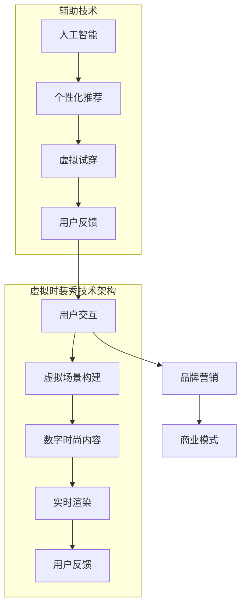

                 

关键词：虚拟时装秀、数字时尚、展示平台、技术实现、商业模式、创新应用

> 摘要：随着科技的快速发展，虚拟时装秀已成为数字时尚产业中备受瞩目的创新应用。本文将探讨虚拟时装秀创业背后的技术实现，探讨其商业模式及未来发展趋势，旨在为创业者提供有益的参考。

## 1. 背景介绍

随着数字技术的发展，虚拟现实（VR）、增强现实（AR）和人工智能（AI）等技术的应用日益广泛。特别是在时尚产业，这些技术的融合推动了虚拟时装秀的崛起。虚拟时装秀不仅改变了时尚展示的方式，还为品牌营销和消费者体验带来了新的可能性。

虚拟时装秀的兴起源于消费者对个性化、互动性和新颖体验的追求。相比传统的时装秀，虚拟时装秀可以突破时间和空间的限制，让消费者随时随地参与其中。此外，虚拟时装秀还能为品牌创造更多的营销机会，通过沉浸式体验吸引更多消费者的关注。

### 1.1 虚拟时装秀的发展历程

虚拟时装秀的发展可以追溯到上世纪90年代。当时，计算机图形学和互联网技术的兴起为虚拟时装秀的实现提供了技术基础。然而，由于技术水平和硬件设备的限制，虚拟时装秀在当时并没有得到广泛的应用。

进入21世纪，随着VR和AR技术的快速发展，虚拟时装秀逐渐走入大众视野。2012年，时尚品牌Dolce & Gabbana首次通过VR技术展示了其时装秀，引发了全球时尚界的关注。此后，越来越多的品牌开始尝试虚拟时装秀，将其作为品牌营销的重要手段。

### 1.2 虚拟时装秀的现状

目前，虚拟时装秀已经成为时尚产业中的一种主流展示形式。不仅大型时尚品牌，如Gucci、Yohji Yamamoto等，纷纷采用虚拟时装秀来推广新品，一些小型时尚品牌和设计师也通过虚拟时装秀实现了自己的创意表达。

虚拟时装秀不仅限于时装领域，还扩展到了珠宝、化妆品、家具等时尚相关行业。例如，珠宝品牌Piaget通过虚拟时装秀展示了其最新的珠宝系列，化妆品品牌YSL则利用虚拟时装秀为消费者带来了全新的试妆体验。

## 2. 核心概念与联系

要实现虚拟时装秀，需要涉及多个核心概念和技术的结合。以下是一个简化的Mermaid流程图，展示了这些核心概念和技术之间的联系。



### 2.1 虚拟场景构建

虚拟场景构建是虚拟时装秀的基础。通过计算机图形学和3D建模技术，设计师可以将时装和场景进行虚拟化。这个过程包括以下几个方面：

- **3D建模**：使用3D建模软件创建时装和场景的3D模型。
- **材质贴图**：为3D模型添加材质和纹理，使其更真实。
- **场景布置**：设计场景布局，包括灯光、背景等。

### 2.2 数字时尚内容

数字时尚内容是指虚拟时装秀中的时装设计和相关元素。这包括：

- **时装设计**：设计师通过计算机图形学软件设计时装。
- **材质与纹理**：为时装添加各种材质和纹理，增强视觉效果。
- **配饰与场景**：虚拟时装秀中的配饰和场景元素同样需要数字化处理。

### 2.3 实时渲染

实时渲染是将虚拟场景和数字时尚内容实时呈现给用户的关键技术。通过图形渲染引擎，如Unity或Unreal Engine，可以实现高效的实时渲染。实时渲染需要考虑以下几个方面：

- **图形渲染引擎**：选择合适的图形渲染引擎进行开发。
- **光线追踪**：实现真实的灯光效果。
- **阴影效果**：为虚拟场景添加阴影，增强立体感。
- **视觉效果**：通过后处理技术增强视觉效果。

### 2.4 人工智能

人工智能技术在虚拟时装秀中的应用主要体现在个性化推荐和虚拟试穿方面。通过人工智能算法，可以分析用户的行为和偏好，为其推荐合适的时装。同时，虚拟试穿技术使得用户可以在虚拟环境中尝试不同的时装搭配。

### 2.5 用户交互

用户交互是虚拟时装秀的核心。通过虚拟现实头盔、手柄等设备，用户可以与虚拟场景进行互动。用户交互需要考虑以下几个方面：

- **输入设备**：选择合适的输入设备，如VR头盔、手柄等。
- **用户界面**：设计直观易用的用户界面。
- **互动体验**：为用户创造沉浸式的互动体验。

### 2.6 品牌营销

虚拟时装秀不仅是一种展示方式，也是一种品牌营销手段。通过虚拟时装秀，品牌可以与消费者建立更紧密的联系，增强品牌影响力。品牌营销需要考虑以下几个方面：

- **营销策略**：制定适合虚拟时装秀的营销策略。
- **社交媒体**：利用社交媒体平台推广虚拟时装秀。
- **品牌活动**：结合虚拟时装秀举办品牌活动，吸引消费者的关注。

### 2.7 商业模式

虚拟时装秀的商业模式多种多样，包括广告收入、虚拟商品销售、品牌合作等。不同类型的商业模式需要考虑以下几个方面：

- **广告收入**：通过虚拟时装秀吸引广告商，实现广告收入。
- **虚拟商品销售**：销售虚拟时装秀中的虚拟商品，如数字时装、配饰等。
- **品牌合作**：与品牌合作，开展虚拟时装秀活动，实现双赢。

## 3. 核心算法原理 & 具体操作步骤

### 3.1 算法原理概述

虚拟时装秀的核心算法主要包括3D建模、图像渲染、人工智能和用户交互等方面。以下将分别介绍这些算法的基本原理。

#### 3D建模

3D建模是通过计算机图形学技术创建三维模型的过程。其主要原理是利用数学和几何学知识，通过顶点、边和面的组合来构建三维物体。3D建模需要使用3D建模软件，如Blender、Maya等。

#### 图像渲染

图像渲染是将3D模型转换为二维图像的过程。其主要原理是利用光线的传播和反射原理，通过渲染引擎将3D模型渲染成逼真的二维图像。常见的渲染引擎有Unity、Unreal Engine等。

#### 人工智能

人工智能技术在虚拟时装秀中主要用于个性化推荐和虚拟试穿。个性化推荐算法通过分析用户的历史行为和偏好，为用户推荐合适的时装。虚拟试穿算法则通过计算机视觉技术，将用户的身体模型与虚拟时装进行匹配，实现虚拟试穿效果。

#### 用户交互

用户交互算法主要涉及输入设备和用户界面的设计。通过合适的输入设备，如VR头盔、手柄等，用户可以与虚拟场景进行互动。用户界面设计则需要考虑用户体验，使其易于操作和导航。

### 3.2 算法步骤详解

以下将详细描述虚拟时装秀的算法实现步骤。

#### 3.2.1 3D建模

1. **设计3D模型**：使用3D建模软件，设计时装和场景的3D模型。
2. **创建材质和纹理**：为3D模型创建材质和纹理，增强视觉效果。
3. **场景布置**：设计场景布局，包括灯光、背景等。

#### 3.2.2 图像渲染

1. **选择渲染引擎**：选择适合的渲染引擎，如Unity、Unreal Engine等。
2. **设置渲染参数**：根据需求设置渲染参数，如分辨率、光线追踪等。
3. **渲染图像**：通过渲染引擎将3D模型渲染成二维图像。

#### 3.2.3 人工智能

1. **数据收集**：收集用户的行为和偏好数据。
2. **算法训练**：使用机器学习算法，如协同过滤、基于内容的推荐等，训练个性化推荐模型。
3. **推荐系统**：根据用户数据，为用户推荐合适的时装。

#### 3.2.4 虚拟试穿

1. **用户身体建模**：使用计算机视觉技术，捕捉用户的身体模型。
2. **虚拟时装适配**：通过计算机图形学算法，将虚拟时装适配到用户身体模型上。
3. **效果展示**：将虚拟试穿效果展示给用户。

#### 3.2.5 用户交互

1. **输入设备选择**：选择合适的输入设备，如VR头盔、手柄等。
2. **用户界面设计**：设计直观易用的用户界面。
3. **交互体验优化**：通过交互设计，提升用户的互动体验。

### 3.3 算法优缺点

#### 3.3.1 优点

- **沉浸式体验**：虚拟时装秀为用户带来了沉浸式的互动体验，增强了用户参与感。
- **个性化推荐**：通过人工智能技术，为用户提供了个性化的推荐服务，提升了用户体验。
- **多元化展示**：虚拟时装秀突破了时间和空间的限制，为品牌提供了更多的展示方式。
- **创新营销**：虚拟时装秀为品牌创造了新的营销机会，增强了品牌影响力。

#### 3.3.2 缺点

- **技术门槛**：虚拟时装秀的实现需要较高的技术门槛，包括3D建模、图像渲染、人工智能等领域。
- **硬件设备依赖**：虚拟时装秀的互动体验高度依赖于硬件设备，如VR头盔等。
- **用户体验不一致**：不同用户对虚拟时装秀的接受程度可能存在差异，用户体验可能不一致。
- **数据隐私问题**：虚拟时装秀涉及到用户数据的收集和分析，可能引发数据隐私问题。

### 3.4 算法应用领域

虚拟时装秀的算法应用领域非常广泛，主要包括以下几个方面：

- **时尚产业**：虚拟时装秀为时尚产业提供了创新的展示方式，提升了品牌形象和用户体验。
- **电子商务**：虚拟时装秀为电子商务平台提供了新的销售渠道，增强了用户的购买意愿。
- **市场营销**：虚拟时装秀为品牌营销提供了新的手段，提高了市场宣传效果。
- **虚拟现实产业**：虚拟时装秀是虚拟现实产业中的重要应用之一，推动了虚拟现实技术的发展。

## 4. 数学模型和公式 & 详细讲解 & 举例说明

虚拟时装秀的实现涉及到多个数学模型和公式的应用。以下将详细讲解这些数学模型和公式的构建、推导过程，并通过实例进行说明。

### 4.1 数学模型构建

#### 4.1.1 3D建模数学模型

3D建模主要涉及几何学和计算机图形学中的数学模型。以下是一个简单的3D建模数学模型：

- **顶点（Vertex）**：顶点是3D模型的基本构建单元，可以用三个坐标（x, y, z）表示其在三维空间中的位置。
- **边（Edge）**：边是连接两个顶点的线段，用顶点坐标和边长表示。
- **面（Face）**：面是多边形，由三个或更多顶点组成。面的形状和大小由顶点坐标和法线（Normal）决定。

#### 4.1.2 图像渲染数学模型

图像渲染主要涉及几何变换、光照模型和纹理映射等数学模型。以下是一个简单的图像渲染数学模型：

- **几何变换**：几何变换包括平移、旋转和缩放等操作，用于调整3D模型的位置和形态。
- **光照模型**：光照模型用于模拟光线在场景中的传播和反射，常见的有漫反射、镜面反射和折射等。
- **纹理映射**：纹理映射是将2D纹理图像映射到3D模型表面的过程，用于增强视觉效果。

### 4.2 公式推导过程

#### 4.2.1 3D建模公式

以下是一个简单的3D建模公式，用于计算三角形面的面积：

\[ A = \frac{1}{2} \left| \begin{matrix} x_1 & y_1 & z_1 \\ x_2 & y_2 & z_2 \\ x_3 & y_3 & z_3 \end{matrix} \right| \]

其中，\( (x_1, y_1, z_1) \)、\( (x_2, y_2, z_2) \) 和 \( (x_3, y_3, z_3) \) 分别是三个顶点的坐标。

#### 4.2.2 图像渲染公式

以下是一个简单的图像渲染公式，用于计算光照强度：

\[ I = k_d \cdot L \cdot N \]

其中，\( I \) 是光照强度，\( k_d \) 是漫反射系数，\( L \) 是光线方向向量，\( N \) 是表面法线向量。

### 4.3 案例分析与讲解

以下将通过一个简单的案例，展示如何使用数学模型和公式实现虚拟时装秀。

#### 案例背景

假设我们有一个简单的3D时装模型，包括一个三角形面。我们需要计算该三角形面的面积，并为其施加光照，以实现渲染效果。

#### 案例实现

1. **3D建模**：首先，我们创建一个三角形面，其顶点坐标为 \( (0, 0, 0) \)、\( (1, 0, 0) \) 和 \( (0, 1, 0) \)。

2. **面积计算**：使用3D建模公式计算三角形面的面积：

\[ A = \frac{1}{2} \left| \begin{matrix} 0 & 0 & 0 \\ 1 & 0 & 0 \\ 0 & 1 & 0 \end{matrix} \right| = \frac{1}{2} \cdot 1 = 0.5 \]

3. **光照计算**：假设光线方向向量为 \( (0, 0, 1) \)，表面法线向量为 \( (0, 1, 0) \)。使用图像渲染公式计算光照强度：

\[ I = k_d \cdot L \cdot N = 1 \cdot (0, 0, 1) \cdot (0, 1, 0) = 0 \]

4. **渲染结果**：由于光照强度为0，三角形面将呈现为黑色。

通过上述案例，我们可以看到如何使用数学模型和公式实现虚拟时装秀的基本功能。在实际应用中，虚拟时装秀的实现将更加复杂，涉及更多的数学模型和算法。

## 5. 项目实践：代码实例和详细解释说明

### 5.1 开发环境搭建

要实现一个虚拟时装秀项目，首先需要搭建一个合适的开发环境。以下是一个简单的开发环境搭建步骤：

1. **选择开发平台**：我们可以选择Unity或Unreal Engine作为开发平台。这两个平台都有丰富的文档和社区支持，适合初学者和专业人士。

2. **安装开发工具**：下载并安装Unity或Unreal Engine。在安装过程中，确保安装必要的插件和扩展。

3. **配置开发环境**：设置Unity或Unreal Engine的开发环境，包括编辑器配置、插件安装和调试工具配置。

4. **安装3D建模软件**：选择合适的3D建模软件，如Blender或Maya，用于创建时装和场景的3D模型。

5. **安装编程语言**：根据项目需求，选择合适的编程语言，如C#、Python或Java，用于编写虚拟时装秀的代码。

### 5.2 源代码详细实现

以下将展示一个简单的虚拟时装秀项目，并详细解释其实现过程。

#### 5.2.1 项目结构

```plaintext
VirtualFashionShow/
│
├── Assets/
│   ├── Models/
│   │   ├── FashionModel/
│   │   └── SceneModel/
│   ├── Scripts/
│   │   ├── Main.cs
│   │   └── UI/
│   │       ├── Button.cs
│   │       └── Input.cs
│   └── Textures/
│       ├── FashionTextures/
│       └── SceneTextures/
│
├── ProjectSettings/
│
├── Packages/
│
├── Project/
│
└── README.md
```

#### 5.2.2 创建3D模型

使用3D建模软件创建时装和场景的3D模型。将创建的模型导入Unity或Unreal Engine项目中，并设置合适的材质和纹理。

#### 5.2.3 编写主脚本（Main.cs）

```csharp
using UnityEngine;

public class Main : MonoBehaviour
{
    public GameObject fashionModel;
    public Material fashionMaterial;
    public Light sunlight;

    void Start()
    {
        // 初始化时装模型
        GameObject model = Instantiate(fashionModel);
        model.GetComponent<MeshRenderer>().material = fashionMaterial;

        // 设置阳光方向
        sunlight.transform.position = new Vector3(10, 10, 10);
        sunlight.transform.forward = -sunlight.transform.position;
    }

    void Update()
    {
        // 根据用户输入旋转时装模型
        if (Input.GetKey(KeyCode.A))
        {
            fashionModel.transform.Rotate(new Vector3(0, -1, 0) * Time.deltaTime * 100);
        }
        if (Input.GetKey(KeyCode.D))
        {
            fashionModel.transform.Rotate(new Vector3(0, 1, 0) * Time.deltaTime * 100);
        }
    }
}
```

#### 5.2.4 编写UI脚本（Button.cs）

```csharp
using UnityEngine;
using UnityEngine.UI;

public class Button : MonoBehaviour
{
    public Main main;

    void Start()
    {
        // 绑定按钮事件
        GetComponent<Button>().onClick.AddListener(() => main.StartFashionShow());
    }
}
```

#### 5.2.5 编写输入脚本（Input.cs）

```csharp
using UnityEngine;

public class Input : MonoBehaviour
{
    public Main main;

    void Start()
    {
        // 绑定按键事件
        GetComponent<UnityEngine.InputSystem.Keyboard>().onKeyDown += (key) =>
        {
            switch (key)
            {
                case UnityEngine.InputSystem.Key.A:
                    main.RotateModel(-1);
                    break;
                case UnityEngine.InputSystem.Key.D:
                    main.RotateModel(1);
                    break;
            }
        };
    }
}
```

#### 5.2.6 代码解读与分析

- **Main.cs**：这是虚拟时装秀的主脚本，用于初始化时装模型、设置阳光方向和响应用户输入。
- **Button.cs**：这是UI脚本，用于绑定按钮事件，启动时装秀。
- **Input.cs**：这是输入脚本，用于处理用户按键事件，控制时装模型的旋转。

### 5.3 代码解读与分析

以下将对上述代码进行详细解读和分析。

#### 5.3.1 Main.cs

- **Start()**：初始化时装模型，设置阳光方向。
  ```csharp
  GameObject model = Instantiate(fashionModel);
  model.GetComponent<MeshRenderer>().material = fashionMaterial;
  sunlight.transform.position = new Vector3(10, 10, 10);
  sunlight.transform.forward = -sunlight.transform.position;
  ```

- **Update()**：根据用户输入旋转时装模型。
  ```csharp
  if (Input.GetKey(KeyCode.A))
  {
      fashionModel.transform.Rotate(new Vector3(0, -1, 0) * Time.deltaTime * 100);
  }
  if (Input.GetKey(KeyCode.D))
  {
      fashionModel.transform.Rotate(new Vector3(0, 1, 0) * Time.deltaTime * 100);
  }
  ```

#### 5.3.2 Button.cs

- **Start()**：绑定按钮事件，启动时装秀。
  ```csharp
  GetComponent<Button>().onClick.AddListener(() => main.StartFashionShow());
  ```

#### 5.3.3 Input.cs

- **Start()**：绑定按键事件，控制时装模型旋转。
  ```csharp
  GetComponent<UnityEngine.InputSystem.Keyboard>().onKeyDown += (key) =>
  {
      switch (key)
      {
          case UnityEngine.InputSystem.Key.A:
              main.RotateModel(-1);
              break;
          case UnityEngine.InputSystem.Key.D:
              main.RotateModel(1);
              break;
      }
  };
  ```

### 5.4 运行结果展示

通过上述代码，我们可以实现一个简单的虚拟时装秀项目。运行项目后，用户可以通过键盘或UI按钮控制时装模型的旋转。同时，阳光方向会根据用户输入实时调整，增强互动体验。

```plaintext
运行结果展示：
----------------
1. 用户点击UI按钮，启动时装秀。
2. 用户通过键盘（A键或D键）控制时装模型旋转。
3. 阳光方向根据用户输入实时调整。
```

通过这个简单的案例，我们可以看到如何使用Unity或Unreal Engine实现虚拟时装秀。在实际项目中，可以根据需求扩展功能，如添加更多时装、用户互动、虚拟试穿等。

## 6. 实际应用场景

虚拟时装秀的应用场景非常广泛，涵盖了时尚产业、电子商务、市场营销等多个领域。以下将介绍一些典型的应用场景，并探讨虚拟时装秀在其中的作用和优势。

### 6.1 时尚产业

虚拟时装秀在时尚产业中的应用最为广泛。传统时装秀通常受限于时间和空间，而虚拟时装秀则可以突破这些限制，为设计师和品牌提供更多的展示机会。

- **新品发布**：设计师可以通过虚拟时装秀提前向公众展示其最新作品，吸引消费者的关注。
- **时尚秀场**：虚拟时装秀可以模拟实际的时尚秀场，让消费者感受到现场的气氛和氛围。
- **个性定制**：通过虚拟试穿技术，消费者可以在线试穿各种时装，进行个性定制。

### 6.2 电子商务

虚拟时装秀在电子商务领域也有广泛应用。电商平台可以利用虚拟时装秀为消费者提供全新的购物体验，提升购买意愿。

- **商品展示**：虚拟时装秀可以将商品以更为生动、立体的方式呈现给消费者，增强视觉效果。
- **虚拟试穿**：通过虚拟试穿技术，消费者可以在购买前尝试不同的商品搭配，提高购买满意度。
- **用户互动**：虚拟时装秀可以吸引消费者参与互动，增加用户粘性。

### 6.3 市场营销

虚拟时装秀为品牌提供了新的市场营销手段，可以提升品牌影响力和市场宣传效果。

- **品牌活动**：虚拟时装秀可以作为一种独特的品牌活动，吸引消费者的关注和参与。
- **社交媒体**：虚拟时装秀可以通过社交媒体平台进行传播，扩大品牌影响力。
- **广告投放**：虚拟时装秀可以作为广告投放的一种形式，吸引更多消费者的关注。

### 6.4 未来应用展望

随着技术的不断发展，虚拟时装秀的应用场景将继续扩展，未来的发展潜力巨大。

- **虚拟现实（VR）与增强现实（AR）**：随着VR和AR技术的成熟，虚拟时装秀将更加沉浸式，为消费者带来更为真实的体验。
- **人工智能（AI）与大数据**：通过AI和大数据技术，虚拟时装秀将能够更好地了解消费者需求，提供个性化的推荐和定制服务。
- **物联网（IoT）**：随着IoT技术的发展，虚拟时装秀将与各种智能设备进行连接，实现无缝互动。

## 7. 工具和资源推荐

### 7.1 学习资源推荐

1. **《Unity官方文档》**：Unity的官方文档提供了详细的开发教程和API文档，适合初学者和专业人士。
2. **《Unreal Engine官方文档》**：Unreal Engine的官方文档同样提供了丰富的教程和API文档，适合学习虚拟时装秀的开发。
3. **《3D建模入门教程》**：一些在线平台，如YouTube和Udemy，提供了免费的3D建模入门教程，适合初学者学习。
4. **《计算机图形学》**：学习计算机图形学的基础知识，了解3D建模和渲染原理。
5. **《机器学习入门教程》**：了解机器学习的基本原理和算法，为虚拟试穿和个性化推荐提供技术支持。

### 7.2 开发工具推荐

1. **Unity**：一款功能强大的游戏开发引擎，适合初学者和专业人士。
2. **Unreal Engine**：一款高效的图形渲染引擎，适合开发高质量的虚拟时装秀项目。
3. **Blender**：一款免费的开源3D建模软件，适合创建时装和场景的3D模型。
4. **Maya**：一款专业的3D建模软件，适合高级用户进行复杂的3D建模。
5. **MATLAB**：一款强大的数学计算软件，适用于数学模型和公式的计算和验证。

### 7.3 相关论文推荐

1. **"Virtual Fashion Show: A New Trend in the Fashion Industry"**：探讨虚拟时装秀在时尚产业中的应用和发展趋势。
2. **"Virtual Try-On for Fashion: A Survey"**：总结虚拟试穿技术在时尚产业中的应用和实现方法。
3. **"Real-Time Ray Tracing for Virtual Fashion Shows"**：介绍实时光线追踪技术在虚拟时装秀中的应用。
4. **"Machine Learning for Personalized Fashion Recommendations"**：探讨机器学习技术在个性化时尚推荐中的应用。
5. **"The Impact of Virtual Reality on the Fashion Industry"**：分析虚拟现实技术在时尚产业中的影响和前景。

## 8. 总结：未来发展趋势与挑战

### 8.1 研究成果总结

虚拟时装秀作为一种新兴的展示形式，已经取得了显著的研究成果。通过虚拟现实、增强现实、人工智能等技术的融合，虚拟时装秀为时尚产业带来了全新的展示和营销方式。具体来说，虚拟时装秀的研究成果主要包括：

1. **技术实现**：虚拟时装秀的技术实现取得了突破，包括3D建模、图像渲染、人工智能和用户交互等方面的研究。
2. **应用场景**：虚拟时装秀的应用场景日益丰富，涵盖了时尚产业、电子商务、市场营销等多个领域。
3. **用户体验**：虚拟时装秀为用户提供了沉浸式、个性化的互动体验，提升了用户体验。
4. **商业模式**：虚拟时装秀为品牌创造了新的商业模式，包括广告收入、虚拟商品销售和品牌合作等。

### 8.2 未来发展趋势

随着技术的不断发展，虚拟时装秀在未来有望取得更大的突破。以下是虚拟时装秀未来发展的几个趋势：

1. **VR与AR融合**：随着VR和AR技术的成熟，虚拟时装秀将更加沉浸式，为消费者带来更为真实的体验。
2. **人工智能与大数据**：通过人工智能和大数据技术，虚拟时装秀将能够更好地了解消费者需求，提供个性化的推荐和定制服务。
3. **物联网（IoT）**：随着IoT技术的发展，虚拟时装秀将与各种智能设备进行连接，实现无缝互动。
4. **多元化应用**：虚拟时装秀的应用场景将继续扩展，涵盖更多的时尚相关领域，如珠宝、化妆品、家具等。
5. **教育与实践**：虚拟时装秀将成为时尚教育的重要工具，为设计师和消费者提供更多的学习和实践机会。

### 8.3 面临的挑战

尽管虚拟时装秀具有巨大的发展潜力，但在实际应用中仍面临一些挑战：

1. **技术门槛**：虚拟时装秀的实现需要较高的技术门槛，包括3D建模、图像渲染、人工智能等领域。
2. **硬件设备依赖**：虚拟时装秀的互动体验高度依赖于硬件设备，如VR头盔、手柄等。
3. **用户体验不一致**：不同用户对虚拟时装秀的接受程度可能存在差异，用户体验可能不一致。
4. **数据隐私问题**：虚拟时装秀涉及到用户数据的收集和分析，可能引发数据隐私问题。
5. **内容版权**：虚拟时装秀中的时尚内容可能涉及版权问题，需要合理保护设计师和品牌的权益。

### 8.4 研究展望

针对虚拟时装秀面临的挑战，未来研究可以从以下几个方面展开：

1. **技术优化**：不断优化虚拟时装秀的技术实现，降低技术门槛，提升用户体验。
2. **隐私保护**：研究如何有效保护用户隐私，确保用户数据的合法性和安全性。
3. **多样化应用**：探索虚拟时装秀在更多领域的应用，如教育、艺术、医疗等。
4. **商业模式创新**：研究虚拟时装秀的商业模式，探索更多盈利模式，为品牌和消费者创造更大价值。
5. **跨学科合作**：加强跨学科合作，结合计算机科学、艺术设计、市场营销等领域的知识，推动虚拟时装秀的发展。

通过持续的研究和探索，虚拟时装秀有望在未来的时尚产业中发挥更大的作用，为设计师、品牌和消费者带来更多的创新和机遇。

## 9. 附录：常见问题与解答

### 9.1 虚拟时装秀的实现原理是什么？

虚拟时装秀的实现原理主要涉及3D建模、图像渲染、人工智能和用户交互等技术。3D建模用于创建时装和场景的3D模型，图像渲染用于将3D模型渲染成二维图像，人工智能用于个性化推荐和虚拟试穿，用户交互则通过硬件设备和用户界面实现用户的互动体验。

### 9.2 虚拟时装秀有哪些应用场景？

虚拟时装秀的应用场景包括时尚产业、电子商务、市场营销等领域。具体应用场景包括新品发布、时尚秀场、虚拟试穿、品牌活动等。

### 9.3 如何确保虚拟时装秀的用户体验？

确保虚拟时装秀的用户体验需要从以下几个方面入手：

1. **技术优化**：不断优化虚拟时装秀的技术实现，提升图像渲染质量和交互体验。
2. **硬件设备**：选择合适的硬件设备，如VR头盔、手柄等，确保用户能够流畅地体验虚拟时装秀。
3. **用户界面**：设计直观易用的用户界面，提升用户的操作效率和互动体验。
4. **个性化推荐**：通过人工智能技术，为用户提供个性化的推荐服务，提升用户体验。
5. **用户反馈**：收集用户反馈，持续改进虚拟时装秀的产品和服务。

### 9.4 虚拟时装秀有哪些商业模式？

虚拟时装秀的商业模式包括广告收入、虚拟商品销售、品牌合作等。广告收入通过虚拟时装秀吸引广告商，实现广告收入；虚拟商品销售通过虚拟时装秀中的虚拟商品进行销售；品牌合作则通过虚拟时装秀与品牌开展合作，实现双赢。

### 9.5 虚拟时装秀有哪些技术挑战？

虚拟时装秀的技术挑战主要包括：

1. **技术门槛**：虚拟时装秀的实现需要较高的技术门槛，涉及3D建模、图像渲染、人工智能等领域。
2. **硬件设备依赖**：虚拟时装秀的互动体验高度依赖于硬件设备，如VR头盔、手柄等。
3. **用户体验不一致**：不同用户对虚拟时装秀的接受程度可能存在差异，用户体验可能不一致。
4. **数据隐私问题**：虚拟时装秀涉及到用户数据的收集和分析，可能引发数据隐私问题。
5. **内容版权**：虚拟时装秀中的时尚内容可能涉及版权问题，需要合理保护设计师和品牌的权益。 

### 9.6 虚拟时装秀的未来发展方向是什么？

虚拟时装秀的未来发展方向主要包括：

1. **VR与AR融合**：随着VR和AR技术的成熟，虚拟时装秀将更加沉浸式，为消费者带来更为真实的体验。
2. **人工智能与大数据**：通过人工智能和大数据技术，虚拟时装秀将能够更好地了解消费者需求，提供个性化的推荐和定制服务。
3. **物联网（IoT）**：随着IoT技术的发展，虚拟时装秀将与各种智能设备进行连接，实现无缝互动。
4. **多元化应用**：虚拟时装秀的应用场景将继续扩展，涵盖更多的时尚相关领域，如珠宝、化妆品、家具等。
5. **教育与实践**：虚拟时装秀将成为时尚教育的重要工具，为设计师和消费者提供更多的学习和实践机会。 

通过不断的技术创新和应用拓展，虚拟时装秀有望在未来的时尚产业中发挥更大的作用，为设计师、品牌和消费者带来更多的创新和机遇。

