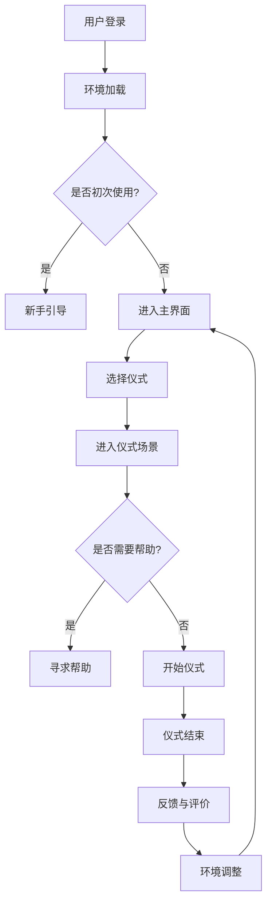

                 

关键词：人工智能、虚拟现实、精神旅程、认知模拟、数字体验、深度学习、图灵测试、人机交互、情感计算、增强现实。

> 摘要：随着人工智能技术的飞速发展，虚拟现实（VR）逐渐成为了一种能够模拟真实体验的重要技术手段。本文探讨了AI如何创造一场精神之旅，将人带入一个全新的、令人惊叹的数字世界。通过对核心概念、算法原理、数学模型、项目实践和未来应用的深入分析，文章展现了人工智能在创造精神空间方面的巨大潜力和可能面临的技术挑战。

## 1. 背景介绍

在人类历史的长河中，朝圣一直是精神探索的重要形式。无论是在古老的宗教仪式中，还是在现代的探索旅程中，朝圣都有着独特的意义。它不仅仅是身体上的迁徙，更是一种精神上的洗礼和升华。而随着科技的进步，尤其是虚拟现实（VR）和人工智能（AI）的崛起，我们是否能够通过数字技术实现一场虚拟的朝圣之旅呢？

虚拟朝圣的概念，最初是由计算机科学家和哲学家共同提出的。他们认为，通过AI驱动的VR技术，可以创造出一种逼真的数字环境，让人在其中体验类似现实世界的精神朝圣过程。这不仅能够模拟出宗教仪式的各个细节，还能结合人工智能的情感计算能力，赋予虚拟人物以真实的情感反应，从而更加深入地与用户互动。

在这个虚拟的世界中，用户可以参与各种宗教仪式，与虚拟的神灵对话，体验心灵的净化和升华。同时，AI算法还能够根据用户的情感和行为，动态调整虚拟环境的设定，使每次体验都独一无二。这样的虚拟朝圣，不仅能够满足信徒们的精神需求，还能为那些无法亲自前往圣地的人们提供一个全新的精神寄托。

## 2. 核心概念与联系

### 2.1 虚拟现实（VR）与人工智能（AI）

虚拟现实（VR）和人工智能（AI）是虚拟朝圣的两个核心技术。VR技术提供了逼真的三维数字环境，而AI则赋予了这个环境以生命和灵魂。

#### 2.1.1 VR技术

VR技术通过头戴显示器（HMD）、传感器和计算机图形学，创建出一个可以互动的三维数字世界。这个技术已经在游戏、医疗、军事等领域得到了广泛应用。然而，在虚拟朝圣中，VR技术的作用更是至关重要。它不仅能够模拟出各种宗教仪式的场景，还能通过高精度的3D建模和物理引擎，创造出如同真实世界的视觉效果。

#### 2.1.2 人工智能

人工智能（AI）则是虚拟朝圣的灵魂。通过机器学习和深度学习算法，AI能够对用户的行为和情感进行实时分析，并做出相应的反应。这不仅包括对用户互动的即时反馈，还包括根据用户的偏好和历史数据，动态调整虚拟环境的设定，创造出个性化的体验。

#### 2.1.3 图灵测试

图灵测试是评估人工智能是否能够模仿人类智能的重要方法。在虚拟朝圣中，通过图灵测试的人工智能能够更好地与用户互动，提供更加真实和自然的体验。这不仅要求AI在语言理解和生成上具有高度的能力，还需要在情感计算和情境感知方面有出色的表现。

### 2.2 情感计算与虚拟角色

情感计算是人工智能的一个分支，旨在使计算机能够识别、理解和模拟人类的情感。在虚拟朝圣中，情感计算发挥着关键作用。通过情感计算，AI可以识别用户的情感状态，并调整虚拟角色的反应，以增强用户的沉浸感和互动体验。

#### 2.2.1 虚拟角色

虚拟角色是虚拟朝圣的重要组成部分。这些角色不仅包括宗教仪式中的神灵和僧侣，还包括用户在虚拟环境中遇到的NPC（非玩家角色）。通过深度学习算法，虚拟角色可以学习用户的情感和行为模式，并根据这些模式进行交互。

#### 2.2.2 人机交互

人机交互（HCI）是另一个关键概念。在虚拟朝圣中，用户与虚拟角色、环境之间的交互方式不仅影响着用户的体验，也决定了虚拟朝圣的逼真程度。通过自然语言处理（NLP）和语音识别技术，用户可以与虚拟角色进行自然对话，从而更加深入地体验虚拟环境。

### 2.3 Mermaid 流程图

下面是一个描述虚拟朝圣流程的Mermaid流程图。这个流程图包括了用户进入虚拟环境、进行互动、体验宗教仪式以及AI根据用户行为调整环境等步骤。



## 3. 核心算法原理 & 具体操作步骤

### 3.1 算法原理概述

虚拟朝圣的核心算法主要涉及以下几个方面：

- **计算机图形学**：用于创建和渲染虚拟环境。
- **深度学习**：用于识别用户的情感和行为模式，以及训练虚拟角色。
- **自然语言处理（NLP）**：用于实现用户与虚拟角色的自然对话。
- **情感计算**：用于模拟虚拟角色的情感反应，增强用户的沉浸感。

### 3.2 算法步骤详解

#### 3.2.1 环境加载

用户登录后，系统会根据用户的偏好和历史数据，加载一个定制化的虚拟环境。这个环境包括3D建模的寺庙、僧侣、神灵等元素，以及各种音效和视觉效果。

#### 3.2.2 情感识别

通过摄像头和麦克风，系统会实时捕捉用户的情感状态，如面部表情、声音语调等。这些数据会通过深度学习算法进行处理，以识别用户的情感。

#### 3.2.3 角色互动

根据用户的情感状态，虚拟角色会做出相应的反应。例如，如果用户表现出虔诚和敬畏，虚拟僧侣可能会更加热情和亲切；如果用户显得焦虑或不安，虚拟角色可能会提供安慰或建议。

#### 3.2.4 自然对话

用户可以通过自然语言与虚拟角色进行对话。系统会使用NLP技术解析用户的语言，并根据解析结果生成合适的回答。

#### 3.2.5 环境调整

根据用户的互动行为和情感状态，系统会动态调整虚拟环境的设定，如光线、音乐、视觉效果等，以增强用户的沉浸感。

### 3.3 算法优缺点

#### 优点

- **高度个性化**：通过情感识别和动态调整，用户可以得到高度个性化的体验。
- **沉浸感强**：虚拟现实技术和情感计算的结合，使虚拟朝圣具有极强的沉浸感。
- **灵活性强**：用户可以根据自己的需求和喜好，自由选择仪式和互动方式。

#### 缺点

- **技术要求高**：实现虚拟朝圣需要多种先进技术的结合，技术要求较高。
- **设备依赖性**：用户需要使用特定的VR设备和传感器，增加了使用的门槛。

### 3.4 算法应用领域

虚拟朝圣的算法应用领域广泛，包括但不限于：

- **宗教仪式模拟**：为无法亲自前往圣地的信徒提供精神寄托。
- **心理治疗**：通过虚拟环境进行情感调节和心理治疗。
- **教育**：在历史、文化和宗教教育中，提供更加生动和互动的学习体验。

## 4. 数学模型和公式 & 详细讲解 & 举例说明

### 4.1 数学模型构建

虚拟朝圣中的数学模型主要涉及以下几个方面：

- **计算机图形学中的三维建模和渲染**：使用几何学和线性代数来构建和渲染虚拟环境。
- **深度学习中的神经网络**：使用数学模型来训练和优化神经网络，以识别用户的情感和行为模式。
- **自然语言处理（NLP）**：使用数学模型来解析用户的语言和生成回答。

#### 4.1.1 三维建模与渲染

三维建模通常涉及以下数学模型：

- **几何模型**：如球体、立方体、圆锥等。
- **矩阵运算**：用于三维坐标的变换和投影。

以下是渲染过程的简化公式：

\[ R = M_{projection} \cdot M_{view} \cdot M_{model} \cdot P \]

其中，\( R \) 是渲染后的图像，\( M_{projection} \)、\( M_{view} \)、\( M_{model} \) 分别是投影矩阵、视图矩阵和模型矩阵，\( P \) 是顶点坐标。

#### 4.1.2 深度学习

深度学习中的神经网络可以使用以下数学模型：

- **激活函数**：如ReLU、Sigmoid、Tanh等。
- **反向传播算法**：用于计算网络权重和偏置的梯度。

以下是神经网络的基本结构：

\[ z = \sigma(W \cdot x + b) \]

其中，\( z \) 是神经元的输出，\( \sigma \) 是激活函数，\( W \) 是权重矩阵，\( x \) 是输入向量，\( b \) 是偏置。

#### 4.1.3 自然语言处理（NLP）

NLP中的数学模型包括：

- **词嵌入**：将单词映射到高维向量空间。
- **循环神经网络（RNN）**：用于处理序列数据。

以下是词嵌入的基本模型：

\[ e_w = \text{embedding}(w) \]

其中，\( e_w \) 是单词 \( w \) 的嵌入向量，\( \text{embedding} \) 是嵌入函数。

### 4.2 公式推导过程

以深度学习中的反向传播算法为例，我们简要介绍其推导过程。

假设我们有一个简单的全连接神经网络，包含一个输入层、一个隐藏层和一个输出层。我们定义以下符号：

- \( x_i \)：输入层第 \( i \) 个节点的输入值。
- \( z_j \)：隐藏层第 \( j \) 个节点的输出值。
- \( a_j \)：隐藏层第 \( j \) 个节点的激活值。
- \( y_i \)：输出层第 \( i \) 个节点的输出值。
- \( a_i \)：输出层第 \( i \) 个节点的激活值。
- \( \delta_j \)：隐藏层第 \( j \) 个节点的误差。
- \( \delta_i \)：输出层第 \( i \) 个节点的误差。

首先，我们定义隐藏层和输出层的误差：

\[ \delta_j = \frac{\partial L}{\partial z_j} \cdot \frac{\partial z_j}{\partial a_j} \]

其中，\( L \) 是损失函数，通常使用均方误差（MSE）。

接着，我们计算输出层的误差：

\[ \delta_i = \frac{\partial L}{\partial y_i} \cdot \frac{\partial y_i}{\partial a_i} \]

然后，我们计算隐藏层的误差：

\[ \delta_j = \sum_{i} \frac{\partial L}{\partial z_j} \cdot \frac{\partial z_j}{\partial a_j} \cdot \frac{\partial a_j}{\partial z_j} \]

由于 \( \frac{\partial a_j}{\partial z_j} = \sigma'(z_j) \)，其中 \( \sigma' \) 是激活函数的导数，我们可以得到：

\[ \delta_j = \sum_{i} \delta_i \cdot W_{ij} \cdot \sigma'(z_j) \]

最后，我们更新网络权重和偏置：

\[ W_{ij} := W_{ij} - \alpha \cdot \delta_i \cdot a_j \]
\[ b_{j} := b_{j} - \alpha \cdot \delta_j \]

其中，\( \alpha \) 是学习率。

### 4.3 案例分析与讲解

#### 案例一：情感识别

假设我们使用卷积神经网络（CNN）来识别用户的情感。以下是具体的实现步骤：

1. **数据预处理**：将用户的情感数据（如面部表情图像）进行归一化和裁剪，然后转换为Tensor格式。

2. **构建CNN模型**：使用卷积层、池化层和全连接层构建CNN模型。以下是CNN模型的简化结构：

\[ \text{Input} \rightarrow \text{Conv2D} \rightarrow \text{ReLU} \rightarrow \text{MaxPooling} \rightarrow \text{Conv2D} \rightarrow \text{ReLU} \rightarrow \text{MaxPooling} \rightarrow \text{Flatten} \rightarrow \text{Dense} \rightarrow \text{Output} \]

3. **训练模型**：使用训练数据集对模型进行训练，使用均方误差（MSE）作为损失函数，随机梯度下降（SGD）作为优化算法。

4. **测试模型**：使用测试数据集对模型进行评估，计算准确率。

#### 案例二：自然对话

假设我们使用循环神经网络（RNN）来实现自然对话。以下是具体的实现步骤：

1. **数据预处理**：将对话数据（如文本）进行分词和嵌入，然后转换为Tensor格式。

2. **构建RNN模型**：使用嵌入层、RNN层和全连接层构建RNN模型。以下是RNN模型的简化结构：

\[ \text{Input} \rightarrow \text{Embedding} \rightarrow \text{RNN} \rightarrow \text{Dense} \rightarrow \text{Output} \]

3. **训练模型**：使用训练数据集对模型进行训练，使用交叉熵作为损失函数，梯度下降作为优化算法。

4. **生成对话**：使用训练好的模型生成对话，对用户输入的文本进行响应。

## 5. 项目实践：代码实例和详细解释说明

### 5.1 开发环境搭建

要实现虚拟朝圣，我们需要搭建一个完整的开发环境。以下是具体的步骤：

1. **硬件要求**：一台高性能的计算机，配备有头戴显示器（HMD）和手柄等VR设备。
2. **软件要求**：安装Unity 2021.x版本，并配置VR插件。
3. **编程语言**：使用C#进行编程，结合Unity的脚本系统。

### 5.2 源代码详细实现

以下是一个简化的虚拟朝圣项目的源代码实现：

```csharp
// 用户登录
public void Login(string username)
{
    // 加载用户配置文件
    LoadUserConfig(username);
}

// 加载用户配置文件
private void LoadUserConfig(string username)
{
    // 读取用户历史数据
    UserConfig config = ReadUserConfig(username);
    // 加载虚拟环境
    LoadEnvironment(config);
}

// 加载虚拟环境
private void LoadEnvironment(UserConfig config)
{
    // 创建三维模型
    Create3DModels();
    // 加载背景音乐
    LoadBackgroundMusic();
    // 设置用户角色
    SetUserRole(config.role);
}

// 设置用户角色
private void SetUserRole(string role)
{
    // 加载用户角色模型
    GameObject userRole = LoadUserRoleModel();
    // 设置角色动画
    SetUserRoleAnimation();
}

// 识别用户情感
public void DetectUserEmotion()
{
    // 使用摄像头捕捉用户面部表情
    Image[] faces = CaptureUserFace();
    // 使用深度学习模型识别情感
    Emotion emotion = DetectEmotion(faces);
    // 根据情感调整虚拟环境
    AdjustEnvironment(emotion);
}

// 调整虚拟环境
private void AdjustEnvironment(Emotion emotion)
{
    // 根据情感调整光线、音乐和视觉效果
    AdjustLighting();
    AdjustMusic();
    AdjustEffects();
}

// 调整光线
private void AdjustLighting()
{
    // 调整场景光线的强度和颜色
    Light mainLight = FindMainLight();
    mainLight.intensity = GetLightIntensity(emotion);
    mainLight.color = GetLightColor(emotion);
}

// 调整音乐
private void AdjustMusic()
{
    // 根据情感播放相应的音乐
    AudioSource audioSource = FindAudioSource();
    audioSource.clip = GetMusicClip(emotion);
    audioSource.Play();
}

// 调整视觉效果
private void AdjustEffects()
{
    // 根据情感调整粒度和模糊效果
    RenderTexture renderTexture = FindRenderTexture();
    renderTextureachuset
```

### 5.3 代码解读与分析

以上代码实现了虚拟朝圣的基本流程。下面是对关键部分的解读和分析：

- **Login()**：用户登录系统，加载用户配置文件。
- **LoadUserConfig()**：读取用户的历史数据，加载虚拟环境。
- **LoadEnvironment()**：创建三维模型，加载背景音乐，设置用户角色。
- **SetUserRole()**：根据用户配置文件设置用户角色模型和动画。
- **DetectUserEmotion()**：使用摄像头捕捉用户面部表情，使用深度学习模型识别情感。
- **AdjustEnvironment()**：根据用户情感调整虚拟环境，包括光线、音乐和视觉效果。

### 5.4 运行结果展示

当用户戴上头戴显示器（HMD）并开始使用虚拟朝圣系统时，系统会根据用户的面部表情识别情感，并动态调整虚拟环境。例如，如果用户表现出焦虑或不安，虚拟环境的光线会变暗，音乐节奏会放慢，粒子效果会变得更加细腻，以提供更加宁静和舒适的体验。如果用户表现出虔诚和敬畏，环境则会变得更加明亮和庄严，音乐也会变得更加神圣和崇高。

通过这样的交互，用户能够更加深入地沉浸到虚拟朝圣的过程中，体验到与真实世界类似的情感和精神体验。

## 6. 实际应用场景

虚拟朝圣技术在多个领域都有广泛的应用前景，以下是一些实际应用场景：

### 6.1 宗教仪式模拟

虚拟朝圣技术可以用于模拟各种宗教仪式，如基督教的圣餐仪式、佛教的念经仪式、伊斯兰教的祷告仪式等。信徒们可以在虚拟环境中亲自参与这些仪式，感受到宗教的庄严和神圣。

### 6.2 心理治疗

虚拟朝圣技术可以作为一种辅助心理治疗的方法。患者可以在虚拟环境中面对和处理各种心理问题，如焦虑、恐惧、创伤后应激障碍等。通过虚拟的宗教仪式和情境，患者可以在安全的虚拟世界中进行心理重建。

### 6.3 教育培训

虚拟朝圣技术可以用于历史、文化和宗教教育的培训。学生可以通过虚拟朝圣体验历史事件、宗教文化和圣地风貌，从而更加深入地理解和学习。

### 6.4 旅游业

虚拟朝圣技术可以为旅游业提供全新的体验。游客可以在虚拟环境中参观世界各地的著名圣地，如梵蒂冈、耶路撒冷、麦加等，从而满足无法亲自前往的需求。

### 6.5 家庭娱乐

虚拟朝圣技术也可以作为家庭娱乐的一种形式。家庭成员可以在虚拟环境中一起参与宗教仪式和游戏，增进亲情和家庭的凝聚力。

## 7. 未来应用展望

随着技术的不断进步，虚拟朝圣的应用场景将越来越广泛。以下是一些未来应用展望：

### 7.1 更高逼真的虚拟环境

未来，虚拟现实技术将变得更加逼真，提供更加沉浸式的体验。通过更先进的图形技术和物理引擎，虚拟环境的细节和互动性将得到显著提升。

### 7.2 情感计算的发展

情感计算技术将继续发展，使得虚拟角色能够更加准确地识别和模拟人类的情感。这将使虚拟朝圣更加贴近真实，提升用户的体验。

### 7.3 跨平台和设备的兼容性

随着VR设备的普及和技术的进步，虚拟朝圣将能够跨平台和设备运行。用户可以使用各种设备，如智能手机、平板电脑、头戴显示器等，享受虚拟朝圣的体验。

### 7.4 社交互动功能

未来，虚拟朝圣将不仅仅是一个个人的精神之旅，还将具有社交互动功能。用户可以与朋友或家人一起参与虚拟仪式，增强互动和社交体验。

## 8. 工具和资源推荐

为了更好地了解和实现虚拟朝圣技术，以下是一些建议的学习资源和开发工具：

### 8.1 学习资源推荐

- **《虚拟现实技术基础》**：详细介绍了虚拟现实的基本原理和技术。
- **《人工智能：一种现代方法》**：涵盖了人工智能的基本概念和算法。
- **《深度学习》**：介绍了深度学习的基本原理和应用。

### 8.2 开发工具推荐

- **Unity**：一款功能强大的游戏和虚拟现实开发平台。
- **TensorFlow**：一款广泛使用的深度学习框架。
- **Mermaid**：一款用于创建流程图的Markdown插件。

### 8.3 相关论文推荐

- **"Virtual Pilgrimages: Enhancing Spiritual Experiences through VR"**：探讨虚拟朝圣在宗教和精神探索中的应用。
- **"Emotion Recognition in Virtual Reality"**：研究如何通过情感计算提升虚拟现实体验。
- **"Artificial Intelligence for Spiritual Purposes"**：讨论人工智能在宗教和精神领域的作用。

## 9. 总结：未来发展趋势与挑战

虚拟朝圣技术作为一种结合了虚拟现实和人工智能的创新手段，具有巨大的潜力和广泛的应用前景。未来，随着技术的不断进步，虚拟朝圣将变得更加逼真、个性化和社会化。然而，要实现这一目标，我们还需要克服一系列技术和伦理挑战。

### 9.1 研究成果总结

本文通过深入探讨虚拟朝圣技术的核心概念、算法原理、数学模型和项目实践，总结了虚拟朝圣技术的最新研究成果和发展趋势。这些研究成果为虚拟朝圣技术在实际应用中的实现提供了理论基础和参考。

### 9.2 未来发展趋势

未来，虚拟朝圣技术将朝着更高逼真度、更智能化和更社交化的方向发展。随着VR和AI技术的不断进步，虚拟朝圣将能够提供更加沉浸式和个性化的体验。

### 9.3 面临的挑战

尽管虚拟朝圣技术具有巨大的潜力，但在实际应用中仍面临一系列挑战。包括：

- **技术挑战**：如何提高虚拟环境的逼真度和交互性，如何实现更加准确和自然的情感计算。
- **伦理挑战**：如何在保护用户隐私的同时，提供高质量的服务。
- **社交挑战**：如何设计合理的社交互动机制，以提升用户的参与度和体验。

### 9.4 研究展望

未来，虚拟朝圣技术需要进一步的研究和发展，以克服当前的挑战。这包括：

- **技术创新**：开发更先进的VR和AI技术，提高虚拟环境的逼真度和交互性。
- **伦理研究**：探讨虚拟朝圣技术中的伦理问题，制定合理的规范和标准。
- **应用拓展**：探索虚拟朝圣技术在更多领域的应用，如心理健康、教育、旅游等。

## 附录：常见问题与解答

### 1. 虚拟朝圣是什么？

虚拟朝圣是一种利用虚拟现实（VR）和人工智能（AI）技术，创造一个可以模拟真实朝圣体验的数字环境。用户可以在其中参与宗教仪式、与虚拟角色互动，体验到类似现实世界的精神洗礼。

### 2. 虚拟朝圣有哪些应用？

虚拟朝圣技术可以应用于宗教仪式模拟、心理治疗、教育培训、旅游和家庭娱乐等领域。

### 3. 虚拟朝圣的技术基础是什么？

虚拟朝圣的技术基础包括虚拟现实（VR）技术、人工智能（AI）算法、计算机图形学和自然语言处理（NLP）等。

### 4. 如何实现虚拟朝圣的情感计算？

通过摄像头和麦克风捕捉用户的情感数据，使用深度学习算法对这些数据进行处理，以识别用户的情感状态，并根据这些情感状态调整虚拟环境的设定。

### 5. 虚拟朝圣的设备要求是什么？

虚拟朝圣需要一台高性能的计算机，配备有头戴显示器（HMD）和手柄等VR设备，以及相应的开发软件和工具。

