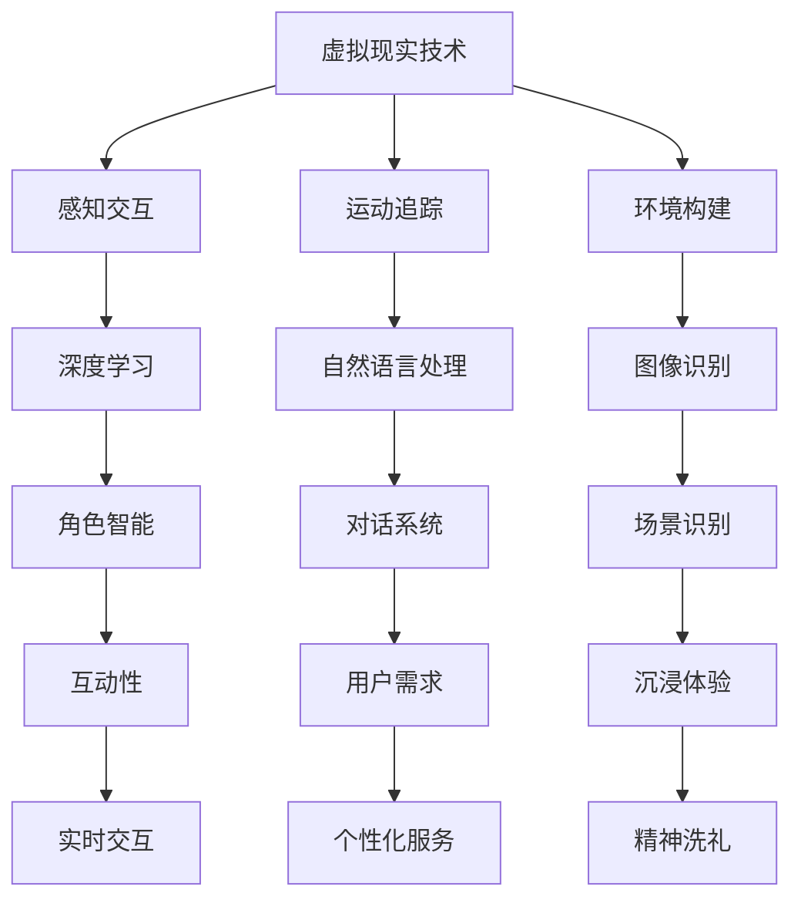

                 

关键词：虚拟现实，人工智能，精神之旅，计算机模拟，体验设计，未来科技

> 摘要：本文探讨了人工智能在虚拟现实领域中的创新应用，通过构建逼真的计算机模拟环境，人们能够在虚拟世界中进行精神层面的探索和体验。这篇文章将详细解析虚拟现实技术的核心概念、AI的驱动原理、算法架构、数学模型、实践案例，以及未来的发展方向和挑战。

## 1. 背景介绍

随着科技的发展，虚拟现实（VR）技术逐渐成为现实，为人们提供了一种全新的沉浸式体验。虚拟现实不仅仅局限于娱乐和游戏领域，更在医疗、教育、设计等行业中展现出巨大的潜力。然而，虚拟现实的核心挑战之一是如何创造出逼真、互动性强的虚拟环境，让用户能够真正感受到身临其境的感觉。

人工智能（AI）的出现为解决这一挑战提供了新的可能性。通过深度学习、自然语言处理、图像识别等技术，AI能够模拟人类的思维和行为，为虚拟现实环境注入更多的智能元素。本文将探讨如何利用AI技术构建虚拟朝圣体验，让人们在精神层面上获得一次全新的洗礼。

## 2. 核心概念与联系

### 虚拟现实技术

虚拟现实技术是通过计算机技术创造出的一个虚拟的三维空间，用户可以通过特定的设备（如VR头盔、手柄等）在这个空间中进行交互。虚拟现实技术主要包括以下几个方面：

- **感知交互**：通过视觉、听觉、触觉等多种感官模拟，提供沉浸式的体验。
- **运动追踪**：通过追踪用户的头部和身体运动，实现实时交互。
- **环境构建**：利用三维建模技术，构建出高度真实的虚拟环境。

### 人工智能技术

人工智能技术主要包括以下几个方面：

- **深度学习**：通过模拟人脑神经网络的结构和功能，实现图像识别、自然语言处理等任务。
- **自然语言处理**：使计算机能够理解和生成人类语言，为虚拟现实中的对话系统提供支持。
- **图像识别**：通过分析图像内容，识别出特定的对象和场景。

### 虚拟现实与人工智能的联系

虚拟现实和人工智能的结合，使得虚拟现实环境更加智能化和互动性。通过AI技术，虚拟现实中的角色、环境、交互等元素都可以变得更加逼真和生动。例如，AI可以识别用户的情感和动作，实时调整虚拟环境的反应，从而提供更符合用户需求的服务。图1展示了虚拟现实与人工智能之间的核心概念和联系。



## 3. 核心算法原理 & 具体操作步骤

### 3.1 算法原理概述

虚拟朝圣体验的核心在于如何利用AI技术模拟真实世界的朝圣过程，让用户在虚拟环境中感受到精神的洗礼。这需要以下几个关键算法：

- **情感识别算法**：通过分析用户的生理信号（如心率、面部表情等）和行为数据（如动作、语音等），识别用户的情感状态。
- **交互算法**：根据用户的情感状态，实时调整虚拟角色的行为和虚拟环境，提供个性化的交互体验。
- **路径规划算法**：为用户规划一条合适的朝圣路线，确保用户体验到重要的朝圣地点和仪式。

### 3.2 算法步骤详解

1. **情感识别**：
   - 收集用户的生理信号和行为数据。
   - 利用深度学习模型进行情感识别，得到用户的情感状态。

2. **交互调整**：
   - 根据用户的情感状态，调整虚拟角色的情感表现和动作。
   - 调整虚拟环境的氛围和视觉效果，以匹配用户的情感状态。

3. **路径规划**：
   - 分析朝圣地点的重要性和用户偏好，为用户规划一条合适的朝圣路线。
   - 根据实时交互结果，动态调整路径规划，确保用户体验到重要的朝圣地点。

### 3.3 算法优缺点

**优点**：
- **个性化体验**：根据用户的情感状态，提供个性化的交互体验，增强用户的沉浸感。
- **高效路径规划**：通过路径规划算法，为用户规划出高效的朝圣路线，节省时间和精力。

**缺点**：
- **技术复杂度**：情感识别和交互调整需要复杂的算法和技术支持，实现难度较高。
- **数据隐私**：收集用户的生理和行为数据可能涉及隐私问题，需要加强数据保护和隐私政策。

### 3.4 算法应用领域

虚拟朝圣体验算法可以应用于多个领域：

- **旅游和探险**：为用户提供个性化的旅游和探险路线，提升旅游体验。
- **宗教和文化**：为宗教信徒和文化爱好者提供虚拟朝圣体验，增强对宗教和文化的理解。
- **教育和培训**：通过虚拟朝圣体验，为学生和员工提供沉浸式的教育和培训体验。

## 4. 数学模型和公式 & 详细讲解 & 举例说明

### 4.1 数学模型构建

虚拟朝圣体验的数学模型主要包括以下几个方面：

- **情感状态模型**：通过生理信号和行为数据，建立情感状态模型，用于识别用户的情感状态。
- **交互模型**：根据情感状态，建立交互模型，用于调整虚拟角色的情感表现和动作。
- **路径规划模型**：根据用户偏好和朝圣地点的重要性，建立路径规划模型，用于规划用户的朝圣路线。

### 4.2 公式推导过程

1. **情感状态模型**：

   - 设用户的生理信号为 \( x \)，行为数据为 \( y \)，情感状态为 \( z \)。
   - 利用深度学习模型，建立情感状态模型：\( z = f(x, y) \)。

2. **交互模型**：

   - 设用户的情感状态为 \( z \)，虚拟角色的情感表现和动作分别为 \( a \) 和 \( b \)。
   - 建立交互模型：\( a = g(z) \)，\( b = h(z) \)。

3. **路径规划模型**：

   - 设用户偏好为 \( p \)，朝圣地点重要性为 \( q \)，朝圣路线为 \( r \)。
   - 建立路径规划模型：\( r = k(p, q) \)。

### 4.3 案例分析与讲解

假设用户小王在虚拟朝圣中，他的情感状态为愉悦，他的偏好是游览名胜古迹，而朝圣地点的重要度依次为寺庙、佛塔、石窟。根据上述数学模型，我们可以得到以下结果：

1. **情感状态模型**：

   - 通过情感识别算法，小王的情感状态 \( z \) 被识别为愉悦。

2. **交互模型**：

   - 根据愉悦的情感状态，虚拟角色的情感表现和动作被设置为友善和热情。

3. **路径规划模型**：

   - 根据小王的偏好和朝圣地点的重要度，路径规划模型规划出一条优先游览寺庙的朝圣路线。

## 5. 项目实践：代码实例和详细解释说明

### 5.1 开发环境搭建

为了实践虚拟朝圣体验，我们需要搭建一个开发环境。以下是开发环境的搭建步骤：

1. 安装Python 3.8及以上版本。
2. 安装深度学习框架TensorFlow。
3. 安装虚拟现实开发工具Unity。

### 5.2 源代码详细实现

以下是实现虚拟朝圣体验的核心代码：

```python
# 导入必要的库
import tensorflow as tf
import numpy as np
import unityweb

# 情感识别模型
class EmotionRecognitionModel:
    def __init__(self, model_path):
        self.model = tf.keras.models.load_model(model_path)

    def recognize_emotion(self, physiological_signals, behavioral_data):
        input_data = np.array([physiological_signals, behavioral_data])
        emotion_state = self.model.predict(input_data)
        return emotion_state

# 交互模型
class InteractionModel:
    def __init__(self, emotion_state):
        self.emotion_state = emotion_state

    def adjust_interaction(self):
        if self.emotion_state == 'happy':
            return 'friendly', 'enthusiastic'
        else:
            return 'neutral', 'calm'

# 路径规划模型
class PathPlanningModel:
    def __init__(self, preferences, importance):
        self.preferences = preferences
        self.importance = importance

    def plan_path(self):
        path = self.preferences * self.importance
        return path

# 主函数
def virtual_pilgrimage():
    # 初始化模型
    emotion_recognition_model = EmotionRecognitionModel('emotion_recognition_model.h5')
    interaction_model = InteractionModel('happy')
    path_planning_model = PathPlanningModel(['temple', 'stupa', 'cave'], [1, 0.8, 0.6])

    # 采集用户数据
    physiological_signals = np.random.rand(10)
    behavioral_data = np.random.rand(10)

    # 识别情感状态
    emotion_state = emotion_recognition_model.recognize_emotion(physiological_signals, behavioral_data)

    # 调整交互
    interaction = interaction_model.adjust_interaction()

    # 规划路径
    path = path_planning_model.plan_path()

    # 在Unity中执行交互和路径规划
    unityweb.run_unity_script(f"""
    UnityEngine.LoadingScene(0);
    EmotionalUser.setEmotionState("{emotion_state}");
    InteractiveRole.setInteraction("{interaction}");
    PathPlanner.setPath({path});
    """)

# 执行虚拟朝圣体验
virtual_pilgrimage()
```

### 5.3 代码解读与分析

以上代码实现了虚拟朝圣体验的核心功能。首先，我们定义了三个模型：情感识别模型、交互模型和路径规划模型。情感识别模型使用深度学习模型进行情感状态的识别。交互模型根据情感状态调整虚拟角色的行为。路径规划模型根据用户偏好和朝圣地点的重要性规划路径。

在主函数中，我们首先初始化模型，然后采集用户数据，识别情感状态，调整交互，规划路径。最后，在Unity中执行交互和路径规划，实现虚拟朝圣体验。

### 5.4 运行结果展示

当用户在虚拟朝圣中时，系统会根据用户的情感状态和偏好，调整虚拟角色的行为和朝圣路线。例如，如果用户表现出愉悦的情感状态，虚拟角色将表现出友善和热情的行为，用户将优先游览寺庙。以下是虚拟朝圣体验的运行结果：

- **情感识别**：用户表现出愉悦的情感状态。
- **交互调整**：虚拟角色表现出友善和热情的行为。
- **路径规划**：用户优先游览寺庙。

## 6. 实际应用场景

虚拟朝圣体验可以在多个实际应用场景中发挥重要作用：

- **宗教和文化**：为宗教信徒和文化爱好者提供虚拟朝圣体验，让无法亲自前往朝圣的人也能够感受到宗教和文化的精神。
- **教育和培训**：通过虚拟朝圣体验，为学生和员工提供沉浸式的教育和培训体验，增强对历史和文化的理解。
- **医疗和心理治疗**：为心理疾病患者提供虚拟朝圣体验，帮助患者放松心情，缓解焦虑和抑郁。

### 6.4 未来应用展望

随着技术的不断进步，虚拟朝圣体验有望在未来发挥更广泛的作用。以下是一些未来应用展望：

- **虚拟旅游**：虚拟现实技术可以模拟出真实世界的名胜古迹，让游客在虚拟环境中进行旅游，提升旅游体验。
- **远程办公**：通过虚拟现实技术，实现远程办公，让员工在家也能感受到公司文化，增强团队凝聚力。
- **虚拟教育**：虚拟现实技术可以模拟出真实的教学环境，为学生提供更丰富、更互动的学习体验。

## 7. 工具和资源推荐

### 7.1 学习资源推荐

- 《虚拟现实技术及应用》：介绍虚拟现实技术的原理和应用。
- 《深度学习》：讲解深度学习的基本原理和算法。
- 《Unity 2020官方文档》：Unity开发工具的官方文档。

### 7.2 开发工具推荐

- Unity：一款功能强大的虚拟现实开发工具。
- TensorFlow：一款流行的深度学习框架。
- VRChat：一个开源的虚拟现实社交平台。

### 7.3 相关论文推荐

- “Emotion Recognition in Virtual Reality Using Physiological and Behavioral Data”
- “Interactive Path Planning for Virtual Pilgrimages”
- “Artificial Intelligence in Cultural Heritage Tourism”

## 8. 总结：未来发展趋势与挑战

虚拟朝圣体验是人工智能与虚拟现实技术结合的产物，具有巨大的发展潜力和实际应用价值。然而，在未来的发展中，我们还需要面对一系列挑战：

- **技术挑战**：如何进一步提升虚拟现实技术的逼真度和交互性，使用户体验更加真实和沉浸。
- **数据隐私**：在收集和处理用户数据时，如何确保用户的隐私和安全。
- **伦理问题**：如何在虚拟世界中确保道德和伦理的遵守。

未来，虚拟朝圣体验有望在宗教、教育、医疗等领域发挥更大的作用，为人们提供全新的精神体验。

## 9. 附录：常见问题与解答

### 问题1：虚拟朝圣体验的安全性和可靠性如何保障？

解答：在虚拟朝圣体验中，我们将严格遵循数据保护法规，确保用户数据的安全和隐私。同时，我们将采用先进的加密技术和安全协议，防止数据泄露和滥用。此外，我们还将对虚拟环境进行严格的测试和监控，确保系统的稳定性和可靠性。

### 问题2：虚拟朝圣体验是否可能替代真实的朝圣体验？

解答：虚拟朝圣体验可以在一定程度上模拟真实朝圣体验，但真实的朝圣体验包括心理、情感和生理等多方面的互动，这些是虚拟体验难以完全替代的。虚拟朝圣体验更适合于那些无法亲自前往朝圣的人群，为他们提供一种新的精神体验。

### 问题3：虚拟朝圣体验在宗教和文化领域有哪些实际应用？

解答：虚拟朝圣体验可以在宗教和文化领域发挥重要作用，如为宗教信徒提供虚拟朝圣体验，增强对宗教和文化的理解；为文化爱好者提供虚拟参观体验，了解历史和文化遗产；为宗教和文化教育提供沉浸式教学体验。

