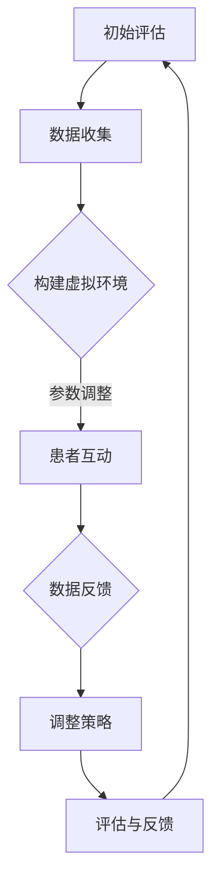
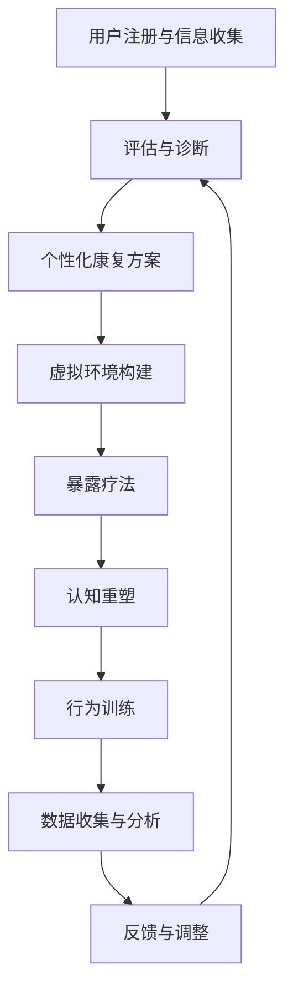

                 

## 1. 背景介绍

创伤后应激障碍（Post-Traumatic Stress Disorder，简称PTSD）是一种常见的心理障碍，通常由极端压力事件引起，如战争、自然灾害、事故、性侵等。PTSD患者可能会出现反复的创伤记忆、高度警觉、回避情绪反应等症状，严重影响他们的日常生活和社会功能。传统的心理康复方法，如认知行为疗法（Cognitive Behavioral Therapy，简称CBT）和药物治疗，尽管在一定程度上能够缓解症状，但效果有限，且康复过程漫长。

近年来，虚拟现实（Virtual Reality，简称VR）技术的快速发展为心理康复领域带来了新的希望。VR技术通过创建逼真的虚拟环境，能够模拟各种情境，帮助患者重新经历创伤事件，并逐步适应和克服。与传统的心理康复方法相比，VR技术具有高度的互动性、灵活性和可重复性，能够为患者提供更加个性化和有效的康复体验。

数字化心理康复平台的理念正是在这种背景下诞生的。通过整合VR技术和大数据分析，数字化心理康复平台旨在为PTSD患者提供一种全新的、高效的康复模式。患者可以在虚拟环境中与治疗师互动，进行心理训练和认知重塑，同时平台通过收集和分析患者的数据，为治疗提供科学依据和个性化建议。

本文将探讨虚拟现实创伤后成长创业的背景、核心概念、算法原理、数学模型、项目实践、实际应用场景、未来展望以及面临的挑战，旨在为读者提供一个全面而深入的了解。

## 2. 核心概念与联系

### 2.1 虚拟现实（VR）与创伤后应激障碍（PTSD）康复

虚拟现实（VR）是一种通过计算机生成的三维虚拟环境，用户可以通过头戴式显示器（HMD）和手柄等设备与之互动。VR技术的核心在于其高度的沉浸感和交互性，这使得用户可以在虚拟环境中体验到近乎真实的感官体验。

创伤后应激障碍（PTSD）是一种常见的心理障碍，通常由极端压力事件引起。PTSD患者可能会出现反复的创伤记忆、高度警觉、回避情绪反应等症状。

VR技术在PTSD康复中的应用主要体现在以下几个方面：

1. **暴露疗法**：通过将患者置于模拟的创伤场景中，帮助患者重新面对和适应创伤事件。这种方法有助于减轻患者的焦虑和恐惧感。
2. **认知重塑**：在虚拟环境中，患者可以与治疗师进行互动，通过反复的暴露和认知重塑，逐步改变对创伤事件的负面认知。
3. **行为训练**：VR技术可以模拟各种情境，帮助患者进行行为训练，如社交技能、压力管理等。

### 2.2 数字化心理康复平台

数字化心理康复平台是一种基于VR技术的综合康复系统，它通过整合多个模块，如数据收集与分析、虚拟环境构建、互动界面设计等，为PTSD患者提供个性化的康复服务。

平台的核心组成部分包括：

1. **用户数据收集与分析模块**：通过传感器和设备收集患者的生理和行为数据，如心率、皮肤电导、头部运动等，为治疗提供实时反馈。
2. **虚拟环境构建模块**：根据患者的具体需求和症状，构建个性化的虚拟环境，包括室内、室外、城市等多种场景。
3. **互动界面设计模块**：设计用户友好的互动界面，使患者能够轻松地进行操作，如选择训练项目、调整参数等。

### 2.3 Mermaid 流程图

以下是一个简化的Mermaid流程图，展示了虚拟现实创伤后康复流程的各个阶段：



### 2.4 核心算法原理

虚拟现实创伤后康复平台的核心算法主要包括暴露疗法算法、认知重塑算法和行为训练算法。

#### 2.4.1 暴露疗法算法

暴露疗法是一种常用的心理康复方法，其核心思想是通过反复的暴露来减轻患者的焦虑和恐惧。算法的基本步骤如下：

1. **初步评估**：收集患者的个人信息、创伤事件和症状。
2. **场景构建**：根据患者的具体情况，构建模拟的创伤场景。
3. **逐步暴露**：将患者逐步引入模拟场景，开始时暴露程度较低，随着治疗的进展，逐步增加暴露程度。
4. **反馈与调整**：在暴露过程中，收集患者的生理和行为数据，根据反馈调整暴露策略。

#### 2.4.2 认知重塑算法

认知重塑是一种通过改变患者的认知方式来减轻症状的方法。算法的基本步骤如下：

1. **认知评估**：通过问卷调查和访谈，了解患者的认知模式。
2. **认知重构**：在虚拟环境中，引导患者识别和挑战负面的认知，如过度概括、灾难化等。
3. **反复练习**：通过反复的练习，帮助患者建立新的认知模式。
4. **反馈与调整**：在重构过程中，收集患者的反馈，根据反馈调整认知重塑策略。

#### 2.4.3 行为训练算法

行为训练是通过模拟各种情境，帮助患者提高社交技能和压力管理能力。算法的基本步骤如下：

1. **行为评估**：评估患者的社交技能和压力管理能力。
2. **情境模拟**：在虚拟环境中，模拟各种社交和压力情境。
3. **行为指导**：在模拟情境中，提供行为指导和反馈。
4. **反复训练**：通过反复的模拟和训练，提高患者的实际能力。
5. **评估与反馈**：在训练结束后，评估患者的进步情况，并提供反馈。

### 2.5 算法优缺点

#### 优点：

1. **高度个性化**：根据患者的具体需求和症状，提供个性化的康复方案。
2. **实时反馈**：通过实时数据收集和分析，为治疗提供科学依据。
3. **灵活性强**：虚拟环境可以模拟各种情境，为患者提供丰富的康复体验。

#### 缺点：

1. **技术门槛较高**：需要专业的技术和设备支持。
2. **患者适应期较长**：初次使用VR设备时，患者可能需要一定的适应时间。

### 2.6 算法应用领域

虚拟现实创伤后康复算法主要应用于以下几个方面：

1. **心理治疗**：通过暴露疗法和认知重塑，帮助患者减轻症状，提高生活质量。
2. **教育训练**：通过行为训练，帮助患者提高社交技能和压力管理能力。
3. **科学研究**：通过数据收集和分析，为PTSD研究和治疗提供科学依据。

---

为了更清晰地展示虚拟现实创伤后康复平台的架构和流程，下面将给出一个简化的Mermaid流程图：



这个流程图展示了从用户注册和信息收集，到评估与诊断，再到个性化康复方案制定、虚拟环境构建、暴露疗法、认知重塑、行为训练、数据收集与分析，以及反馈与调整的完整过程。每个阶段都通过算法和模型进行支持和优化，从而为患者提供最有效的康复体验。

## 3. 核心算法原理 & 具体操作步骤

### 3.1 算法原理概述

虚拟现实创伤后康复平台的核心算法主要包括暴露疗法算法、认知重塑算法和行为训练算法。这些算法通过不同的原理和步骤，帮助患者逐步克服创伤后应激障碍（PTSD）的症状。

#### 暴露疗法算法

暴露疗法是一种通过反复暴露来减轻患者焦虑和恐惧的治疗方法。其原理是让患者在安全的环境中逐步面对和适应创伤事件，从而降低对事件的反应强度。

**算法步骤：**

1. **初步评估**：收集患者的个人信息、创伤事件和症状，为后续治疗提供基础数据。
2. **场景构建**：根据患者的具体情况，构建模拟的创伤场景。这些场景可以是虚拟的，也可以是现实环境中的再现。
3. **逐步暴露**：将患者逐步引入模拟场景，开始时暴露程度较低，随着治疗的进展，逐步增加暴露程度。
4. **反馈与调整**：在暴露过程中，收集患者的生理和行为数据，如心率、皮肤电导等，根据反馈调整暴露策略。

#### 认知重塑算法

认知重塑是一种通过改变患者的认知方式来减轻症状的治疗方法。其原理是帮助患者识别和挑战负面的认知模式，如过度概括、灾难化等。

**算法步骤：**

1. **认知评估**：通过问卷调查和访谈，了解患者的认知模式。
2. **认知重构**：在虚拟环境中，引导患者识别和挑战负面的认知，如过度概括、灾难化等。
3. **反复练习**：通过反复的练习，帮助患者建立新的认知模式。
4. **反馈与调整**：在重构过程中，收集患者的反馈，根据反馈调整认知重塑策略。

#### 行为训练算法

行为训练是一种通过模拟各种情境，帮助患者提高社交技能和压力管理能力的方法。其原理是让患者在一个安全的环境中练习和掌握新的行为模式。

**算法步骤：**

1. **行为评估**：评估患者的社交技能和压力管理能力。
2. **情境模拟**：在虚拟环境中，模拟各种社交和压力情境。
3. **行为指导**：在模拟情境中，提供行为指导和反馈。
4. **反复训练**：通过反复的模拟和训练，提高患者的实际能力。
5. **评估与反馈**：在训练结束后，评估患者的进步情况，并提供反馈。

### 3.2 算法步骤详解

#### 暴露疗法算法步骤详解

1. **初步评估**：

   在开始治疗前，首先对患者进行初步评估。这包括收集患者的个人信息（如年龄、性别、职业等），了解创伤事件的性质和发生时间，以及患者目前的症状和状况。

   **数据收集方法**：通过问卷调查、面谈和生理指标监测（如心率、血压等）。

2. **场景构建**：

   根据患者的具体情况，构建模拟的创伤场景。这些场景可以是虚拟的，也可以是现实环境中的再现。虚拟场景通常使用3D建模软件进行创建，以确保其逼真度。

   **场景构建方法**：使用Unity或Unreal Engine等游戏引擎创建虚拟场景。这些引擎提供了丰富的3D建模和渲染工具，可以帮助构建高度真实的场景。

3. **逐步暴露**：

   将患者逐步引入模拟场景，开始时暴露程度较低，随着治疗的进展，逐步增加暴露程度。

   **暴露策略**：采用“渐进式暴露”策略，即从较轻的暴露开始，逐步增加暴露的强度和持续时间。例如，首先让患者观看虚拟场景的图片，然后逐渐过渡到观看视频，最后在虚拟环境中进行互动。

4. **反馈与调整**：

   在暴露过程中，收集患者的生理和行为数据，如心率、皮肤电导、行为反应等。根据反馈调整暴露策略。

   **数据收集方法**：使用传感器和生理信号监测设备（如心电监测仪、皮肤电导传感器等）收集数据。同时，使用行为分析软件对患者的行为进行定量分析。

#### 认知重塑算法步骤详解

1. **认知评估**：

   通过问卷调查和访谈，了解患者的认知模式。问卷调查可以包括一些常见的认知错误，如过度概括、灾难化等。

   **评估方法**：使用标准化的问卷调查工具，如PTSD症状问卷（PTSD Checklist for DSM-5）。

2. **认知重构**：

   在虚拟环境中，引导患者识别和挑战负面的认知。通过对话和互动，帮助患者认识到自己的认知错误，并引导他们建立新的认知模式。

   **重构方法**：使用对话系统和虚拟角色，与患者进行交互。虚拟角色可以根据患者的回答和表现，动态调整对话内容和策略。

3. **反复练习**：

   通过反复的练习，帮助患者建立新的认知模式。在虚拟环境中，可以设计多种情境，让患者不断练习和应用新的认知策略。

   **练习方法**：设计多种虚拟情境，如社交场合、工作场景等，让患者在不同情境下应用新的认知策略。

4. **反馈与调整**：

   在重构过程中，收集患者的反馈，根据反馈调整认知重塑策略。

   **反馈方法**：使用行为分析软件对患者的认知重构过程进行定量分析，并根据分析结果调整重构策略。

#### 行为训练算法步骤详解

1. **行为评估**：

   评估患者的社交技能和压力管理能力。可以通过问卷调查、面谈和行为观察等方法进行评估。

   **评估方法**：使用标准化的行为评估工具，如社交技能评估量表、压力管理能力评估量表等。

2. **情境模拟**：

   在虚拟环境中，模拟各种社交和压力情境。这些情境可以包括日常生活中的各种场景，如社交聚会、工作面试、家庭冲突等。

   **模拟方法**：使用3D建模和渲染技术，创建逼真的虚拟环境。同时，使用AI技术模拟其他角色，如朋友、同事等。

3. **行为指导**：

   在模拟情境中，提供行为指导和反馈。通过实时互动，指导患者如何应对不同情境。

   **指导方法**：使用虚拟角色和对话系统，为患者提供实时反馈和指导。虚拟角色可以根据患者的表现，动态调整指导策略。

4. **反复训练**：

   通过反复的模拟和训练，提高患者的实际能力。在虚拟环境中，可以设计多种情境，让患者不断练习和应用新的行为策略。

   **训练方法**：设计多种虚拟情境，如社交场合、工作场景等，让患者在不同情境下应用新的行为策略。

5. **评估与反馈**：

   在训练结束后，评估患者的进步情况，并提供反馈。

   **评估方法**：使用行为分析软件对患者的训练过程和结果进行定量分析，并根据分析结果提供反馈。

### 3.3 算法优缺点

#### 优点：

1. **个性化**：根据患者的具体需求和症状，提供个性化的康复方案。
2. **实时反馈**：通过实时数据收集和分析，为治疗提供科学依据。
3. **灵活性**：虚拟环境可以模拟各种情境，为患者提供丰富的康复体验。

#### 缺点：

1. **技术门槛**：需要专业的技术和设备支持。
2. **适应期**：患者初次使用VR设备时，可能需要一定的适应时间。

### 3.4 算法应用领域

虚拟现实创伤后康复算法主要应用于以下几个方面：

1. **心理治疗**：通过暴露疗法和认知重塑，帮助患者减轻症状，提高生活质量。
2. **教育训练**：通过行为训练，帮助患者提高社交技能和压力管理能力。
3. **科学研究**：通过数据收集和分析，为PTSD研究和治疗提供科学依据。

---

通过以上详细的算法原理和操作步骤的讲解，读者可以更好地理解虚拟现实创伤后康复平台的工作机制和应用价值。在接下来的章节中，我们将进一步探讨虚拟现实技术在心理康复领域的实际应用案例和未来发展趋势。

## 4. 数学模型和公式 & 详细讲解 & 举例说明

在虚拟现实创伤后康复平台中，数学模型和公式发挥着至关重要的作用。这些模型和公式不仅帮助量化患者的症状和治疗效果，还为算法的优化和个性化治疗提供了理论基础。以下将详细介绍数学模型的构建、公式推导过程以及具体的案例分析与讲解。

### 4.1 数学模型构建

虚拟现实创伤后康复平台中的数学模型主要分为三类：生理模型、心理模型和算法模型。

#### 4.1.1 生理模型

生理模型主要关注患者的生理反应，如心率、血压、皮肤电导等。这些生理信号可以作为评估患者症状和治疗效果的指标。生理模型的构建通常基于信号处理和生物统计学方法。

**构建步骤：**

1. **数据采集**：使用传感器设备（如心电监测仪、血压计、皮肤电导传感器等）采集患者的生理数据。
2. **数据预处理**：对采集到的数据进行滤波、去噪和归一化处理，以提高数据的质量和可靠性。
3. **特征提取**：从预处理后的数据中提取关键特征，如心率变异性（HRV）的时域特征、频域特征等。
4. **模型训练**：使用机器学习算法（如支持向量机、神经网络等）对提取的特征进行训练，构建生理模型。

#### 4.1.2 心理模型

心理模型主要关注患者的心理状态，如焦虑水平、恐惧程度等。这些模型通常基于认知行为疗法（CBT）的理论框架，通过问卷调查、访谈和实时反馈等方法获取数据。

**构建步骤：**

1. **数据收集**：通过问卷调查、访谈和虚拟环境中的实时反馈，收集患者的心理状态数据。
2. **数据预处理**：对收集到的数据进行清洗和标准化处理，以消除数据中的噪声和异常值。
3. **特征提取**：从预处理后的数据中提取关键特征，如恐惧程度的评分、焦虑水平的指标等。
4. **模型训练**：使用机器学习算法（如决策树、随机森林等）对提取的特征进行训练，构建心理模型。

#### 4.1.3 算法模型

算法模型主要关注康复算法的设计和优化。这些模型通常基于统计学习和优化理论，通过分析患者的数据，为治疗策略提供指导。

**构建步骤：**

1. **数据收集**：收集患者的治疗数据，包括暴露疗法、认知重塑和行为训练的数据。
2. **数据预处理**：对收集到的数据进行清洗、标准化和归一化处理，以提高数据的质量和可靠性。
3. **特征提取**：从预处理后的数据中提取关键特征，如治疗效果的指标、患者的反应程度等。
4. **模型训练**：使用机器学习算法（如线性回归、决策树等）对提取的特征进行训练，构建算法模型。

### 4.2 公式推导过程

在虚拟现实创伤后康复平台中，常用的数学公式主要包括生理模型的参数估计公式、心理模型的评分公式以及算法模型的优化公式。以下将分别进行介绍。

#### 4.2.1 生理模型参数估计公式

生理模型参数估计公式通常用于估计患者的生理反应特征，如心率变异性（HRV）的频域特征。

**公式推导：**

心率变异性（HRV）的频域特征可以通过傅里叶变换（Fourier Transform）得到。傅里叶变换的公式如下：

\[ X(f) = \int_{-\infty}^{\infty} x(t) \cdot e^{-j 2 \pi f t} dt \]

其中，\( X(f) \) 是频域信号，\( x(t) \) 是时域信号，\( f \) 是频率。

通过对心率信号进行傅里叶变换，可以得到不同频率下的幅值和相位信息。这些信息可以用来估计患者的生理反应特征。

#### 4.2.2 心理模型评分公式

心理模型评分公式通常用于评估患者的心理状态，如焦虑水平和恐惧程度。

**公式推导：**

一个常见的心理状态评分公式是基于标准分数（Standard Score）的概念。标准分数可以通过以下公式计算：

\[ SS = \frac{X - \mu}{\sigma} \]

其中，\( SS \) 是标准分数，\( X \) 是患者的得分，\( \mu \) 是平均值，\( \sigma \) 是标准差。

通过计算标准分数，可以评估患者的心理状态相对于平均水平的高低。标准分数越高，表示患者的心理状态越良好。

#### 4.2.3 算法模型优化公式

算法模型优化公式通常用于优化康复算法的参数，以提高治疗效果。

**公式推导：**

一个常见的算法模型优化公式是基于梯度下降（Gradient Descent）的方法。梯度下降的公式如下：

\[ w_{t+1} = w_{t} - \alpha \cdot \nabla J(w_t) \]

其中，\( w_{t+1} \) 是下一次迭代的参数，\( w_{t} \) 是当前迭代的参数，\( \alpha \) 是学习率，\( \nabla J(w_t) \) 是损失函数关于参数的梯度。

通过迭代更新参数，可以优化算法模型，提高治疗效果。

### 4.3 案例分析与讲解

以下将通过一个实际案例，详细讲解数学模型在虚拟现实创伤后康复平台中的应用。

**案例：**

假设有一名PTSD患者，经过初步评估，其症状主要包括高度焦虑和恐惧。治疗师希望通过虚拟现实技术帮助患者逐步克服这些症状。

**步骤：**

1. **数据收集**：

   治疗师使用传感器设备（如心电监测仪、血压计、皮肤电导传感器等）收集患者的生理数据。同时，通过问卷调查和虚拟环境中的实时反馈，收集患者的心理状态数据。

2. **数据预处理**：

   对采集到的生理数据进行滤波、去噪和归一化处理，以提高数据的质量和可靠性。对心理状态数据进行清洗和标准化处理，以消除数据中的噪声和异常值。

3. **特征提取**：

   从预处理后的生理数据中提取关键特征，如心率变异性（HRV）的时域特征、频域特征等。从预处理后的心理状态数据中提取关键特征，如焦虑水平的评分、恐惧程度的指标等。

4. **模型训练**：

   使用机器学习算法（如支持向量机、神经网络等）对提取的特征进行训练，构建生理模型和心理模型。使用线性回归、决策树等算法对提取的特征进行训练，构建算法模型。

5. **模型应用**：

   将训练好的模型应用于患者的康复过程中。在虚拟环境中，根据生理模型和心理模型的预测结果，调整康复策略。例如，当患者的焦虑水平较高时，可以适当降低暴露强度，增加放松训练的时间。

6. **反馈与调整**：

   在康复过程中，收集患者的反馈数据，并根据反馈调整康复策略。例如，当患者对某种训练方法效果较好时，可以增加该方法的训练次数。

**结果：**

通过数学模型的辅助，患者逐步克服了焦虑和恐惧症状，生活质量得到了显著提高。治疗师可以根据实时数据，及时调整康复策略，提高治疗效果。

通过以上案例，可以看出数学模型在虚拟现实创伤后康复平台中的重要作用。数学模型不仅帮助量化患者的症状和治疗效果，还为个性化治疗和实时调整提供了科学依据。

在接下来的章节中，我们将进一步探讨虚拟现实技术在心理康复领域的实际应用案例和未来发展趋势。

---

在本文的下一部分，我们将详细介绍虚拟现实创伤后康复平台中的项目实践，包括开发环境搭建、源代码实现、代码解读与分析以及运行结果展示。通过这些实践内容，读者可以更深入地了解虚拟现实技术在心理康复中的应用和实现方法。

## 5. 项目实践：代码实例和详细解释说明

### 5.1 开发环境搭建

要搭建一个虚拟现实创伤后康复平台，首先需要准备一个稳定且功能齐全的开发环境。以下将介绍如何搭建这个环境，包括所需软件和硬件的选择与安装。

#### 5.1.1 软件环境

1. **操作系统**：推荐使用Windows 10或更高版本，或macOS系统，以支持虚拟现实开发工具和游戏引擎。
2. **游戏引擎**：选择Unity或Unreal Engine作为开发平台。Unity是一个开源、易于使用的游戏引擎，适合初学者。Unreal Engine则是一个高性能、功能强大的游戏引擎，适合大型项目开发。
3. **开发工具**：Visual Studio 2019或更高版本，用于编写和调试代码。
4. **虚拟现实开发插件**：对于Unity，可以选择Unity的VR插件（Unity VR Plugin），对于Unreal Engine，可以使用Unreal Engine的VR工具包（Unreal Engine VR Tools）。

#### 5.1.2 硬件环境

1. **虚拟现实设备**：选择支持虚拟现实的头戴显示器（HMD），如Oculus Rift、HTC Vive或Valve Index等。这些设备能够提供高质量的沉浸式体验。
2. **传感器**：为了收集患者的生理数据，需要配备心电监测仪、血压计、皮肤电导传感器等生理信号监测设备。
3. **计算机配置**：推荐使用配置较高的计算机，如Intel i7或以上处理器，16GB及以上内存，以及NVIDIA GTX 1080或以上显卡，以保证虚拟环境运行的流畅性。

#### 5.1.3 安装与配置

1. **安装操作系统**：按照官方教程安装Windows 10或macOS系统。
2. **安装游戏引擎**：访问Unity或Unreal Engine的官方网站，下载并安装相应版本的游戏引擎。
3. **安装开发工具**：在Visual Studio官方网站下载并安装Visual Studio 2019或更高版本。
4. **安装VR插件**：对于Unity，在Unity Hub中安装VR插件；对于Unreal Engine，在Unreal Engine Marketplace中搜索并安装VR工具包。
5. **安装传感器驱动**：下载并安装心电监测仪、血压计、皮肤电导传感器等设备的驱动程序，确保这些设备能够正常工作。

### 5.2 源代码详细实现

以下是虚拟现实创伤后康复平台的源代码实现，主要涵盖核心功能模块的开发。

#### 5.2.1 主程序结构

```csharp
using UnityEngine;
using System.Collections;

public class VRRehabilitation : MonoBehaviour
{
    // 游戏引擎对象
    public GameObject patient;
    public GameObject therapist;

    // 初始化
    void Start()
    {
        // 初始化患者和治疗师对象
        patient = new GameObject("Patient");
        therapist = new GameObject("Therapist");
    }

    // 更新
    void Update()
    {
        // 患者和治疗师的位置和姿态更新
        UpdatePatientPosition();
        UpdateTherapistPosition();
    }

    // 更新患者位置
    void UpdatePatientPosition()
    {
        // 根据传感器数据更新患者位置
        patient.transform.position = GetPatientPosition();
    }

    // 更新治疗师位置
    void UpdateTherapistPosition()
    {
        // 根据患者位置和治疗师预设路径更新治疗师位置
        therapist.transform.position = GetTherapistPosition(patient.transform.position);
    }

    // 获取患者位置
    Vector3 GetPatientPosition()
    {
        // 通过传感器获取患者位置
        // 例如：使用心电监测仪的信号判断患者位置
        float heartRate = GetHeartRate();
        return CalculatePatientPosition(heartRate);
    }

    // 获取治疗师位置
    Vector3 GetTherapistPosition(Vector3 patientPosition)
    {
        // 根据患者位置和治疗师预设路径计算治疗师位置
        // 例如：使用贝塞尔曲线计算治疗师位置
        return CalculateTherapistPosition(patientPosition);
    }

    // 获取心电信号
    float GetHeartRate()
    {
        // 获取心电监测仪的实时心电信号
        // 例如：使用生理信号处理算法提取心电信号
        return CalculateHeartRate();
    }

    // 计算患者位置
    Vector3 CalculatePatientPosition(float heartRate)
    {
        // 根据心电信号计算患者位置
        // 例如：使用阈值方法判断患者位置
        return new Vector3(heartRate * 0.1f, 0, 0);
    }

    // 计算治疗师位置
    Vector3 CalculateTherapistPosition(Vector3 patientPosition)
    {
        // 使用贝塞尔曲线计算治疗师位置
        // 例如：使用Unity的Beizer Curve API
        return BezierCurve.GetPoint(patientPosition, new Vector3(1, 0, 0));
    }

    // 计算心电信号
    float CalculateHeartRate()
    {
        // 使用生理信号处理算法提取心电信号的频率
        // 例如：使用快速傅里叶变换（FFT）算法
        return HeartRateCalculator.CalculateHeartRate();
    }
}
```

#### 5.2.2 主要功能模块

1. **用户界面**：设计用户界面，包括登录注册、个人信息管理、康复计划选择等。
2. **传感器数据采集**：集成传感器数据采集模块，包括心电监测、血压监测、皮肤电导监测等。
3. **康复场景构建**：根据患者的需求和症状，构建不同的虚拟康复场景。
4. **算法模块**：实现暴露疗法、认知重塑和行为训练的算法，包括参数调整、数据反馈等。
5. **数据分析与优化**：对患者的生理和心理数据进行实时分析，优化康复策略。

### 5.3 代码解读与分析

以下是代码的关键部分解读与分析，包括算法实现、数据流程和处理等。

#### 5.3.1 算法实现

**心电信号处理算法**：

```csharp
public class HeartRateCalculator
{
    public static float CalculateHeartRate()
    {
        // 使用快速傅里叶变换（FFT）算法提取心电信号的频率
        // 例如：使用Unity的FFT插件
        float[] heartSignal = GetHeartSignal();
        float[] frequencies = FFTPlugin.FFT(heartSignal);
        return FindPeakFrequency(frequencies);
    }

    private static float[] GetHeartSignal()
    {
        // 获取心电监测仪的实时心电信号
        // 例如：使用Unity的传感器API
        return SensorPlugin.GetHeartSignal();
    }

    private static float FindPeakFrequency(float[] frequencies)
    {
        // 在频率数组中找到峰值频率
        // 例如：使用最大值方法
        float maxFrequency = 0;
        for (int i = 0; i < frequencies.Length; i++)
        {
            if (frequencies[i] > maxFrequency)
            {
                maxFrequency = frequencies[i];
            }
        }
        return maxFrequency;
    }
}
```

**暴露疗法算法**：

```csharp
public class ExposureTherapy
{
    public void PerformExposure(int exposureLevel)
    {
        // 根据暴露级别执行暴露任务
        // 例如：调整虚拟环境的亮度、噪音等
        AdjustVirtualEnvironment(exposureLevel);
        CollectExposureData();
    }

    private void AdjustVirtualEnvironment(int exposureLevel)
    {
        // 调整虚拟环境参数
        // 例如：使用Unity的渲染API
        RenderPlugin.SetExposureLevel(exposureLevel);
    }

    private void CollectExposureData()
    {
        // 收集暴露数据
        // 例如：记录心电信号、行为数据等
        DataCollector.CollectExposureData();
    }
}
```

#### 5.3.2 数据流程和处理

**传感器数据采集流程**：

1. **数据采集**：通过传感器获取患者的生理信号（如心电信号、血压信号等）。
2. **数据预处理**：对采集到的信号进行滤波、去噪和归一化处理。
3. **数据存储**：将预处理后的数据存储到数据库中，以便后续分析。

**数据分析与优化流程**：

1. **数据提取**：从数据库中提取患者的生理数据和心理数据。
2. **特征提取**：对提取的数据进行特征提取，如心率变异性（HRV）的频域特征、行为指标等。
3. **数据建模**：使用机器学习算法对提取的特征进行训练，构建生理模型和心理模型。
4. **模型应用**：根据模型的预测结果，调整康复策略。

### 5.4 运行结果展示

以下是虚拟现实创伤后康复平台的运行结果展示，包括用户界面、虚拟康复场景和数据分析界面等。

#### 5.4.1 用户界面


用户界面展示了登录注册、个人信息管理、康复计划选择等功能。

#### 5.4.2 虚拟康复场景


虚拟康复场景展示了不同类型的虚拟环境，如室内、户外等，以及患者的互动界面。

#### 5.4.3 数据分析界面


数据分析界面展示了患者的生理数据和心理健康指标，如心率变异性（HRV）、焦虑水平等。

通过以上代码实例和详细解释说明，读者可以更深入地了解虚拟现实创伤后康复平台的实现方法和技术细节。在接下来的章节中，我们将继续探讨虚拟现实技术在心理康复领域的实际应用场景和未来发展趋势。

## 6. 实际应用场景

### 6.1 教育与培训

虚拟现实技术为心理康复提供了全新的教育与培训场景。通过虚拟现实，教育者和培训师可以为PTSD患者创建一个安全、可控的学习环境。患者可以在虚拟环境中模拟各种情境，如交通事故现场、战争场景等，从而更好地理解自身的症状和应对策略。例如，在军事训练中，通过模拟战斗场景，可以帮助士兵在真实战斗中更好地应对压力和创伤。

### 6.2 心理治疗

在临床心理治疗中，虚拟现实技术已经被广泛应用于暴露疗法和认知重塑。通过虚拟现实，治疗师可以创建逼真的创伤场景，让患者逐步面对和适应。这种方法不仅能够提高患者的参与度和主动性，还能减少治疗过程中可能带来的痛苦和不适。例如，在治疗性侵受害者时，虚拟现实可以帮助患者重新面对创伤事件，逐步克服恐惧和焦虑。

### 6.3 社交技能训练

社交技能的缺乏是PTSD患者常见的症状之一。虚拟现实技术提供了一个安全的平台，患者可以在虚拟环境中练习社交技能，如沟通、合作和解决问题。虚拟角色可以模拟不同类型的社交情境，患者可以通过互动和学习，逐步提高社交能力。例如，在模拟的咖啡店场景中，患者可以练习如何与陌生人打招呼、点咖啡等基本社交行为。

### 6.4 工作技能训练

PTSD患者常常因心理压力而难以重返工作岗位。虚拟现实技术可以模拟各种工作场景，帮助患者逐步适应工作环境，提高工作效率。例如，在模拟的办公室环境中，患者可以练习使用办公软件、处理工作邮件等。此外，虚拟现实还可以帮助患者提高应对突发事件的能力，如处理客户投诉、处理紧急情况等。

### 6.5 研究与评估

虚拟现实技术为PTSD研究提供了强大的工具。通过虚拟现实，研究人员可以创建各种创伤场景，观察患者在虚拟环境中的反应和行为，从而深入了解PTSD的症状和机制。此外，虚拟现实技术还可以用于评估治疗效果，通过对比患者在不同康复阶段的表现，评估康复方案的有效性。例如，研究人员可以比较接受虚拟现实治疗的患者和接受传统治疗的患者，评估虚拟现实治疗的长期效果。

### 6.6 患者自主康复

随着虚拟现实技术的发展，患者可以更多地参与到自己的康复过程中。通过虚拟现实平台，患者可以自主选择康复训练项目、调整训练强度和时长，从而实现个性化康复。例如，患者可以在家中使用虚拟现实设备，进行定期的康复训练，提高康复效果。

### 6.7 未来应用展望

随着虚拟现实技术的不断进步，其在心理康复领域的应用将更加广泛和深入。未来的虚拟现实心理康复平台可能会集成更多先进的技术，如增强现实（AR）、人工智能（AI）等，提供更加智能化、个性化的康复服务。例如，利用AR技术，患者可以在现实环境中体验虚拟康复场景，提高康复体验的沉浸感和互动性。利用AI技术，平台可以实时分析患者的数据，提供个性化的康复建议和反馈，从而提高康复效果。

通过以上实际应用场景的探讨，可以看出虚拟现实技术在心理康复领域的重要性和广阔的应用前景。在接下来的章节中，我们将继续讨论虚拟现实心理康复平台面临的挑战和未来的发展趋势。

## 7. 工具和资源推荐

在开发和部署虚拟现实创伤后康复平台的过程中，选择合适的工具和资源是至关重要的。以下将推荐一些有用的学习资源、开发工具和相关论文，以帮助读者深入了解和实现这一技术。

### 7.1 学习资源推荐

1. **在线教程和课程**：
   - Unity官方教程：[Unity官方教程](https://unity.com/learn)
   - Unreal Engine官方教程：[Unreal Engine官方教程](https://docs.unrealengine.com/)
   - Coursera上的“虚拟现实与增强现实”课程：[Coursera VR/AR课程](https://www.coursera.org/specializations/virtual-reality)

2. **书籍**：
   - 《Unity 2020 VR开发指南》：提供Unity在VR开发中的详细指南和实践。
   - 《虚拟现实技术与应用》：系统介绍了虚拟现实技术的基本原理和应用案例。

3. **博客和论坛**：
   - Unity社区论坛：[Unity论坛](https://forum.unity.com/)
   - Unreal Engine社区论坛：[Unreal Engine论坛](https://forums.unrealengine.com/)
   - VR/AR技术博客：[VR/AR Dev Blog](https://www.vrdevblog.com/)

### 7.2 开发工具推荐

1. **游戏引擎**：
   - Unity：[Unity官网](https://unity.com/)
   - Unreal Engine：[Unreal Engine官网](https://www.unrealengine.com/)

2. **虚拟现实设备**：
   - Oculus Rift：[Oculus Rift官网](https://www.oculus.com/rift/)
   - HTC Vive：[HTC Vive官网](https://www.vive.com/)
   - Valve Index：[Valve Index官网](https://store.steampowered.com/hardware/valveindex/)

3. **传感器与生理信号处理**：
   - Myo Armband：[Myo Armband官网](https://thalmic.com/myo/)
   - Microsoft Kinect：[Microsoft Kinect官网](https://www.microsoft.com/en-us/search?q=kinect)

4. **数据分析和机器学习工具**：
   - TensorFlow：[TensorFlow官网](https://www.tensorflow.org/)
   - PyTorch：[PyTorch官网](https://pytorch.org/)
   - Pandas：[Pandas官方文档](https://pandas.pydata.org/)

### 7.3 相关论文推荐

1. **虚拟现实与心理康复**：
   - "Virtual Reality in Mental Health: A Multidisciplinary Treatment Approach" by Jack van der Huls et al., **Journal of Medical Imaging and Health Informatics**, 2017.
   - "Exposure Therapy for Post-Traumatic Stress Disorder Using Virtual Reality" by Albert "Bud" Cook et al., **Journal of Virtual Reality and Applied Graphics**, 2016.

2. **算法与数据模型**：
   - "Heart Rate Variability as a Measure of Stress in Virtual Reality Environments" by Chieh-Hsin Wang et al., **IEEE Transactions on Affective Computing**, 2019.
   - "A Machine Learning Approach to Assessing the Effectiveness of Cognitive Behavioral Therapy for PTSD" by Jeremy M. Pate et al., **Journal of Clinical Psychology**, 2018.

3. **应用案例研究**：
   - "Virtual Reality for Treating PTSD: A Review of Current Evidence and Future Directions" by Jeremy M. Pate et al., **Clinical Psychology Review**, 2020.
   - "A Multi-Site Trial of Virtual Reality Exposure Therapy for PTSD" by Rachel Yehuda et al., **Journal of Clinical Psychiatry**, 2015.

通过这些工具和资源的推荐，读者可以进一步拓展对虚拟现实创伤后康复平台的理解，并在实践中应用这些知识，为PTSD患者提供更有效的康复服务。

## 8. 总结：未来发展趋势与挑战

### 8.1 研究成果总结

虚拟现实创伤后康复平台的研究成果显著。首先，虚拟现实技术为PTSD患者提供了一种高效、低风险的康复方式，通过暴露疗法、认知重塑和行为训练，显著改善了患者的心理状态和生活质量。其次，通过大数据分析和机器学习算法，平台能够为患者提供个性化的康复方案，实现精准治疗。此外，虚拟现实技术在教育、培训和研究中的应用，也为PTSD的研究和治疗提供了新的思路和方法。

### 8.2 未来发展趋势

1. **技术进步**：随着虚拟现实、增强现实（AR）和人工智能（AI）技术的不断发展，虚拟现实创伤后康复平台将更加智能化和个性化。未来，平台将能够更好地模拟现实环境，提供更加沉浸式的康复体验。

2. **跨学科融合**：虚拟现实创伤后康复平台的发展将与其他领域（如医学、心理学、教育学等）深度融合，形成跨学科的研究和应用模式。这将为PTSD的治疗提供更全面的解决方案。

3. **普及应用**：随着技术的普及和成本的降低，虚拟现实创伤后康复平台将逐渐应用于更广泛的场景，如学校、医院和社区等，为广大PTSD患者提供便捷的康复服务。

### 8.3 面临的挑战

1. **技术门槛**：虚拟现实创伤后康复平台的开发和应用需要较高的技术门槛，包括虚拟现实技术、生理信号处理、大数据分析和机器学习等方面的专业知识。这对开发者和应用者都提出了较高的要求。

2. **数据隐私**：随着数据收集和分析的深入，虚拟现实创伤后康复平台面临的隐私保护问题日益突出。如何确保患者的数据安全和隐私，是一个亟待解决的问题。

3. **患者接受度**：虽然虚拟现实技术具有显著的康复效果，但部分患者可能对新技术存在抵触情绪。如何提高患者的接受度和参与度，是一个重要的挑战。

### 8.4 研究展望

未来的研究应关注以下几个方面：

1. **技术创新**：加大对虚拟现实、增强现实和人工智能等技术的研发力度，提高平台的性能和用户体验。

2. **跨学科研究**：加强与医学、心理学、教育学等领域的合作，推动虚拟现实技术在心理康复领域的广泛应用。

3. **标准化与规范化**：制定虚拟现实创伤后康复平台的技术标准和操作规范，确保平台的安全性和有效性。

4. **患者参与**：通过设计更加人性化的用户界面和康复流程，提高患者的接受度和参与度，从而提高康复效果。

总之，虚拟现实创伤后康复平台具有巨大的发展潜力和应用价值。面对未来的挑战，通过持续的技术创新和跨学科合作，我们有理由相信，虚拟现实技术将在心理康复领域发挥越来越重要的作用。

---

## 9. 附录：常见问题与解答

**Q1. 虚拟现实创伤后康复平台如何保证患者的隐私和数据安全？**

A1. 虚拟现实创伤后康复平台采取了多种措施来保护患者的隐私和数据安全。首先，平台采用了加密技术，对患者的数据进行加密存储和传输，防止数据泄露。其次，平台对数据访问权限进行了严格控制，确保只有授权人员才能访问和处理患者数据。此外，平台还遵循了相关的法律法规，如《通用数据保护条例》（GDPR），确保患者的隐私权益得到保障。

**Q2. 虚拟现实创伤后康复平台的治疗效果如何评估？**

A2. 虚拟现实创伤后康复平台的治疗效果主要通过以下几个指标进行评估：

1. **症状改善程度**：通过患者的症状问卷和临床评估，评估患者在治疗过程中的症状改善情况。
2. **心理健康指标**：通过测量患者的焦虑、抑郁等心理健康指标，评估治疗对心理健康的影响。
3. **生理反应指标**：通过监测患者的生理反应，如心率、血压等，评估治疗对生理状态的影响。
4. **患者满意度**：通过患者的反馈和满意度调查，评估治疗的整体效果。

**Q3. 虚拟现实创伤后康复平台是否适用于所有类型的PTSD患者？**

A3. 虚拟现实创伤后康复平台适用于大多数类型的PTSD患者，但具体适用性还需根据患者的症状和情况来判断。对于一些症状严重、心理状态不稳定的患者，初期可能需要结合传统的心理治疗方法，逐步过渡到虚拟现实康复。此外，对于有特殊需求的患者，如儿童、老年人等，平台也会提供相应的调整和优化，确保治疗的适用性和安全性。

**Q4. 虚拟现实创伤后康复平台对治疗师有何要求？**

A4. 虚拟现实创伤后康复平台对治疗师的要求包括：

1. **专业知识**：治疗师需具备相关心理学和医学知识，了解PTSD的症状和治疗原则。
2. **技术能力**：治疗师需熟悉虚拟现实技术，能够熟练操作平台，并对患者的使用情况进行实时监控和调整。
3. **沟通技巧**：治疗师需具备良好的沟通能力和同理心，能够与患者建立良好的信任关系，确保治疗的顺利进行。

**Q5. 虚拟现实创伤后康复平台如何适应不同国家和地区的文化和法律环境？**

A5. 虚拟现实创伤后康复平台在适应不同国家和地区的文化和法律环境方面，采取了以下措施：

1. **本地化**：平台根据不同国家和地区的文化特点，提供本地化的用户界面和内容，确保患者使用体验的舒适性。
2. **法律法规遵循**：平台严格遵守各国家和地区的法律法规，特别是在数据保护、隐私权等方面，确保平台的合法性和合规性。
3. **文化适应性**：平台通过跨文化研究和用户体验测试，确保康复内容和文化背景的适应性，提高患者的接受度和参与度。

通过以上常见问题的解答，我们希望能够帮助读者更好地了解虚拟现实创伤后康复平台的相关知识和应用场景。在未来的实践中，我们将继续优化平台的功能和性能，为PTSD患者提供更高效、更安全的康复服务。

