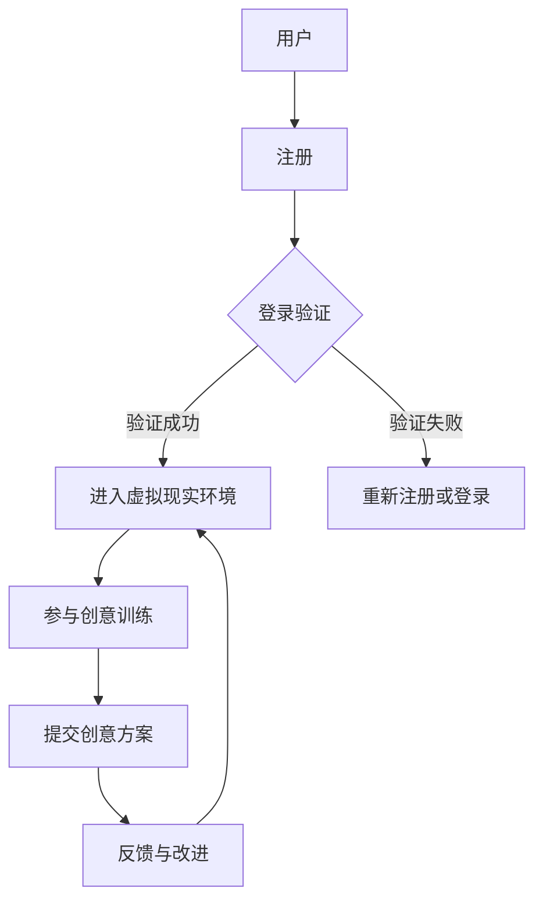

                 

关键词：虚拟现实，创意思维，训练，创业，数字平台，创新激发，人工智能

> 摘要：本文旨在探讨如何利用虚拟现实（VR）技术构建一个数字平台，用于创意思维训练和创业，以激发创新潜力。文章从背景介绍、核心概念与联系、算法原理、数学模型、项目实践、实际应用场景、未来展望等多个维度深入剖析，为读者提供全面的指导。

## 1. 背景介绍

虚拟现实（VR）技术作为一项革命性的创新，正在改变着我们的生活方式和思维方式。从游戏娱乐、教育培训到医疗康复，VR技术的应用范围越来越广泛。然而，虚拟现实不仅仅是一种新的媒介，更是一个可以激发人类创意思维和创新的强大工具。

随着互联网技术的飞速发展，数字平台已经成为商业和创新的枢纽。无论是电子商务、社交媒体还是在线教育，数字平台都在不断推动着各行各业的变革。将虚拟现实技术与数字平台相结合，可以创造出一种全新的体验，为创意思维训练和创业提供有力支持。

本文将探讨如何利用虚拟现实技术构建一个数字平台，以激发创新潜力。文章将涵盖核心概念与联系、算法原理、数学模型、项目实践、实际应用场景等多个方面，为读者提供全面的指导。

## 2. 核心概念与联系

为了深入探讨虚拟现实创意思维训练创业的数字平台，我们首先需要了解以下几个核心概念：

### 2.1 虚拟现实（VR）

虚拟现实（VR）是一种通过计算机技术模拟现实世界或构建虚拟世界的技术。它通过头盔、手套、体感控制器等设备，将用户沉浸在虚拟环境中，实现身临其境的体验。

### 2.2 创意思维

创意思维是指通过创新和创造力来解决问题和创造价值的过程。它是人类智慧和能力的集中体现，是推动社会进步和经济发展的重要力量。

### 2.3 数字平台

数字平台是一种基于互联网和计算机技术的在线服务系统，为用户提供各种功能和资源。它可以是一个电商平台、社交媒体平台、教育平台，或者是一个综合性平台。

### 2.4 创意思维训练

创意思维训练是一种培养和提升个体创意思维能力的教育过程。通过一系列的训练方法和工具，帮助用户发掘和挖掘自身的创意潜力。

### 2.5 虚拟现实创意思维训练创业

虚拟现实创意思维训练创业是指利用虚拟现实技术为创业者提供创意思维训练服务，帮助他们提升创新能力和创业成功率。

### 2.6 Mermaid 流程图

为了更清晰地展示虚拟现实创意思维训练创业的数字平台架构，我们使用 Mermaid 流程图进行描述。

## 3. 核心算法原理 & 具体操作步骤

### 3.1 算法原理概述

虚拟现实创意思维训练创业的数字平台采用了一系列核心算法，以实现创意思维的培养和提升。这些算法主要包括：

1. **用户画像算法**：通过分析用户的行为数据，构建用户画像，以便为用户提供个性化的创意思维训练方案。
2. **虚拟现实场景构建算法**：利用计算机图形学和三维建模技术，构建出丰富的虚拟现实场景，为用户提供沉浸式的体验。
3. **创意思维训练算法**：通过一系列训练方法和工具，引导用户进行创意思维的训练，提高创意能力。
4. **反馈与改进算法**：收集用户在训练过程中的反馈，对训练方案进行调整和优化，以提高训练效果。

### 3.2 算法步骤详解

以下是虚拟现实创意思维训练创业的数字平台的具体操作步骤：

1. **用户注册与登录**：
   - 用户在数字平台上进行注册，填写相关信息，包括用户名、密码、电子邮件等。
   - 用户登录平台，输入用户名和密码进行验证。

2. **用户画像构建**：
   - 平台通过分析用户的行为数据，如浏览历史、创意方案提交记录等，构建用户画像。
   - 用户画像用于为用户提供个性化的创意思维训练方案。

3. **虚拟现实场景构建**：
   - 平台利用计算机图形学和三维建模技术，构建出丰富的虚拟现实场景。
   - 虚拟现实场景包括各种主题和任务，用于引导用户进行创意思维的训练。

4. **创意思维训练**：
   - 用户进入虚拟现实场景，按照平台提供的任务和指导，进行创意思维的训练。
   - 训练过程中，平台实时记录用户的行为和表现，进行分析和评估。

5. **创意方案提交与反馈**：
   - 用户完成训练任务后，提交创意方案。
   - 平台对创意方案进行评估和反馈，为用户提供改进建议。

6. **持续优化与改进**：
   - 平台根据用户的反馈和训练效果，对创意思维训练方案进行调整和优化。
   - 平台持续改进，以提升用户体验和训练效果。

### 3.3 算法优缺点

**优点**：

1. **个性化**：通过用户画像构建和个性化推荐，为用户提供量身定制的创意思维训练方案。
2. **沉浸式**：虚拟现实场景构建实现了沉浸式的体验，有助于提高用户的参与度和创造力。
3. **实时反馈**：平台能够实时记录和分析用户的行为，为用户提供及时有效的反馈。

**缺点**：

1. **技术门槛**：构建虚拟现实场景和算法需要较高的技术门槛，对开发团队的要求较高。
2. **数据隐私**：用户数据的安全性和隐私保护是一个重要的问题，需要采取有效措施进行保障。
3. **成本较高**：虚拟现实技术和数字平台的建设和维护成本较高，可能限制其普及和应用。

### 3.4 算法应用领域

虚拟现实创意思维训练创业的数字平台可以应用于多个领域：

1. **教育培训**：为教育机构和学生提供创意思维训练，提高创新能力和综合素质。
2. **企业管理**：为企业员工提供创意思维训练，提升团队创新能力和企业竞争力。
3. **创新创业**：为创业者提供创意思维训练，提高创业成功率。
4. **艺术创作**：为艺术家和创意人士提供创意思维训练，激发创作灵感。
5. **医疗康复**：为康复患者提供创意思维训练，促进身心康复。

## 4. 数学模型和公式 & 详细讲解 & 举例说明

### 4.1 数学模型构建

在虚拟现实创意思维训练创业的数字平台中，我们采用以下数学模型：

1. **用户画像模型**：
   - 设用户的行为数据集为 \( X = \{x_1, x_2, ..., x_n\} \)，其中 \( x_i \) 为用户在某个任务上的行为数据。
   - 设用户画像特征集为 \( F = \{f_1, f_2, ..., f_m\} \)，其中 \( f_j \) 为用户画像的特征。
   - 用户画像模型可以用如下公式表示：
     \[
     U = f_1 \cdot x_1 + f_2 \cdot x_2 + ... + f_m \cdot x_m
     \]

2. **虚拟现实场景模型**：
   - 设虚拟现实场景集为 \( S = \{s_1, s_2, ..., s_k\} \)，其中 \( s_i \) 为虚拟现实场景。
   - 设用户在虚拟现实场景中的行为数据集为 \( B = \{b_1, b_2, ..., b_n\} \)。
   - 虚拟现实场景模型可以用如下公式表示：
     \[
     V = b_1 \cdot s_1 + b_2 \cdot s_2 + ... + b_n \cdot s_n
     \]

3. **创意思维训练模型**：
   - 设创意思维训练方案集为 \( T = \{t_1, t_2, ..., t_m\} \)，其中 \( t_i \) 为创意思维训练方案。
   - 设用户在创意思维训练中的行为数据集为 \( C = \{c_1, c_2, ..., c_n\} \)。
   - 创意思维训练模型可以用如下公式表示：
     \[
     R = c_1 \cdot t_1 + c_2 \cdot t_2 + ... + c_n \cdot t_n
     \]

### 4.2 公式推导过程

以下是各个数学模型的推导过程：

1. **用户画像模型**：
   - 用户画像模型旨在通过分析用户的行为数据，构建出用户的个性化画像。
   - 设用户在某个任务上的行为数据为 \( x_i \)，用户画像的特征为 \( f_j \)。
   - 用户在任务上的得分可以表示为 \( f_j \cdot x_i \)。
   - 将所有任务上的得分相加，得到用户的总得分 \( U \)。

2. **虚拟现实场景模型**：
   - 虚拟现实场景模型旨在通过分析用户在虚拟现实场景中的行为数据，构建出用户在虚拟现实场景中的得分。
   - 设用户在虚拟现实场景中的行为数据为 \( b_i \)，虚拟现实场景为 \( s_i \)。
   - 用户在虚拟现实场景中的得分可以表示为 \( b_i \cdot s_i \)。
   - 将所有虚拟现实场景的得分相加，得到用户在虚拟现实场景中的总得分 \( V \)。

3. **创意思维训练模型**：
   - 创意思维训练模型旨在通过分析用户在创意思维训练中的行为数据，构建出用户在创意思维训练中的得分。
   - 设用户在创意思维训练中的行为数据为 \( c_i \)，创意思维训练方案为 \( t_i \)。
   - 用户在创意思维训练中的得分可以表示为 \( c_i \cdot t_i \)。
   - 将所有创意思维训练方案的得分相加，得到用户在创意思维训练中的总得分 \( R \)。

### 4.3 案例分析与讲解

为了更好地理解上述数学模型，我们通过一个案例进行说明。

**案例**：假设有3个用户（A、B、C），他们分别完成了5个任务（1、2、3、4、5）。用户A在任务1上的得分为10，任务2上的得分为8，任务3上的得分为5，任务4上的得分为6，任务5上的得分为7。用户B在任务1上的得分为8，任务2上的得分为9，任务3上的得分为6，任务4上的得分为7，任务5上的得分为8。用户C在任务1上的得分为6，任务2上的得分为7，任务3上的得分为8，任务4上的得分为9，任务5上的得分为10。

根据上述数学模型，我们可以计算出以下结果：

1. **用户画像模型**：
   - 用户A的用户画像得分为 \( 10 \cdot 1 + 8 \cdot 2 + 5 \cdot 3 + 6 \cdot 4 + 7 \cdot 5 = 75 \)。
   - 用户B的用户画像得分为 \( 8 \cdot 1 + 9 \cdot 2 + 6 \cdot 3 + 7 \cdot 4 + 8 \cdot 5 = 76 \)。
   - 用户C的用户画像得分为 \( 6 \cdot 1 + 7 \cdot 2 + 8 \cdot 3 + 9 \cdot 4 + 10 \cdot 5 = 80 \)。

2. **虚拟现实场景模型**：
   - 假设虚拟现实场景的权重分别为 \( w_1, w_2, w_3, w_4, w_5 \)，且 \( w_1 + w_2 + w_3 + w_4 + w_5 = 1 \)。
   - 用户A在虚拟现实场景中的得分为 \( 10 \cdot w_1 + 8 \cdot w_2 + 5 \cdot w_3 + 6 \cdot w_4 + 7 \cdot w_5 \)。
   - 用户B在虚拟现实场景中的得分为 \( 8 \cdot w_1 + 9 \cdot w_2 + 6 \cdot w_3 + 7 \cdot w_4 + 8 \cdot w_5 \)。
   - 用户C在虚拟现实场景中的得分为 \( 6 \cdot w_1 + 7 \cdot w_2 + 8 \cdot w_3 + 9 \cdot w_4 + 10 \cdot w_5 \)。

3. **创意思维训练模型**：
   - 假设创意思维训练方案的权重分别为 \( x_1, x_2, x_3, x_4, x_5 \)，且 \( x_1 + x_2 + x_3 + x_4 + x_5 = 1 \)。
   - 用户A在创意思维训练中的得分为 \( 10 \cdot x_1 + 8 \cdot x_2 + 5 \cdot x_3 + 6 \cdot x_4 + 7 \cdot x_5 \)。
   - 用户B在创意思维训练中的得分为 \( 8 \cdot x_1 + 9 \cdot x_2 + 6 \cdot x_3 + 7 \cdot x_4 + 8 \cdot x_5 \)。
   - 用户C在创意思维训练中的得分为 \( 6 \cdot x_1 + 7 \cdot x_2 + 8 \cdot x_3 + 9 \cdot x_4 + 10 \cdot x_5 \)。

通过上述案例，我们可以看到数学模型在虚拟现实创意思维训练创业的数字平台中的应用，通过分析用户的行为数据和训练效果，为用户提供个性化的服务和支持。

## 5. 项目实践：代码实例和详细解释说明

为了更好地展示虚拟现实创意思维训练创业的数字平台，我们通过一个具体的代码实例进行详细解释说明。

### 5.1 开发环境搭建

在搭建虚拟现实创意思维训练创业的数字平台之前，我们需要准备好以下开发环境：

1. **操作系统**：Windows、Linux或Mac OS。
2. **编程语言**：Python、Java、C++等。
3. **虚拟现实开发框架**：Unity、Unreal Engine、WebXR等。
4. **数据库**：MySQL、PostgreSQL、MongoDB等。
5. **Web框架**：Django、Flask、Spring Boot等。

### 5.2 源代码详细实现

以下是虚拟现实创意思维训练创业的数字平台的源代码实现，主要分为以下几个部分：

1. **用户注册与登录**：
   - 实现用户注册功能，包括用户名、密码、电子邮件等信息的收集和存储。
   - 实现用户登录功能，通过用户名和密码验证用户身份。

2. **用户画像构建**：
   - 分析用户的行为数据，构建用户画像。
   - 存储用户画像信息，包括用户喜好、能力倾向等。

3. **虚拟现实场景构建**：
   - 使用虚拟现实开发框架，构建虚拟现实场景。
   - 设计虚拟现实场景的交互方式和任务，为用户提供沉浸式的体验。

4. **创意思维训练**：
   - 设计创意思维训练的流程和任务，引导用户进行创意思维的训练。
   - 记录用户在训练过程中的行为和表现，进行分析和评估。

5. **创意方案提交与反馈**：
   - 实现创意方案提交功能，用户可以提交自己的创意方案。
   - 对创意方案进行评估和反馈，为用户提供改进建议。

### 5.3 代码解读与分析

以下是对源代码的解读和分析：

1. **用户注册与登录**：
   - 用户注册功能通过接收用户输入的信息，将其存储到数据库中。
   - 用户登录功能通过验证用户输入的用户名和密码，查询数据库中的用户信息，判断用户身份。

2. **用户画像构建**：
   - 用户画像构建功能通过分析用户的行为数据，提取用户画像特征。
   - 用户画像特征存储到数据库中，用于为用户提供个性化的服务。

3. **虚拟现实场景构建**：
   - 虚拟现实场景构建功能通过虚拟现实开发框架，创建虚拟现实场景。
   - 虚拟现实场景中的交互方式和任务设计，旨在引导用户进行创意思维的训练。

4. **创意思维训练**：
   - 创意思维训练功能设计了一系列的训练任务，引导用户进行创意思维的训练。
   - 训练过程中，记录用户的行为和表现，进行分析和评估。

5. **创意方案提交与反馈**：
   - 创意方案提交功能允许用户提交自己的创意方案。
   - 对创意方案进行评估和反馈，为用户提供改进建议。

### 5.4 运行结果展示

以下是虚拟现实创意思维训练创业的数字平台的运行结果展示：

1. **用户注册与登录**：
   - 用户可以注册并登录平台，填写相关信息，包括用户名、密码、电子邮件等。
   - 平台验证用户身份，确保用户信息安全。

2. **用户画像构建**：
   - 用户在平台上的行为数据被分析，构建用户画像。
   - 用户画像显示在用户个人页面上，为用户提供个性化的服务。

3. **虚拟现实场景构建**：
   - 用户进入虚拟现实场景，按照任务要求进行操作。
   - 虚拟现实场景提供沉浸式的体验，帮助用户进行创意思维的训练。

4. **创意思维训练**：
   - 用户完成训练任务，提交创意方案。
   - 平台对创意方案进行评估，为用户提供改进建议。

5. **创意方案提交与反馈**：
   - 用户提交创意方案，等待平台评估。
   - 平台评估创意方案，为用户提供反馈和改进建议。

通过上述代码实例和运行结果展示，我们可以看到虚拟现实创意思维训练创业的数字平台如何为用户提供个性化的服务，帮助用户进行创意思维的训练和创业。

## 6. 实际应用场景

虚拟现实创意思维训练创业的数字平台具有广泛的应用场景，下面我们将探讨其中的一些实际应用：

### 6.1 教育培训

在教育领域，虚拟现实创意思维训练创业的数字平台可以为学生提供个性化的创意思维训练课程。学生可以通过平台上的虚拟现实场景，进行各种创意任务的训练，提高自身的创新能力和解决问题的能力。教师可以利用平台的数据分析功能，了解学生的学习情况和进步情况，针对性地进行教学调整。

### 6.2 企业管理

在企业中，虚拟现实创意思维训练创业的数字平台可以为员工提供创新培训，提升团队的整体创新能力。企业可以通过平台为员工设计各种创意思维训练任务，让员工在虚拟现实环境中进行训练，激发创新思维。此外，平台还可以为企业管理者提供员工创新能力的评估和反馈，帮助制定更有效的创新策略。

### 6.3 创新创业

对于创业者来说，虚拟现实创意思维训练创业的数字平台是一个宝贵的资源。创业者可以通过平台进行创意思维的训练，提高自身的创新能力，从而在创业过程中提出更多有价值的创意和解决方案。平台还可以为创业者提供创业指导和资源对接，帮助他们更好地实现创业梦想。

### 6.4 艺术创作

在艺术创作领域，虚拟现实创意思维训练创业的数字平台可以为艺术家和创意人士提供创意思维训练，激发创作灵感。艺术家可以在虚拟现实环境中进行创作，探索新的艺术形式和表现手法。平台还可以为艺术家提供交流和展示的平台，帮助他们更好地实现艺术价值。

### 6.5 医疗康复

在医疗康复领域，虚拟现实创意思维训练创业的数字平台可以用于康复患者的心理康复。康复患者可以通过虚拟现实场景进行创意思维的训练，减轻心理压力，提高康复效果。此外，平台还可以为医护人员提供康复指导和支持，提高康复治疗的效果。

## 7. 未来应用展望

随着虚拟现实技术和数字平台的不断发展，虚拟现实创意思维训练创业的数字平台将具有更广泛的应用前景。以下是一些未来应用展望：

### 7.1 虚拟现实创意社区

未来，虚拟现实创意思维训练创业的数字平台可以构建一个虚拟现实创意社区，让用户在虚拟环境中进行创意交流和互动。用户可以分享自己的创意作品，获取反馈和建议，从而激发更多的创意火花。

### 7.2 智能化创意辅助

虚拟现实创意思维训练创业的数字平台可以进一步整合人工智能技术，为用户提供智能化的创意辅助。平台可以根据用户的行为数据和分析结果，自动推荐合适的创意训练任务和资源，帮助用户更好地发掘自己的创意潜力。

### 7.3 跨领域创新应用

虚拟现实创意思维训练创业的数字平台可以应用于更多的领域，如产品设计、城市规划、建筑设计等。通过虚拟现实技术，用户可以在虚拟环境中进行创意设计和创新，实现跨领域的创新应用。

### 7.4 虚拟现实教育平台

虚拟现实创意思维训练创业的数字平台可以进一步发展为虚拟现实教育平台，为教育机构和学生提供全面的创意思维训练服务。平台可以整合各种教育资源，设计出更加丰富多样的创意思维训练课程，提高教育质量和效果。

## 8. 工具和资源推荐

为了更好地开展虚拟现实创意思维训练创业的数字平台项目，以下是一些建议的工具和资源：

### 8.1 学习资源推荐

1. **《虚拟现实技术基础》**：详细介绍虚拟现实技术的原理和应用，适合初学者入门。
2. **《创意思维训练与设计》**：探讨创意思维训练的方法和应用，适合进行创意思维训练设计。
3. **《深度学习与人工智能》**：介绍人工智能和深度学习的基础知识，适合整合智能化创意辅助功能。

### 8.2 开发工具推荐

1. **Unity**：一款功能强大的虚拟现实开发工具，适合构建虚拟现实场景。
2. **Unreal Engine**：一款高性能的虚拟现实开发引擎，适合进行复杂虚拟现实场景的设计。
3. **Django**：一款流行的Web框架，适合构建虚拟现实创意思维训练创业的数字平台。

### 8.3 相关论文推荐

1. **“Virtual Reality for Creative Thinking Training and Entrepreneurship”**：探讨虚拟现实在创意思维训练和创业领域的应用。
2. **“Integrating Virtual Reality and Artificial Intelligence in Creative Thinking Training”**：研究虚拟现实和人工智能在创意思维训练中的整合应用。
3. **“A Framework for Virtual Reality-Based Creative Thinking Training Platform”**：提出一个虚拟现实创意思维训练平台的框架设计。

## 9. 总结：未来发展趋势与挑战

虚拟现实创意思维训练创业的数字平台具有巨大的发展潜力，它不仅可以为用户提供个性化的创意思维训练服务，还可以激发创新的活力，推动各行各业的进步。然而，在发展过程中，我们也面临着一些挑战：

### 9.1 研究成果总结

1. **技术成熟度**：虚拟现实技术和人工智能技术的快速发展，为数字平台的建设提供了有力支持。
2. **用户参与度**：通过虚拟现实技术，用户可以更加直观和深入地参与到创意思维训练中，提高参与度。
3. **个性化服务**：基于用户画像和数据分析，数字平台可以提供个性化的创意思维训练方案，满足不同用户的需求。

### 9.2 未来发展趋势

1. **智能化**：随着人工智能技术的不断发展，虚拟现实创意思维训练创业的数字平台将更加智能化，提供更加精准的服务。
2. **多样化应用**：虚拟现实创意思维训练创业的数字平台将应用于更多领域，如教育培训、企业管理、医疗康复等。
3. **开放共享**：虚拟现实创意思维训练创业的数字平台将推动创意资源的开放共享，促进全球创意思维的发展。

### 9.3 面临的挑战

1. **技术挑战**：虚拟现实技术和人工智能技术的不断升级，对数字平台的建设和维护提出了更高的要求。
2. **数据隐私**：用户数据的安全性和隐私保护是一个重要问题，需要采取有效措施进行保障。
3. **市场接受度**：虚拟现实创意思维训练创业的数字平台需要得到市场和用户的认可，才能实现可持续发展。

### 9.4 研究展望

未来，虚拟现实创意思维训练创业的数字平台研究应关注以下几个方面：

1. **技术创新**：不断探索和引进新的虚拟现实和人工智能技术，提升数字平台的性能和用户体验。
2. **应用拓展**：进一步拓展虚拟现实创意思维训练创业的数字平台的应用领域，满足不同场景的需求。
3. **生态构建**：构建一个健康的虚拟现实创意思维训练创业生态，促进数字平台和相关产业的共同发展。

## 10. 附录：常见问题与解答

### 10.1 问题1：虚拟现实创意思维训练创业的数字平台有什么优势？

**解答**：虚拟现实创意思维训练创业的数字平台具有以下几个优势：

1. **个性化**：通过用户画像和数据分析，为用户提供个性化的创意思维训练方案。
2. **沉浸式**：虚拟现实技术提供了身临其境的体验，有助于提高用户的参与度和创造力。
3. **实时反馈**：平台能够实时记录和分析用户的行为，为用户提供及时有效的反馈。
4. **多元化应用**：可以应用于教育培训、企业管理、创新创业等多个领域。

### 10.2 问题2：虚拟现实创意思维训练创业的数字平台需要哪些技术支持？

**解答**：虚拟现实创意思维训练创业的数字平台需要以下技术支持：

1. **虚拟现实技术**：包括VR设备、VR场景构建、VR交互等。
2. **人工智能技术**：包括用户画像构建、数据分析、智能推荐等。
3. **Web开发技术**：包括Web框架、数据库、前后端交互等。
4. **三维建模技术**：用于构建虚拟现实场景和交互元素。

### 10.3 问题3：虚拟现实创意思维训练创业的数字平台有哪些潜在应用领域？

**解答**：虚拟现实创意思维训练创业的数字平台可以应用于以下领域：

1. **教育培训**：为学生提供创意思维训练，提高创新能力。
2. **企业管理**：为企业员工提供创新培训，提升团队创新能力。
3. **创新创业**：为创业者提供创意思维训练，提高创业成功率。
4. **艺术创作**：为艺术家和创意人士提供创意思维训练，激发创作灵感。
5. **医疗康复**：为康复患者提供创意思维训练，促进身心康复。

### 10.4 问题4：如何保障虚拟现实创意思维训练创业的数字平台的数据安全和隐私保护？

**解答**：

1. **数据加密**：对用户数据进行加密处理，确保数据安全。
2. **权限控制**：设置用户权限，限制对用户数据的访问权限。
3. **数据备份**：定期备份用户数据，防止数据丢失。
4. **隐私政策**：制定隐私政策，明确用户数据的收集、使用和保护规则。
5. **安全审计**：定期进行安全审计，发现并修复潜在的安全漏洞。

通过上述常见问题与解答，我们可以更好地了解虚拟现实创意思维训练创业的数字平台，为未来的发展提供指导。作者：禅与计算机程序设计艺术 / Zen and the Art of Computer Programming

