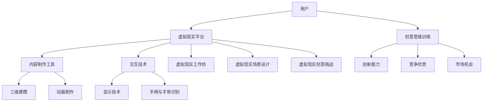

                 

关键词：虚拟现实、创意思维训练、创新、数字平台、创业

> 摘要：本文探讨了如何利用虚拟现实技术构建一个数字平台，以激发创意思维和促进创业活动。通过介绍虚拟现实的概念、核心原理和实现技术，分析了虚拟现实在创意思维训练中的应用，并探讨了一个基于虚拟现实的数字平台的设计思路和实施步骤。本文旨在为创业者提供一种创新的思维训练方法，帮助他们在竞争激烈的市场中脱颖而出。

## 1. 背景介绍

随着科技的飞速发展，虚拟现实（VR）技术已经逐渐从科幻领域走向现实生活。VR技术通过模拟和增强现实环境，使用户能够沉浸在虚拟世界中，进行各种互动体验。这一技术不仅改变了娱乐产业，还带来了教育、医疗、设计等多个领域的革新。与此同时，创意思维在现代社会中越来越受到重视，特别是在创业领域。创业活动往往需要创新的想法和独特的视角，而虚拟现实技术为创意思维训练提供了新的可能性。

本文旨在探讨如何利用虚拟现实技术构建一个数字平台，以激发创意思维和促进创业活动。通过介绍虚拟现实的核心概念、实现技术和在创意思维训练中的应用，本文将提供一个全面的技术指南，帮助创业者利用这一先进技术进行创新。

### 1.1 虚拟现实技术概述

虚拟现实技术是指通过计算机生成一种模拟环境，使用户能够在这种环境中进行感知、交互和体验。虚拟现实的关键特点包括：

- **沉浸感**：用户能够完全沉浸在虚拟环境中，感觉仿佛身处现实世界。
- **交互性**：用户可以通过各种设备与虚拟环境进行互动，例如头戴式显示器、手柄、手势识别等。
- **想象性**：虚拟现实能够创造现实中不存在的事物，激发用户的想象力和创造力。

虚拟现实技术主要包括以下三个核心组成部分：

- **显示技术**：包括头戴式显示器（HMD）和投影技术，用于将虚拟环境呈现给用户。
- **交互技术**：包括手柄、手势识别、语音控制等，用于用户与虚拟环境的交互。
- **内容制作**：包括三维建模、动画制作、场景设计等，用于构建虚拟环境。

### 1.2 创意思维的重要性

创意思维是指通过创新的思维方式和方法，产生新颖的想法和解决方案。在现代社会中，创意思维的重要性日益凸显，特别是在创业领域。以下是创意思维在创业中的几个重要作用：

- **创新能力**：创意思维是创新的基础，创业需要不断创新以适应市场和用户需求。
- **竞争优势**：独特的创意思维能够为企业带来竞争优势，使其在激烈的市场竞争中脱颖而出。
- **市场机会**：创意思维能够发现新的市场机会，开发新产品和服务，满足未被满足的需求。

### 1.3 虚拟现实在创意思维训练中的应用

虚拟现实技术在创意思维训练中具有独特的优势，能够提供更加真实和丰富的体验，从而激发用户的创意思维。以下是虚拟现实在创意思维训练中的几个应用场景：

- **虚拟现实工作坊**：通过虚拟现实工作坊，参与者可以在一个沉浸式的环境中进行创意思维训练。他们可以进入虚拟会议室、创意空间等，与其他参与者进行互动和协作。
- **虚拟现实场景设计**：虚拟现实场景设计工具可以帮助设计师在虚拟环境中进行空间规划和布局，从而激发创意思维。设计师可以尝试不同的设计方案，快速迭代和优化。
- **虚拟现实创意挑战**：通过虚拟现实创意挑战，参与者需要在虚拟环境中解决各种问题，从而激发他们的创意思维。这些挑战可以是游戏化的，也可以是现实世界的模拟。

## 2. 核心概念与联系

在构建一个基于虚拟现实的数字平台之前，我们需要了解一些核心概念和它们之间的联系。以下是一个简化的 Mermaid 流程图，用于展示这些核心概念和它们之间的关系。



### 2.1 核心概念解释

- **用户**：虚拟现实平台的服务对象，可以是个人用户或企业用户。
- **虚拟现实平台**：一个数字平台，用于提供虚拟现实体验和服务。
- **内容制作工具**：用于创建虚拟环境的内容，包括三维建模和动画制作工具。
- **交互技术**：用户与虚拟环境交互的方法，包括显示技术、手柄和手势识别等。
- **显示技术**：将虚拟环境呈现给用户的设备，如头戴式显示器。
- **手柄与手势识别**：用于用户与虚拟环境交互的设备和技术。
- **创意思维训练**：通过虚拟现实平台提供的服务，用于培养和激发用户的创意思维。
- **虚拟现实工作坊**：一个沉浸式的环境，用于进行创意思维训练。
- **虚拟现实场景设计**：通过虚拟现实技术进行空间规划和布局。
- **虚拟现实创意挑战**：通过虚拟现实平台提供的一系列挑战，用于激发创意思维。

## 3. 核心算法原理 & 具体操作步骤

### 3.1 算法原理概述

虚拟现实平台的核心算法主要涉及以下几个方面：

- **场景渲染**：通过图形渲染技术，将虚拟环境以逼真的方式呈现给用户。
- **物理仿真**：模拟虚拟环境中的物理现象，如重力、碰撞等，提高沉浸感。
- **交互控制**：处理用户与虚拟环境的交互，如手势识别、语音控制等。
- **数据同步**：确保多个用户在虚拟环境中的动作和状态同步。

### 3.2 算法步骤详解

#### 3.2.1 场景渲染

场景渲染是虚拟现实平台的核心算法之一，其基本步骤如下：

1. **场景建模**：使用三维建模工具创建虚拟环境的几何模型。
2. **材质和纹理**：为场景中的物体添加材质和纹理，提高视觉效果。
3. **光照处理**：模拟真实世界的光照效果，包括阳光、阴影等。
4. **渲染引擎**：使用渲染引擎（如Unity或Unreal Engine）进行场景渲染，生成图像数据。

#### 3.2.2 物理仿真

物理仿真用于模拟虚拟环境中的物理现象，提高沉浸感。基本步骤如下：

1. **物理引擎**：选择合适的物理引擎（如PhysX或Bullet）。
2. **碰撞检测**：检测虚拟物体之间的碰撞，计算碰撞效果。
3. **运动学**：模拟虚拟物体在虚拟环境中的运动，如行走、跳跃等。
4. **力场模拟**：模拟虚拟环境中的重力、风力等力场效果。

#### 3.2.3 交互控制

交互控制是用户与虚拟环境交互的核心，基本步骤如下：

1. **手势识别**：使用计算机视觉技术识别用户的手势。
2. **语音识别**：使用语音识别技术处理用户的语音命令。
3. **手柄控制**：通过手柄（如VR手柄）发送控制信号，控制虚拟物体。
4. **反馈机制**：根据用户的交互动作，提供视觉、听觉等反馈。

#### 3.2.4 数据同步

数据同步用于确保多个用户在虚拟环境中的动作和状态同步，基本步骤如下：

1. **网络传输**：使用网络传输协议（如WebSocket）传输用户数据。
2. **位置同步**：同步用户在虚拟环境中的位置和方向。
3. **状态同步**：同步用户在虚拟环境中的状态，如物品持有、角色状态等。
4. **冲突检测**：检测和解决多个用户之间的冲突，如碰撞、争用资源等。

### 3.3 算法优缺点

#### 优点

- **沉浸感强**：虚拟现实技术能够提供高度沉浸的体验，使用户感觉仿佛置身于虚拟环境中。
- **交互性高**：虚拟现实技术支持多种交互方式，如手势识别、语音控制等，提高用户参与度。
- **灵活性高**：虚拟现实平台可以根据用户需求灵活调整场景和功能，满足个性化需求。

#### 缺点

- **技术门槛高**：虚拟现实技术涉及多个领域，如计算机图形学、物理仿真、计算机视觉等，开发难度较高。
- **硬件成本高**：虚拟现实设备（如头戴式显示器、手柄等）成本较高，限制了部分用户的参与。
- **性能要求高**：虚拟现实平台需要高性能的计算和图形处理能力，以支持流畅的渲染和交互。

### 3.4 算法应用领域

虚拟现实技术在创意思维训练中的应用范围广泛，包括但不限于以下领域：

- **教育培训**：通过虚拟现实技术提供沉浸式的教育培训体验，提高学习效果。
- **产品设计**：通过虚拟现实场景设计工具进行产品设计和测试，提高产品设计质量。
- **游戏开发**：利用虚拟现实技术开发新颖的游戏体验，吸引更多玩家。
- **虚拟旅游**：通过虚拟现实技术提供虚拟旅游体验，让用户感受到不同的文化和风景。

## 4. 数学模型和公式 & 详细讲解 & 举例说明

虚拟现实技术涉及到许多数学模型和公式，以下是一些常见的数学模型和公式的讲解以及举例说明。

### 4.1 数学模型构建

虚拟现实技术中的数学模型主要包括以下几种：

- **三维空间坐标系统**：用于描述虚拟环境中的物体位置和方向。
- **三维几何模型**：用于构建虚拟环境中的物体和场景。
- **光照模型**：用于模拟虚拟环境中的光照效果。
- **纹理映射模型**：用于在虚拟物体上映射纹理。
- **物理仿真模型**：用于模拟虚拟环境中的物理现象。

### 4.2 公式推导过程

以下是一些常用的数学公式及其推导过程：

- **三维空间坐标变换**：

$$
\begin{align*}
x' &= x \cos \theta - y \sin \theta \\
y' &= x \sin \theta + y \cos \theta \\
z' &= z
\end{align*}
$$

其中，$x, y, z$ 是原始坐标，$\theta$ 是旋转角度。

- **纹理映射公式**：

$$
\begin{align*}
u' &= \frac{u - u_0}{u_1 - u_0} \\
v' &= \frac{v - v_0}{v_1 - v_0}
\end{align*}
$$

其中，$u, v$ 是纹理坐标，$u_0, u_1, v_0, v_1$ 是纹理边界坐标。

- **光照模型**：

$$
L_i = I_i \cdot cos(\theta_i)
$$

其中，$L_i$ 是光照强度，$I_i$ 是光源强度，$\theta_i$ 是光线与物体表面的夹角。

### 4.3 案例分析与讲解

以下是一个简单的虚拟现实场景渲染的案例，用于说明数学模型和公式的应用。

**案例**：创建一个简单的三维立方体，并为其添加光照效果。

**步骤**：

1. **创建立方体**：使用三维建模工具创建一个立方体，并设置其材质和纹理。
2. **设置光照**：创建一个光源，并设置其强度和方向。
3. **计算光照强度**：根据光源位置和立方体表面法线，计算每个顶点的光照强度。
4. **渲染立方体**：使用渲染引擎渲染立方体，并显示光照效果。

**代码示例**：

```python
# 创建立方体
cube = create_cube()

# 设置光照
light = create_light()
light.intensity = 1.0
light.position = (0.0, 0.0, 10.0)

# 计算光照强度
for vertex in cube.vertices:
    normal = vertex.normal
    L_i = light.intensity * math.cos(math.radians(angle_between(light.position, vertex)))

# 渲染立方体
render(cube, L_i)
```

通过这个案例，我们可以看到数学模型和公式在虚拟现实场景渲染中的具体应用。

## 5. 项目实践：代码实例和详细解释说明

为了更好地理解虚拟现实技术在创意思维训练中的应用，我们以下将通过一个具体的案例来介绍如何实现一个基于虚拟现实的数字平台。这个案例将涉及开发环境的搭建、源代码的详细实现和代码解读与分析。

### 5.1 开发环境搭建

首先，我们需要搭建一个开发环境，以便进行虚拟现实平台的开发。以下是一个基本的开发环境搭建步骤：

1. **安装Unity编辑器**：Unity是一个流行的游戏和虚拟现实开发平台，提供了丰富的工具和功能。可以从Unity官网下载并安装Unity编辑器。
2. **安装Unity插件**：为了支持虚拟现实开发，我们需要安装一些Unity插件，如Unity VR Plugin和Unity Animation Plugin。这些插件可以从Unity Asset Store下载。
3. **安装Unity VR设备**：为了进行虚拟现实体验，我们需要安装一个虚拟现实设备，如Oculus Rift或HTC Vive。这些设备可以在官方网站上购买。

### 5.2 源代码详细实现

以下是一个简单的虚拟现实平台源代码实现示例。这个示例将创建一个简单的虚拟场景，并允许用户在场景中自由移动和互动。

**文件**：`Main.unity`

```csharp
using UnityEngine;

public class Main : MonoBehaviour
{
    public GameObject player;
    public float moveSpeed = 5.0f;

    private void Update()
    {
        MovePlayer();
    }

    private void MovePlayer()
    {
        float horizontal = Input.GetAxis("Horizontal");
        float vertical = Input.GetAxis("Vertical");

        Vector3 direction = new Vector3(horizontal, 0, vertical);
        direction.Normalize();

        player.transform.position += direction * moveSpeed * Time.deltaTime;
    }
}
```

### 5.3 代码解读与分析

这个简单的源代码实现了以下功能：

1. **场景创建**：使用`GameObject`创建了一个名为`player`的虚拟角色。
2. **移动控制**：通过`Update`方法，根据用户输入的横向和纵向值，计算移动方向，并更新角色的位置。
3. **速度控制**：通过`moveSpeed`变量，控制角色的移动速度。

这个示例代码非常简单，但它展示了虚拟现实平台开发的基本流程和核心功能。在实际开发中，我们还需要实现更多的功能，如交互控制、场景渲染、物理仿真等。

### 5.4 运行结果展示

在Unity编辑器中运行这个虚拟现实平台，我们可以看到以下结果：

- **场景渲染**：虚拟场景中的物体和角色被正确渲染。
- **移动控制**：用户可以通过键盘上的方向键或手柄控制角色在场景中移动。

通过这个示例，我们可以看到如何使用虚拟现实技术构建一个简单的数字平台，以激发创意思维和促进创业活动。

## 6. 实际应用场景

虚拟现实技术在创意思维训练中具有广泛的应用场景，以下是一些具体的实际应用场景：

### 6.1 虚拟现实工作坊

虚拟现实工作坊是一种利用虚拟现实技术进行创意思维训练的有效方法。在工作坊中，参与者可以进入一个沉浸式的虚拟环境，与其他参与者进行互动和协作。以下是一个虚拟现实工作坊的应用示例：

1. **场景构建**：使用虚拟现实场景设计工具，创建一个虚拟会议室或创意空间。
2. **任务分配**：将参与者分为小组，并分配不同的创意任务。
3. **互动与协作**：参与者可以在虚拟环境中进行讨论、分享想法和协作，利用虚拟现实技术的交互性提高合作效率。
4. **反馈与评价**：在任务完成后，参与者可以回顾和评价自己的创意成果，并获得他人的反馈。

### 6.2 虚拟现实场景设计

虚拟现实场景设计是一种利用虚拟现实技术进行空间规划和布局的方法。以下是一个虚拟现实场景设计的应用示例：

1. **空间建模**：使用三维建模工具，创建一个虚拟空间，如商场、展览馆等。
2. **布局优化**：在虚拟空间中进行布局设计，尝试不同的布局方案，通过虚拟现实技术的交互性进行实时调整和优化。
3. **效果评估**：通过虚拟现实技术展示设计效果，评估布局方案对用户体验的影响，并根据评估结果进行进一步的优化。

### 6.3 虚拟现实创意挑战

虚拟现实创意挑战是一种利用虚拟现实技术激发创意思维的方法。以下是一个虚拟现实创意挑战的应用示例：

1. **挑战设计**：设计一个虚拟现实挑战，如解决虚拟世界中的问题、完成创意任务等。
2. **挑战参与**：参与者进入虚拟现实环境，参与挑战。
3. **创意激发**：通过虚拟现实技术的沉浸感和互动性，激发参与者的创意思维，鼓励他们提出新颖的想法和解决方案。
4. **结果评估**：对挑战结果进行评估，根据评估结果进行创意分析和总结。

这些实际应用场景展示了虚拟现实技术在创意思维训练中的广泛应用，为创业者提供了一个创新的思维训练方法，帮助他们更好地应对市场竞争。

### 6.4 未来应用展望

随着虚拟现实技术的不断发展，其在创意思维训练中的应用前景将更加广阔。以下是未来应用的一些展望：

- **个性化培训**：虚拟现实技术可以提供个性化的培训体验，根据用户的需求和特点进行定制化的训练。
- **远程协作**：虚拟现实技术可以实现远程协作，让参与者无论身处何地都能进行有效的互动和合作。
- **虚拟现实社区**：建立虚拟现实社区，让用户在虚拟世界中交流、分享创意和经验。
- **虚拟现实会议**：利用虚拟现实技术进行虚拟会议，提高会议效率和参与度。

未来，虚拟现实技术将不断创新，为创意思维训练带来更多可能性，为创业者提供更强大的思维工具。

## 7. 工具和资源推荐

### 7.1 学习资源推荐

- **《虚拟现实技术基础》**：一本全面介绍虚拟现实技术的基础知识和应用实践的书籍。
- **《虚拟现实设计与开发》**：一本详细介绍虚拟现实设计工具和开发流程的书籍。
- **《创意思维训练》**：一本介绍创意思维方法和技巧的书籍，适用于虚拟现实环境中的创意思维训练。

### 7.2 开发工具推荐

- **Unity**：一个功能强大的游戏和虚拟现实开发平台，适用于构建各种虚拟现实应用。
- **Unreal Engine**：一个高性能的游戏和虚拟现实引擎，提供丰富的工具和功能。
- **Blender**：一个免费的开源三维建模和渲染工具，适用于虚拟现实场景设计和内容制作。

### 7.3 相关论文推荐

- **“Virtual Reality in Education: A Comprehensive Review”**：一篇关于虚拟现实在教育领域应用的综述性论文。
- **“The Impact of Virtual Reality on Creativity and Innovation”**：一篇关于虚拟现实在创意思维和创新能力方面的研究论文。
- **“Designing Virtual Reality Experiences for Creativity and Collaboration”**：一篇关于虚拟现实创意和协作设计的学术论文。

这些资源和工具将为创业者提供丰富的技术支持和理论指导，帮助他们更好地利用虚拟现实技术进行创意思维训练。

## 8. 总结：未来发展趋势与挑战

虚拟现实技术在创意思维训练中的应用前景广阔，但也面临一些挑战。以下是对未来发展趋势和面临的挑战的总结。

### 8.1 研究成果总结

虚拟现实技术在创意思维训练中的应用已经取得了一系列重要成果：

- **沉浸式体验**：通过虚拟现实技术，用户能够获得高度沉浸的体验，从而更好地激发创意思维。
- **交互性增强**：虚拟现实技术提供了丰富的交互方式，如手势识别、语音控制等，提高了用户的参与度和互动性。
- **场景多样化**：虚拟现实技术可以创建多样化的虚拟场景，为创意思维训练提供了更多的选择和可能性。

### 8.2 未来发展趋势

虚拟现实技术在创意思维训练中的未来发展趋势包括：

- **个性化培训**：虚拟现实技术将逐步实现个性化培训，根据用户的需求和特点提供定制化的训练方案。
- **远程协作**：虚拟现实技术将促进远程协作，让参与者无论身处何地都能进行有效的互动和合作。
- **虚拟现实社区**：虚拟现实社区将兴起，成为用户交流、分享创意和经验的平台。
- **虚拟现实会议**：虚拟现实会议将成为一种新的会议形式，提高会议效率和参与度。

### 8.3 面临的挑战

虚拟现实技术在创意思维训练中面临的挑战主要包括：

- **技术门槛**：虚拟现实技术涉及多个领域，开发难度较高，需要专业的技术知识和经验。
- **硬件成本**：虚拟现实设备（如头戴式显示器、手柄等）成本较高，限制了部分用户的参与。
- **性能瓶颈**：虚拟现实技术对计算和图形处理能力要求较高，性能瓶颈可能会影响用户体验。

### 8.4 研究展望

未来，虚拟现实技术在创意思维训练中的应用有望实现以下突破：

- **更高效的算法**：研究和开发更高效的虚拟现实算法，提高渲染和交互性能。
- **更丰富的内容**：开发和提供更多丰富多样的虚拟现实场景和内容，满足不同用户的需求。
- **更广泛的适用性**：扩大虚拟现实技术在创意思维训练中的应用范围，使其适用于更多的领域和场景。

通过不断的研究和探索，虚拟现实技术将在创意思维训练中发挥更大的作用，为创业者提供更强大的思维工具。

## 9. 附录：常见问题与解答

以下是一些关于虚拟现实技术在创意思维训练中应用的常见问题及解答。

### 9.1 虚拟现实技术如何激发创意思维？

虚拟现实技术通过提供高度沉浸的体验和丰富的交互方式，可以激发用户的创意思维。用户可以在一个逼真的虚拟环境中进行互动和探索，从而产生新颖的想法和解决方案。

### 9.2 虚拟现实平台开发需要哪些技能和工具？

虚拟现实平台开发需要掌握多个领域的技能和工具，包括三维建模、动画制作、计算机图形学、物理仿真、计算机视觉等。常用的开发工具包括Unity、Unreal Engine、Blender等。

### 9.3 虚拟现实设备是否昂贵？

虚拟现实设备的成本较高，特别是高端设备（如Oculus Rift、HTC Vive等）。但对于一些入门级别的设备（如Google Cardboard、Samsung Gear VR等），成本相对较低。

### 9.4 虚拟现实技术是否安全？

虚拟现实技术在安全方面有一些挑战，如运动病、眼睛疲劳等。然而，随着技术的不断发展和优化，这些问题正在逐渐得到解决。建议用户在使用虚拟现实设备时注意适度使用，避免长时间连续使用。

### 9.5 虚拟现实技术在创意思维训练中的具体应用案例有哪些？

虚拟现实技术在创意思维训练中有很多具体的应用案例，如虚拟现实工作坊、虚拟现实场景设计、虚拟现实创意挑战等。这些应用场景展示了虚拟现实技术在激发创意思维方面的巨大潜力。

### 9.6 虚拟现实技术如何提升创业创新能力？

虚拟现实技术通过提供沉浸式的体验和丰富的交互方式，可以帮助创业者进行头脑风暴、场景模拟和产品测试，从而提升创新能力和市场竞争力。创业者可以利用虚拟现实技术快速迭代和优化产品，抢占市场先机。

### 9.7 虚拟现实技术是否具有市场前景？

虚拟现实技术具有巨大的市场前景，特别是在创意思维训练、教育培训、产品设计、游戏开发等领域。随着技术的不断成熟和应用场景的拓展，虚拟现实技术的市场潜力将进一步释放。

