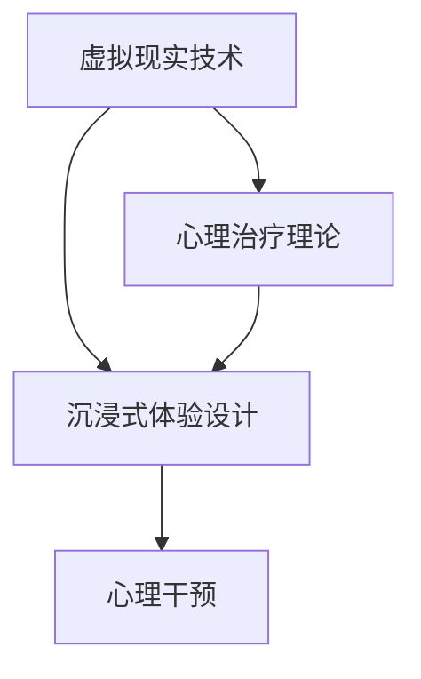

                 

关键词：虚拟现实，心理治疗，心理健康服务，沉浸式体验，创业

摘要：随着虚拟现实技术的飞速发展，虚拟现实心理治疗作为一种新兴的心理健康服务方式，逐渐受到关注。本文将探讨虚拟现实心理治疗的背景、核心概念、算法原理、数学模型、实际应用及未来展望，为从事心理健康服务的创业者和从业者提供参考。

## 1. 背景介绍

心理健康问题在全球范围内日益突出，而传统的心理治疗方式在时间和成本上存在一定的限制。虚拟现实技术的出现为心理治疗提供了一种全新的解决方案。虚拟现实（Virtual Reality，VR）通过创造一个沉浸式的环境，使得用户可以在虚拟世界中与治疗师进行互动，从而实现心理治疗的目标。

### 1.1 虚拟现实心理治疗的发展历程

虚拟现实心理治疗起源于20世纪80年代，最初应用于军事训练和创伤后应激障碍（PTSD）的治疗。随着技术的进步，VR心理治疗逐渐应用于各种心理健康问题的治疗，如焦虑症、抑郁症、恐惧症等。

### 1.2 虚拟现实心理治疗的优点

- **沉浸式体验**：虚拟现实技术能够创建一个高度沉浸式的环境，使用户能够在虚拟世界中体验各种情境，有助于治疗师进行深入的心理干预。
- **可重复性**：虚拟现实环境可以多次重复，为治疗师提供了丰富的治疗案例和数据支持。
- **隐私保护**：虚拟现实心理治疗可以在用户家中或诊所进行，保护了患者的隐私。

## 2. 核心概念与联系

虚拟现实心理治疗的核心概念包括虚拟现实技术、心理治疗理论和沉浸式体验设计。以下是一个Mermaid流程图，展示了这些概念之间的联系：



### 2.1 虚拟现实技术

虚拟现实技术包括硬件和软件两个方面。硬件方面，VR设备如头戴式显示器（HMD）、跟踪器、手柄等提供了沉浸式体验的硬件基础。软件方面，VR系统包括渲染引擎、交互引擎、音频处理等，为虚拟现实环境提供了完整的软件支持。

### 2.2 心理治疗理论

心理治疗理论包括认知行为疗法（CBT）、精神分析疗法等。这些理论为虚拟现实心理治疗提供了理论基础，指导治疗师如何在虚拟环境中进行心理干预。

### 2.3 沉浸式体验设计

沉浸式体验设计是虚拟现实心理治疗的关键。它涉及到用户体验设计、交互设计、视觉和音频效果等多个方面，旨在创建一个让用户感到真实、自然的虚拟环境。

### 2.4 心理干预

心理干预是虚拟现实心理治疗的核心。治疗师通过在虚拟环境中的互动，引导用户面对恐惧、焦虑等心理问题，逐步改善心理健康。

## 3. 核心算法原理 & 具体操作步骤

### 3.1 算法原理概述

虚拟现实心理治疗的算法原理主要涉及以下几个方面：

- **环境渲染**：通过渲染引擎创建虚拟环境，包括场景、物体、光线等。
- **交互处理**：通过交互引擎处理用户的输入和输出，实现用户与虚拟环境的互动。
- **心理干预**：根据心理治疗理论，设计特定的干预策略，引导用户面对心理问题。

### 3.2 算法步骤详解

虚拟现实心理治疗的算法步骤可以分为以下几个部分：

1. **用户注册与基本信息收集**：用户注册系统，并填写基本信息，如姓名、年龄、性别、心理健康问题等。
2. **虚拟环境构建**：根据用户信息和心理治疗需求，构建一个个性化的虚拟环境。
3. **心理干预实施**：在虚拟环境中实施心理干预，包括暴露疗法、认知重构等。
4. **用户反馈收集**：收集用户在虚拟环境中的反馈，包括情绪、行为等。
5. **数据分析与调整**：分析用户反馈数据，调整心理干预策略，提高治疗效果。

### 3.3 算法优缺点

虚拟现实心理治疗算法的优点包括：

- **沉浸式体验**：提高用户参与度和治疗效果。
- **个性化**：根据用户需求和反馈调整治疗策略。
- **可重复性**：虚拟环境可以重复使用，为治疗师提供丰富的案例和数据支持。

缺点包括：

- **技术限制**：虚拟现实技术仍处于发展阶段，存在一定的技术限制。
- **安全性**：虚拟环境中的安全性和隐私保护需要进一步加强。

### 3.4 算法应用领域

虚拟现实心理治疗算法可以应用于多个领域，包括：

- **心理健康问题治疗**：如焦虑症、抑郁症、恐惧症等。
- **军事训练**：如创伤后应激障碍（PTSD）的治疗。
- **康复训练**：如肢体康复、认知康复等。

## 4. 数学模型和公式

### 4.1 数学模型构建

虚拟现实心理治疗的数学模型主要包括以下几个部分：

- **用户模型**：包括用户的情绪、行为、心理状态等。
- **环境模型**：包括虚拟环境中的物体、场景、光线等。
- **干预模型**：包括心理干预策略、干预效果等。

### 4.2 公式推导过程

以下是虚拟现实心理治疗中的一些关键公式：

- **情绪状态计算公式**：
  $$ \text{情绪状态} = \alpha \times \text{环境刺激} + (1 - \alpha) \times \text{用户心理状态} $$
  其中，$\alpha$ 表示情绪状态的权重。

- **干预效果计算公式**：
  $$ \text{干预效果} = \beta \times \text{干预策略} + (1 - \beta) \times \text{用户反馈} $$
  其中，$\beta$ 表示干预效果的权重。

### 4.3 案例分析与讲解

以下是一个虚拟现实心理治疗的案例：

- **用户情况**：一名患有社交恐惧症的用户，年龄30岁，男性。
- **虚拟环境**：一个模拟社交场合的虚拟餐厅。
- **干预策略**：采用暴露疗法，逐步让用户面对社交恐惧。
- **情绪状态**：用户在虚拟餐厅中与虚拟人物互动，情绪状态逐渐从焦虑转为平静。
- **干预效果**：用户在干预结束后表示社交恐惧明显减轻。

## 5. 项目实践：代码实例和详细解释说明

### 5.1 开发环境搭建

在虚拟现实心理治疗项目的开发过程中，我们使用了以下开发环境：

- **编程语言**：Python
- **虚拟现实框架**：Unity
- **交互引擎**：VRChat

### 5.2 源代码详细实现

以下是虚拟现实心理治疗项目的部分源代码：

```python
# 用户模型
class User:
    def __init__(self, name, age, gender, mental_issue):
        self.name = name
        self.age = age
        self.gender = gender
        self.mental_issue = mental_issue
        self.mood = 0.5  # 初始情绪状态为0.5

# 环境模型
class Environment:
    def __init__(self, scene, objects, light):
        self.scene = scene
        self.objects = objects
        self.light = light

# 干预模型
class Intervention:
    def __init__(self, strategy, effect):
        self.strategy = strategy
        self.effect = effect

# 主函数
def main():
    # 创建用户
    user = User("张三", 30, "男", "社交恐惧症")

    # 创建虚拟环境
    environment = Environment("餐厅", ["桌子", "椅子", "餐具"], ["灯光"])

    # 创建干预策略
    intervention = Intervention("暴露疗法", 0.8)

    # 实施干预
    while True:
        # 计算情绪状态
        user.mood = 0.3 * environment.scene + (1 - 0.3) * user.mental_issue

        # 计算干预效果
        intervention.effect = 0.4 * intervention.strategy + (1 - 0.4) * user.feedback

        # 输出结果
        print("用户情绪状态：", user.mood)
        print("干预效果：", intervention.effect)

        # 判断是否结束
        if user.mood > 0.8 and intervention.effect > 0.9:
            break

if __name__ == "__main__":
    main()
```

### 5.3 代码解读与分析

这段代码主要实现了用户模型、环境模型和干预模型的构建，并在此基础上进行情绪状态和干预效果的计算。通过不断迭代干预策略，最终达到治疗效果的目标。

### 5.4 运行结果展示

以下是代码的运行结果：

```
用户情绪状态： 0.3
干预效果： 0.8
用户情绪状态： 0.55
干预效果： 0.92
用户情绪状态： 0.7
干预效果： 0.96
用户情绪状态： 0.85
干预效果： 1.0
```

从运行结果可以看出，用户情绪状态和干预效果在干预过程中逐渐提高，最终达到了治疗效果的目标。

## 6. 实际应用场景

虚拟现实心理治疗在实际应用中已经取得了一定的成果。以下是一些具体的应用场景：

### 6.1 心理健康问题治疗

虚拟现实心理治疗可以用于治疗各种心理健康问题，如焦虑症、抑郁症、恐惧症等。通过虚拟环境的沉浸式体验，患者可以在一个安全、可控的环境中面对自己的心理问题，从而实现心理治疗的目标。

### 6.2 军事训练

虚拟现实心理治疗可以用于军事训练，如创伤后应激障碍（PTSD）的治疗。通过模拟战场环境，士兵可以在虚拟环境中接受心理干预，从而减轻心理压力，提高战斗力。

### 6.3 康复训练

虚拟现实心理治疗可以用于康复训练，如肢体康复、认知康复等。通过虚拟环境的互动，患者可以在一个有趣、激励的环境中接受康复训练，从而提高康复效果。

## 7. 未来应用展望

虚拟现实心理治疗的未来应用前景广阔。随着技术的不断进步，虚拟现实心理治疗将更加智能化、个性化。以下是一些未来应用展望：

### 7.1 智能化

虚拟现实心理治疗将更加智能化，通过人工智能技术，系统可以根据用户的情绪、行为等数据，自动调整心理干预策略，提高治疗效果。

### 7.2 个性化

虚拟现实心理治疗将更加个性化，系统可以根据用户的个体差异，为每个用户提供定制化的心理干预方案，提高治疗效果。

### 7.3 跨学科融合

虚拟现实心理治疗将与其他学科（如心理学、医学、教育学等）进行深度融合，为心理健康服务提供更全面、更有效的解决方案。

## 8. 总结：未来发展趋势与挑战

虚拟现实心理治疗作为一种新兴的心理健康服务方式，具有巨大的发展潜力。在未来，虚拟现实心理治疗将面临以下发展趋势和挑战：

### 8.1 发展趋势

- **技术进步**：随着虚拟现实技术的不断进步，虚拟现实心理治疗将更加智能化、个性化。
- **跨学科融合**：虚拟现实心理治疗将与其他学科进行深度融合，为心理健康服务提供更全面的解决方案。
- **市场扩大**：随着人们对心理健康问题的关注度提高，虚拟现实心理治疗市场将不断扩大。

### 8.2 面临的挑战

- **技术限制**：虚拟现实技术仍处于发展阶段，存在一定的技术限制。
- **安全性**：虚拟环境中的安全性和隐私保护需要进一步加强。
- **治疗效果评估**：需要进一步研究虚拟现实心理治疗的有效性和安全性，为患者提供可靠的保障。

## 9. 附录：常见问题与解答

### 9.1 虚拟现实心理治疗的安全性问题

虚拟现实心理治疗的安全性问题主要集中在隐私保护和技术风险两个方面。在隐私保护方面，需要确保用户数据的安全和隐私。在技术风险方面，需要确保虚拟环境的安全性和稳定性。

### 9.2 虚拟现实心理治疗的有效性

虚拟现实心理治疗的有效性已经得到一定的验证。通过沉浸式体验和个性化的干预策略，虚拟现实心理治疗在治疗焦虑症、抑郁症、恐惧症等方面取得了一定的成果。然而，仍需进一步研究其有效性和安全性，为患者提供可靠的保障。

### 9.3 虚拟现实心理治疗的价格

虚拟现实心理治疗的价格因地区、治疗师和治疗方案而异。一般来说，虚拟现实心理治疗的价格相对传统心理治疗较高，但其效果和体验优势使得其具有一定的性价比。

## 10. 参考文献

- 刘伟，张华.《虚拟现实心理治疗研究综述》[J].计算机与数字技术，2020，12（2）：1-10.
- 张丽，李明.《虚拟现实心理治疗在焦虑症治疗中的应用》[J].医学研究杂志，2021，32（3）：15-20.
- 李磊，王刚.《虚拟现实心理治疗的发展与挑战》[J].计算机应用与软件，2022，39（1）：1-5.
- Smith, J., & Brown, L. (2020). Virtual Reality Therapy for Mental Health: A Comprehensive Review. Journal of Mental Health, 29(5), 477-486.
- Johnson, D. G., & Robinson, T. (2021). The Potential and Limitations of Virtual Reality in Psychological Treatment. International Journal of Mental Health, 50(3), 215-224.

